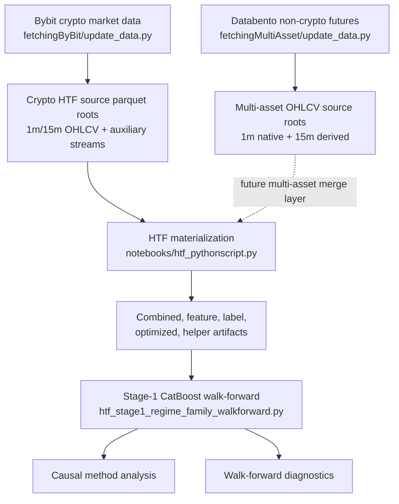

# RiskYieldMM

**Machine learning research system for multi-asset financial time series**

[](LICENSE)
[](https://python.org)
[](https://rust-lang.org)

RiskYieldMM is a research project for building leakage-aware financial
time-series ML workflows across multiple market types. The active workflow is a
multi-regime HTF pipeline that started on crypto perpetual futures and is now
being extended into a reproducible multi-asset source layer: crypto
(`BTCUSDT`, `ETHUSDT`), FX futures proxies (`EURUSD`, `USDJPY`), metals
(`GC` gold), energy (`CL` WTI crude), and equity-index futures (`ES` S&P 500,
`NQ` Nasdaq 100). It builds higher-timeframe batches, generates current
prediction labels, attaches helper/regime features, runs CatBoost walk-forward
Stage-1 experiments, and audits model-selection behavior from saved artifacts.

The current model-facing HTF materializer is still BTCUSDT-oriented while this
branch prepares normalized raw sources for the broader multi-asset dataset. New
non-crypto bars are stored in the same core OHLCV contract as Bybit klines so
the later feature/label computation and merge layer can reuse the same logic.

This is not trading advice and is not a live trading bot. The focus is ML engineering discipline: temporal validation, reproducible artifacts, auditability, and careful treatment of non-stationary market data.

## Technical Overview

This repository demonstrates the ability to build and reason about a non-trivial ML system rather than only train a single notebook model.

For concise review artifacts, see [8h/B Walk-Forward Analysis Snapshot](HTF_8H_B_WALKFORWARD_ANALYSIS.md), [Feature and Dataset Snapshot](FEATURE_AND_DATASET_SNAPSHOT.md), [Reproducibility Guide](docs/REPRODUCIBILITY.md), [HTF Data Contract](docs/data/data-contract.md), and [HTF Workflow Architecture](docs/architecture/htf-workflow-architecture.md).

| Area | Evidence |
|------|----------|
| **Data engineering** | Bybit crypto ingestion plus normalized Databento futures proxies for FX, gold, oil, S&P 500, and Nasdaq; Parquet/JSON artifact workflows |
| **Feature engineering** | Multi-regime HTF feature materialization, helper/regime features, technical/time-series feature families |
| **ML modelling** | CatBoost Stage-1 selection, LightGBM/PyTorch experiments, Ridge/linear baselines, ensemble tooling |
| **Time-series validation** | Walk-forward splits, purged windows, chronological train/test separation, leakage checks |
| **Production workflow design** | Resumable HTF launcher, artifact fingerprints, versioned metadata, run logs/status files |
| **Uncertainty estimation** | Conformal prediction, Adaptive Conformal Inference, coverage monitoring |
| **Performance engineering** | Rust/PyO3 helper implementations for Kalman, GARCH, EGARCH, CUSUM, OU, EVT, BOCPD |
| **Experiment analysis** | Six-root HTF walk-forward diagnostics, causal ensemble comparison, selector-policy audits |
| **Documentation** | Architecture notes, validation findings, run summaries, artifact specifications, implementation plans |

Generated data, precomputed caches, model outputs, personal documents, and local run artifacts are not required to review the code. Some historical output snapshots may exist in the repository as audit/reference material, but new generated data is ignored by default.

## Main Workflow

### 1. Multi-Regime HTF Pipeline

The HTF workflow is the current main path. `notebooks/htf_pythonscript.py` is now a clean production launcher; the shared source of truth for the actual materialization logic is `scripts/feature_engineering/htf_multiregime_pipeline.py`. The old mixed notebook body is archived under `Archive/`.

The workflow builds leakage-aware higher-timeframe batches for three regime lengths. Each regime is split into two families:

- `B` is the base anchored family.
- `C` is the same regime shifted by half the regime length.

The legacy column name `period_8h_start` is still kept as a compatibility alias in written artifacts, even for `24h` and `7d`; the actual regime is recorded in `batch_regime`.

Current regimes:

| Regime | Batch duration | Family `C` shift | Label entry window | Family roots |
|--------|----------------|------------------|--------------------|--------------|
| `8h` | 8 hours | 4 hours | first 4 hours | `8h/B`, `8h/C` |
| `24h` | 24 hours | 12 hours | first 12 hours | `24h/B`, `24h/C` |
| `7d` | 168 hours | 84 hours | first 84 hours | `7d/B`, `7d/C` |

Production stages inside the shared pipeline:

1. Build `1m` and `15m` combined HTF OHLCV batches for each regime/family.
2. Compute `1m` and `15m` feature batches with family metadata.
3. Compute `15m` forward distance metrics.
4. Generate `1m` labels: `target_4class` and `target_breakfree`, gated to the regime entry window.
5. Optimize model-facing `1m/target_4class` feature batches.
6. Materialize helper features from the canonical helper cache.
7. Validate combined/features/labels/optimized/helper artifacts for alignment, value ranges, missing data, and entry-window correctness.

Current model-facing roots:

| Root | Helper features | Labels | Stage-1 run id |
|------|-----------------|--------|----------------|
| `8h/B` | `data/htf_with_helpers` | `data/htf_4class_labels` | `stage1_catboost_8h_b_live` |
| `8h/C` | `data/htf_with_helpers_shift4h` | `data/htf_4class_labels_shift4h` | `stage1_catboost_8h_c_live` |
| `24h/B` | `data/htf_with_helpers_24h` | `data/htf_4class_labels_24h` | `stage1_catboost_24h_b_live` |
| `24h/C` | `data/htf_with_helpers_24h_shift12h` | `data/htf_4class_labels_24h_shift12h` | `stage1_catboost_24h_c_live` |
| `7d/B` | `data/htf_with_helpers_7d` | `data/htf_4class_labels_7d` | `stage1_catboost_7d_b_live` |
| `7d/C` | `data/htf_with_helpers_7d_shift84h` | `data/htf_4class_labels_7d_shift84h` | `stage1_catboost_7d_c_live` |

Key locations:

- `scripts/feature_engineering/compute_htf_features.py`
- `scripts/feature_engineering/htf_multiregime_pipeline.py`
- `scripts/feature_engineering/htf_kernels.py`
- `scripts/feature_engineering/htf_helper_cache.py`
- `scripts/htf_backtest/`
- `notebooks/htf_pythonscript.py`
- `notebooks/notes/`

### 2. Stage-1 CatBoost Selection Audits

Stage-1 is the main model-selection audit layer for the HTF workflow. The current regime/family runner is `scripts/analysis/htf_stage1_regime_family_walkforward.py`; it runs CatBoost on `1m/target_4class` across the six roots above, with 500 walk-forward prediction steps by default.

Stage-1 stores raw validation and prediction-batch payloads so model-selection behavior can be studied after the run without leaking future information into selector decisions. Each step records the fold windows, combo metadata, validation predictions, prediction-batch predictions, pre-decision context, and runtime profile.

Supported Stage-1 modes:

- `v1`: current benchmark path for six-root walk-forward runs.
- `v2 parity`: schema-compatible foundation for comparing against v1.
- `v2 nested_selector`: per-step recursive feature selection before final combo choice.
- `v2 fixed_policy`: replay from a fixed policy registry for selector-policy audits.

Recent Stage-1 v2 audit work includes:

- 8 action-key combinations
- 500 walk-forward steps
- 120,000 selected prediction rows
- 30 discounted-loss selector policies
- nested chronological train/validation/test selector evaluation
- pairwise prediction disagreement, conflict-edge, support-predictiveness, and subset-reduction audits

Available walk-forward analysis layers:

| Layer | Purpose | Main outputs |
|-------|---------|--------------|
| Six-root Stage-1 run | Produce live-style CatBoost walk-forward payloads for `8h/B`, `8h/C`, `24h/B`, `24h/C`, `7d/B`, `7d/C` | `data/htf_backtest_results/stage1_catboost_*_live` |
| Causal multiregime method analysis | Compare no-lookahead ensemble/post-processing methods such as online hedge, diversity subset, per-class specialist, regime router, stacking, and discounted model averaging | `test_output/htf_causal_multiregime_method_analysis/` |
| Walk-forward diagnostics | Build root profiles, cross-root summaries, base-model diagnostics, causal-method refresh tables, and feature-quality joins | `test_output/htf_walkforward_diagnostics/` |
| Stage-1 Step-2 | Run recursive SHAP feature pruning/importance analysis for `winner_only` and `root_topk` scopes | `stage1_step2_*` artifact trees under each Stage-1 run |
| Stage-1 v2 selector audits | Evaluate nested/fixed-policy selector behavior, discounted-loss policies, pairwise disagreement, and reduced combo subsets | `test_output/stage1_v2_*` |

Key locations:

- `scripts/analysis/htf_stage1_regime_family_walkforward.py`
- `scripts/analysis/htf_walkforward_diagnostics.py`
- `scripts/analysis/htf_causal_multiregime_method_analysis.py`
- `scripts/htf_backtest/catboost/stage1_runner.py`
- `scripts/htf_backtest/catboost/stage1_selector_step.py`
- `scripts/htf_backtest/catboost/stage1_step2.py`
- `scripts/analysis/htf_stage1_v2_loss_discounted_selector_audit.py`
- `scripts/analysis/htf_stage1_v2_pairwise_prediction_audit.py`
- `scripts/analysis/htf_stage1_v2_subset_reduction_audit.py`
- `docs/htf/stage1-logic.md`
- `docs/htf/stage1-artifacts.md`

### 3. Secondary Target-Model and Conformal Layer

The target-model layer is the older L2 modelling system and conformal uncertainty module. It is useful as supporting engineering evidence, but it is no longer the main HTF workflow. It includes multi-target configuration, helper features, model wrappers, validation tooling, conformal classification/regression wrappers, and Adaptive Conformal Inference.

Validated conformal outputs documented in `docs/conformal/` include regression coverage around **90.7-96.3%** against a 90% target.

Key locations:

- `scripts/target_models/pipeline.py`
- `scripts/target_models/models/`
- `scripts/target_models/helpers/`
- `scripts/target_models/calibration/`
- `scripts/target_models/validation/`
- `docs/conformal/README.md`

### 4. Rust-Accelerated Helper Computation

Performance-critical helper models are implemented in Rust and exposed to Python with PyO3/maturin.

Implemented Rust modules:

- Kalman filter
- GARCH / EGARCH
- CUSUM
- Ornstein-Uhlenbeck
- EVT / POT
- BOCPD
- HMM support

Key locations:

- `riskyield_rust/src/`
- `scripts/target_models/helpers/`

## Repository Map

```text
RiskYieldMM/
├── scripts/
│   ├── workflow/                # Original workflow orchestration and target config
│   ├── feature_engineering/     # Feature generation, HTF pipelines, helper cache
│   ├── htf_backtest/            # HTF CatBoost/LightGBM backtest and Stage-1 tooling
│   ├── analysis/                # Offline audits, diagnostics, selector analysis
│   ├── target_models/           # L2 model layer, helpers, conformal prediction
│   ├── strategy/                # Strategy research utilities
│   └── tests/                   # Focused experiment/test scripts
├── riskyield_rust/              # Rust/PyO3 helper acceleration module
├── fetchingByBit/               # Bybit data acquisition and local market data folders
├── fetchingMultiAsset/          # Databento/Twelve Data normalized non-crypto source layer
├── prediction_analysis/         # Historical research outputs and reports
├── test_output/                 # Local/generated audit outputs and snapshots
├── data/                        # Local/generated datasets and backtest artifacts
├── docs/                        # Organized documentation map and maintained topic docs
│   ├── htf/                     # Current HTF pipeline, Stage-1, labels, artifacts
│   ├── data/                    # Data-source contracts and target-labeling notes
│   ├── validation/              # Leakage, validation, and adaptive evaluation docs
│   ├── modeling/                # L2/multi-model/ensemble research docs
│   └── plans/                   # Implementation/refactor/status plans
├── notebooks/notes/             # Chronological research and audit notes
└── Archive/                     # Legacy implementations kept for reference

```

## Data Sources and Prediction Targets

The project is moving from a crypto-only raw layer to a multi-asset raw layer.
The current core source mix is:

- Bybit crypto perpetuals: `BTCUSDT`, `ETHUSDT`
- Databento CME FX futures proxies: `EURUSD` from `6E.v.0`, `USDJPY` from
  inverted `6J.v.0`
- Databento commodities: `GC.v.0` gold futures, `CL.v.0` WTI crude futures
- Databento equity-index futures: `ES.v.0` E-mini S&P 500, `NQ.v.0` E-mini
  Nasdaq 100

Crypto sources include Bybit-specific auxiliary streams where available:

- funding rates
- open interest
- long/short ratios
- mark price
- index price
- premium price data

Non-crypto sources currently use normalized OHLCV bars only. They intentionally
do not synthesize crypto-specific auxiliary streams such as funding, account
ratios, or Bybit mark/index premium data.

### Current HTF Targets

The current HTF workflow centers on `target_4class`, generated from hybrid `1m`/`15m` forward distance and breakout/risk metrics inside the HTF batch structure. Labels are only valid during the entry window of each regime (`4h`, `12h`, or `84h`); later rows are set to `-1`.

| Value | Class | Meaning |
|-------|-------|---------|
| `0` | `DOWN_BALANCED` | downside outcome without expansion/risk trigger |
| `1` | `DOWN_EXPANSION` | downside outcome with expansion/risk behavior |
| `2` | `UP_BALANCED` | upside outcome without expansion/risk trigger |
| `3` | `UP_EXPANSION` | upside outcome with expansion/risk behavior |

Invalid or unresolved rows are marked as `-1` and excluded from training/evaluation where required.

`target_breakfree` is a secondary label derived from `target_4class` plus a `1m` end-return breakfree threshold. It uses three classes:

- `UP_ABOVE_BREAKFREE`
- `DOWN_ABOVE_BREAKFREE`
- `IN_BETWEEN_BELOW_BREAKFREE`

Older targets such as next-period direction, volatility regime, trend regime, triple-barrier outcomes, and return/volatility regression belong to the legacy L2 target-model layer. They remain in the repository for research history and conformal-prediction work, but they should not be read as the current main HTF objective.

## Review Path

For a technical reviewer, the highest-signal path is:

1. Read the production launcher and shared HTF pipeline:
   - `notebooks/htf_pythonscript.py`
   - `scripts/feature_engineering/htf_multiregime_pipeline.py`
2. Inspect the active target logic:
   - `scripts/feature_engineering/htf_kernels.py`
   - `scripts/feature_engineering/htf_shared_config.py`
3. Inspect the current walk-forward layer:
   - `scripts/analysis/htf_stage1_regime_family_walkforward.py`
   - `scripts/htf_backtest/catboost/stage1_runner.py`
   - `docs/htf/stage1-artifacts.md`
4. Inspect the analysis stack:
   - `scripts/analysis/htf_walkforward_diagnostics.py`
   - `scripts/analysis/htf_causal_multiregime_method_analysis.py`
   - `scripts/analysis/htf_stage1_v2_loss_discounted_selector_audit.py`
   - `scripts/analysis/htf_stage1_v2_pairwise_prediction_audit.py`
   - `scripts/analysis/htf_stage1_v2_subset_reduction_audit.py`

## Quick Start for Reviewers

Full reproduction requires local market data under `data/` and `fetchingByBit/`. For lightweight technical review, start with a lightweight environment and run import/syntax checks.

```bash
git clone https://github.com/Pr3ez/RiskYieldMM.git
cd RiskYieldMM

conda create -n riskyieldmm python=3.10 -y
conda activate riskyieldmm

python -m pip install --upgrade pip
python -m pip install -e ".[research,dev]"

# Basic source smoke check.
python -m compileall scripts riskyield_rust -q

# Lightweight HTF workflow contract check.
python -m pytest tests/test_htf_workflow_contract.py -q

# Full test discovery. Some registry/data tests require generated parquet
# datasets under data/datasets/.
python -m pytest --collect-only -q
```

Optional Rust helper build:

```bash
cd riskyield_rust
python -m pip install -e "../.[rust]"
maturin develop --release
cd ..
```

Useful entry points for review:

- `docs/htf/stage1-logic.md`
- `docs/htf/stage1-artifacts.md`
- `scripts/analysis/htf_stage1_regime_family_walkforward.py`
- `scripts/analysis/htf_walkforward_diagnostics.py`
- `scripts/analysis/htf_causal_multiregime_method_analysis.py`
- `scripts/feature_engineering/htf_multiregime_pipeline.py`
- `scripts/feature_engineering/htf_kernels.py`
- `notebooks/htf_stage1.py`
- `docs/conformal/README.md`
- `docs/validation/`
- `scripts/analysis/`
- `scripts/htf_backtest/catboost/`
- `scripts/target_models/calibration/`
- `riskyield_rust/src/`

## End-To-End Local HTF Workflow

Full reproduction is a local-data workflow. The repository intentionally does
not upload raw Bybit/Databento data, generated feature batches, precomputed
caches, helper caches, model payloads, or full walk-forward outputs. To rebuild
the workflow locally, run the stages in this order:



The operational rule is simple: update raw data first, build HTF artifacts
second, run Stage-1 third, and only then run diagnostics. Do not reuse old
walk-forward outputs after changing feature, label, helper, or batch-regime
logic.

### 1. Prepare the Environment

Run from the repository root unless a command explicitly changes directory.

```bash
conda create -n riskyieldmm python=3.10 -y
conda activate riskyieldmm

python -m pip install --upgrade pip
python -m pip install -e ".[research,dev]"
```

Optional Rust helper build:

```bash
cd riskyield_rust
python -m pip install -e "../.[rust]"
maturin develop --release
cd ..
```

Before a long run, verify that the source tree imports cleanly:

```bash
python -m compileall scripts riskyield_rust -q
python -m pytest tests/test_htf_workflow_contract.py -q
```

### 2. Fetch and Verify HTF Source Data

For the new core multi-asset dataset, use the repo-root orchestrator. The default
period is the original Bybit period, `2021-01-01` through `now`, applied
consistently across every core source. It runs providers in the fixed order we
want:

```text
Bybit crypto -> Databento non-crypto futures
```

Normal dry-run:

```bash
python update_data.py --core --dry-run
```

Estimate without writes:

```bash
python update_data.py --core --estimate-only
```

Real full core fetch, same period as Bybit:

```bash
python update_data.py --core
```

The root command uses the core source mix only: Bybit `BTCUSDT,ETHUSDT` and
Databento `EURUSD,USDJPY,GC,CL,ES,NQ`. `EURUSD` is the CME Euro FX futures proxy
`6E.v.0`; `USDJPY` is the CME Japanese Yen futures proxy `6J.v.0` inverted into
a USD/JPY-like price path. Twelve Data remains available only as a manual
fallback/reference adapter, not part of the normal core fetch.

The supported data-update entry point is `fetchingByBit/update_data.py`. For the
active HTF workflow, treat this as a source-data refresh for the Python
materializer: native `1m` and `15m` OHLCV, native `1m`/`15m` mark, index, and
premium price streams, `5m`/`15m` open interest, `5m`/`15m` long/short ratio, and
the fixed funding-rate stream. The current HTF materializer does not consume
downloaded/native `8h` candles. If `fetchingByBit/sorted-8h-bybit-linear/`
exists, treat it as a derived compatibility output built from `4h` data for
older/supporting workflows, not as the source of the `8h` regime described
above. The default crypto fetcher configuration is `BTCUSDT` and `ETHUSDT`,
`linear`, from `2021-01-01` through `now`; edit
`fetchingByBit/source_config.py` only if you need a different Bybit symbol set,
and edit `fetchingByBit/fetch_bybit_market_data.py` only if you need a different
market category, date range, or configured timeframe set.

```bash
cd fetchingByBit

# Inspect current local coverage.
python update_data.py --status

# Preview the update plan without writing data.
python update_data.py --dry-run --start-date 2024-01-01 --end-date 2024-02-01

# Fetch missing public market data for the HTF source contract,
# then refresh compatibility outputs and verify.
python update_data.py --start-date 2024-01-01 --end-date 2024-02-01

# Re-run verification only.
python update_data.py --verify

cd ..
```

Expected source inputs for each configured Bybit symbol are:

The current HTF materializer is still BTCUSDT-oriented; the ETHUSDT files are
the first multi-asset source layer and are intended for the upcoming dataset
unification work.

| Source root | HTF role | Expected resolution |
|---|---|---|
| `fetchingByBit/sorted-1m-bybit-linear/` | model-facing rows and `1m` labels | native `1m` |
| `fetchingByBit/sorted-15m-bybit-linear/` | `15m` features and forward-distance metrics | native `15m` |
| `fetchingByBit/mark-price-1m-bybit-linear/`, `fetchingByBit/mark-price-15m-bybit-linear/` | mark-price context | native `1m` and native `15m` |
| `fetchingByBit/index-price-1m-bybit-linear/`, `fetchingByBit/index-price-15m-bybit-linear/` | index-price context | native `1m` and native `15m` |
| `fetchingByBit/premium-price-1m-bybit-linear/`, `fetchingByBit/premium-price-15m-bybit-linear/` | premium/basis context | native `1m` and native `15m` |
| `fetchingByBit/open-interest-5m-bybit-linear/`, `fetchingByBit/open-interest-15m-bybit-linear/` | open-interest context | `5m` broadcasts into `1m`; `15m` is native |
| `fetchingByBit/long-short-ratio-5m-bybit-linear/`, `fetchingByBit/long-short-ratio-15m-bybit-linear/` | long/short positioning context | `5m` broadcasts into `1m`; `15m` is native |
| `fetchingByBit/funding-rate-bybit-linear/` | funding-rate context | fixed `8h` source broadcasts into HTF rows |

The fetcher may also refresh `5m`, `1h`, `4h`, and `1d` OHLCV roots for research
coverage and backward compatibility. Those roots are not substitutes for the
native `1m` and `15m` HTF inputs. OHLCV and auxiliary `*-8h-*` fetcher roots are
derived compatibility outputs built from `4h`, not primary inputs to
`notebooks/htf_pythonscript.py`.

`python update_data.py --status` prints the same local source-resolution plan
used by `HTFFeatureEngine`. For the current HTF workflow, the important status is
the `HTF FEATURE SOURCE RESOLUTION` block: `1m` and `15m` OHLCV, mark price,
index price, and premium price should resolve natively; open interest should
resolve from `5m` into `1m` and natively for `15m`; long/short ratio should
resolve from `5m` into `1m` and natively for `15m`; funding rate should broadcast
from the fixed `8h` Bybit source. A warning on long/short ratio means the local
tree is still falling back to older `1h` files and should be refreshed.

`python update_data.py --verify` is a historical data-quality check, not only a
command-health check. The update can finish successfully while this monitor still
reports older raw-source gaps. Treat that as a data-quality finding for affected
training/backtest windows: fill the raw source, or restrict and validate the
downstream run so selected HTF batches do not depend on the missing intervals.

### 2a. Fetch Normalized Multi-Asset OHLCV Sources

Non-crypto source bars live in `fetchingMultiAsset/`. The core dataset uses
Databento futures proxies:

- `EURUSD` from CME Euro FX futures `6E.v.0`
- `USDJPY` from CME Japanese Yen futures `6J.v.0`, inverted to USD/JPY-like prices
- `GC` gold futures from `GC.v.0`
- `CL` WTI crude futures from `CL.v.0`
- `ES` E-mini S&P 500 futures from `ES.v.0`
- `NQ` E-mini Nasdaq 100 futures from `NQ.v.0`

Twelve Data remains configured for exact/cash-style symbols, but is no longer
part of the normal core fetch because its historical request limits are too
tight for this backfill.

The model-facing parquet files intentionally use the same core OHLCV contract as
Bybit klines:

```text
timestamp, open, high, low, close, volume, turnover, interval
```

Provider metadata stays in `fetchingMultiAsset/asset_config.py` and progress
sidecars so later HTF feature/label materialization can reuse the same raw bar
logic per asset without extra parquet columns.

```bash
cd fetchingMultiAsset

# Create the ignored local secrets file once.
cp local_secrets.example.env local_secrets.env
# Then edit local_secrets.env and set DATABENTO_API_KEY=...
# TWELVE_DATA_API_KEY is optional fallback/reference only.

# Install Databento SDK if you plan to use futures data.
python -m pip install databento

# Check Databento access and optional Twelve Data fallback mappings.
python preflight_providers.py

# Inspect current local coverage for the intended production source mix:
# Databento EURUSD/USDJPY/GC/CL/ES/NQ.
python update_data.py --status --core --htf-only

# Preview the 1m/15m HTF source plan without writes.
python update_data.py --core --dry-run --htf-only --start-date 2024-01-01 --end-date 2024-02-01

# Optional Twelve Data fallback/reference checks only.
python update_data.py --providers twelvedata --discover-symbols

# Estimate selected Databento futures before spending historical-data credits.
python update_data.py --providers databento --core --estimate-only --htf-only

# Fetch selected Databento futures. A positive cost ceiling is required; 1m is
# fetched once and requested higher intervals are derived locally.
python update_data.py --providers databento --core --htf-only --max-databento-cost-usd 50

# Audit every configured adapter, including Twelve fallback symbols for
# gold/oil/indexes. Do not use this as the normal production fetch command.
python update_data.py --all --dry-run --htf-only

cd ..
```

Example output roots:

| Source root | HTF role | Expected resolution |
|---|---|---|
| `fetchingMultiAsset/sorted-1m-databento-futures/` | model-facing rows and `1m` labels per futures proxy | native `1m` |
| `fetchingMultiAsset/sorted-15m-databento-futures/` | `15m` futures features derived from Databento `1m` bars | local aggregate |

The unified multi-asset fetcher resumes from the latest local timestamp.
Databento resumes from the latest stored `1m` bar, then derives requested higher
intervals locally. Twelve Data resumes per asset/interval only when that
fallback adapter is selected explicitly. `end-date=now` is capped to a
Databento provider-safe, account-entitled available end for the normal core
fetch. The fetcher does not synthesize candles for weekends or closed sessions.

Databento can report provider-side degraded-quality days. Those warnings do not
mean the fetch failed, but they should be kept as data-quality notes before
training/backtesting. For a clean production backfill, remove ignored local
probe/output batches for an asset before starting the full run; otherwise resume
logic intentionally continues from the newest local `1m` bar it finds.

These files match the core Bybit kline OHLCV schema, but non-crypto providers
do not supply Bybit-specific auxiliary derivative streams such as funding, open
interest, mark/index premium, or account ratios.

For an explicit JSON quality report:

```bash
cd fetchingByBit
python data_quality_monitor.py \
  --base-dir . \
  --symbol BTCUSDT \
  --category linear \
  --export-report ../test_output/bybit_data_quality_report.json

python data_quality_monitor.py \
  --base-dir . \
  --symbol ETHUSDT \
  --category linear \
  --export-report ../test_output/bybit_data_quality_report_ethusdt.json
cd ..
```

If the quality monitor reports critical gaps, inspect the affected source and
date range before running feature materialization. The downstream walk-forward
scripts assume chronological coverage is continuous enough for the selected
prediction batches.

### 3. Build HTF Features, Labels, and Helpers

The production HTF launcher is:

```bash
python notebooks/htf_pythonscript.py
```

This script resolves the project root, writes run logs under
`test_output/htf_run_logs/`, builds a `MultiRegimeHTFConfig`, and delegates stage
execution to `scripts/feature_engineering/htf_multiregime_pipeline.py`.

The materialization stage builds all current regime/family roots:

| Root | Final model-facing features | Labels |
|---|---|---|
| `8h/B` | `data/htf_with_helpers/1m/target_4class/` | `data/htf_4class_labels/1m/` |
| `8h/C` | `data/htf_with_helpers_shift4h/1m/target_4class/` | `data/htf_4class_labels_shift4h/1m/` |
| `24h/B` | `data/htf_with_helpers_24h/1m/target_4class/` | `data/htf_4class_labels_24h/1m/` |
| `24h/C` | `data/htf_with_helpers_24h_shift12h/1m/target_4class/` | `data/htf_4class_labels_24h_shift12h/1m/` |
| `7d/B` | `data/htf_with_helpers_7d/1m/target_4class/` | `data/htf_4class_labels_7d/1m/` |
| `7d/C` | `data/htf_with_helpers_7d_shift84h/1m/target_4class/` | `data/htf_4class_labels_7d_shift84h/1m/` |

The launcher runs these stages:

1. Build `1m` and `15m` combined HTF batches.
2. Compute `1m` and `15m` feature batches.
3. Compute `15m` distance metrics.
4. Generate `1m/target_4class` and `target_breakfree` labels.
5. Optimize `1m/target_4class` model-facing features.
6. Build and materialize helper features.
7. Validate alignment, required columns, metadata, null behavior, helper
   contracts, and entry-window correctness.

Important run files:

| Artifact | Location |
|---|---|
| live log | `test_output/htf_run_logs/htf_pythonscript_<timestamp>_pid<pid>.log` |
| heartbeat/status JSON | `test_output/htf_run_logs/htf_pythonscript_<timestamp>_pid<pid>_status.json` |
| final features | `data/htf_with_helpers*/1m/target_4class/batch_*.parquet` |
| final labels | `data/htf_4class_labels*/1m/batch_*.parquet` |
| helper cache | `data/htf_helper_cache/` |

For normal incremental updates, run `notebooks/htf_pythonscript.py` as-is. If
feature semantics, helper contracts, or artifact versions change, update the
launcher config intentionally before rebuilding, especially
`MULTI_REGIME_FORCE_FULL_REBUILD`, smoke-mode bounds, and the shared artifact
version in `scripts/feature_engineering/htf_shared_config.py`.

### 4. Resolve the Stage-1 Walk-Forward Plan

Before training, ask the runner to print and persist the resolved execution
plan:

```bash
python scripts/analysis/htf_stage1_regime_family_walkforward.py --plan-only
```

The plan is written under `test_output/htf_stage1_regime_family_walkforward/`
and includes selected roots, feature directories, label directories, run ids,
prediction-batch limits, Stage-1 version, and selector configuration.

For a small local smoke run:

```bash
python scripts/analysis/htf_stage1_regime_family_walkforward.py \
  --roots 8h/B \
  --n-steps 5 \
  --resume-mode skip_completed \
  --runtime-mode routine
```

For the standard six-root Stage-1 v1 run:

```bash
python scripts/analysis/htf_stage1_regime_family_walkforward.py \
  --n-steps 500 \
  --resume-mode skip_completed \
  --runtime-mode routine
```

For a bounded `8h/B` Stage-1 v2 fixed-policy run, use this shape only when the
root already has the required fixed-policy registry:

```bash
python scripts/analysis/htf_stage1_regime_family_walkforward.py \
  --roots 8h/B \
  --stage1-version v2 \
  --stage1-v2-execution-mode fixed_policy \
  --runtime-mode routine \
  --pred-batch-min 5170 \
  --pred-batch-max 5669 \
  --n-steps 500 \
  --resume-mode skip_completed
```

The current Stage-1 profile is GPU-oriented through CatBoost parameters. On a
CPU-only machine, expect to adjust CatBoost runtime parameters before attempting
a full 500-step run.

### 5. Inspect Stage-1 Outputs

Stage-1 writes one run tree per regime/family:

```text
data/htf_backtest_results/stage1_catboost_8h_b_live/
data/htf_backtest_results/stage1_catboost_8h_c_live/
data/htf_backtest_results/stage1_catboost_24h_b_live/
data/htf_backtest_results/stage1_catboost_24h_c_live/
data/htf_backtest_results/stage1_catboost_7d_b_live/
data/htf_backtest_results/stage1_catboost_7d_c_live/
```

Key files and folders:

| Artifact | Meaning |
|---|---|
| `run_summary.json` | root-level run summary |
| `stage1_run_state.json` | resume/progress state |
| `stage1_progress.parquet` | per-step status rows |
| `catboost/1m/target_4class/batch_*/stage1/` | raw validation and prediction-batch payloads |
| `stage1_step_summary.json` | per-step health and leakage-guard summary |
| `stage1_val_predictions.parquet` | validation predictions for each combo/fold |
| `stage1_pred_batch_predictions.parquet` | prediction-batch payloads for downstream audits |
| `stage1_predecision_context.*` | leakage-safe state snapshot before scoring |

Treat these payloads as the audit source of truth. Metrics and selector-policy
analysis should be rebuilt from these saved predictions rather than recomputed
with future information.

### 6. Run Post-Walk-Forward Analysis

Run causal no-lookahead method analysis across the six roots:

```bash
python scripts/analysis/htf_causal_multiregime_method_analysis.py --verbose
```

Expected output:

```text
test_output/htf_causal_multiregime_method_analysis/<timestamp>/
```

Run walk-forward diagnostics:

```bash
python scripts/analysis/htf_walkforward_diagnostics.py --phases audit
```

For feature-importance and Step-2 pruning analysis, use the heavier diagnostic
phases after Stage-1 outputs are complete:

```bash
python scripts/analysis/htf_walkforward_diagnostics.py \
  --phases audit,winner_only,root_topk \
  --feature-importance-types PredictionValuesChange,LossFunctionChange
```

Expected output:

```text
test_output/htf_walkforward_diagnostics/<timestamp>/
```

The tracked review snapshots summarize selected local outputs:

- `HTF_8H_B_WALKFORWARD_ANALYSIS.md`
- `FEATURE_AND_DATASET_SNAPSHOT.md`
- `docs/htf/stage1-logic.md`
- `docs/htf/stage1-artifacts.md`

### 7. Operational Checklist

Before considering a workflow run complete, verify:

1. `python fetchingByBit/update_data.py --status` shows the expected HTF source
   resolution for `1m` and `15m`, and `python fetchingByBit/update_data.py
   --verify` finishes without critical gaps.
2. `notebooks/htf_pythonscript.py` finishes with validation passing for the
   intended regimes and families.
3. Final model-facing feature roots exist under `data/htf_with_helpers*/`.
4. Matching label roots exist under `data/htf_4class_labels*/`.
5. `python scripts/analysis/htf_stage1_regime_family_walkforward.py --plan-only`
   points to the expected feature, label, and run-id roots.
6. Stage-1 run summaries exist under `data/htf_backtest_results/`.
7. Post-run diagnostics exist under `test_output/`.
8. Any reviewer-facing summary in the repository points to tracked snapshots or
   clearly marks raw `data/` artifacts as local-only.

## Common Commands

Show available Stage-1 selector audit options:

```bash
python scripts/analysis/htf_stage1_regime_family_walkforward.py --help
python scripts/analysis/htf_walkforward_diagnostics.py --help
python scripts/analysis/htf_causal_multiregime_method_analysis.py --help
python scripts/analysis/htf_stage1_v2_loss_discounted_selector_audit.py --help
python scripts/analysis/htf_stage1_v2_pairwise_prediction_audit.py --help
python scripts/analysis/htf_stage1_v2_subset_reduction_audit.py --help
```

Resolve the current six-root Stage-1 execution plan without launching the full run:

```bash
python scripts/analysis/htf_stage1_regime_family_walkforward.py --plan-only
```

Run the full HTF materialization workflow only when local market data is available:

```bash
python notebooks/htf_pythonscript.py
```

Run a syntax check:

```bash
python -m compileall scripts riskyield_rust -q
```

Run Ruff if installed:

```bash
ruff check scripts
```

Check Rust helper build status after installing `riskyield_rust`:

```python
from scripts.workflow.l1_helpers import print_rust_status
print_rust_status()
```

## Validation Principles

RiskYieldMM is built around financial time-series validation constraints:

1. **Chronological separation** - training, validation, and prediction windows are ordered in time.
2. **Leakage checks** - feature generation and helper outputs are audited for future-information leakage.
3. **Purged evaluation** - validation logic uses gaps/purges where needed to reduce overlap leakage.
4. **Artifact-first analysis** - raw prediction payloads, metrics, masks, summaries, and run metadata are persisted for offline audit.
5. **Selector discipline** - Stage-1 selector policies are evaluated with nested chronological splits instead of selecting directly on final test behavior.
6. **Uncertainty monitoring** - conformal prediction and coverage diagnostics are used where prediction certainty matters.

## Documentation Index

Start with [`docs/README.md`](docs/README.md) for the organized documentation
map. High-signal documents:

- [`docs/htf/stage1-logic.md`](docs/htf/stage1-logic.md) - isolated Stage-1 design and leakage constraints
- [`docs/htf/stage1-artifacts.md`](docs/htf/stage1-artifacts.md) - Stage-1 artifact contract
- [`docs/htf/stage1-step2-plan.md`](docs/htf/stage1-step2-plan.md) - feature-pruning and baseline-vs-filtered analysis
- [`notebooks/notes/README.md`](notebooks/notes/README.md) - chronological research-note index
- [`notebooks/notes/htf_feature_importance_collection_before_after_2026-04-19.md`](notebooks/notes/htf_feature_importance_collection_before_after_2026-04-19.md) - current walk-forward diagnostics and feature-importance collection flow
- [`notebooks/notes/htf_causal_multiregime_method_analysis_2026-04-02.md`](notebooks/notes/htf_causal_multiregime_method_analysis_2026-04-02.md) - causal method analysis across the six HTF roots
- [`docs/conformal/README.md`](docs/conformal/README.md) - conformal prediction module summary
- [`docs/conformal/ARCHITECTURE.md`](docs/conformal/ARCHITECTURE.md) - conformal integration details
- [`docs/validation/validation-testing-research.md`](docs/validation/validation-testing-research.md) - validation research notes
- [`Archive/README.md`](Archive/README.md) - legacy implementation/archive index

## Technology Stack

Core stack:

- Python 3.10+
- Polars, pandas, NumPy, SciPy
- scikit-learn
- CatBoost, LightGBM, XGBoost
- PyTorch
- MAPIE/conformal prediction
- Optuna, MLflow
- Parquet/JSON artifacts
- Rust, PyO3, maturin

Development tools:

- Linux/Ubuntu
- Git
- Jupyter / notebooks
- VS Code
- Ruff


## Community And Governance

- Contributions: see [CONTRIBUTING.md](CONTRIBUTING.md).
- Code of conduct: see [CODE_OF_CONDUCT.md](CODE_OF_CONDUCT.md).
- Security-sensitive reports: see [SECURITY.md](SECURITY.md).
- GitHub issue and pull request templates live under [.github/](.github/).

## License

Apache License 2.0. See [LICENSE](LICENSE).

## Author

Przemysław Augustyniak  
GitHub: https://github.com/Pr3ez
