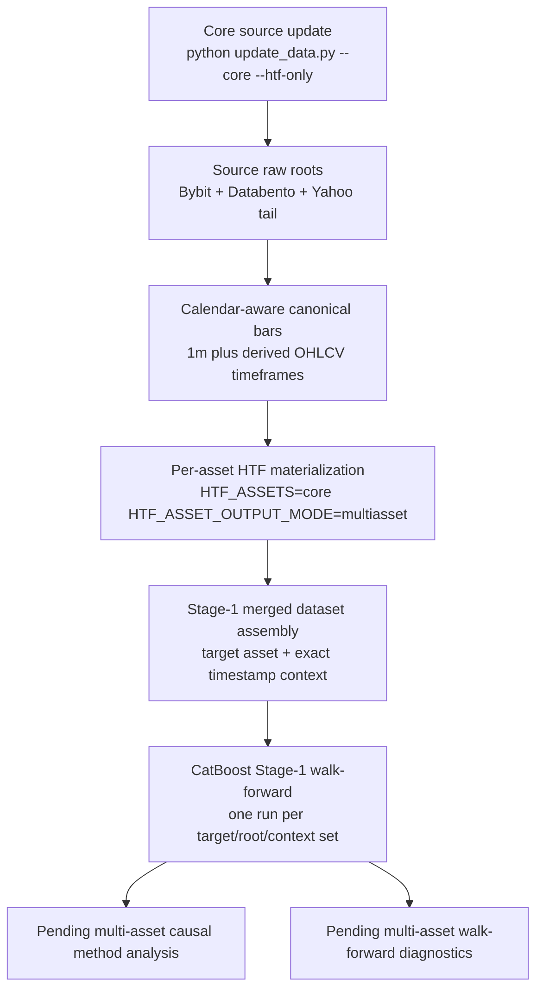

# RiskYieldMM

**Machine learning research system for multi-asset financial time series**

[](LICENSE)
[](https://python.org)
[](https://rust-lang.org)

RiskYieldMM is a research project for building leakage-aware financial
time-series ML workflows across multiple market types. The active workflow is a
multi-regime HTF pipeline that started on crypto perpetual futures and is now
being extended into a reproducible multi-asset source layer: crypto
(`BTCUSDT`, `ETHUSDT`), FX futures proxies (`EURUSD`, `USDJPY`), metals
(`GC` gold), energy (`CL` WTI crude), and equity-index futures (`ES` S&P 500,
`NQ` Nasdaq 100). It builds higher-timeframe batches, generates current
prediction labels, attaches helper/regime features, and keeps the legacy
CatBoost Stage-1 audit layer available. The Stage-1 launcher can now build
target-asset/context-asset merged datasets from the per-asset HTF roots before
running the existing walk-forward engine.

The current model-facing HTF materializer is asset-aware. Crypto, FX futures
proxies, commodities, and equity-index futures are prepared as separate HTF
artifact trees first; Stage-1 analysis can then choose the prediction target and
optionally add causal cross-asset context by exact timestamp joins.

This is not trading advice and is not a live trading bot. The focus is ML engineering discipline: temporal validation, reproducible artifacts, auditability, and careful treatment of non-stationary market data.

## Technical Overview

This repository demonstrates the ability to build and reason about a non-trivial ML system rather than only train a single notebook model.

For concise review artifacts, see [8h/B Walk-Forward Analysis Snapshot](HTF_8H_B_WALKFORWARD_ANALYSIS.md), [Feature and Dataset Snapshot](FEATURE_AND_DATASET_SNAPSHOT.md), [Reproducibility Guide](docs/REPRODUCIBILITY.md), [HTF Data Contract](docs/data/data-contract.md), and [HTF Workflow Architecture](docs/architecture/htf-workflow-architecture.md).

| Area | Evidence |
|------|----------|
| **Data engineering** | Bybit crypto ingestion plus normalized Databento futures proxies for FX, gold, oil, S&P 500, and Nasdaq; Parquet/JSON artifact workflows |
| **Feature engineering** | Multi-regime HTF feature materialization, helper/regime features, technical/time-series feature families |
| **ML modelling** | CatBoost Stage-1 selection, LightGBM/PyTorch experiments, Ridge/linear baselines, ensemble tooling |
| **Time-series validation** | Walk-forward splits, purged windows, chronological train/test separation, leakage checks |
| **Production workflow design** | Resumable HTF launcher, artifact fingerprints, versioned metadata, run logs/status files |
| **Uncertainty estimation** | Conformal prediction, Adaptive Conformal Inference, coverage monitoring |
| **Performance engineering** | Rust/PyO3 helper implementations for Kalman, GARCH, EGARCH, CUSUM, OU, EVT, BOCPD |
| **Experiment analysis** | Six-root HTF walk-forward diagnostics, causal ensemble comparison, selector-policy audits |
| **Documentation** | Architecture notes, validation findings, run summaries, artifact specifications, implementation plans |

Generated data, precomputed caches, model outputs, personal documents, and local run artifacts are not required to review the code. Some historical output snapshots may exist in the repository as audit/reference material, but new generated data is ignored by default.

## Main Workflow

### 1. Multi-Regime HTF Pipeline

The HTF workflow is the current main path. `notebooks/htf_pythonscript.py` is now a clean production launcher; the shared source of truth for the actual materialization logic is `scripts/feature_engineering/htf_multiregime_pipeline.py`. The old mixed notebook body is archived under `Archive/`.

The workflow builds leakage-aware higher-timeframe batches. A calendar-aware
canonical OHLCV layer normalizes raw provider bars before HTF materialization:
crypto uses a 24/7 minute grid, while Monday-Friday/session assets learn open
session segments from the locally fetched parquet data. Open-session gaps are
filled as zero-volume carry-forward candles with explicit flags; closed
sessions and weekends are not filled. Crypto and session assets now use the
full `8h`, `24h`, and `7d` regime set by default. Each active regime is split
into two families:

- `B` is the base anchored family.
- `C` is the same regime shifted by half the regime length.

The legacy column name `period_8h_start` is still kept as a compatibility alias in written artifacts, even for `24h` and `7d`; the actual regime is recorded in `batch_regime`.

Available regimes:

| Regime | Batch duration | Family `C` shift | Label entry window | Family roots |
|--------|----------------|------------------|--------------------|--------------|
| `8h` | 8 hours | 4 hours | first 4 hours | `8h/B`, `8h/C` |
| `24h` | 24 hours | 12 hours | first 12 hours | `24h/B`, `24h/C` |
| `7d` | 168 hours | 84 hours | first 84 hours | `7d/B`, `7d/C` |

Production stages inside the shared pipeline for each selected asset:

1. Build calendar-aware canonical `1m` bars and derived canonical OHLCV bars.
2. Build `1m` and `15m` combined HTF OHLCV batches for each regime/family.
3. Compute `1m` and `15m` feature batches with family metadata.
4. Compute `15m` forward distance metrics.
5. Generate `1m` labels: `target_4class` and `target_breakfree`, gated to the regime entry window.
6. Optimize model-facing `1m/target_4class` feature batches.
7. Materialize helper features from the canonical helper cache.
8. Validate combined/features/labels/optimized/helper artifacts for alignment, value ranges, missing data, and entry-window correctness.

Current multi-asset model-facing roots are asset-scoped:

```text
data/htf_multiasset/{asset}/htf_with_helpers*/1m/target_4class/
data/htf_multiasset/{asset}/htf_4class_labels*/1m/
```

The supported core asset set is:

```text
BTCUSDT, ETHUSDT, EURUSD, USDJPY, GC, CL, ES, NQ
```

Labels are prepared per target asset. The current label policy is:

```text
B entry half -> C first-half outcome window
C entry half -> next B first-half outcome window
```

The newest tail can remain unlabeled until the future opposite-family window is
available. That is expected and should not be filled manually.

For session-based assets (`EURUSD`, `USDJPY`, `GC`, `CL`, `ES`, `NQ`), the
opposite-family label lookup is keyed by the actual family period start, not by
sequential batch number. This prevents weekend or maintenance-session closures
from shifting B/C batch ids and labeling against the wrong opposite-family
window. Session `24h` and `7d` completeness is calendar-aware: expected rows are
the expected market-open timestamps inside each period, not fixed 24/7 row
counts. To temporarily restrict session assets during a rollback or smoke run,
set `HTF_SESSION_REGIMES=8h`.

HTF materialization includes guarded speedups for the expensive label-distance
and optimizer-selection stages. The label fast path is only used for the active
opposite-family window shape and falls back to the reference kernel otherwise.
Optimizer selection reuses causal rolling ranks by window, with parity tests and
selection-signature invalidation to preserve the existing temporal contract. Its
validation rank cache is built in parallel across feature columns while keeping
the same streaming buffer behavior as the reference transformer.

Key locations:

- `scripts/feature_engineering/compute_htf_features.py`
- `scripts/feature_engineering/htf_multiregime_pipeline.py`
- `scripts/feature_engineering/htf_kernels.py`
- `scripts/feature_engineering/htf_helper_cache.py`
- `scripts/htf_backtest/`
- `notebooks/htf_pythonscript.py`
- `notebooks/notes/`

### 2. Stage-1 CatBoost Selection Audits

Stage-1 is the main model-selection audit layer for the HTF workflow. The
launcher still uses the existing CatBoost walk-forward engine, but it can now
build a Stage-1-compatible merged dataset from per-asset HTF roots first. Each
merged run has one prediction target asset; selected context assets are joined
by exact `timestamp`, and labels always come only from the target asset.

Stage-1 stores raw validation and prediction-batch payloads so model-selection behavior can be studied after the run without leaking future information into selector decisions. Each step records the fold windows, combo metadata, validation predictions, prediction-batch predictions, pre-decision context, and runtime profile.

Supported Stage-1 modes:

- `v1`: current benchmark path for regime/family walk-forward runs.
- `v2 parity`: schema-compatible foundation for comparing against v1.
- `v2 nested_selector`: per-step recursive feature selection before final combo choice.
- `v2 fixed_policy`: replay from a fixed policy registry for selector-policy audits.

Recent Stage-1 v2 audit work includes:

- 8 action-key combinations
- 500 walk-forward steps
- 120,000 selected prediction rows
- 30 discounted-loss selector policies
- nested chronological train/validation/test selector evaluation
- pairwise prediction disagreement, conflict-edge, support-predictiveness, and subset-reduction audits

Available walk-forward analysis layers:

| Layer | Purpose | Main outputs |
|-------|---------|--------------|
| Legacy Stage-1 run | Produce live-style CatBoost walk-forward payloads for the current regime/family roots | `data/htf_backtest_results/stage1_catboost_*_live` |
| Multi-asset Stage-1 dataset assembly | Build target/context feature roots that preserve the existing Stage-1 file contract | `data/htf_multiasset_merged/{target}/{context_hash}/...` |
| Causal multiregime method analysis | Compare no-lookahead ensemble/post-processing methods such as online hedge, diversity subset, per-class specialist, regime router, stacking, and discounted model averaging | `test_output/htf_causal_multiregime_method_analysis/` |
| Walk-forward diagnostics | Build root profiles, cross-root summaries, base-model diagnostics, causal-method refresh tables, and feature-quality joins | `test_output/htf_walkforward_diagnostics/` |
| Stage-1 Step-2 | Run recursive SHAP feature pruning/importance analysis for `winner_only` and `root_topk` scopes | `stage1_step2_*` artifact trees under each Stage-1 run |
| Stage-1 v2 selector audits | Evaluate nested/fixed-policy selector behavior, discounted-loss policies, pairwise disagreement, and reduced combo subsets | `test_output/stage1_v2_*` |

Key locations:

- `scripts/analysis/htf_stage1_regime_family_walkforward.py`
- `scripts/htf_backtest/catboost/stage1_multiasset_dataset.py`
- `scripts/analysis/htf_walkforward_diagnostics.py`
- `scripts/analysis/htf_causal_multiregime_method_analysis.py`
- `scripts/htf_backtest/catboost/stage1_runner.py`
- `scripts/htf_backtest/catboost/stage1_selector_step.py`
- `scripts/htf_backtest/catboost/stage1_step2.py`
- `scripts/analysis/htf_stage1_v2_loss_discounted_selector_audit.py`
- `scripts/analysis/htf_stage1_v2_pairwise_prediction_audit.py`
- `scripts/analysis/htf_stage1_v2_subset_reduction_audit.py`
- `docs/htf/stage1-logic.md`
- `docs/htf/stage1-artifacts.md`

### 3. Secondary Target-Model and Conformal Layer

The target-model layer is the older L2 modelling system and conformal uncertainty module. It is useful as supporting engineering evidence, but it is no longer the main HTF workflow. It includes multi-target configuration, helper features, model wrappers, validation tooling, conformal classification/regression wrappers, and Adaptive Conformal Inference.

Validated conformal outputs documented in `docs/conformal/` include regression coverage around **90.7-96.3%** against a 90% target.

Key locations:

- `scripts/target_models/pipeline.py`
- `scripts/target_models/models/`
- `scripts/target_models/helpers/`
- `scripts/target_models/calibration/`
- `scripts/target_models/validation/`
- `docs/conformal/README.md`

### 4. Rust-Accelerated Helper Computation

Performance-critical helper models are implemented in Rust and exposed to Python with PyO3/maturin.

Implemented Rust modules:

- Kalman filter
- GARCH / EGARCH
- CUSUM
- Ornstein-Uhlenbeck
- EVT / POT
- BOCPD
- HMM support

Key locations:

- `riskyield_rust/src/`
- `scripts/target_models/helpers/`

## Repository Map

```text
RiskYieldMM/
├── scripts/
│   ├── workflow/                # Original workflow orchestration and target config
│   ├── feature_engineering/     # Feature generation, HTF pipelines, helper cache
│   ├── htf_backtest/            # HTF CatBoost/LightGBM backtest and Stage-1 tooling
│   ├── analysis/                # Offline audits, diagnostics, selector analysis
│   ├── target_models/           # L2 model layer, helpers, conformal prediction
│   ├── strategy/                # Strategy research utilities
│   └── tests/                   # Focused experiment/test scripts
├── riskyield_rust/              # Rust/PyO3 helper acceleration module
├── fetchingByBit/               # Bybit data acquisition and local market data folders
├── fetchingMultiAsset/          # Databento/Yahoo normalized non-crypto source layer
├── prediction_analysis/         # Historical research outputs and reports
├── test_output/                 # Local/generated audit outputs and snapshots
├── data/                        # Local/generated datasets and backtest artifacts
├── docs/                        # Organized documentation map and maintained topic docs
│   ├── htf/                     # Current HTF pipeline, Stage-1, labels, artifacts
│   ├── data/                    # Data-source contracts and target-labeling notes
│   ├── validation/              # Leakage, validation, and adaptive evaluation docs
│   ├── modeling/                # L2/multi-model/ensemble research docs
│   └── plans/                   # Implementation/refactor/status plans
├── notebooks/notes/             # Chronological research and audit notes
└── Archive/                     # Legacy implementations kept for reference

```

## Data Sources and Prediction Targets

The project now uses a multi-asset raw layer. The current core source mix is:

- Bybit crypto perpetuals: `BTCUSDT`, `ETHUSDT`
- Databento CME FX futures proxies: `EURUSD` from `6E.v.0`, `USDJPY` from
  inverted `6J.v.0`
- Databento commodities: `GC.v.0` gold futures, `CL.v.0` WTI crude futures
- Databento equity-index futures: `ES.v.0` E-mini S&P 500, `NQ.v.0` E-mini
  Nasdaq 100

Crypto sources include Bybit-specific auxiliary streams where available:

- funding rates
- open interest
- long/short ratios
- mark price
- index price
- premium price data

Non-crypto sources currently use normalized OHLCV bars only. They intentionally
do not synthesize crypto-specific auxiliary streams such as funding, account
ratios, or Bybit mark/index premium data.

### Current HTF Targets

The current HTF workflow centers on `target_4class`, generated from hybrid `1m`/`15m` forward distance and breakout/risk metrics inside the HTF batch structure. Labels are only valid during the entry window of each regime (`4h`, `12h`, or `84h`); later rows are set to `-1`.

| Value | Class | Meaning |
|-------|-------|---------|
| `0` | `DOWN_BALANCED` | downside outcome without expansion/risk trigger |
| `1` | `DOWN_EXPANSION` | downside outcome with expansion/risk behavior |
| `2` | `UP_BALANCED` | upside outcome without expansion/risk trigger |
| `3` | `UP_EXPANSION` | upside outcome with expansion/risk behavior |

Invalid or unresolved rows are marked as `-1` and excluded from training/evaluation where required.

`target_breakfree` is a secondary label derived from `target_4class` plus a `1m` end-return breakfree threshold. It uses three classes:

- `UP_ABOVE_BREAKFREE`
- `DOWN_ABOVE_BREAKFREE`
- `IN_BETWEEN_BELOW_BREAKFREE`

Older targets such as next-period direction, volatility regime, trend regime, triple-barrier outcomes, and return/volatility regression belong to the legacy L2 target-model layer. They remain in the repository for research history and conformal-prediction work, but they should not be read as the current main HTF objective.

## Review Path

For a technical reviewer, the highest-signal path is:

1. Read the production launcher and shared HTF pipeline:
   - `notebooks/htf_pythonscript.py`
   - `scripts/feature_engineering/htf_multiregime_pipeline.py`
2. Inspect the active target logic:
   - `scripts/feature_engineering/htf_kernels.py`
   - `scripts/feature_engineering/htf_shared_config.py`
3. Inspect the current walk-forward layer:
   - `scripts/analysis/htf_stage1_regime_family_walkforward.py`
   - `scripts/htf_backtest/catboost/stage1_runner.py`
   - `docs/htf/stage1-artifacts.md`
4. Inspect the analysis stack:
   - `scripts/analysis/htf_walkforward_diagnostics.py`
   - `scripts/analysis/htf_causal_multiregime_method_analysis.py`
   - `scripts/analysis/htf_stage1_v2_loss_discounted_selector_audit.py`
   - `scripts/analysis/htf_stage1_v2_pairwise_prediction_audit.py`
   - `scripts/analysis/htf_stage1_v2_subset_reduction_audit.py`

## Quick Start for Reviewers

Full reproduction requires local market data under `data/` and `fetchingByBit/`. For lightweight technical review, start with a lightweight environment and run import/syntax checks.

```bash
git clone https://github.com/Pr3ez/RiskYieldMM.git
cd RiskYieldMM

conda create -n riskyieldmm python=3.10 -y
conda activate riskyieldmm

python -m pip install --upgrade pip
python -m pip install -e ".[research,dev]"

# Basic source smoke check.
python -m compileall scripts riskyield_rust -q

# Lightweight HTF workflow contract check.
python -m pytest tests/test_htf_workflow_contract.py -q

# Full test discovery. Some registry/data tests require generated parquet
# datasets under data/datasets/.
python -m pytest --collect-only -q
```

Optional Rust helper build:

```bash
cd riskyield_rust
python -m pip install -e "../.[rust]"
maturin develop --release
cd ..
```

Useful entry points for review:

- `docs/htf/stage1-logic.md`
- `docs/htf/stage1-artifacts.md`
- `scripts/analysis/htf_stage1_regime_family_walkforward.py`
- `scripts/analysis/htf_walkforward_diagnostics.py`
- `scripts/analysis/htf_causal_multiregime_method_analysis.py`
- `scripts/feature_engineering/htf_multiregime_pipeline.py`
- `scripts/feature_engineering/htf_kernels.py`
- `notebooks/htf_stage1.py`
- `docs/conformal/README.md`
- `docs/validation/`
- `scripts/analysis/`
- `scripts/htf_backtest/catboost/`
- `scripts/target_models/calibration/`
- `riskyield_rust/src/`

## End-To-End Local HTF Workflow

Full reproduction is a local-data workflow. The repository intentionally does
not upload raw Bybit/Databento data, generated feature batches, precomputed
caches, helper caches, model payloads, or full walk-forward outputs. To rebuild
the workflow locally, run the stages in this order:



The operational rule for the implemented part is simple: update raw data first,
then build HTF artifacts, then build a merged Stage-1 dataset for the chosen
target/context assets. Downstream causal-method and walk-forward diagnostics
still need multi-asset-aware updates before they should be treated as complete
cross-asset analysis.

### 1. Prepare the Environment

Run from the repository root unless a command explicitly changes directory.

```bash
conda create -n riskyieldmm python=3.10 -y
conda activate riskyieldmm

python -m pip install --upgrade pip
python -m pip install -e ".[research,dev]"
```

Optional Rust helper build:

```bash
cd riskyield_rust
python -m pip install -e "../.[rust]"
maturin develop --release
cd ..
```

Before a long run, verify that the source tree imports cleanly:

```bash
python -m compileall scripts riskyield_rust -q
python -m pytest tests/test_htf_workflow_contract.py -q
```

### 2. Fetch and Verify HTF Source Data

For the new core multi-asset dataset, use the repo-root orchestrator. The default
period is the original Bybit period, `2021-01-01` through `now`, applied
consistently across every core source. It runs providers in the fixed order we
want:

```text
Bybit crypto -> multi-asset auto source
```

Free demo fetch, no paid sources:

```bash
python update_data.py --demo --dry-run
python update_data.py --demo
```

`--demo` fetches one aligned recent window for every core asset. Crypto uses
Bybit `BTCUSDT,ETHUSDT`; non-crypto assets use Yahoo Finance futures proxies
`6E=F`, `6J=F`, `GC=F`, `CL=F`, `ES=F`, and `NQ=F`. The window is capped to
Yahoo's configured `1m` retention limit, and `15m` non-crypto bars are derived
locally from Yahoo `1m`. This mode intentionally does not call Databento,
Twelve Data, or any other paid/keyed provider.

Normal dry-run:

```bash
python update_data.py --core --dry-run
```

Estimate without writes:

```bash
python update_data.py --core --estimate-only
```

Real full core fetch, same period as Bybit:

```bash
python update_data.py --core
```

The root command uses the core source mix only: Bybit `BTCUSDT,ETHUSDT`, then
multi-asset auto routing for `EURUSD,USDJPY,GC,CL,ES,NQ`. Auto routing tries the
free Yahoo Finance recent tail first when the missing range is inside Yahoo's
intraday retention window. It estimates/fetches Databento only for assets whose
local Databento anchor is missing or too old for Yahoo to continue safely.
`EURUSD` is the CME Euro FX futures proxy (`6E.v.0` / `6E=F`); `USDJPY` is the
CME Japanese Yen futures proxy (`6J.v.0` / `6J=F`) inverted into a USD/JPY-like
price path. Twelve Data remains available only as a manual fallback/reference
adapter, not part of the normal core fetch.

Use `--demo` when you want a free, reproducible smoke/demo dataset. Use `--core`
when you want the production historical source mix.

You can still run sources explicitly:

```bash
python update_data.py --core --sources databento --estimate-only
python update_data.py --core --sources yfinance --dry-run
```

Yahoo is not a historical replacement for Databento. Rows are written under
separate `yfinance` roots only after recent Databento/Yahoo overlap validation
passes.

The supported data-update entry point is the repo-root `update_data.py`. Use it
for the multi-asset source refresh instead of running provider scripts manually.
The core path coordinates:

- Bybit crypto data for `BTCUSDT` and `ETHUSDT`
- Databento historical futures proxies for `EURUSD`, `USDJPY`, `GC`, `CL`,
  `ES`, and `NQ`
- Yahoo recent-tail continuation only after overlap validation

```bash
python update_data.py --core --dry-run --htf-only
python update_data.py --core --htf-only --max-databento-cost-usd 50
```

HTF consumes canonical `1m` OHLCV and derived canonical `15m` OHLCV for every
asset. Additional canonical OHLCV timeframes can be derived locally from the
same canonical `1m` source: `1h`, `4h`, `8h`, `12h`, and `1d` (`24h` is a CLI
alias for `1d`). These derived bars are not fetched from providers. Crypto
assets can also use available Bybit auxiliary streams. Non-crypto assets start
as OHLCV-only until cross-asset/context features are added in Stage-1.

| Source root | Assets | HTF role |
|---|---|---|
| `fetchingByBit/sorted-1m-bybit-linear/`, `fetchingByBit/sorted-15m-bybit-linear/` | `BTCUSDT`, `ETHUSDT` | crypto OHLCV |
| `fetchingByBit/*-bybit-linear/` auxiliary roots | `BTCUSDT`, `ETHUSDT` | mark/index/premium/open-interest/positioning/funding context when available |
| `fetchingMultiAsset/sorted-1m-databento-futures/`, `fetchingMultiAsset/sorted-15m-databento-futures/` | `EURUSD`, `USDJPY`, `GC`, `CL`, `ES`, `NQ` | historical non-crypto OHLCV |
| `fetchingMultiAsset/sorted-1m-yfinance-futures/`, `fetchingMultiAsset/sorted-15m-yfinance-futures/` | `EURUSD`, `USDJPY`, `GC`, `CL`, `ES`, `NQ` | validated recent-tail OHLCV, or standalone free demo rows from `--demo` |

### 2a. Fetch Normalized Multi-Asset OHLCV Sources

Non-crypto source bars live in `fetchingMultiAsset/`. The core dataset uses
Databento futures proxies:

- `EURUSD` from CME Euro FX futures `6E.v.0`
- `USDJPY` from CME Japanese Yen futures `6J.v.0`, inverted to USD/JPY-like prices
- `GC` gold futures from `GC.v.0`
- `CL` WTI crude futures from `CL.v.0`
- `ES` E-mini S&P 500 futures from `ES.v.0`
- `NQ` E-mini Nasdaq 100 futures from `NQ.v.0`

Twelve Data remains configured for exact/cash-style symbols, but is no longer
part of the normal core fetch because its historical request limits are too
tight for this backfill.

The model-facing parquet files intentionally use the same core OHLCV contract as
Bybit klines:

```text
timestamp, open, high, low, close, volume, turnover, interval
```

Provider metadata stays in `fetchingMultiAsset/asset_config.py` and progress
sidecars so later HTF feature/label materialization can reuse the same raw bar
logic per asset without extra parquet columns.

```bash
# Create the ignored local secrets file once.
cp fetchingMultiAsset/local_secrets.example.env fetchingMultiAsset/local_secrets.env
# Then edit fetchingMultiAsset/local_secrets.env and set DATABENTO_API_KEY=...

# Install Databento and Yahoo adapters if you plan to use non-crypto data.
python -m pip install databento yfinance

# Check Databento access and optional Twelve Data fallback mappings.
python fetchingMultiAsset/preflight_providers.py

# Preview and then run the normal core HTF source update.
python update_data.py --core --dry-run --htf-only
python update_data.py --core --htf-only --max-databento-cost-usd 50
```

After canonical `1m` exists, derive the complete canonical OHLCV timeframe set
without fetching:

```bash
python scripts/feature_engineering/materialize_canonical_ohlcv.py \
  --assets core \
  --timeframes 15m,1h,4h,8h,12h,1d

# Read-only inventory/status check.
python scripts/feature_engineering/materialize_canonical_ohlcv.py \
  --assets core \
  --timeframes 15m,1h,4h,8h,12h,1d \
  --status
```

The repo-root updater can run the same derivation explicitly after source
updates:

```bash
python update_data.py --core --derive-ohlcv-timeframes
```

Derived bar timestamps are bar-open timestamps. Model features from a derived
bar are only available after `timestamp + timeframe`.

After the derived canonical OHLCV tree exists, deterministic technical-analysis
flags can be materialized without fetching. These flags are post-close only: a
signal computed from a closed `15m` bar is first active on the next canonical
`1m` row after that `15m` bar closes, then remains active for the next
timeframe-sized set of market-open `1m` rows.

```bash
# Read-only TA flag inventory.
python TA_backtest_optimization/materialize_ta_flags.py \
  --assets core \
  --timeframes 15m,1h,4h,8h,12h,1d \
  --status

# Build reusable per-asset TA event rows and expanded 1m binary flags.
python TA_backtest_optimization/materialize_ta_flags.py \
  --assets core \
  --timeframes 15m,1h,4h,8h,12h,1d

# Build both raw independent flags and compact research-gated flags.
python TA_backtest_optimization/materialize_ta_flags.py \
  --assets core \
  --timeframes 15m,1h,4h,8h,12h,1d \
  --signal-set all

# Report activation rates, conflicts, high-overlap pairs, and readiness tiers.
python TA_backtest_optimization/diagnose_ta_flags.py \
  --assets core \
  --timeframes 15m,1h,4h,8h,12h,1d \
  --signal-set all
```

TA outputs are written under
`data/htf_multiasset/{asset}/ta_signal_flags/{tf}/`; compact gated flags are
written separately under `ta_compact_signal_flags/{tf}/`. They do not modify
the HTF feature/helper/label roots. The default V1 flag set covers ADX+DMI,
RSI, MACD, VWAP, Donchian, OBV, Bollinger Bands, Pivot Points, Supertrend,
Aroon, and Stochastic. Compact flags add the research-guided regime gate,
confirmation, cooldown, and mutual-exclusion layer. Exits, sizing, leverage,
and PnL optimization remain later research stages.

Use compact TA first for Stage-1 when diagnostics grade the compact core matrix
as `gold`. Raw TA can be used as a broader `silver` feature-library comparison,
but it is not a mutually exclusive directional signal layer.

Example output roots:

| Source root | HTF role | Expected resolution |
|---|---|---|
| `fetchingMultiAsset/sorted-1m-databento-futures/` | model-facing rows and `1m` labels per futures proxy | native `1m` |
| `fetchingMultiAsset/sorted-15m-databento-futures/` | `15m` futures features derived from Databento `1m` bars | local aggregate |
| `fetchingMultiAsset/sorted-1m-yfinance-futures/` | optional fresh-tail rows after Databento/Yahoo overlap validation | native `1m` |
| `fetchingMultiAsset/sorted-15m-yfinance-futures/` | optional `15m` fresh-tail rows derived from accepted Yahoo `1m` bars | local aggregate |

The unified multi-asset fetcher resumes from the latest local timestamp. In
auto mode it uses Yahoo for eligible recent tails and falls back to Databento
for missing/older ranges. Databento resumes from the latest stored `1m` bar,
then derives requested higher intervals locally. Twelve Data resumes per
asset/interval only when that fallback adapter is selected explicitly.
`end-date=now` is capped to a Databento provider-safe, account-entitled
available end whenever Databento is needed. The fetcher does not synthesize
candles for weekends or closed sessions.
At startup, the multi-asset updater prints a local parquet inventory before any
provider estimate or fetch. This scan is local-only and flags resume boundaries,
long missing prefixes, and fragmented probe-shaped layouts. Use
`--skip-local-scan` only when you intentionally want to bypass that protection.

Databento can report provider-side degraded-quality days. Those warnings do not
mean the fetch failed, but they should be kept as data-quality notes before
training/backtesting. For a clean production backfill, remove ignored local
probe/output batches for an asset before starting the full run; otherwise resume
logic intentionally continues from the newest local `1m` bar it finds.

These files match the shared OHLCV schema, but non-crypto providers do not
supply Bybit-specific auxiliary derivative streams such as funding, open
interest, mark/index premium, or account ratios.

For crypto auxiliary streams, you can also export explicit Bybit quality
reports:

```bash
cd fetchingByBit
python data_quality_monitor.py \
  --base-dir . \
  --symbol BTCUSDT \
  --category linear \
  --export-report ../test_output/bybit_data_quality_report.json

python data_quality_monitor.py \
  --base-dir . \
  --symbol ETHUSDT \
  --category linear \
  --export-report ../test_output/bybit_data_quality_report_ethusdt.json
cd ..
```

If any scan or quality monitor reports critical gaps, inspect the affected
asset/source/date range before running feature materialization. The downstream
walk-forward scripts assume chronological coverage is continuous enough for the
selected prediction batches.

### 3. Build HTF Features, Labels, and Helpers

The production HTF launcher is asset-aware. Run a small pair first:

```bash
HTF_ASSETS=BTCUSDT,ES \
HTF_ASSET_OUTPUT_MODE=multiasset \
HTF_RUN_OPTIMIZATION=0 \
HTF_RUN_HELPERS=0 \
python notebooks/htf_pythonscript.py
```

Then run the full core asset set:

```bash
HTF_ASSETS=core \
HTF_ASSET_OUTPUT_MODE=multiasset \
python notebooks/htf_pythonscript.py
```

Default regime routing:

| Asset group | Default regimes |
|---|---|
| `BTCUSDT`, `ETHUSDT` | `8h`, `24h`, `7d` |
| `EURUSD`, `USDJPY`, `GC`, `CL`, `ES`, `NQ` | `8h`, `24h`, `7d` |

Optional launcher controls:

```bash
HTF_BUILD_REGIMES=8h,24h,7d
HTF_VALIDATE_REGIMES=8h,24h,7d
HTF_SESSION_REGIMES=8h  # optional rollback: restrict session assets only
```

This script resolves the project root, writes run logs under
`test_output/htf_run_logs/`, builds a `MultiRegimeHTFConfig`, and delegates stage
execution to `scripts/feature_engineering/htf_multiregime_pipeline.py`.
For multi-asset runs, the launcher attempts the remaining assets after a
per-asset failure and reports failed assets at the end. Set
`HTF_FAIL_FAST_ASSET_ERRORS=1` to stop immediately on the first asset error.

The materialization stage builds the active regime/family roots for each
selected asset:

```text
data/htf_multiasset/{asset}/htf_with_helpers*/1m/target_4class/
data/htf_multiasset/{asset}/htf_4class_labels*/1m/
```

The launcher runs these stages:

1. Canonicalize provider OHLCV bars with market-calendar metadata.
2. Build `1m` and `15m` combined HTF batches.
3. Compute `1m` and `15m` feature batches.
4. Compute `15m` distance metrics.
5. Generate `1m/target_4class` and `target_breakfree` labels.
6. Optimize `1m/target_4class` model-facing features.
7. Build and materialize helper features.
8. Validate alignment, required columns, metadata, null behavior, helper
   contracts, and entry-window correctness.

Important run files:

| Artifact | Location |
|---|---|
| live log | `test_output/htf_run_logs/htf_pythonscript_<timestamp>_pid<pid>.log` |
| heartbeat/status JSON | `test_output/htf_run_logs/htf_pythonscript_<timestamp>_pid<pid>_status.json` |
| canonical bars | `data/htf_multiasset/{asset}/htf_canonical_ohlcv/{1m,15m,1h,4h,8h,12h,1d}/` |
| final features | `data/htf_multiasset/{asset}/htf_with_helpers*/1m/target_4class/batch_*.parquet` |
| final labels | `data/htf_multiasset/{asset}/htf_4class_labels*/1m/batch_*.parquet` |
| helper cache | `data/htf_multiasset/{asset}/htf_helper_cache/` |

For normal incremental updates, keep `HTF_ASSET_OUTPUT_MODE=multiasset`. If
feature semantics, helper contracts, or artifact versions change, rebuild
intentionally with `HTF_FORCE_FULL_REBUILD=1` and update the shared artifact
version in `scripts/feature_engineering/htf_shared_config.py`.

### 4. Resolve the Stage-1 Walk-Forward Plan

Before training, ask the runner to print and persist the resolved execution
plan. Without multi-asset flags, this keeps the legacy six-root behavior:

```bash
python scripts/analysis/htf_stage1_regime_family_walkforward.py --plan-only
```

The plan is written under `test_output/htf_stage1_regime_family_walkforward/`
and includes selected roots, feature directories, label directories, run ids,
prediction-batch limits, Stage-1 version, selector configuration, and any
multi-asset merged dataset manifest paths.

To build a merged dataset for one target/root without training:

```bash
python scripts/analysis/htf_stage1_regime_family_walkforward.py \
  --build-merged-dataset \
  --target-assets BTCUSDT \
  --context-assets ETHUSDT,EURUSD,USDJPY,GC,CL,ES,NQ \
  --roots 8h/B \
  --plan-only
```

The merged features and target labels are written under:

```text
data/htf_multiasset_merged/{target_asset}/{context_hash}/{root_id}/features/1m/target_4class/
data/htf_multiasset_merged/{target_asset}/{context_hash}/{root_id}/labels/1m/
data/htf_multiasset_merged/{target_asset}/{context_hash}/{root_id}/stage1_batch_index.parquet
```

When TA flags are enabled, the selected TA feature library is part of the
dataset identity. TA-enabled roots add a variant directory so baseline, raw TA,
compact TA, and combined TA datasets do not overwrite or resume from each
other:

```text
data/htf_multiasset_merged/{target_asset}/{context_hash}/ta_raw_15m_1h_4h_8h_12h_1d/{root_id}/...
data/htf_multiasset_merged/{target_asset}/{context_hash}/ta_compact_15m_1h_4h_8h_12h_1d/{root_id}/...
data/htf_multiasset_merged/{target_asset}/{context_hash}/ta_raw_compact_15m_1h_4h_8h_12h_1d/{root_id}/...
```

The target asset is the row authority. Context assets are exact timestamp joins
only; rows missing any selected context asset are dropped and reported in the
manifest. Rows with null model feature values after the merge are also dropped
and reported separately. Target feature columns are prefixed as
`T_<asset>__*`, context feature columns are prefixed as `C_<asset>__*`, and
`timestamp`, `batch_id`, `bar_in_batch_norm`, and `target_4class` keep the
Stage-1-compatible names.

For a small local smoke run:

```bash
python scripts/analysis/htf_stage1_regime_family_walkforward.py \
  --build-merged-dataset \
  --target-assets BTCUSDT \
  --context-assets ETHUSDT,EURUSD,USDJPY,GC,CL,ES,NQ \
  --roots 8h/B \
  --n-steps 1 \
  --resume-mode skip_completed \
  --runtime-mode routine
```

To include precomputed TA flags in the generated merged Stage-1 dataset, opt in
explicitly. Missing inactive TA rows are filled with `0`; missing TA flag files
fail fast so the feature set is reproducible.

```bash
python scripts/analysis/htf_stage1_regime_family_walkforward.py \
  --build-merged-dataset \
  --include-ta-flags \
  --ta-timeframes 15m,1h,4h,8h,12h,1d \
  --ta-signal-set compact \
  --target-assets BTCUSDT \
  --context-assets core-ex-target \
  --roots 8h/B \
  --merged-batch-min 500 \
  --merged-batch-limit 12 \
  --plan-only
```

`--merged-batch-min` and `--merged-batch-limit` are only for dataset-contract
smoke tests. Use a mature `--merged-batch-min` so warm-up helper columns do not
turn a smoke run into a zero-row early-history test. Omit both flags for
production datasets because the limit intentionally writes a partial merged
root.

For all core targets, use `core` plus `core-ex-target`; this expands into one
independent Stage-1 run per target asset. This can write many GB of generated
merged data, so run it target-by-target first unless you have planned disk and
runtime:

```bash
python scripts/analysis/htf_stage1_regime_family_walkforward.py \
  --build-merged-dataset \
  --target-assets BTCUSDT \
  --context-assets core-ex-target \
  --roots 8h/B \
  --n-steps 1 \
  --resume-mode skip_completed \
  --runtime-mode routine
```

Current local `8h/B` all-core-context smoke evidence:

```text
common exact-timestamp rows across all core assets: 413,652
common range: 2024-01-23 08:00 UTC -> 2026-05-06 19:59 UTC
BTCUSDT all-core-context smoke: steps_ok=1, steps_error=0
merged manifest: duplicate_count=0, null_feature_count=0
quality signal: weak smoke only, winner_accuracy=0.2667, macro_f1=0.1053
```

Do not treat that one-step quality number as strategy evidence. It only proves
the merged dataset, sparse-batch scanning, leakage guard, and Stage-1 payload
generation path work end to end.

Sparse merged roots are first-class Stage-1 inputs. The original `batch_id`
and parquet filenames stay unchanged for HTF traceability, while Stage-1 uses a
dense available-batch position for train/validation windows. Merged roots write
`stage1_batch_index.parquet` beside `manifest.json`, and fold artifacts include
explicit `train_batch_ids` and `val_batch_ids` so missing numeric batch ids do
not invalidate otherwise valid sparse windows.

Experimental label-anomaly research exists for the merged `8h/B` Stage-1
dataset, but it is not promoted into production Stage-1 training. The current
runner writes derived anomaly labels, review sets, and diagnostics under
`test_output/stage1_label_anomaly_experiments/` without changing source
`target_4class` roots. The latest resume document is:

```text
docs/research/stage1-label-anomaly-8h-b-diagnostics-2026-05-20.md
```

Current decision: continue `8h/B` research only. ES/GC validation instability
blocks all-root promotion and automatic use of `target_8class_anomaly`.

Triple-barrier parent-label research is implemented as an experimental label
layer, not as a replacement for `target_4class`. Materialize BTCUSDT `8h/B`
target variants with:

```bash
python scripts/analysis/materialize_stage1_target_variants.py \
  --assets BTCUSDT \
  --roots 8h/B \
  --variants tb_atr_v1,tb_bollinger_v1,tb_keltner_v1,tb_atr_wide_v2 \
  --write-sanity-report
```

The generated label roots are separate, for example:

```text
data/htf_multiasset/btcusdt/htf_4class_labels_tb_atr_v1/1m/
data/htf_multiasset/btcusdt/htf_4class_labels_tb_atr_wide_v2/1m/
```

Stage-1 can point at one of these targets while still using the existing
`target_4class` feature source:

```bash
python scripts/analysis/htf_stage1_regime_family_walkforward.py \
  --build-merged-dataset \
  --stage1-target-col target_4class_tb_atr_wide_v2 \
  --target-assets BTCUSDT \
  --context-assets core-ex-target \
  --roots 8h/B \
  --n-steps 2 \
  --resume-mode skip_completed \
  --runtime-mode routine
```

The first BTCUSDT `8h/B` report showed that the original v1
ATR/Bollinger/Keltner barriers are not model-ready because they collapse almost
all eligible rows into expansion classes. The follow-up `tb_atr_wide_v2`
candidate uses wider symmetric ATR barriers and passes the label sanity gate:

```text
volatility_t = max(ATR_pct_14, rolling_std_return_120)
upper_barrier = close_t * (1 + clip(15.0 * volatility_t, 0.05%, 5.00%))
lower_barrier = close_t * (1 - clip(15.0 * volatility_t, 0.05%, 5.00%))
label window = next opposite-family first-half 15m bars
same 15m bar hitting both barriers = invalid
no barrier hit = terminal return sign, with theta_terminal = 0.0
```

Barrier inputs are computed from prediction-time rows only. Future barrier-scan
diagnostics are label-only and are not joined as model features. Sanity gates
are evaluated on label-eligible entry-window rows only; non-entry rows remain
`-1` by design and Stage-1 filters them before training. The BTCUSDT `8h/B`
two-step smoke comparison is documented in:

```text
docs/research/tb-target-survey-8h-b-btcusdt-stage1-smoke-2026-05-21.md
```

A later `250`-step `tb_atr_wide_v2` execution finished before sparse-batch
window handling was corrected, so only `134/250` steps produced selected
held-out predictions. That pre-fix diagnostic is documented in:

```text
docs/research/tb-target-survey-8h-b-btcusdt-comparison-2026-05-26.md
```

After the sparse-aware Stage-1 window fix, both legacy `target_4class` and
`target_4class_tb_atr_wide_v2` completed `250/250` comparable BTCUSDT `8h/B`
steps. The candidate improved plain four-class accuracy and macro F1, but it
slightly worsened direction accuracy and cross-direction error, so it is not
promoted as the default Stage-1 target yet. The current fair comparison report
is:

```text
docs/research/tb-target-survey-8h-b-btcusdt-comparison-2026-05-27.md
```

Volatility-normalized distance regression targets are available as a
label-only research layer. They use the same row authority and next
opposite-family first-half `15m` label window as `tb_atr_wide_v2`, but write
continuous distances instead of four classes.

The historical `distance_vol_v1` columns divide multi-hour future excursions by
the row's short-horizon prediction-time volatility:

```text
target_reg_distance_up_extreme_vol_v1
target_reg_distance_up_mean_high_vol_v1
target_reg_distance_down_mean_low_vol_v1
target_reg_distance_down_extreme_vol_v1
```

That v1 scale is arithmetically valid but too large for multi-hour label
windows. The preferred corrected research variant is
`distance_horizon_vol_v2`, which keeps the same raw distances and normalizes by
horizon-adjusted volatility:

```text
horizon_minutes = future_15m_bar_count * 15
horizon_vol_pct = tb_volatility_pct * sqrt(horizon_minutes)
target = raw_distance_pct / horizon_vol_pct
```

Its columns are:

```text
target_reg_distance_up_extreme_hvol_v2
target_reg_distance_up_mean_high_hvol_v2
target_reg_distance_down_mean_low_hvol_v2
target_reg_distance_down_extreme_hvol_v2
```

For example, `0.82` means the future excursion reached `0.82x` the
horizon-adjusted causal volatility estimate. Invalid rows are stored as `null`
with `target_reg_distance_valid_v2=false`.

Materialize the first BTCUSDT `8h/B` research slice with:

```bash
python scripts/analysis/materialize_stage1_regression_targets.py \
  --assets BTCUSDT \
  --roots 8h/B \
  --variant distance_horizon_vol_v2 \
  --write-sanity-report
```

These labels are written under a separate root such as:

```text
data/htf_multiasset/btcusdt/htf_4class_labels_reg_distance_horizon_vol_v2/1m/
```

Validate all four distance targets row-by row against the source future `15m`
label windows with:

```bash
python scripts/analysis/validate_stage1_regression_targets.py \
  --assets BTCUSDT \
  --roots 8h/B \
  --variant distance_horizon_vol_v2 \
  --write-report
```

Stage-1 merged dataset assembly can resolve these label roots. The main
`htf_stage1_regime_family_walkforward.py` runner remains a four-class
classification workflow, so do not train it directly on these continuous
targets. Use the dedicated regression smoke runner instead:

```bash
/media/przem/linux_data/conda/envs/ml_env/bin/python \
  scripts/analysis/htf_stage1_regression_walkforward.py \
  --build-merged-dataset \
  --target-assets BTCUSDT \
  --context-assets core-ex-target \
  --roots 8h/B \
  --stage1-target-col target_reg_distance_up_extreme_hvol_v2 \
  --feature-policy target_specific_v2 \
  --max-features 300 \
  --min-selected-features 20 \
  --merged-batch-min 5800 \
  --merged-batch-limit 180 \
  --n-steps 20 \
  --lookback-batches 120 \
  --val-batches 20 \
  --iterations 200 \
  --depth 4 \
  --learning-rate 0.05 \
  --task-type CPU
```

Use `--task-type GPU` when the local CatBoost build and CUDA runtime are ready.
The `target_specific_v2` feature policy selects features inside each
walk-forward step using train rows only, removes raw OHLCV/leakage/bad-quality
columns, requires enough train-only Spearman evidence, penalizes sign-flipping
chronological subwindows, deduplicates near-identical features, and applies
train-derived clip bounds to validation and prediction rows.

The first bounded BTCUSDT `8h/B` v2 smoke completed all four target columns.
Those tiny one- or two-step runs only validate wiring and target-specific
feature selection; they are not prediction-quality evidence. Full comparison
requires more chronological steps and target-by-target review of validation
metrics first, then prediction-batch confirmation: MAE, RMSE, R2, Pearson,
Spearman, bias, p95 coverage, and tail error.

For the current full regime/family Stage-1 v1 run:

```bash
python scripts/analysis/htf_stage1_regime_family_walkforward.py \
  --n-steps 500 \
  --resume-mode skip_completed \
  --runtime-mode routine
```

For a bounded `8h/B` Stage-1 v2 fixed-policy run, use this shape only when the
root already has the required fixed-policy registry:

```bash
python scripts/analysis/htf_stage1_regime_family_walkforward.py \
  --roots 8h/B \
  --stage1-version v2 \
  --stage1-v2-execution-mode fixed_policy \
  --runtime-mode routine \
  --pred-batch-min 5170 \
  --pred-batch-max 5669 \
  --n-steps 500 \
  --resume-mode skip_completed
```

The current Stage-1 profile is GPU-oriented through CatBoost parameters. On a
CPU-only machine, expect to adjust CatBoost runtime parameters before attempting
a full 500-step run.

### 5. Inspect Stage-1 Outputs

Legacy Stage-1 writes one run tree per regime/family run id:

```text
data/htf_backtest_results/stage1_catboost_8h_b_live/
data/htf_backtest_results/stage1_catboost_8h_c_live/
data/htf_backtest_results/stage1_catboost_24h_b_live/
data/htf_backtest_results/stage1_catboost_24h_c_live/
data/htf_backtest_results/stage1_catboost_7d_b_live/
data/htf_backtest_results/stage1_catboost_7d_c_live/
```

Merged multi-asset runs include the target asset and context hash in the run id:

```text
data/htf_backtest_results/stage1_catboost_btcusdt_8h_b_ctx_corexself_live/
```

TA-enabled merged runs also include the TA dataset variant:

```text
data/htf_backtest_results/stage1_catboost_btcusdt_8h_b_ctx_corexself_ta_raw_15m_1h_4h_8h_12h_1d_live/
```

The generated dataset manifest is stored beside the merged feature/label roots:

```text
data/htf_multiasset_merged/{target_asset}/{context_hash}/{root_id}/manifest.json
data/htf_multiasset_merged/{target_asset}/{context_hash}/{ta_variant}/{root_id}/manifest.json
```

Merged roots can be sparse because exact timestamp alignment may begin later
than the target asset history or skip closed-session gaps. Stage-1 now plans
walk-forward windows over dense available-batch positions while preserving
original `batch_id` values in data and artifacts. Sparse roots should not
produce `missing_batch:*` failures for valid available-batch windows; if they
do, treat it as a data/artifact consistency issue before judging model quality.

Key files and folders:

| Artifact | Meaning |
|---|---|
| `run_summary.json` | root-level run summary |
| `stage1_run_state.json` | resume/progress state |
| `stage1_progress.parquet` | per-step status rows |
| `catboost/1m/target_4class/batch_*/stage1/` | raw validation and prediction-batch payloads |
| `stage1_step_summary.json` | per-step health and leakage-guard summary |
| `stage1_val_predictions.parquet` | validation predictions for each combo/fold |
| `stage1_pred_batch_predictions.parquet` | prediction-batch payloads for downstream audits |
| `stage1_predecision_context.*` | leakage-safe state snapshot before scoring |

Treat these payloads as the audit source of truth. Metrics and selector-policy
analysis should be rebuilt from these saved predictions rather than recomputed
with future information.

### 6. Run Post-Walk-Forward Analysis

Run causal no-lookahead method analysis across the selected Stage-1 roots:

```bash
python scripts/analysis/htf_causal_multiregime_method_analysis.py --verbose
```

Expected output:

```text
test_output/htf_causal_multiregime_method_analysis/<timestamp>/
```

Run walk-forward diagnostics:

```bash
python scripts/analysis/htf_walkforward_diagnostics.py --phases audit
```

For feature-importance and Step-2 pruning analysis, use the heavier diagnostic
phases after Stage-1 outputs are complete:

```bash
python scripts/analysis/htf_walkforward_diagnostics.py \
  --phases audit,winner_only,root_topk \
  --feature-importance-types PredictionValuesChange,LossFunctionChange
```

Expected output:

```text
test_output/htf_walkforward_diagnostics/<timestamp>/
```

The tracked review snapshots summarize selected local outputs:

- `HTF_8H_B_WALKFORWARD_ANALYSIS.md`
- `FEATURE_AND_DATASET_SNAPSHOT.md`
- `docs/htf/stage1-logic.md`
- `docs/htf/stage1-artifacts.md`

### 7. Operational Checklist

Before considering a workflow run complete, verify:

1. `python update_data.py --core --dry-run --htf-only` shows the expected
   providers and no surprise full-cost refetch.
2. `HTF_ASSETS=core HTF_ASSET_OUTPUT_MODE=multiasset python notebooks/htf_pythonscript.py`
   finishes with validation passing under default routing for crypto and session
   assets: `8h/24h/7d`.
3. Final model-facing feature roots exist under
   `data/htf_multiasset/{asset}/htf_with_helpers*/`.
4. Matching label roots exist under
   `data/htf_multiasset/{asset}/htf_4class_labels*/`.
5. Label files contain `label_window_*` metadata.
6. For multi-asset Stage-1, merged manifests exist under
   `data/htf_multiasset_merged/{target}/{context_hash}/{root_id}/manifest.json`
   and report `duplicate_count=0` and `null_feature_count=0`.
7. Stage-1 run summaries exist under
   `data/htf_backtest_results/`.
8. For legacy downstream diagnostics, post-run diagnostics exist under
   `test_output/`.
9. Any reviewer-facing summary in the repository points to tracked snapshots or
   clearly marks raw `data/` artifacts as local-only.

## Common Commands

Show available Stage-1 selector audit options:

```bash
python scripts/analysis/htf_stage1_regime_family_walkforward.py --help
python scripts/analysis/htf_walkforward_diagnostics.py --help
python scripts/analysis/htf_causal_multiregime_method_analysis.py --help
python scripts/analysis/htf_stage1_v2_loss_discounted_selector_audit.py --help
python scripts/analysis/htf_stage1_v2_pairwise_prediction_audit.py --help
python scripts/analysis/htf_stage1_v2_subset_reduction_audit.py --help
```

Resolve the current Stage-1 execution plan without launching the full run:

```bash
python scripts/analysis/htf_stage1_regime_family_walkforward.py --plan-only
```

Run the full HTF materialization workflow only when local market data is available:

```bash
HTF_ASSETS=core HTF_ASSET_OUTPUT_MODE=multiasset \
python notebooks/htf_pythonscript.py
```

Run a syntax check:

```bash
python -m compileall scripts riskyield_rust -q
```

Run Ruff if installed:

```bash
ruff check scripts
```

Check Rust helper build status after installing `riskyield_rust`:

```python
from scripts.workflow.l1_helpers import print_rust_status
print_rust_status()
```

## Validation Principles

RiskYieldMM is built around financial time-series validation constraints:

1. **Chronological separation** - training, validation, and prediction windows are ordered in time.
2. **Leakage checks** - feature generation and helper outputs are audited for future-information leakage.
3. **Purged evaluation** - validation logic uses gaps/purges where needed to reduce overlap leakage.
4. **Artifact-first analysis** - raw prediction payloads, metrics, masks, summaries, and run metadata are persisted for offline audit.
5. **Selector discipline** - Stage-1 selector policies are evaluated with nested chronological splits instead of selecting directly on final test behavior.
6. **Uncertainty monitoring** - conformal prediction and coverage diagnostics are used where prediction certainty matters.

## Documentation Index

Start with [`docs/README.md`](docs/README.md) for the organized documentation
map.

### Current trading-system redesign Stage 1 checkpoint

<!-- STAGE1_ACTIVE_GATE: S1-A4 -->

The mutable execution pointer is now
[`docs/research/stage1_execution_control_2026-08-08.md`](docs/research/stage1_execution_control_2026-08-08.md).
It is the sole mutable source for gate state, dependencies, WIP limits, and
resume commands. `S1-A1`, the dual 475-case `S1-A2` feasibility preflight, and
the final two-component V2/F2 authority `S1-A3` are accepted. The single active
gate is `S1-A4`: constructive maximum verifier/producer evidence. The
independent case-435 attainability analysis originally placed verifier expansion
`A4-P6-V` on hold: even a deliberately enlarged legal-domain upper bound is
260,909 octets, 1,234 below frozen P2.U 262,143, while P3 requires equality.
The independent profile-scope audit closes `A4-P6-C435-A`: it proves that 407
generic programs covering 474 internal scope cases use the same structural-only
P2 shortcut, while only case 69 has an application-aware exact P2. The complete
case-435 dependency graph and conditional-factorization proof now close
`A4-P6-C435-B`; unconditional field independence is rejected. The independent
C1 solver/checker now prove the exact 257,887-octet upper bound without claiming
an attainer. A separate C2 constructor and checker now accept a complete
257,887-octet P1-legal attainer while explicitly making no exactness claim. A
separate C3 join and independent checker bind the frozen channel/problem
identities and prove the exact 257,887-octet maximum. The accepted D transition
now binds four ordered exact-delta seed/manifest/boundary/target authorities,
changes only effective case 435, and makes independent verifier expansion
`A4-P6-V` executable. Its frozen implementation design is now realized through
accepted `A4-P6-V0`: one verifier preserves predecessor case 5, accepts the
successor delta chain under immutable F0, and rejects tampered authorities
before candidate access. `A4-P6-V1`, intrinsic cases 24/54, is the next bounded action. The
six-case fail-first target infrastructure `A4-P6-T` remains accepted;
producer and runner changes wait for later bounded sub-gates. `A4-V`
reproduces the exact 29-octet
maximum, case event-stream digest, and all 18 resource measurements; `A4-P`
emits its exact 1,333-byte candidate independently. The frozen A4-T module now
has only the parent-runner missing-path failure. The rejected-V1
structural bootstrap remains explicitly excluded. The dated
narrative below remains historical checkpoint evidence and must not be used to
infer that a later gate passed.

As of 2026-08-02, V4.9F-A1 remains the latest complete accepted transport
checkpoint, and the A2-M Raw V6 observed-local authoritative-manifest and Raw
V7 failed-prefix/cancellation sub-gates are locally accepted. Raw V7 passed all
27 acceptance rows on one post-format tree, including 242 direct cases and the
frozen 558-case adjacent matrix. A2-M itself remains incomplete and unaccepted.
Raw V8 Step-2 as a whole has historical acceptance only: its 2026-07-28
re-audit rejected the lossy 27-record, member-name-inferred external registry.
The replacement V3 inventory and exact external-schema V2 for 49 concrete
records plus three finite unions are now accepted narrow component sub-gates.
Accepted components also cover the exact path and
52-node graph, scalar/DFA/Unicode authority, value runtime, all 41 generic
operators, all 33 generic-only rules, and recursive intrinsic-literal closure
with schema-valid true/false witnesses. The complete 11-operator complex
runtime and all nine dependent rules are also accepted as a narrow component
sub-gate, with a 44-case hash-pinned true/business-false/evaluation-failure
witness. The complete eight-application/two-resolver executor is now also an
accepted component sub-gate: all 57 independent application cases execute
without skips, 27 additional hostile-boundary cases pass, and the complete
current component matrix passes 375 tests. The independently regenerated V3
inventory is now the canonical golden: all 408 pre-frozen maximum-constraint
scope profiles pass the 45-case focused inventory/security suite under
semantic inventory ID
`128d07a45dc2300c140f333cc3a45e2497aaa4089684f6e44da048ab403bbf9d`.
The 2026-08-01 bounded-context re-freeze changed only the correction authority,
its exact invariant mirror, and the resulting inventory identity; all 408
complete scope profiles and their IDs remained byte-for-byte unchanged.
The first constructive byte-maximum protocol is now formally rejected: one
intrinsic row requires 94,905 pre-search coordinates and a minimum
94,906-node/depth tie-break chain, exceeding three immutable 65,536 seed caps.
Its pilot and publication paths remain closed. The compact-proof V2 correction
is now independently accepted as design authority, and its V4 successor
inventory is accepted with the V3 registry and all 408 profile objects/IDs
preserved. Raw V8 Step 2 remains NO-GO. The corrected seed V2 proof protocol,
including its exact per-emission event-metadata amendment, is accepted under a
108-test focused seed/security matrix. The dependent data-only boundary was
refrozen under contract ID
`6609ad7b9abf21432136e49af178e20c17cb7bc27d3b444a4b6f01a17073fc76`;
the complete seed-plus-boundary matrix passes 121 tests. Preflight A is now
accepted as a single-implementation candidate after 6 focused tests. The
independently authored preflight B and the isolated comparator are also
accepted; all 475 cases and all 18 metrics agree exactly. That closes `S1-A2`.
The final V2 authority is now frozen by a canonical 18-record/36-limit
manifest after fresh dual-preflight agreement and a 182-test acceptance
matrix, closing `S1-A3`. The active P0 is `S1-A4`; a new V2-only independent
verifier/producer boundary is accepted under contract ID
`bdc7363ae28dfe9a1c1dc132808cb1bd4a06c409201cd49b31e394893142a7ed`.
The fail-first verifier/producer target (`A4-T`), bounded case-5 independent
verifier (`A4-V`), separate case-5 producer (`A4-P`), and independent six-case
qualification target infrastructure (`A4-P6-T`) are accepted. The later
case-435 falsification held verifier expansion (`A4-P6-V`) until the accepted D
transition. The correction
architecture and full 407-program/474-scope-case census close
`A4-P6-C435-A`. The dependency closure then accepts `A4-P6-C435-B`;
exact upper-bound channel `A4-P6-C435-C1` and independent legal-attainer
channel `A4-P6-C435-C2` each derive 257,887 octets without joining their claims.
The separate equality join `A4-P6-C435-C3` accepts the exact maximum, and the
versioned authority transition `A4-P6-C435-D` is accepted. `A4-P6-V` is next;
its V0 successor resolver/read barrier is accepted, V1 cases 24/54 are the sole active implementation packet,
and producer/runner expansion remain held.
The remaining Step-2 gates are 474 legal maximum attainers,
separate runtime-work accounting/certification, production differential
adapters, and final Raw V7 compatibility. The corrected Step-3 lifecycle
follows only after that reacceptance. Physical normalization and
fixture-level oracles, independent finalization, isolation, atomic publication,
and only then full matched campaigns follow before calibration, independent
confirmation, threshold freeze, or A2-E. The public live factory remains
closed; Stage 1 exit, production/live readiness, predictive edge, trading
safety, and profitability are not established.

Use the
[`trading-prediction-system implementation roadmap`](docs/research/trading_prediction_system_diagnosis_and_redesign_2026-07-14.md)
for program sequencing and the
[`V4.9F-A2 measurement and enforcement protocol`](docs/research/v4_9f_a2_measurement_and_enforcement_protocol_freeze_2026-07-20.md)
for the active transport gate, exact blockers, and nonclaims.

Other high-signal documents:

- [`docs/htf/stage1-logic.md`](docs/htf/stage1-logic.md) - isolated Stage-1 design and leakage constraints
- [`docs/htf/stage1-artifacts.md`](docs/htf/stage1-artifacts.md) - Stage-1 artifact contract
- [`docs/htf/stage1-step2-plan.md`](docs/htf/stage1-step2-plan.md) - feature-pruning and baseline-vs-filtered analysis
- [`notebooks/notes/README.md`](notebooks/notes/README.md) - chronological research-note index
- [`notebooks/notes/htf_feature_importance_collection_before_after_2026-04-19.md`](notebooks/notes/htf_feature_importance_collection_before_after_2026-04-19.md) - current walk-forward diagnostics and feature-importance collection flow
- [`notebooks/notes/htf_causal_multiregime_method_analysis_2026-04-02.md`](notebooks/notes/htf_causal_multiregime_method_analysis_2026-04-02.md) - causal method analysis across the six HTF roots
- [`docs/conformal/README.md`](docs/conformal/README.md) - conformal prediction module summary
- [`docs/conformal/ARCHITECTURE.md`](docs/conformal/ARCHITECTURE.md) - conformal integration details
- [`docs/validation/validation-testing-research.md`](docs/validation/validation-testing-research.md) - validation research notes
- [`docs/research/v4_9d_causal_ingress_and_automatic_output_protocol_freeze_2026-07-17.md`](docs/research/v4_9d_causal_ingress_and_automatic_output_protocol_freeze_2026-07-17.md) - accepted bounded Stage-1 causal ingress/automatic-output checkpoint; focused and full-repository verification passed, and its V4.9E actor-ordered ACK/terminal successor is now recorded separately while the public live factory stays closed
- [`docs/research/v4_9e_actor_ordered_provider_and_terminal_protocol_freeze_2026-07-17.md`](docs/research/v4_9e_actor_ordered_provider_and_terminal_protocol_freeze_2026-07-17.md) - accepted and post-edit revalidated bounded Stage-1 actor-ordered provider/terminal checkpoint covering exact ACK/deadline causality, predecessor-bound shutdown commands, one-socket owner-authorized TLS/TCP evidence, governed recovery clocks, and deterministic replay; the public live factory remains closed, with no production-readiness or profitability claim
- [`docs/research/v4_9f_bounded_transport_admission_protocol_freeze_2026-07-18.md`](docs/research/v4_9f_bounded_transport_admission_protocol_freeze_2026-07-18.md) - latest accepted bounded V4.9F-A1 local checkpoint with a signed policy, four singleton FIFO tickets, actual-entry deadlines, exact non-forgeable helper grants, audit-corrected shutdown commitment, and local diagnostics; at that checkpoint the full repository passed 2,361 tests with 32 skipped, while durable overload/parser/actor/cross-session capacity gates and the public live factory remained closed
- [`docs/research/v4_9f_a2_measurement_and_enforcement_protocol_freeze_2026-07-20.md`](docs/research/v4_9f_a2_measurement_and_enforcement_protocol_freeze_2026-07-20.md) - current A2 design freeze and incomplete, unaccepted A2-M exploratory implementation boundary; records the evidence-integrity blockers, required falsification tests, frozen campaigns, and exact promotion order before calibration, thresholds, A2-E, or any live authority. The recorded 2026-07-20 implementation-checkpoint run was 2,441 passed with 32 skipped; it is regression evidence, not A2-M acceptance
- [`docs/research/v4_9f_a2_authoritative_manifest_v6_protocol_freeze_2026-07-21.md`](docs/research/v4_9f_a2_authoritative_manifest_v6_protocol_freeze_2026-07-21.md) - locally accepted observed-local Raw V6 manifest-authority sub-gate: deterministic source and runtime/process/storage observations, one-shot direct Ed25519 binding, independent admitted-deployment verification, strict Raw V5 rejection, and bounded four-member replay. At its 2026-07-21 checkpoint, 228 disjoint tests passed. It is not external attestation, live-path qualification, A2-M completion, or Stage 1 exit
- [`docs/research/v4_9f_a2_failed_prefix_cancellation_v7_protocol_freeze_2026-07-21.md`](docs/research/v4_9f_a2_failed_prefix_cancellation_v7_protocol_freeze_2026-07-21.md) - locally accepted Raw V7 attempt/terminal, failed-prefix, cancellation/interruption, recovery, runner-bound construction, and explicit unsigned-suffix trust-ceiling contract
- [`docs/research/v4_9f_a2_raw_v7_acceptance_audit_2026-07-22.md`](docs/research/v4_9f_a2_raw_v7_acceptance_audit_2026-07-22.md) - independent traceability audit closing all 27 Raw V7 acceptance rows with 242 direct and 558 frozen adjacent cases plus final stable-tree static and leftover checks
- [`docs/research/v4_9f_a2_marker_operation_target_v8_protocol_freeze_2026-07-22.md`](docs/research/v4_9f_a2_marker_operation_target_v8_protocol_freeze_2026-07-22.md) - Raw V8 parent gate for four operations, bounded markers/probes, and the complete typed 185-field target registry; Step-2 target-bound acceptance is reopened
- [`docs/research/v4_9f_a2_raw_v8_step2_external_schema_v2_correction_2026-07-28.md`](docs/research/v4_9f_a2_raw_v8_step2_external_schema_v2_correction_2026-07-28.md) - active exact external-schema V2 correction; structural/value, all 52 operators/42 rules, all eight applications/two resolvers, and the canonical V3 inventory with 408 maximum-constraint scope profiles are accepted components, while constructive byte maxima, work accounting/certification, adapters, and compatibility gates remain
- [`docs/research/v4_9f_a2_raw_v8_step2_v3_inventory_acceptance_2026-08-01.md`](docs/research/v4_9f_a2_raw_v8_step2_v3_inventory_acceptance_2026-08-01.md) - narrow acceptance record for the canonical V3 inventory, independent 408-profile reconstruction, 45-case inventory/security suite, migrated 98-case consumer matrix, exact identities, closed promotion defects, and explicit maxima/production nonclaims
- [`docs/research/v4_9f_a2_raw_v8_step2_maximum_protocol_v1_feasibility_rejection_2026-08-02.md`](docs/research/v4_9f_a2_raw_v8_step2_maximum_protocol_v1_feasibility_rejection_2026-08-02.md) - accepted deterministic rejection of maximum protocol V1 under its coordinate, proof-node, and proof-depth seed caps
- [`docs/research/v4_9f_a2_raw_v8_step2_compact_maximum_proof_v2_correction_2026-08-02.md`](docs/research/v4_9f_a2_raw_v8_step2_compact_maximum_proof_v2_correction_2026-08-02.md) - accepted compact-proof successor separating exact upper-bound-plus-attainer verification from pinned publication; its V4 migration is accepted while every later proof/artifact gate remains open
- [`docs/research/v4_9f_a2_raw_v8_step2_compact_maximum_proof_v2_correction_acceptance_2026-08-02.md`](docs/research/v4_9f_a2_raw_v8_step2_compact_maximum_proof_v2_correction_acceptance_2026-08-02.md) - narrow two-review acceptance record, final physical authority, explicit V4-only authorization, and Raw V8 Step-2/Stage-1 nonclaims
- [`docs/research/v4_9f_a2_raw_v8_step2_v4_inventory_acceptance_2026-08-02.md`](docs/research/v4_9f_a2_raw_v8_step2_v4_inventory_acceptance_2026-08-02.md) - accepted exact-delta V4 inventory, independent generator/validator, preserved 408-profile/474-row authority, final 134-case predecessor/V4/consumer matrix, and explicit preflight/maxima nonclaims
- [`docs/research/v4_9f_a2_raw_v8_step2_maximum_protocol_v2_seed_correction_acceptance_2026-08-09.md`](docs/research/v4_9f_a2_raw_v8_step2_maximum_protocol_v2_seed_correction_acceptance_2026-08-09.md) - corrected deterministic V2 seed acceptance: full-case unit/subject/cardinality closure, ordinary/local fixed-byte probes, 108 focused tests, and authorization for the two S1-A2 counting-only preflights
- [`docs/research/v4_9f_a2_raw_v8_step2_v2_preflight_boundary_freeze_2026-08-09.md`](docs/research/v4_9f_a2_raw_v8_step2_v2_preflight_boundary_freeze_2026-08-09.md) - frozen data-only S1-A2 input/result/error/resource/import boundary used by both accepted independent preflights and their comparator
- [`docs/research/v4_9f_a2_raw_v8_step2_v2_preflight_a_acceptance_2026-08-09.md`](docs/research/v4_9f_a2_raw_v8_step2_v2_preflight_a_acceptance_2026-08-09.md) - A2-A iterative-counter acceptance: deterministic 475-case candidate, 18 F0-bounded metrics per case, 6 focused tests, exact identities, and explicit B/comparator/nonprofitability nonclaims
- [`docs/research/v4_9f_a2_raw_v8_step2_v2_preflight_b_acceptance_2026-08-09.md`](docs/research/v4_9f_a2_raw_v8_step2_v2_preflight_b_acceptance_2026-08-09.md) - independently authored flat-ledger counter acceptance over the same 475 cases and 18 metrics
- [`docs/research/v4_9f_a2_raw_v8_step2_v2_preflight_comparator_acceptance_2026-08-09.md`](docs/research/v4_9f_a2_raw_v8_step2_v2_preflight_comparator_acceptance_2026-08-09.md) - isolated parent-owned resource enforcement and exact A/B comparison acceptance
- [`docs/research/v4_9f_a2_raw_v8_step2_v2_dual_preflight_acceptance_2026-08-09.md`](docs/research/v4_9f_a2_raw_v8_step2_v2_dual_preflight_acceptance_2026-08-09.md) - combined `S1-A2` acceptance after exact agreement on all cases/metrics and fresh regression
- [`docs/research/v4_9f_a2_raw_v8_step2_v2_final_freeze_design_correction_2026-08-09.md`](docs/research/v4_9f_a2_raw_v8_step2_v2_final_freeze_design_correction_2026-08-09.md) - selected two-component `S1-A3` authority design
- [`docs/research/v4_9f_a2_raw_v8_step2_v2_final_freeze_acceptance_2026-08-09.md`](docs/research/v4_9f_a2_raw_v8_step2_v2_final_freeze_acceptance_2026-08-09.md) - accepted canonical final manifest, all 36 F2 limits, standalone finalizer, exact rerun, and activation of `S1-A4/A4-B0`
- [`docs/research/v4_9f_a2_raw_v8_step2_v2_constructive_boundary_freeze_2026-08-09.md`](docs/research/v4_9f_a2_raw_v8_step2_v2_constructive_boundary_freeze_2026-08-09.md) - accepted `A4-B0` V2-only verifier/producer/pilot boundary, six-case pilot set, F2 resource authority, hostile boundary checks, and explicit rejected-V1 exclusion; its `A4-T` successor is now accepted
- [`docs/research/v4_9f_a2_raw_v8_step2_v2_implementation_fail_first_acceptance_2026-08-09.md`](docs/research/v4_9f_a2_raw_v8_step2_v2_implementation_fail_first_acceptance_2026-08-09.md) - accepted `A4-T` independent schema/source/CLI/functional target with 50 passing checks, 11 expected skips, exactly three missing-path failures, and `A4-V` next
- [`docs/research/v4_9f_a2_raw_v8_step2_v2_independent_verifier_acceptance_2026-08-09.md`](docs/research/v4_9f_a2_raw_v8_step2_v2_independent_verifier_acceptance_2026-08-09.md) - accepted bounded `A4-V` standalone verifier with exact case-5 legality/bound/attainment/identity/resource reconstruction, 12 focused hostile tests, two remaining missing-role failures, and `A4-P` next
- [`docs/research/v4_9f_a2_raw_v8_step2_v2_separate_producer_acceptance_2026-08-09.md`](docs/research/v4_9f_a2_raw_v8_step2_v2_separate_producer_acceptance_2026-08-09.md) - accepted bounded `A4-P` standalone producer with exact 1,333-byte case-5 candidate, 20 deterministic/adversarial/interoperability tests, one remaining parent-runner failure, and the then-next `A4-P6` qualification
- [`docs/research/v4_9f_a2_raw_v8_step2_v2_six_case_qualification_fail_first_acceptance_2026-08-09.md`](docs/research/v4_9f_a2_raw_v8_step2_v2_six_case_qualification_fail_first_acceptance_2026-08-09.md) - accepted `A4-P6-T` independent six-case target with case-5 positive control, exact F2/identity/hostile checks, six intended fail-first boundaries, frozen runner convention, and `A4-P6-V` next
- [`docs/research/v4_9f_a2_raw_v8_step2_v2_case435_attainability_falsification_2026-08-09.md`](docs/research/v4_9f_a2_raw_v8_step2_v2_case435_attainability_falsification_2026-08-09.md) - records the later case-435 NO-GO: enlarged-domain upper bound 260,909 is 1,234 octets below frozen P2.U, so P3 equality is infeasible and `A4-P6-C435` is next
- [`docs/research/v4_9f_a2_raw_v8_step2_v2_profile_attainability_scope_and_correction_design_2026-08-10.md`](docs/research/v4_9f_a2_raw_v8_step2_v2_profile_attainability_scope_and_correction_design_2026-08-10.md) - accepts `A4-P6-C435-A`: complete 408-program/475-scope-case strategy census, 407-program/474-case correction surface, fail-closed three-channel exactness contract, and `A4-P6-C435-B` dependency closure next
- [`docs/research/v4_9f_a2_raw_v8_step2_v2_case435_dependency_closure_acceptance_2026-08-10.md`](docs/research/v4_9f_a2_raw_v8_step2_v2_case435_dependency_closure_acceptance_2026-08-10.md) - accepts `A4-P6-C435-B`: complete schema/rule/operator graph, nested conditional factorization, and 182 singleton plus one three-field A1 component; its C1 successor is now accepted
- [`docs/research/v4_9f_a2_raw_v8_step2_v2_case435_exact_upper_acceptance_2026-08-10.md`](docs/research/v4_9f_a2_raw_v8_step2_v2_case435_exact_upper_acceptance_2026-08-10.md) - accepts `A4-P6-C435-C1`: proof-carrying finite-domain solver plus separate direct legal-branch verifier derive the exact 257,887-octet upper bound; its non-attainment boundary remains frozen
- [`docs/research/v4_9f_a2_raw_v8_step2_v2_case435_independent_attainer_acceptance_2026-08-10.md`](docs/research/v4_9f_a2_raw_v8_step2_v2_case435_independent_attainer_acceptance_2026-08-10.md) - accepts `A4-P6-C435-C2`: independent constructor and separate full-P1 replay checker prove a 257,887-octet legal retained witness while leaving exactness join `A4-P6-C435-C3` next
- [`docs/research/v4_9f_a2_raw_v8_step2_v2_case435_exactness_join_acceptance_2026-08-10.md`](docs/research/v4_9f_a2_raw_v8_step2_v2_case435_exactness_join_acceptance_2026-08-10.md) - accepts `A4-P6-C435-C3`: identity-bound join and independent checker prove the exact 257,887-octet maximum, preserve verifier hold, and make versioned authority transition `A4-P6-C435-D` next
- [`docs/research/v4_9f_a2_raw_v8_step2_v2_case435_authority_transition_acceptance_2026-08-10.md`](docs/research/v4_9f_a2_raw_v8_step2_v2_case435_authority_transition_acceptance_2026-08-10.md) - accepts `A4-P6-C435-D`: four ordered exact-delta authorities replace only effective case 435, preserve predecessor evidence and immutable F2 ceilings, reject hostile re-sealed drift, and make independent verifier expansion `A4-P6-V` next
- [`docs/research/v4_9f_a2_raw_v8_step2_v2_independent_verifier_expansion_design_2026-08-10.md`](docs/research/v4_9f_a2_raw_v8_step2_v2_independent_verifier_expansion_design_2026-08-10.md) - freezes the dual-mode successor verifier, exact context/P1/P2/P3/local-minimality/F2 obligations, hostile acceptance matrix, and ordered V0-V4 implementation packets; V0 is now accepted and V1 is next while the formal expansion remains incomplete
- [`docs/research/v4_9f_a2_raw_v8_step2_v2_independent_verifier_expansion_v0_acceptance_2026-08-10.md`](docs/research/v4_9f_a2_raw_v8_step2_v2_independent_verifier_expansion_v0_acceptance_2026-08-10.md) - accepts `A4-P6-V0`: exact predecessor/successor authority dispatch, full read-before-candidate barrier, deterministic successor-bound case-5 control, immutable F0 footprint, cross-mode/tamper rejection, and `A4-P6-V1` next
- [`Archive/README.md`](Archive/README.md) - legacy implementation/archive index

## Technology Stack

Core stack:

- Python 3.10+
- Polars, pandas, NumPy, SciPy
- scikit-learn
- CatBoost, LightGBM, XGBoost
- PyTorch
- MAPIE/conformal prediction
- Optuna, MLflow
- Parquet/JSON artifacts
- Rust, PyO3, maturin

Development tools:

- Linux/Ubuntu
- Git
- Jupyter / notebooks
- VS Code
- Ruff


## Community And Governance

- Contributions: see [CONTRIBUTING.md](CONTRIBUTING.md).
- Code of conduct: see [CODE_OF_CONDUCT.md](CODE_OF_CONDUCT.md).
- Security-sensitive reports: see [SECURITY.md](SECURITY.md).
- GitHub issue and pull request templates live under [.github/](.github/).

## License

Apache License 2.0. See [LICENSE](LICENSE).

## Author

Przemysław Augustyniak  
GitHub: https://github.com/Pr3ez
