# Compact Technical Indicators for Distinct Buy and Sell Flags

## Executive summary

If the goal is to convert technical analysis into a **small set of minimally overlapping binary flags**, the best starting point is not “the most indicators,” but **one indicator per distinct market-state dimension**. In practice, the most complementary dimensions are: **trend strength and direction, statistical stretch and volatility, bounded momentum, moving-average momentum, value relative to traded volume, volume pressure, breakout structure, and static support/resistance structure**. Official TradingView indicator docs, TA-Lib, and mainstream Python TA libraries all support the core indicators needed to cover those dimensions. citeturn18search12turn11search5turn11search0turn11search2turn11search11

For an **asset-agnostic compact set**, the strongest combined basket is: **ADX + DMI** for trend strength/direction, **RSI** for bounded momentum and mean-reversion, **VWAP or Anchored VWAP** for volume-weighted value, **Bollinger Bands** for statistical stretch and compression, **MACD** for moving-average momentum, **Donchian Channels** for breakout structure, **OBV** for volume pressure confirmation, **Pivot Points** for static structure, **Supertrend** for ATR-based trend state, **Aroon** for trend age and consolidation, and **Stochastic** for fast range-bound timing. That list is not a claim that all eleven should be active together; it is a ranked menu from which a smaller mutually exclusive flag set can be built. citeturn4view2turn5view1turn8view1turn8view0turn4view1turn8view3turn4view4turn8view2turn20search1turn4view3turn17view0

To reduce false positives, the most effective optimization pattern is to combine **regime gating** with **debouncing**. In concrete terms: only allow trend-following flags when trend conditions are present, only allow mean-reversion flags in weaker-trend or range conditions, confirm directional signals with volume or value alignment, require bar-close confirmation, add cooldown windows, and tune thresholds with **walk-forward or purged time-series validation** rather than a single in-sample backtest. Grid search is the baseline when the search space is small, Bayesian optimization is efficient when evaluation is expensive, and multiple-testing controls such as **White’s Reality Check** and the **Deflated Sharpe Ratio** are essential if many indicator variants are tried. citeturn4view2turn8view0turn17view0turn12search0turn12search1turn13search3turn13search0turn13search1turn12search2turn12search3

The most practical **minimal non-overlapping flag set** for a first implementation is usually **six flags**: **ADX + DMI** as the regime and direction gate, **RSI** as the mean-reversion flag, **MACD histogram sign change** as the momentum-state flag, **VWAP/AVWAP acceptance** as the value flag, **Donchian breakout** as the structure flag, and **OBV slope or OBV-versus-OBV-MA** as the volume confirmation flag. A seventh flag is worth adding only if the strategy explicitly needs volatility compression or expansion, in which case **Bollinger squeeze or lower/upper-band re-entry** is the cleanest addition. citeturn4view2turn5view1turn4view1turn8view1turn8view3turn4view4turn8view0

## Selection framework and ranked compact set

The ranking below is **analytical rather than universally empirical**. It combines three criteria: **popularity** through broad support in mainstream platforms and libraries, **uniqueness** of the underlying transform, and **complementarity** relative to the other indicators in the set. It therefore favors indicators that add a new state dimension rather than repeating one already captured elsewhere. TradingView’s built-in indicator catalog, TA-Lib’s official function groups, the TA-Lib Python wrapper, and popular Python TA packages show that these indicators are all mainstream and directly implementable. citeturn18search12turn11search5turn21search0turn11search2turn11search11

| Rank | Indicator | Market-state dimension | Why it belongs in a compact set | Analytical uniqueness score | Main redundancy to avoid |
|---|---|---|---|---:|---|
| 1 | **ADX + DMI** citeturn4view2turn21search0 | Trend strength + direction | Separates “trend exists” from “which way,” making it the best first gate for other signals | 5.0 | Avoid using it as both gate and primary trigger if Supertrend or MA cross already drives entries |
| 2 | **VWAP / Anchored VWAP** citeturn8view1turn17view2 | Volume-weighted value | Adds a value dimension that plain price-only indicators do not capture | 4.9 | Avoid duplicating it with simple moving-average value proxies on intraday systems |
| 3 | **RSI** citeturn5view1turn21search0 | Bounded momentum / exhaustion | Clean bounded oscillator, easy to binarize, very portable across assets | 4.7 | Strong overlap with Stochastic and MFI-style oscillators |
| 4 | **Bollinger Bands** citeturn8view0 | Statistical stretch + compression | One of the best ways to encode both stretch and squeeze in a single family | 4.7 | Overlaps with Keltner or envelope-type bands; pick one band family first |
| 5 | **MACD** citeturn4view1turn21search0 | Moving-average momentum | Captures MA spread, zero-line state, and histogram acceleration in one signal family | 4.5 | Overlaps with raw EMA cross rules and PPO |
| 6 | **Donchian Channels** citeturn8view3 | Breakout structure | Cleanest breakout flag because it is explicit about prior range extremes | 4.5 | Overlaps with price-channel and Turtle-style breakout variants |
| 7 | **OBV** citeturn4view4 | Cumulative volume pressure | Gives a distinct volume-pressure dimension that price-only indicators miss | 4.3 | Overlaps with CMF, A/D, and MFI if all are used as primaries |
| 8 | **Pivot Points Standard** citeturn8view2 | Static session/period structure | Useful because the levels are fully rule-based and widely watched | 4.2 | Overlaps with manual support/resistance if both are used as primary structure flags |
| 9 | **Supertrend** citeturn20search1turn20search4 | ATR-based trend state | Converts volatility and direction into a single, easy long/short state | 4.0 | Overlaps with MA regime and ADX-filtered trend rules |
| 10 | **Aroon** citeturn4view3turn21search0 | Trend age / consolidation | Distinct because it measures recency of highs and lows, not average price or price change | 4.0 | Overlaps partially with ADX for trend detection |
| 11 | **Stochastic** citeturn17view0turn21search0 | Fast range-bound momentum | Strong short-horizon timing oscillator, especially in ranges | 3.8 | Strong overlap with RSI; keep one primary, use the other only as timing |

A useful design rule follows from that ranking: **do not pick two primaries from the same family unless they have different jobs**. For example, if RSI is the primary mean-reversion flag, Stochastic should be demoted to a timing or confirmation flag, not treated as a second independent long/short source. If ADX + DMI is the regime gate, Supertrend should either replace it as a simpler directional state or be used only after the ADX gate passes. citeturn4view2turn17view0turn20search1

## Indicator formulas and binary flag templates

The formulas and defaults below are based on official indicator documentation where available, supplemented by TA-Lib’s official function signatures for common defaults such as `RSI(14)`, `MACD(12,26,9)`, `ADX(14)`, `AROON(14)`, and `STOCH` defaults in the TA-Lib wrapper. Some platform defaults differ, especially for stochastic oscillators, so implementation should pin the exact formula and defaults explicitly rather than assuming platform parity. TA-Lib also notes that several smoothed indicators have an **unstable period**, which matters when generating production flags from the earliest bars in a sample. citeturn21search0turn8view0turn8view1turn8view2turn8view3turn20search1

| Indicator | Exact calculation | Typical parameters | Binary long flag template | Binary short flag template | Timeframe guidance and lookback sensitivity | Uniqueness and non-overlap note |
|---|---|---|---|---|---|---|
| **ADX + DMI** citeturn4view2turn21search0 | `+DM = H_t - H_{t-1}` if it exceeds `L_{t-1} - L_t`, else 0; `-DM = L_{t-1} - L_t` if it exceeds `H_t - H_{t-1}`, else 0; `TR = max(H-L, |H-C_{t-1}|, |L-C_{t-1}|)`; `+DI = 100 * RMA(+DM) / RMA(TR)`; `-DI = 100 * RMA(-DM) / RMA(TR)`; `DX = 100 * |+DI - -DI| / (+DI + -DI)`; `ADX = RMA(DX)` | `14` is the standard default for ADX-style smoothing | `(+DI > -DI) AND (ADX > 25) AND (ADX_t > ADX_{t-1})` | `(-DI > +DI) AND (ADX > 25) AND (ADX_t > ADX_{t-1})` | Works from intraday to daily; shorter lookbacks react faster but produce more false DI crosses; ADX below about 20–25 is explicitly where false signals are more common | Best used as a **gate**. If you already use Supertrend or MA regime state, do not also treat every DI cross as a separate independent signal |
| **VWAP / Anchored VWAP** citeturn8view1turn17view2 | `TypicalPrice = (H+L+C)/3`; `VWAP = Cum(TypicalPrice * Volume) / Cum(Volume)`; Anchored VWAP uses the same formula but accumulation starts at a user-selected anchor point | Session VWAP for intraday; anchored VWAP from swing high/low, gap, earnings bar, breakout bar, or other structural event | `close_t > VWAP_t AND close_{t-1} <= VWAP_{t-1}`; cleaner variant: `close > VWAP` **after** one retest bar holds above | `close_t < VWAP_t AND close_{t-1} >= VWAP_{t-1}`; cleaner variant: `close < VWAP` **after** one retest bar fails below | Strongest intraday; anchored VWAP is better for swing and event-driven context; anchor choice is very important | Use VWAP as a **value flag**, not as a duplicate trend flag if a fast/slow MA state already exists |
| **RSI** citeturn5view1turn21search0 | `RSI = 100 - 100 / (1 + RS)`, `RS = AvgGain / AvgLoss`, with Wilder-style smoothing | `14` default; thresholds 30/70 are canonical, 20/80 stricter | Mean-reversion mode: `RSI_{t-1} < 30 AND RSI_t >= 30`; trend-pullback mode: `RSI rebounds above 40 or 50 in an uptrend` | Mean-reversion mode: `RSI_{t-1} > 70 AND RSI_t <= 70`; trend-pullback mode: `RSI falls below 60 or 50 in a downtrend` | Works everywhere; shorter lookbacks make RSI choppier; longer lookbacks stabilize it but reduce responsiveness | Pick **one RSI mode**: oversold/overbought re-entry, 50-line trend state, or divergence. Do not encode all three as separate primary flags |
| **Bollinger Bands** citeturn8view0 | `Middle = SMA(20)`; `Upper = SMA(20) + 2σ`; `Lower = SMA(20) - 2σ` | `20, 2` is the classic default | Reversion mode: `close_{t-1} < Lower_{t-1} AND close_t >= Lower_t`; squeeze-breakout mode: `BandWidth in low percentile AND close_t > Upper_t` | Reversion mode: `close_{t-1} > Upper_{t-1} AND close_t <= Upper_t`; squeeze-breakout mode: `BandWidth in low percentile AND close_t < Lower_t` | Good from intraday to swing; shorter windows react quickly but overfire; longer windows better for slower regimes | Decide in advance whether BB is a **reversion** indicator or a **squeeze/breakout** indicator. Mixing both creates overlap and contradictory flags |
| **MACD** citeturn4view1turn21search0 | `MACD = FastMA - SlowMA`; `Signal = MA(MACD)`; `Histogram = MACD - Signal`; TA-Lib default signature is `MACD(12,26,9)` | `12,26,9` is the mainstream default; MA type can vary by platform | Recommended non-overlapping event: `Histogram_t > 0 AND Histogram_{t-1} <= 0`; slower but cleaner trend-state variant: `MACD crosses above 0` | `Histogram_t < 0 AND Histogram_{t-1} >= 0`; slower variant: `MACD crosses below 0` | Strong for 1H to daily, but usable lower; shorter settings increase sensitivity and noise | If MACD is primary, avoid also using raw EMA cross and PPO as separate flags; they measure nearly the same MA-spread concept |
| **Donchian Channels** citeturn8view3 | `Upper = N-bar high`; `Lower = N-bar low`; `Middle = (Upper + Lower)/2` | `20` is the common benchmark | `close_t > Upper_{t-1}` | `close_t < Lower_{t-1}` | Excellent from intraday breakout systems to daily trend following; longer `N` gives fewer, stronger signals | Use **previous-bar channel values** in code to avoid look-ahead. If Donchian is primary, pivot breakout flags should usually be secondary structure confirmations |
| **OBV** citeturn4view4 | If `close_t > close_{t-1}`, `OBV_t = OBV_{t-1} + volume_t`; if `close_t < close_{t-1}`, `OBV_t = OBV_{t-1} - volume_t`; else unchanged | No fixed canonical threshold because OBV is cumulative; use OBV MA or OBV slope | `OBV_t > EMA(OBV,n) AND OBV_{t-1} <= EMA(OBV,n)` or `price breakout AND OBV makes new N-bar high` | `OBV_t < EMA(OBV,n) AND OBV_{t-1} >= EMA(OBV,n)` or `price breakdown AND OBV makes new N-bar low` | Best as confirmation, not as a primary entry engine; requires a meaningful volume series | OBV is a good **volume confirmation** flag. If you want a bounded volume oscillator instead, CMF is often cleaner than combining OBV with another cumulative volume metric |
| **Pivot Points Standard** citeturn8view2 | Traditional formula: `P = (prevHigh + prevLow + prevClose)/3`; `R1 = 2P - prevLow`; `S1 = 2P - prevHigh`; `R2 = P + (prevHigh - prevLow)`; `S2 = P - (prevHigh - prevLow)`; higher levels extend similarly | Daily pivots for intraday, weekly pivots for swing, monthly for position context | Breakout mode: `close_t > R1_t AND close_{t-1} <= R1_t`; bounce mode: `low_t < S1_t AND close_t > S1_t` | Breakout mode: `close_t < S1_t AND close_{t-1} >= S1_t`; bounce mode: `high_t > R1_t AND close_t < R1_t` | Best when the pivot timeframe is well matched to the strategy horizon; TradingView notes that data feed choice and extended hours can materially change pivot values | Choose **breakout** or **rejection/bounce** mode, not both as simultaneous primaries |
| **Supertrend** citeturn20search1turn20search4 | `hl2 = (high + low)/2`; `basicUpper = hl2 + multiplier*ATR`; `basicLower = hl2 - multiplier*ATR`; bands are recursively adjusted; Supertrend toggles between upper and lower band based on trendDirection | Common charting convention starts around `ATR length 10` and `multiplier 3`; sensitivity is adjustable | `Supertrend flips from above price to below price` or `close crosses above supertrend line` | `Supertrend flips from below price to above price` or `close crosses below supertrend line` | Good all the way from intraday to weekly; shorter ATR and lower multipliers increase sensitivity and whipsaws | Supertrend is a good replacement for several overlapping trend states. If used, consider dropping raw ATR breakout or simple MA-cross primaries |
| **Aroon** citeturn4view3turn21search0 | `AroonUp = ((N - daysSinceNPeriodHigh)/N) * 100`; `AroonDown = ((N - daysSinceNPeriodLow)/N) * 100` | TA-Lib default uses `14`; classic practitioner usage often ranges from about `14` to `25` | `AroonUp crosses above AroonDown AND AroonUp > 50 AND AroonDown < 50` | `AroonDown crosses above AroonUp AND AroonDown > 50 AND AroonUp < 50` | Good for trend emergence and consolidation detection; longer lookbacks make it slower and more structural | Use Aroon as **trend-age / consolidation state**, not as a duplicate of ADX unless you evaluate which one is more robust for your asset |
| **Stochastic** citeturn17view0turn21search0 | TradingView formula: `%K = SMA(100*(Close - LowestLow)/(HighestHigh - LowestLow), smoothK)`; `%D = SMA(%K, periodD)` | TradingView built-in defaults are `K=14, D=3, smooth=3`; TA-Lib’s `STOCH` defaults differ and use `5,3,3`, so pin your implementation explicitly | `%K crosses above %D` while both are below 20, or explicit oversold exit with confirmation | `%K crosses below %D` while both are above 80, or explicit overbought exit with confirmation | Best in short-horizon or range conditions; highly sensitive to shorter lookbacks and smoothing choices | If RSI is already the primary oscillator, Stochastic should usually be a **timing layer**, not another independent mean-reversion flag |

A few timing rules are especially important. **VWAP is naturally session-based or anchor-based**, so it is most meaningful when the anchor period contains many bars; TradingView explicitly notes that using a session anchor on a daily chart is not useful because the series resets every bar. **Pivots depend on the data feed**, including extended-hours choices and futures settlement conventions. Finally, indicators computed on higher timeframes should usually wait for higher-timeframe bar close before flagging; TradingView exposes this “wait for timeframe closes” behavior in several built-ins for exactly that reason. citeturn8view1turn8view2turn8view3turn15view1

## Optimizing indicators and reducing false positives

False positives mostly come from **using the wrong signal in the wrong regime** or from letting one indicator fire too often on noisy threshold crossings. The most reliable fix is to **optimize the signal architecture, not just the lookback number**. For example, TradingView’s ADX documentation says false signals are most common when ADX is below roughly 25, Bollinger documentation warns that “walking the bands” in strong trends is not a reversal signal, and TradingView’s Stochastic documentation explicitly says it is typically best to trade Stochastic in the direction of the trend. Those three points together imply a clear optimization rule: do not tune oscillator thresholds in isolation; tune them **conditional on regime gates**. citeturn4view2turn8view0turn17view0

The most effective **first-line filters** are **regime-constrained thresholds, persistence, hysteresis, and cooldowns**. Regime-constrained thresholds mean, for example, using RSI oversold/overbought reversion only when ADX is weak or when Bollinger width is contracting, while using MACD zero-line or Donchian breakout only when ADX is strong and rising. Persistence means requiring the condition to hold for one or two confirmed closes instead of one intrabar touch. Hysteresis means using different entry and reset levels, such as requiring RSI to move below 25 and then back above 35 for a long reversion flag, instead of firing every time it flickers around 30. Cooldown means suppressing repeated flags from the same indicator until it first returns to neutral. These are design choices, but they are directly motivated by the documented false-signal behavior of ADX, Bollinger Bands, Stochastic, and CMF-style threshold oscillators. TradingView’s CMF documentation even recommends moving the threshold away from zero, for example to `+0.05` and `-0.05`, to reduce brief zero-line whipsaws. citeturn4view2turn8view0turn17view0turn4view5

Optimization should then proceed in a **time-aware** way. For a small discrete space, start with **grid search**, because it is exhaustive and easy to audit. For expensive or higher-dimensional search spaces, **Bayesian optimization** is often more sample-efficient than brute force, and Optuna’s documentation emphasizes efficient samplers and pruning of unpromising trials. **Walk-forward optimization** is the natural next step because it simulates repeated re-estimation through time, and recent empirical work shows that walk-forward window choice itself can materially affect out-of-sample results. For machine-learning-style pipelines with overlapping labels, **purged or combinatorial purged cross-validation** is preferable to naive IID folds because it explicitly removes overlapping information and embargoes adjacent samples. citeturn12search0turn13search3turn12search1turn12search13turn13search0turn13search1

A crucial but often skipped step is **multiple-testing control**. If you test many lookbacks, thresholds, and gating rules, the best in-sample result is biased upward by construction. White’s Reality Check was designed precisely for this data-snooping problem, and the Deflated Sharpe Ratio adjusts Sharpe-ratio significance for multiple trials and non-normal returns. For signal engineering, this means that a flag that looks “best” after hundreds of parameter combinations should be treated as suspicious unless its performance remains meaningful after out-of-sample validation and multiple-testing correction. citeturn12search3turn12search2

A practical optimization objective should be **multi-metric**. Scikit-learn explicitly supports multi-metric scoring, and for trading flags that is preferable to optimizing a single scalar such as win rate. A better objective stack is: **precision of the flag**, **expectancy net of costs**, **turnover**, **post-cost Sharpe or Sortino**, **drawdown penalty**, and **minimum trade count**. Precision matters because the user explicitly wants fewer false positives; turnover matters because many “better” signals are only better before costs; and minimum trade count matters because very sparse flags can look artificially strong. citeturn12search4turn12search0turn12search2

```mermaid
flowchart TD
    A[Confirmed OHLCV bars] --> B[Compute indicators with explicit defaults]
    B --> C[Warm-up and data-quality checks]
    C --> D[Regime classification]
    D --> E1[Trend mode]
    D --> E2[Range mode]
    D --> E3[Value mode]
    E1 --> F1[ADX DMI, MACD, Donchian, Supertrend]
    E2 --> F2[RSI, Stochastic, Bollinger re-entry]
    E3 --> F3[VWAP AVWAP, Pivots]
    F1 --> G[Volume confirmation]
    F2 --> G
    F3 --> G
    G --> H[Cooldown, hysteresis, mutual exclusion]
    H --> I[Binary long and short flags]
    I --> J[Walk-forward or purged validation]
    J --> K[Multiple-testing checks and final lock]
```



The indicator-level false-positive reductions below are usually more valuable than yet another round of threshold tweaking.

| Indicator family | Highest-value false-positive reduction | Why it helps |
|---|---|---|
| **ADX + DMI** citeturn4view2 | Ignore DI cross signals unless ADX is above 20–25 and rising | TradingView explicitly warns that false signals are more frequent below that zone |
| **Bollinger Bands** citeturn8view0 | Separate **reversion mode** and **squeeze-breakout mode** into different strategy branches | Prevents buying every lower-band touch during strong downtrends or fading every upper-band touch in strong uptrends |
| **RSI / Stochastic** citeturn5view3turn17view0 | Add trend or regime gate and require “leave extreme then confirm” logic | Both oscillators become noisy if used as raw threshold touches |
| **MACD** citeturn4view1 | Prefer histogram sign change or zero-line context over every signal-line cross | Reduces chatter when MACD oscillates near the signal line |
| **Donchian** citeturn8view3 | Use **close through prior channel**, not intrabar wick touch | Filters many false intrabar breakouts |
| **VWAP / AVWAP** citeturn8view1turn17view2 | Require acceptance or retest, not a single cross | A single cross can be just noise around value |
| **OBV** citeturn4view4 | Use OBV slope or OBV-versus-OBV-MA, not raw level | OBV is cumulative, so level alone is less stable than directional change |
| **Pivot Points** citeturn8view2 | Choose breakout-through-level or rejection-from-level, not both | Keeps the structure flag logically crisp |
| **Supertrend** citeturn20search1turn20search4 | Confirm on bar close and add a trend-strength gate such as ADX if chop is common | Supertrend is trend-following and predictably noisier in choppy ranges |
| **Aroon** citeturn4view3 | Require crossover **and** threshold separation around 50 | Prevents counting weak recency shifts as major trend changes |

## Signal hierarchy, implementation notes, and pseudocode

A compact non-overlapping architecture should use **hierarchy, not voting**. Voting systems often create duplicate evidence, for example counting EMA cross, MACD cross, and Supertrend flip as three independent bullish signals even though they all encode similar trend-following information. A better design is hierarchical. First, determine whether the market is trending or ranging. Second, activate only the family appropriate to that regime. Third, apply value and volume confirmations. Fourth, enforce cooldown and mutual exclusion. This hierarchy follows directly from the indicator docs: ADX is for whether trend strength is present; Bollinger and Stochastic are sensitive to trend context; VWAP is a value reference; pivots are structure references. citeturn4view2turn8view0turn17view0turn8view1turn8view2

A good default hierarchy is:

| Layer | Purpose | Recommended indicators | Rule of thumb |
|---|---|---|---|
| **Data readiness** | Avoid warm-up and partial-bar errors | TA-Lib unstable-period indicators, higher-timeframe closes | Do not emit flags until lookback and smoothing windows are fully ready citeturn21search0turn15view1turn8view3 |
| **Regime gate** | Decide trend vs range vs squeeze | ADX + DMI, Aroon, Bollinger BandWidth | Trend mode if ADX strong; range mode if ADX weak; squeeze mode if volatility compressed citeturn4view2turn4view3turn8view0 |
| **Primary driver** | Pick exactly one signal family | Trend: Donchian or Supertrend or MACD. Range: RSI or Stochastic or Bollinger re-entry. Value: VWAP/AVWAP or Pivot | Only one primary family active per bar |
| **Confirmation** | Confirm quality of the move | OBV or CMF alternative; VWAP/AVWAP alignment | Volume should confirm breakout; value should confirm reversion or acceptance citeturn4view4turn4view5turn8view1 |
| **Debounce** | Prevent repeated chatter | Cooldown, hysteresis, persistence | Do not allow same family to fire again until neutral reset |
| **Mutual exclusion** | Prevent long and short on same bar | Explicit precedence | If conflicting signals occur, regime gate decides which family wins |

The edge cases matter more than they first appear. **VWAP must reset correctly**, either by session or chosen anchor; TradingView warns that some anchor/timeframe combinations are not meaningful. **Pivot values can differ** depending on whether daily-based values, extended hours, or futures settlement are used. **Higher-timeframe calculations** should often wait for higher-timeframe close. **Smoothed indicators** such as ADX and RSI require warm-up handling and should not emit early-sample flags. If you need a bounded volume oscillator rather than a cumulative one, **CMF** is a reasonable swap for OBV and supports explicit threshold buffering away from zero. citeturn8view1turn8view2turn8view3turn21search0turn4view5

```python
# Pseudocode for mutually exclusive binary flags.
# This is intentionally architecture-first rather than platform-specific.

def compute_flags(bar, state):
    # state contains rolling indicator values computed on confirmed bar closes.
    # All inputs should already have warm-up / NaN handling applied.

    long_flag = 0
    short_flag = 0

    # ----- Regime gate -----
    trend_mode = (
        state.adx > 25
        and state.adx > state.adx_prev
        and ((state.plus_di > state.minus_di) or (state.minus_di > state.plus_di))
    )

    range_mode = state.adx < 20

    squeeze_mode = state.bb_bandwidth_pctile <= 0.15

    # ----- Candidate signals -----
    # Trend-following drivers: choose ONE family, not all of them.
    trend_long = (
        (state.close > state.donchian_upper_prev)
        or (state.supertrend_flip_up)
        or (state.macd_hist > 0 and state.macd_hist_prev <= 0)
    )

    trend_short = (
        (state.close < state.donchian_lower_prev)
        or (state.supertrend_flip_down)
        or (state.macd_hist < 0 and state.macd_hist_prev >= 0)
    )

    # Range / mean-reversion drivers: choose ONE family, not all of them.
    mr_long = (
        (state.rsi_prev < 30 and state.rsi >= 30)
        or (state.stoch_k_prev < state.stoch_d_prev and state.stoch_k > state.stoch_d and state.stoch_k < 20)
        or (state.close_prev < state.bb_lower_prev and state.close >= state.bb_lower)
    )

    mr_short = (
        (state.rsi_prev > 70 and state.rsi <= 70)
        or (state.stoch_k_prev > state.stoch_d_prev and state.stoch_k < state.stoch_d and state.stoch_k > 80)
        or (state.close_prev > state.bb_upper_prev and state.close <= state.bb_upper)
    )

    # Value / structure drivers.
    value_long = (
        state.close > state.vwap and state.close_prev <= state.vwap_prev
    )
    value_short = (
        state.close < state.vwap and state.close_prev >= state.vwap_prev
    )

    # Volume confirmation. OBV is a confirmer here, not a primary driver.
    vol_confirm_long = (state.obv > state.obv_ma) and (state.obv > state.obv_prev)
    vol_confirm_short = (state.obv < state.obv_ma) and (state.obv < state.obv_prev)

    # ----- Mutual exclusion and precedence -----
    if state.cooldown_active:
        return 0, 0

    if trend_mode:
        # Trend mode disables mean-reversion as a primary.
        if trend_long and vol_confirm_long:
            long_flag = 1
        elif trend_short and vol_confirm_short:
            short_flag = 1

    elif range_mode:
        # Range mode disables breakout/trend-following primaries.
        if mr_long:
            long_flag = 1
        elif mr_short:
            short_flag = 1

    else:
        # Neutral / mixed regime: allow only value-based state changes.
        if value_long and vol_confirm_long:
            long_flag = 1
        elif value_short and vol_confirm_short:
            short_flag = 1

    return long_flag, short_flag
```

The point of that pseudocode is not that the thresholds are “the best.” It is that **each indicator family has one job**, which sharply reduces overlap. Trend mode activates trend-followers, range mode activates oscillators, and volume is a confirmer rather than a second entry source. That architecture generally reduces false positives more effectively than optimizing a dozen near-duplicate flags. citeturn4view2turn8view0turn8view1turn8view3turn4view4

An illustrative synthetic flag and equity timeline makes the hierarchy easier to see:

```text
Illustrative example only

Bar          1  2  3  4  5  6  7  8  9 10 11 12
Trend gate   0  0  1  1  1  1  0  0  0  1  1  1
RSI long     0  1  0  0  0  0  1  0  0  0  0  0
DC breakout  0  0  0  1  0  0  0  0  0  0  1  0
OBV confirm  0  1  1  1  0  0  1  0  0  1  1  1
Chosen long  0  1  0  1  0  0  1  0  0  0  1  0
Equity       ▁▁▂▂▄▅▅▅▆▆▇█
```

## Source priority, minimal flag-set recommendations, and pitfalls

For exact formulas and implementation parity, the best source order is straightforward. Use **official indicator documentation first**, especially TradingView Help Center pages for the built-in indicators and TA-Lib’s official function groups for defaults and implementation signatures. For coding, **TA-Lib** remains the most widely recognized technical-analysis core; the official Python wrapper exposes the canonical function families and now supports both **Pandas and Polars**. For pure-Python workflows, **pandas-ta** on PyPI and the **`ta`** library documentation are practical alternatives, though they center on Pandas APIs rather than Polars-first APIs. citeturn11search5turn11search0turn21search0turn11search4turn11search2turn11search11

The strongest **minimal non-overlapping flag sets** are usually one of these three:

| Use case | Recommended minimal flag set | Why it is compact yet expressive |
|---|---|---|
| **Universal first pass** | ADX + DMI, RSI, MACD histogram, VWAP/AVWAP, Donchian, OBV | Covers trend, bounded momentum, MA momentum, value, breakout structure, and volume confirmation with minimal duplication |
| **Trend / breakout bias** | ADX + DMI, Supertrend, MACD zero-line or histogram, Donchian, OBV, optional Aroon | Emphasizes persistent moves and filters chop |
| **Range / mean-reversion bias** | ADX gate, RSI, Stochastic, Bollinger re-entry, VWAP, Pivot Points | Gives bounded momentum, statistical stretch, value reversion, and structure without breakout duplication |

A strong practical recommendation is to **choose one primary from each family and one secondary confirmer from volume or value**. For example, if you keep **RSI** and **Bollinger re-entry**, then **Stochastic** should be a timing-only overlay or dropped entirely. If you keep **MACD** and **Donchian**, then **Supertrend** is often redundant unless it replaces one of them. If you keep **VWAP**, then using a short EMA cross as a second “value” or “location” flag often adds little. citeturn5view1turn8view0turn17view0turn4view1turn8view3turn20search1turn8view1

The most common pitfalls are predictable. **Regime mismatch** is first: fading Bollinger extremes or Stochastic overbought/oversold signals during strong trends is a classic error, and the official docs explicitly warn about this behavior. **Duplicate evidence** is second: MACD, moving-average crossovers, and Supertrend can all end up flagging the same underlying trend state. **Implementation drift** is third: stochastic defaults differ across libraries, and TA-Lib specifically marks some smoothed indicators as having unstable periods. **Data definition issues** are fourth: VWAP anchors, pivot-timeframe choices, extended-hours data, and futures settlement conventions can materially change values. **Optimization leakage** is fifth: tuning thresholds until they look perfect on one backtest path is exactly the scenario that White’s Reality Check and the Deflated Sharpe Ratio were created to challenge. citeturn8view0turn17view0turn20search1turn21search0turn8view1turn8view2turn12search3turn12search2

The high-confidence conclusion is simple. If the end goal is a **small library of non-overlapping binary flags**, start with **ADX + DMI, RSI, VWAP/AVWAP, MACD, Donchian, and OBV**. Add **Bollinger** only if the strategy truly needs a volatility-compression or statistical-stretch dimension. Add **Pivot Points** if the system is intraday or fixed-period structural. Add **Supertrend** only if you want a simpler ATR-based trend-state proxy and are willing to drop some of the other trend-followers. Optimize thresholds through **walk-forward or purged validation**, use **cooldowns and hysteresis**, and evaluate results with **false-positive-aware metrics and data-snooping controls**, not just raw in-sample profitability. citeturn4view2turn5view1turn8view1turn4view1turn8view3turn4view4turn8view0turn13search0turn13search1turn12search2turn12search3