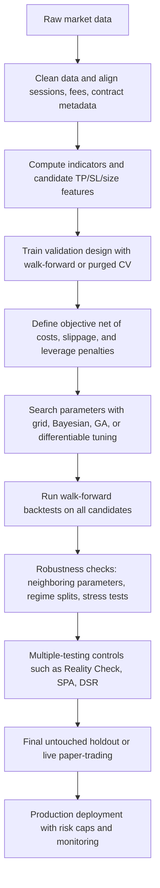

# Technical Indicators for Exits, Position Sizing, Leverage, and Strategy Optimization

## Executive summary

For take-profit and stop-loss design, the most durable framework is to separate **distance-setting** from **market-structure confirmation**. Volatility indicators such as ATR, Bollinger Bands, Keltner Channels, and Donchian width are strong tools for calibrating how far price normally moves, so they are especially useful for initial stops, trailing stops, and volatility-aware profit targets. Structure and execution references such as pivot points, support/resistance, moving averages, Fibonacci retracements, and VWAP/anchored VWAP are stronger tools for identifying where price is likely to react, pause, or mean-revert, so they are often better profit objectives or “thesis invalidation” references than standalone volatility bands. A practical synthesis is therefore: **use volatility for stop distance, structure for profit location, and size from the stop distance**. citeturn30view0turn29view4turn28view7turn28view4turn29view2turn32view0turn28view5turn29view0

Position sizing should usually be treated as a **downstream calculation**, not a free-standing decision. A common formula is risk-budget sizing: set a maximum loss per trade, compute the cash loss if the stop is hit, then size units so that stop-loss cash exposure does not exceed the risk budget. Exchange and broker educational material express this logic directly: risk-per-trade divided by risk-per-share or risk-per-contract gives position size, and a 2% account-risk cap is a common educational benchmark, though even CME explicitly notes that the 2% threshold itself is arbitrary. In portfolio settings, volatility targeting and inverse-volatility/risk-parity methods extend the same idea: reduce exposure when forecast volatility rises and increase it when volatility falls. citeturn28view8turn8search13turn35view0turn35view1turn39view1

Leverage should almost never be optimized in isolation from stops, volatility, and margin rules. In practice, leverage is an **output** of the risk engine: once stop distance, risk budget, and volatility target are known, maximum leverage is clipped by venue-imposed initial and maintenance margin rules. U.S. securities margin remains governed by Regulation T and FINRA maintenance rules, while futures margins are set contract-by-contract and explicitly vary with market volatility. In April 2026, FINRA’s new intraday margin framework replaced the old day-trading-specific provisions with exposure-based intraday standards, which matters because many older retail explanations still refer to the prior pattern-day-trader regime. citeturn34view2turn33view2turn33view0turn33view1turn28view10

On optimization, simple exhaustive search is still the right baseline when the search space is small and interpretable, but it becomes brittle in high-dimensional rule sets. Bayesian optimization is well suited to expensive black-box objectives, genetic algorithms are useful when the search space is discrete, conditional, or combinatorial, and gradient-based hyperparameter methods are attractive only when objectives are smooth or made differentiable through surrogate modeling. The central risk is not just computational cost; it is **backtest overfitting**. That is why robust workflows combine time-aware validation, walk-forward testing, multiple-testing corrections, and cost-aware objectives rather than maximizing a single in-sample Sharpe ratio. citeturn25search0turn25search8turn4search4turn25search7turn19search11turn19search8turn5search1turn5search7turn16search2turn39view3turn39view2

Backtests should always include transaction costs, spread, slippage, and—where relevant—market impact, funding, borrow, or roll costs. For higher-turnover strategies, even attractive raw results can disappear after realistic trading frictions are introduced. Performance measurement should therefore emphasize **net** Sharpe, Sortino, maximum drawdown, drawdown-based ratios such as Calmar/MAR-style measures, and expectancy per trade, alongside operational metrics such as turnover, exposure time, and trade count. Stress tests should include gap-through-stop losses, spread widening, margin hikes, and regime segmentation by volatility and trend state. citeturn17search1turn16search13turn37view3turn38view0turn3search6turn33view0turn35view1

## Indicator catalog for take-profit and stop-loss

The exit indicators below are best understood as belonging to three families. **Volatility-distance tools** tell you how far price usually moves. **Structure tools** tell you where price is likely to react. **Execution/value anchors** tell you where the market’s average traded value sits. In robust systems, traders often combine at least two families rather than using a single indicator mechanically. citeturn30view0turn29view4turn28view7turn28view4turn29view2turn32view0turn29view0

| Indicator | Definition and calculation | Typical settings | TP template | SL template | Size or leverage tie-in | Key strengths and weaknesses |
|---|---|---|---|---|---|---|
| **ATR / ATR multiples** citeturn30view0 | `TR = max(H−L, |H−C_prev|, |L−C_prev|)` and ATR is a smoothed average of true range. It measures volatility, not direction. | 14 periods is the common/default lookback; exit multipliers are usually tuned rather than dictated by the indicator itself. | Long TP at `entry + m×ATR`; for runners, trail from highest close with an ATR offset. | Long SL at `entry − k×ATR`; common for both initial and trailing stops. | `size ∝ 1 / (k×ATR)` after converting ATR to cash risk. | Very portable across assets and regimes; but it offers no structural target by itself and can produce very wide stops after volatility spikes. |
| **Bollinger Bands** citeturn29view4turn28view0 | Middle band = 20-day SMA; upper/lower bands = SMA ± 2 standard deviations. | Default/common settings are 20 periods and 2 standard deviations. | Mean-reversion: target the middle band or opposite band. Trend continuation: hold while price “walks the band,” then exit on re-entry. | Mean-reversion: stop outside the band, often with ATR or tick buffer. Breakout: stop on failure back inside the band. | Reduce size when band width is large; use width as a volatility proxy. | Useful because it combines location and dispersion, but strong trends can stay above/below a band for longer than mean-reversion logic expects. |
| **Keltner Channels and MA envelopes** citeturn28view7turn11search0 | Keltner example: 20 EMA ± 2×ATR. MA envelopes: moving average ± a fixed percentage. | Keltner commonly uses 20 EMA and 2×ATR; percentage envelopes are fully user-defined. | Mean-reversion: TP at midline. Breakout/trend: TP by trailing the outer envelope. | SL beyond the opposite envelope or below/above the channel break with volatility buffer. | `size ∝ 1 / channel_width`; lower gross leverage when channels widen. | Keltner is smoother and ATR-based; fixed-percentage envelopes are simpler but less adaptive when volatility changes. |
| **Donchian Channels** citeturn28view4 | Upper band = highest high over `N`; lower band = lowest low over `N`; middle = average of upper and lower. | 20 periods is a very common starting point. | Breakout systems often use the opposite band or middle band for profit-taking or trailing exits. | SL at opposite band, middle band, or on failed breakout back inside the channel. | `size ∝ 1 / channel_width`; leverage drops naturally when range width expands. | Excellent for trend and breakout logic; weaker in sideways regimes because channel flips can whipsaw. |
| **Moving averages** citeturn31view1turn31view2turn31view3 | Price average over a rolling window; can be SMA, EMA, WMA, and so on. MAs also define dynamic support/resistance. | TradingView characterizes periods under 20 as short-term, 20–60 as medium-term, and over 60 as long-term; 50/200 is the canonical long-horizon pair. | Trend systems often target a stretched distance from a shorter MA or the next higher-timeframe MA. | Close-below-MA or MA-crossover exits, often with ATR buffer to reduce false breaks. | Reduce size when price is already extended far from MA; leverage lower when entries are “late trend.” | Extremely interpretable and widely used, but lagging by construction and often crowded. |
| **Pivot points** citeturn29view1turn29view2 | Static support/resistance levels calculated from prior OHLC. Common platform types include Traditional, Fibonacci, Woodie, Classic, DM, and Camarilla. | Daily pivots are natural for intraday work; weekly or monthly pivots suit swing trading. | TP at `P→R1/R2/R3` in longs or `P→S1/S2/S3` in shorts. | SL just beyond the pivot whose failure invalidates the trade, often with a small ATR buffer. | Size smaller when the nearest opposing pivot gives poor reward/risk. | Objective and easy to automate, but static within the pivot period and less adaptive after volatility shocks. |
| **Fibonacci retracements and extensions** citeturn28view3 | Drawn between two extreme points; common internal levels include 23.6%, 38.2%, 61.8%, and 100%; platforms also support external levels above 100% and extensions below 0. | Most useful after a clearly defined swing leg; external levels are user-configurable. | TP at the next extension or confluence area where Fib overlaps prior structure or VWAP. | SL beyond the swing invalidation level or beyond the next lower retracement with volatility buffer. | Zone width and confluence quality can modulate size; ambiguous swing selection should force smaller size. | Useful because many traders watch the same levels, but swing selection is subjective and can easily become hindsight-biased. |
| **Support and resistance zones** citeturn32view0turn32view1 | Price areas where buying or selling has repeatedly halted movement; role reversal means broken support can become resistance and vice versa. Repeated touches increase significance. | Use recent swing highs/lows, congestion zones, and trendlines; zone width should reflect liquidity and volatility. | TP at the next visible zone rather than a fixed number of ticks or percent. | SL slightly beyond the zone, not exactly on it, to allow for normal probing. | Zone width determines stop width and therefore size. | Strong market-structure context, but zones are fuzzy and prone to discretionary overfitting when drawn by hand. |
| **VWAP and anchored VWAP** citeturn29view0turn9search18 | `VWAP = cumulative(typical price × volume) / cumulative(volume)`. Trading platforms can reset VWAP by session, week, month, quarter, year, or corporate events; anchored VWAP starts from a user-selected point. | Session VWAP is natural intraday; anchored VWAP is better for event-driven swing context. Bands are often standard-deviation bands or percentages around VWAP. | TP at session VWAP, a VWAP band, or another anchored VWAP that defines higher-timeframe value. | SL on clear acceptance below/above VWAP or beyond a band with volatility buffer. | Distance from VWAP can be used as a stretch filter; size larger only if liquidity is strong enough to support execution. | Very strong for intraday value and execution-aware exits; weaker where reliable volume is missing or where session segmentation is not natural. |

The highest-quality exit logic normally combines one indicator from the **volatility family** with one from the **structure family**. For example, a long breakout trade might use a 1.5×ATR initial stop, but place partial take profit at R1 or a prior resistance zone. A VWAP mean-reversion trade might use lower VWAP band acceptance for entry, stop below the band and the local support zone, and target first VWAP, then the opposite band. That pairing reduces the weakness of each individual tool: volatility measures do not know where other traders care, while structural levels alone do not know whether current volatility makes the stop absurdly tight or dangerously wide. citeturn30view0turn29view2turn32view0turn29view0

If a strategy needs a **pure trailing-stop indicator** rather than a static target map, Parabolic SAR remains a classic “stop-and-reverse” tool. Wilder designed it specifically to identify potential stop and reverse points, and the indicator plots on the opposite side of price depending on trend direction. In research terms, it belongs more to the trailing-stop family than the target-setting family. citeturn28view6turn21search7

### Comparison matrix

| Indicator | Signal type | Natural timeframes | Sensitivity to volatility | Strongest use |
|---|---|---|---|---|
| **ATR** citeturn30view0 | Pure volatility distance | All; especially swing and trend | Very high | **SL, trailing SL, sizing** |
| **Bollinger Bands** citeturn29view4 | Statistical dispersion band | Intraday to swing | High | **TP and mean-reversion SL** |
| **Keltner / envelopes** citeturn28view7turn11search0 | ATR or percent band around MA | Intraday to swing | High for Keltner; low-medium for fixed % envelopes | **TP, SL, regime filter** |
| **Donchian** citeturn28view4 | Breakout/range channel | All; strongest in trend-following | Medium-high through channel width | **Breakout SL, trailing exits** |
| **Moving averages** citeturn31view1turn31view2 | Trend and dynamic support/resistance | All | Low-medium | **Trend-aware SL and trailing TP** |
| **Pivot points** citeturn29view1turn29view2 | Static structural levels | Intraday and swing | Low | **TP more than SL** |
| **Fibonacci** citeturn28view3 | Swing-leg ratio map | Swing and position | Low | **TP and invalidation framing** |
| **Support/resistance** citeturn32view0turn32view1 | Market-structure zones | All | Low unless volatility buffer added | **Both TP and SL** |
| **VWAP / anchored VWAP** citeturn29view0turn9search18 | Execution/value anchor | Intraday; anchored multi-session swing | Medium | **TP, SL, and execution-aware sizing** |

## Position sizing and leverage methods

The central design principle is simple: **define the stop first, then compute size, then clip by leverage and margin limits**. Broker and exchange education material explicitly teaches the same chain: position size is derived from account risk divided by trade risk, and wider stops mechanically imply smaller positions. In portfolio overlays, volatility targeting and inverse-volatility methods generalize that logic across assets. citeturn28view8turn8search13turn35view0turn35view1

| Method | Definition and calculation | Typical settings | Pros | Cons | Example rule template |
|---|---|---|---|---|---|
| **Risk-per-trade sizing** citeturn28view8turn8search13 | `risk_budget = equity × risk_fraction`; `size = risk_budget / stop_distance_cash`. CME’s educational example uses 2% account risk but states the threshold is arbitrary. | Risk fraction is chosen ex ante and kept stable; stop distance comes from the exit rule. | Transparent, easy to audit, naturally links sizing to the stop. | Ignores portfolio correlation and changing regime volatility unless combined with additional overlays. | `size = floor((equity × 0.01) / ((entry − stop) × point_value + cost_buffer))` |
| **ATR-adjusted sizing** citeturn30view0turn28view8 | Stop distance is `k×ATR`, so `size ∝ 1 / ATR`. | 14-period ATR is common; `k` is strategy-specific. | Automatically shrinks size when volatility rises and expands it when volatility falls. | Can overshrink after temporary volatility shocks or oversize quiet markets before breakouts. | `stop = entry − 1.5×ATR`; `size = risk_budget / (1.5×ATR×point_value)` |
| **Volatility targeting** citeturn35view1turn39view1turn35view2 | Exposure is scaled to maintain target portfolio volatility rather than fixed notional exposure: `gross_exposure ≈ target_vol / forecast_vol`. | Target volatility is fixed by policy; forecast volatility may be rolling realized vol, EWMA, GARCH, or another estimator. | Strong portfolio-level discipline; often reduces extreme outcomes and volatility-of-volatility. | Real-time implementation matters; some formulations are vulnerable to look-ahead bias or can overshoot targets. | `gross_leverage = min(venue_cap, target_vol / forecast_vol)` |
| **Inverse-volatility / risk-parity sizing** citeturn35view0turn14search3 | Simplest form uses weights proportional to `1/σ_i`; fuller risk-parity methods equalize risk contributions across assets. | Rebalance on a set schedule; use consistent volatility estimator across assets. | Prevents high-volatility assets from dominating portfolio risk. | Needs covariance control in multi-asset portfolios; can require leverage to reach desired return targets. | `w_i = (1/σ_i) / Σ(1/σ_j)` then scale portfolio to target vol |
| **Kelly and fractional Kelly** citeturn39view0turn23search2turn23search10 | Kelly sizing maximizes expected logarithmic wealth growth; fractional Kelly applies a constant fraction of the full Kelly allocation to reduce drawdown and estimation risk. | Fractional Kelly is usually preferred to full Kelly when the edge estimate is noisy. | Theoretically coherent and edge-aware. | Extremely sensitive to estimation error; full Kelly can produce severe drawdowns and leverage demands. | `stake = c × f_kelly × equity`, where `0 < c < 1` |
| **Margin-aware leverage caps** citeturn34view2turn33view2turn33view0turn28view10 | Actual leverage is `notional / equity`, but the safe maximum is clipped by initial margin, maintenance margin, intraday rules, and liquidity/funding constraints. | Venue-specific; U.S. stock margin, futures performance bonds, and intraday rules differ materially. | Prevents theoretically “optimal” sizing from becoming operationally impossible. | Margin rules can change with volatility, so feasible leverage is regime-dependent. | `allowed_leverage = min(vol_cap, margin_cap, liquidity_cap)` |

Two conclusions deserve emphasis. First, **Kelly should usually be treated as an upper bound, not a production allocation**, unless the strategy’s edge is estimated with exceptional confidence and the return distribution is well understood. Even the broader Kelly literature emphasizes its growth optimality and, at the same time, the practical appeal of fractional Kelly because of drawdowns and estimation error. citeturn39view0turn23search4turn23search10

Second, **volatility targeting is not a universal free lunch**. The literature finds meaningful benefits in some asset classes and factor sleeves, especially where volatility persistence is strong, but also warns that real-time implementation choices matter and that some conventional volatility-targeting formulations can overshoot targets or fail to improve out-of-sample performance consistently. That makes volatility targeting a strong risk overlay, but not a substitute for edge, costs, and validation. citeturn39view1turn35view1turn35view2turn36search12

## Optimization and robustness workflow

Strategy optimization is really **joint optimization of entries, exits, sizing, and leverage under trading frictions**. The right optimizer depends on the search space. If the rule set is small and interpretable, exhaustive search is still useful because it produces a full parameter surface. If the search is expensive, conditional, or highly nonconvex, sequential or evolutionary methods are usually better. What matters most is not finding the single highest in-sample objective, but finding **broad, stable parameter regions** that survive costs, regime changes, and multiple-testing corrections. citeturn25search0turn25search8turn4search4turn19search11turn5search1turn16search2turn39view2

| Method | Best use case | Main advantage | Main weakness | Trading-specific guidance |
|---|---|---|---|---|
| **Grid search** citeturn25search0turn25search8 | Low-dimensional, interpretable spaces | Exhaustive and easy to visualize as parameter surfaces | Scales poorly as dimensions rise | Use it first for exit multipliers, lookbacks, and threshold sensitivity maps. |
| **Walk-forward optimization** citeturn4search6turn4search2 | Time-adaptive rule sets | Mimics repeated re-estimation through time | Results depend strongly on window design; a single path can be high-variance | Optimize on rolling windows, but keep one final untouched out-of-sample segment. |
| **Genetic algorithms** citeturn19search11turn19search8 | Discrete, branchy, conditional rule logic | Good global search in complex spaces without gradients | Easy to overfit if the fitness function is unconstrained | Penalize turnover, low trade count, unstable leverage, and fragile parameter trees. |
| **Bayesian optimization** citeturn4search4turn25search7 | Expensive black-box objectives | Sample-efficient; balances exploration and exploitation | Harder to use with very noisy or heavily discontinuous objectives | Excellent for tuning a few expensive strategy hyperparameters net of costs. |
| **Gradient-based tuning** citeturn5search1turn5search7 | Differentiable or surrogate-modeled objectives | Efficient for continuous hyperparameters | Weak fit for branch-heavy trading rules with discontinuous fills | Best for differentiable models, less for hand-built TP/SL logic. |
| **Purged and embargoed cross-validation** citeturn18search10turn18search1 | Financial labels with overlap and leakage risk | Better than naive IID folds for time-dependent data | More implementation complexity | Use when features or labels overlap across time, especially in ML strategies. |
| **Combinatorial purged CV** citeturn18search1turn18search2 | Distributional out-of-sample estimation | Produces many OOS paths and helps quantify robustness | Complex and bug-prone if implemented casually | Strong for research, but only if the split logic is audited carefully. |
| **Ensemble methods** citeturn26search0turn26search3turn26search14 | Multiple weak or regime-specific strategies | Reduces dependence on one fragile parameter set | Can hide model overlap and common-mode risk | Prefer combining distinct rule families or stable parameter clusters, not near-duplicates. |



This workflow is stricter than many retail backtests, but the stricter version is necessary because data-snooping is real. White’s Reality Check was designed specifically to address the fact that the same data are often reused for model selection and inference. Hansen’s SPA test improves power relative to Reality Check in many settings, and the Deflated Sharpe Ratio explicitly adjusts Sharpe-ratio significance for multiple trials and non-normal returns. In plain language, if you evaluated hundreds or thousands of parameter combinations, the best-looking Sharpe ratio is not automatically meaningful. citeturn16search2turn39view3turn39view2

A related nuance: the literature on technical trading rules repeatedly shows that **apparent profitability often shrinks after data-snooping adjustment**. Sullivan, Timmermann, and White’s work is foundational here, and later studies on technical rules in futures and other markets continue to use White/SPA-style corrections for exactly that reason. This does not mean technical exits or sizing cannot work; it means the research process must count how many variants were tried and must not mistake the “winner” of a large parameter tournament for a genuine edge. citeturn24search3turn20search13turn24search9

The practical optimization objective should almost always be **net** and **risk-aware**. A good objective is usually some weighted combination of net Sharpe or Sortino, maximum drawdown penalty, minimum trade count, turnover penalty, leverage penalty, and parameter smoothness. The point is to discourage brittle solutions such as “high Sharpe because of only seven trades” or “high CAGR only because leverage was extreme during one low-volatility regime.” Transaction-cost literature and execution research make clear that ignoring frictions can completely reorder candidate strategies. citeturn17search1turn16search13turn16search8

## Backtesting, performance metrics, and stress testing

Backtesting best practice begins with realism about **fills and frictions**. Stops are not always filled at the stop price; in fast or discontinuous markets they can gap through, and the loss is then larger than the nominal stop distance. Slippage also grows when volatility rises, when spread widens, and when participation rate becomes too large for the instrument’s liquidity. That is why institutional execution research models a tradeoff between transaction cost and volatility risk, and why practical research notes that transaction-cost simplifications can materially distort conclusions. citeturn17search1turn16search13turn33view0

A rigorous backtest therefore needs, at minimum, properly aligned bar data, non-look-ahead indicator calculation, explicit commission and spread assumptions, slippage rules that worsen in stressed regimes, realistic margin checks, and handling of partial exits and trailing stops at bar or event resolution. If the research ignores these implementation details, the more precise the optimizer becomes, the more precisely it can overfit the wrong problem. citeturn16search5turn33view1turn28view10

### Performance metrics that matter

| Metric | What it measures | Practical interpretation | Caveat |
|---|---|---|---|
| **Sharpe ratio** citeturn37view3turn39view2 | Excess return per unit of total volatility | Good first-pass risk-adjusted metric | If selected from many trials, use DSR or another correction before trusting it. |
| **Sortino ratio** citeturn38view0turn38view2 | `(Mean return − MAR) / downside deviation` | Better when upside volatility should not be penalized | Sensitive to the MAR choice and downside-deviation calculation method. |
| **Maximum drawdown** citeturn37view3 | Largest peak-to-trough decline | Most intuitive pain metric for a live trader | Says nothing about recovery speed or frequency of smaller losses. |
| **Annual return / CAGR** citeturn37view3 | Compounded annual growth rate | The cleanest absolute growth metric | Can hide path risk and leverage dependence. |
| **Calmar ratio** citeturn37view3turn37view5 | Annual return divided by maximum drawdown | Strong for comparing trend systems and levered systems | Sensitive to sample window and one extreme drawdown event. |
| **MAR-style ratio** citeturn37view5turn37view3 | Practitioner shorthand for CAGR divided by max drawdown over the full track record | Common complement to Calmar in manager reporting | Definitions vary slightly across practitioners and reports. |
| **Expectancy** citeturn3search6 | Expected profit per trade: `win_rate × avg_win − loss_rate × avg_loss` | Shows whether the trade distribution has positive edge net of costs | Must be calculated net of commissions, spread, and slippage. |

In strategy development, the cleanest reporting set is usually: **net CAGR, Sharpe, Sortino, max drawdown, Calmar/MAR-style drawdown ratio, expectancy, turnover, average holding period, trade count, hit rate, average win/loss, and exposure time**. That combination guards against common failure modes such as “high Sharpe but tiny sample,” “high CAGR but catastrophic drawdown,” or “positive expectancy before but not after costs.” citeturn37view3turn38view0turn3search6turn16search13

### Scenario and stress tests

| Stress test | What to shock | Why it matters |
|---|---|---|
| **Gap-through-stop test** citeturn33view2 | Reprice stops with a jump beyond the trigger | Shows that stop-losses cap intent, not always realized loss. |
| **Volatility spike test** citeturn35view1turn33view0 | Double forecast vol, widen ATR and spreads | Tests whether volatility-aware sizing and leverage caps actually work. |
| **Spread and slippage widening** citeturn16search13turn17search1 | Increase costs as a function of volatility and turnover | Essential for high-turnover or intraday systems. |
| **Margin shock** citeturn33view0turn33view1turn28view10 | Raise initial and maintenance margin, then recalc allowed exposure | Simulates forced deleveraging when exchange or broker risk controls tighten. |
| **Regime segmentation** citeturn35view1turn35view2 | Split by high/low volatility, trend/range, crisis/normal periods | Verifies whether the strategy only works in one regime. |
| **Synthetic path or bootstrap test** citeturn27search11turn27search19 | Resample or generate alternate price paths with preserved dependence structure | Measures how much the strategy depends on one lucky historical path. |

A useful rule of thumb is this: if a strategy’s edge disappears when spreads are widened modestly, if margin shocks force position truncation, or if most performance came from one regime, the strategy is not robust enough to optimize further. It needs redesign, not finer tuning. citeturn16search13turn33view0turn35view2

## Example strategy templates and pseudocode

The following templates are **indicator-linked risk engines**, not fully specified alpha models. They show how TP, SL, size, and leverage should be connected mechanically once an entry condition exists.

### ATR stop with pivot take-profit

This template is intentionally simple because it exposes the correct order of operations: define stop, compute cash risk, compute size, then choose profit locations. It combines a volatility stop with a structural target. The logic fits swing systems, breakout systems, and even many mean-reversion systems. citeturn30view0turn29view2turn28view8turn8search13

```python
# Pseudocode: ATR-based stop + pivot-based profit target

# Inputs chosen before the backtest starts
atr_len = 14
atr_stop_multiple = 1.5
risk_fraction = 0.01   # Risk 1% of equity per trade
point_value = contract_or_share_value_per_price_unit
cost_buffer = estimated_fees + estimated_slippage

# Example long trade plan after an entry signal occurs
atr = ATR(high, low, close, atr_len)
pivot_levels = daily_pivots(previous_high, previous_low, previous_close)

entry = current_close
stop = entry - atr_stop_multiple * atr

# Use the nearest structural resistance level as the first target
target_1 = pivot_levels.R1
target_2 = pivot_levels.R2

# Convert stop distance into cash risk per unit
risk_per_unit = (entry - stop) * point_value + cost_buffer

# Position size is downstream from the stop
risk_budget = equity * risk_fraction
size_units = floor(risk_budget / risk_per_unit)

# Optional leverage clip
notional = size_units * entry * contract_multiplier
raw_leverage = notional / equity
allowed_leverage = min(raw_leverage, venue_margin_cap, portfolio_vol_cap)

# Execution logic
place_long_order(
    size=size_units,
    stop_loss=stop,
    take_profit_1=target_1,
    take_profit_2=target_2,
    leverage=allowed_leverage,
)
```

### VWAP mean reversion with volatility-aware stop and size

VWAP is most natural intraday because it is tied to traded volume over the session, but anchored VWAP can serve the same function on multi-session event-driven charts. This template assumes the entry is a return toward value after a short-term excursion away from VWAP. citeturn29view0turn28view1

```python
# Pseudocode: session VWAP fade

risk_fraction = 0.005   # Use smaller risk on intraday mean-reversion
atr_len = 14
band_buffer = 0.5       # Add half an ATR beyond the VWAP band
point_value = contract_or_share_value_per_price_unit

vwap = session_vwap(high, low, close, volume)
upper_band, lower_band = vwap_std_bands(vwap, n_bands=1)
atr = ATR(high, low, close, atr_len)

# Example long fade: price is stretched below lower VWAP band,
# but higher-timeframe context is not bearish
if close < lower_band and higher_timeframe_bias != "strong_downtrend":
    entry = close

    # Stop goes below the lower band with an ATR safety buffer
    stop = lower_band - band_buffer * atr

    # Exit ladder: first back to VWAP, then to upper band if momentum continues
    target_1 = vwap
    target_2 = upper_band

    risk_per_unit = (entry - stop) * point_value + costs_buffer
    risk_budget = equity * risk_fraction
    size_units = floor(risk_budget / risk_per_unit)

    # Intraday leverage should still be clipped by forecast vol and margin
    gross_leverage_cap = min(exchange_cap, target_intraday_vol / forecast_intraday_vol)

    place_long_order(
        size=size_units,
        stop_loss=stop,
        take_profit_1=target_1,
        take_profit_2=target_2,
        leverage=gross_leverage_cap,
    )
```

### Donchian trend following with ATR trailing stop and portfolio volatility target

This template is closer to a production trend system because it handles both single-trade risk and portfolio-level risk. It uses Donchian breakout logic, ATR for trailing risk, and volatility targeting for leverage/exposure normalization across assets. citeturn28view4turn30view0turn35view1turn35view0

```python
# Pseudocode: multi-asset trend breakout

donchian_len = 20
atr_len = 20
atr_trail_multiple = 2.0
target_portfolio_vol = chosen_annualized_vol_target

for asset in universe:
    upper = rolling_max(asset.high, donchian_len)
    lower = rolling_min(asset.low, donchian_len)
    atr = ATR(asset.high, asset.low, asset.close, atr_len)

    # Entry: yesterday's close breaks the previous upper channel
    if asset.close[-1] > upper[-2]:
        entry = asset.close[-1]

        # Initial stop uses a volatility trail anchored to the breakout
        stop = entry - atr_trail_multiple * atr[-1]

        # Single-trade size from stop distance
        risk_per_unit = (entry - stop) * asset.point_value + asset.cost_buffer
        single_trade_units = floor((equity * trade_risk_fraction) / risk_per_unit)

        # Portfolio overlay: size is clipped by forecast asset volatility
        asset_forecast_vol = forecast_vol(asset.returns)
        raw_weight = target_portfolio_vol / asset_forecast_vol

        # Convert desired weight into a leverage-aware cap
        margin_cap = asset.margin_based_max_leverage
        final_weight = min(raw_weight, margin_cap, max_weight_per_asset)

        send_order(
            asset=asset,
            units=convert_weight_to_units(final_weight, entry, equity, single_trade_units),
            stop_loss=stop,
        )

    # Exit: trail stop as trend advances
    if in_position(asset):
        trailing_stop = max(current_stop(asset), asset.close[-1] - atr_trail_multiple * atr[-1])
        update_stop(asset, trailing_stop)

        # Optional hard trend exit if price closes below lower channel
        if asset.close[-1] < lower[-2]:
            close_position(asset)
```

### A compact universal risk engine

The most reusable coding pattern is to separate strategy logic from risk logic. Entries decide **whether** to trade; the risk engine decides **how much**, **where the trade fails**, and **whether leverage is allowed**. citeturn28view8turn35view1turn33view0turn28view10

```python
# Pseudocode: generic risk engine

def plan_trade(entry, stop, equity, point_value, risk_fraction,
               forecast_vol, target_vol, margin_cap, liquidity_cap, fees_slippage):
    # Cash loss if the stop is hit
    stop_cash = abs(entry - stop) * point_value + fees_slippage

    # Account-level risk budget
    risk_budget = equity * risk_fraction

    # Unit count from stop loss
    units = floor(risk_budget / stop_cash)

    # Convert units to notional exposure
    notional = units * entry * point_value
    raw_leverage = notional / equity

    # Portfolio-level leverage cap from volatility targeting
    vol_cap = target_vol / forecast_vol if forecast_vol > 0 else 0.0

    # Final leverage cap is the most conservative one
    allowed_leverage = min(raw_leverage, vol_cap, margin_cap, liquidity_cap)

    return units, allowed_leverage
```

## Source priority, implementations, recommendations, and pitfalls

For serious research, source quality matters as much as the optimizer. A good priority order is:

| Priority | What to use first | Why it should come first |
|---|---|---|
| **Indicator mechanics** | Wilder-derived and official-style indicator documentation for ATR and PSAR; Bollinger/TradingView-style formula references; platform docs for pivots, VWAP, Donchian, Keltner | They expose exact formulas and common defaults used in real charting software. citeturn30view0turn28view6turn29view4turn29view2turn29view0turn28view4turn28view7 |
| **Position sizing and leverage** | Exchange/broker/regulator docs plus Kelly and volatility-targeting literature | These sources define the operational constraints that turn theoretical size into feasible size. citeturn28view8turn33view0turn33view1turn34view2turn39view0turn35view1 |
| **Optimization and validation** | White, Hansen, Bailey/Lopez de Prado, Moreira–Muir, Harvey et al., Almgren–Chriss | They cover multiple testing, Sharpe inflation, volatility management, and realistic execution. citeturn16search2turn39view3turn39view2turn39view1turn35view1turn17search1 |
| **Implementations** | TA-Lib, pandas-ta, `ta`, empyrical, PerformanceAnalytics, vectorbt, scikit-learn, Optuna, mlfinlab | These are the practical building blocks for indicator computation, metric reporting, search, and finance-aware validation. citeturn6search9turn6search1turn6search16turn6search3turn6search11turn37view3turn37view2turn6search2turn25search0turn25search2turn18search1 |

### Implementation references

TA-Lib remains the most standardized indicator toolkit in this space: the core library advertises roughly 200 indicators and has an official Python wrapper. TA-Lib’s wrappers page also lists pandas-ta, and pandas-ta remains available on PyPI. If you want a pure-Python feature-engineering library, the `ta` project is another strong option. For metrics and reporting, empyrical and R’s PerformanceAnalytics are reliable references; for large-scale vectorized backtests, vectorbt is widely used. For optimization and validation, scikit-learn’s GridSearchCV is the baseline, Optuna is a strong general-purpose tuner, and mlfinlab exposes finance-specific cross-validation logic such as combinatorial purged cross-validation. citeturn6search9turn6search1turn6search16turn6search3turn6search11turn37view3turn37view2turn6search2turn25search0turn25search2turn18search1

### Actionable recommendations

The most practical default stack for a general-purpose systematic strategy is to use **ATR or Keltner logic for the stop**, **support/resistance, pivots, or VWAP for profit-taking**, and **risk-per-trade sizing constrained by a portfolio volatility target and venue-specific leverage cap**. That stack is mechanically simple, interpretable, and consistent with both exchange-style risk education and the academic literature on volatility-aware portfolios. citeturn30view0turn28view7turn29view2turn32view0turn29view0turn28view8turn35view1turn33view0

When optimizing, start with a **coarse grid** to inspect the shape of the parameter surface. If the surface is smooth and there is a broad plateau, refine locally with Bayesian optimization; if the strategy is branchy or heavily conditional, genetic algorithms can be more natural. Do not jump straight to a sophisticated optimizer before you know whether the edge is concentrated in a tiny unstable corner. citeturn25search0turn4search4turn19search11

For validation, require at least one **final untouched holdout**, make every optimization **net of costs**, and treat any best-in-class Sharpe or CAGR as provisional until a multiple-testing correction or equivalent robustness check is applied. If possible, report both walk-forward results and a leakage-aware CV variant so you can see whether your findings depend on one historical path. citeturn4search6turn16search2turn39view3turn39view2turn18search1turn18search2

### Common pitfalls

- Optimizing entry, exit, size, and leverage on the same history without correcting for how many variants were tried. This is the shortest path to backtest overfitting. citeturn16search2turn24search3turn39view2
- Choosing position size first and then forcing the stop to fit the size. The process should run in the opposite direction. citeturn28view8turn8search13
- Treating full Kelly as a practical default. It is a theoretical optimum under strong assumptions, not a universal production rule. citeturn39view0turn23search10
- Ignoring the fact that leverage feasibility is path-dependent because margin rules can tighten when volatility rises. citeturn33view0turn33view1turn28view10
- Using Bollinger or Donchian signals mechanically without identifying whether the regime is trend or range. In strong trends, “overbought” often means strength, not a short. citeturn29view4turn28view7turn28view4
- Evaluating TP/SL rules on gross results. High-turnover strategies are often dominated by spread, slippage, and impact once tested honestly. citeturn17search1turn16search13

The highest-confidence practical conclusion is this: **exits are most robust when they are indicator-linked but not indicator-monocultures**. Use one tool to define the risk distance, another to define the market structure objective, and then size the trade from the stop—not from conviction. Optimize only within a validation framework that treats costs, leverage, and multiple testing as first-class citizens. citeturn30view0turn29view2turn32view0turn28view8turn39view2turn39view3