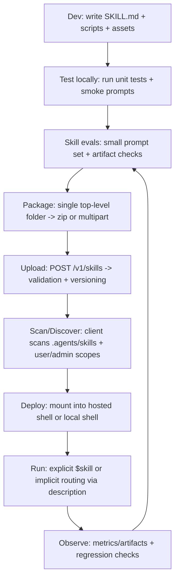

# Codex Skills for Time Series ML: Official Specs, Evidence, and a Production-Ready Skill Template

## Executive summary

Agent skills are a practical way to “package” a time-series ML workflow (instructions + scripts + assets) so an agent can reliably select and execute it only when needed, instead of re-sending a long procedure in every prompt. OpenAI’s docs describe a skill as a folder bundle anchored by a required `SKILL.md` manifest; routing is driven heavily by the `name` and especially the scope-bounded `description`, and full instructions are loaded only when the model decides to use that skill (progressive disclosure). citeturn10view0turn3view0turn11view0turn27view0

From a time-series standpoint, the most leverage comes from turning your evaluation protocol into a skill: standardizing rolling-origin splits, leakage checks, baseline comparisons, and artifact outputs (metrics JSON + report) so every experiment becomes reproducible and reviewable—especially important because time-series evaluation is easy to get wrong and can silently inflate results. citeturn15search0turn15search1turn15search13turn15search2

From a code-generation perspective, the research trend is clear: single-function benchmarks (e.g., HumanEval) do not fully capture repository-level work. Benchmarks like SWE-bench and RepoBench emphasize the need for repo-wide context, test execution, and multi-step workflows—exactly the failure modes skills + shell + evals are meant to address. citeturn23search3turn29search0turn29search1turn29search5turn18view0

A safe, production-minded stance is to treat skills as privileged instructions/code; avoid letting end-users freely attach arbitrary skills; require explicit approval for sensitive actions; and be especially careful combining skills with network access (containment + allowlists). citeturn3view0turn27view0

This report includes a complete minimal “Time Series Rolling Audit” skill (Polars + tests + schema) under 500 lines total, designed to generate leakage-safe rolling-origin splits and baseline metrics artifacts that you can diff, version, and use as an eval target. citeturn10view0turn18view0turn27view0

## OpenAI skills and agents specification

**What OpenAI calls a “skill” (and why progressive disclosure matters).** OpenAI’s Codex documentation frames a skill as a directory containing `SKILL.md` plus optional scripts and resources; the key design is “progressive disclosure”: the agent first sees lightweight metadata (`name`, `description`, file path, and optional `agents/openai.yaml` metadata), and only loads the full `SKILL.md` instructions when it decides to invoke that skill. This is the fundamental mechanism that keeps long-running agent workflows usable without bloating every prompt. citeturn10view0turn27view0

A particularly operational quote from OpenAI’s blog (emphasis added): “**Your skill’s description is effectively the model’s decision boundary**,” and the recommended shape is “Use when vs. don’t use when,” including outputs and success criteria. citeturn27view0

**Where skills live and how they’re discovered (scan/search order).** For Codex clients, OpenAI documents multiple scopes: repo-scoped skills are discovered by scanning `.agents/skills` from the current working directory up to the repo root; user-scoped skills live under `$HOME/.agents/skills`; admin/system skills exist in shared locations (e.g., `/etc/codex/skills` or bundled). If two skills share the same `name`, Codex does not merge them; both may appear as selectable skills. Codex also supports symlinked skill folders. citeturn10view0

**`SKILL.md` is the manifest; `agents/openai.yaml` is optional metadata.** The Codex skills doc shows the required `SKILL.md` YAML front matter (at minimum `name` and `description`) followed by instructions. It also documents an optional `agents/openai.yaml` for UI metadata and dependencies (including an invocation policy flag `allow_implicit_invocation`). citeturn10view0

OpenAI’s skills docs for the API layer add an important nuance: when skills are available, the platform provides a skill’s `name`, `description`, and `path` to the model; if invoked, the model uses the `path` to read `SKILL.md`. OpenAI explicitly notes: “Skill instructions are user prompt input (not system prompt input).” citeturn3view0turn11view0

**About `skill.toml` / `skill.yaml`.** In the current OpenAI Codex docs, the supported on-disk skill format is centered on `SKILL.md` plus optional `agents/openai.yaml`. OpenAI’s changelog explicitly notes “Remove load from SKILL.toml fallback,” which strongly suggests `SKILL.toml` is deprecated (at least as an automatic metadata source) in modern Codex clients. The same official docs set does not describe a `skill.yaml` manifest for Codex skills; when you want machine-readable metadata, OpenAI documents `agents/openai.yaml` and `SKILL.md` front matter. citeturn6view0turn10view0

**Skill packaging and upload in the OpenAI API (`POST /v1/skills`).** OpenAI’s Skills guide documents creation via `POST /v1/skills` either as a multipart directory upload (multiple `files[]` parts, each including a path within a single top-level folder) or as a zip upload containing a single top-level folder. Skill versions are supported; the guide documents version pointers (`default_version`, `latest_version`) and creating new versions via `POST /v1/skills/<skill_id>/versions`. citeturn3view0turn11view0

OpenAI also documents “inline skills” (base64 zip bundles) that can be embedded into a container creation request, which can be useful when you don’t want to create a hosted skill object first. citeturn3view0

**Limits and validation (hard constraints).** OpenAI’s Skills docs specify: case-insensitive matching for `SKILL.md`, exactly one `skill.md`/`SKILL.md` per bundle, validation tied to the agent skills specification, and size/count limits: max zip upload size 50 MB, max file count per skill version 500, maximum uncompressed file size 25 MB. citeturn3view0turn11view0

**Safety and risk guidance (what OpenAI actually warns about).** OpenAI’s Skills guide highlights prompt-injection and data-exfiltration risks, advising you to treat skills as privileged code/instructions; avoid designs where end-users can browse/select arbitrary skills from an open catalog; integrate skills at the developer level; require explicit approvals for sensitive actions; and validate data residency/retention constraints (including a note that skills in OpenAI hosted containers can’t be used with Zero Data Retention). citeturn3view0

OpenAI’s long-running agents post adds operational guidance for risk containment: combining skills with open network access increases exfiltration risk; use strict allowlists; treat tool output as untrusted; and keep network access minimal and bounded (plus best practices like `domain_secrets` to avoid exposing raw credentials). citeturn27view0

**How to test skills (and why “evals” matter).** OpenAI’s “Testing Agent Skills Systematically with Evals” recommends turning “vibes” into measurable checks: define success (outcome, process, style, efficiency), manually trigger the skill early to uncover hidden assumptions, and build a small prompt set (10–20 prompts) to catch regressions. It explicitly treats skill evals like lightweight end-to-end tests: prompt → captured run (trace + artifacts) → checks → score. citeturn18view0

### File/metadata comparison table (OpenAI-documented)

| Artifact | Where it lives | What it’s for | How it’s used by the agent/platform | Key fields (documented) |
|---|---|---|---|---|
| `SKILL.md` | Skill folder root | Required manifest: routing metadata + executable instructions | Metadata (`name`, `description`, path) is exposed; full instructions loaded only on invocation | YAML front matter includes `name`, `description` citeturn10view0turn11view0turn27view0 |
| `agents/openai.yaml` | `agents/` subfolder | Optional UI metadata + invocation policy + tool dependencies | Included in initial metadata exposure; used to configure clients and dependency declarations | `interface.*`, `policy.allow_implicit_invocation`, `dependencies.tools` citeturn10view0 |
| `.agents/skills/<skill>/…` | Repo tree (scanned upward to root) | Repo-scoped distribution | Client scan rule (CWD → repo root) | Not merged on name collisions; symlinks supported citeturn10view0 |
| `AGENTS.md` / `AGENTS.override.md` | Global + repo directories | Cross-cutting persistent guidance for how Codex should work in this repo | Concatenated instruction chain with directory-level override semantics and a byte cap | Search precedence + 32 KiB default cap via `project_doc_max_bytes` citeturn9view0 |

### Constraints table (OpenAI-documented)

| Constraint | Value / rule | Where documented |
|---|---|---|
| Exactly one `SKILL.md`/`skill.md` | Required | citeturn3view0turn11view0 |
| `SKILL.md` matching is case-insensitive | Yes | citeturn3view0turn11view0 |
| Max zip upload size | 50 MB | citeturn3view0turn11view0 |
| Max files per skill version | 500 | citeturn3view0turn11view0 |
| Max uncompressed file size | 25 MB | citeturn3view0turn11view0 |
| `AGENTS.md` chain size cap | `project_doc_max_bytes` (32 KiB default) | citeturn9view0 |
| `SKILL.toml` fallback | Removed (deprecated behavior) | citeturn6view0 |

### Skill lifecycle flow (Mermaid)



## Time series ML skill template

**Design principle:** time-series ML skills should be “artifact-first.” OpenAI emphasizes that agents behave better when they can verify work and when tasks are broken into smaller steps; for data work, the most stable verification primitive is a versioned artifact (e.g., `metrics.json`, `report.md`) that can be diffed and checked in tests/evals. citeturn28view0turn18view0turn27view0

**Recommended directory layout (Codex skill + API upload compatible).** OpenAI’s Codex skills doc recommends a skill folder rooted on `SKILL.md`, plus optional `scripts/`, `references/`, `assets/`, and optional `agents/openai.yaml`. citeturn10view0

A pragmatic time-series layout (keeps `SKILL.md` concise, pushes “heavy detail” into code/assets):

- `SKILL.md` — routing boundary + runbook + definition of done
- `agents/openai.yaml` — set `allow_implicit_invocation: false` for safety by default (explicit invocation remains available) citeturn10view0turn27view0
- `run.py` — deterministic, testable evaluation harness that writes artifacts
- `assets/` — JSON schema(s), example configs, tiny sample data if needed
- `tests/` — unit tests to protect against regression
- `evals/` — small prompt CSV for skill-trigger and artifact checks (per OpenAI eval guidance) citeturn18view0

**Two key “prompt surface” insights to bake into `SKILL.md`.**  
1) The description is routing logic, not a feature list (“use when / don’t use when”). citeturn27view0turn18view0  
2) If you need determinism, explicitly instruct “Use the `<skill name>` skill.” OpenAI calls this “the simplest reliability lever.” citeturn3view0turn27view0

### Complete minimal skill under 500 lines (Polars + tests + schema)

This bundle is 462 lines total across all files shown below (including the prompt CSV), staying within the “small, reviewable skill” intent and the platform limits (which are far larger in bytes/files). citeturn3view0turn18view0

#### `ts-rolling-audit/SKILL.md`

```markdown
---
name: ts-rolling-audit
description: |
  Leak-safe time-series evaluation + baseline forecasting report.
  Use when you need rolling-origin splits, baseline metrics, and reproducible artifacts from a CSV/Parquet time series.
  Don't use for live trading/execution, or when the user only wants visualization without evaluation.
---

# Time Series Rolling Audit Skill

## What this skill is for
This skill runs a **rolling-origin (walk-forward)** evaluation loop and produces versionable artifacts:
- `output/metrics.json` (machine-readable results + config)
- `output/report.md` (human-readable summary)
- `output/folds.csv` (fold schedule for audit/repro)

It is designed to prevent the most common time-series mistake: **train/test leakage via non-temporal splitting**.

## When to use this
Use this skill when the user is doing:
- time series forecasting model selection
- backtesting a supervised learning pipeline on temporal data
- volatility/returns forecasting baselines and leakage checks

Do **not** use this skill when:
- the user requests real-world side effects (trading, order routing, writing to production DBs)
- the dataset has no trustworthy timestamp column
- the task is purely exploratory charting / EDA with no evaluation goal

## Inputs
- Dataset path: CSV or Parquet (local path in repo or mounted into container)
- Required columns:
  - `ts_col` (timestamp / date)
  - `y_col` (numeric target)
- Optional:
  - `id_col` (panel identifier; if absent, treated as a single series)
  - `season_len` (rows per seasonal cycle; enables seasonal-naive baseline)

## Outputs
This skill writes to `output/` (create if missing):
- `output/metrics.json`
- `output/report.md`
- `output/folds.csv`

For structured, machine-checkable *assistant* output (useful in evals/CI),
use the JSON Schema in `assets/final_output.schema.json`.

## Runbook (local or hosted shell)
1) Install deps (once per environment):
   `python -m pip install -r requirements.txt`

2) Run the audit:
   `python run.py --input <PATH> --ts-col <TS_COL> --y-col <Y_COL> [--id-col <ID_COL>] --horizon 14 --min-train 200 --step 7 --outdir output`

3) Inspect artifacts:
   - Open `output/report.md`
   - Diff `output/metrics.json` across experiments

4) Recommended validation:
   `python -m pytest -q`

## Definition of done
- `output/metrics.json`, `output/report.md`, `output/folds.csv` exist
- No fold has train/test overlap
- Metrics exist for each baseline (`naive_last`, `drift`, and optionally `seasonal_naive`)
```

#### `ts-rolling-audit/agents/openai.yaml`

```yaml
interface:
  display_name: "Time Series Rolling Audit"
  short_description: "Leak-safe rolling-origin splits + baseline forecast metrics."
  default_prompt: "Run leak-safe evaluation and generate report artifacts."

policy:
  # Safer default: require explicit invocation ($ts-rolling-audit) to avoid surprising side effects.
  allow_implicit_invocation: false
```

#### `ts-rolling-audit/requirements.txt`

```text
polars>=0.20.0
numpy>=1.23.0
pytest>=7.0.0
```

#### `ts-rolling-audit/run.py`

```python
#!/usr/bin/env python3
"""Leak-safe rolling-origin evaluation for time series (CSV/Parquet).

This script standardizes: (1) temporal splits, (2) simple baseline forecasts, (3) artifacts:
- output/metrics.json (machine-readable)
- output/report.md (human-readable)
- output/folds.csv (split schedule)

Dependencies: polars, numpy.
"""

from __future__ import annotations

import argparse
import json
from dataclasses import asdict, dataclass
from pathlib import Path
from typing import Any, Dict, List, Optional, Tuple

import numpy as np
import polars as pl


@dataclass(frozen=True)
class AuditConfig:
    input_path: str
    ts_col: str
    y_col: str
    id_col: Optional[str]
    horizon: int
    min_train: int
    step: int
    season_len: Optional[int]
    outdir: str


# ---------- I/O + validation ----------


def read_frame(path: Path) -> pl.DataFrame:
    if not path.exists():
        raise FileNotFoundError(f"Input not found: {path}")
    suf = path.suffix.lower()
    if suf == ".csv":
        return pl.read_csv(path, try_parse_dates=False)
    if suf in {".parquet", ".pq"}:
        return pl.read_parquet(path)
    raise ValueError(f"Unsupported extension: {suf} (use .csv or .parquet)")


def prepare_frame(df: pl.DataFrame, cfg: AuditConfig) -> pl.DataFrame:
    for c in [cfg.ts_col, cfg.y_col]:
        if c not in df.columns:
            raise KeyError(f"Missing required column: {c}")
    if cfg.id_col is not None and cfg.id_col not in df.columns:
        raise KeyError(f"id_col not found: {cfg.id_col}")

    # Best-effort timestamp parsing.
    if df.schema[cfg.ts_col] != pl.Datetime:
        if df.schema[cfg.ts_col] == pl.Utf8:
            df = df.with_columns(
                pl.col(cfg.ts_col)
                .str.strip_chars()
                .str.strptime(pl.Datetime, strict=False)
                .alias(cfg.ts_col)
            )
        else:
            df = df.with_columns(pl.col(cfg.ts_col).cast(pl.Datetime, strict=False).alias(cfg.ts_col))

    if df.select(pl.col(cfg.ts_col).is_null().sum()).item() > 0:
        raise ValueError(f"Some timestamps could not be parsed in '{cfg.ts_col}'.")

    # Drop nulls and sort for deterministic splits.
    df = df.drop_nulls([cfg.ts_col, cfg.y_col])
    sort_cols = [cfg.ts_col] if cfg.id_col is None else [cfg.id_col, cfg.ts_col]
    return df.sort(sort_cols)


# ---------- Splits (rolling origin) ----------


def rolling_origin_indices(n: int, min_train: int, horizon: int, step: int) -> List[Tuple[int, int]]:
    if n <= 0:
        return []
    if min_train <= 0 or horizon <= 0 or step <= 0:
        raise ValueError("min_train, horizon, step must be positive")
    out: List[Tuple[int, int]] = []
    t = min_train
    while t + horizon <= n:
        out.append((t, t + horizon))
        t += step
    return out


# ---------- Baselines + metrics ----------


def naive_last(y_train: np.ndarray, horizon: int) -> np.ndarray:
    return np.full(horizon, float(y_train[-1]))


def drift(y_train: np.ndarray, horizon: int) -> np.ndarray:
    if y_train.size < 2:
        return naive_last(y_train, horizon)
    d = (float(y_train[-1]) - float(y_train[0])) / float(y_train.size - 1)
    return float(y_train[-1]) + d * np.arange(1, horizon + 1, dtype=float)


def seasonal_naive(y_train: np.ndarray, horizon: int, season_len: int) -> np.ndarray:
    if season_len <= 0 or y_train.size < season_len:
        return naive_last(y_train, horizon)
    season = y_train[-season_len:].astype(float)
    reps = int(np.ceil(horizon / season_len))
    return np.tile(season, reps)[:horizon]


def metrics(y_true: np.ndarray, y_pred: np.ndarray) -> Dict[str, float]:
    err = y_true - y_pred
    mae = float(np.mean(np.abs(err)))
    rmse = float(np.sqrt(np.mean(err**2)))
    denom = np.abs(y_true) + np.abs(y_pred) + 1e-12
    smape = float(np.mean(2.0 * np.abs(err) / denom))
    denom2 = np.abs(y_true) + 1e-12
    mape = float(np.mean(np.abs(err) / denom2))
    return {"mae": mae, "rmse": rmse, "smape": smape, "mape": mape, "n": int(y_true.size)}


# ---------- Evaluation ----------


def evaluate_series(df: pl.DataFrame, cfg: AuditConfig, series_id: str) -> Tuple[Dict[str, Any], List[Dict[str, Any]]]:
    y = df.select(pl.col(cfg.y_col).cast(pl.Float64)).to_series().to_numpy()
    n = int(y.size)
    splits = rolling_origin_indices(n, cfg.min_train, cfg.horizon, cfg.step)

    fold_rows: List[Dict[str, Any]] = []
    sums: Dict[str, Dict[str, float]] = {}

    def add(name: str, m: Dict[str, float]) -> None:
        if name not in sums:
            sums[name] = {k: 0.0 for k in ("mae", "rmse", "smape", "mape")}
            sums[name]["n"] = 0.0
        w = float(m["n"])
        for k in ("mae", "rmse", "smape", "mape"):
            sums[name][k] += float(m[k]) * w
        sums[name]["n"] += w

    for k, (tr_end, te_end) in enumerate(splits):
        y_tr, y_te = y[:tr_end], y[tr_end:te_end]
        preds: Dict[str, np.ndarray] = {
            "naive_last": naive_last(y_tr, cfg.horizon),
            "drift": drift(y_tr, cfg.horizon),
        }
        if cfg.season_len is not None:
            preds["seasonal_naive"] = seasonal_naive(y_tr, cfg.horizon, cfg.season_len)

        fold_rows.append(
            {
                "series_id": series_id,
                "fold": k,
                "n": n,
                "train_end": int(tr_end),
                "test_start": int(tr_end),
                "test_end": int(te_end),
                "n_train": int(tr_end),
                "n_test": int(te_end - tr_end),
            }
        )

        for name, y_hat in preds.items():
            add(name, metrics(y_te, y_hat))

    # Weighted mean across folds.
    out: Dict[str, Any] = {"series_id": series_id, "n": n, "n_folds": len(splits), "baselines": {}}
    for name, s in sums.items():
        denom = max(1.0, s["n"])
        out["baselines"][name] = {
            "mae": s["mae"] / denom,
            "rmse": s["rmse"] / denom,
            "smape": s["smape"] / denom,
            "mape": s["mape"] / denom,
            "n": int(s["n"]),
        }
    return out, fold_rows


def aggregate(series_results: List[Dict[str, Any]]) -> Dict[str, Any]:
    baselines: Dict[str, Dict[str, float]] = {}
    total_folds = 0
    for r in series_results:
        total_folds += int(r["n_folds"])
        for name, m in r["baselines"].items():
            if name not in baselines:
                baselines[name] = {k: 0.0 for k in ("mae", "rmse", "smape", "mape")}
                baselines[name]["n"] = 0.0
            w = float(m["n"])
            for k in ("mae", "rmse", "smape", "mape"):
                baselines[name][k] += float(m[k]) * w
            baselines[name]["n"] += w

    for name, s in baselines.items():
        denom = max(1.0, s["n"])
        baselines[name] = {
            "mae": s["mae"] / denom,
            "rmse": s["rmse"] / denom,
            "smape": s["smape"] / denom,
            "mape": s["mape"] / denom,
            "n": int(s["n"]),
        }
    return {"n_series": len(series_results), "total_folds": total_folds, "baselines": baselines}


def write_json(path: Path, obj: Any) -> None:
    path.parent.mkdir(parents=True, exist_ok=True)
    path.write_text(json.dumps(obj, indent=2, sort_keys=True), encoding="utf-8")


def write_report(path: Path, cfg: AuditConfig, results: Dict[str, Any]) -> None:
    s = results["summary"]
    lines = [
        "# Time Series Rolling Audit Report",
        "",
        "## Configuration",
        "```json",
        json.dumps(asdict(cfg), indent=2, sort_keys=True),
        "```",
        "",
        f"Series evaluated: {s['n_series']}",
        f"Total folds: {s['total_folds']}",
        "",
        "## Baselines (weighted across folds)",
        "",
    ]
    for name, m in s["baselines"].items():
        lines += [
            f"### {name}",
            f"- MAE: {m['mae']:.6g}",
            f"- RMSE: {m['rmse']:.6g}",
            f"- sMAPE: {m['smape']:.6g}",
            f"- MAPE: {m['mape']:.6g}",
            f"- N points: {m['n']}",
            "",
        ]
    path.parent.mkdir(parents=True, exist_ok=True)
    path.write_text("\n".join(lines) + "\n", encoding="utf-8")


def main(argv: Optional[List[str]] = None) -> int:
    p = argparse.ArgumentParser(description="Leak-safe rolling-origin evaluation for time series.")
    p.add_argument("--input", required=True)
    p.add_argument("--ts-col", required=True)
    p.add_argument("--y-col", required=True)
    p.add_argument("--id-col", default=None)
    p.add_argument("--horizon", type=int, default=14)
    p.add_argument("--min-train", type=int, default=200)
    p.add_argument("--step", type=int, default=7)
    p.add_argument("--season-len", type=int, default=None)
    p.add_argument("--outdir", default="output")
    a = p.parse_args(argv)

    cfg = AuditConfig(
        input_path=a.input,
        ts_col=a.ts_col,
        y_col=a.y_col,
        id_col=a.id_col,
        horizon=a.horizon,
        min_train=a.min_train,
        step=a.step,
        season_len=a.season_len,
        outdir=a.outdir,
    )

    df = prepare_frame(read_frame(Path(cfg.input_path)), cfg)
    outdir = Path(cfg.outdir)
    outdir.mkdir(parents=True, exist_ok=True)

    series_results: List[Dict[str, Any]] = []
    folds: List[Dict[str, Any]] = []

    if cfg.id_col is None:
        r, fr = evaluate_series(df, cfg, series_id="__single__")
        series_results.append(r)
        folds.extend(fr)
    else:
        for sid, sdf in df.partition_by(cfg.id_col, as_dict=True, maintain_order=True).items():
            r, fr = evaluate_series(sdf, cfg, series_id=str(sid))
            series_results.append(r)
            folds.extend(fr)

    results = {"config": asdict(cfg), "summary": aggregate(series_results), "series": series_results}
    write_json(outdir / "metrics.json", results)
    if folds:
        pl.DataFrame(folds).write_csv(outdir / "folds.csv")
    write_report(outdir / "report.md", cfg, results)

    print(f"Wrote: {outdir / 'metrics.json'}")
    print(f"Wrote: {outdir / 'report.md'}")
    print(f"Wrote: {outdir / 'folds.csv'}")
    return 0


if __name__ == "__main__":
    raise SystemExit(main())
```

#### `ts-rolling-audit/tests/test_run.py`

```python
"""Unit tests for the rolling-origin audit.

Run:
    python -m pytest -q
"""

from __future__ import annotations

import numpy as np

from run import drift, metrics, naive_last, rolling_origin_indices, seasonal_naive


def test_rolling_origin_indices_non_overlapping():
    n = 50
    splits = rolling_origin_indices(n=n, min_train=20, horizon=5, step=10)
    assert splits == [(20, 25), (30, 35), (40, 45)]

    for train_end, test_end in splits:
        assert 0 < train_end < test_end <= n
        # Train: [0, train_end), Test: [train_end, test_end) => no overlap by construction.
        assert train_end <= test_end


def test_naive_last_baseline():
    y = np.array([1.0, 2.0, 3.0])
    pred = naive_last(y, horizon=4)
    assert pred.shape == (4,)
    assert np.allclose(pred, 3.0)


def test_drift_baseline_basic():
    # y increases by 1 each step
    y = np.array([0.0, 1.0, 2.0, 3.0])
    pred = drift(y, horizon=3)
    # Drift = (3 - 0) / 3 = 1.0, last=3 => [4,5,6]
    assert np.allclose(pred, np.array([4.0, 5.0, 6.0]))


def test_seasonal_naive_baseline():
    y = np.array([10.0, 11.0, 12.0, 20.0, 21.0, 22.0])  # season_len=3 => [20,21,22]
    pred = seasonal_naive(y, horizon=5, season_len=3)
    assert np.allclose(pred, np.array([20.0, 21.0, 22.0, 20.0, 21.0]))


def test_metrics_shape_and_keys():
    y_true = np.array([1.0, 2.0, 3.0])
    y_pred = np.array([1.0, 2.5, 2.0])
    m = metrics(y_true, y_pred)
    assert set(m.keys()) == {"mae", "rmse", "smape", "mape", "n"}
    assert m["n"] == 3
    assert m["mae"] >= 0.0
    assert m["rmse"] >= 0.0
    assert m["smape"] >= 0.0
    assert m["mape"] >= 0.0
```

#### `ts-rolling-audit/assets/final_output.schema.json`

```json
{
  "type": "object",
  "properties": {
    "outputs": {
      "type": "object",
      "properties": {
        "metrics_json": { "type": "string" },
        "report_md": { "type": "string" },
        "folds_csv": { "type": "string" }
      },
      "required": ["metrics_json", "report_md", "folds_csv"],
      "additionalProperties": false
    },
    "summary": {
      "type": "object",
      "properties": {
        "n_series": { "type": "integer", "minimum": 1 },
        "total_folds": { "type": "integer", "minimum": 0 },
        "best_baseline": { "type": "string" }
      },
      "required": ["n_series", "total_folds", "best_baseline"],
      "additionalProperties": false
    },
    "warnings": { "type": "array", "items": { "type": "string" } }
  },
  "required": ["outputs", "summary", "warnings"],
  "additionalProperties": false
}
```

#### `ts-rolling-audit/evals/ts-rolling-audit.prompts.csv`

```csv
id,should_trigger,prompt
t1,true,"Use the $ts-rolling-audit skill to evaluate sales.csv with ts=date y=sales horizon=14"
t2,true,"Run rolling-origin evaluation for a time series dataset and write metrics.json + report.md"
t3,false,"Just plot this time series; no evaluation needed"
t4,false,"Place a trade based on predicted returns"
t5,true,"Check my forecasting pipeline for leakage with walk-forward splits and baselines"
t6,false,"Summarize this notebook in plain English"
```

### CI suggestions (skill + project)

OpenAI’s prompting guidance recommends including steps that let the agent verify its work (repro steps, validation, linting, pre-commit checks) and breaking work into smaller steps. The skill above bakes verification into the “definition of done” and produces artifacts suitable for CI checks. citeturn28view0turn18view0

A minimal CI pattern (conceptual, not tied to any vendor) is:
- install deps
- run `python -m pytest -q`
- run the skill on a tiny fixture dataset and assert:
  - artifacts exist
  - `folds.csv` has no overlap (by invariant)
  - `metrics.json` validates against a JSON schema (if you enforce one)

This aligns with OpenAI’s skill-eval framing: treat skill evals like lightweight e2e tests that score concrete checks and artifacts. citeturn18view0turn27view0

## Evidence from code-generation and agent evaluation research

**From function-level to repository-level evaluation.** The original Codex paper (“Evaluating Large Language Models Trained on Code”) introduced HumanEval and emphasized functional correctness evaluation with unit tests; it also notes that repeated sampling can materially raise solve rates. This is important for “skill design” because it motivates: (a) test-first evaluation, and (b) running multiple trials / adversarial prompts when checking reliability. citeturn23search3

But modern agentic coding work increasingly stresses repository-level context and execution: SWE-bench evaluates resolving real-world GitHub issues and is published as an ICLR 2024 paper; RepoBench focuses on repo-level code completion with cross-file retrieval and pipeline tasks; ExecRepoBench pushes toward executable completion and more realistic multi-file dependencies. These results complement OpenAI’s own guidance that long-running agents become more practical when they can follow procedures (skills), do real work (shell), and avoid context blowups (compaction). citeturn29search0turn29search1turn29search5turn29search2turn27view0

**Why “skills + evals” map well to the research benchmarking direction.** The core pattern of SWE-bench-like tasks is: read repository context, reason about a task, generate changes, run tests, iterate. OpenAI’s “Testing Agent Skills Systematically with Evals” describes a similar loop at the skill level: define success, capture the run + artifacts, apply checks, and track regressions. In other words, skills act like a controllable “procedure layer,” while evals give you a benchmark harness comparable in spirit to academic benchmarks (but tailored to your repo). citeturn18view0turn29search0

**Security and safety evaluation for code agents is now a first-class benchmark theme.** A representative example is RedCode, which explicitly benchmarks risky code execution/generation and evaluates whether agents recognize and handle unsafe code. This connects directly to OpenAI’s warnings to treat skills as privileged, avoid unvetted skill catalogs, and constrain networking. citeturn13search10turn3view0turn27view0

### Key papers (selected, primary sources) with relevance

- “Evaluating Large Language Models Trained on Code” — entity["people","Mark Chen","openai researcher"] et al., 2021 (arXiv). Introduces Codex and HumanEval; shows why test-executed functional correctness became a standard metric; motivates skill designs that end in runnable tests/artifacts rather than prose. citeturn23search3

- “SWE-bench: Can Language Models Resolve Real-World GitHub Issues?” — entity["people","Carlos E. Jimenez","swe-bench author"] et al., 2023/2024 (arXiv / ICLR). Establishes a realistic benchmark pattern (repo navigation + patch + existing tests), aligning strongly with a “skill-runbook + eval harness” workflow. citeturn29search0turn29search4

- “RepoBench: Benchmarking Repository-Level Code Auto-Completion Systems” — entity["people","Tianyang Liu","repobench author"] et al., 2023/ICLR 2024 (arXiv / ICLR proceedings). Shows why cross-file retrieval and repo context matter; skills can encode deterministic retrieval/check steps to reduce “context thrash.” citeturn29search1turn29search5

- “ExecRepoBench: Multi-level Executable Code Completion Evaluation” — entity["people","John Yang","code benchmark author"] et al., 2024 (arXiv). Pushes toward executable completion evaluation; reinforces the importance of execution-backed checks in skills. citeturn29search2

- “GitTaskBench: A Benchmark for Code Agents Solving Real-World Tasks through Code Repository Leveraging” — Ni et al., 2025 (arXiv). Emphasizes an execution framework for realistic repo-leveraging tasks—conceptually parallel to treating your skill as a testable workflow with verifiable artifacts. citeturn13search18

- “RedCode: Risky Code Execution and Generation …” — Guo et al., 2024 (arXiv). Provides a safety-focused benchmark for code agents; supports treating skills + network + shell as a high-risk combination needing containment. citeturn13search10turn27view0

- “HumanEval Pro and MBPP Pro …” — Yu et al., 2024 (arXiv). Introduces “self-invoking” code generation tasks; relevant to skills because good skills often require composing prior outputs and reusing artifacts reliably. citeturn13search0

- “Hidden Technical Debt in Machine Learning Systems” — entity["people","D. Sculley","ml systems researcher"] et al., 2015 (NeurIPS). Not a code-gen benchmark, but foundational for why ML repos need disciplined interfaces, tests, and monitoring; skills can institutionalize these practices (“do the boring checks every time”). citeturn20search7

## Time series modeling evaluation and leakage prevention

**Rolling-origin evaluation is the default for forecasting for a reason.** Time series violates i.i.d. assumptions; train/test splits should preserve temporal order. Bergmeir & Benítez provide a formal and empirical discussion of when and how cross-validation variants apply for time series predictor evaluation, motivating blocked/temporal CV for more robust model selection. citeturn15search0

Empirically, research comparing evaluation strategies shows meaningful differences between cross-validation variants and out-of-sample methods, and highlights that “one-size-fits-all” evaluation is brittle—particularly under non-stationarity. Cerqueira et al. specifically compare variants of CV and out-of-sample approaches across real-world and synthetic series, which is directly relevant when you build a “standard evaluation skill” that should be explicit about its assumptions. citeturn15search1

Hewamalage et al. synthesize common pitfalls for data scientists (including rolling-origin / prequential evaluation) and emphasize evaluation design as a primary failure mode in forecasting practice; this paper is a good checklist source for what your skill should enforce or at least flag as “warnings.” citeturn15search13

image_group{"layout":"carousel","aspect_ratio":"16:9","query":["rolling origin time series cross validation diagram","walk-forward validation time series diagram","time series data leakage train test split diagram"],"num_per_query":1}

**Finance-specific leakage hazards: overlapping labels and look-ahead bias.** In many financial ML setups, labels depend on future events (e.g., barrier-based labeling or event windows), which creates overlap between training and test samples even when timestamps differ. López de Prado’s materials popularize “purged” validation and embargo-style separation to mitigate this kind of leakage; if your project is in quant/finance, your “evaluation skill” should explicitly model event windows and purge overlaps. citeturn15search2turn15search6

**Baseline suite: why ARIMA/HAR/DeepAR/N-BEATS matter even if you don’t use them in production.** Baselines are guardrails. The HAR-RV model (Corsi) is a widely used realized-volatility benchmark in empirical finance; even if your production model is a transformer, comparing to HAR can immediately reveal whether you’re really beating the standard. citeturn14search0turn14search4

DeepAR (Salinas et al.) provides a canonical deep probabilistic forecasting baseline trained across many related series; it’s especially relevant for panel forecasting settings (multiple related SKUs/assets/etc.). citeturn14search1turn14search9

N-BEATS (Oreshkin et al.) is an ICLR 2020 paper and became a standard neural baseline for univariate forecasting; it’s useful as a “strong deep baseline” because it does not rely on heavy time-series-specific inductive bias and performs competitively across benchmark datasets. citeturn14search2turn14search10

For ARIMA, the key point is not “ARIMA is best,” but that ARIMA-class models remain competitive baselines in many settings; for example, “ARIMA still wins” style findings highlight that deep models can underperform when evaluation is honest and data is noisy/non-stationary. This is precisely why you want a skill that standardizes leakage-safe evaluation and always emits baseline comparisons. citeturn19search10

**Reproducibility practices that map directly to skill outputs.** The most robust way to prevent time-series leakage regressions is to make your split plan and evaluation outputs first-class artifacts. Your skill should write (at minimum) (a) fold schedule, (b) metrics JSON, (c) human-readable report. This supports the “define success → run → check artifacts” loop OpenAI recommends for skill evals. citeturn18view0turn27view0

## Repository operations template for skills and agents

**Layering strategy: AGENTS.md for broad repo norms; skills for procedures; tools for side effects.** OpenAI’s Skills cookbook distinguishes: system prompts for global constraints, tools for “do something in the world,” and skills for packaged procedures and local artifacts—particularly when you want the workflow to be versioned and invoked only when needed. citeturn11view0

Codex’s `AGENTS.md` discovery mechanism is designed for persistent guidance: it builds an “instruction chain” with global + repo + subdirectory overrides, concatenated root→leaf, with later files overriding earlier. This is ideal for encoding project-wide standards (testing, formatting, “always write artifacts to output/”, etc.) that should apply to every agent task, not just one skill. citeturn9view0

**A workable ops template for a time-series ML repo (conceptual).**
- `AGENTS.md` (repo root): “Always run unit tests after code edits; don’t do random CV; always write evaluation reports to output/; never access production credentials in hosted shell.”
- `.agents/skills/ts-rolling-audit/`: the evaluation skill in this report.
- Additional skills (optional): “data-ingest-validate”, “feature-store-build”, “model-train-evaluate”, each narrow and testable.

This matches OpenAI’s recommendation to keep skills focused on “one job,” prefer instructions over scripts unless determinism is required, and test trigger behavior against the description. citeturn10view0turn18view0turn27view0

**Artifact boundary and long-running workflows.** OpenAI recommends treating `/mnt/data` in hosted shell as the handoff boundary for outputs you’ll retrieve/review. Structuring your time-series workflows around “write outputs to a known boundary” supports disciplined review and directly reduces the probability of “silent success” where an agent claims it trained/evaluated something but left no auditable trace. citeturn27view0

**Reducing ML technical debt (why you want skills even when you already have scripts).** Sculley et al. argue ML systems tend to accumulate hidden technical debt because ML adds data dependencies and feedback loops beyond classic software; one practical implication is that you want repeatable, enforced checks and stable interfaces. Packaging those checks as skills (plus evals) is one route to making “the right thing” the default for every experiment. citeturn20search7turn18view0

Similarly, the “ML Test Score” paper proposes a rubric of actionable tests/monitoring needs for production ML readiness; while not “skills-specific,” it provides a map of what your skill ecosystem should eventually cover (data validation, training/serving skew checks, monitoring, etc.). citeturn16search5turn17search2

## Annotated bibliography and prioritized reading list

The table below prioritizes (a) OpenAI primary docs for skills/agents, (b) time-series evaluation/leakage primary sources, and (c) code-agent benchmarking papers that mirror how skills should be evaluated.

| Priority | Item | Source type | Why prioritized for your goal | Link |
|---|---|---|---|---|
| High | OpenAI “Skills” API guide | OpenAI official docs | Defines skill bundle model, mounting, limits, versioning, inline skills, and explicit security warnings | citeturn3view0 |
| High | OpenAI Codex “Agent Skills” | OpenAI official docs | Defines `SKILL.md`, progressive disclosure, scan locations, `agents/openai.yaml` metadata and `allow_implicit_invocation` | citeturn10view0 |
| High | OpenAI “AGENTS.md” guidance | OpenAI official docs | Instruction discovery chain + default byte cap; critical for repo-level engineering discipline | citeturn9view0 |
| High | OpenAI “Testing Agent Skills Systematically with Evals” | OpenAI official blog | Practical skill evaluation method: prompt sets + artifact checks + regressions | citeturn18view0 |
| High | OpenAI “Shell + Skills + Compaction” tips | OpenAI official blog | Production patterns: routing via skill description, negative examples, artifact boundaries, network risk containment | citeturn27view0 |
| High | Bergmeir & Benítez (2012) cross-validation for time series | Semantic Scholar | Foundational for when CV works/doesn’t; supports blocked/temporal CV rationale | citeturn15search0 |
| High | Cerqueira et al. (2019) “Evaluating time series forecasting models” | arXiv | Empirical comparison of evaluation strategies; informs what your skill should implement/flag | citeturn15search1 |
| High | Hewamalage et al. (2022) forecast evaluation pitfalls | arXiv | Practitioner-focused pitfalls; aligns with “skill as guardrail” for DS workflows | citeturn15search13 |
| High | López de Prado (purging/embargo materials) | SSRN | Directly targets leakage mechanisms common in finance ML; informs “event-window aware” splits | citeturn15search2turn15search6 |
| Medium | Corsi (2009) HAR-RV model | SSRN | Finance volatility baseline; good benchmark to bake into evaluation culture for q-fin work | citeturn14search0 |
| Medium | Salinas et al. (2017) DeepAR | arXiv | Canonical probabilistic deep baseline for many-related series | citeturn14search1 |
| Medium | Oreshkin et al. (2019/ICLR 2020) N-BEATS | arXiv / ICLR proceedings | Strong neural baseline; relevant for benchmark-oriented forecasting | citeturn14search2turn14search10 |
| Medium | Chen et al. (2021) Codex + HumanEval | arXiv | Establishes test-executed code-gen eval; supports “end in runnable verification” | citeturn23search3 |
| Medium | SWE-bench (ICLR 2024) | arXiv | Repository-level patch benchmark; mirrors skill+shell workflows | citeturn29search4 |
| Medium | RepoBench (ICLR 2024) | arXiv / ICLR proceedings | Repo-level completion + retrieval; supports skills that standardize context discovery | citeturn29search1turn29search5 |
| Medium | RedCode (2024) | arXiv | Safety benchmark; supports strict containment posture for skills + shell + networking | citeturn13search10 |
| Reference | “Hidden Technical Debt in ML Systems” | NeurIPS | Big-picture justification for institutionalizing tests/monitoring/procedures | citeturn20search7 |
| Reference | “ML Test Score” | Semantic Scholar | Concrete rubric of tests to progressively encode into skills + CI | citeturn16search5 |

