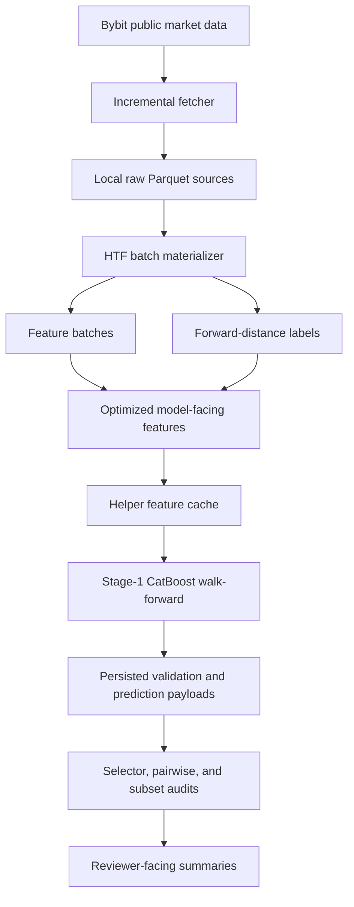

# HTF Workflow Architecture

This is the maintained architecture overview for the current higher-timeframe
research workflow.

## System Flow

## Main Boundaries

| Boundary | Source of truth | Responsibility |
|---|---|---|
| Data fetch | `fetchingByBit/update_data.py` | Incremental public market-data refresh |
| HTF materialization | `scripts/feature_engineering/htf_multiregime_pipeline.py` | Regime/family batches, features, labels, validation |
| HTF launcher | `notebooks/htf_pythonscript.py` | Production orchestration and run logging |
| Stage-1 runner | `scripts/analysis/htf_stage1_regime_family_walkforward.py` | CatBoost walk-forward execution across roots |
| Stage-1 core | `scripts/htf_backtest/catboost/` | Per-step training, selection, and persisted payloads |
| Diagnostics | `scripts/analysis/htf_*` | Offline audits and summary generation |
| Rust helpers | `riskyield_rust/src/` | Accelerated helper models exposed through PyO3 |

## Temporal Safety Model

The design assumes market data is append-only during ordinary updates. The
pipeline protects this assumption with:

- chronological batch construction,
- family metadata for shifted regimes,
- feature fingerprinting,
- incremental resume checks,
- label repair for former partial tails,
- walk-forward evaluation instead of random splits,
- persisted validation payloads for post-run audit.

Any source correction or feature-code change can invalidate historical artifacts.
In that case the affected stage should be rebuilt intentionally rather than
silently mixed with existing outputs.

## Generated Artifact Policy

The architecture deliberately keeps large artifacts out of Git:

- raw Bybit source parquet files,
- model-facing feature batches,
- helper caches,
- CatBoost run directories,
- local status logs.

Reviewer-facing summaries and schema snapshots are tracked separately in
Markdown or curated `test_output/` summaries.
