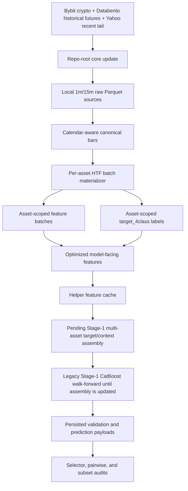

# HTF Workflow Architecture

This is the maintained architecture overview for the current higher-timeframe
research workflow. The source-data and HTF materialization layers are
multi-asset-aware. Stage-1 and downstream analysis are still legacy
regime/family workflows until target-asset and context-asset selection are
implemented.

## System Flow

## Main Boundaries

| Boundary | Source of truth | Responsibility |
|---|---|---|
| Data fetch | `update_data.py --core` | Bybit crypto plus multi-asset Databento/Yahoo source refresh |
| HTF asset registry | `scripts/feature_engineering/htf_asset_registry.py` | Core asset set and raw source routing |
| HTF calendar layer | `scripts/feature_engineering/htf_trading_calendar.py` | Canonical market-open bars, session metadata, and open-gap fill flags |
| HTF materialization | `scripts/feature_engineering/htf_multiregime_pipeline.py` | Per-asset regime/family batches, features, labels, validation |
| HTF launcher | `notebooks/htf_pythonscript.py` | Production orchestration and run logging through `HTF_ASSETS` |
| Stage-1 runner | `scripts/analysis/htf_stage1_regime_family_walkforward.py` | Legacy CatBoost walk-forward execution across regime/family roots |
| Stage-1 core | `scripts/htf_backtest/catboost/` | Per-step training, selection, and persisted payloads |
| Diagnostics | `scripts/analysis/htf_*` | Legacy offline audits and summary generation |
| Rust helpers | `riskyield_rust/src/` | Accelerated helper models exposed through PyO3 |

## Temporal Safety Model

The design assumes market data is append-only during ordinary updates. The
pipeline protects this assumption with:

- chronological batch construction,
- family metadata for shifted regimes,
- feature fingerprinting,
- incremental resume checks,
- label repair for former partial tails,
- walk-forward evaluation instead of random splits,
- persisted validation payloads for post-run audit.

Any source correction or feature-code change can invalidate historical artifacts.
In that case the affected stage should be rebuilt intentionally rather than
silently mixed with existing outputs.

## Generated Artifact Policy

The architecture deliberately keeps large artifacts out of Git:

- raw Bybit, Databento, and Yahoo source parquet files,
- model-facing feature batches,
- helper caches,
- CatBoost run directories,
- local status logs.

Reviewer-facing summaries and schema snapshots are tracked separately in
Markdown or curated `test_output/` summaries.
