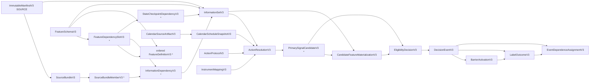

# Trading Event V3.2 action-resolution foundation contract

Status: the breaking V3.2 logical identity gate, typed source/feature evidence
graph, authoritative scheduled-action resolver, candidate/materialization graph,
local append-only governance ledger, and a narrow V3.3 physical-evidence
reference path are implemented. A parallel V4 correctness store now provides
the continuous RFC 9162 disposition commitment and transactional `STRICT`
projection, causal selector, deterministic health transitions, and local
projection-clock-owned `DECISION_INPUT` gate. `EXECUTION_BAR` is represented
but forced to `ABSTAIN`; the atomic H1/H2/order-intent bridge, governance/Analyst
authority bridge, and live writer do not yet exist.
These components are not yet
connected to the legacy Analyst or RPF pipelines and are not a profitability or
deployment claim. In particular, a resolved schedule is not evidence of a
completed market-data row, live venue status, order acceptance, or fill, and
the V3.3 reference path is not a live-ready collector or an acceptance-complete
physical store.

This is the first gated implementation tranche from
`docs/research/trading_prediction_system_diagnosis_and_redesign_2026-07-14.md`.
It establishes one causal vocabulary for future historical replay, forward
paper trading, live evidence, split construction, and model trials.  It does
not change signal generation, position opening, UI behavior, or live trading.

## Design decision

The package uses dependency-free, frozen, slotted standard-library dataclasses
with explicit parsers and validators.

| Alternative | Decision | Reason |
|---|---|---|
| Loose dictionaries | Rejected for identity-bearing records | They permit missing/unknown keys, silent scalar coercion, nested mutation, and inconsistent hashing. Dictionaries remain boundary values only. |
| Pydantic models | Not selected for the protocol core | Pydantic is declared elsewhere in the repository but is absent from the active runtime. Its strict JSON mode still intentionally parses some strings into typed values, and frozen models provide only faux immutability for mutable nested values. It remains appropriate for API adapters later, not the dependency-free identity layer. |
| Frozen dataclasses | Selected | Exact constructors, no runtime dependency, predictable import surface, and explicit control over canonicalization and graph validation. Nested collections are tuples; manifest payloads are stored internally as canonical JSON text. |
| One monolithic trade row | Rejected | It lets future fills, barriers, outcomes, costs, or population weights rewrite the pre-outcome event identity. |
| Separate causal records | Selected | Information, eligibility, decision, barrier activation, outcome, and dependence assignment mature at different times and have different identity rules. |

Relevant primary documentation:

- [Python dataclasses](https://docs.python.org/3/library/dataclasses.html)
- [Pydantic strict mode](https://docs.pydantic.dev/latest/concepts/strict_mode/)
- [Pydantic faux immutability](https://docs.pydantic.dev/latest/concepts/models/#faux-immutability)

## Canonical identity protocol

`riskyieldmm_canonical_json_v1` is a deliberately smaller domain than general
JSON:

- UTF-8, compact JSON with lexicographically sorted object keys;
- no duplicate object keys;
- no binary floats, NaN, or infinity;
- integers restricted to the interoperable I-JSON range;
- financial values stored as canonical decimal strings, with at most 38
  significant digits and 18 fractional digits;
- exact RFC 3339 timestamps, normalized to UTC, with microsecond resolution;
- timestamp precision above six fractional digits is rejected rather than
  truncated;
- the unknown `-00:00` offset, naive times, datetime subclasses, and non-NFC
  identifiers are rejected;
- record/schema/domain names are included in every digest.

The protocol is inspired by [RFC 8785 JSON Canonicalization Scheme](https://www.rfc-editor.org/rfc/rfc8785.html),
including its I-JSON and deterministic-ordering goals.  It is intentionally
not labelled full JCS: RFC 8785 relies on ECMAScript number serialization,
whereas this protocol prohibits floats in identity-bearing JSON and stores
exact financial numbers as strings.  This also closes Python `json` defaults
that otherwise accept non-finite numbers and repeated names; see the official
[Python JSON documentation](https://docs.python.org/3/library/json.html).

Golden bytes and SHA-256 vectors in the tests make a canonicalization change a
visible protocol migration rather than a silent ID rewrite.

The event schema version is explicitly `riskyieldmm_trade_event_v3_2`. V3.2
changes candidate and decision shapes so they bind the exact action resolution
and executable contract; a V3.1 or older opaque V3 payload must not be silently
reinterpreted by supplying defaults. Existing evidence remains an audit
artifact and requires an explicit migration or a new ledger lineage. The
calendar/action records use the companion
`riskyieldmm_calendar_action_v3_2` schema.

## Causal record graph



The one-to-many step from an InformationSet to candidates is intentional. A
LONG and a SHORT alternative at one cutoff may share identical raw evidence
while having different economics and different candidate-conditioned feature
vectors. One information-set-level materialization cannot represent that grain
without collision or duplicated raw evidence.

### `SourceBundleMemberV3` and `SourceBundleV3`

A source member is one exact content-addressed source slice. It binds source
role, optional asset/venue/contract/timeframe scope, ordered fields, source
schema, availability/revision/calendar policies, semantic content root,
separate artifact hash, event coverage, row count, knowledge cutoff, and
optional parent lineage. The source roles distinguish pre-decision
`DECISION_INPUT` evidence from `CALENDAR`, `UNIVERSE`, `PATH_EVIDENCE`, `LABEL`,
and `OUTCOME` material.

A bundle is the finite closed world behind a SOURCE manifest's
`source_content_root`. It binds a sorted set of member IDs and common source,
schema, calendar, universe, vintage, availability, revision, and cutoff
policies. Graph validation rejects unresolved or substituted members, duplicate
member keys, lineage cycles, member removal, and non-monotone coverage or
knowledge clocks. Direct successors preserve the member key and, once
non-empty, event start; an empty member may acquire its first event with its
first row. Successors reference the exact predecessor, never reduce row count,
and strictly advance their knowledge cutoff. Row/coverage changes require a
new semantic root, and semantic changes require a new artifact hash. New or
changed members postdate the parent-bundle cutoff. Vintage class is immutable
within a lineage: prospective live evidence must begin at a separate
`LIVE_FIRST_SEEN_CERTIFIED` root. Only a `DECISION_INPUT` member may satisfy a
pre-decision observation slot.

The logical `semantic_content_root` and physical `artifact_hash` are separate.
The former identifies declared content semantics; the latter protects one
concrete file. Neither a Parquet byte stream nor an Arrow IPC schema defines a
logical V3.2 record ID.

Member objects are immutable staged evidence, not independent authoritative
lineage heads. A successor can be staged only when its parent is present in the
active bundle and its cutoff follows that bundle; the bundle lineage CAS then
selects the authoritative complete member set. Multiple staged alternatives
may coexist, but only an active-bundle parent may be extended and only one
valid bundle transition commits a selection. This permits a bad or premature
new-key candidate to be replaced before bundle commit without poisoning the
source lineage.

### `FeatureDependencySlotV3`, `FeatureDefinitionV3`, and `FeatureSchemaV3`

A dependency slot is a reusable, finite input contract. It declares evidence
kind (`OBSERVATION`, `STATE_CHECKPOINT`, or `PROTOCOL_CONSTANT`), selection
mode, missing-input behavior, minimum/maximum cardinality, whether those bounds
apply in `TOTAL` or `PER_SOURCE_MEMBER` scope, maximum age where applicable,
and the permitted member keys, fields, policies, state schema, or protocol
fields. Per-member bounds are checked for every declared source-member key;
state and protocol slots are total-only. Complete graph validation counts
unique realized inputs and always fails closed on excess, stale, wrong-role,
wrong-field, wrong-policy, foreign-member, empty-member, or conflicting
observation-revision evidence. Counts below `minimum_count` execute the frozen
missing-input policy: `FAIL` rejects, `ABSTAIN` later requires an
`ABSTAIN_DATA` eligibility verdict, and `NULL_WITH_INDICATOR` requires null
dependent values plus an exact binary `1.0` indicator. When the slot is
sufficient, that indicator must be `0.0`.

Selection-mode names are not yet physical inclusion proofs. The logical graph
can enforce singular `LATEST_AVAILABLE_ASOF`/`PRIOR_STATE_CHECKPOINT`, exact
cardinality, age, and clocks, but it cannot prove that a row is globally latest,
that a trailing window is contiguous and complete, or that `EXACT_EVENT`
matches an external event. Those guarantees require the later physical-row,
completed-bar, and adapter gate. The V3.2 calendar resolver can prove that an
action window was scheduled; it does not prove that any physical observation
row is the row named by a dependency slot.

A feature definition binds its name/family/role, nullability, transform,
parameters and normalization hashes, input slot IDs, earlier derived-feature
IDs, whether it is candidate-conditioned, and the allowlisted immutable
candidate fields it declares as inputs. A feature schema binds the
semantic set of slots and the **ordered** feature-definition IDs. Slot order is
set-like; feature order is part of identity because it fixes vector position.
The slot set may be empty for a schema whose roots are entirely declared
candidate fields; dummy raw or protocol inputs are forbidden.
The protocol manifest's `feature_schema_id` must resolve to this exact typed
schema. `NULL_WITH_INDICATOR` slots require a directly bound, non-nullable
`MISSINGNESS_INDICATOR` feature. Every ordinary feature with `ABSTAIN` or
`NULL_WITH_INDICATOR` in its direct or derived ancestry must be nullable.

### `InformationDependencyV3`

Binds one declared dependency slot, source-bundle member, exact field set and
source revision, together with these clocks:

```text
source_event_ts
bar_open_ts
bar_close_ts
source_publish_ts (nullable only when the source does not provide it)
ingested_first_seen_ts
revision_received_ts
feature_available_ts
```

The accepted ordering requires a positive-duration bar, keeps the source event
inside that bar interval, and unconditionally requires
`source_event_ts <= ingested_first_seen_ts`. When publication time exists it
also requires `source_event_ts <= source_publish_ts <=
ingested_first_seen_ts`. Receipt and feature readiness must precede the
InformationSet cutoff. A null publication timestamp therefore cannot bypass
the causal first-seen clock.

Within one information set, a member/revision ID has one consistent set of
source coordinates; the same member/revision/ordered-field set has one value
digest. A logical member row reused across slots counts once, conflicting
revisions fail, and unique realized rows cannot exceed the member's frozen
`row_count`. The later physical adapter must still prove that those declared
rows and digests are actually included in `semantic_content_root` and the
artifact.

The ledger extends revision consistency across information sets, keyed by
stable source-member key plus revision ID. Reusing the same revision with the
same coordinates and field-value digest is allowed; changing either claim is a
conflict. The current implementation verifies this by scanning prior
InformationSets. A normalized claim index is a later scale optimization and
must preserve identical semantics.

`StateCheckpointDependencyV3` separately binds the slot, state schema,
optional parent, state cutoff, availability, and value digest. Its
`state_checkpoint_id` is derived from those fields and verified when parsed,
rather than accepted as a caller-supplied identity. Its availability must not
follow the information cutoff, and the slot's finite age bound is enforced by
the complete evidence graph. A checkpoint digest and clock do not by
themselves prove causal computation; prefix-invariance and replay/live parity
remain later adapter tests.

### `InformationSetV3`

Binds the exact source manifest, calendar, universe snapshot, feature schema,
realized raw and state dependencies, cutoff, vintage, certification, and data
quality. It is deliberately candidate-neutral and contains no derived float
vector. Raw dependencies may be empty when the schema is state-only or
protocol-only; the complete schema/cardinality validator, not a blanket row
requirement, decides whether the information set is realizable. It has two
identifiers:

- `information_set_id`: semantic observation identity;
- `record_hash`: the exact assembly and certification attestation.

Candidates and materializations bind both. Therefore the same raw information
can support multiple alternatives without allowing a later record to
substitute another assembly or certification. The ledger still rejects a
conflicting InformationSet record for one semantic identity.

`NOMINAL_CURRENT_REVISION` is never point-in-time certified.  This prevents the
existing historical bars from being retroactively presented as first-seen
evidence. Conversely, assigning `LIVE_FIRST_SEEN_CERTIFIED` to a backfilled
historical record does not prove that it was available before the historical
decision: the ledger records when those bytes were accepted, not when an
unobserved past system first saw them. A real-time availability claim requires
prospective registration and independent observation/retention, before the
decision cutoff, of a checkpoint prefix that covers the receipt.

### Calendar and scheduled-action evidence

V3.2 inserts an authoritative logical resolution between the InformationSet
and every candidate:

```text
CalendarSourceArtifactV3 -> CalendarScheduleSnapshotV3

InformationSetV3
+ CalendarScheduleSnapshotV3
+ ActionProtocolV3
+ InstrumentMappingV3
+ frozen signal intent
-> resolve_action_v3(...)
-> ActionResolutionV3
-> PrimarySignalCandidateV3
```

`CalendarSourceArtifactV3` binds the authority class, source locator and
document identity, exact content and parser hashes, effective interval, and
publication/retrieval/first-seen clocks. `CalendarScheduleSnapshotV3` binds
that exact artifact and record hash to one venue/product/contract scope, a
named timezone, pinned timezone-database and compiler identities, one base
timeframe, finite coverage, and ordered non-overlapping half-open UTC
`TradingIntervalV3` records. Updating a holiday, early close, timezone rule, or
source artifact creates another snapshot rather than rewriting a prior
resolution. A reviewed provider adapter must not issue declared
`OFFICIAL_VENUE` evidence from the observed-gap `futures_session_observed`
legacy calendar or from synthetic carry-forward bars.
The schedule is malformed unless the exact artifact was completely retrieved
before the schedule's `known_at` clock, its effective interval encloses the
entire compiled coverage, and a declared `OFFICIAL_VENUE` authority name equals
the calendar venue. Regulator, authorized-vendor, and secondary-reference
records cannot authorize V3.2 action. The logical record integrity-binds the
caller-declared metadata and content/parser hashes; it does not authenticate a
remote host, signature, parser execution, or protect against relabeling legacy
content as official. The provider adapter must enforce its reviewed
official-host/parser policy before live promotion.

`ActionProtocolV3` freezes the pure selection rule, execution-bar duration,
computation and submission delays, entry-window width, bounded search, and
grid semantics before the information cutoff. The first admitted rule and
entry scenario are deliberately narrow:
`NEXT_SCHEDULED_BASE_BAR_OPEN`. `resolve_action_v3()` selects the first
matching-enabled grid open strictly after the computed submission clock and
requires the complete entry bar/window to fit one admitted schedule interval.
It never reads a price row, infers a session from missing observations, or
inserts a synthetic bar. Equal-clock corrections remain ordered by ledger
receipt lineage. The pure resolver consumes one exact calendar; before any
resolved or abstained result may occupy its action key, the ledger requires a
deterministic as-of revision. When a schedule-valid window exists, it selects
the latest known calendar covering the submission and complete action window.
When none exists, it selects the latest known same-scope calendar covering the
submission if one exists, otherwise the latest known same-scope calendar. A
future or non-overlapping successor does not stale an applicable parent.

`InstrumentMappingV3` maps the model-facing asset/contract to one concrete
executable contract for a known, effective interval. A direct mapping must
preserve contract and price identity. Continuous futures require a
point-in-time mapping from the research alias to the listed contract, including
the complete action window; an unresolved roll abstains. A reciprocal FX
series is also unsupported until a separate execution transform specifies and
tests side, price, high/low, tick, quantity, barrier, cost, and fill semantics.
The pure resolver likewise consumes one exact mapping. When a schedule-valid
window exists, ledger validation uses the latest known mapping covering that
window if one exists, otherwise the latest known same-scope mapping; this
includes a newer blocking mapping. When no schedule-valid window exists, it
uses the latest known same-scope mapping because no action interval exists. A
mapping gap abstains; it cannot silently delay the action to a later session
where the mapping happens to fit or reserve the action key ahead of a valid
mapping.

`MAPPING_NOT_KNOWN` is a pure-resolver diagnostic when the caller supplies a
mapping whose `known_at` is after the information cutoff. The causal ledger
deliberately rejects that record because future evidence cannot certify a past
no-trade decision. Other governed mapping-related abstentions may cite a
same-scope mapping known by the cutoff: for example, a non-executable blocker
produces `MAPPING_NOT_EXECUTABLE`, while a known mapping that misses the first
schedule-valid window produces `MAPPING_WINDOW_MISSING`. Canonically recording
the complete absence of any as-of mapping evidence requires a future explicit
absence-evidence contract; it is not silently synthesized in V3.2.

`ActionResolutionV3` content-addresses the exact information record, calendar,
action protocol, instrument mapping, signal intent, side, and deterministic
result. `RESOLVED` records carry the selected interval, concrete contract, and
derived order/entry/expiry clocks. `ABSTAINED` records carry one typed reason
and no invented action clocks. The ledger registers source artifact,
schedule, action protocol, mapping, information, then resolution before a
candidate, replays the pure resolver, and permits only one content-consistent
result for the logical action request.

This is a **scheduled-action proof**, not a physical-market proof. It does not
establish that a provider delivered a completed immutable candle, that the
venue was reachable and matching orders, that an instrument-status or halt
feed was current, or that an order was accepted or filled at the scheduled bar
open. Those claims remain fail-closed until provider-specific completed-bar,
first-seen, venue/status, feed-health, row-inclusion, and execution evidence are
implemented and tested prospectively.

### `PrimarySignalCandidateV3`

Seals one economically complete primary-signal alternative before scoring. It
binds the exact InformationSet record, signal and side, signal/candidate
clocks, entry reference and executable window, action/label/barrier/cost
policies, risk unit, stop/target multiples, holding horizon, estimated cost,
vintage, and certification. It additionally binds the exact action-resolution
ID and record hash plus the resolved executable contract. Scope, signal intent,
action protocol, scenario, contract, and clocks must equal that prior resolved
record; an abstention cannot become a candidate. Changing side, target, stop,
timeout, entry window, resolution, executable contract, or cost proposal
creates a different candidate instead of reusing a score under changed
economics.

The older `FORWARD_MARKET_ORDER` and `LIVE_MARKET_ORDER` enum values remain for
historical outcome/execution compatibility, but the first V3.2 action protocol
does not authorize them. A later provider-specific execution adapter must bind
certified prospective first-seen evidence, live status/feed health, and
post-protocol source receipts before either can be promoted. A
`point_in_time_certified` data-vintage flag must not be misread as that physical
or operational proof.

### `CandidateFeatureMaterializationV3`

Binds one exact ordered vector to the InformationSet record, candidate record,
and FeatureSchema. Its semantic ID includes the schema, vector encoding,
feature/missing counts, and digest of the ordered values. Its record hash also
binds the exact encoded values, availability clock, vintage, and certification.
One key is accepted per
`(InformationSet record, candidate record, feature schema, encoding)`; a
different vector for that same key is a ledger determinism conflict.

Across candidates sharing the exact InformationSet record and schema, the
ledger also compares every feature position whose definition is
`candidate_conditioned=false`. Those positions must be bit-identical; only
candidate-conditioned positions may vary. Candidate conditioning taints the
derived-feature DAG, so a neutral definition cannot derive from a conditioned
ancestor. A conditioned root must declare at least one field from the sealed
candidate-economic-field allowlist; conditioned descendants inherit taint and
may add their own declared fields. Missingness indicators are always neutral.
Transform hashes remain opaque at this logical gate: the physical feature
adapter must still attest that executable code reads only the declared inputs.

The encoding `riskyieldmm_float64_be_hex_null_v1` stores each finite IEEE-754
binary64 value as 16 lowercase big-endian hexadecimal characters and stores a
missing value as JSON `null`. It rejects booleans, malformed hex, NaN,
infinity, and negative zero. Prices, barriers, costs, and risk units remain
canonical decimal strings. Exact vector bits establish identity, not numerical
equivalence across libraries; replay/live feature parity still must be tested.

### `EligibilityDecisionV3`

Represents only the deterministic primary-signal cohort decision:
`ELIGIBLE`, `INELIGIBLE`, or `ABSTAIN_DATA`.  It is not a portfolio, capital,
position, risk-budget, or order-acceptance decision.

The factory binds the exact InformationSet, candidate, and candidate-feature
materialization IDs and record hashes. Evaluation cannot precede feature
availability or follow the candidate's earliest order-submission time. An
eligible event therefore cannot be produced from another side, economic
proposal, stale vector, or substituted schema/materialization.

### `DecisionEventV3`

Contains only facts and policies frozen before entry:

- exact InformationSet, candidate, materialization, and eligibility record
  hashes;
- exact action-resolution ID and record hash, and the resolved executable
  contract;
- scope and content-addressed primary candidate/policy;
- side, decision, order, entry-window clocks;
- action, label, barrier, and cost policy IDs;
- risk-unit distance, stop/target R multiples, and holding horizon;
- source vintage and certification.

Required order:

```text
observation cutoff <= InformationSet assembled
<= candidate available
<= candidate features available
<= eligibility evaluated
<= decision
<= earliest order submission
< earliest executable entry
<= entry expiry
```

Fill price, stop/target prices, exit, score, model probability, portfolio
state, and realised PnL are deliberately absent from `decision_event_id`.
`decision_event_key` is derived only from the exact eligibility-decision ID and
record hash. The ledger uses that key as compare-and-swap identity, so changing
`decision_ts` cannot create a second accepted decision for one eligibility
record.

### `BarrierActivationV3`

Created only after an entry fill is observed.  It binds the exact entry
revision, price, time, activation clock, and deterministically computed stop
and target.  Stop and target must equal the pre-event risk unit multiplied by
the frozen stop/target R multiples.  This prevents an outcome label from
hindsight-selecting convenient barriers.

When registered through `V3GovernanceLedger`, the activation receives an
append-only, hash-chained receipt before a later outcome can reference it.

### `LabelOutcomeV3`

Appended later and linked to an unchanged decision and, for a filled event, the
exact barrier-activation record.  It models TP-first, SL-first, timeout,
ambiguous, no-fill, and cancelled outcomes; exact itemized conservative cost
deductions; path/evidence IDs; MAE/MFE/gap fields; and supersession.

The graph validator enforces:

- entry lies in the frozen entry window;
- execution mode matches historical, forward-paper, or live entry scenario;
- a timeout matures exactly at the frozen holding deadline;
- no-fill matures at entry expiry;
- label barrier evidence starts when the frozen barriers become active for a
  fill, or at earliest entry for an unfilled order; holding/PnL still begins at
  the actual fill;
- TP-first and SL-first records bind an explicit trigger time, trigger price,
  and evidence-revision ID; the trigger must reach the frozen barrier, and a
  nominal historical or forward-paper exit must respect the same geometry;
- exact LONG/SHORT gross basis-point return and R-multiple recomputation using
  decimal arithmetic and half-even rounding to `1e-8`;
- net return equals gross return minus itemized deductions;
- an ambiguous path cannot choose caller-supplied favourable bounds: its gross
  lower and upper bounds are recomputed from the frozen stop-first and
  target-first scenarios, while exit price, gross return, and R multiple use
  the conservative stop-first result.

Costs are currently explicitly conservative nonnegative deductions.  Maker
rebates and signed funding/borrow cash flows require a later signed economic
adjustment contract; they must not be smuggled in as negative costs.

### `EventDependenceAssignmentV3`

Overlap clusters, concurrency, and uniqueness weights are population-derived.
They therefore live outside the intrinsic label identity.  The assignment
binds the complete dependence interval from earliest entry through
`label_known_ts`, the dependence policy, event/outcome IDs, assignment clock,
and supersession.  The split engine must resolve these before certifying folds.

## Experiment-manifest graph

`ImmutableManifestV3` uses a five-field content-addressed envelope:

```text
canonicalization_version
schema_version
manifest_type
payload
manifest_id
```

Supported exact payload types are:

```text
SOURCE -> PROTOCOL -> SPLIT -> TRIAL_SPEC -> TRIAL_RESULT
```

Source snapshots carry a stable source-contract ID, parent snapshot, and a
`source_content_root` that must resolve to the exact typed SourceBundle.
Prospective first-seen data can therefore extend frozen source/member lineage
without rewriting the protocol. Protocols bind data/schema policies, the exact
typed `feature_schema_id`, signal and eligibility policies,
action/label/barrier/cost policies, evaluation governance,
code/workspace/environment, metrics, split policy, and holdout policy. Trial
results bind the effective source, split, protocol, code, workspace, and
runtime environment; successful results must match the frozen protocol.

The split-policy ID is itself derived from the exact purge policy, embargo
policy, and complete TRAIN/VALIDATION/CALIBRATION/POLICY/TEST role set.  A split
cannot silently substitute any of those components while retaining the
protocol's policy identity.

`validate_manifest_graph()` resolves types, source ancestry, clocks, protocol
and split agreement, parent-trial family/order, and successful-run bindings.
Parsing one manifest in isolation does not establish those properties.

The split payload contains an immutable cohort class (`DEVELOPMENT`,
`QUARANTINE_CANDIDATE`, or `FINAL_HOLDOUT`).  Mutable access/opening state is
reserved for the governance receipt ledger, so opening a holdout does not
rewrite split identity.  Every split binds the protocol's holdout-policy ID,
and the graph validator permits only one `FINAL_HOLDOUT` split per protocol in
a complete registry, preventing selection among multiple observed holdouts.
The ledger additionally requires every effective holdout SOURCE descendant,
its bundle, and each non-anchor member to have a receipt after the protocol
receipt. Declared timestamps alone cannot establish that ordering.

Because vintage cannot change in-line, a final-holdout protocol is anchored to
a prospective live root and evaluates later same-vintage descendants. A model
developed on a separate nominal or historical lineage still needs an explicit,
content-addressed promotion artifact that binds its frozen weights and training
evidence into that live protocol. That cross-lineage promotion record is not
implemented in this gate, so the present holdout machinery is not yet a full
model-promotion workflow.

The strict evidence and record validators close the boundary between the two
graphs. They resolve the SourceBundle members, dependency slots, feature
definitions/schema, realized observation/state evidence, CalendarSourceArtifact,
CalendarScheduleSnapshot, ActionProtocol, InstrumentMapping, InformationSet,
ActionResolution, candidate, materialization, eligibility, and decision. The
selected source, vintage, calendar, universe, feature schema, eligibility,
primary-signal, action, label, barrier, and cost policies must match the
protocol exactly. Candidate clocks and executable contract must match a
successful resolution byte for byte; callers cannot choose them independently.

## Implemented governance and persistence rule

`from_mapping()` proves only canonical syntax, local invariants, and content
hashes. It never proves that referenced records exist or that a declared time
was truthful. `riskyieldmm.trading.V3GovernanceLedger` now enforces the local
registration boundary:

1. resolve the referenced source members/bundles, dependency slots, feature
   definitions/schemas, calendar source/schedule, action protocol, instrument
   mapping, InformationSet, ActionResolution, candidate, feature
   materialization, eligibility, decision, activation, outcome, dependence,
   source, protocol, split, and trial records;
2. call every `validate_against()`, `validate_manifest_graph()`, and
   `validate_record_protocol_graph()` method;
3. enforce one authoritative active head per committed semantic key and
   acyclic, monotone supersession. `SOURCE_BUNDLE_MEMBER_OBJECT` records are an
   explicit exception: they are immutable staged values, and the
   `SOURCE_BUNDLE_LINEAGE` transition selects the authoritative member set;
4. reject conflicting materializations and duplicate-key conflicting writes;
5. reject a final-holdout split when its effective source, bundle, or non-anchor
   members were registered before the protocol;
6. reject forward/live candidates under the same pre-protocol source-receipt
   ordering or without certified live first-seen evidence;
7. preserve global source-revision claims and candidate-neutral feature
   projections across otherwise distinct records;
8. atomically append the exact canonical BLOB, an immutable semantic-head
   transition, and a receipt binding global/channel sequence, receipt time,
   object/native/content hashes, head type, expected/new head, idempotency key,
   validation version, and both previous receipt hashes;
9. sign exact receipt prefixes with Ed25519, bind a one-time final-holdout
   authorization grant to the latest pre-grant checkpoint and its frozen
   artifact/approval/evidence/anchor commitments, then require a registered,
   externally retained post-grant checkpoint to seal the grant receipt.

The implemented local profile uses a private local directory, one POSIX-locked
writer, SQLite `DELETE` journal mode, `synchronous=EXTRA`, and
`BEGIN IMMEDIATE`. The current SQLite 3.51.1 runtime is explicitly rejected for
WAL because it predates SQLite's WAL-reset race fix. Canonical objects,
receipts, head transitions, checkpoints, and grants are immutable tables;
active heads are derived from transition history rather than mutable pointers.
Every mutation revalidates the required connection durability and defensive
pragmas, so an in-process downgrade such as `synchronous=OFF` fails closed
before append.
The ledger ID is recomputed from a stored random nonce plus its creation time,
schema/canonicalization/validation versions, journal mode, and object-size
policy; receipts/checkpoints thereby bind those metadata rather than only a
free-standing identifier.
New ledger/backup files are created exclusively with no-follow protection where
available; existing files with unsafe ownership, type, link count, or mode are
rejected rather than silently repaired.

`verify()` pins one SQLite read snapshot and checks integrity/foreign keys,
recomputed metadata-bound ledger identity, an exact application-schema
fingerprint, canonical round trips, receipt-to-operation-child bijections,
object/reference chronology, manifest and record graphs, split roots,
global/per-channel chains, semantic-head history, checkpoint roots, and holdout
bindings. A supplied verifier checks every stored checkpoint signature;
supplying an externally retained checkpoint additionally authenticates its
exact prefix. The report exposes that trusted sequence and the count of later
unanchored receipts. A stored signature without an independent checkpoint copy
still cannot prove that the whole database was not replaced.

Checkpoint verification rejects noncanonical Ed25519 public-key/`R` encodings,
identity and non-main-subgroup points, and noncanonical `S` scalars before
calling the provider verifier. This closes an observed all-zero key/signature
acceptance case in the active OpenSSL/`cryptography` stack.

A content hash detects changed content. It does not prove when that content
first existed, whether a declared source timestamp is truthful, or whether the
same Unix account read a holdout directly. Only records accepted prospectively
through the ledger may make the narrower local first-registration claim.
Historical or backfilled `LIVE_FIRST_SEEN_CERTIFIED` records do not acquire
real-time pre-decision availability retroactively. The holdout API first records
an evaluation *grant*, then `verify_holdout_evaluation_seal()` proves that a
registered, externally retained post-grant checkpoint covers its receipt.
Neither step is a physical blindness mechanism; that requires the later
isolated evaluator and access-control gate.

## V3.3 physical market-data boundary

The first physical-evidence contract is implemented in
`riskyieldmm/trading/physical_market_data.py` under the separate
`riskyieldmm_physical_market_data_v1` schema. A physical source opts in when
its `source_contract_id` resolves to a registered `ProviderAdapterPolicyV3`.
Legacy opaque V3.2 source contracts remain readable but cannot be promoted as
V3.3 physical evidence. This is an opt-in compatibility boundary: the legacy
candidate path is still usable unless a deployment-level outer gate forbids
it, so current integration does not yet prove that every paper/live decision
passed physical evidence.

The physical graph is:

```text
ProviderAdapterPolicy + ObservationSelectionPolicy
→ exact bounded CaptureSegment
→ deterministic ObservationDerivation
→ immutable ObservationRevision
→ exactly one immutable ProviderMessageDisposition per captured occurrence
→ finite EvidencePrefix
→ recomputed DependencySelectionProof
→ InformationSet equality check
→ PhysicalEvidenceGate PASS or typed ABSTAIN
```

It preserves exact provider bytes and duplicate arrival occurrences, classifies
normal/duplicate/control/rejected/error occurrences exhaustively through one
reviewed classifier release, derives half-open bars through one frozen parser,
keeps corrections append-only, and
closes `EXACT_EVENT`, `LATEST_AVAILABLE_ASOF`, and
`TRAILING_COMPLETED_OBSERVATIONS` against one finite ledger prefix. A
physically governed member binds `semantic_content_root` to the evidence-prefix
ID and `artifact_hash` to the raw-receipt root. Historical imports and replay
cannot produce the prospective-live healthy state.

The reference normalizer is intentionally narrow: Bybit V5 public 1-minute
kline, with only provider `confirm=true` completing a bar. Bybit REST klines,
Yahoo, Twelve Data, continuous-futures aliases, and any source lacking concrete
mapping/status/freshness evidence remain non-authoritative.

Its accepted parser version/hash is a contract release allowlist, not
executable or build attestation. Treating Bybit's millisecond `end` as inclusive
and adding one millisecond to obtain a half-open interval is a fixture-locked
adapter inference from the provider examples, not an independently guaranteed
exchange semantic. Calling the same parser twice on one raw fixture proves
normalizer content identity; it does not prove operational replay/live parity.

The governance ledger adds an `OBSERVATION` channel and physically governed
information sets are currently validated by rebuilding a full-history
reference registry from canonical ledger objects. Prefix objects also carry
cumulative segment/disposition/revision/active-head identifiers. There is no
production typed observation index, continuous per-scope disposition
commitment, or streaming verifier yet;
the current approach becomes both object-size- and work-bound under a live
push stream. V3.3 starts a fresh ledger validation lineage because signed
checkpoint channel roots changed; older V3.2 ledger files remain immutable
artifacts for the prior verifier.

The reference ledger now fails closed by requiring every raw message in a
declared prefix to have exactly one immutable disposition. Normalized outcomes
bind one exact derivation/revision; duplicates and reviewed controls create no
observation; malformed/schema/scope/lag/clock/content/provider/status failures
become typed blockers. Prefix health and reconnect recovery are deterministic,
and semantic compare-and-swap rejects a second classification of the same
message. This closes silent omission and no-output semantics in the fixture
model but adds another cumulative ID array; it is not the bounded live design.
Protocol exact-one validation plus the ledger semantic-head CAS also rejects
multiple observation-selection policies for one dependency slot. Binding the
policy ID directly into a future portable protocol schema would improve
cross-ledger auditability, but the current ledger path is not exposed to a
same-slot policy-substitution exploit.

The isolated V4 lineage now implements the missing commitment/projection
primitives in `transparency_log.py`, `physical_evidence_v4.py`, and
`physical_projection_v4.py`, with frozen authority contracts in
`physical_health_v4.py` and `physical_gate_v4.py`: deterministic classifier results, scoped release
authority, all twelve dispositions, a continuous per-scope RFC 9162 tree,
stored hashes, constant-size heads/cutoffs, one-database canonical/typed
transactions, causal selection, reducer/oracle-checked health transitions,
exact InformationSet/gate commitments, and full-genesis replay. Authoritative
scopes bind registered role-exact primary/status policies; public admission and
full replay enforce capture membership/lineage, raw classifier/normalization
replay, monotone receipt/classifier clocks, and same-partition ACK/recovery.
Gate time is sampled internally under the frozen transaction: `DECISION_INPUT`
may locally pass, while `EXECUTION_BAR` always abstains and rejects PASS. This
lineage deliberately does not authorize paper/live decisions; migration,
scale/restart evidence, the cross-ledger authority bridge, and candidate/order/
fill enforcement remain explicit work.

Detailed research, provider semantics, threat boundaries, migration, and the
acceptance matrix are in
`docs/research/v3_physical_market_data_evidence_design_2026-07-14.md`. The
frozen V4 replacement is in
`docs/research/v4_physical_evidence_protocol_freeze_2026-07-14.md`; the earlier
fixed-epoch exploration is retained only as design history in
`docs/research/v3_4_bounded_physical_evidence_architecture_2026-07-14.md`.

## Explicit remaining gates

The foundation deliberately stops before pipeline migration. The governance
ledger and V3.2 logical source/feature/scheduled-action/candidate gates are
implemented sub-gates, not a deployment certification. No asset is promoted by
the generic resolver alone. The next gates must implement and independently
test:

1. validate actual V4 manifests and governance records, then connect the
   selector, health transitions, and clock-owned H1 gate to a non-bypassable
   governance/Analyst boundary that disables legacy V3 activation;
2. implement one atomic operation that binds H1, refreshes H2 health, derives
   `EXECUTION_BAR PASS` under a later reviewed policy, and persists the exact
   order intent/outbox before commit; H2 remains ABSTAIN-only until then;
3. finish the live vertical slice: a crash-safe Bybit writer; persisted outbound
   subscription intent with exact `req_id`, topic, provider connection ID, and
   authenticated-transport correlation; heartbeat/disconnect/reconnect and
   system-status evidence; deterministic 1m-to-HTF aggregation; operational
   replay/live parity; and 10k/100k/high-rate/restart/duration soaks;
4. point-in-time mappings from continuous futures aliases to concrete listed
   contracts, with roll-boundary validation; reciprocal USDJPY remains
   unsupported until its transformed execution economics are separately
   specified and tested;
5. an explicit cross-lineage model-promotion record binding the selected model
   artifact, training evidence, and approval into a prospective live protocol;
6. a revision-clocked path-evidence manifest plus an independent first-touch,
   gap, MAE/MFE, ambiguity, and label verifier;
7. an Arrow/Parquet physical schema and round-trip tests for every exact field;
8. signed build/release provenance plus runtime parser/collector identity
   evidence; the current release hash alone is insufficient;
9. signed funding/rebate/borrow adjustments if actual rather than conservative
   cost accounting is required;
10. deterministic cluster construction and interval-aware split certification;
11. adapters that produce identical V3.2 graphs from Analyst replay, forward
   paper, live inference, and RPF without changing current behavior during the
   shadow comparison.

Separately, four future-dependent legacy regime/calendar inputs
(`session_progress`, `minutes_to_close`, `session_close`, and `weekly_close`)
have been removed from the model-facing feature contract. Any historical root,
catalog, diagnostic, or model containing them remains quarantined and must be
rebuilt; code removal is not retrospective evidence repair.

Only after these pass should model baselines or feature expansion begin.

## Verification surface

- `tests/test_trading_evidence_v3.py`: exact source member/bundle and typed
  feature slot/definition/schema identities, lineage, membership, role,
  cardinality, ordering, and graph-substitution rejection.
- `tests/test_trading_event_contracts_v3.py`: canonical bytes, clocks,
  candidate-neutral information, action-resolution and executable-contract
  binding, LONG/SHORT candidate separation, exact binary64/null feature-vector
  identity, candidate/materialization binding, publication poison,
  certification, barrier geometry, economics, timeout, ambiguity, no-fill,
  supersession, and separated dependence metadata.
- `tests/test_trading_calendar_actions_v3.py`: exact calendar/action record
  round trips, strict next-grid boundary, maintenance and early-close gaps,
  declared-official venue scope, artifact retrieval/coverage, calendar and
  mapping knowledge cutoffs, first-window mapping coverage, overlap/alignment,
  synthetic-action prohibition, typed abstention, and cross-timeframe resolver
  parity.
- `tests/test_trading_manifests_v3.py`: exact schemas, deep immutability, golden
  IDs, typed source-bundle/feature-schema and calendar/action anchoring, status
  lifecycle, subsecond chronology, source/calendar/mapping lineage,
  protocol/split/trial graph checks, candidate-resolution replay, and frozen
  successful-run bindings.
- `tests/test_trading_manifest_progressive_v3.py`: complete pre-event evidence,
  InformationSet, candidate, materialization, eligibility, and
  decision-to-protocol validation, including stale or substituted graph nodes.
- `tests/test_trading_ledger_v3.py`: durability profile, causal append graph,
  typed-evidence registration order, candidate/materialization determinism,
  as-of calendar/mapping successor selection, backward-clock rejection,
  idempotency/conflict behavior, supersession, writer exclusion, rollback,
  one-snapshot verification, exact schema and receipt-child checks, hardened
  Ed25519 validation, trusted/unanchored reporting, post-grant seals, no-repair
  storage behavior, split roots, and backup.
- `tests/test_trading_ledger_cli.py`: read-only verification, external checkpoint
  and public-key verification, malformed input, missing ledger, and private-mode
  fail-closed behavior.
- `tests/test_trading_physical_market_data_v3.py`: exact raw receipt integrity,
  duplicate occurrences, capture lineage/epoch attacks, provider deployment
  and parser/classifier/feed-health allowlists, exhaustive typed message
  classification, duplicate binding, blocker/recovery rules, provider-lag
  enforcement, provider-final bar decoding, immutable revisions, active status
  and supporting-policy scope, canonical object budgets, health
  expiry/provisional tail rules, source-member binding,
  interval-aware exact/latest/trailing recomputation, dependency equality,
  gate abstention, and same-fixture parser identity.
- `tests/test_trading_physical_ledger_v3.py`: end-to-end physical ledger
  promotion, durable-clock enforcement, one-disposition semantic CAS, exact
  duplicate and neutral-control coverage, provider-error gate abstention,
  unverified-aggregation rejection, prefix/disposition omission and cutoff
  tampering, exact registered proof/dependency-set requirements,
  physical-gate-before-candidate ordering, cross-cutoff abstention rejection,
  and explicit legacy V3.2 compatibility.
