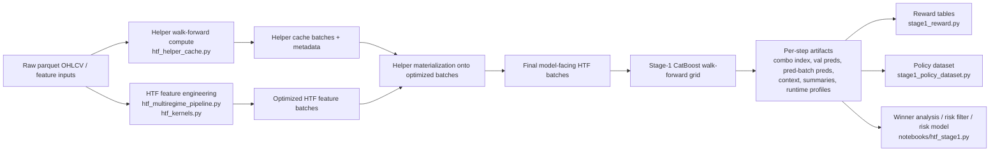

# RiskYieldMM Repository Analytical Report

## Executive summary

Enabled connector inventory used for this review: **github**.

`Pr3ez/RiskYieldMM` is best understood as a notebook-first quantitative research and backtesting workbench rather than a polished library. The strongest parts of the design are its explicit batch-oriented artifact contracts, its incremental helper-cache machinery, its staged HTF backtest workflow, and its Python-plus-Rust acceleration strategy for selected helper models. The project appears to target multi-timeframe feature engineering, helper-model precomputation, Stage-1 CatBoost walk-forward evaluation, and post hoc reward / policy / risk-model analysis over the generated artifacts. fileciteturn4file0 fileciteturn20file0 fileciteturn29file0 fileciteturn34file0

The largest practical blockers to reproduction are not algorithmic but operational: hardcoded absolute paths to a local Linux workspace, notebook cells that mutate `sys.path` and clear module caches, GPU-specific defaults in Stage-1 notebook execution, and an implicit dependency on local parquet datasets that are not fully described or bundled with the repository. For a fresh machine, I would rate out-of-the-box reproducibility as **medium-low**; after path/config refactoring and a fixture dataset, it could become **medium-high** quickly. fileciteturn29file0 fileciteturn32file0 fileciteturn33file0 fileciteturn34file0

There is substantial documentation, but it is not perfectly synchronized with current code. A good example is `docs/DETAILED_VALIDATION_CHECKLIST.md`, which describes missing config passthrough as a major issue, while the current `scripts/workflow/config.py` already passes a much broader set of fields into `SyncBacktestConfig`. This suggests active evolution and some document drift. Repository code should therefore be treated as the source of truth, with prose docs used as design intent and historical context. fileciteturn28file0 fileciteturn29file0

Algorithmically, the repository combines standard gradient-boosted trees and hyperparameter optimization with classic time-series / regime-detection helpers. Its CatBoost usage matches the official description of gradient boosting on decision trees with GPU-capable training, and its Optuna usage is consistent with the framework’s `Study` lifecycle model. The BOCPD helper aligns with the original Adams–MacKay online changepoint formulation. citeturn8search1turn8search2turn8search3turn8search0

## Repository scope and architecture

At a high level, the repository has four connected layers: workflow configuration, feature engineering and helper precomputation, HTF backtesting and Stage-1 artifact generation, and downstream analytics over those artifacts. The current workflow config centers on a narrow default horizon set, a larger target registry, a 10-helper L1 set, and optimization metadata utilities; helper caching then narrows to a smaller “live-safe” helper contract for materialization into HTF model-facing batches. fileciteturn29file0 fileciteturn20file0 fileciteturn30file0



This architecture is evidenced by the notebook orchestration in `notebooks/htf_stage1.py`, by the helper-cache dataclasses and build/materialization functions in `scripts/feature_engineering/htf_helper_cache.py`, and by the reward/policy builders in `scripts/htf_backtest/catboost/`. fileciteturn20file0 fileciteturn32file0 fileciteturn33file0 fileciteturn34file0

The most important modules I inspected directly are summarized below.

| Path | Primary responsibility | Key symbols / outputs | Primary evidence |
|---|---|---|---|
| `README.md` | Project overview, setup context, repository orientation | High-level pipeline entry context | `README.md` fileciteturn4file0 |
| `pyproject.toml` | Python packaging and dependency surface | Python deps for ML, backtesting, data IO | `pyproject.toml` fileciteturn9file0 |
| `riskyield_rust/Cargo.toml` and `riskyield_rust/src/lib.rs` | Native extension crate | Rust-backed helper/model acceleration | `Cargo.toml` fileciteturn18file0, `lib.rs` fileciteturn19file0 |
| `scripts/workflow/config.py` | Central workflow + backtest defaults | `WorkflowConfig`, `L2BacktestDefaults`, metadata readers | `config.py` fileciteturn29file0 |
| `scripts/workflow/l1_helpers.py` | Feasibility checks, config status scans, helper backend reporting | `compute_feasible_iters`, `scan_config_status`, `print_rust_status` | `l1_helpers.py` fileciteturn30file0 |
| `scripts/feature_engineering/htf_helper_cache.py` | Walk-forward helper generation, cache fingerprinting, cache materialization | `compute_helpers_walk_forward_raw`, `iter_helper_chunk_outputs`, `build_helper_cache_exact`, `materialize_helpers_from_cache` | `htf_helper_cache.py` fileciteturn20file0 |
| `scripts/htf_backtest/catboost/stage1_reward.py` | Reward-table construction from Stage-1 artifacts | `build_stage1_reward_table` | `stage1_reward.py` fileciteturn32file0 |
| `scripts/htf_backtest/catboost/stage1_policy_dataset.py` | Offline state/action/reward dataset building | `build_stage1_policy_dataset` | `stage1_policy_dataset.py` fileciteturn33file0 |
| `notebooks/htf_stage1.py` | Main Stage-1 execution and analysis notebook export | Cell 14 Stage-1 run, winner extraction, backfill, consensus signals, risk filter, risk model | `htf_stage1.py` fileciteturn34file0 |
| `docs/htf_stage1_logic.md` and `docs/htf_stage1_artifacts.md` | Stage-1 design and artifact contract | Runtime artifact semantics | `htf_stage1_logic.md` fileciteturn15file0, `htf_stage1_artifacts.md` fileciteturn16file0 |

## Core modules, algorithms, and data pipelines

The feature-engineering layer revolves around causal helper computation in chunked walk-forward mode. In `htf_helper_cache.py`, raw OHLCV data are converted into helper input features, helper ensembles are fit on historical prefixes, and prediction chunks are transformed with a continuity policy that explicitly distinguishes stateful helpers (`kalman`, `egarch`) from context-prepended helpers. The file also fingerprints source files and source parquet batches, records helper runtime contracts, and supports incremental-tail updates rather than full rebuilds. That is a strong design choice for large research datasets because it makes cache invalidation explicit and enables deterministic rebuild triggers. fileciteturn20file0

One of the important architectural subtleties is that the repository appears to maintain **two helper scopes**. The workflow config advertises a broad L1 helper set—`if`, `cusum`, `garch`, `hmm4`, `hmm5`, `kalman`, `evt`, `ou`, `bocpd`, `egarch`—with `EXPECTED_FEATURES = 91`, while the helper-cache contract’s default set narrows to `ou`, `garch`, `cusum`, `kalman`, and `egarch`. That does not automatically mean a bug, but it does mean the project has multiple helper universes: one for full L1 precompute and one for HTF helper-cache materialization. This is a maintainability hotspot and should be documented more explicitly. fileciteturn29file0 fileciteturn20file0

The Stage-1 HTF pipeline is richer than a simple “train one classifier” workflow. The notebook export in `notebooks/htf_stage1.py` shows a fixed Stage-1 run profile (`stage1_catboost_live`) with resume behavior, manual fallback triplet grids, auto-portfolio rebuilding, per-timeframe target specs, and a large artifact contract. For each batch step, the code expects `stage1_combo_index.parquet`, `stage1_val_predictions.parquet`, `stage1_pred_batch_predictions.parquet`, predecision context, runtime profiling, config snapshots, and batch metadata. Downstream notebook cells then compute winner tables, missing-winner backfill, live-style consensus signals over winner combos, calibrated risk filters, and a strict “live-safe” correlation-based bad-regime detector. fileciteturn34file0

The reward layer is well isolated. `stage1_reward.py` converts raw Stage-1 payloads into a per-combination reward table using per-combo metrics such as accuracy, macro-F1, cross-direction error, and log loss, then ranks combinations by a selected reward function. By default, it weights macro-F1 positively and cross-direction error negatively, leaving accuracy and log loss at zero weight unless overridden. That reward design is coherent with the domain: it values class balance and directional mistakes more heavily than plain accuracy. fileciteturn32file0

The policy-data layer adds another abstraction step. `stage1_policy_dataset.py` joins the reward table with `stage1_predecision_context.parquet`, computes step-best actions, and attaches lagged “best action” context columns for offline policy-learning or autoregressive policy modeling. The resulting outputs are `policy_events.parquet`, `policy_step_best.parquet`, and a metadata JSON describing state, action, and reward columns. This is one of the clearest “extension hooks” in the repository: it creates a bridge from supervised evaluation artifacts into sequential decision-learning datasets. fileciteturn33file0

Methodologically, the project’s main external algorithm choices are standard and credible. CatBoost is documented officially as gradient boosting on decision trees with GPU training support, Optuna’s documentation centers its study-based optimization lifecycle, and BOCPD is an established online changepoint method for causal inference over regime shifts. Those choices fit the repository’s live-safe, walk-forward, non-leaky design goals. citeturn8search1turn8search2turn8search3turn8search0

## Reproducibility and environment assessment

The repository has enough information to reconstruct a working environment, but not enough to make that environment frictionless. The good news is that it uses a standard Python package manifest plus a separate Rust crate, and the test files confirm imports such as `hmmlearn`, `pandas`, `numpy`, and the native `riskyield_rust` module. The less good news is that I did not see a lockfile, container recipe, or a small fixture dataset that would let a new user verify the setup end-to-end after installation. fileciteturn9file0 fileciteturn18file0 fileciteturn27file0

The single biggest reproducibility issue is **path assumptions**. `scripts/workflow/config.py` hardcodes project root to `/media/przem/linux_data/RiskYieldMM (Copy)`. The same absolute-root pattern appears again in `stage1_reward.py`, `stage1_policy_dataset.py`, and `notebooks/htf_stage1.py`. That means the code, as committed, is not yet path-portable even though the underlying logic mostly could be. fileciteturn29file0 fileciteturn32file0 fileciteturn33file0 fileciteturn34file0

A second blocker is that local data layout is assumed rather than fully provisioned. `l1_helpers.py` reads parquet files from a config-defined data directory and computes feasible walk-forward iterations from the existing data geometry, while `config.py` looks for files such as `data/features_8h_optimized_{config}.parquet`. The Stage-1 notebook expects previously built feature artifacts and writes into `data/htf_backtest_results/`. That is a reproducible convention once the dataset exists, but the repository does not appear to fully specify how an outside user acquires or regenerates the initial parquet corpus from scratch. fileciteturn29file0 fileciteturn30file0 fileciteturn34file0

A practical local-run sequence is therefore **inferred**, not turnkey:

```bash
git clone https://github.com/Pr3ez/RiskYieldMM.git
cd RiskYieldMM

python -m venv .venv
source .venv/bin/activate
pip install -U pip

# Python package
pip install -e .

# Native extension if the editable install does not build it automatically
pip install maturin
maturin develop --release -m riskyield_rust/Cargo.toml

# Smoke test
python - <<'PY'
import polars, pandas, numpy, optuna
import riskyield_rust
print("environment looks importable")
PY
```

Those commands are the most reasonable interpretation of the committed Python/Rust layout, but they are **not** guaranteed to run unchanged because local data paths and possibly project-root handling must be edited first. fileciteturn9file0 fileciteturn18file0 fileciteturn29file0

A similarly reasonable way to reproduce the Stage-1 artifact pipeline is:

```bash
# After editing PROJECT_ROOT/path assumptions in the codebase
python notebooks/htf_stage1.py
```

And a downstream artifact build can be driven from Python:

```python
from scripts.htf_backtest.catboost.stage1_reward import build_stage1_reward_table
from scripts.htf_backtest.catboost.stage1_policy_dataset import build_stage1_policy_dataset

build_stage1_reward_table(
    run_id_or_path="stage1_catboost_live",
    model_name="catboost",
    selection_source="prediction",
)

build_stage1_policy_dataset(
    run_id_or_path="stage1_catboost_live",
    model_name="catboost",
    context_lags=3,
)
```

These usage patterns are directly supported by the Stage-1 notebook and the two offline builders, but again they depend on having the expected artifact tree already present. fileciteturn32file0 fileciteturn33file0 fileciteturn34file0

## Code quality, tests, documentation, licensing, and risks

There is meaningful test material, but it is unevenly distributed. `test_catboost_optimization_unit.py` is a useful synthetic-data unit test suite: it checks no-leakage assumptions, hyperparameter bounds, target-specific config differences, a 28-config sweep, and `DataCharacteristics` fields. `test_hmm_rust.py` is more of a validation-and-benchmark script, checking numerical consistency and performance between Python and Rust HMM paths. This is better than having no tests, but it is not yet the same as a compact, fast, CI-ready regression suite that proves the end-to-end pipeline still works after refactors. fileciteturn26file0 fileciteturn27file0

Documentation volume is high. There is a main README, Stage-1 logic and artifact docs, and a detailed validation checklist. However, the validation checklist now reads partly as a historical audit rather than a current truth source. It still frames config passthrough as severely incomplete, while current `L2BacktestDefaults.to_sync_config_kwargs()` already forwards split ratios, adaptive-weight controls, CatBoost/LightGBM/LSTM parameters, sample-weight options, Optuna controls, output settings, and optional per-model configs. This is a good example of why code outranks prose in this repository. fileciteturn4file0 fileciteturn15file0 fileciteturn16file0 fileciteturn28file0 fileciteturn29file0

Licensing is straightforward: the repository includes a `LICENSE` file consistent with the MIT license. That is permissive and makes refactoring, packaging, and broader reuse legally simple. fileciteturn10file0

The most important risks and likely bugs are operational and architectural:

| Risk | Why it matters | Confidence |
|---|---|---|
| Hardcoded absolute paths | Breaks portability immediately on non-author machines | High |
| GPU-specific Stage-1 defaults (`task_type="GPU"`, `devices="0"`) | Fails or requires manual edits on CPU-only systems | High |
| Notebook-first orchestration | Harder to automate, test, or run in CI without hidden state | High |
| Multiple helper universes (workflow helper list vs helper-cache default helper set) | Raises drift risk between research and productionized subsets | Medium |
| Mixed pandas / polars / NumPy boundaries | Performance and type-conversion bugs become more likely at scale | Medium |
| Documentation drift | Can mislead maintainers into fixing already-fixed or no-longer-relevant issues | High |
| Claimed Rust speedups embedded as constants in helper-status reporting | Helpful for UX, but unverifiable unless benchmark provenance is preserved | Medium |

The first, second, fourth, and seventh items are directly visible in inspected code. `print_rust_status()` even prints fixed speedup strings like `156x`, `487x`, and `224x`; that is informative, but in a production-quality repo I would want those numbers to come from a benchmark artifact rather than from handwritten constants. fileciteturn29file0 fileciteturn30file0 fileciteturn34file0

## Improvement plan and effort estimates

The repository does not need a wholesale rewrite. The highest-value path is a focused productization pass that preserves the current research logic.

| Proposed change | Priority | Why it matters | Rough effort | Complexity |
|---|---|---|---|---|
| Replace all absolute `PROJECT_ROOT` defaults with env/config resolution | P0 | Removes the largest reproduction blocker immediately | 1–2 days | Low |
| Add a documented setup path with lockfiles and a “known good” install route | P0 | Makes environments reproducible across machines | 1 day | Low |
| Create a tiny fixture dataset and one end-to-end smoke test | P0 | Proves the pipeline works without proprietary/full-scale data | 2–4 days | Medium |
| Promote notebook Cell 14 logic into CLI entrypoints or scripts | P1 | Makes execution scriptable and CI-friendly | 3–5 days | Medium |
| Add CI for install, imports, Rust build, smoke test, and selected unit tests | P1 | Prevents regressions in Python/Rust integration | 2–3 days | Medium |
| Unify helper configuration across workflow config, cache contract, and docs | P1 | Reduces silent drift in helper availability and feature counts | 2–4 days | Medium |
| Replace handwritten benchmark claims with generated benchmark artifacts | P2 | Makes performance claims auditable | 1–2 days | Low |
| Reduce pandas/polars crossings in hot paths | P2 | Likely improves throughput and memory stability | 3–7 days | Medium |
| Add structured artifact manifests and schema checks | P2 | Makes downstream analytics safer and easier to debug | 2–4 days | Medium |
| Add doc synchronization discipline | P2 | Prevents stale architecture notes from misleading contributors | 1–2 days | Low |

My suggested execution order is: path refactor, lockfile/setup guide, smoke-test dataset, CLI extraction, CI, then performance and schema tightening. That sequence gives the largest reproducibility gain per day spent. fileciteturn20file0 fileciteturn29file0 fileciteturn30file0 fileciteturn34file0

## Reproduction checklist and actionable next steps

A concise reproduction checklist for a new maintainer would be:

- Edit all hardcoded project-root fallbacks to use one environment variable such as `RISKYIELDMM_PROJECT_ROOT`.
- Install Python dependencies and compile `riskyield_rust`.
- Confirm imports for `riskyield_rust`, `polars`, `catboost`, `optuna`, and `hmmlearn`.
- Provision a minimal parquet fixture tree under `data/`.
- Run a smoke version of `notebooks/htf_stage1.py` or a future CLI equivalent.
- Build `reward_table.parquet` and `policy_events.parquet`.
- Run the synthetic CatBoost optimization tests and the Rust HMM validation script.
- Only then attempt full-scale historical backtests. fileciteturn26file0 fileciteturn27file0 fileciteturn32file0 fileciteturn33file0 fileciteturn34file0

The most actionable next engineering steps are equally compact. First, make the repo path-portable. Second, add one deterministic smoke test over a tiny fixture dataset. Third, move Stage-1 notebook execution into a real CLI. Fourth, introduce CI. Fifth, reconcile helper-scope documentation with the helper-cache contract and current workflow config. If those five steps are completed, the project will move from “author-centric research workspace” to “team-usable experimental platform” without disturbing its current algorithmic core. fileciteturn20file0 fileciteturn29file0 fileciteturn30file0 fileciteturn34file0

### Open questions and limitations

This assessment is based on static review of the repository and selected repository documents; I did not execute the pipeline end to end, and I did not have the full local parquet dataset the code expects. I also did not exhaustively inspect every large HTF script line by line, so this report is strongest on architecture, reproducibility, module boundaries, artifact contracts, and the directly inspected Stage-1 / helper-cache / workflow files, and weaker on any uninspected branch-specific edge logic inside the largest backtest runners.