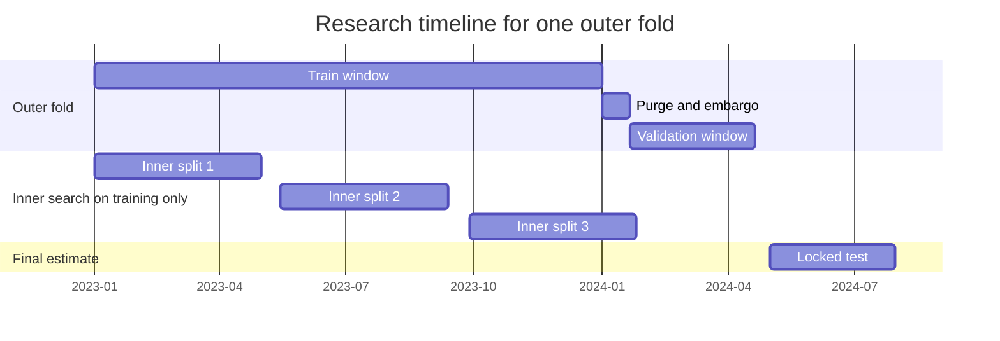
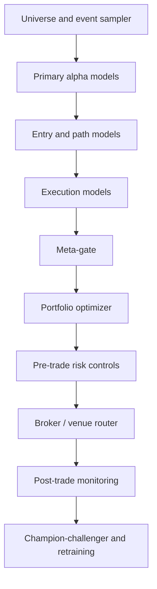

# Integrated Architecture for a Professional ML Trading System

## Executive summary

A professional machine-learning trading system is not primarily a “better predictor.” It is a **bias-resistant research and execution process** designed to survive the core reasons financial models fail: weak signal-to-noise ratio, non-stationarity, leakage, dependent and overlapping samples, repeated specification search, execution frictions, adverse selection, path-dependent outcomes, insufficient data granularity, unstable models, and portfolio-level capital constraints. The strongest lesson from both academic finance and production market microstructure is that the dominant failure modes usually arise **outside** the prediction model itself—in data construction, validation design, execution modeling, and governance. citeturn0search0turn0search12turn1search3turn0search1turn13search0

The most defensible integrated architecture therefore separates the problem into layers: **point-in-time data construction**, **fold-local preprocessing**, **causal labeling**, **nested walk-forward validation with purging and embargo**, **specialized models for alpha, path, fill, and risk**, **execution-aware decision logic**, and **portfolio/risk controls with live drift monitoring**. For liquid markets, the most robust systems do not force one monolithic model to do everything. They combine: a cross-sectional ranking or directional alpha model, an entry/path model, a fill-probability or survival model for passive execution, quantile models for MFE/MAE, a portfolio allocator with covariance shrinkage and turnover penalties, and a meta-gate that vetoes trades whose expected net utility is too small after costs and risk. citeturn0search2turn5search0turn5search1turn6search3turn17search6turn17search20

For most teams, the highest-probability route to a useful system is **not** to start with full-depth deep learning and nanosecond execution. A better default is to begin with a slower, point-in-time, fold-local research stack on liquid instruments, using daily or intraday bars plus trades/quotes; only after passing robust out-of-sample validation, cost stress tests, and null-environment falsification should the system graduate to L2/order-book execution models. Nasdaq’s direct feeds provide full order depth, WRDS TAQ provides intraday trade and quote data down to microseconds, and the UTP SIP has substantial bandwidth requirements, illustrating both the opportunity and operational cost of microstructure-grade systems. citeturn4search0turn4search2turn4search5turn4search17

No architecture guarantees profitability. The right standard is narrower and more rigorous: the system should show **stable fold-by-fold performance**, survive **higher-than-expected costs**, remain positive after **multiple-testing corrections**, fail to generate “alpha” in **synthetic zero-signal environments**, and behave safely in production under hard pre-trade and post-trade risk controls. That is the threshold at which a backtest starts to become credible. citeturn0search1turn2search6turn8search0turn8search4turn13search0turn0search3

## Failure modes and the controls that belong in the architecture

The table below summarizes the main failure modes a professional system must explicitly defend against. The “symptoms” column is especially important: a failure mode is manageable only when it becomes measurable.

| Failure mode | Why it matters | Measurable symptoms | Concrete mitigations | Anchor sources |
|---|---|---|---|---|
| Low signal-to-noise ratio | Financial returns contain a small predictable component buried under much larger unpredictable news and trading noise; flexible models can fit noise very easily. | Weak or unstable IC; good train metrics but poor live or OOS decay; feature importance instability; sensitivity to tiny specification changes. | Prefer simpler baselines first; use ranking and abstention rather than unconditional prediction; regularize heavily; require economic significance after costs; use ensembling only when component errors differ. | citeturn0search0turn0search12 |
| Non-stationarity | Market relationships change across volatility regimes, market structure, regulation, crowding, and macro environments. | Performance by year/regime is inconsistent; calibration drifts; rolling IC collapses; retraining helps only briefly. | Rolling or expanding walk-forward splits; short/medium training window comparison; regime features; online monitoring; drift detectors; retraining with decay/recency weighting. | citeturn9search0turn9search2turn7search19turn16search15 |
| Leakage | Any future information in features, scaling, target construction, or vendor revisions can produce unrealistically strong backtests. | Unrealistically high validation metrics; performance collapse in paper/live; “too good to be true” calibration; same-day availability assumptions that cannot be replicated. | Strict point-in-time joins; fit all transforms inside each fold only; use filing acceptance/dissemination timestamps; macro vintages from archival sources; leakage checklists and reproducibility sheets. | citeturn1search3turn1search7turn1search0turn1search1turn1search5 |
| Overlapping and dependent samples | Adjacent labels often share the same future path, so sample counts exaggerate statistical power. | Effective sample size far below row count; high residual autocorrelation; many concurrent labels; unstable p-values. | Event-based sampling; purging overlapping labels; embargo around test windows; uniqueness/concurrency weights; effective-sample-size checks. | citeturn9search0turn15search0turn3search15 |
| Backtest overfitting and data snooping | Repeatedly trying models, features, thresholds, and universes almost guarantees a historical winner by chance. | Many variants tested; one isolated champion; high in-sample Sharpe but weak fold median; fails when costs are increased; significance vanishes after correction. | Nested walk-forward; CSCV/PBO; Deflated Sharpe Ratio; White Reality Check; Hansen SPA; explicit research logs; synthetic zero-signal falsification audits. | citeturn0search1turn2search6turn8search0turn8search4turn13search0 |
| Execution costs and market impact | Small prediction edges are often smaller than commission, spread, slippage, impact, and delay. | Gross alpha positive but net alpha flat/negative; turnover too high; slippage drift in live trading; capacity collapses with size. | Explicit market/limit choice; cost-aware objectives; Almgren–Chriss schedules for larger orders; stress test at 1.5× and 2× costs; participation caps; delay tests. | citeturn10search0turn10search15turn5search3 |
| Adverse selection | Passive orders can be filled precisely when the price is about to move against you. | High fill rate paired with poor post-fill returns; passive fills underperform market orders in specific states; imbalance and spread worsen before fills. | Fill-probability models conditioned on book state; adverse-selection penalty in utility; latency-aware cancel/repost logic; use order-flow imbalance and depth features. | citeturn5search0turn5search1turn5search2turn5search3 |
| Path-dependence | Final return labels hide whether stop-loss was hit before take-profit or whether the trade required intolerable drawdown. | Directional accuracy looks fine but TP-first rate is weak; many “correct” forecasts still lose via stop-outs; MAE exceeds stop distance. | Triple-barrier/path-aware labels; TP-first/SL-first/Neither targets; MFE/MAE quantile models; entry optimization over candidate grids. | citeturn6search3turn6search0turn6search1 |
| Limited data granularity | OHLC bars do not reveal intrabar sequencing, queue priority, or true fillability. | Backtest differs sharply between OHLC and tick replay; ambiguous bars where both TP and SL are touched; passive fills look unrealistically easy. | Use trades/quotes or L2 for execution research; if only OHLC is available, mark ambiguous bars or assume the adverse path; treat “touch” and “fill” separately. | citeturn14search6turn14search9turn14search1 |
| Regime shifts and model instability | Different models dominate in different market states; a single static model often becomes brittle. | Frequent leader changes among models; fold performance dispersion; unstable feature ranks; sharp degradation after macro transitions. | Model diversification; regime-aware features/gates; probability calibration; rolling champion–challenger tests; meta-gating and uncertainty filtering. | citeturn9search0turn7search19turn0search12 |
| Risk and capital constraints | A profitable signal can still be untradeable because of leverage, concentration, correlation, borrow, or market-access limits. | Exposure spikes; clustered losses; portfolio turnover beyond capacity; realized risk much larger than ex-ante risk. | Volatility targeting; exposure and participation caps; correlation/sector limits; covariance shrinkage; turnover penalties; hard pre-trade controls and kill-switches. | citeturn10search5turn17search6turn17search20turn0search3 |

A useful design principle follows from this table: **there should be no single “model score” that directly causes an order to be sent**. A trade should survive three tests in sequence: an alpha test, an execution test, and a portfolio/risk test. This is an engineering response to the fact that the main failure modes occur at different layers and require different diagnostics. citeturn5search0turn5search2turn17search20turn0search3

A concise trade-utility formulation that captures this layered design is:

\[
U_{i,e,t}
=
P(\text{fill}_{e,t})
\cdot
E[\text{net trade utility}_{i,e,t}\mid \text{filled}]
-
C_{\text{missed}}(e,t)
\]

with

\[
E[\text{net trade utility}\mid \text{filled}]
=
P(TP\text{-first})\cdot G
-
P(SL\text{-first})\cdot L
-
C_{\text{spread}}
-
C_{\text{slippage}}
-
C_{\text{impact}}
-
C_{\text{adverse}}
\]

This formulation keeps the system honest: a highly ranked signal with poor fill economics or intolerable portfolio risk should still produce **no trade**. That logic is consistent with the literature on fill-time modeling, adverse selection, execution costs, and optimal dynamic trading under frictions. citeturn5search0turn5search1turn5search2turn10search0turn17search20

## Data requirements and system-of-record design

A professional stack should define the **research target first**, then acquire the cheapest data capable of supporting that target without hidden assumptions. The right data stack depends strongly on horizon and execution style.

### Strategy scope options and trade-offs

| Strategy style | Typical horizon | Minimum viable data | Stronger data | Main advantage | Main limitation |
|---|---:|---|---|---|---|
| Cross-sectional daily equities | 1 day to months | Daily OHLCV, corporate actions, delistings, fundamentals, filings, macro vintages, news | Minute bars, quotes for open/close execution | Cheapest, broadest universe, easier PIT governance | Weakens execution realism and intraday path modeling |
| Intraday liquid equities or futures | Minutes to days | Minute bars + trades + L1 quotes | L2/order events, queue-aware data | Better entry/exit timing, slippage and spread control | Higher infrastructure burden, stronger leakage risk |
| HFT / execution alpha | Milliseconds to seconds | Trades + quotes | Full-depth L2/L3 order events | Necessary for fill probability and adverse selection research | Expensive bandwidth/storage, model decay is faster |
| Crypto 24/7 systematic trading | Seconds to days | Trades + quotes + venue metadata | Full-depth CLOB + venue-specific fees and latency | Easier raw data access, continuous markets | Fragmentation, exchange-specific microstructure, varying data quality |

The operational jump from bar-based research to full-depth execution modeling is large. Nasdaq TotalView ITCH is a direct feed with **full order depth**, the UTP SIP consolidates protected quotes and trades across venues, and TAQ offers intraday U.S. NMS trade and quote data at microsecond resolution; together these sources illustrate why many desks sensibly validate alpha at slower horizons before moving to execution-grade research. citeturn4search0turn4search5turn4search2

### Required data classes and point-in-time rules

| Data class | Minimum fields | Point-in-time rule | Quality floor | Storage and latency guidance | Notes |
|---|---|---|---|---|---|
| OHLCV bars | open, high, low, close, volume, bar close time | Bar becomes usable only after the bar close timestamp | No duplicate bars; explicit holidays and session boundaries | Columnar object storage is sufficient for research | Good for slow alpha, poor for fill realism |
| Trades | price, size, exchange, event timestamp | Use exchange/event timestamp, not only ingest time | Correct out-of-sequence prints and bad condition codes | Needed for intrabar path reconstruction and VWAP-style costs | TAQ is a standard U.S. source for intraday trade data citeturn4search2turn4search10 |
| L1 quotes | bid, ask, bid size, ask size, quote timestamp | Join by quote time known at decision time; preserve quote/trade sequencing | Remove crossed/locked quotes carefully; track staleness | Needed for spread, quote-mid, and basic slippage models | UTP SIP consolidates quotes and trades across venues citeturn4search5turn4search1 |
| L2 / order events | add, cancel, execute, modify, side, level, order id if available | Reconstruct the book from event order only | Strict event ordering, replay verification, venue-specific message semantics | Append-only event store; aggressive compression; replay engine required | TotalView ITCH provides full order depth; bandwidth can be substantial citeturn4search0turn4search17 |
| Corporate actions | splits, dividends, symbol changes, delistings | Adjust research prices causally; keep executable prices separate | Must include delisting returns where relevant | Daily append plus reference snapshots | CRSP guides include delisting-return fields; delisting bias is a known problem citeturn4search11turn4search19turn4search3 |
| Fundamentals and filings | filing type, period end, accepted time, disseminated time, parsed values | Key features to public acceptance/dissemination time, not fiscal period end | Preserve original filed values when possible | Store raw filings and parsed PIT extracts | EDGAR is the system of record for filing submission and dissemination timing citeturn1search1turn1search5turn1search17 |
| Macro data | release timestamp, vintage/revision, source, value | Use the vintage available on that historical date | Revision history required | Store both latest and vintage snapshots | ALFRED provides historical vintages specifically for this purpose citeturn1search0turn1search4 |
| News and text | headline/body, source, publish time, entity mapping | Use first public timestamp and preserve late corrections | Deduplicate syndicated content; entity-link causally | Text store plus embeddings/features by timestamp | Media content has predictive relation to market activity in some settings citeturn11search1turn11search10 |

The most important rule is simple: **every row in the modeling table must be reconstructible as of its historical decision timestamp**. For fundamentals, that means using filing acceptance or dissemination times from EDGAR rather than quarter-end dates; for macro it means using historical vintages rather than latest revised values; and for corporate actions it means handling splits, dividends, symbol changes, and delistings without creating hindsight. citeturn1search1turn1search5turn1search0turn4search11turn4search19

### Timestamping, adjustment, and infrastructure defaults

Recommended defaults for a first serious research platform are:

| Topic | Recommended default |
|---|---|
| Clock source | Exchange timestamp if available; otherwise vendor event timestamp plus ingest timestamp |
| Time normalization | Store everything in UTC internally; convert only for display |
| Session model | Explicit venue calendars, auctions, halts, half-days, DST transitions |
| Research prices | Split- and dividend-adjusted for slow-horizon return features; unadjusted executable prices preserved separately |
| Join method | “As-of” joins by timestamp, never forward-filled across unavailable publication times |
| Data integrity | Hash raw files, version derived datasets, keep schema contracts |
| Storage | Parquet/Iceberg/Delta for research; append-only event logs for microstructure |
| Replay | Mandatory for any strategy claiming limit-order fills or intrabar TP/SL ordering |
| Latency measurement | Track source lag, parse lag, feature lag, and order-send lag separately |

The business case for these controls is strong. Even official data systems differ materially in scale and latency. UTP SIP publishes consolidated quotes and trades across venues, Nasdaq’s direct feed carries full order depth, and the SIP’s current bandwidth recommendations for subscribers are measured in gigabits per second—evidence that “execution-grade” and “research-grade” data stacks are not the same product. citeturn4search5turn4search0turn4search17

## Fold-local preprocessing, feature engineering, and labels

A professional pipeline should be **causal by construction** and **fold-local by default**. No normalization, clipping, feature selection, regime fitting, calibration, or label construction should ever use future information relative to the fold and the event timestamp.

```mermaid
flowchart LR
    A[Raw market and reference data] --> B[Point-in-time cleaning and session alignment]
    B --> C[Event sampling and candidate generation]
    C --> D[Fold-local transforms]
    D --> E[Causal feature blocks]
    E --> F[Path-aware labels and censoring]
    F --> G[Model-specific datasets]
    G --> H[Outer walk-forward evaluation]
    H --> I[Execution simulator]
    I --> J[Portfolio and risk engine]
```



This pipeline reflects the main lesson from leakage research: the separation between training and evaluation must extend to the **entire pipeline**, not just the final model fit. In finance that requirement is even stronger because timestamping, revisions, and overlapping label windows create additional places where future information can leak in. citeturn1search3turn1search7turn13search17

### Core operations in the preprocessing pipeline

The default sequence should be:

| Step | Exact operation | Recommended default values |
|---|---|---|
| Event definition | Define decision timestamp \(t\), latest usable data, entry horizon, holding horizon | For first production candidate: decision at bar close; market entry at next bar open or limit-entry horizon of 1–5 bars intraday / 1–3 bars daily |
| Bar/trade cleaning | Deduplicate timestamps, align sessions, remove impossible prints, flag auction/halts | Keep a separate bad-print table rather than silently deleting |
| Return transform | Use log returns \(r_t=\ln(P_t/P_{t-1})\) | Always compute from causally adjusted research prices |
| Volatility estimate | EWMA or realized-vol estimator fit causally | EWMA half-life 20 bars intraday, 20 trading days daily |
| Normalization | Vol-scale returns and distances by local volatility | \(z_t=r_t/\hat{\sigma}_t\) |
| Cross-sectional standardization | Rank or robust-z features across the active universe at time \(t\) only | Prefer percentile ranks for heavy-tailed features |
| Outlier handling | Correct obvious bad ticks; otherwise avoid aggressive clipping | If clipping is needed, estimate thresholds on the training fold only |
| Missing data | Distinguish “not available yet” from true missing | Missingness indicators are often useful features |
| Feature selection | Fold-local only, after feature generation | Use stability across folds as an explicit criterion |
| Calibration | Fit on inner folds only | Isotonic for stable datasets, Platt for smaller samples |

For volatility, spread, and intraday state, OHLC-based estimators remain useful when quote data is unavailable. The Rogers–Satchell estimator is commonly used because it leverages open, high, low, and close without assuming zero drift during the interval; direct quote and trade data should replace it once entry and execution decisions depend on intrabar path and spread. citeturn14search6turn4search2turn4search5

### Causal feature blocks

A practical professional stack usually combines several feature families:

| Feature block | Examples | Why include it | Caveat |
|---|---|---|---|
| Price/trend | lagged returns, momentum, moving-average slopes, residuals to trend filters | Captures path and direction | Easily overfitted |
| Volatility/risk | realized vol, EWMA vol, range estimators, vol-of-vol | Needed for normalization and sizing | Regime-sensitive |
| Microstructure | spread, quote-mid, imbalance, queue proxies, order-flow imbalance | Useful for execution and short-horizon alpha | Requires high-quality L1/L2 |
| Cross-sectional | percentile ranks of momentum, value, quality, liquidity, volatility | Better aligned with portfolio selection than isolated classification | Universe definition must be PIT |
| Event/text | filing surprises, revision lags, entity-linked news sentiment | Captures information arrival | Entity mapping and publish-time errors matter |
| Regime/context | market breadth, correlation state, dispersion, macro state, session phase | Helps gating and model specialization | Regimes are descriptive, not guarantees |

One important empirical finding in microstructure is that **order-flow imbalance** often explains short-horizon price changes more robustly than raw trade volume, and that the slope of that relation depends on depth. That is why L1/L2 execution features matter whenever the strategy’s holding period approaches the spread-and-queue timescale. citeturn5search3turn4search0

### Labels that match trading decisions

Simple “future return after \(H\) bars” labels are usually too weak for professional trading because they ignore execution path. A better menu is:

| Decision problem | Target | Label type |
|---|---|---|
| Which instruments are best now? | future net utility or return rank | Ranking |
| Is there a tradable opportunity? | \(P(r_{net}>\tau)\) | Classification |
| How large is edge? | \(E[r_{net}]\) | Regression |
| How large could drawdown be? | \(Q_\alpha(\text{MAE})\) | Quantile regression |
| How likely is TP before SL? | \(P(TP\text{-first}),P(SL\text{-first}),P(\text{Neither})\) | Multiclass classification |
| How likely is a passive order to fill by horizon \(h\)? | survival function \(S(t)\) or \(P(T_{\text{fill}}\le h)\) | Survival analysis |

CatBoost supports specialized ranking objectives and metrics, which is useful when the actual decision is to **select the top few opportunities from a batch**, not to label every row independently. For passive order placement, survival modeling is the natural formulation because unfilled orders are censored observations rather than ordinary negatives. citeturn0search2turn0search14turn5search0

### Recommended labeling schema for an integrated system

For each signal time \(t\), create a candidate-entry grid:

\[
e \in \{
\text{market},
\ \pm 0.25\hat{\sigma}_t,
\ \pm 0.50\hat{\sigma}_t,
\ \pm 0.75\hat{\sigma}_t,
\ \text{structural retest}
\}
\]

and attach path-aware labels:

\[
y^{path}_{t,e}\in\{TP\text{-first},\ SL\text{-first},\ Neither\}
\]

\[
\text{MFE}_{t,e}=\max_{\tau\le H}\frac{P_{\tau}-e}{e}
,\qquad
\text{MAE}_{t,e}=\min_{\tau\le H}\frac{P_{\tau}-e}{e}
\]

\[
T^{fill}_{t,e}=
\begin{cases}
\text{time-to-fill}, & \text{if touched and filled}\\
\text{right-censored at }H_e, & \text{otherwise}
\end{cases}
\]

This is the practical generalization of path-aware barrier labeling and optimal-entry research: instead of asking only whether price finished higher, the system asks whether a **specific trade geometry** was attractive and reachable. The triple-barrier method popularized barrier-hit labeling for finance, while optimal-entry papers with stop-loss constraints show that “there is an alpha” does not imply “every entry price is optimal.” citeturn6search3turn6search0turn6search1

### Censoring and ambiguity rules

A professional system should encode ambiguity explicitly:

| Situation | Rule |
|---|---|
| Passive order not touched by entry horizon | Right-censor fill target |
| Touched in OHLC but queue unknown | Label as “touched,” not “filled,” unless quote/trade replay supports fill |
| Both TP and SL appear in the same bar and only OHLC exists | Mark ambiguous and drop, or resolve pessimistically to the adverse outcome |
| News/fundamental field not yet published | Keep as unavailable; never backfill from future release |
| Delisted or halted security | Terminate trade path using actual rules of the strategy and venue |

This matters because OHLC bars record only extreme values, not intrabar order. A candlestick does not reveal whether the high came before the low, whether the market traded smoothly, or whether a short-lived touch would have filled a real passive order. Recent work on intrabar ambiguity in OHLC backtesting reinforces the same warning: bar-level simulation can silently guess the path. citeturn14search6turn14search9turn14search1

### Comparison of modeling formulations

| Formulation | Best use | Strengths | Weaknesses | Default recommendation |
|---|---|---|---|---|
| Classification | “Trade / no trade” or barrier-hit probability | Easy to calibrate and threshold | Poorly aligned when only top-\(k\) trades matter | Use for meta-gating and TP-first/SL-first |
| Regression | Expected net return or residual alpha | Direct economic interpretation | Sensitive to fat tails and heteroskedasticity | Use with strong regularization and robust losses |
| Ranking | Cross-sectional selection among many candidates | Best match to portfolio selection; handles relative advantage | Needs meaningful group/batch definition | Use as primary alpha model for diverse candidate sets |
| Quantile regression | MFE/MAE, cost, downside estimates | Directly useful for stops, sizing, and stress | More data-hungry than classification | Use for path/risk layer |
| Survival analysis | Fill-time and time-to-event | Correct handling of censoring | Requires event-quality timestamps and stronger data governance | Use whenever passive execution is studied |

The recommendation to use ranking for top-\(k\) selection and survival for fill-time is not a generic “AI preference”; it follows from the mathematical structure of the decision itself and from the tooling and research available for those tasks. citeturn0search2turn5search0turn5search1

### Example pseudocode for fold-local construction

```python
# Pseudocode, not production code.

for outer_fold in walk_forward_folds(data):
    train_raw, valid_raw = split_chronologically(data, outer_fold)

    # Purge overlapping labels and apply embargo before any transform.
    train_raw = purge_overlaps(train_raw, valid_raw, label_horizon, entry_horizon)
    train_raw = apply_embargo(train_raw, valid_raw, embargo_len)

    # Fit all transforms on training only.
    vol_model = fit_ewma_vol(train_raw, half_life=20)
    scaler = fit_robust_scaler(train_raw)

    train = build_features(train_raw, vol_model=vol_model, scaler=scaler)
    valid = build_features(valid_raw, vol_model=vol_model, scaler=scaler)

    # Generate candidate entries and path-aware labels without using future
    # information beyond the event definition.
    train = add_candidate_entries(train, offsets=[0.0, -0.25, -0.50, -0.75])
    valid = add_candidate_entries(valid, offsets=[0.0, -0.25, -0.50, -0.75])

    train = label_tp_sl_fill_mfe_mae(train, tp_mult=1.5, sl_mult=1.0, hold_bars=20)
    valid = label_tp_sl_fill_mfe_mae(valid, tp_mult=1.5, sl_mult=1.0, hold_bars=20)

    # Inner folds choose hyperparameters, thresholds, and training length.
    best_cfg = nested_inner_search(train)

    model = fit_models(train, config=best_cfg)
    preds = predict_stack(model, valid)

    results = execution_simulator(preds, valid, costs="stressed")
    store(results)
```

The critical property of this pseudocode is not the exact models; it is the **ordering**. Purging and embargo happen before modeling, and every learned transformation is fit on training data only. That is the minimum acceptable structure for a serious finance pipeline. citeturn1search3turn9search0turn3search15

## Validation, statistical testing, and anti-overfitting protocol

A credible evaluation stack should answer three separate questions: **Can the model generalize over time?** **Are the reported results independent enough to trust?** **Could the entire workflow still be mining noise?**

### Nested walk-forward with purging and embargo



Chronology-preserving evaluation is necessary because ordinary random cross-validation breaks the temporal structure of nonstationary series and can bias error estimates downward. Empirical studies of time-series forecasting show that when real-world non-stationarity is present, out-of-sample methods that preserve time order tend to provide more realistic performance estimates than ordinary random CV; recent finance-focused falsification work makes the same point even more sharply. citeturn9search0turn9search2turn13search17

Purging and embargo should be treated as **engineering controls** for dependent labels rather than as arbitrary conventions. A practical default is:

\[
\text{purge length}
=
H_{\text{entry}} + H_{\text{hold}}
\]

\[
\text{embargo length}
=
\max(L_{\text{feature-eff}},\ H_{\text{entry}},\ 0.1\times H_{\text{train-epoch}})
\]

where \(L_{\text{feature-eff}}\) is the effective memory length of the slowest feature family. When features use long decays or moving windows, embargo often needs to be longer than the label horizon. This logic is consistent with finance-specific discussions of purging/embargo and with the broader dependence concerns in time-series CV. citeturn3search15turn3search2turn9search0

### Independence checks that should be computed every run

| Check | How to compute | Why it matters |
|---|---|---|
| Label overlap ratio | Fraction of events whose future path overlaps another event in the same fold | High overlap inflates confidence |
| Concurrency / uniqueness | Number of simultaneous active labels; weight rows by inverse concurrency | Downweights duplicated future path information |
| Residual autocorrelation | ACF of prediction residuals or returns | Detects dependence left in the evaluation stream |
| Effective sample size | \(N_{\text{eff}} \approx N / (1 + 2\sum_k \rho_k)\) | Converts dependent tests into realistic sample size |
| Group integrity | Ensure all candidate entries from the same root signal stay in the same fold | Prevents path leakage across candidates |

The effective-sample-size idea is standard in dependent-sequence analysis: dependence reduces the amount of independent information in the data. Even when the raw dataset is large, the usable number of independent test cases can be much smaller. citeturn15search0turn9search0

### Statistical tests that belong in the research protocol

| Test | Null question | When to use it | What a passing result means |
|---|---|---|---|
| Deflated Sharpe Ratio | Is the Sharpe still significant after non-normality and multiple testing? | Every final strategy and major ablation | Reported Sharpe is less likely to be a selection artifact |
| White Reality Check | Is the best model better than benchmark after data snooping correction? | Large model/rule searches | The winner is not merely the luckiest among many trials |
| Hansen SPA | Does any candidate show superior predictive ability, with better power than RC? | Candidate families compared to benchmark | Stronger evidence that at least one family is genuinely superior |
| PBO / CSCV | How likely is the backtest winner to be overfit? | Strategy-research process audits | Low PBO increases confidence in the search itself |
| Synthetic zero-signal audit | Does the whole workflow show “alpha” in a null environment? | Before production promotion | If yes, workflow is falsified; if no, workflow has passed a stronger sanity check |

Backtest-overfitting research shows that repeated selection across configurations can inflate historical performance dramatically. White’s Reality Check and Hansen’s SPA are classic anti-snooping tests; the Deflated Sharpe Ratio adjusts for selection bias and non-normal returns; and a 2026 preprint on spurious predictability argues that modern finance workflows should also be tested end-to-end on synthetic zero-predictability reference classes. That last step is still an emerging recommendation rather than settled canon, but it is analytically compelling and worthwhile. citeturn0search1turn2search6turn8search0turn8search4turn13search0

### Predictive and economic metrics

A professional system should report both predictive and economic metrics, per fold and in aggregate.

| Predictive metrics | Economic metrics |
|---|---|
| Rank IC / Spearman correlation | Net Sharpe, Sortino, Calmar |
| Precision@k / Recall@k | Net return per trade and per signal |
| PR-AUC for rare tradable events | Maximum drawdown and drawdown duration |
| Brier score / calibration error | Turnover, participation rate, holding time |
| TP-first / SL-first calibration | Gross-to-net slippage wedge |
| Fill-time CRPS / survival log-loss | Capacity under larger notional sizes |
| Quantile loss for MAE/MFE | Performance by year, regime, and liquidity bucket |

The statistical and economic views must agree. A model can be well calibrated but economically useless after costs; conversely, a model with modest directional accuracy can still be valuable if it ranks the best opportunities well and avoids expensive conditions. The literature on data snooping and execution costs makes this distinction essential. citeturn8search0turn8search4turn10search0

## Integrated model suite, execution logic, and portfolio controls

A complete system should use specialized models with narrow roles rather than a single all-purpose predictor.



This architecture aligns with both academic evidence and real trading mechanics. Alpha and execution are different prediction problems; portfolio construction is another; operational risk control is different again. Combining them only at the final utility layer is usually more stable than forcing one model to internalize all constraints implicitly. citeturn5search0turn10search0turn17search20turn0search3

### Recommended model suite and roles

| Layer | Model family | Inputs | Outputs | Objective | Best use |
|---|---|---|---|---|---|
| Baseline alpha | Elastic Net / linear regularized model | standardized returns, cross-sectional features, basic fundamentals | expected residual return or class probability | regression / logistic | Stability benchmark; sanity check |
| Primary alpha | CatBoostRanker or gradient-boosted ranker | price, volatility, structure, cross-sectional, event features | relative score within batch | ranking loss | Portfolio selection from many candidates |
| Sequential alpha | TCN / shallow temporal CNN; DeepLOB-style CNN-LSTM for L2 | short price or book sequences | directional or rank score | classification/ranking | Useful when genuine sequence structure exists |
| Path model | Multiclass boosted tree or net | signal features + candidate entry geometry | TP-first / SL-first / Neither | multiclass | Stop/TP-aware gating |
| Excursion model | Quantile gradient boosting | signal and path features | MAE/MFE quantiles | pinball loss | Stops, take-profits, and sizing |
| Fill model | Cox / discrete-time survival / neural survival | quote/book state, spread, imbalance, depth, entry distance | fill-time survival curve | survival loss | Passive order placement |
| Meta-gate | Logistic/boosted stacking model | all model outputs + costs + risk state | \(P(\text{positive net utility})\) | classification | Final trade / no-trade decision |
| Portfolio allocator | convex optimizer with shrinkage covariance | expected utilities, risk model, costs | target weights or orders | utility minus risk and turnover | Risk-aware portfolio formation |

Two findings are especially relevant here. First, in empirical asset pricing, machine learning often outperforms classical linear methods when nonlinear interactions matter, but very deep architectures do not automatically dominate in low-SNR finance. Second, in LOB forecasting, deep architectures such as DeepLOB can extract useful short-horizon patterns from order-book sequences—but only when the data and infrastructure are good enough to justify them. citeturn0search0turn12search2turn12search4

### How the models should be combined

The combination logic should be explicit and auditable:

\[
s^{alpha}_{i,t} = f_{\text{rank}}(X_{i,t})
\]

\[
p^{path}_{i,e,t} =
\big(
P(TP\text{-first}),
P(SL\text{-first}),
P(\text{Neither})
\big)
\]

\[
\hat{S}^{fill}_{i,e,t}(h)=P(T_{\text{fill}}>h)
\]

\[
p^{meta}_{i,e,t}
=
P(\text{net utility}>0 \mid s^{alpha}, p^{path}, \hat{S}^{fill}, \widehat{MAE}, \widehat{MFE}, \text{costs}, \text{risk state})
\]

\[
\text{Trade if } p^{meta}_{i,e,t}>\tau_{\text{meta}}
\quad\text{and}\quad
U_{i,e,t}>0
\]

Then the optimizer maps surviving trades into positions using covariance shrinkage, turnover penalties, exposure caps, and participation constraints. Covariance shrinkage is important because naïve sample covariance matrices are notoriously unstable for portfolio optimization. citeturn17search6turn17search1turn17search20

### Execution and market impact modeling

Execution research should distinguish **decision alpha** from **implementation alpha**.

| Execution task | Recommended model | Required data | Notes |
|---|---|---|---|
| Market vs passive choice | Meta-decision model using expected utility | L1 at minimum | Use passive orders only when fill-adjusted utility dominates |
| Passive fill probability | Survival model | L1 or L2 | Treat unfilled orders as censored observations |
| Slippage for marketable orders | Regression or quantile model | trades + quotes | Include spread, volatility, imbalance, participation rate |
| Impact for larger clips | Almgren–Chriss or square-root-style model | trades or portfolio executions | Needed once size is nontrivial relative to liquidity |
| Adverse-selection penalty | Post-fill return model conditional on fill state | L1/L2 | High fill probability can be a bad sign |

Recent execution research has been explicit on these points. Survival analysis is a natural way to estimate fill times of passive limit orders; fill probability is strongly state-dependent; and limit-order placement must account for adverse selection and latency, not only for apparent price improvement. Meanwhile, classic execution theory shows that larger orders require balancing transaction costs against timing risk. citeturn5search0turn5search1turn5search2turn10search0turn10search15

A practical cost-stress suite should include at least these scenarios:

| Stress | Minimum test |
|---|---|
| Spread | 1.0×, 1.5×, 2.0× live-estimated half-spread |
| Slippage | Baseline, +1 sigma, +2 sigma |
| Delay | One-bar delay, two-bar delay, queue-priority decay |
| Impact | Base participation, 2× participation, 4× participation |
| Fees | Venue-specific fee/rebate changes |
| Liquidity shock | Worst decile of spread/depth state |

If performance only exists in the unstressed baseline, the strategy is not ready for capital. That conclusion is consistent with the market-impact and optimal-execution literature. citeturn10search0turn5search3

### Risk, sizing, and portfolio construction

At the portfolio layer, a default production objective should look like:

\[
\max_w\quad
w^\top \hat{\mu}
-
\lambda_r\, w^\top \hat{\Sigma} w
-
\lambda_c\, \text{Turnover}(w,w_{t-1})
-
\lambda_i\, \text{Impact}(w)
\]

subject to constraints on gross leverage, net exposure, sector or bucket concentration, participation rate, borrow, and position limits.

Recommended defaults:

| Control | Recommended default |
|---|---|
| Volatility targeting | Scale gross risk to a fixed annualized target, e.g. 8%–12% for a first deployment |
| Single-name cap | 1%–2% capital at risk per name for diversified equity books; tighter if borrow or liquidity is unstable |
| Sector / bucket cap | 10%–20% active risk per sector bucket |
| Correlation cap | Avoid overlapping bets when pairwise or factor exposure is too concentrated |
| Participation cap | Keep child orders well below venue liquidity, e.g. under 5% of recent hourly volume initially |
| Covariance model | Ledoit–Wolf shrinkage or related robust shrinkage |
| Turnover penalty | Explicit penalty in the optimizer, not only a post-hoc report |

Volatility-managed exposure has strong empirical support as a useful starting default in many settings, although it is not universally dominant. Covariance shrinkage is close to mandatory for stable portfolio optimization, and dynamic trading under transaction costs strongly favors utility functions that penalize turnover directly. citeturn10search5turn17search6turn17search20

### Monitoring, drift detection, and operational safeguards

A live system should monitor four families of drift:

| Drift family | Example monitors | Response |
|---|---|---|
| Data drift | feature distribution shifts, missingness spikes, clock skew | stop ingestion, quarantine symbol/source |
| Prediction drift | falling calibrated hit rates, rank IC collapse | switch to challenger or reduce leverage |
| Execution drift | slippage widening, fill-time worsening, spread regime change | route changes, more marketable execution, reduce size |
| Portfolio drift | realized beta, factor exposure, correlation spikes | rebalance constraints, de-risk |

For detection methods, adaptive-window methods such as ADWIN and classical concept-drift frameworks are useful for online monitoring; error-based cumulative-statistics methods such as Page–Hinkley are commonly used in streaming environments as simpler detectors. They are not substitutes for economic monitoring, but they are good sentries for identifying a regime change quickly. citeturn16search15turn16search12turn7search19

The hard operational controls should include: order notional and quantity ceilings, max loss per day and per instrument, stale-data guards, venue disconnect guards, max slippage triggers, abnormal rejection/fill alerts, and a manual and automatic kill-switch. In U.S. markets, broker-dealers with market access are required by SEC Rule 15c3-5 to maintain risk management controls and supervisory procedures, which is a strong regulatory signal that “risk controls are outside the model” is not an acceptable architecture. citeturn0search3

## Evaluation framework, deployment plan, and implementation roadmap

Evaluation should proceed from research to controlled live evidence in stages. Each stage should have explicit promotion criteria and explicit reasons to stop.

### Required backtest experiments and ablations

| Experiment | Purpose | Minimum acceptance pattern |
|---|---|---|
| Baseline vs full model | Show value beyond simple linear/naïve benchmark | Full model beats baseline net, not only gross |
| Ranking vs classification | Verify decision formulation | Ranking improves top-\(k\) utility or classification improves gating, with stable folds |
| Path-aware labels vs simple fixed-horizon return | Measure path dependence value | Better TP-first rate, lower MAE-adjusted losses |
| Fill model on/off | Measure execution contribution | Net performance improves after missed-opportunity cost |
| Cost baseline vs stressed | Test economic robustness | Degrades gradually rather than collapsing |
| Rolling vs expanding window | Test stationarity assumptions | Chosen window wins on fold median, not one period |
| News/fundamental features on/off | Measure incremental information | Improvement survives PIT checks and timing lags |
| Regime gate on/off | Check whether regimes add value or only complexity | Higher fold stability and lower drawdowns |
| Meta-gate on/off | Measure false-positive reduction | Fewer trades, better net expectancy, acceptable capacity |

Ablation is especially important in low-SNR domains because complex systems can look good without any single component truly adding value. Fold stability matters more than the single best aggregate Sharpe. That logic follows directly from the backtest-overfitting literature and from the weak-signal finance setting. citeturn0search12turn0search1turn2search6

### Required visualizations

The following visualizations should be mandatory in the research report for any candidate strategy:

| Visualization | What it should reveal |
|---|---|
| Per-fold equity curves | Whether performance is concentrated in one fold |
| Aggregate PnL curve with cost overlays | Gross-to-net conversion and regime dependence |
| Drawdown curve and underwater plot | Tail pain and recovery speed |
| Rolling Sharpe / rolling IC | Stability of edge |
| Calibration curves for TP-first / trade-positive probabilities | Whether probabilities are trustworthy |
| Turnover and participation charts | Capacity and fee sensitivity |
| Fill-time survival curves by regime | Execution realism |
| Heatmaps by volatility, spread, and liquidity bucket | Where the edge actually lives |
| Sensitivity plots for thresholds and training windows | Local robustness rather than point optimality |
| Research null-audit results | Whether the pipeline is generating alpha from noise |

These visuals are not cosmetic. They are the fastest way to detect concentration, instability, silent cost dependence, and calibration drift. citeturn0search1turn2search6turn13search0

### Live deployment stages

| Stage | Goal | Duration | Promotion criteria |
|---|---|---:|---|
| Offline historical research | Validate pipeline integrity | 4–12 weeks | Passes fold stability, cost stress, and anti-snooping tests |
| Shadow live / paper trading | Validate timestamps, routing, and slippage realism | 4–8 weeks | Live paper slippage close to model; no major data/control incidents |
| Tiny-capital production | Validate execution and governance | 4–8 weeks | Positive or neutral expectancy net of live costs; limits and kill-switches proven |
| A/B or champion–challenger | Compare incumbent vs challenger under same market | Ongoing | Challenger wins on net utility and operational stability |
| Scaling | Increase capital only if capacity curves support it | Ongoing | No material deterioration in implementation shortfall |

Paper trading and champion–challenger tests are essential because many failures only appear when the model interacts with real data latencies, venue behavior, and operational controls. That is exactly the zone where research-grade and production-grade systems diverge. citeturn5search2turn10search0turn0search3

### Prioritized implementation roadmap

A realistic roadmap for a small but capable team is:

| Phase | Main deliverables | Approx. effort | Personnel | Go / no-go criteria |
|---|---|---:|---|---|
| Data foundation | PIT data model, reference calendars, corporate-action handling, EDGAR and macro vintages, replayable research store | 4–6 weeks | 1 data engineer, 1 quant | No-go if PIT reconstruction is not reproducible |
| Research kernel | Fold generator, purging/embargo, fold-local transforms, baseline models, cost simulator | 4–6 weeks | 1 quant researcher, 1 ML engineer | No-go if baseline validation is not leakage-clean |
| Label and model stack | Ranking alpha, path labels, MFE/MAE, meta-gate | 6–8 weeks | 1–2 quants, 1 ML engineer | No-go if path-aware stack does not beat simpler benchmark net |
| Execution layer | L1 slippage model, market vs passive logic, survival fill model if data allows | 6–10 weeks | 1 microstructure quant, 1 engineer | No-go if live-paper fills and modeled fills diverge materially |
| Portfolio and controls | Shrinkage covariance, optimizer, limits, kill-switches, dashboards | 4–6 weeks | 1 quant dev, 1 risk/ops engineer | No-go if risk engine cannot enforce hard constraints |
| Null audit and production dress rehearsal | PBO/DSR/SPA, synthetic zero-signal tests, paper-trading | 4–6 weeks | Whole team | No-go if workflow shows significant alpha under null or fails stress |
| Controlled launch | Tiny capital, daily review, incident response | 4–8 weeks | Whole team | Scale only after operational and economic pass |

For compute, bar/L1 research can usually start on ordinary CPU-heavy infrastructure; L2 and deep survival/LOB models typically require more specialized storage, replay engines, and GPU support. For personnel, a credible small-team minimum is usually **one data engineer, one quant researcher, one ML/quant-dev engineer**, with part-time risk/ops oversight. The software stack matters less than the discipline of PIT reconstruction and validation. citeturn4search0turn4search2turn4search17turn5search0turn12search2

### Recommended default go / no-go checklist

| Check | Recommended threshold |
|---|---|
| Point-in-time audit | 100% reproducible for sampled dates and symbols |
| Fold robustness | Positive median net performance across outer folds |
| Cost stress | Still economically acceptable at 1.5× baseline costs |
| Multiple testing correction | DSR acceptable; RC / SPA does not reject the strategy as a snooping artifact |
| Null audit | No significant “alpha” on zero-signal synthetic environments |
| Execution realism | Paper-traded slippage and fill rates inside modeled confidence bands |
| Risk limits | All hard limits enforced in simulation and dress rehearsal |
| Operational stability | No stale-data or routing incidents without a kill-switch response |

### Top references to prioritize

The following sources are the most useful starting set for building or auditing a serious ML trading system:

| Reference | Why it matters |
|---|---|
| **Gu, Kelly, Xiu, “Empirical Asset Pricing via Machine Learning”** | Best broad reference for weak-signal finance ML, model classes, and economic evaluation. citeturn0search0 |
| **Kelly and Xiu, “Financial Machine Learning”** | Strong survey of the field’s opportunities and pitfalls. citeturn0search12 |
| **Bailey et al., “The Probability of Backtest Overfitting”** | Core reference for search-induced false discovery in backtests. citeturn0search1 |
| **Bailey and López de Prado, “The Deflated Sharpe Ratio”** | Essential correction for selection bias and non-normal returns. citeturn2search6 |
| **White, “A Reality Check for Data Snooping”** | Classical anti-snooping test for strategy selection. citeturn8search0 |
| **Hansen, “A Test for Superior Predictive Ability”** | More powerful alternative to the original Reality Check. citeturn8search4 |
| **Cerqueira, Torgo, Mozetič, “Evaluating time series forecasting models”** | Strong empirical reference for chronology-preserving validation under non-stationarity. citeturn9search0 |
| **Arroyo, Cartea, Moreno-Pino, Zohren, “Deep Attentive Survival Analysis in Limit Order Books”** | State-of-the-art reference for fill-time modeling with censoring. citeturn5search0 |
| **Fabre and Ragel, “Interpretable ML for High-Frequency Execution”** | Practical bridge between fill probability estimation and order-placement tactics. citeturn5search1 |
| **Lehalle and Mounjid, “Limit Order Strategic Placement with Adverse Selection Risk and the Role of Latency”** | Best concise reference on the fill-probability vs adverse-selection trade-off. citeturn5search2 |
| **Cont, Kukanov, Stoikov, “The Price Impact of Order Book Events”** | Foundational microstructure evidence on order-flow imbalance and short-horizon price impact. citeturn5search15 |
| **Almgren and Chriss, “Optimal Execution of Portfolio Transactions”** | Classic framework for balancing impact and timing risk in execution. citeturn10search15 |
| **Moreira and Muir, “Volatility-Managed Portfolios”** | Strong evidence that volatility scaling is an important practical portfolio lever. citeturn10search5 |
| **Ledoit and Wolf, “Honey, I Shrunk the Sample Covariance Matrix”** | Default reference for robust covariance estimation in portfolio construction. citeturn17search6 |
| **SEC Rule 15c3-5** | Official anchor for pre-trade risk controls and supervisory procedures in live trading infrastructure. citeturn0search3 |
| **ALFRED and EDGAR official documentation** | Official sources for macro vintages and filing timestamps. citeturn1search0turn1search1turn1search5 |
| **Nikolopoulos, “Spurious Predictability in Financial Machine Learning”** | Recent, still-emerging but highly relevant proposal for end-to-end workflow falsification on null environments. citeturn13search0 |

The integrated recommendation from this body of work is straightforward. Start with a **point-in-time, fold-local, chronology-respecting** research stack; optimize **net utility rather than raw accuracy**; combine specialized models for **alpha, path, fill, and risk**; penalize turnover and impact at the portfolio layer; require **anti-snooping** and **null-environment** tests before production; and treat execution, risk controls, and monitoring as first-class components rather than afterthoughts. That is what a professional ML trading system looks like when it is designed to survive the real failure modes of quantitative trading. citeturn0search0turn0search1turn5search0turn10search0turn17search6turn0search3turn13search0
