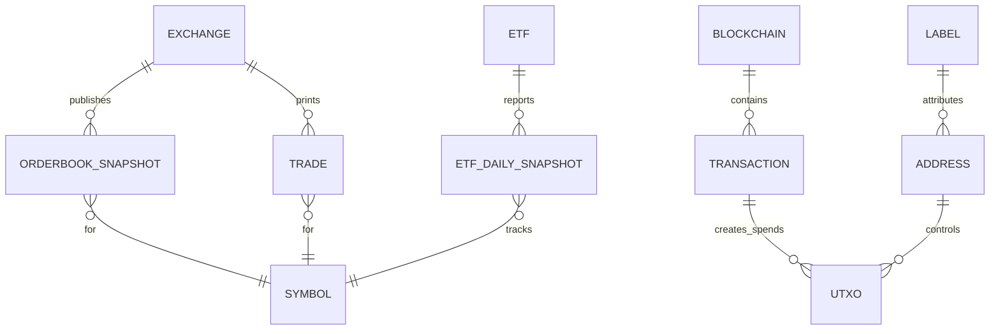

# Measuring Supply and Demand in Stocks and Crypto Markets

## Executive summary

“Supply” and “demand” for financial assets cannot usually be **directly calculated as structural curves** from market data alone, because price and quantity are jointly determined in equilibrium. Estimating true supply and demand elasticities requires econometric identification (e.g., instruments that shift supply but not demand, or vice versa) in a simultaneous-equations framework. citeturn18search1turn18search4turn18search14

In practice, analysts and trading systems compute **implementable, walk-forward “supply/demand pressure” proxies** from three observable layers: (a) market microstructure (order books + signed trade flow), (b) issuance/holdings/flows (shares outstanding, float, short interest, ETF creates/redeems; and for crypto, on‑chain flows and holder cohorts), and (c) derivatives positioning and pricing (funding rates, open interest, basis, implied volatility). citeturn0search8turn0search1turn2search1turn7search12turn7search2turn12search15turn8search0turn5search1

Stocks and Bitcoin differ in the measurability of “supply.” For U.S. equities, the “fundamental” supply of shares is disclosed via regulatory reporting (e.g., shares outstanding; public float), but **tradable supply at each price** comes from the limit order book and can be fragmented across venues (SIP vs proprietary feeds). citeturn5search1turn19search1turn19search0turn13search8turn5search2turn5search3 For Bitcoin, issuance is protocol-defined (halvings every 210,000 blocks; difficulty adjusts every 2,016 blocks) yet **effective liquid supply** is behavior-dependent and inferred via on‑chain holder and exchange-flow metrics. citeturn4search19turn21search1turn3search10turn4search6turn3search0

For ML and regime detection, a robust feature set typically combines: returns/realized volatility; liquidity and order-flow imbalance; derivatives leverage/hedging indicators; and slower-moving “macro positioning” factors such as ETF share/holdings changes and (for BTC) exchange netflows, miner balance dynamics, SOPR/MVRV, realized cap, and HODL-wave age structure—while explicitly managing **data revisions, labeling mutability, and look-ahead leakage**. citeturn3search10turn4search2turn22view0turn2search2turn2search4turn3search0

## Conceptual foundations and what can and cannot be “calculated”

### Classical definitions and the identification problem
In microeconomics, demand is the quantity consumers are willing and able to purchase at each price; supply is the quantity producers are willing to sell at each price. Market-clearing equilibrium occurs where quantity demanded equals quantity supplied. citeturn14search0turn14search8

However, when you observe market data \((P_t, Q_t)\), you are typically observing **equilibrium outcomes**—a mixture of shifting supply and demand. In simultaneous-equations models, estimating a demand curve generally requires exogenous variation that shifts supply but not demand (or vice versa), often implemented via instruments and two-stage least squares (2SLS). citeturn18search1turn18search14turn18search22

### Market microstructure view: supply/demand as an order book
In modern electronic markets, “supply” and “demand” are often operationalized as the **limit order book**, i.e., sell-side liquidity (asks) and buy-side liquidity (bids) as functions of price—plus the stream of market orders and cancellations that consume/modify that booked liquidity. This is the domain of market microstructure, commonly defined as the study of trading under explicit rules and the resulting price formation process. citeturn14search18turn15search19

A canonical result is that short-horizon price changes can be modeled as being driven by **order flow imbalance** (OFI)—an imbalance between supply and demand near the best bid/ask—and that OFI can be more stable/robust than raw volume relationships in high-frequency settings. citeturn0search8turn0search4

### Implication for “calculating supply and demand”
There are three distinct goals that often get conflated:

1. **Structural estimation**: estimate supply/demand curves or elasticities (requires identification). citeturn18search1turn18search14  
2. **Microstructure pressure**: measure short-term buy/sell pressure from order books and trades (implementable from feeds). citeturn0search8turn0search1turn14search22  
3. **Positioning/flow proxies**: measure medium/slow-moving supply availability and demand appetites (shares outstanding/float/short interest; on-chain cohorts; ETF flows; stablecoin supply; derivatives). citeturn5search1turn19search0turn12search1turn3search3turn7search2turn8search0  

Most quantitative trading/ML pipelines for “supply vs demand” are primarily doing (2) and (3), not (1).

## Definitions and measurable components of supply and demand

### Stocks: what “supply” and “demand” mean in measurable terms
**Fundamental share supply (slow-moving, disclosed):**
- **Shares outstanding**: required disclosure in periodic reports (e.g., Form 10‑Q cover page requires the number of shares outstanding as of the latest practicable date). citeturn5search1  
- **Public float** (aggregate market value held by non-affiliates): required on Form 10‑K cover page as of the last business day of the most recently completed second fiscal quarter. citeturn19search1turn19search0  

**Tradable supply/demand at time \(t\) (fast, microstructure):**
- **Displayed bid/ask depth** by price level on each venue (limit-order book). Proprietary feeds can provide full depth; SIP-derived data is typically less granular than direct feeds. citeturn5search2turn5search3turn13search8turn13search11turn13search14  
- **Aggressive order flow**: buyer-initiated vs seller-initiated trades (requires trade-signing). citeturn0search1turn0search5  

**Additional “supply availability” layers (institutional/constraints):**
- **Short interest**: reported to entity["organization","FINRA","us self-regulatory org"] twice a month (positions, not daily short-sale volume). citeturn12search1turn12search13  
- **Securities lending**: in the U.S., the entity["organization","U.S. Securities and Exchange Commission","us financial regulator"] adopted Rule 10c‑1a requiring reporting of securities loans to a registered national securities association (RNSA), with public dissemination of certain aggregate information. citeturn12search2turn12search18  

These layers matter because they alter the effective “inventory” available for selling (e.g., borrow availability enabling shorts) and can create demand/supply imbalances unrelated to daily trading volume.

### Bitcoin/crypto: what “supply” and “demand” mean in measurable terms
**Protocol/ledger supply (observable on-chain):**
- Bitcoin issuance is governed by protocol rules (difficulty adjustment every 2,016 blocks; halving of block subsidy every 210,000 blocks; long-run 21M cap). citeturn21search1turn4search19turn21search3  
- “Current supply” for UTXO chains can be defined as the **sum of all unspent output values** (an on-chain, node-computable quantity). citeturn4search0turn16search8  

**Effective/liquid supply (behavioral, inferred):**
- Cohort-held balances (e.g., miner-held supply; exchange-held supply) depend on address attribution and analytics heuristics; they can be powerful but are not “ground truth” in the same way that UTXO totals are. citeturn4search6turn3search10turn4search21  
- Age/holding distribution of supply (HODL waves) measures how long coins have remained unspent, reflecting holder behavior and potential sell-side overhang if older coins reactivate. citeturn3search0  

**Demand proxies (multi-layer):**
- Market microstructure demand: spot exchange order books / trades (like equities, but without a consolidated tape). citeturn6search0turn6search8turn6search1  
- On-chain usage proxies: active addresses, transfer volumes (with caveats). citeturn3search1  
- Fiat/stablecoin “dry powder”: stablecoin supply ratios are explicitly designed as a proxy for BTC-vs-USD purchasing power. citeturn3search3turn3search15  
- Derivatives-based demand/pressure: funding rates and open interest quantify leverage/positioning incentives and participation. citeturn7search12turn7search2turn7search16  

image_group{"layout":"carousel","aspect_ratio":"16:9","query":["limit order book diagram bid ask depth","order flow imbalance diagram","bitcoin UTXO transaction diagram","ETF creation redemption mechanism diagram"],"num_per_query":1}

### Direct comparison: why “supply” is more deterministic for BTC than for equities
For Bitcoin, protocol issuance is algorithmic and on-chain verifiable, so baseline supply growth is relatively predictable (though exact calendar timing depends on block times). citeturn21search1turn4search19  
For equities, outstanding shares and float are disclosed and auditable but can change through corporate actions and are updated at reporting frequencies; meanwhile, the **tradable supply at each price** is an evolving microstructure object that depends on venue fragmentation and liquidity provision. citeturn5search1turn19search0turn13search8turn5search2

## Primary data sources and collection architecture

### Regulatory and issuer disclosures for stocks
Key high-trust sources are statutory filings and regulator-operated APIs:

- The entity["organization","U.S. Securities and Exchange Commission","us financial regulator"] provides **EDGAR APIs**, including the Company Facts XBRL endpoint (`data.sec.gov/api/xbrl/companyfacts/CIK##########.json`) for structured disclosures. citeturn5search0  
- Form cover pages specify required disclosures: e.g., Form 10‑Q requires shares outstanding as of the latest practicable date. citeturn5search1  
- Form 10‑K cover page requires disclosure of public float held by non-affiliates (as defined). citeturn19search1turn19search0  
- Insider transactions (Forms 3/4/5) are described in SEC investor material; Form 4 generally must be filed within two business days after execution of a reportable transaction. citeturn19search3turn19search6  

### Market microstructure feeds for stocks
Depending on your required granularity:

- Proprietary depth-of-book feeds:
  - entity["company","Nasdaq","us exchange operator"] TotalView-ITCH provides order-level depth (per its specification). citeturn5search2  
  - entity["organization","New York Stock Exchange","us stock exchange"] OpenBook Ultra provides depth-of-book data (displayed liquidity) with event updates. citeturn5search3turn5search7  
  - entity["organization","Investors Exchange","us stock exchange"] DEEP/DEEP+ provide aggregated depth-of-book and order-by-order views, respectively, with explicit exclusions (e.g., non-displayed portions not represented). citeturn13search9turn13search13  

- SIP-derived consolidated data and TAQ:
  - The CTA SIP consolidates protected quotes/trades and disseminates NBBO and related regulatory data. citeturn13search8  
  - NYSE Daily TAQ is described as derived from CTA and UTP SIP outputs and provides all trades/quotes for a day (per spec). citeturn13search11  
  - entity["organization","Wharton Research Data Services","data platform"] describes NYSE TAQ as tick-by-tick trade and quote data covering U.S. NMS activity. citeturn13search0  

### On-chain data sources for Bitcoin/crypto
You can collect on-chain data from:

- **Running your own node + RPC** (highest integrity, most controllable): Bitcoin Core RPC methods (e.g., `getrawtransaction`, UTXO set info) are documented. citeturn16search0turn16search8  
- **Explorer APIs** (convenient; trust and rate limits vary):
  - entity["company","Blockstream","bitcoin infrastructure company"] Esplora API (open-source; self-hostable; Blockstream-hosted endpoints exist). citeturn6search3turn6search15  
  - mempool.space REST/WebSocket docs. citeturn16search2turn16search10  
  - Blockchair API docs (multi-chain; includes “stats” endpoints for Bitcoin-like chains). citeturn16search3turn16search7  

For large-scale historical feature generation, academic tooling such as BlockSci exists to sharply speed blockchain analysis by building an analytic database. citeturn20search12turn20search0

### Exchange APIs for spot and derivatives crypto data
Crypto spot exchanges provide order book and trade data:

- entity["company","Coinbase","crypto exchange"] Advanced Trade API supports REST + WebSockets for market data; the `level2` channel is designed for reliable order book updates. citeturn6search0turn6search8  
- entity["company","Binance","crypto exchange"] Spot API documents common market data endpoints like order book depth and aggregated trades. citeturn6search1turn6search5  

Derivatives venues provide leverage/positioning signals:

- entity["company","Bybit","crypto exchange"] publishes funding-rate and open-interest endpoints. citeturn7search1turn7search13  
- entity["company","Deribit","crypto derivatives exchange"] provides endpoints returning open interest and other summaries; it also publishes methodology communications for DVOL (implied volatility index). citeturn6search2turn7search3  
- entity["company","CME Group","derivatives exchange operator"] provides educational definitions and daily volume/open interest reports for futures/options markets (relevant when using CME-listed crypto derivatives or equity index derivatives). citeturn7search2turn7search18  

### ETF holdings/flow data
ETF flows can function as demand proxies because the creation/redemption mechanism allows ETF shares outstanding to expand/contract in response to demand. citeturn8search0turn8search12

Examples of issuer-disclosed fields you can use for BTC ETP flows include shares outstanding and basket/holdings disclosures. For instance, entity["company","BlackRock","asset manager"]’s IBIT product page includes shares outstanding and indicates its portfolio holds 1 asset; it also provides holdings quantity (as “total number of bitcoins held”) and basket parameters. citeturn9view0  
Similarly, entity["company","Grayscale Investments","crypto asset manager"]’s GBTC page includes shares outstanding and total bitcoin in trust. citeturn10view0

### Quick source map with example endpoints/datasets
The table below is intentionally “primary-first” (regulators, exchanges, protocol-level sources). Some endpoints are illustrative; exact fields vary by venue and API version.

| Domain | What you can measure | Primary source(s) | Example endpoint / dataset (illustrative) | Typical frequency | Notes / limitations |
|---|---|---|---|---|---|
| Equity fundamentals | Shares outstanding; public float; issuance history | SEC filings + EDGAR APIs citeturn5search0turn5search1turn19search1turn19search0 | `data.sec.gov/api/xbrl/companyfacts/CIK##########.json` | quarterly / annual (with cover-page “latest practicable date” for shares outstanding) | Disclosed values can lag intraperiod corporate actions; interpret “as of” dates carefully. citeturn5search5turn5search1 |
| Equity microstructure (consolidated) | Trades and quotes; NBBO | CTA/UTP SIP; TAQ archives citeturn13search8turn13search11turn13search0 | NYSE Daily TAQ; WRDS TAQ | tick / microsecond | SIP is consolidated but may be less granular than proprietary feeds; vendor normalization matters. citeturn13search14turn13search11 |
| Equity depth-of-book | Full depth order book events | Nasdaq TotalView, NYSE OpenBook Ultra, IEX DEEP/DEEP+ citeturn5search2turn5search3turn13search9 | Vendor-specific binary feeds (ITCH), OpenBook Ultra client spec | event-level (µs) | Depth differs by venue; hidden liquidity may not be represented. citeturn13search9turn5search3 |
| Equity short positioning | Short interest; (future) securities loan reporting | FINRA short interest; SEC Rule 10c‑1a citeturn12search1turn12search2turn12search18 | FINRA short interest files | twice monthly (short interest) | Short interest ≠ short-sale volume; position reporting is not real-time. citeturn12search13turn12search1 |
| Bitcoin protocol supply | Current supply (UTXO sum); difficulty/issuance mechanics | Bitcoin node + developer docs citeturn4search0turn16search8turn21search1turn4search19 | Bitcoin Core RPC; node indexer | block / daily | UTXO totals are on-chain; “circulating” vs “liquid” supply is definitional. citeturn4search0turn4search8 |
| Bitcoin on-chain analytics | SOPR, MVRV, realized cap, HODL waves, exchange netflows (labeled) | Glassnode, Coin Metrics docs citeturn22view0turn2search2turn2search12turn3search0turn2search3turn3search10 | Provider APIs; also self-computation possible | hourly/daily | Labeled cohorts (exchanges/miners) are model-based; can be revised over time. citeturn3search10 |
| Crypto spot microstructure | Order book + trades | Exchange REST/WebSocket docs citeturn6search0turn6search8turn6search1 | Coinbase level2 WS; Binance /depth and /aggTrades | ms–seconds | No universal consolidated tape; cross-venue aggregation needed. |
| Crypto derivatives | Funding, OI, basis, implied vols | Binance/Bybit/Deribit/CME docs citeturn7search4turn7search16turn7search1turn7search3turn7search2 | `/fapi/v1/fundingRate`; OI endpoints; Deribit book summaries | minutes–daily | Conventions vary by venue and instrument; align timestamps and funding intervals. citeturn7search1turn7search12 |
| ETF flows/holdings | Shares outstanding changes; BTC holdings in trust | SEC ETF guidance; issuer pages citeturn8search0turn9view0turn10view0 | Issuer “holdings/so” snapshots | daily | Flow is inferred from ∆shares or ∆holdings; corporate actions can confound naive inference. citeturn8search0 |

## Methods to infer demand and supply pressure

### Trade signing and aggressive flow
Many demand proxies depend on classifying trades as buyer-initiated or seller-initiated. The classic Lee–Ready approach (and variants like tick tests) infer trade direction from intraday prices and quotes. citeturn0search1turn0search13

A key practical warning is that trade classification is imperfect and can bias downstream inference; empirical evaluations show nontrivial misclassification rates and systematic bias risk. citeturn0search5turn0search17

### Order book imbalance and order flow imbalance
Order book imbalance (OBI) measures the relative depth on bid vs ask sides over some depth \(K\). Order flow imbalance (OFI) extends this to **event-driven changes** in best quotes and depth (including limit orders, market orders, cancellations). In equities, OFI has been empirically linked to contemporaneous price changes, with a roughly linear relationship across stocks and time scales in the original studies. citeturn0search8turn0search4

### VAR-based and structural microstructure models
A common econometric approach models quote revisions and trades as a vector autoregressive (VAR) system, allowing estimation of “permanent” price impact of a trade innovation (information component). This is central to Hasbrouck-style empirical microstructure. citeturn0search6turn0search2  
VARs are also widely used more generally in econometrics as a flexible way to model dynamic interactions among multiple time series. citeturn17search0turn17search12

Structural microstructure models (e.g., the Kyle framework) provide parameters interpretable as liquidity/price-impact (Kyle’s \(\lambda\)) under a model of informed vs noise trading with a market maker. citeturn1search3turn1search18

Information-asymmetry models (e.g., Glosten–Milgrom dealer-market framework) connect bid-ask spreads and price formation to adverse selection from heterogeneously informed traders. citeturn14search11turn14search7

### Volatility models: GARCH and implied volatility
Volatility is not “demand” by itself, but it is a key latent state that co-moves with liquidity and risk appetite.

- ARCH introduced conditional heteroskedasticity modeling for time-varying variance. citeturn1search0  
- GARCH generalizes ARCH by incorporating lagged conditional variances. citeturn1search1turn1search5  

Options-implied volatility is a forward-looking risk/hedging price signal:
- The VIX methodology document defines VIX as a measure of the market’s expectation of 30‑day forward-looking volatility conveyed by S&P 500 option prices. citeturn12search15  
- In crypto options, Deribit’s DVOL is described as a 30‑day annualized implied volatility index built from the implied volatility smile. citeturn7search3turn7search19  

### Latent factor models and state-space methods
When you have many correlated indicators (e.g., dozens of on-chain, derivatives, and flow metrics), latent factor models provide a disciplined approach to compress variance into a few factors, often using state-space representations and filtering. Dynamic factor model surveys emphasize forecasting and inference in high-dimensional settings. citeturn17search3turn17search11

### HMMs / Markov regime switching
Regime-switching models treat parameters (mean/volatility/relationships) as switching between latent states governed by a Markov process, a framework widely associated with Hamilton’s seminal work. citeturn0search3turn0search11

For “supply/demand” analysis, regimes often map to interpretable states such as:
- liquidity-rich vs liquidity-poor,
- deleveraging vs risk-on leverage build-up,
- distribution vs accumulation phases in on-chain holder cohorts.

These labels are interpretive; the model estimates latent states and transition dynamics.

### Structural estimation of demand curves (rare in trading systems)
If your goal is the true demand curve for an asset (elasticity), you need exogenous instruments (policy changes, fee changes, supply shocks, or venue outages) that shift one side without directly shifting the other. This is far more common in macro/industrial organization than in trading feature engineering. citeturn18search1turn18search14turn18search22

## Practical metrics, formulas, required fields, and pseudocode

This section focuses on metrics that are (a) implementable from the data sources above, (b) usable in walk-forward pipelines, and (c) interpretable as supply/demand pressure proxies rather than literal structural curves.

### Market microstructure metrics for both equities and crypto spot

#### Order book imbalance (snapshot-based)
**Definition (top \(K\) levels):**
\[
\text{OBI}_t = \frac{\sum_{i=1}^K V^{bid}_{t,i} - \sum_{i=1}^K V^{ask}_{t,i}}{\sum_{i=1}^K V^{bid}_{t,i} + \sum_{i=1}^K V^{ask}_{t,i}}
\]
where \(V^{bid}_{t,i}\) and \(V^{ask}_{t,i}\) are sizes at level \(i\).

**Required fields:** order book snapshot (price, size, side) at \(t\).

**Frequency:** event-driven or sampled (e.g., 100ms/1s/1m).

**Walk-forward computability:** yes, if computed from contemporaneous snapshots only.

**Notes:** In equities, full depth often requires proprietary feeds (e.g., Nasdaq/NYSE/IEX depth products). citeturn5search2turn5search3turn13search9 In crypto, you typically use exchange WebSockets (“level2” style) or REST snapshots. citeturn6search8turn6search1

#### Trade signing (buyer vs seller initiated)
A common approach is a Lee–Ready style quote rule + tick test. citeturn0search1turn0search13

**Inputs:** trade price \(p\), trade size \(q\), prevailing bid \(b\), ask \(a\), prior trade price \(p_{prev}\).

**Output:** sign \(s \in \{+1,-1\}\).

```python
# PSEUDOCODE: Lee–Ready-style trade signing
# Inputs: trade (p, q, ts), prevailing quote (bid, ask) aligned to ts, previous trade price p_prev

def sign_trade(p, bid, ask, p_prev):
    # Quote rule: if trade executes at/above ask, treat as buyer-initiated
    if p >= ask:
        return +1
    # If at/below bid, treat as seller-initiated
    if p <= bid:
        return -1
    # Otherwise use tick test (compare to previous trade price)
    if p > p_prev:
        return +1
    if p < p_prev:
        return -1
    # If unchanged, keep previous sign or mark as 0/unknown
    return 0
```

**Caveat:** Misclassification is real and can bias results; tests of Lee/Ready show nontrivial error rates and documented bias risk. citeturn0search5turn0search17

#### Signed volume / volume delta
Given signed trades in an interval \([t-\Delta,t]\):
\[
\text{SignedVol}_t = \sum_{j \in \Delta} s_j \, q_j
\]
and a normalized imbalance:
\[
\text{VolDeltaNorm}_t = \frac{\sum_{s_j=+1} q_j - \sum_{s_j=-1} q_j}{\sum_{s_j=+1} q_j + \sum_{s_j=-1} q_j}
\]

**Required fields:** trade prints (price, size, timestamp) + trade sign.

#### Order flow imbalance (event-based, best-quote)
Cont–Kukanov–Stoikov define OFI based on changes in best bid/ask sizes and prices due to order book events and connect OFI to price changes. citeturn0search8turn0search4

A simplified implementable variant is to compute best-level depth changes between snapshots:
\[
\text{OFI}_t \approx (V^{bid}_t - V^{bid}_{t-\Delta}) - (V^{ask}_t - V^{ask}_{t-\Delta})
\]
(optionally adjusted for price moves).

**Required fields:** event feed or tightly sampled best bid/ask sizes.

**Notes:** True OFI requires event-type accounting (adds/cancels/executions); snapshot approximations are easier but less “structural.”

#### Price impact proxy (Kyle’s lambda)
Kyle’s model yields an interpretable price impact parameter \(\lambda\). citeturn1search3turn1search18  
Operationally, estimate in rolling windows:
\[
\Delta p_t = \lambda \cdot \text{SignedVol}_t + \varepsilon_t
\]
(choose price change horizon consistent with your microstructure sampling).

**Required fields:** prices + signed volume.

**Walk-forward computability:** yes (rolling window, only past data).

### On-chain metrics specific to Bitcoin and UTXO-like chains

Below, “UTXO created value” is the USD value at the time a UTXO was created; “UTXO spent value” is the USD value at the time it was spent.

#### Supply and issuance

- **Current supply (UTXO-sum)**: for UTXO chains, current supply is the sum of all unspent outputs. citeturn4search0turn16search8  
- **Difficulty adjustment mechanism** (context for issuance schedule timing): every 2,016 blocks, difficulty adjusts based on how long the prior 2,016 blocks took. citeturn21search1  
- **Halving schedule**: block subsidy halves every 210,000 blocks, producing a capped issuance profile (Bitcoin never exceeds 21M). citeturn4search19turn21search3  

If you rely on a vendor for “circulating supply,” note that it can be “reported by projects or other derived sources” in some data products; define it explicitly in your pipeline. citeturn4search8

#### Miner reserves and miner selling pressure
Glassnode defines miner balance as total supply held in miner addresses, and provides models estimating the percent of mined supply spent vs held over windows. citeturn4search6turn4search2

A basic “miner net position change” proxy:
\[
\Delta \text{MinerBal}_t = \text{MinerBal}_t - \text{MinerBal}_{t-1}
\]
and normalize by issuance:
\[
\text{MinerSellPressure}_t = -\frac{\Delta \text{MinerBal}_t}{\text{Issuance}_t}
\]
(positive means net selling, as balances fall).

#### Exchange inflow/outflow and netflow
Define:
\[
\text{Netflow}_t = \text{Inflow}_t - \text{Outflow}_t
\]
This definition matches common exchange-flow conventions and is shown explicitly in analytics contexts. citeturn3search6turn3search10

**Critical limitation:** Exchange flow metrics rely on labeled exchange addresses and can be mutable as labels and techniques update; Glassnode explicitly notes exchange metrics are based on labeled data that is updated and that recent points may shift. citeturn3search10

#### Active addresses
Coin Metrics describes active addresses as a proxy for “number of users,” while warning about chain-specific idiosyncrasies and the possibility of manipulation where address creation/transacting is cheap. citeturn3search1turn3search5

Use as an activity proxy, not a literal count of distinct humans.

#### NVT (Network Value to Transactions)
Coin Metrics defines NVT as network value divided by adjusted transfer value (and provides free-float NVT variants). citeturn2search3

A practical form:
\[
\text{NVT}_t = \frac{\text{MarketCap}_t}{\text{AdjTransferValue}_t}
\]
**Interpretation:** higher NVT can indicate higher valuation relative to on-chain economic throughput (but depends heavily on how “adjusted transfer value” is built).

#### Realized cap, realized price, MVRV
Coin Metrics describes realized capitalization as valuing each unit of supply at the price it last moved (as opposed to marking all supply at current price). citeturn2search4  
Glassnode provides documentation for realized capitalization and MVRV (market cap / realized cap). citeturn2search12turn2search2

Core relationships:
\[
\text{RealizedPrice}_t = \frac{\text{RealizedCap}_t}{\text{Supply}_t}
\]
(also commonly stated in on-chain analytics). citeturn2search16  
\[
\text{MVRV}_t = \frac{\text{MarketCap}_t}{\text{RealizedCap}_t}
\] citeturn2search2

#### SOPR (Spent Output Profit Ratio)
Glassnode defines SOPR as the ratio of realized value at spend to value at creation, computed over outputs spent in the chosen interval. citeturn22view0

A practical formula at daily frequency:
\[
\text{SOPR}_t = 
\frac{\sum_{o \in \text{spent on day }t} \big(v_o \cdot p_{\text{spend}(o)}\big)}
     {\sum_{o \in \text{spent on day }t} \big(v_o \cdot p_{\text{create}(o)}\big)}
\]
where \(v_o\) is BTC amount of output \(o\).

Glassnode also documents adjusted SOPR variants that filter out very short-lived UTXOs (to reduce “self-churn” effects). citeturn22view0

#### HODL waves
Glassnode defines HODL waves as the distribution of coin ages as proportions of total supply, tracking balance between short-term and long-term holding and shifts when dormant coins reactivate. citeturn3search0

### Stablecoin supply as a BTC demand proxy (SSR)
Glassnode defines the Stablecoin Supply Ratio (SSR) as a ratio between BTC supply and stablecoin supply denominated in BTC; it is used as a proxy for stablecoin “buying power” relative to BTC. citeturn3search3turn3search15

In practice, many implementations also express it as BTC market cap divided by stablecoin market cap (equivalent to converting stablecoin supply into BTC notionals). citeturn3search7

### Derivatives signals (stocks and crypto)

#### Funding rates (crypto perpetuals)
Funding is an exchange-specific mechanism; Binance describes funding as driven by interest rate and premium components, and provides dedicated endpoints for funding-rate history. citeturn7search12turn7search4  
Bybit similarly documents funding with premium/interest components and provides endpoints for funding rate history. citeturn7search5turn7search1

**Implementable features:**
- funding level \(f_t\) (annualized and raw per interval)
- funding volatility (rolling std)
- funding skew across venues (cross-exchange basis signal)

#### Open interest (futures/options)
CME defines open interest as the total number of futures contracts held at end of day and frames it as an indicator of market sentiment/strength behind trends. citeturn7search2  
Crypto venues expose OI via APIs (e.g., Binance `/fapi/v1/openInterest`). citeturn7search16

**Key features:**
- \(OI_t\), \(\Delta OI_t\), \(\Delta OI_t\) conditional on returns (leverage build vs unwind)
- OI concentration (where available) such as option OI by strike/expiry (CME tools exist for options OI visualization). citeturn7search6

#### Implied volatility
VIX is a canonical equity implied-vol index methodology. citeturn12search15  
Deribit’s DVOL is a crypto analogue for BTC options implied vol. citeturn7search3turn7search19

### ETF flows as demand proxies
ETF creation/redemption mechanics are documented in SEC investor bulletins and industry explanations; the core point is that APs create/redeem ETF shares in large units, allowing outstanding shares to expand/contract with demand. citeturn8search0turn8search12

**Walk-forward flow inference for a BTC spot ETP (generic):**
Let \(SO_t\) be shares outstanding, \(NAV_t\) net asset value per share, \(BTC_t\) BTC held by the trust.

- Estimated USD net flow over day:
\[
\text{FlowUSD}_t \approx (SO_t - SO_{t-1}) \cdot NAV_t
\]
- Estimated BTC flow over day:
\[
\text{FlowBTC}_t \approx BTC_t - BTC_{t-1}
\]

Issuer pages can provide \(SO_t\) and holdings quantities (examples shown on IBIT and GBTC pages). citeturn9view0turn10view0

### Metric comparison tables

#### Microstructure metrics (stocks and crypto spot)
| Metric | Interpretation as supply/demand proxy | Data source | Typical frequency | Pros | Cons / biases | Walk-forward notes |
|---|---|---|---|---|---|---|
| Bid-ask spread | Transaction cost / tightness; low spread often implies abundant liquidity | Depth feed or quotes; liquidity definitions emphasize tightness via spreads citeturn15search19turn13search11 | tick–minutes | Simple; widely used | Hidden liquidity not captured; venue fragmentation | Safe if computed from contemporaneous quotes |
| Depth / OBI (top K levels) | Relative buy vs sell liquidity near touch | Proprietary L2 feeds (equities); exchange WS L2 (crypto) citeturn5search2turn6search8 | event–seconds | Captures book pressure | Sensitive to spoofing/cancellations; depth varies by venue | Use synchronized snapshots; avoid forward-filled future depth |
| Signed volume delta | Aggressive buy vs sell pressure | Trades + signing (Lee–Ready) citeturn0search1turn0search13 | tick–minutes | Strong predictor in some settings | Signing errors; timestamp alignment issues citeturn0search5 | Use causal quote alignment; validate sign quality |
| OFI | Net imbalance of book events at best quotes; linked to returns | Order book events or best-level snapshots; OFI framework citeturn0search8turn0search4 | event–seconds | Often cleaner than raw volume | Implementing true OFI requires event parsing | Snapshot-approx OK but less faithful |
| Kyle’s lambda | Estimated price impact per unit signed volume | Trades + signed volume; structural motivation citeturn1search3 | minutes–daily | Interpretable liquidity factor | Model misspecification; regime dependence | Rolling regressions must be strictly past-only |
| VAR permanent impact | Separates transient vs permanent trade impact | Trades + quotes; VAR-in-microstructure citeturn0search6turn0search2 | minutes | Theoretically grounded | Heavy data + careful specification | Fit per training window only; avoid refitting on future |

#### Bitcoin on-chain metrics
| Metric | Interpretation | Data source | Typical frequency | Pros | Cons / biases | Walk-forward notes |
|---|---|---|---|---|---|---|
| Current supply (UTXO sum) | Total issued/visible supply on-chain | Node/UTXO stats; Coin Metrics definition citeturn4search0turn16search8 | block/daily | High integrity | Not “circulating” vs “lost” | Fully causal |
| Issuance / inflation | New supply rate | Protocol schedule context; supply issuance metric definition citeturn4search19turn4search16 | daily/yearly | Deterministic-ish for BTC | Calendar time depends on block times | Use realized blocks, not assumed blocks/day |
| Miner balance / net position | Potential miner sell pressure | Miner balance and spent-supply models citeturn4search6turn4search2 | daily | Directly tied to producers | Miner labeling imperfect | Label revisions risk; snapshot provider data |
| Exchange netflow | Deposits vs withdrawals; sell-side availability proxy | Labeled exchange flows citeturn3search10 | hourly/daily | Intuitive and widely used | Label mutability; internal movements can confound | Treat recent points as revisable; log revisions |
| Active addresses | Activity proxy | Coin Metrics active addresses definition + caveats citeturn3search1 | daily | Broad “usage” signal | Not unique humans; can be gamed | Causal, but interpret carefully |
| NVT (Adj) | Valuation vs economic throughput | Coin Metrics NVT definition citeturn2search3 | daily | Standardized definition | Depends on adjusted transfer value methodology | Prefer stable vendor version or self-defined method |
| Realized cap / MVRV | Cost basis / valuation extremes | Coin Metrics realized cap; Glassnode MVRV docs citeturn2search4turn2search2 | daily | Strong cycle signal historically | Requires historical price mapping; vendor method differences | Causal if computed only with past price history |
| SOPR / aSOPR | Realized profit-taking vs loss-taking | Glassnode SOPR definition and formula citeturn22view0 | hourly/daily | Captures holder behavior | Sensitive to self-churn; needs filtering | Use adjusted variants if available; avoid future reclassification |
| HODL waves | Age structure of supply | Glassnode HODL waves definition citeturn3search0 | daily/weekly | Cohort/regime insight | Heavily interpretive | Causal; but cohort boundaries are design choices |

#### Derivatives and flow metrics
| Metric | Interpretation | Data source | Frequency | Pros | Cons / biases | Walk-forward notes |
|---|---|---|---|---|---|---|
| Funding rate | Leverage sentiment / perp-vs-spot pressure | Binance/Bybit funding docs citeturn7search12turn7search5 | minutes–8h intervals | Directly observable | Venue-specific; regime-dependent | Align to funding timestamps, not candle close |
| Open interest | Participation / leverage buildup | CME definition; crypto OI endpoints citeturn7search2turn7search16 | intraday–daily | Broad positioning gauge | OI doesn’t reveal direction | Use ∆OI with returns; be careful with contract rolls |
| Implied volatility (VIX/DVOL) | Market-priced risk | VIX methodology; Deribit DVOL description citeturn12search15turn7search3 | intraday–daily | Forward-looking | Microstructure of options can distort | Use standardized time (e.g., end-of-day) |
| ETF shares outstanding ∆ | Primary-market creation/redemption demand proxy | SEC ETF bulletin; issuer pages citeturn8search0turn9view0turn10view0 | daily | Captures institutional demand | Needs corporate-action adjustments | Use issuer “as of” timestamps; handle holidays |
| SSR / stablecoin supply | “Dry powder” proxy vs BTC | Glassnode SSR definition citeturn3search3turn3search15 | daily | Links stablecoin growth to BTC buying power notion | Stablecoin universe definition varies | Lock down stablecoin set; use consistent vendor |

### Pseudocode templates for walk-forward computation

Below are compact templates you can adapt; they are written to emphasize **fields required** and **causal windowing** rather than any specific library.

#### Causal resampling and feature alignment (generic)

```python
# PSEUDOCODE: walk-forward feature alignment
# Goal: compute features for interval [t-Δ, t], using only data timestamps <= t.

def compute_features_for_bar(trades, quotes, orderbook_snaps, t_end, delta):
    t_start = t_end - delta

    # Filter inputs strictly to the bar window
    bar_trades = trades[(trades.ts > t_start) & (trades.ts <= t_end)]
    bar_quotes = quotes[(quotes.ts <= t_end)]  # for trade signing, you need prevailing quote <= trade ts
    bar_book   = orderbook_snaps[orderbook_snaps.ts == t_end]  # snapshot at bar end (or nearest <= t_end)

    # Compute trade signs (requires quote alignment)
    signed = []
    p_prev = get_previous_trade_price(trades, t_start)
    for tr in bar_trades:
        bid, ask = get_prevailing_quote(bar_quotes, tr.ts)   # last quote at or before trade time
        s = sign_trade(tr.price, bid, ask, p_prev)
        signed.append((tr.ts, s, tr.size, tr.price))
        p_prev = tr.price

    # Aggregate signed volume delta
    signed_vol = sum(s * q for (_, s, q, _) in signed)
    buy_vol    = sum(q for (_, s, q, _) in signed if s == +1)
    sell_vol   = sum(q for (_, s, q, _) in signed if s == -1)
    vol_delta_norm = (buy_vol - sell_vol) / max(buy_vol + sell_vol, 1e-12)

    # Order book imbalance (top K)
    obi = compute_OBI(bar_book, K=10)

    return {"signed_vol": signed_vol, "vol_delta_norm": vol_delta_norm, "obi": obi}
```

#### SOPR (UTXO-based) (conceptual)
You need the set of outputs **spent during day \(t\)**, plus:
- BTC amount per output,
- price at output creation time,
- price at output spend time.

```python
# PSEUDOCODE: SOPR for a day t
# Inputs:
#   spent_outputs_t: list of outputs spent during day t.
#     each has: value_btc, created_ts, spent_ts
#   price(ts): function returning BTCUSD price at timestamp ts (or nearest prior)

def sopr(spent_outputs_t, price):
    num = 0.0  # realized value at spend
    den = 0.0  # value at creation
    for o in spent_outputs_t:
        num += o.value_btc * price(o.spent_ts)
        den += o.value_btc * price(o.created_ts)
    return num / max(den, 1e-12)
```

This aligns with Glassnode’s definition of SOPR as realized value at spend divided by value at creation for coins moved in the interval. citeturn22view0

## Data quality, biases, and limitations

### Stocks: common issues
**Venue fragmentation and feed choice:** SIP-derived consolidated data exists, but proprietary feeds can differ in granularity and latency; depth-of-book and hidden liquidity representation varies. citeturn13search8turn13search14turn5search2turn13search9

**Trade-signing errors:** Lee–Ready style methods are widely used but imperfect; accuracy tests highlight meaningful misclassification and bias risks. citeturn0search5turn0search17

**Reporting latency:** shares outstanding and float are disclosed at reporting cadence; short interest is reported twice monthly. citeturn5search1turn19search0turn12search1

**Institutional mechanics and settlement conventions:** U.S. standard settlement moved from T+2 to T+1 effective May 28, 2024, which affects certain timing conventions and operational datasets. citeturn12search8turn12search4

### Crypto and Bitcoin: common issues
**On-chain ≠ economic activity:** transfers can include self-churn, change outputs, batching, and internal exchange movements; “adjusted transfer value” is a methodological choice. citeturn2search3turn22view0

**Address-based proxies are not identities:** active addresses can be manipulated and differ structurally by chain; interpreting them as “users” is hazardous. citeturn3search1

**Labeling mutability:** exchange inflow/outflow metrics rely on evolving labeled address sets and are explicitly described as mutable over time by providers. citeturn3search10

**Off-chain activity:** crypto exchange internal transfers and OTC trades are typically not visible on-chain; they may still dominate marginal price formation on some horizons.

### ETF flow inference pitfalls
The creation/redemption mechanism is conceptually clean, but translating daily changes into “demand” requires care:
- \(SO_t\) changes can reflect creations/redemptions but also administrative events or timing differences.
- Holdings disclosures can have “as of” timestamp conventions that differ from market close.
The SEC and industry explain the creation/redemption mechanism but do not guarantee that any single public flow metric is a perfect demand measure. citeturn8search0turn8search12

## Recommended feature set for ML and regime detection

This section proposes a **prioritized, cross-asset feature set** designed for regime detectors (HMM/Markov switching) and supervised ML, emphasizing (a) interpretability, (b) walk-forward computability, and (c) robustness across stocks and BTC.

### Design principles
1. **Separate horizons:** microstructure (seconds–minutes), positioning (hours–days), and macro regime (weeks–months). Purely mixing them can cause model instability. citeturn0search8turn0search11  
2. **Prefer mechanically-defined features** when possible (e.g., on-chain supply; shares outstanding disclosures) over heavily modeled ones (e.g., labeled cohorts) unless you can snapshot revisions. citeturn4search0turn3search10  
3. **Model regime dependence explicitly:** relationships like funding↔returns, OFI↔returns, and SOPR↔trend can change by regime. Markov switching frameworks were designed for this. citeturn0search3turn7search12turn22view0  

### Suggested core features (by category)

**Universal price/volatility backbone (stocks + crypto):**
- log returns \(r_t\) (multiple horizons)
- realized volatility (sum of intrabar squared returns)
- realized range (high–low based measures)
- drawdown features (relative drawdown)

(Use GARCH or realized-vol estimators if you need a volatility state; ARCH/GARCH foundations are well established. citeturn1search0turn1search1)

**Liquidity and order flow (universal microstructure layer):**
- bid-ask spread (tightness)
- depth (best-level and top-K)
- OBI, OFI approximations
- signed volume, normalized volume delta
- Kyle lambda (rolling impact)

(OFI and trade-signing are anchored in market microstructure literature. citeturn0search8turn0search1turn1search3)

**Crypto-specific on-chain layer (BTC):**
- exchange netflow (and smoothed versions), with revision tracking citeturn3search10  
- miner balance change normalized by issuance citeturn4search2turn4search6  
- SOPR / aSOPR, plus STH/LTH variants where available citeturn22view0  
- MVRV and realized cap / realized price citeturn2search2turn2search12turn2search4  
- HODL waves / realized cap HODL waves citeturn3search0turn3search8  
- NVT (Adj) and free-float variants if you commit to vendor methodology citeturn2search3  
- active addresses (use cautiously; treat as “activity proxy”) citeturn3search1  

**Derivatives positioning layer (stocks + crypto):**
- funding rate level/changes (crypto perps) citeturn7search12turn7search5  
- open interest and ∆OI (futures/options) citeturn7search2turn7search16  
- implied vol indices: VIX (equities), DVOL (BTC) citeturn12search15turn7search3  

**Flow/ownership layer (stocks + BTC ETFs):**
- ETF shares outstanding changes (flow proxy) citeturn8search0turn9view0turn10view0  
- BTC ETP holdings changes (where disclosed)
- short interest changes (stocks, lower frequency) citeturn12search1  

**Stablecoin “dry powder” (crypto macro):**
- SSR (level and changes) citeturn3search3turn3search15  

### Suggested preprocessing and leakage controls
- **Timestamp normalization:** align everything to a consistent market clock; stock markets have defined sessions; crypto is 24/7 (your bar definitions must be explicit).  
- **Causal joins only:** quote used for trade signing must be the last quote at or before trade timestamp (Lee–Ready discusses quote/trade timing issues). citeturn0search13  
- **Revision handling:** snapshot provider outputs (especially labeled exchange/miner metrics) and store “vintage” versions to avoid training on revised past values. citeturn3search10  
- **Stationarity transforms:** many level variables (e.g., OI, supply) benefit from log transforms and differencing; regime models often prefer standardized features.  
- **Winsorization / robust scaling:** microstructure features can be heavy-tailed; robust scaling often improves stability.  
- **Feature grouping / latent factors:** if you include dozens of correlated indicators, dynamic factor models can compress them into a small state vector before HMM/regime switching. citeturn17search3turn0search11  

### Mermaid diagrams

```mermaid
flowchart TD
  A[Raw data sources] --> B[Timestamp normalization & QC]
  B --> C1[Microstructure features\n(OBI/OFI, signed volume,\nspreads, depth)]
  B --> C2[Fundamental/flow features\n(shares outstanding, float,\nshort interest, ETF shares/holdings)]
  B --> C3[On-chain features (BTC)\n(exchange netflow, miner balance,\nSOPR, MVRV, NVT, HODL waves)]
  B --> C4[Derivatives features\n(funding, OI, basis,\nimplied vol)]
  C1 --> D[Latent state inference\n(DFM / Kalman / PCA)]
  C2 --> D
  C3 --> D
  C4 --> D
  D --> E[Regime model\n(HMM / Markov switching)]
  D --> F[Supervised ML\n(returns, volatility, drawdown,\nliquidity outcomes)]
  E --> G[Regime-aware signals\n(position sizing, risk limits)]
  F --> G
```



### When details are inherently unspecified
Several “standard” metrics have **non-unique definitions** in the wild; you must pin down choices in your pipeline:
- “Circulating supply” vs “current/issued supply” vs “free float supply” (especially outside BTC). citeturn4search8turn4search0  
- “Adjusted transfer value” (NVT inputs) depends on heuristics. citeturn2search3  
- Exchange wallet labeling sets change over time (mutability). citeturn3search10  
- Funding rates, OI, and basis conventions vary by venue and instrument type. citeturn7search1turn7search12turn7search16  

The rigorous approach is to treat these as **explicit configuration parameters** (documented and versioned), not as implicit assumptions.

