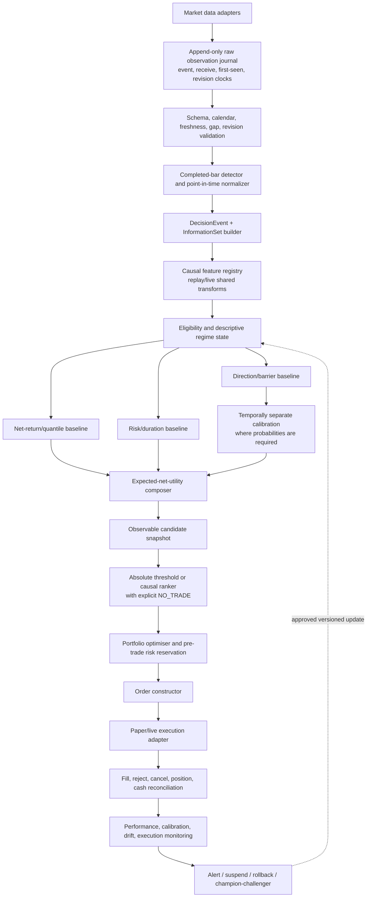

# Trading Prediction System: Diagnosis and Redesign

- **Audit date:** 2026-07-14
- **Repository state inspected:** branch `regression-targets`, commit `3940a023`
- **Decision:** research/shadow only; not ready for live capital
- **Machine-readable evidence:** `docs/validation/trading_prediction_system_audit_evidence_2026-07-14.json`
- **Tracking:** Linear `RIS-263`

## 0. Scope, evidence standard, and limits

This report audits two related but currently distinct systems:

1. **Analyst CUSUM trading path** — an executable, protected-position replay and forward-paper framework with a candidate logistic meta-model.
2. **Regression Path Features (RPF) research path** — a large causal-feature and walk-forward research framework whose active UP/DOWN ranker predicts excursion-derived labels, but does not yet define executable trades or realised PnL.

The requested research reports were read in full and fingerprinted:

| Starting report | SHA-256 | Treatment |
|---|---|---|
| `docs/research/deep-research-report (8).md` | `da7fe06bd42c49da5523f8a48345fba672c8d736df8e6eb003f13b5ddb46ea43` | Starting hypothesis set; recommendations were checked against this repository. Broken or non-verifiable citation placeholders in the report were not accepted as evidence. |
| `docs/research/deep-research-report (9).md` | `177f26a2a0aa4f1a32fe2a458fe848888463b6a0dd7bd88e7a7a51f9346b60cc` | Starting hypothesis set; claims were narrowed where the cited setting did not match this system. |

Evidence labels used below:

- **Confirmed implementation fact** — directly inspected code, configuration, artifact, or persisted runtime state.
- **Measured current evidence** — reproduced or read from a locked machine artifact; descriptive unless the experiment was genuinely untouched.
- **External research** — supported by a linked primary paper or official documentation, but not yet demonstrated on this data.
- **Hypothesis** — a plausible change that still requires the specified causal experiment.

Passing unit tests establishes implementation consistency, not predictive edge. Historical backtests cannot prove future profitability. Financial markets are noisy, adaptive, non-stationary, and costly to trade; the correct outcome of this program may be that the available data contain no stable, economically tradable signal.

## 1. Executive diagnosis

The current system is not failing because one model class was omitted. It is failing because the complete decision chain is not yet optimized and validated as one economic object.

### 1.1 Most likely causes, in priority order

1. **The current primary event geometry is economically weak.** The Analyst label population contains 10,110 TARGET and 35,975 STOP outcomes. Among decisive TARGET/STOP cases, TP-first is only **21.94%**. A gross `+2R/-1R` payoff requires **33.33%** wins before costs; the simple decisive-event expectancy is approximately **-0.342R**. The training artifact has 10,070 economic positives because its positive definition additionally requires positive net return. This is not a complete backtest, but it shows that the ungated population begins far below break-even.

2. **Turnover and costs overwhelm the fast policies.** In the locked 180-day replay, all eight 1-minute and all eight 15-minute selections lost net. The 1-minute median net return was **-95.07%**, with 135,226 fills and 60,218 round trips. Even the one large 1-minute gross winner, CL, had only 0.378 bps of gross break-even cost per changed side versus the configured 2 bps fee-plus-slippage assumption.

3. **The two research objectives are not the deployed economic decision.** The Analyst meta-model predicts TP-first on fresh CUSUM events, while the runtime only invokes it after other entry gates have opened a position. RPF rows use each row's current close but share a later fixed future path and ignore first-touch order. Neither objective directly estimates net utility of a trade entered at the next executable price.

4. **The evidence is pooled and unbalanced.** The Analyst meta data are 95.33% 1-minute rows; only 26 of 56 intended asset/timeframe selections have any rows, and session assets have no training rows at 1 hour or slower. A pooled metric therefore cannot justify “all assets and all timeframes.” RPF has 2,530 features for its BTCUSDT 8h/B benchmark but only 29 in 47 other core asset/root manifests.

5. **Discrimination is modest and calibration/deployment utility are unproven.** Analyst OOF PR-AUC is 0.1988 versus 0.1536 for the causal base-rate predictor; observed prevalence is 0.1547. Brier improvement is only 0.00125 and is negative in 35 of 128 folds. There is no separately calibrated OOF probability ledger, net-PnL policy comparison, or final untouched test for the meta-gated strategy.

6. **The historical information clock is incomplete.** Completed-bar alignment and fold-local transforms are often implemented correctly, but historical canonical OHLCV contain no actual `first_seen_at` or revision history. Session calendars are inferred rather than authoritative. A backtest can reproduce a nominal bar-close scenario, not prove that every historical value was observable in that form at that time.

7. **Execution and portfolio claims exceed the data.** Bar OHLCV can support conservative next-open market-order scenarios. It cannot establish bid/ask spread, queue position, passive fill probability, partial fills, market impact, or intrabar TP-before-SL order. The 56 replay streams are independent normalized ledgers rather than one feasible capital-, margin-, and correlation-constrained portfolio.

8. **The live evidence is not a current test of the candidate.** At audit time the forward service was stopped, the recorded PID was absent, it was running service contract v2 while the repository is v3, and there were zero meta-shadow events. Only BTCUSDT and ETHUSDT were live-quality; six other feeds were delayed.

### 1.2 Bottom-line answers

- **Is there evidence of useful information?** Possibly. Analyst PR-AUC lift and some RPF DOWN precision/lift results justify further controlled experiments.
- **Is there evidence of calibrated event probabilities?** No.
- **Is there evidence of stable net profitability?** No.
- **Is ranking automatically the right solution?** No. It is appropriate only for candidates observable simultaneously. Sequential arrivals need absolute expected-net-value or abstaining meta-label decisions.
- **Should deep models, HMM gates, or a larger feature factory be added now?** No. They would increase research degrees of freedom before the label, clock, execution, and final-holdout contracts are correct.
- **What should be built first?** A common executable event ledger, causal split engine, small invariant feature panel, honest OOF prediction ledger, conservative replay, and explicit no-trade policy.

## 2. Current-system map


### 2.1 Data actually available

- Eight assets across seven configured timeframes produce 56 canonical asset/timeframe selections.
- A read-only scan of all 56 canonical Parquet files found no duplicate/reversed timestamps, null OHLCV, impossible OHLC relationships, nonpositive prices, or negative volume.
- BTCUSDT 1m contains 2,905,164 rows from 2021-01-01 through 2026-07-11 11:23 UTC; ETHUSDT 1m contains 2,800,046 rows from 2021-03-15 through 2026-07-11 11:25 UTC.
- Session assets contain non-minute gaps and synthetic/open-gap-fill minutes. The `futures_session_observed` calendar is inferred from observations, not an authoritative exchange calendar.
- Historical files do not contain bid/ask quotes, trades, book depth, futures contract identity, roll provenance, first-seen time, or revision chronology.

### 2.2 Strengths worth retaining

- Analyst feature availability clocks: `Risk_Yield_Meta_Model_Analyst_0_0_1/trade_ml/features.py:115-242`.
- Completed and gap-safe aggregation: `Risk_Yield_Meta_Model_Analyst_0_0_1/minute_replay.py:431-540,738-910,1278-1373`.
- Explicit fill activation, barrier outcomes, label maturity, and ambiguity: `trade_ml/labeling.py:88-228,462-616` and `trade_ml/shadow.py:1368-1441`.
- Maturity-aware expanding folds: `trade_ml/splits.py:63-153`.
- Fold-local preprocessing/model fit: `trade_ml/model.py:114-310`.
- Immutable artifact and fail-closed gate: `trade_ml/artifact.py:370-479`.
- Completed higher-timeframe close plus backward as-of join: `regression_feature_engineering/core/alignment.py:61-127`.
- Prior-state temporal memory: `regression_feature_engineering/features/temporal_memory_transforms.py:167-211`.
- Fold-local RPF selection/scaling/clipping: `regression_feature_engineering/walkforward/policy.py:49-154`.
- Prequential router state update: `regression_feature_engineering/walkforward/rank_signal_router.py:304-385`.
- Append-only first-seen forward journal. This is the right provenance basis for future shadow evaluation.

### 2.3 Measured evidence snapshot

| Evidence object | Current result | Interpretation |
|---|---|---|
| Analyst candidate artifact `cusum-meta-logistic-all56-20260710-v2` | 65,096 rows; 15.47% positive; candidate-only; `auto_promoted=false`; `deployment_eligible=false`; no eligible selections | It is a research artifact, not a deployed or approved model |
| Analyst OOF evaluation | 64,029 rows, 128 folds; logistic Brier 0.12952, log loss 0.42606, PR-AUC 0.19883; causal-base Brier 0.13077, log loss 0.43081, PR-AUC 0.15362; 35 folds have negative Brier improvement | Some discrimination/ranking information may exist, but calibration and economic utility are weak/unstable and untested end to end |
| Analyst support | 62,058/65,096 rows are 1m; 2,469 are 15m; only 569 are slower; 26/56 intended selections have rows | Pooled metrics cannot support all-asset/all-timeframe claims |
| Locked 180-day replay | 56/56 complete; 18 positive net; 9 pass descriptive checks; median net -4.315%; median annualised Sharpe -1.423; 152,597 fills; 67,735 round trips | The current continuous-position policy is not viable; apparent slower-timeframe winners are inspected hypotheses, not untouched evidence |
| Current forward snapshot | STOPPED at 2026-07-13 23:08:24 UTC; PID absent; service v2 vs repository v3; 618 fills/291 round trips; 282 round trips at 1m; zero meta-shadow events. BTCUSDT/1m gross -0.098%, cost 2.503%, net -2.596%; ETHUSDT/1m gross +0.542%, cost 2.658%, net -2.113% | It neither validates current v3 behavior nor the meta candidate; even the two live-quality 1m feeds were negative after modeled costs |
| RPF direct regression history | Old HTF/helper validation Spearman 0.304 vs RPF-only 0.060 and combined 0.095 | A large feature factory has not demonstrated consistent incremental value |
| RPF binary/ranking history | DOWN binary precision 0.375 vs 0.202 base but ROC-AUC 0.512; four corrected selected runs: UP precision/lift 0.422/1.089, DOWN 0.466/1.214 | Interesting surrogate-label concentration, not realised trading edge |
| RPF regime stability | Strict DOWN specialist precision fell from 0.632 on the latest span to 0.400 and 0.000 on older offsets | Direct evidence of temporal/regime instability and selection risk |
| Targeted contract tests | Analyst 224 passed; RPF 130 passed and 6 skipped | Mechanical contracts pass; tests do not establish economic validity or profitability |

### 2.4 Implementation and artifact inventory

| Pipeline layer | Primary location | Audit status |
|---|---|---|
| Raw-provider registry and canonical materializer | `scripts/feature_engineering/htf_asset_registry.py`; `scripts/feature_engineering/materialize_canonical_ohlcv.py` | Provider-priority/current-revision materialization exists; no historical revision clock |
| Canonical OHLCV | `data/htf_multiasset/{asset}/htf_canonical_ohlcv/{timeframe}/{asset}_{timeframe}_canonical.parquet` plus metadata sidecar | 56 files scanned clean for basic structural/OHLCV invariants; execution fields absent |
| Analyst chart/runtime entry | `Risk_Yield_Meta_Model_Analyst_0_0_1/main.py`; `chart_server.py`; `minute_replay.py` | UI is not the source of the economic failure; replay/live data contracts require the redesign above |
| Analyst labels/features/model | `Risk_Yield_Meta_Model_Analyst_0_0_1/trade_ml/` | Several strong causality/maturity contracts; target and cohort mismatch require correction |
| Analyst artifact | `models/analyst_cusum_meta/cusum-meta-logistic-all56-20260710-v2.artifact.json` and report | Candidate only; not deployment eligible |
| Locked trading replay | `docs/validation/meta_model_analyst_locked_trade_replay_2026-07-12.{md,json}` | Complete descriptive 56-scope matrix; not a newly untouched holdout |
| Forward paper state | `~/.local/state/riskyieldmm/forward_paper/` | Append-only evidence is valuable, but audited service is stopped/version-mismatched and lacks meta events |
| RPF target materialization | `scripts/analysis/materialize_stage1_regression_targets.py`; `regression_feature_engineering/walkforward/classification/targets.py` | Critical executable-target mismatch |
| RPF features/manifests | `regression_feature_engineering/`; `data/htf_multiasset/{asset}/regression_path_features_v1/{root_id}/1m/` | Causal safeguards exist; feature coverage is not invariant across scopes |
| RPF model/ranker/router | `regression_feature_engineering/walkforward/` | Research-only; surrogate precision/lift, no promoted economic policy |
| Historical statistical utilities | `scripts/target_models/validation/statistical_metrics.py` | DSR/PBO names do not match reference procedures; quarantine until corrected |

### 2.5 Data-audit coverage and explicit gaps

The audit is complete enough to diagnose the current promotion decision, but it is **not** a full point-in-time certification of every stored dataset. The distinction is material:

| Layer | Coverage performed | Status / remaining blocker |
|---|---|---|
| Canonical OHLCV | All 56 Parquet files checked for ordering, duplicate timestamps, null OHLCV, OHLC consistency, positive prices, and nonnegative volume; date/row coverage and session gaps inspected | **Completed structural scan.** Still current-revision rather than as-was history; no bid/ask, contract, roll, or first-seen clocks |
| Raw provider datasets | Provider registry/materializer and priority logic inspected | **Incomplete.** No all-file raw-provider distribution, duplicate/revision, unit, or first-seen lineage scan; current sources cannot reconstruct historical publication/revision behavior |
| Analyst feature/event dataset | All persisted training-event outcome/support/OOF summaries inspected; 32 feature artifact inventoried | **Partial certification.** Code clocks pass, but historical values cannot be vintage-certified |
| RPF feature datasets | All 48 current manifests/catalogs inventoried; union contains 2,530 unique features; sampled HTF close audit and active benchmark support inspected | **Incomplete cell-level audit.** Full per-scope missing/range/constant/drift scan of 2.81m x 2,530 benchmark values and all processed batches was not run; live reproduction is absent |
| RPF target datasets | Label code, six root geometries, selected batches, shared-window dependence, and synthetic-row examples inspected | **Partial.** Full per-asset/root target/missing/synthetic/drift distribution remains a Stage-1 correction artifact |
| Historical model/trial outputs | Active reports plus lower-bound artifact inventory inspected | **Partial.** Old periods are development data; not every legacy experiment was re-executed or independently verified |
| Forward journal/service | Status, stream aggregates, incidents, revisions/gaps, feed quality, and selected-stream economics inspected | **Snapshot complete for the audited run, not a valid candidate cohort.** Service stopped/version mismatch; no meta events |
| Execution/portfolio data | Current scenario code/config inspected | **Blocked by unavailable data.** No L1/L2/order events, instrument-complete costs, or shared portfolio ledger |

The machine-readable feature inventory is `docs/validation/trading_prediction_feature_availability_audit_2026-07-14.json`. It covers all 32 Analyst artifact features and the 2,530-feature union across all 48 current RPF manifests, but deliberately sets `strict_point_in_time_certification_complete=false`.

### 2.6 Current prediction and trade contracts

| System/scope | Decision cutoff | Entry/reference | Outcome geometry and horizon | Label-known rule | Economic omissions |
|---|---|---|---|---|---|
| Analyst protected CUSUM meta, all configured assets/timeframes | Historical scenario: selected bar nominal close +5 seconds; live contract requires actual first-seen availability | First real eligible 1m open after configured 1-minute latency; barrier activates only after fill | Risk unit = `2 * max(close * slow_EWMA_vol_pct / 100, prior-only CUSUM residual scale)` when available; stop `-1R`, target `+2R`; timeout after 20 accepted finalized selected-timeframe bars | Terminal TP/SL/timeout/ambiguity observation; historical training adds a 24-hour maturity embargo. Gap-through exits at open; unresolved same-1m-bar TP+SL is AMBIGUOUS with conservative STOP primary | Fixed cross-asset cost scenario; positive binary label loses payoff/MAE/MFE/duration detail |
| Analyst timeout by timeframe | Same as above | Same as above | 1m: 20m; 15m: 5h; 1h: 20h; 4h: 80h; 8h: 160h; 12h: 240h; 1d: 20d. Session closures count zero; only accepted finalized bars advance timeout | At early barrier or final accepted timeout bar | Calendar authority and sparse-session behavior limit slower session-asset evidence |
| RPF 8h/B and 8h/C | Stored row key is 1m bar-open timestamp, although row close/high/low are only available after close; explicit decision timestamp absent | Each row's current close is used as a mathematical reference; no next executable fill exists | Max/mean favorable/adverse excursion over one fixed opposite-family first-half 15m window; 240-minute future horizon; no first-touch ordering | Intended at `label_window_end`, subject to split readiness | No fill, fees, spread, slippage, latency, barrier order, position, or PnL |
| RPF 24h/B and 24h/C | Same ambiguity | Same non-executable current-close reference | Fixed opposite-family first-half window; 720-minute future horizon | Same | Same |
| RPF 7d/B and 7d/C | Same ambiguity | Same non-executable current-close reference | Fixed opposite-family first-half window; 5,040-minute (84-hour) future horizon | Same | Same |

The RPF horizons are prediction-label windows, not current holding periods. They must not be described as tradable horizons until an entry, exit, costs, and first-touch path are defined.

## 3. Current-system audit

| Problem | Location in implementation | Severity | Evidence | Recommended solution | Validation test |
|---|---|---:|---|---|---|
| Primary CUSUM event population is below economic break-even | `trade_ml/labeling.py:192-210`; protected-event artifacts | Critical | 10,110 TARGET vs 35,975 STOP; 21.94% decisive wins vs 33.33% gross break-even for +2R/-1R | Keep CUSUM as a candidate generator, not a standalone trade instruction; estimate net conditional utility and allow abstention | OOF event ledger: net EV and lower block-bootstrap CI by score bucket, asset, timeframe, and regime |
| Fast policy overtrades | `minute_replay.py`; locked replay artifact | Critical | 1m: 0/8 positive net, 60,218 round trips, median net -95.07% | Disable 1m/15m deployment candidacy; add turnover-aware entry persistence, minimum edge-after-cost, cooldown, and trade cap | Identical OOF events under cost/delay grids; must remain positive at conservative and 2x cost |
| Analyst target is an incomplete economic objective | `trade_ml/labeling.py:192-210`; `trade_ml/shadow.py:668-696` | Critical | TARGET is positive only when target-first; positive timeouts, payoff magnitude, MAE/MFE, holding time, and tail loss are collapsed | Persist multiclass barrier result plus realised net return, MAE, MFE, duration, ambiguity, and censoring | Label fixture tests on hand-constructed paths; compare classifier-only versus multi-head expected-utility policy |
| Analyst training and runtime populations differ | Candidate creation `minute_replay.py:989-1061`; gate invocation `:1212-1229`; live eligibility `:2459-2502` | High | Training samples fresh CUSUM starts; runtime scores only after trend/path/CUSUM/volatility gates open a desired position | Define one immutable `DecisionEvent` eligibility predicate and use it for training, replay, and live inference | Historical/live population parity: identical event IDs and features from the same first-seen journal |
| Analyst threshold and probabilities have no independent policy/calibration test | Candidate artifact/report | High | Runtime threshold 0.50 is declared rather than selected from an OOF economic policy; no separate calibrator, top-k/cap comparison, or gated net-PnL ledger | Generate row-level OOF scores, use a later calibration block, then choose threshold/cap/EV policy on a separate block | Frozen later tests of reliability, precision@k, signal availability, turnover, and net EV under identical events |
| Analyst feature panel contains policy constants and omits actionability context | `trade_ml/features.py:17-242`; v2 artifact | High | Nine of 32 features are constant/zero-coefficient; no observed spread/liquidity, time-to-close, cross-timeframe/cross-sectional context, asset/timeframe identity, or portfolio state | Move locked policy constants to metadata; add only causal registered families through incremental ablation | Per-fold constant/missing/drift report and one-family-at-a-time OOS economic ablation |
| RPF label is not an executable trade | `scripts/analysis/materialize_stage1_regression_targets.py:285-353` | Critical | 227 sample rows with different current closes share one later 04:00-08:00 future path; intervening movement/fill absent | Replace with next-executable-entry events and a fixed chronological holding/barrier contract | Hand-built path fixtures plus random sample reconciliation against an independent event-label implementation |
| RPF ignores first-touch ordering | `walkforward/classification/targets.py:24-32` | Critical | Label compares maximum favorable/adverse excursion rather than TP/SL order | Resolve TP/SL chronologically at the finest reliable bar; adverse outcome for same-bar ambiguity | Fixtures for TP-first, SL-first, timeout, gap, and ambiguous bars |
| RPF optimization is disconnected from PnL | `walkforward/rank_signal.py:1527-1560` | Critical | Precision/lift and arbitrary `5*FP + 1*FN`; no fills, costs, positions, or capital | Make executable net utility and portfolio replay the promotion objective; keep predictive metrics as diagnostics | Full OOF decision-policy replay with no-trade/random/simple baselines and portfolio constraints |
| Historical point-in-time provenance is incomplete | Canonical files and Analyst nominal clock | High | No historical first-seen/revision clocks; nominal close+5s assumption | Create append-only raw/normalized observation journal; preserve source, event, receive, available, revision, and ingest clocks | Replay first-seen journal and assert feature hashes match live inference; inject late revisions and prove no history mutation |
| Synthetic/non-tradable rows can be labeled | Target materializer `:285-307`; loaders `walkforward/data.py:240-273`, `classification/data.py:14-43` | High | Valid synthetic rows observed, e.g. EURUSD 8h/B 12,701 and USDJPY 18,186 | Add `eligible_for_decision`; exclude closed-market, gap-fill, stale, synthetic, and invalid-calendar rows before labeling | Property test: zero labels/trades on ineligible rows across all asset/root manifests |
| Decision timestamp is ambiguous | `core/alignment.py:68-73`; RPF data contract | High | Stored key is bar-open time while current OHLC is available only after close | Persist `bar_open_ts`, `bar_close_ts`, `observed_at`, `feature_available_ts`, `decision_ts`, `earliest_entry_ts` | Assert every raw dependency `available_ts <= decision_ts`; current bar cannot be traded at its own open |
| Model-support claims exceed coverage | Analyst artifact; RPF manifests | High | Analyst 95.33% 1m and 26/56 scopes; RPF 2,530 features for BTC benchmark vs 29 for 47 other combinations | Establish a small invariant feature contract; train only scopes meeting predeclared support; pooled model must carry asset/timeframe and hierarchy | Coverage matrix and leave-asset/timeframe-out tests; unsupported scopes fail closed |
| Overlapping/shared labels inflate effective N | RPF fixed future window; Analyst overlapping barriers | High | Hundreds of RPF rows share one future path; row-level counts are not independent | Cluster by event/future interval, purge interval overlap, use concurrency/uniqueness weights and block inference | Report clusters, effective sample size, block-bootstrap CI, and sensitivity after one-event-per-cluster sampling |
| Ranking objective differs from live selection | Ranker groups `rank_signal.py:1014-1055`; live selection `:1119-1140`; diagnostic top-k `:1564-1591` | High | Training ranks a complete batch; live chooses sequential threshold crossings before future batch members exist | Rank only a simultaneous, observable timestamp-level universe; otherwise use absolute expected utility | Replay exact candidate arrival order; compare simultaneous ranker with sequential classifier/regressor on identical information |
| Threshold/calibration does not survive refit cleanly | `classification/runner.py:235-376`; `classification/model.py:206-211` | High | Validation threshold applied to a refit train+validation model; raw CatBoost probabilities; no independent calibrator | Separate train, model-selection, calibration, policy, and test periods; freeze model or use honest cross-fitted scores | Reliability slope/intercept, Brier/log loss, ECE, and policy metrics on later untouched test only |
| Dynamic rank windows bypass readiness contract | Readiness `optimize.py:1077-1148`; trial rebuild `rank_signal.py:1743-1765` | High | Trial windows reset `embargo_batches=0` without rechecking actual label end | Centralize interval-aware splitter and prohibit custom split construction | Mutation test: every attempted overlapping split is rejected across all model paths |
| Historical `PurgedKFold` is not causal walk-forward | `scripts/analysis/models.py:156-187` | High | Training includes observations after the test block | Rename as symmetric research CV and prohibit it from performance/promotion paths; use past-only folds | Split audit asserts `max(train.available_ts,label_known_ts) < min(test.decision_ts)` |
| Multiple research choices contaminate holdouts | `test_output` and prediction-analysis artifact inventory | High | At least 207 summaries, 165 trial tables, and 278 prediction summaries; previously inspected periods are no longer final holdouts | Freeze a new forward holdout, immutable trial ledger, family-wise hypotheses, and multiple-testing correction | Hash the protocol before data accrue; DSR/PBO/Reality Check fixtures; report all attempted variants |
| Legacy DSR/PBO code is not reference-valid | `scripts/target_models/validation/statistical_metrics.py` | High | PBO and “deflated Sharpe” outputs do not implement the cited published statistics as named | Quarantine outputs; rederive against paper examples and independent reference fixtures | Known-answer tests matching published/independently computed DSR and CSCV PBO |
| Execution assumptions are incomplete | `minute_replay.py:175` and replay configuration | Critical for deployment | Deterministic full next-open fill; 1 bp fee + 1 bp slippage, zero spread; no impact/partial fills | Call current result a next-open market scenario; ingest L1/trades and instrument metadata before fill/impact modeling | Cost, delay, gap, fill/miss, and capacity stress grids; reconcile shadow orders to venue observations |
| Streams are not a feasible portfolio | Independent replay/forward ledgers | Critical for deployment | No shared capital, margin, correlation, covariance, or exposure constraints | Separate signal from portfolio layer; one event-driven ledger with pre-trade risk reservation | Simultaneous-signal stress, margin and correlated-loss scenarios, capital reconciliation invariant |
| Current forward run cannot validate the candidate | `~/.local/state/riskyieldmm/forward_paper/status.json` | High | STOPPED; absent PID; v2 runtime vs v3 repository; 0 meta events; 42/56 streams with no completed round trip | Start a new version-locked v3 shadow cohort after protocol/artifact freeze; never mix cohorts | Heartbeat/freshness/version checks; minimum-duration/event gate; live/offline feature and decision parity |
| Data incidents are common enough to affect eligibility | Forward journal/service log | High | 1,465 delayed revisions, 113 source gaps, 720 incidents, 58 fetch failures, 39 rate limits | Freshness/quality state machine, provider redundancy, incident-aware abstention, fail-closed execution | Fault injection for stale/missing/revised bars, rate limits, restarts, duplicate delivery, and clock skew |

## 4. Strict leakage and causality audit

### 4.1 Required information-set contract

For every candidate event `i`, persist this clock tuple:

```text
source_event_ts
bar_open_ts
bar_close_ts
source_publish_ts          # when available
ingested_first_seen_ts
revision_received_ts
feature_available_ts
decision_ts
earliest_entry_ts
label_interval_start_ts
label_interval_end_ts
label_known_ts
```

At prediction time, the only valid raw observation set is:

```text
I(i) = { revision r of observation x |
         r.ingested_first_seen_ts <= i.decision_ts
         and x.bar_close_ts <= i.decision_ts
         and x.passed_quality_checks at i.decision_ts }
```

The event must additionally satisfy:

```text
feature_available_ts <= decision_ts < earliest_entry_ts
every higher-timeframe bar_close_ts <= decision_ts
every peer observation feature_available_ts <= decision_ts
training label_known_ts < evaluation decision_ts after interval purge
```

For historical files lacking first-seen clocks, the report must label results **nominal completed-bar scenarios**, not verified point-in-time replays.

### 4.2 Leakage checklist and current disposition

| Leakage or contamination mode | Current disposition | Evidence and required action |
|---|---|---|
| Direct future-value feature | **No sampled violation found; not globally proven** | Analyst feature clocks are explicit. Three RPF batches/1,315 rows/six HTF close columns and all six BTC roots showed zero future-close violations. Add dependency-level availability assertions for every feature family. |
| Current bar used before completion | **Partial risk** | RPF key is bar-open timestamp while the row includes current OHLC. Introduce explicit close/availability/decision clocks. |
| Partially completed higher-timeframe candle | **Current mechanism passes sampled checks** | RPF converts HTF open to close availability and backward-asof joins. Keep it and test all manifests, boundary times, DST, holidays, and late bars. |
| Forward fill of not-yet-observable data | **Unresolved by metadata** | Every carried value needs `source_available_ts` and `age`; invalidate after a family-specific TTL. Never fill through a closed session as if live. |
| Target encoded in a feature | **Column-name guards exist; semantic audit incomplete** | Manifest blocks target/future/diagnostic names, but semantic lineage must be registered. Add negative-control future columns and assert rejection. |
| Incorrect target/entry alignment | **Confirmed failure in RPF** | Current close is paired with a later shared path without an executable entry. Replace the target contract. |
| Label overlap across folds | **Mechanisms exist but are inconsistent** | Analyst maturity-aware split is good. RPF dynamic rank trials can bypass readiness; centralize interval purge. |
| Insufficient embargo | **Cannot be solved by a fixed guessed row count** | Purge actual label intervals. Use embargo only for declared revision latency, state warm-up, or operational dependency; record its reason and duration. |
| Future rows in training | **Confirmed in legacy splitter** | `PurgedKFold` uses rows after test. Ban it from causal claims. |
| Global scaling/imputation | **Active RPF and Analyst paths largely fold-local** | Preserve pipeline fit within train only; add fit-scope IDs to artifacts and tests using extreme future values. |
| Feature selection before split | **Active paths largely fold-local; materialized feature discovery needs control** | Manifest creation may be global but model selection must not use future target association. Fit redundancy/stability/selection in train only. |
| Hyperparameter tuning on final test | **Research-process contamination likely** | Many reused BTC experiments and inspected offsets mean old holdouts are development data. Freeze a new forward holdout. |
| Calibration on model-fitting data | **No active independent calibration** | Add a later calibration block or cross-fitted calibration; never use final test. |
| Threshold/top-k selected on test | **Not established end-to-end** | Policy selection gets its own chronological block; freeze it before test. |
| Cross-asset aggregation uses future peers | **No direct proof; availability/membership incomplete** | Pair joins use exact timestamps then completed bars, but peer age/missingness is absent. Build timestamp-level observable candidate snapshots. |
| Regime-label leakage | **No blanket leak found; future-derived regimes remain prohibited** | Online CUSUM/EWMA/HMM state must emit the prior filtered state before current update if the decision precedes close, or update only after a completed bar. Never fit descriptive clusters on full history then backfill labels. |
| Target encoding | **Not active in inspected paths** | If categorical target encoding is introduced, make it ordered/prequential or inner-fold OOF only. |
| Rolling window boundary | **Several correct implementations; registry absent** | Require `closed='left'` when decision precedes the current bar, or completed-current-row semantics when decision follows close; encode this per feature. |
| Batch/asset leakage | **Material risk** | Shared future path inflates N; pooled model can learn asset/timeframe prevalence. Group clusters, include scope identifiers, and test leave-scope-out generalization. |
| Production-ineligible rows in training | **Confirmed for RPF synthetic rows; cohort mismatch in Analyst** | One immutable eligibility predicate must run before label generation, training, replay, and live scoring. |
| Revised historical values | **Not auditable historically** | Use append-only first-seen raw journal for all new evaluation and preserve later revisions separately. |
| Survivorship/unavailable markets | **Unresolved** | Current fixed universe does not encode delistings, contract rolls, or availability changes. Persist universe membership and venue status as of decision time. |

### 4.3 Causality conclusion

There is **no evidence of a blanket one-row future leak** in the newer Analyst CUSUM feature path or the sampled RPF completed-HTF alignment. That is an important positive finding. It is not enough to certify the system as leakage-free because:

- historical data vintage is unknown;
- RPF's target/entry clock is economically inconsistent;
- one dynamic split path bypasses label-readiness checks;
- production eligibility is not identical to training eligibility;
- previously inspected test periods are no longer untouched.

The first redesign milestone is therefore a formal `InformationSet`/`DecisionEvent` contract, not another indicator or model.

### 4.4 Every-feature availability inventory

The generated audit artifact `docs/validation/trading_prediction_feature_availability_audit_2026-07-14.json` contains one entry for every unique current model feature:

- 32/32 Analyst artifact features, with raw dependency names, source group, cutoff rule, current-row rule, fit scope, historical-vintage status, live status, and constant-in-v2 flag.
- 2,530/2,530 unique RPF features across 48/48 current manifests, derived from each scope's `feature_catalog.json`, with source columns/timeframes, declared availability, normalisation, target intent, scope membership, cutoff rule, current-row rule, fit scope, and certification status.
- Zero entries are missing the required audit fields.
- Sixteen shared RPF feature names have different normalization declarations between the 29-feature schemas and the 2,530-feature benchmark schema. Their causal metadata agree, but schema transfer must still treat these as versioned variants.

Strict result: **inventory complete; point-in-time certification incomplete; deployment blocked**. Analyst feature construction has explicit input-clock guards, but historical values lack first-seen revision clocks. RPF catalogs declare causal family rules, but the row lacks explicit `feature_available_ts/decision_ts`, no current RPF live implementation exists, and peer/calendar provenance is incomplete. The artifact therefore does not convert engineering declarations into a false leakage-free claim.

## 5. Answers to the primary questions

1. **Why is the system not producing a stable profitable trade set?** The ungated opportunity population has poor payoff geometry, fast turnover is cost-dominated, labels and deployment decisions differ, scope coverage is uneven, and no complete OOF policy-to-portfolio evaluation has shown positive conservative net utility.

2. **Which layer is responsible?** Evidence implicates target construction, cohort definition, decision policy, costs, and evaluation more strongly than model class. Weak and regime-unstable signal also remains likely. Calibration, risk, and execution are incomplete, but improving them cannot create alpha from a negative gross policy.

3. **Are models learning unavailable information?** Some core alignment code is causal, but a complete point-in-time guarantee is impossible from current historical files. RPF's target is not a feature leak; it is a target/action mismatch. The legacy symmetric splitter is unsuitable for live claims.

4. **Can scores rank opportunities even if not calibrated?** Possibly. Analyst PR-AUC and RPF DOWN lift warrant a ranking test. A rank score may be useful without being a probability, but it must be evaluated at `k`, by timestamp-level candidate set, after costs, and without using future batch membership.

5. **What ML problem should be solved?** Start with a combination: eligibility/event generation, direction/barrier classification, conditional net-return and quantile regression, and meta-label abstention. Test learning-to-rank only on simultaneous candidate universes. Survival/time-to-event is useful for censoring and holding time once its event clock is correct; LOB fill survival requires data not currently available.

6. **Does the model have enough information?** Not established. Nine of 32 Analyst features are constant under the locked policy, and liquidity/time/session/cross-timeframe/portfolio context is absent. But adding thousands of features before an executable target would only increase overfitting.

7. **Can it survive realistic costs and execution?** Current fast policies do not survive even the simple cost scenario. Current OHLCV cannot validate passive fills or impact. A viable candidate must pass conservative cost/delay grids and later reconcile against shadow L1/trade observations.

8. **What should be retained, redesigned, or removed?** Retain completed-bar alignment, label maturity, fold-local transforms, artifact integrity, and append-only live provenance. Redesign targets, eligibility, split orchestration, calibration, policy, execution, portfolio, and monitoring. Quarantine non-causal splitter use and unvalidated legacy DSR/PBO; postpone deep/complex models.

## 6. Prediction objective and executable target redesign

### 6.1 One immutable `DecisionEvent`

Every model family must operate on the same persisted event record. A proposed minimal schema is:

```text
event_id                        # content hash of scope, clock, policy, and source vintage
asset_id / venue_id / contract_id / timeframe
primary_signal_id / primary_signal_version
eligibility_policy_version
decision_ts / earliest_entry_ts
information_set_hash / feature_schema_hash
side_candidate                  # LONG, SHORT, or bilateral candidates
entry_order_scenario            # next-open market in OHLCV replay
entry_price / entry_known_ts / fill_state
stop_price / target_price / max_holding_ts
fee / spread / slippage / funding / borrow / roll assumptions
barrier_outcome                 # TP_FIRST, SL_FIRST, TIMEOUT, AMBIGUOUS,
                                # NO_FILL, INELIGIBLE, CANCELLED
gross_return / net_return
mae / mfe / holding_duration / gap_loss
label_interval_start_ts / label_interval_end_ts / label_known_ts
event_cluster_id / concurrency / uniqueness_weight
```

The current fixed CUSUM/rule policy should initially be frozen as the **primary signal generator**. This makes meta-label results interpretable: the meta-model decides whether to take an already specified opportunity rather than changing both event generation and selection simultaneously.

### 6.2 Target bundle rather than one overloaded binary label

Use a small, economically coherent bundle:

| Head | Target | Purpose | Important caveat |
|---|---|---|---|
| Eligibility/fill | `P(executable and valid | I_t)` | Prevent stale, closed-market, or unfillable events | With OHLCV, deterministic next-open eligibility is a scenario, not real fill probability |
| Direction/barrier | Multiclass `TP_FIRST / SL_FIRST / TIMEOUT / AMBIGUOUS` or separate LONG/SHORT heads | Estimate event direction and competing outcomes | Do not silently map all timeout/ambiguous outcomes to the same economic loss |
| Net magnitude | Conditional realised net return or R-multiple | Estimate economic payoff after modeled costs | Train with robust loss; wins and losses are heavy-tailed |
| Distribution | Quantiles such as 0.10, 0.50, 0.90 of net return, MAE, and MFE | Downside, uncertainty, and stop/target design | Quantile crossing and temporal stability must be monitored |
| Timing | Time to TP, SL, timeout, or censoring | Holding-period and capital-use estimate | Competing-risk/survival formulation is useful only after correct clocks/censoring |
| Meta-label | `1` only when a frozen primary event has positive realised utility under the locked execution policy | Abstain from noisy primary signals | Retrain the primary generator separately; otherwise population drift invalidates the label |
| Rank relevance | Graded contemporaneous net utility | Order simultaneous opportunities | Invalid for unseen future batch members or asynchronous rows treated as one list |

### 6.3 Economic decision objective

For candidate `i`, estimate a conservative utility rather than interpreting one score as truth:

```text
expected_net_i = E[gross_return_i | I_t] - E[all_costs_i | I_t]

utility_i = lower_confidence_bound(expected_net_i)
            - lambda_tail * predicted_expected_shortfall_i
            - lambda_uncertainty * epistemic_uncertainty_i
            - lambda_turnover * incremental_turnover_i
            - lambda_concentration * portfolio_concentration_cost_i
```

Trade only when:

```text
eligible
and utility_i > predeclared safety_buffer
and liquidity/freshness/regime constraints pass
and portfolio risk can be reserved
and the candidate survives the causal selection policy
```

Otherwise output **NO_TRADE**. The safety buffer, model-agreement rule, and maximum count are selected on the policy-validation segment and frozen before test. They are not chosen by inspecting test PnL.

### 6.4 Classification, regression, ranking, and survival decision

- **Classification:** established baseline for barrier outcomes and meta-labeling. It is simple, interpretable, and supports calibration, but discards payoff magnitude unless paired with a magnitude head.
- **Regression/quantile regression:** established baseline for net return and downside. It aligns more directly with economic value, but conditional means are noisy and tail-sensitive.
- **Ranking:** conditional challenger. Use it only for a timestamp-level set of simultaneously observable candidates, such as all fresh assets at 12:01 UTC. If candidates arrive sequentially, compare absolute utility to a frozen threshold or use a formally specified online-selection policy.
- **Survival/competing risks:** conditional experiment for time-to-TP/SL/timeout and censored events. Do not build fill-survival models until order/quote data exist.
- **Multi-task:** conditional after individual heads work. Sharing may help sample efficiency, but conflicting gradients and regime shifts can degrade all heads.

## 7. Causal feature specification

### 7.1 Registry contract

Every feature must have machine-readable metadata:

```text
feature_name
family / version / units
raw_dependencies
observation_clock
availability_rule
current_row_policy
lookback_kind and lookback_value
minimum_observations
missingness_semantics / stale_after
fit_required and fit_scope
expected_range / monotonicity if known
live_implementation / replay_implementation
leakage_test_id / parity_tolerance
```

Recommended common wall-clock horizons are `5m, 15m, 1h, 4h, 1d, 5d, 20d`, represented only when enough completed observations exist. For slower native timeframes, use completed-bar equivalents and persist actual elapsed time. Do not silently turn a “20-bar” feature into economically different horizons across 1m and 1d scopes.

### 7.2 Feature families

| Family | Proposed features | Information cutoff | Initial lookbacks | Missing/stale rule | Required causal/leakage test |
|---|---|---|---|---|---|
| Lagged state | Log returns, close-to-close/gap/intrabar returns, volume change, lagged range, indicator state | Completed observations with `available_ts <= decision_ts` | 1, 2, 3, 5 completed bars plus common wall-clock horizons | Preserve missing indicator and age; no backward fill | Inject an extreme future row and assert prior feature hashes unchanged |
| Momentum/trend | Multi-horizon returns, EWMA slope, price/EMA distance, directional consistency, efficiency ratio, acceleration, breakout distance | Completed current bar may be used only when decision follows its observed close | 15m, 1h, 4h, 1d, 5d, 20d | Require minimum coverage; emit age/coverage | Shift decision one bar earlier; features depending on current close must disappear/change as specified |
| Volatility/risk | Realised/downside volatility, Parkinson/Garman-Klass where assumptions fit, range, vol-of-vol, jump score, drawdown, expected move/cost ratio | Completed OHLCV only | 15m, 1h, 4h, 1d, 5d | Do not impute zero volatility; flag illiquid/flat series | Hand-calculated fixtures and no future extrema in rolling windows |
| Volume/liquidity proxy | Lagged volume, dollar/notional volume where units known, volume surprise, zero-volume rate, gap frequency | Completed bar volume; no claim that bar volume equals book liquidity | 15m through 20d | Units must be instrument-specific; missing contract metadata blocks notional features | Cross-asset unit test; shuffled unit metadata must fail validation |
| Instrument/scope | Asset class, venue, contract/tick/multiplier/currency, native timeframe, fee tier, calendar ID; asset/timeframe ID only under a declared pooled/hierarchical model | Versioned metadata effective at decision time | Current contract/scope | Missing critical contract metadata makes the scope ineligible; never forward-fill across a roll | Leave-asset/timeframe-out test and effective-date/roll fixtures; prohibit future universe metadata |
| Spread/cost | Observed L1 spread and depth when available; otherwise explicit configured cost scenario, fee tier, slippage proxy | Latest quote observed before decision; configuration version known before decision | Instantaneous plus 5m/1h distributions | Stale quotes invalidate candidate; configured values are not learned observations | Quote sequence fixtures and replay/live cost reconciliation |
| Cross-timeframe | Completed HTF trend, return, volatility, distance to level/equilibrium, compression/expansion, timeframe alignment/disagreement | HTF `bar_close_ts <= decision_ts`; persist HTF age | Native 15m, 1h, 4h, 8h, 12h, 1d as available | No partial candle; invalidate/age stale bars | Boundary test one microsecond before/after HTF close; DST/session fixtures |
| Cross-sectional | Timestamp-level rank of momentum/volatility/cost/utility; breadth, dispersion, market leader, peer beta/correlation | Only eligible peers whose features are available at the same decision snapshot | Current snapshot; correlations 1d, 5d, 20d | Persist universe membership, peer age, peer count, missing mask | Remove a late peer and prove earlier ranks unchanged; forbid future batch membership |
| Path dependent | Past MFE/MAE, rolling drawdown/recovery, time since high/low, trend/consolidation duration, prior barrier touches, failed breakout count, path efficiency | Historical path ending at completed decision bar | 1h, 4h, 1d, 5d, 20d | Reset at session/contract boundary only by explicit policy | Independent state-machine fixtures; restart/checkpoint parity |
| Regime/change | Online CUSUM, EWMA state, online change probability, filtered HMM probability, volatility/liquidity/correlation state | State fitted/updated causally; use filtered, never smoothed future-aware probabilities | Half-lives mapped to 1h, 4h, 1d, 5d | Unknown/transition is a valid state; do not forward-fill indefinitely | Prefix invariance: full-run output prefix equals output computed on that prefix alone |
| Time/session | Time of day, day of week, session phase, time to verified close, holiday/roll flags | Authoritative calendar known at decision time | Current | Inferred calendar cannot authorize trading; missing calendar fails closed | Venue-calendar fixtures across DST, holidays, early close, roll |
| Prediction history | Previous emitted OOF/live scores, calibration residuals, model disagreement, recent abstention/trade count | Scores/decisions require `emitted_ts < decision_ts`; residuals, realised performance, and outcome-dependent state additionally require the source event's `label_known_ts <= decision_ts`; never use in-sample fitted scores | Last 5/20/100 eligible events and wall-clock ages | Reset on artifact change; persist artifact ID and label-maturity status | Prequential test: current or immature target/performance cannot affect current feature; delay a source label and prove the state is unchanged |
| Trading/portfolio | Current position, reserved risk, gross/net exposure, correlated exposure, turnover budget, drawdown state | Reconciled portfolio state immediately before decision | Current plus 1d/5d risk state | Stale reconciliation suspends orders | Event-order and restart recovery fixtures; no post-fill state before fill acknowledgement |
| Data quality | Source, freshness, missing count, revision rate, synthetic flag, gap length, schema/version | State known at decision | Current plus recent incident rates | Poor quality blocks or downweights only under predeclared rule | Fault injection and fail-closed assertions |

### 7.3 Feature control rather than feature explosion

1. Begin with an invariant 30-80 feature baseline available for every supported scope.
2. Add one family per registered experiment; never combine several new families in the first test.
3. Fit imputation, clipping, scaling, redundancy filters, and supervised selection inside each training fold.
4. Remove constants and near-constants per fold; nine constant Analyst fields should remain policy metadata rather than pretend predictors.
5. Report pairwise/high-dimensional redundancy, permutation importance stability, sign/shape stability, missingness, drift, and incremental OOS ablation.
6. Limit selected complexity by effective independent event count, not raw overlapping row count.
7. Require replay/live feature parity on first-seen data before promotion.

## 8. Target architecture



### 8.1 Simplest credible baseline

The first candidate should be deliberately modest:

1. Frozen CUSUM/rule primary event generator.
2. Explicit next-executable-entry, first-touch, cost-aware event labels.
3. Small invariant causal feature panel.
4. Regularized logistic models for LONG and SHORT barrier/meta outcomes.
5. Robust linear/Elastic Net and quantile regressors for conditional net return and downside.
6. Fold-based Platt or beta calibration only if calibrated probabilities improve later policy data.
7. Expected-net-value threshold plus maximum trade count and no-trade state.
8. Fixed-fractional risk with volatility and portfolio caps.
9. Conservative next-open market scenario in historical replay, followed by version-locked forward shadow.

This baseline is simpler to falsify, inspect, calibrate, and reproduce than one end-to-end deep model.

### 8.2 Modular components: justified versus postponed

| Component | Initial implementation | Justification/status |
|---|---|---|
| Market regime | Causal CUSUM/EWMA and simple volatility/liquidity/correlation descriptors as features | **Established mechanics, conditional trading value.** Do not gate until incremental OOS ablation is positive. |
| Direction | Regularized logistic plus shallow CatBoost challenger, separate LONG/SHORT | **Established baseline.** Compare discrimination and utility, not accuracy alone. |
| Magnitude | Huber/Elastic Net and CatBoost quantile challenger | **Established/conditional.** Directly useful for EV and reward-to-risk. |
| Risk | Quantiles for net return/MAE; simple realised-vol baseline | **Established baseline.** Tail estimates need enough independent events. |
| Meta-label | Frozen primary-event take/skip classifier | **High priority conditional.** Matches the requested CUSUM noise filter once target clocks are fixed. |
| Ranking | Logistic/utility ordering baseline, then CatBoostRanker | **Conditional.** Only for synchronized observable candidates. |
| Uncertainty | Fold/model dispersion, conformal residual bands if exchangeability is tolerable, OOD distance | **Conditional.** Do not treat ensemble disagreement as a calibrated probability. |
| Calibration | Platt and beta first; isotonic only with adequate calibration sample | **Established but dataset-dependent.** Separate by side; pool scopes until support exists. |
| Position sizing | Fixed fractional plus volatility/uncertainty cap | **Established risk baseline.** Edge estimates are not strong enough for Kelly. |
| Execution | Conservative market scenario now; empirical L1/trade cost model later | **Data-limited.** Fill survival/impact cannot be inferred from current bars. |
| HMM/change point | Online filtered state as descriptive feature/challenger | **Experimental for incremental alpha here.** Smoothed or full-sample regimes are prohibited. |
| CNN/TCN/attention/RNN | Postponed | Effective sample size, target validity, and simple baseline edge are not yet sufficient. |
| Reinforcement learning | Postponed | Simulator and execution fidelity are far below what policy-learning claims require. |

CatBoost is the first nonlinear tree challenger because it is already used in this repository. LightGBM or XGBoost should be compared only if there is a concrete runtime, missing-value, monotonicity, or calibration reason; trying all boosting libraries as separate searches would add multiple-testing burden without fixing the target contract.

## 9. Calibration specification

Calibration is a different question from ranking. Preserve this invariant in schemas and UI:

```text
rank_score != event_probability
uncalibrated_model_score != expected_return
```

### 9.1 Procedure

1. Fit the predictive model on training data only.
2. Select model family/hyperparameters on the next validation block.
3. Generate strictly later calibration scores from the frozen selected model or honest cross-fitted refit procedure.
4. Compare uncalibrated, Platt, beta, and—only with adequate sample size—isotonic calibration. Temperature scaling is a challenger only for neural/multiclass logits. Regime-conditioned calibration is tested only after a pooled calibrator has adequate support and a predeclared regime definition.
5. Select the calibrator on calibration loss, not trading-test PnL.
6. Fit the no-trade/EV policy on a later policy block.
7. Freeze model, calibrator, features, and policy before the test block.

Minimum calibration support for a standalone scope is provisionally 1,000 mature events and at least 100 events in each economically important class. Below that, use a predeclared pooled/hierarchical calibrator with asset/timeframe diagnostics or expose a score without probability semantics.

### 9.2 Required reports

- Reliability curve with confidence bands.
- Brier score, log loss, calibration intercept and slope.
- ECE and maximum calibration error with bin definition fixed in advance.
- Adaptive/equal-mass bucket counts and event rates.
- Calibration by LONG/SHORT, asset, timeframe, prediction horizon, regime, liquidity, and calendar period.
- Rolling calibration drift.
- Top-selected-subset calibration after the exact causal filter.
- Before/after class weighting or sampling, with prior correction where necessary.

Probability calibration is required for probability thresholds, probability-times-payoff EV composition, and probability-based sizing. It is not required for direct conditional-net-return regression or merely to sort candidates; those instead require conditional-mean/quantile validation and selected-tail OOS utility tests. Every ranking, regression, and calibration claim still requires later out-of-sample evidence.

## 10. Exact validation and experimental-design specification

### 10.1 Dataset and protocol freeze

Before the next model experiment:

1. Version and hash the raw-source manifest, first-seen rules, calendar, eligibility policy, target/execution policy, feature schema, split manifest, cost grid, metric code, and hypothesis family.
2. Treat every period and asset already inspected in current reports as development data.
3. Begin append-only first-seen collection immediately, but treat data from 2026-07-14 onward as a **quarantine candidate**, not automatically as the final holdout. If anyone inspects its raw future price path, labels, or PnL during development, it becomes development data.
4. After Stage 1 contracts and one candidate artifact are signed, persist `protocol_frozen_at` and define `final_holdout_start_ts` as the first v3 event whose `ingested_first_seen_ts > protocol_frozen_at`. No historical backfill may enter it.
5. Access-control final-holdout raw price paths, labels, PnL, and aggregate performance until the minimum evidence gate is reached. Operational staff may monitor schema, heartbeat, freshness, and incident counts without opening economic outcomes.
6. Record every trial, including failed and interrupted trials, in an append-only ledger with parent hypothesis and code/artifact hashes.

The final holdout must accrue at least:

- **Fast scopes (1m/15m):** 90 calendar days and 500 independent executed-event clusters.
- **Slower scopes:** 12 months and 200 independent executed-event clusters.

These are minimum opening rules, not proof thresholds. If a scope lacks enough events, report **insufficient evidence**; do not pool it silently into an all-timeframe claim.

### 10.2 Historical outer walk-forward folds

Use calendar-time segments with one common boundary manifest across every model family:

```text
expanding training: all eligible history through D-91 days,
                    with at least 365 calendar days of source history
model validation:   D-90 through D-61 inclusive (30 days)
calibration:        D-60 through D-31 inclusive (30 days)
policy selection:   D-30 through D-1 inclusive  (30 days)
outer test:         D through D+29 inclusive     (30 days)
step:               advance D by 30 days
```

The event boundaries use UTC instants, not row numbers. A fold is valid only when training has at least 2,000 independent event clusters and each later segment has at least 100 mature clusters; probability calibration additionally follows the support rule in Section 9. Scopes below support are evaluated with pooled models only if the pooling hypothesis was declared before the fold; otherwise they abstain.

For each boundary:

- Purge a training/earlier-segment event whenever its complete `[earliest_entry_ts, label_known_ts]` interval overlaps the next segment.
- Purge all rows sharing the same future-path/event cluster across a boundary.
- Do not train on any event chronologically after an outer test.
- Apply a one-base-bar operational embargo after a boundary **only** to cover state checkpoint and observation-publication uncertainty. Increase it only from measured source revision SLA or feature-state dependency, with the reason persisted. Embargo does not replace interval purging.
- Use warm-up history for stateful features without treating warm-up labels as eligible training rows.
- Fit imputation, scaling, clipping, redundancy removal, feature selection, dimensionality reduction, sampling, class weights, regime models, calibrators, thresholds, ensembles, and policy parameters inside their assigned past segment only.

Nested tuning should use past-only subfolds inside the training/validation window. If computation prevents nesting, use a small predeclared parameter grid and keep it unchanged for every outer fold.

### 10.3 Honest refit choices

Two valid patterns are allowed:

1. **Frozen-fit:** fit on training, choose on validation, calibrate on calibration, choose policy on policy segment, and test without refitting.
2. **Cross-fitted refit:** generate honest OOF scores for all pre-test data, fit calibrator/policy only on OOF scores, then refit the selected predictive model on all allowed pre-test feature/label rows while keeping schema/hyperparameters fixed.

It is not valid to choose a threshold on one fitted model and apply it to a differently refit model without cross-fitted evidence that the score scale is transferable.

### 10.4 Dependence-aware inference

- Define clusters by overlapping label interval, shared future price path, timestamp candidate snapshot, and asset correlation group.
- Report raw rows, executed trades, unique clusters, average concurrency, and effective sample size.
- Use moving/stationary block bootstrap or cluster bootstrap consistent with the event dependence; do not use IID trade confidence intervals.
- Report mean, median, standard deviation/interquartile range, worst fold, positive-fold fraction, probability of loss, and 90%/95% confidence intervals.
- Break out results by asset, timeframe, LONG/SHORT, regime, liquidity, time of day, calendar period, and signal-count bucket.
- Run leave-one-asset, leave-one-regime, and declared time-period holdouts. A pooled model is not “all asset” robust unless it survives these tests.

## 11. Prioritized modeling experiment matrix

All rows below use identical `DecisionEvent`s, outer folds, costs, and portfolio rules. Only the named factor changes.

| Priority / experiment | Comparison | Primary metrics | Acceptance condition | Abandon or postpone when |
|---|---|---|---|---|
| E0 Controls | No-trade; matched-frequency random; primary CUSUM; simple momentum; mean reversion; volatility-filtered rule; buy-and-hold where economically comparable | Net EV, turnover, drawdown, event count; predictive base rates | Controls reproduce expected null behavior; random labels/trades show no persistent lift | Random/future-shift controls perform well: halt for leakage or metric bugs |
| E1 Executable classification | Constant/base-rate, regularized logistic, shallow CatBoost for TP/SL/timeout and meta take/skip | PR-AUC, ROC-AUC, log loss, Brier, precision/recall@policy, net EV | Repeated later-fold improvement over logistic/base and positive policy utility | Lift disappears after executable labels, costs, or clustering |
| E2 Net-return regression | Mean/median, Elastic Net/Huber, shallow CatBoost; separate LONG/SHORT | Spearman, MAE, R2, top-decile net return, calibration of conditional mean | Stable rank association and positive net utility in selected tail | Scores remain compressed/unstable or selected-tail utility is nonpositive |
| E3 Quantile/risk | Linear quantile vs CatBoost quantiles for net return, MAE, MFE | Pinball loss, interval coverage, tail calibration, realised shortfall | Better downside forecasts improve risk-adjusted OOS utility | Quantiles cross or fail coverage across folds/regimes |
| E4 Combined utility | Classification only vs regression only vs calibrated probability x payoff vs direct net-return utility | Net EV, PF, Sortino, drawdown, tail loss, coverage | Combination improves median and worst-fold economics without concentration | Extra heads add no incremental utility after trial correction |
| E5 Meta-labeling | Frozen CUSUM population: no gate vs logistic gate vs CatBoost gate | Net EV/event, precision at traded subset, abstention, missed-opportunity rate | Lower clustered CI of incremental net EV clears zero | Gate only reduces frequency without improving net EV or misses unstable share of winners |
| E6 Synchronized ranking | Absolute utility threshold vs pairwise/listwise ranker on same timestamp universe | NDCG, MAP, precision@k, Spearman, causal selected-set net utility | Ranker improves selected-set utility on multiple folds and live-realistic arrival replay | Candidate sets are too small/asynchronous or improvement is only full-batch/oracle |
| E7 Regime conditioning | Regime as feature; separate regime models; hard regime gate | Net EV, worst-fold/regime, stability, signal count | Incremental utility survives regime holdout and ablation | Hard gate is fragile, rare-state sample is inadequate, or full-sample regime fit is needed |
| E8 Calibration | Raw vs Platt vs beta vs isotonic with support guard | Brier, log loss, slope/intercept, ECE/MCE, top-subset reliability | Later test calibration improves and EV/sizing decisions benefit | Discrimination is absent, calibration sample inadequate, or isotonic overfits |
| E9 Decision policy | Fixed threshold; threshold+cap; dynamic causal top-k; EV lower bound; utility-constrained selection | Net EV, coverage, zero-signal/overactive batches, turnover, risk usage | Frozen policy clears viability gates and remains stable under sensitivity | Threshold is sharp/unstable or gains depend on one arbitrary cutoff |
| E10 Feature-family ablation | Invariant core plus one of trend, vol, path, HTF, cross-sectional, liquidity, regime, portfolio | Delta in fold metrics, feature stability, drift, compute | Incremental benefit repeats and survives trial correction | Benefit is isolated, unstable, redundant, or unavailable live |
| E11 Model complexity | Linear/shallow trees vs GAM/boosting vs TCN/CNN only after gates | Same predictive and trading metrics plus latency/complexity | Complexity adds repeatable net utility beyond strong simple models | Simple baseline has no edge, effective N is too small, or live parity/latency fails |

### 11.1 Falsification suite

Every candidate must pass:

- Random-label and label-permutation tests within temporal blocks.
- A deliberately future-sourced “poison” feature must be rejected by dependency lineage regardless of whether it happens to be predictive; valid lagged noise/negative controls should show null behavior within uncertainty.
- Timestamp-shift tests must name direction explicitly: `lag_1 = x(t-1)` is potentially causal, while `lead_1 = x(t+1)` is forbidden. Never use ambiguous `+1/-1` notation in an artifact or test report.
- Feature prefix-invariance and historical/live parity.
- Target, barrier, horizon, and intrabar-ambiguity sensitivity.
- Cost at `0.5x, 1x, 2x, 3x` the locked asset-specific conservative scenario.
- Delay at one, two, and five base bars/minutes as appropriate; missed-fill and outage scenarios.
- Threshold/rank-cap neighborhood perturbation, not just the optimum.
- Feature and model ablation.
- Asset, regime, and time holdouts.
- Trade-order Monte Carlo only for capital-path sensitivity, while preserving return dependence blocks.
- Correctly implemented Deflated Sharpe, CSCV PBO, and White Reality Check/SPA where their assumptions and trial family apply. These complement; they do not replace the chronological holdout.

## 12. Metrics and trading evaluation framework

### 12.1 Predictive and ranking metrics

- PR-AUC as the primary rare-event discrimination summary; ROC-AUC as secondary context.
- Precision, recall, F1 only at a frozen policy threshold.
- Precision@k, recall@k, NDCG, MAP, and Spearman only for causal contemporaneous candidate sets.
- MAE, robust R2, Spearman, and pinball loss for magnitude/quantile heads.
- Brier, log loss, slope/intercept, reliability, ECE, and MCE for probabilities.

### 12.2 Signal availability

- Candidates and trades per decision snapshot/day/week.
- Percentage of zero-signal and overactive batches.
- Coverage and abstention rate.
- Missed-high-utility-window rate and recall in the upper realised-utility tail.
- Signal-count dispersion and change versus expected control limits.
- Score/rank margin between selected and rejected candidates.

### 12.3 Trading and portfolio metrics

- Gross and net EV per event/trade, with clustered CI.
- Net return, profit factor, hit rate, payoff ratio, average/median win/loss.
- Sharpe with sampling convention stated; Sortino, Calmar, max drawdown, recovery time.
- Expected shortfall/CVaR, worst gap, tail loss, and drawdown duration.
- Turnover, exposure, leverage, capital utilisation, margin utilisation, and liquidity/capacity usage.
- Asset/timeframe/side/regime contributions and concentration.
- Fee, spread, slippage, funding/borrow/roll, impact, and missed-fill attribution.
- Live-versus-replay slippage and decision disagreement.

### 12.4 Historical candidate viability gate

A scope is only eligible for forward shadow when all of the following hold on predeclared outer tests:

1. At least eight valid outer test folds and the minimum independent event support.
2. Median fold net EV is positive and the one-sided 95% dependence-aware lower confidence bound of aggregate net EV is above zero under the base conservative cost scenario.
3. Net EV remains nonnegative under `2x` cost and one additional base-bar delay; capacity does not exceed the locked participation rule.
4. The candidate beats matched-frequency random, its frozen primary signal, and both simple linear and simple-tree baselines on the same events.
5. No single asset/timeframe contributes more than 35% of total net PnL unless the declared strategy scope is that single asset/timeframe.
6. Results are not driven by one fold, regime, or parameter point; neighboring policy parameters remain economically acceptable.
7. Signal count, turnover, abstention, drawdown, and tail loss stay within the frozen risk mandate.
8. Multiple-testing-adjusted evidence is reported and the final untouched holdout remains unopened.

The 35% concentration and evidence-count gates are proposed governance defaults and must be approved/frozen before testing; they are not estimates learned from current PnL.

### 12.5 Final promotion gate

After historical candidacy, a model remains shadow-only until the forward holdout reaches its minimum duration/count. Promotion then requires:

- all schema, artifact, clock, feature-parity, and reconciliation checks pass;
- positive net EV with the same dependence-aware lower confidence requirement;
- conservative execution cost and delay sensitivity still pass;
- no unresolved severe data/model incidents;
- risk limits and drawdown mandate pass;
- a challenger comparison and independent review reproduce the result;
- the holdout is evaluated once under its frozen protocol.

Failure means reject or return to research with a new future holdout. It never means tune on the failed holdout and call the same period untouched again.

## 13. Realistic backtesting and execution specification

### 13.1 What current OHLCV can support

Current data can support a conservative **next-executable-open market scenario**:

- decision only after a completed, available bar;
- earliest entry at the next eligible 1m open after computation/order latency;
- adverse gap applied to entry and stops;
- chronological 1m barrier resolution for slower strategies;
- if TP and SL occur in one unresolved 1m bar, use the adverse outcome or mark ambiguous and report both bounds;
- full configured fee, spread proxy, adverse slippage, funding/borrow/roll where metadata exist;
- missed trade when the next eligible bar/data are absent;
- no passive limit-fill claims.

### 13.2 What requires new data

L1 quotes/trades are required for empirical spread, quote age, trade direction, short-horizon adverse selection, and a defensible market-order slippage proxy. L2/order events and our own order acknowledgements are required for queue priority, passive fill survival, partial fills, cancel races, and impact. Futures require authoritative contract, multiplier, tick, expiry, roll, and margin data. Crypto requires fee tier and funding; FX requires venue-specific quotes and financing.

Until those exist, the UI/report must say **scenario fill**, not simulated exchange fill.

### 13.3 Cost and execution stress matrix

For each asset and order type, lock a dated cost table and evaluate:

```text
fees:             venue/tier schedule plus adverse tier
spread:           observed L1 distribution when available; otherwise conservative proxy
slippage:         base, 2x, and stressed by volatility/liquidity bucket
latency:          compute + submit + acknowledgement; 1/2/5 bar stress
fill fraction:    100%, empirical, and missed-fill stress only when support exists
participation:    proposed initial cap <= 1% of reliable interval volume
impact:           disabled as “unknown” for tiny shadow size; modeled before capacity claims
funding/borrow:    contract-specific
roll/gap:         explicit contract transition policy
```

The current fixed 1 bp fee + 1 bp adverse slippage + zero spread is one scenario, not an all-instrument truth.

### 13.4 Shared portfolio replay

The event engine must process simultaneous signals in one deterministic sequence:

1. Reconcile cash, positions, pending orders, and realised/unrealised PnL.
2. Expire stale candidates.
3. Score/rank the observable set.
4. Reserve risk/capital before constructing each order.
5. Enforce correlated, asset, venue, gross/net, margin, liquidity, turnover, and loss limits.
6. Apply fills/rejections/partial fills and release unused reservation.
7. Mark positions, stops, funding, rolls, and corporate/contract events.
8. Persist every state transition for replay.

## 14. Decision policy, risk, and position sizing

### 14.1 No-trade policy

The initial policy should be `expected-net-utility threshold + maximum count`, not a mandatory top-k. Top-k alone forces trades when all candidates are bad. A dynamic ranker may order candidates that already clear the absolute utility floor.

Policy inputs may include calibrated barrier probability, expected/quantile net return, uncertainty, cost, liquidity, freshness, regime eligibility, model agreement, rank margin, current exposure, and correlated risk. Every threshold is selected in the policy segment and frozen.

### 14.2 Conservative initial risk mandate

The following are proposed paper-trading defaults, to be approved before evaluation rather than optimized on PnL:

- Risk at stop: at most 0.25% of current equity per new trade.
- Total risk per asset: at most 1.0% of equity.
- Total risk per correlated cluster: at most 2.0%.
- Gross exposure: at most 4x for normalized research only, lower where venue/margin rules require.
- Portfolio annualised volatility target: at most 10%, using a lagged robust covariance estimate and a hard leverage cap.
- Daily loss warning/halt: 1.0%; weekly: 2.5%.
- Drawdown warning at 5.0%, halt at 7.5%, with manual review before reset.
- Turnover and liquidity caps by venue/instrument; size at no more than the locked participation limit.
- No new orders when market data, calendar, model artifact, reconciliation, or risk service is stale/inconsistent.

These limits control damage; they do not make a negative-edge strategy profitable. Final limits must reflect actual capital, venue, contract, and user risk tolerance.

### 14.3 Sizing hierarchy

1. **Baseline:** fixed fractional stop risk.
2. **Challenger:** fixed fractional multiplied by clipped inverse volatility and an uncertainty haircut.
3. **Portfolio layer:** shrink/reject sizes to satisfy shared exposure, covariance, margin, liquidity, and turnover constraints.
4. **Later only:** fractional/risk-constrained Kelly if expected return and outcome probabilities are independently calibrated and stable. Never use unconstrained Kelly.

### 14.4 Position-sizing comparison

| Method | Role in this system | Main advantage | Main risk / decision |
|---|---|---|---|
| Fixed fractional | Production baseline | Transparent maximum loss at the modeled stop | Stop gaps and correlation can exceed nominal risk; retain with portfolio caps |
| Volatility targeting | Risk-normalisation challenger | Reduces exposure when recent risk rises | Volatility forecast error and leverage in calm regimes; not an alpha source |
| Uncertainty-adjusted fixed fractional | Near-term challenger | Haircuts unstable/OOD predictions without relying on precise Kelly estimates | Uncertainty proxy may be miscalibrated; validate by ablation |
| Expected-shortfall-aware sizing | Later risk challenger | Directly constrains predicted downside tail | Tail estimates need far more independent data than central forecasts |
| Risk-parity-style allocation | Portfolio allocation benchmark | Spreads estimated risk across candidates/clusters | Ignores expected edge and is sensitive to covariance; use shrinkage and caps |
| Utility optimisation with turnover/cost penalty | Later portfolio challenger | Aligns candidate value, costs, and shared constraints | Optimisation error can dominate small edges; compare with simple greedy capped policy |
| Fractional/risk-constrained Kelly | Research-only after calibration | Links size to edge while constraining growth/drawdown risk | Catastrophic under edge/probability error; postpone and cap severely |

## 15. Live-system design

### 15.1 Event flow

```text
ingest append-only observations
→ validate schema/source/event/receive clocks
→ detect newly completed bars
→ build point-in-time InformationSet
→ generate causal features and eligibility
→ update filtered regime state
→ infer direction/magnitude/risk scores
→ apply temporally valid calibrator
→ form currently observable candidate snapshot
→ absolute utility/no-trade filter
→ optional within-snapshot rank
→ portfolio/risk reservation
→ order construction and routing mode check
→ acknowledgement/fill/reject reconciliation
→ append decision, feature hash, model hash, and state transition
→ monitor data/model/execution/portfolio health
```

### 15.2 Ranking without a future batch

- Define a short, explicit decision snapshot, for example all candidates whose feature clocks close by the same minute cutoff plus a bounded data-arrival grace period.
- Include only fresh, eligible assets available before cutoff; persist universe size, missing assets, and age.
- Rank that snapshot once. Do not rerank earlier decisions using later arrivals.
- If the trading process cannot wait for a synchronized snapshot, use absolute expected utility for each sequential arrival. An online budget policy may reserve slots, but it must be simulated in exact arrival order and cannot know later candidates.
- Never evaluate a live policy with full-future-batch top-k.

### 15.3 Version and parity rules

- Service, code commit, data contract, calendar, feature schema, model, calibrator, policy, and cost table each have immutable IDs.
- A mismatch fails closed; the stopped v2/v3 state observed in this audit is not a valid candidate test.
- For identical first-seen journal prefixes, replay and live features/scores/decisions must match exactly or within declared floating-point tolerance.
- Paper and live ledgers are append-only and reconciled after restart. Historical backfill is never counted as forward paper evidence.

## 16. Monitoring, drift, retraining, and rollback

### 16.1 Monitoring matrix

Thresholds below are provisional operational gates. Baselines are established from training plus shadow data and frozen per artifact. Confidence-interval rules take precedence over noisy point estimates.

| Area | Monitor | Warning | Automatic suspension / action |
|---|---|---|---|
| Data freshness | `now - latest_available_ts` by source/scope | >2 expected bar intervals or source SLA | >3 intervals for a required input: no new orders in affected scope |
| Schema/version | Column/dtype/unit/calendar/source hashes | Any unrecognized but non-required field | Required hash/version mismatch: fail closed globally or by scope |
| Gaps/revisions | Missing bars, late revisions, duplicates, synthetic rate | Outside 99% training/shadow control band | Unresolved required bar, authoritative-calendar failure, or revision changing a pending decision: suspend scope |
| Feature drift | Robust location/scale, missingness, PSI/KS as diagnostics, OOD distance | Two consecutive windows outside frozen control limits | Severe multi-family OOD plus model instability: abstain and review; do not auto-retrain |
| Score/rank drift | Score distribution, top-tail size, rank concentration, model disagreement | Outside 99% expected band | Collapse/explosion of scores or artifact disagreement: no new orders |
| Calibration | Brier/log loss, slope/intercept, reliability by side/scope | CI excludes training/shadow tolerance or slope outside provisional 0.8-1.2 | Slope outside 0.6-1.4 with adequate events, or severe top-tail overconfidence: disable probability-sized policy; fall back/abstain |
| Predictive value | PR-AUC, precision@k, rank IC/lift on matured events | Lower CI no longer exceeds matched control over two windows | Sustained adjusted lower CI below control: demote challenger; do not infer from one drawdown |
| Signal frequency | Candidates, trades, abstention, zero/overactive snapshots | Outside frozen 99% count band | Overactive rule, duplicate signals, or cap breach: stop new orders |
| Execution | Rejects, misses, fill latency, slippage, spread, adverse selection | Cost quantile above validation base | Realised cost exceeds 2x locked assumption over adequate sample or reconciliation mismatch: suspend affected route |
| Portfolio | Exposure, correlation, margin, liquidity, turnover | 80% of any hard limit | Any hard limit, stale risk state, daily/weekly/DD halt: reject/flatten under approved emergency policy |
| Live vs replay | Feature, score, policy, fill-scenario divergence | Any unexplained decision mismatch | Schema/feature/model mismatch or cash/position reconciliation failure: global fail closed |
| Infrastructure | Heartbeat, queue lag, clock skew, rate limits, provider state | SLA degradation | Missing heartbeat/clock integrity/primary+backup source: suspend relevant scope |

#### 16.1.1 Frozen window and persistence definitions

To make the table implementable, each production manifest must use these initial definitions until a later governance change is evaluated prospectively:

- **Operational windows:** rolling 60 minutes and rolling 24 hours, evaluated every completed base bar. Calendar/session assets additionally use the current completed session. Hard integrity failures—schema/hash mismatch, stale required state, duplicate order ID, risk-limit breach, or cash/position mismatch—suspend immediately and are not subject to statistical persistence.
- **Fast model window (1m/15m):** evaluate after each 100 newly matured independent event clusters using a trailing 500-cluster window. Two “consecutive” windows means two non-overlapping 100-cluster increments both breaching the rule.
- **Slower model window:** evaluate after each 25 newly matured clusters using a trailing 200-cluster window. Probability-calibration decisions still require at least 100 observations in each material outcome class; otherwise report insufficient evidence and retain the prior calibrator/no probability sizing.
- **Control bands:** estimate from outer-test plus version-matched shadow data using the same dependence-aware blocks. “99% band” means a frozen two-sided 99% predictive interval, not the observed min/max.
- **Feature drift:** compute 10-bin training-reference PSI and a dependence-aware two-sample KS diagnostic for registered core features. Warn when PSI >0.20 in at least 10% of core features for two windows. Suspend model-based entries when PSI >0.30 in at least 20% for two windows **and** more than 10% of events exceed the frozen 99.5th-percentile OOD distance. Missingness has its own training 99% band and can suspend immediately when a required feature becomes unavailable.
- **Calibration drift:** with the support above, warn when the 95% CI for slope excludes 0.8-1.2 or Brier/log loss worsens by >10% relative to the frozen shadow baseline in two windows. Disable probability thresholds/sizing when the slope point estimate is outside 0.6-1.4 or top-selected reliability error doubles for two windows; a direct-return score may continue only through its separately validated non-probability policy.
- **Predictive/ranking degradation:** warn when the 90% lower CI of incremental PR-AUC, precision@k/NDCG, or rank correlation versus its matched control is <=0 for two windows. Demote to the champion/no-trade policy when the 95% upper CI is <=0 for two windows. Net PnL is monitored, but drawdown alone is not a retraining trigger.
- **Execution drift:** evaluate after 100 fills for fast scopes or 50 for slow scopes. Warn when median or 90th-percentile all-in cost exceeds the locked base assumption; suspend the route after two windows above 2x base cost, or immediately on reconciliation failure.
- **Signal frequency:** warn after two operational windows outside the frozen 99% predictive interval. A duplicate signal, hard trade-count cap breach, or risk-budget breach suspends immediately.
- **Multiple streams:** apply Benjamini-Hochberg false-discovery-rate control at `q=0.05` within each diagnostic family across active scopes. Hard safety/integrity invariants are never relaxed by multiple-testing adjustment.

These are provisional safety defaults, not findings optimized on recent outcomes. Paper trading must measure their false-alarm and missed-detection rates before live use.

### 16.2 Retraining and recalibration rules

Retraining is justified by evidence of data-generating or input-distribution change, scheduled information accrual, or a predeclared champion-challenger cycle—not merely recent losses.

- **Recalibrate** after the calibration trigger above persists for two non-overlapping windows while the predictive/ranking trigger does not fire; fit only on data available before the recalibration cutoff and run it as a challenger first.
- **Retrain** when predictive value is demoted by the rule above, or when the feature-drift suspension condition persists for two windows and a causal attribution/ablation shows changed feature-target relationships. A scheduled challenger may be trained every 90 days for fast scopes or 180 days for slower scopes only if minimum new mature-event support exists.
- **Do not retrain** after one drawdown, one bad regime, or before labels mature.
- New models run shadow beside the champion, use the same candidate/events, and require the full promotion gate.
- Preserve the last known-good artifact, calibrator, policy, feature schema, and environment for one-command rollback.
- A rollback restores a previously validated version; it never rewrites the append-only journal or hides intervening outcomes.

### 16.3 Model replacement evidence

A challenger replaces the champion only when it:

1. passes mechanical, causal, feature-parity, and stress tests;
2. improves the predeclared primary economic metric with adjusted confidence;
3. does not materially worsen tail loss, drawdown, calibration, turnover, or coverage constraints;
4. repeats across several outer folds and the locked forward shadow period;
5. is reviewed with complete trial and incident history;
6. has an approved rollback artifact and operational runbook.

## 17. Research synthesis and applicability

No cited paper demonstrates profitability of this repository's strategy. The table separates what each source actually supports from what remains our experiment.

| Recommendation | Primary/official source | What the source demonstrates | Limitations and applicability here | Maturity here |
|---|---|---|---|---|
| Start with strong linear/tree baselines; nonlinear ML can capture interactions | Gu, Kelly & Xiu, [Empirical Asset Pricing via Machine Learning](https://www.nber.org/papers/w25398), later *Review of Financial Studies* | In a large US equity characteristic panel, trees and neural networks can improve out-of-sample risk-premium prediction; predictive R2 remains modest | Monthly cross-sectional US equities, not intraday crypto/futures/FX; no proof for our features, labels, costs, or horizon | **Established baseline principle; model benefit conditional** |
| Preserve time order in non-stationary evaluation | Cerqueira et al., [Evaluating time series forecasting models](https://arxiv.org/abs/1905.11744) | Empirically compares time-series evaluation schemes and supports order-aware evaluation under non-stationarity | Forecasting datasets are not our overlapping barrier events; our event-interval purge is an additional implementation requirement | **Established principle** |
| Fit preprocessing only on training data | scikit-learn, [Common pitfalls and recommended practices](https://scikit-learn.org/stable/common_pitfalls.html) | Official examples show leakage caused by inconsistent preprocessing and feature selection outside a pipeline | General ML guidance, not a finance-specific split prescription | **Established implementation rule** |
| Treat temporal leakage as broader than obvious target columns | Kapoor & Narayanan, [Leakage and the Reproducibility Crisis in ML-based Science](https://arxiv.org/abs/2207.07048) | Taxonomy/examples show leakage can invalidate apparently strong ML results | Broad scientific ML; our exact fixes must come from repository clocks and event intervals | **Established audit principle** |
| Represent trade labels as path-dependent events and keep meta-labeling/purging explicit | López de Prado, [Advances in Financial Machine Learning, publisher excerpt](https://catalogimages.wiley.com/images/db/pdf/9781119482086.excerpt.pdf) | The practitioner framework formalizes event-based labels, meta-labeling, sample dependence, and purged/embargoed validation concepts | A book framework, not empirical proof that these labels create alpha; our next-fill, cost, gap, and availability contract is repository-specific and must be tested | **Established industry framework; exact design conditional** |
| Treat TP, SL, and timeout as competing event types when modeling duration | Fine & Gray, [A Proportional Hazards Model for the Subdistribution of a Competing Risk](https://www.tandfonline.com/doi/abs/10.1080/01621459.1999.10474144) | Develops regression/inference for cumulative incidence under competing risks and censoring | Biostatistical setting; market event hazards, non-stationarity, and intrabar ambiguity differ. It supports methodology, not trading profitability | **Established statistics; experimental here** |
| Use dependence-aware resampling rather than IID trade intervals | Politis & Romano, [The Stationary Bootstrap](https://www.tandfonline.com/doi/abs/10.1080/01621459.1994.10476870) | Constructs standard errors/confidence regions for weakly dependent stationary observations using random-length blocks | Regime-changing, overlapping multi-asset trade events may violate stationarity; block/cluster definitions require simulation and sensitivity checks | **Established method; applicability conditional** |
| Test learning-to-rank only on contemporaneous opportunity sets | Poh et al., [Building Cross-Sectional Systematic Strategies by Learning to Rank](https://arxiv.org/abs/2012.07149) | Demonstrates learning-to-rank in a cross-sectional momentum setting | The investable universe is contemporaneous; it does not justify ranking unseen future RPF batch rows or guarantee net edge | **Conditional challenger** |
| Separate calibration from discrimination/ranking | Niculescu-Mizil & Caruana, [Predicting Good Probabilities with Supervised Learning](https://doi.org/10.1145/1102351.1102430) | Shows model classes have characteristic score distortions and compares calibration methods | Mostly IID benchmark setting; temporal separation and regime checks are our requirements | **Established principle; method conditional** |
| Include beta calibration; guard isotonic sample size | Kull, Silva Filho & Flach, [Beta calibration](https://proceedings.mlr.press/v54/kull17a.html) | Beta calibration can correct skewed classifier scores and outperform logistic calibration in tested settings; isotonic can overfit smaller samples | Dataset- and model-dependent; does not establish our probabilities or policy value | **Conditional experiment** |
| Account for transaction costs and turnover before claiming anomalies | Novy-Marx & Velikov, [A Taxonomy of Anomalies and Their Trading Costs](https://www.nber.org/papers/w20721) | Shows trading costs materially change the implementability of many equity anomalies | US equity cost model and horizon differ; our cost table must be instrument-specific | **Established economic requirement** |
| Correct for data snooping/multiple strategies | White, [A Reality Check for Data Snooping](https://onlinelibrary.wiley.com/doi/abs/10.1111/1468-0262.00152); Bailey et al., [Probability of Backtest Overfitting](https://papers.ssrn.com/sol3/papers.cfm?abstract_id=2326253); Bailey & López de Prado, [Deflated Sharpe Ratio](https://papers.ssrn.com/sol3/papers.cfm?abstract_id=2460551) | Provides formal ways to account for selection among many tried strategies and non-normal Sharpe inflation | Assumptions and resampling design matter; none replaces a causal final holdout. Current legacy code does not match the named PBO/DSR procedures | **Required after reference-valid reimplementation** |
| Use CUSUM as online change evidence, not guaranteed alpha | Page, [Continuous Inspection Schemes](https://academic.oup.com/biomet/article-abstract/41/1-2/100/456627) | Establishes cumulative-sum sequential change-detection logic | Quality-control detection theory does not show profitable market timing or define barriers/costs | **Established detector; trading value conditional** |
| Treat Markov regimes as latent-state models, not observed truth | Hamilton, [A New Approach to the Economic Analysis of Nonstationary Time Series and the Business Cycle](https://www.jstor.org/stable/1912559) | Introduces tractable autoregressive regime switching with an unobserved discrete-state Markov process in a macroeconomic application | US business-cycle setting, not intraday trade selection; filtered probabilities are uncertain and smoothed full-sample states are future-aware | **Established model class; trading gate experimental here** |
| Do not assume volatility scaling creates alpha | Cederburg et al., [On the Performance of Volatility-Managed Portfolios](https://www.lehigh.edu/~xuy219/research/COWY.pdf) | Across many equity strategies, volatility-managed portfolios do not show systematic OOS advantage | Equity portfolios and sampling differ; volatility controls can still constrain risk | **Risk-control hypothesis, not alpha** |
| Expected shortfall can enter a constrained risk objective | Rockafellar & Uryasev, [Optimization of Conditional Value-at-Risk](https://sites.math.washington.edu/~rtr/papers/rtr179-CVaR1.pdf) | Gives an optimization formulation for conditional value-at-risk/expected shortfall | Requires a credible loss distribution and does not create predictive edge; our small dependent samples may not estimate tails reliably | **Established risk method; data-support conditional** |
| Never use unconstrained Kelly; constrain drawdown risk | Busseti, Ryu & Boyd, [Risk-Constrained Kelly Gambling](https://web.stanford.edu/~boyd/papers/kelly.html) | Formulates Kelly-style growth with explicit drawdown-risk constraints | Requires trustworthy outcome distributions; ours are not yet independently calibrated | **Postponed, constrained only** |
| Order-flow imbalance can explain short-horizon price changes | Cont, Kukanov & Stoikov, [The Price Impact of Order Book Events](https://arxiv.org/abs/1011.6402) | Links order-flow imbalance and price changes with market-depth dependence in studied order books | Requires order-book event data absent here; bar volume is not a substitute | **Data-gated** |
| Latency and adverse selection matter | Lehalle & Mounjid, [Limit Order Strategic Placement with Adverse Selection Risk and the Role of Latency](https://arxiv.org/abs/1610.00261) | Combines labelled trade evidence and a stochastic-control model to study liquidity imbalance, adverse selection, and erosion of limit-order value by latency | Limit-order placement setting and model assumptions differ; cannot be fitted credibly from OHLCV alone | **Data-gated** |
| Fill timing can be treated as survival when LOB/order data exist | Arroyo et al., [Deep Attentive Survival Analysis in Limit Order Books](https://arxiv.org/abs/2306.05479) | Uses time-varying LOB features and censored order outcomes to estimate limit-order fill-time distributions | Deep LOB setting requires labelled orders and book dynamics; it is not support for an OHLCV fill model | **Experimental and data-gated** |
| Use model governance, validation, monitoring, and effective challenge | Federal Reserve, [Supervisory Guidance on Model Risk Management](https://www.federalreserve.gov/frrs/guidance/supervisory-guidance-on-model-risk-management.htm) | Emphasizes purpose, conceptual soundness, implementation verification, outcomes analysis, governance, and monitoring | Formal supervisory scope is banking organizations; principles are useful, not a regulatory claim about this project | **Established governance principle** |

### 17.1 How the starting reports were modified

- **Accepted:** ranking as a testable option, modular targets, calibration separation, purged chronological validation, realistic costs, no-trade logic, drift monitoring, and stronger risk governance.
- **Narrowed:** ranking applies only to simultaneous candidate sets; survival applies to correctly censored event timing and requires LOB data for fills; regime methods are descriptive until ablation proves utility.
- **Postponed:** deep sequence models, attention, reinforcement learning, complex ensembles, and unconstrained feature growth.
- **Rejected as a specification:** any claim that one architecture is “best,” that a research method transfers automatically, or that high classification accuracy/precision alone implies profitability.
- **Repository-specific hypotheses:** the exact `DecisionEvent` schema, conservative next-open scenario, utility safety buffer, trade cap, monitoring limits, and promotion gates are engineering proposals tailored to observed failures. No external source proves those exact choices; each must be frozen before and tested on later data.

## 18. Implementation roadmap

Each stage is a gate. Later complexity is not a substitute for failure at an earlier stage.

### Stage 1 — Critical corrections

| Item | Specification |
|---|---|
| Required code changes | Add shared `InformationSet`, `DecisionEvent`, and `LabelOutcome` schemas; explicit clock columns; one eligibility predicate; next-executable-entry/first-touch labeler; interval-aware splitter; exclude synthetic/stale/closed rows; quarantine legacy causal claims; immutable protocol/trial manifests |
| Required tests | Clock inequalities, TP/SL/gap/timeout/ambiguity fixtures, interval-overlap rejection, synthetic no-trade property, prefix invariance, current-row/HTF boundary, future-poison rejection, replay/live parity fixtures |
| Expected output | Versioned event ledger and split manifest for every supported scope; data/label audit with cluster counts |
| Acceptance criteria | Zero known clock/eligibility violations; independent label implementations agree on sampled events; every feature dependency has availability metadata |
| Dependencies | Authoritative calendar/contract metadata for session instruments; first-seen journal for future evidence |
| Abandon condition | A scope cannot define an executable entry/exit or reliable calendar from available data: mark unsupported rather than approximate silently |

### Stage 2 — Strong baselines

| Item | Specification |
|---|---|
| Required code changes | Common OOF prediction ledger; no-trade/random/momentum/mean-reversion/vol-filtered controls; regularized logistic, Huber/Elastic Net, shallow CatBoost; shared metric runner |
| Required tests | Deterministic rerun, fold isolation, random-label null, matched-frequency control, artifact round-trip |
| Expected output | Identical-fold baseline comparison with predictive, signal, and gross/net scenario metrics |
| Acceptance criteria | Mechanics pass; at least one simple model shows repeatable incremental gross information and net selected utility before adding complexity |
| Dependencies | Stage 1 event/split contracts |
| Abandon condition | No model or deterministic baseline clears conservative net utility across folds: stop alpha-model expansion and reassess data/market/horizon |

### Stage 3 — Feature redesign

| Item | Specification |
|---|---|
| Required code changes | Feature registry and invariant core panel; causal trend/vol/path/HTF/data-quality features; later liquidity/cross-sectional/portfolio families; per-feature age/missingness |
| Required tests | Prefix invariance, boundary/DST/session checks, future-row perturbation, live parity, unit/scale tests, redundancy/missing/drift reports |
| Expected output | Versioned feature manifest and one-family-at-a-time OOS ablation matrix |
| Acceptance criteria | Added family improves predeclared later-fold metrics repeatedly, is stable enough to operate, and is available across its claimed scope |
| Dependencies | Stage 1 clocks; L1/contract metadata for liquidity/execution families |
| Abandon condition | Incremental benefit vanishes after trial correction or requires unavailable/revised/future information |

### Stage 4 — Model experiments

| Item | Specification |
|---|---|
| Required code changes | Multiclass barrier, net-return/quantile, fixed-primary meta-label, synchronized ranker, descriptive/regime-conditioned challengers; experiment registry |
| Required tests | Identical folds/events, honest refit, arrival-order replay, leave-scope/regime holdout, model/feature ablation |
| Expected output | E1-E11 matrix with mean/median/worst fold, dependence-aware CIs, and trial-adjusted evidence |
| Acceptance criteria | Challenger improves net utility and robustness beyond strong simple baseline without unacceptable complexity/latency |
| Dependencies | Stages 1-3 and adequate independent event support |
| Abandon condition | Improvement is one fold/scope/regime, only oracle full-batch ranking, or not reproducible under neighbor parameters |

### Stage 5 — Calibration

| Item | Specification |
|---|---|
| Required code changes | Temporal Platt/beta/isotonic calibrators; score/probability types; reliability reports; rolling recalibration state |
| Required tests | No train/test reuse, refit scale transfer, prior/class-weight correction, small-sample guard, per-side/top-subset reliability |
| Expected output | Frozen calibrator artifact and reliability dashboard by scope/regime/time |
| Acceptance criteria | Later Brier/log loss and slope/intercept improve without damaging selected-set utility; sufficient support exists |
| Dependencies | Stable discrimination and separate calibration segment |
| Abandon condition | Model has no discrimination, calibrator overfits, or support is insufficient; retain score semantics only |

### Stage 6 — Risk and execution

| Item | Specification |
|---|---|
| Required code changes | One shared portfolio ledger; risk reservation; fixed-fractional/volatility-capped sizing; cost tables; gap/ambiguity/delay/missed-fill scenarios; margin/funding/roll; kill switches |
| Required tests | Simultaneous-signal/correlation/margin stress, cost and delay matrix, outage/reject/partial-fill faults, cash-position reconciliation, restart recovery |
| Expected output | Portfolio-level locked replay and stress report, not 56 independent return streams |
| Acceptance criteria | Candidate satisfies Section 12 gates within approved risk mandate and remains feasible under adverse execution |
| Dependencies | Instrument metadata; L1/trades before empirical fill/cost claims |
| Abandon condition | Gross edge cannot cover conservative cost/capacity assumptions or tail risk breaches mandate |

### Stage 7 — Paper trading

| Item | Specification |
|---|---|
| Required code changes | Restartable v3 append-only shadow service; artifact/version lock; candidate/model shadow events; reconciliation and incident dashboards; champion-challenger |
| Required tests | Cold/warm restart, provider failover/rate limit, stale/revised/missing bars, exact replay parity, no real routing invariant |
| Expected output | New forward-only cohort from the frozen start, with data/decision/order/fill/reconciliation evidence |
| Acceptance criteria | Minimum duration/event count; final shadow gate; zero unresolved integrity incidents; costs and decisions reconcile |
| Dependencies | All prior stages; reliable live sources and calendars |
| Abandon condition | Live features/eligibility diverge from replay, data quality is inadequate, or net evidence fails the frozen gate |

### Stage 8 — Production deployment

| Item | Specification |
|---|---|
| Required code changes | Explicit paper/live routing boundary, least-privilege secrets, approval workflow, order idempotency, risk-service hard stops, rollback/runbook, audit retention |
| Required tests | End-to-end dry run, duplicate/replay orders, network partitions, stale risk state, emergency flatten/cancel policy, recovery point/time, independent review |
| Expected output | Signed release manifest, approved risk mandate, operations runbook, rollback artifact, monitored limited-capital canary |
| Acceptance criteria | Final untouched evidence passes once; operational and risk owners approve; canary stays inside hard limits |
| Dependencies | Successful forward paper gate and execution data fidelity |
| Abandon condition | Any unresolved critical integrity/risk issue or evidence below promotion threshold; remain paper-only |

## 19. Retain, redesign, remove, and postpone

| Retain | Redesign | Quarantine/remove from claims | Postpone |
|---|---|---|---|
| Completed-bar and backward-asof HTF alignment | Executable target/event bundle | RPF shared-window target as a trade label | CNN/TCN/RNN/attention |
| Explicit label maturity/ambiguity | Unified eligibility and clocks | Legacy `PurgedKFold` for live claims | Reinforcement learning |
| Fold-local transforms | One interval-aware split engine | Current legacy DSR/PBO outputs | LOB fill survival until data exist |
| Immutable artifacts/fail-closed behavior | OOF ledger, calibration, and no-trade utility | Full-future-batch rank results as live evidence | Kelly sizing until independent calibration |
| CUSUM/EWMA as causal descriptors | CUSUM meta-label on frozen event population | “All assets/timeframes optimized” claim | Hard HMM/regime gates |
| Append-only first-seen forward journal | Shared portfolio, execution, and monitoring | Independent normalized streams as portfolio proof | Large feature/deep ensembles |

## 20. Final recommendation

### 20.1 Most likely viable architecture

A **modular causal event system** is the most credible path:

```text
frozen primary CUSUM/rule event
→ executable next-entry / first-touch / net-return target bundle
→ small invariant causal feature panel
→ separate direction + magnitude/downside baselines
→ temporal calibration only where needed
→ expected-net-utility meta gate with NO_TRADE
→ optional synchronized cross-asset rank
→ fixed-fractional, volatility/uncertainty-capped shared portfolio
→ conservative execution scenario
→ version-locked forward shadow and monitoring
```

### 20.2 Highest-priority corrections

1. Replace the RPF surrogate label and unify prediction/entry/label clocks.
2. Make training eligibility identical to replay/live eligibility and exclude synthetic/non-tradable rows.
3. Build one event-interval splitter and honest train/validation/calibration/policy/test ledger.
4. Evaluate the Analyst meta candidate as an actual OOF decision policy after costs, not only pooled PR-AUC/Brier.
5. Stop treating 1m/15m current policies as candidates; they are empirically falsified under the locked scenario.
6. Build a shared-capital portfolio replay and instrument-specific cost contract.
7. Start a new v3 forward-only shadow cohort; the stopped v2 run with zero meta events cannot validate the candidate.

### 20.3 Advanced methods to postpone

- Deep sequence/attention models and reinforcement learning.
- HMM or cluster regimes as hard gates.
- General learning-to-rank outside synchronized candidate snapshots.
- Survival-based fill models without order/LOB data.
- Kelly sizing before independent calibration and stable edge.
- Thousands of additional features before invariant-baseline ablations.

### 20.4 Evidence required to claim genuine out-of-sample edge

The project may claim evidence of edge only after:

- the executable event, point-in-time data, eligibility, and costs are frozen;
- all transformations and choices are made inside causal past-only folds;
- improvements repeat across folds/assets/regimes and survive dependence-aware inference and multiple-testing correction;
- conservative net EV clears zero with a positive lower confidence bound and survives cost/delay/capacity stress;
- no simple or matched-frequency benchmark explains the result;
- calibration and ranking claims are made only for the quantities actually validated;
- one newly frozen forward-only holdout passes once, followed by version-identical paper trading;
- shared portfolio, tail risk, data quality, execution, reconciliation, and rollback controls pass.

Even then, the correct wording is **statistically defensible evidence under the tested data, market, execution, and risk assumptions**, not guaranteed profitability. If the executable-label baselines fail, the scientifically correct result is to reject the current signal hypothesis rather than add complexity until a backtest looks good.

## 21. Audit verification

The audit used read-only repository/data/runtime inspection and the following targeted contract suites:

```bash
PYTHONDONTWRITEBYTECODE=1 python -m pytest -q -p no:cacheprovider \
  tests/test_analyst_cusum_indicator.py \
  tests/test_analyst_cusum_meta_training_cli.py \
  tests/test_analyst_forward_paper_event_store.py \
  tests/test_analyst_forward_paper_meta_shadow.py \
  tests/test_analyst_forward_paper_service.py \
  tests/test_analyst_forward_paper_sources.py \
  tests/test_analyst_forward_paper_stream.py \
  tests/test_analyst_forward_paper_supervisor.py \
  tests/test_analyst_minute_replay.py \
  tests/test_analyst_multi_timeframe_context.py \
  tests/test_analyst_online_signals.py \
  tests/test_analyst_trade_ml_foundation.py \
  tests/test_analyst_trade_ml_pipeline.py \
  tests/test_analyst_trade_ml_shadow.py
# 224 passed in 20.57s

pytest -q \
  tests/test_rpf_clean_walkforward.py \
  tests/test_rpf_ranked_signal.py \
  tests/test_rpf_rank_signal_router.py \
  tests/test_stage1_regression_targets.py \
  tests/test_stage1_regression_walkforward.py
# 130 passed, 6 skipped in 1.63s

PYTHONDONTWRITEBYTECODE=1 python \
  scripts/analysis/audit_trading_prediction_feature_availability.py --check
# current; 2,562 unique features inventoried across 48 RPF manifests and the
# Analyst artifact, zero missing audit fields; strict point-in-time certification=false
```

The machine evidence file records the exact report/artifact checksums and measured values needed to reproduce this diagnosis. The repository had pre-existing modified/untracked files; this audit preserved them and does not represent a clean release candidate.
