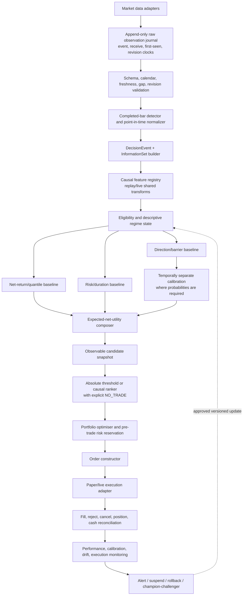

# Trading Prediction System: Diagnosis and Redesign

- **Audit date:** 2026-07-14
- **Repository state inspected:** branch `regression-targets`, commit `3940a023`
- **Decision:** research/shadow only; not ready for live capital
- **Machine-readable evidence:** `docs/validation/trading_prediction_system_audit_evidence_2026-07-14.json`
- **Tracking:** Linear `RIS-263`

## 0. Scope, evidence standard, and limits

This report audits two related but currently distinct systems:

1. **Analyst CUSUM trading path** — an executable, protected-position replay and forward-paper framework with a candidate logistic meta-model.
2. **Regression Path Features (RPF) research path** — a large causal-feature and walk-forward research framework whose active UP/DOWN ranker predicts excursion-derived labels, but does not yet define executable trades or realised PnL.

The requested research reports were read in full and fingerprinted:

| Starting report | SHA-256 | Treatment |
|---|---|---|
| `docs/research/deep-research-report (8).md` | `da7fe06bd42c49da5523f8a48345fba672c8d736df8e6eb003f13b5ddb46ea43` | Starting hypothesis set; recommendations were checked against this repository. Broken or non-verifiable citation placeholders in the report were not accepted as evidence. |
| `docs/research/deep-research-report (9).md` | `177f26a2a0aa4f1a32fe2a458fe848888463b6a0dd7bd88e7a7a51f9346b60cc` | Starting hypothesis set; claims were narrowed where the cited setting did not match this system. |

Evidence labels used below:

- **Confirmed implementation fact** — directly inspected code, configuration, artifact, or persisted runtime state.
- **Measured current evidence** — reproduced or read from a locked machine artifact; descriptive unless the experiment was genuinely untouched.
- **External research** — supported by a linked primary paper or official documentation, but not yet demonstrated on this data.
- **Hypothesis** — a plausible change that still requires the specified causal experiment.

Passing unit tests establishes implementation consistency, not predictive edge. Historical backtests cannot prove future profitability. Financial markets are noisy, adaptive, non-stationary, and costly to trade; the correct outcome of this program may be that the available data contain no stable, economically tradable signal.

## 1. Executive diagnosis

The current system is not failing because one model class was omitted. It is failing because the complete decision chain is not yet optimized and validated as one economic object.

### 1.1 Most likely causes, in priority order

1. **The current primary event geometry is economically weak.** The Analyst label population contains 10,110 TARGET and 35,975 STOP outcomes. Among decisive TARGET/STOP cases, TP-first is only **21.94%**. A gross `+2R/-1R` payoff requires **33.33%** wins before costs; the simple decisive-event expectancy is approximately **-0.342R**. The training artifact has 10,070 economic positives because its positive definition additionally requires positive net return. This is not a complete backtest, but it shows that the ungated population begins far below break-even.

2. **Turnover and costs overwhelm the fast policies.** In the locked 180-day replay, all eight 1-minute and all eight 15-minute selections lost net. The 1-minute median net return was **-95.07%**, with 135,226 fills and 60,218 round trips. Even the one large 1-minute gross winner, CL, had only 0.378 bps of gross break-even cost per changed side versus the configured 2 bps fee-plus-slippage assumption.

3. **The two research objectives are not the deployed economic decision.** The Analyst meta-model predicts TP-first on fresh CUSUM events, while the runtime only invokes it after other entry gates have opened a position. RPF rows use each row's current close but share a later fixed future path and ignore first-touch order. Neither objective directly estimates net utility of a trade entered at the next executable price.

4. **The evidence is pooled and unbalanced.** The Analyst meta data are 95.33% 1-minute rows; only 26 of 56 intended asset/timeframe selections have any rows, and session assets have no training rows at 1 hour or slower. A pooled metric therefore cannot justify “all assets and all timeframes.” RPF has 2,530 features for its BTCUSDT 8h/B benchmark but only 29 in 47 other core asset/root manifests. The legacy 2,530-feature multi-asset RPF surface is therefore retained only as an informative research inventory; it is too heterogeneous, noisy, and scope-specific to become the production model panel without a family-level redesign.

5. **Discrimination is modest and calibration/deployment utility are unproven.** Analyst OOF PR-AUC is 0.1988 versus 0.1536 for the causal base-rate predictor; observed prevalence is 0.1547. Brier improvement is only 0.00125 and is negative in 35 of 128 folds. There is no separately calibrated OOF probability ledger, net-PnL policy comparison, or final untouched test for the meta-gated strategy.

6. **The historical information clock is incomplete.** Completed-bar alignment and fold-local transforms are often implemented correctly, but historical canonical OHLCV contain no actual `first_seen_at` or revision history. Session calendars are inferred rather than authoritative. A backtest can reproduce a nominal bar-close scenario, not prove that every historical value was observable in that form at that time.

7. **Execution and portfolio claims exceed the data.** Bar OHLCV can support conservative next-open market-order scenarios. It cannot establish bid/ask spread, queue position, passive fill probability, partial fills, market impact, or intrabar TP-before-SL order. The 56 replay streams are independent normalized ledgers rather than one feasible capital-, margin-, and correlation-constrained portfolio.

8. **The live evidence is not a current test of the candidate.** At audit time the forward service was stopped, the recorded PID was absent, it was running service contract v2 while the repository is v3, and there were zero meta-shadow events. Only BTCUSDT and ETHUSDT were live-quality; six other feeds were delayed.

### 1.2 Bottom-line answers

- **Is there evidence of useful information?** Possibly. Analyst PR-AUC lift and some RPF DOWN precision/lift results justify further controlled experiments.
- **Is there evidence of calibrated event probabilities?** No.
- **Is there evidence of stable net profitability?** No.
- **Is ranking automatically the right solution?** No. It is appropriate only for candidates observable simultaneously. Sequential arrivals need absolute expected-net-value or abstaining meta-label decisions.
- **Should deep models, HMM gates, or a larger feature factory be added now?** No. They would increase research degrees of freedom before the label, clock, execution, and final-holdout contracts are correct.
- **What should be built first?** A common executable event ledger, causal split engine, small invariant feature panel, honest OOF prediction ledger, conservative replay, and explicit no-trade policy.

## 2. Current-system map


### 2.1 Data actually available

- Eight assets across seven configured timeframes produce 56 canonical asset/timeframe selections.
- A read-only scan of all 56 canonical Parquet files found no duplicate/reversed timestamps, null OHLCV, impossible OHLC relationships, nonpositive prices, or negative volume.
- BTCUSDT 1m contains 2,905,164 rows from 2021-01-01 through 2026-07-11 11:23 UTC; ETHUSDT 1m contains 2,800,046 rows from 2021-03-15 through 2026-07-11 11:25 UTC.
- Session assets contain non-minute gaps and synthetic/open-gap-fill minutes. The `futures_session_observed` calendar is inferred from observations, not an authoritative exchange calendar.
- Historical files do not contain bid/ask quotes, trades, book depth, futures contract identity, roll provenance, first-seen time, or revision chronology.

### 2.2 Strengths worth retaining

- Analyst feature availability clocks: `Risk_Yield_Meta_Model_Analyst_0_0_1/trade_ml/features.py:115-242`.
- Completed and gap-safe aggregation: `Risk_Yield_Meta_Model_Analyst_0_0_1/minute_replay.py:431-540,738-910,1278-1373`.
- Explicit fill activation, barrier outcomes, label maturity, and ambiguity: `trade_ml/labeling.py:88-228,462-616` and `trade_ml/shadow.py:1368-1441`.
- Maturity-aware expanding folds: `trade_ml/splits.py:63-153`.
- Fold-local preprocessing/model fit: `trade_ml/model.py:114-310`.
- Immutable artifact and fail-closed gate: `trade_ml/artifact.py:370-479`.
- Completed higher-timeframe close plus backward as-of join: `regression_feature_engineering/core/alignment.py:61-127`.
- Prior-state temporal memory: `regression_feature_engineering/features/temporal_memory_transforms.py:167-211`.
- Fold-local RPF selection/scaling/clipping: `regression_feature_engineering/walkforward/policy.py:49-154`.
- Prequential router state update: `regression_feature_engineering/walkforward/rank_signal_router.py:304-385`.
- Append-only first-seen forward journal. This is the right provenance basis for future shadow evaluation.

### 2.3 Measured evidence snapshot

| Evidence object | Current result | Interpretation |
|---|---|---|
| Analyst candidate artifact `cusum-meta-logistic-all56-20260710-v2` | 65,096 rows; 15.47% positive; candidate-only; `auto_promoted=false`; `deployment_eligible=false`; no eligible selections | It is a research artifact, not a deployed or approved model |
| Analyst OOF evaluation | 64,029 rows, 128 folds; logistic Brier 0.12952, log loss 0.42606, PR-AUC 0.19883; causal-base Brier 0.13077, log loss 0.43081, PR-AUC 0.15362; 35 folds have negative Brier improvement | Some discrimination/ranking information may exist, but calibration and economic utility are weak/unstable and untested end to end |
| Analyst support | 62,058/65,096 rows are 1m; 2,469 are 15m; only 569 are slower; 26/56 intended selections have rows | Pooled metrics cannot support all-asset/all-timeframe claims |
| Locked 180-day replay | 56/56 complete; 18 positive net; 9 pass descriptive checks; median net -4.315%; median annualised Sharpe -1.423; 152,597 fills; 67,735 round trips | The current continuous-position policy is not viable; apparent slower-timeframe winners are inspected hypotheses, not untouched evidence |
| Current forward snapshot | STOPPED at 2026-07-13 23:08:24 UTC; PID absent; service v2 vs repository v3; 618 fills/291 round trips; 282 round trips at 1m; zero meta-shadow events. BTCUSDT/1m gross -0.098%, cost 2.503%, net -2.596%; ETHUSDT/1m gross +0.542%, cost 2.658%, net -2.113% | It neither validates current v3 behavior nor the meta candidate; even the two live-quality 1m feeds were negative after modeled costs |
| RPF direct regression history | Old HTF/helper validation Spearman 0.304 vs RPF-only 0.060 and combined 0.095 | A large feature factory has not demonstrated consistent incremental value |
| RPF binary/ranking history | DOWN binary precision 0.375 vs 0.202 base but ROC-AUC 0.512; four corrected selected runs: UP precision/lift 0.422/1.089, DOWN 0.466/1.214 | Interesting surrogate-label concentration, not realised trading edge |
| RPF regime stability | Strict DOWN specialist precision fell from 0.632 on the latest span to 0.400 and 0.000 on older offsets | Direct evidence of temporal/regime instability and selection risk |
| Targeted contract tests | Analyst 224 passed; RPF 130 passed and 6 skipped | Mechanical contracts pass; tests do not establish economic validity or profitability |

### 2.4 Implementation and artifact inventory

| Pipeline layer | Primary location | Audit status |
|---|---|---|
| Raw-provider registry and canonical materializer | `scripts/feature_engineering/htf_asset_registry.py`; `scripts/feature_engineering/materialize_canonical_ohlcv.py` | Provider-priority/current-revision materialization exists; no historical revision clock |
| Canonical OHLCV | `data/htf_multiasset/{asset}/htf_canonical_ohlcv/{timeframe}/{asset}_{timeframe}_canonical.parquet` plus metadata sidecar | 56 files scanned clean for basic structural/OHLCV invariants; execution fields absent |
| Analyst chart/runtime entry | `Risk_Yield_Meta_Model_Analyst_0_0_1/main.py`; `chart_server.py`; `minute_replay.py` | UI is not the source of the economic failure; replay/live data contracts require the redesign above |
| Analyst labels/features/model | `Risk_Yield_Meta_Model_Analyst_0_0_1/trade_ml/` | Several strong causality/maturity contracts; target and cohort mismatch require correction |
| Analyst artifact | `models/analyst_cusum_meta/cusum-meta-logistic-all56-20260710-v2.artifact.json` and report | Candidate only; not deployment eligible |
| Locked trading replay | `docs/validation/meta_model_analyst_locked_trade_replay_2026-07-12.{md,json}` | Complete descriptive 56-scope matrix; not a newly untouched holdout |
| Forward paper state | `~/.local/state/riskyieldmm/forward_paper/` | Append-only evidence is valuable, but audited service is stopped/version-mismatched and lacks meta events |
| RPF target materialization | `scripts/analysis/materialize_stage1_regression_targets.py`; `regression_feature_engineering/walkforward/classification/targets.py` | Critical executable-target mismatch |
| RPF features/manifests | `regression_feature_engineering/`; `data/htf_multiasset/{asset}/regression_path_features_v1/{root_id}/1m/` | Causal safeguards exist; feature coverage is not invariant across scopes |
| RPF model/ranker/router | `regression_feature_engineering/walkforward/` | Research-only; surrogate precision/lift, no promoted economic policy |
| Historical statistical utilities | `scripts/target_models/validation/statistical_metrics.py` | DSR/PBO names do not match reference procedures; quarantine until corrected |

### 2.5 Data-audit coverage and explicit gaps

The audit is complete enough to diagnose the current promotion decision, but it is **not** a full point-in-time certification of every stored dataset. The distinction is material:

| Layer | Coverage performed | Status / remaining blocker |
|---|---|---|
| Canonical OHLCV | All 56 Parquet files checked for ordering, duplicate timestamps, null OHLCV, OHLC consistency, positive prices, and nonnegative volume; date/row coverage and session gaps inspected | **Completed structural scan.** Still current-revision rather than as-was history; no bid/ask, contract, roll, or first-seen clocks |
| Raw provider datasets | Provider registry/materializer and priority logic inspected | **Incomplete.** No all-file raw-provider distribution, duplicate/revision, unit, or first-seen lineage scan; current sources cannot reconstruct historical publication/revision behavior |
| Analyst feature/event dataset | All persisted training-event outcome/support/OOF summaries inspected; 32 feature artifact inventoried | **Partial certification.** Code clocks pass, but historical values cannot be vintage-certified |
| RPF feature datasets | All 48 current manifests/catalogs inventoried; union contains 2,530 unique features; sampled HTF close audit and active benchmark support inspected | **Incomplete cell-level audit.** Full per-scope missing/range/constant/drift scan of 2.81m x 2,530 benchmark values and all processed batches was not run; live reproduction is absent |
| RPF target datasets | Label code, six root geometries, selected batches, shared-window dependence, and synthetic-row examples inspected | **Partial.** Full per-asset/root target/missing/synthetic/drift distribution remains a Stage-1 correction artifact |
| Historical model/trial outputs | Active reports plus lower-bound artifact inventory inspected | **Partial.** Old periods are development data; not every legacy experiment was re-executed or independently verified |
| Forward journal/service | Status, stream aggregates, incidents, revisions/gaps, feed quality, and selected-stream economics inspected | **Snapshot complete for the audited run, not a valid candidate cohort.** Service stopped/version mismatch; no meta events |
| Execution/portfolio data | Current scenario code/config inspected | **Blocked by unavailable data.** No L1/L2/order events, instrument-complete costs, or shared portfolio ledger |

The machine-readable feature inventory is `docs/validation/trading_prediction_feature_availability_audit_2026-07-14.json`. It covers all 32 Analyst artifact features and the 2,530-feature union across all 48 current RPF manifests, but deliberately sets `strict_point_in_time_certification_complete=false`.

### 2.6 Current prediction and trade contracts

| System/scope | Decision cutoff | Entry/reference | Outcome geometry and horizon | Label-known rule | Economic omissions |
|---|---|---|---|---|---|
| Analyst protected CUSUM meta, all configured assets/timeframes | Historical scenario: selected bar nominal close +5 seconds; live contract requires actual first-seen availability | First real eligible 1m open after configured 1-minute latency; barrier activates only after fill | Risk unit = `2 * max(close * slow_EWMA_vol_pct / 100, prior-only CUSUM residual scale)` when available; stop `-1R`, target `+2R`; timeout after 20 accepted finalized selected-timeframe bars | Terminal TP/SL/timeout/ambiguity observation; historical training adds a 24-hour maturity embargo. Gap-through exits at open; unresolved same-1m-bar TP+SL is AMBIGUOUS with conservative STOP primary | Fixed cross-asset cost scenario; positive binary label loses payoff/MAE/MFE/duration detail |
| Analyst timeout by timeframe | Same as above | Same as above | 1m: 20m; 15m: 5h; 1h: 20h; 4h: 80h; 8h: 160h; 12h: 240h; 1d: 20d. Session closures count zero; only accepted finalized bars advance timeout | At early barrier or final accepted timeout bar | Calendar authority and sparse-session behavior limit slower session-asset evidence |
| RPF 8h/B and 8h/C | Stored row key is 1m bar-open timestamp, although row close/high/low are only available after close; explicit decision timestamp absent | Each row's current close is used as a mathematical reference; no next executable fill exists | Max/mean favorable/adverse excursion over one fixed opposite-family first-half 15m window; 240-minute future horizon; no first-touch ordering | Intended at `label_window_end`, subject to split readiness | No fill, fees, spread, slippage, latency, barrier order, position, or PnL |
| RPF 24h/B and 24h/C | Same ambiguity | Same non-executable current-close reference | Fixed opposite-family first-half window; 720-minute future horizon | Same | Same |
| RPF 7d/B and 7d/C | Same ambiguity | Same non-executable current-close reference | Fixed opposite-family first-half window; 5,040-minute (84-hour) future horizon | Same | Same |

The RPF horizons are prediction-label windows, not current holding periods. They must not be described as tradable horizons until an entry, exit, costs, and first-touch path are defined.

## 3. Current-system audit

| Problem | Location in implementation | Severity | Evidence | Recommended solution | Validation test |
|---|---|---:|---|---|---|
| Primary CUSUM event population is below economic break-even | `trade_ml/labeling.py:192-210`; protected-event artifacts | Critical | 10,110 TARGET vs 35,975 STOP; 21.94% decisive wins vs 33.33% gross break-even for +2R/-1R | Keep CUSUM as a candidate generator, not a standalone trade instruction; estimate net conditional utility and allow abstention | OOF event ledger: net EV and lower block-bootstrap CI by score bucket, asset, timeframe, and regime |
| Fast policy overtrades | `minute_replay.py`; locked replay artifact | Critical | 1m: 0/8 positive net, 60,218 round trips, median net -95.07% | Disable 1m/15m deployment candidacy; add turnover-aware entry persistence, minimum edge-after-cost, cooldown, and trade cap | Identical OOF events under cost/delay grids; must remain positive at conservative and 2x cost |
| Analyst target is an incomplete economic objective | `trade_ml/labeling.py:192-210`; `trade_ml/shadow.py:668-696` | Critical | TARGET is positive only when target-first; positive timeouts, payoff magnitude, MAE/MFE, holding time, and tail loss are collapsed | Persist multiclass barrier result plus realised net return, MAE, MFE, duration, ambiguity, and censoring | Label fixture tests on hand-constructed paths; compare classifier-only versus multi-head expected-utility policy |
| Analyst training and runtime populations differ | Candidate creation `minute_replay.py:989-1061`; gate invocation `:1212-1229`; live eligibility `:2459-2502` | High | Training samples fresh CUSUM starts; runtime scores only after trend/path/CUSUM/volatility gates open a desired position | Define one immutable `DecisionEvent` eligibility predicate and use it for training, replay, and live inference | Historical/live population parity: identical event IDs and features from the same first-seen journal |
| Analyst threshold and probabilities have no independent policy/calibration test | Candidate artifact/report | High | Runtime threshold 0.50 is declared rather than selected from an OOF economic policy; no separate calibrator, top-k/cap comparison, or gated net-PnL ledger | Generate row-level OOF scores, use a later calibration block, then choose threshold/cap/EV policy on a separate block | Frozen later tests of reliability, precision@k, signal availability, turnover, and net EV under identical events |
| Analyst feature panel contains policy constants and omits actionability context | `trade_ml/features.py:17-242`; v2 artifact | High | Nine of 32 features are constant/zero-coefficient; no observed spread/liquidity, time-to-close, cross-timeframe/cross-sectional context, asset/timeframe identity, or portfolio state | Move locked policy constants to metadata; add only causal registered families through incremental ablation | Per-fold constant/missing/drift report and one-family-at-a-time OOS economic ablation |
| RPF label is not an executable trade | `scripts/analysis/materialize_stage1_regression_targets.py:285-353` | Critical | 227 sample rows with different current closes share one later 04:00-08:00 future path; intervening movement/fill absent | Replace with next-executable-entry events and a fixed chronological holding/barrier contract | Hand-built path fixtures plus random sample reconciliation against an independent event-label implementation |
| RPF ignores first-touch ordering | `walkforward/classification/targets.py:24-32` | Critical | Label compares maximum favorable/adverse excursion rather than TP/SL order | Resolve TP/SL chronologically at the finest reliable bar; adverse outcome for same-bar ambiguity | Fixtures for TP-first, SL-first, timeout, gap, and ambiguous bars |
| RPF optimization is disconnected from PnL | `walkforward/rank_signal.py:1527-1560` | Critical | Precision/lift and arbitrary `5*FP + 1*FN`; no fills, costs, positions, or capital | Make executable net utility and portfolio replay the promotion objective; keep predictive metrics as diagnostics | Full OOF decision-policy replay with no-trade/random/simple baselines and portfolio constraints |
| Legacy RPF feature surface is too large and non-invariant for production | RPF feature catalogs and manifests; 2,530-feature BTCUSDT 8h/B benchmark versus 29-feature core scopes | High | The catalog is informative for discovery, but bulk multi-asset use mixes heterogeneous availability, normalization variants, redundancy, and scope coverage; a large factory has not shown stable incremental OOS value | Do not bulk-migrate the old panel. Preserve its metadata, group features into causal families, and admit only a small invariant core plus later family additions that pass availability, redundancy, stability, and net-utility ablations | Family-by-family causal audit and identical-fold OOS ablation; leave-asset/timeframe-out coverage; reject any family whose benefit is unstable, redundant, or unavailable live |
| Historical point-in-time provenance is incomplete | Canonical files and Analyst nominal clock | High | No historical first-seen/revision clocks; nominal close+5s assumption | Create append-only raw/normalized observation journal; preserve source, event, receive, available, revision, and ingest clocks | Replay first-seen journal and assert feature hashes match live inference; inject late revisions and prove no history mutation |
| Synthetic/non-tradable rows can be labeled | Target materializer `:285-307`; loaders `walkforward/data.py:240-273`, `classification/data.py:14-43` | High | Valid synthetic rows observed, e.g. EURUSD 8h/B 12,701 and USDJPY 18,186 | Add `eligible_for_decision`; exclude closed-market, gap-fill, stale, synthetic, and invalid-calendar rows before labeling | Property test: zero labels/trades on ineligible rows across all asset/root manifests |
| Decision timestamp is ambiguous | `core/alignment.py:68-73`; RPF data contract | High | Stored key is bar-open time while current OHLC is available only after close | Persist `bar_open_ts`, `bar_close_ts`, `observed_at`, `feature_available_ts`, `decision_ts`, `earliest_entry_ts` | Assert every raw dependency `available_ts <= decision_ts`; current bar cannot be traded at its own open |
| Model-support claims exceed coverage | Analyst artifact; RPF manifests | High | Analyst 95.33% 1m and 26/56 scopes; RPF 2,530 features for BTC benchmark vs 29 for 47 other combinations | Establish a small invariant feature contract; train only scopes meeting predeclared support; pooled model must carry asset/timeframe and hierarchy | Coverage matrix and leave-asset/timeframe-out tests; unsupported scopes fail closed |
| Overlapping/shared labels inflate effective N | RPF fixed future window; Analyst overlapping barriers | High | Hundreds of RPF rows share one future path; row-level counts are not independent | Cluster by event/future interval, purge interval overlap, use concurrency/uniqueness weights and block inference | Report clusters, effective sample size, block-bootstrap CI, and sensitivity after one-event-per-cluster sampling |
| Ranking objective differs from live selection | Ranker groups `rank_signal.py:1014-1055`; live selection `:1119-1140`; diagnostic top-k `:1564-1591` | High | Training ranks a complete batch; live chooses sequential threshold crossings before future batch members exist | Rank only a simultaneous, observable timestamp-level universe; otherwise use absolute expected utility | Replay exact candidate arrival order; compare simultaneous ranker with sequential classifier/regressor on identical information |
| Threshold/calibration does not survive refit cleanly | `classification/runner.py:235-376`; `classification/model.py:206-211` | High | Validation threshold applied to a refit train+validation model; raw CatBoost probabilities; no independent calibrator | Separate train, model-selection, calibration, policy, and test periods; freeze model or use honest cross-fitted scores | Reliability slope/intercept, Brier/log loss, ECE, and policy metrics on later untouched test only |
| Dynamic rank windows bypass readiness contract | Readiness `optimize.py:1077-1148`; trial rebuild `rank_signal.py:1743-1765` | High | Trial windows reset `embargo_batches=0` without rechecking actual label end | Centralize interval-aware splitter and prohibit custom split construction | Mutation test: every attempted overlapping split is rejected across all model paths |
| Historical `PurgedKFold` is not causal walk-forward | `scripts/analysis/models.py:156-187` | High | Training includes observations after the test block | Rename as symmetric research CV and prohibit it from performance/promotion paths; use past-only folds | Split audit asserts `max(train.available_ts,label_known_ts) < min(test.decision_ts)` |
| Multiple research choices contaminate holdouts | `test_output` and prediction-analysis artifact inventory | High | At least 207 summaries, 165 trial tables, and 278 prediction summaries; previously inspected periods are no longer final holdouts | Freeze a new forward holdout, immutable trial ledger, family-wise hypotheses, and multiple-testing correction | Hash the protocol before data accrue; DSR/PBO/Reality Check fixtures; report all attempted variants |
| Legacy DSR/PBO code is not reference-valid | `scripts/target_models/validation/statistical_metrics.py` | High | PBO and “deflated Sharpe” outputs do not implement the cited published statistics as named | Quarantine outputs; rederive against paper examples and independent reference fixtures | Known-answer tests matching published/independently computed DSR and CSCV PBO |
| Execution assumptions are incomplete | `minute_replay.py:175` and replay configuration | Critical for deployment | Deterministic full next-open fill; 1 bp fee + 1 bp slippage, zero spread; no impact/partial fills | Call current result a next-open market scenario; ingest L1/trades and instrument metadata before fill/impact modeling | Cost, delay, gap, fill/miss, and capacity stress grids; reconcile shadow orders to venue observations |
| Streams are not a feasible portfolio | Independent replay/forward ledgers | Critical for deployment | No shared capital, margin, correlation, covariance, or exposure constraints | Separate signal from portfolio layer; one event-driven ledger with pre-trade risk reservation | Simultaneous-signal stress, margin and correlated-loss scenarios, capital reconciliation invariant |
| Current forward run cannot validate the candidate | `~/.local/state/riskyieldmm/forward_paper/status.json` | High | STOPPED; absent PID; v2 runtime vs v3 repository; 0 meta events; 42/56 streams with no completed round trip | Start a new version-locked v3 shadow cohort after protocol/artifact freeze; never mix cohorts | Heartbeat/freshness/version checks; minimum-duration/event gate; live/offline feature and decision parity |
| Data incidents are common enough to affect eligibility | Forward journal/service log | High | 1,465 delayed revisions, 113 source gaps, 720 incidents, 58 fetch failures, 39 rate limits | Freshness/quality state machine, provider redundancy, incident-aware abstention, fail-closed execution | Fault injection for stale/missing/revised bars, rate limits, restarts, duplicate delivery, and clock skew |

## 4. Strict leakage and causality audit

### 4.1 Required information-set contract

For every candidate event `i`, persist this clock tuple:

```text
source_event_ts
bar_open_ts
bar_close_ts
source_publish_ts          # when available
ingested_first_seen_ts
revision_received_ts
feature_available_ts
decision_ts
earliest_entry_ts
label_interval_start_ts
label_interval_end_ts
label_known_ts
```

At prediction time, the only valid raw observation set is:

```text
I(i) = { revision r of observation x |
         r.ingested_first_seen_ts <= i.decision_ts
         and x.bar_close_ts <= i.decision_ts
         and x.passed_quality_checks at i.decision_ts }
```

The event must additionally satisfy:

```text
feature_available_ts <= decision_ts < earliest_entry_ts
every higher-timeframe bar_close_ts <= decision_ts
every peer observation feature_available_ts <= decision_ts
training label_known_ts < evaluation decision_ts after interval purge
```

For historical files lacking first-seen clocks, the report must label results **nominal completed-bar scenarios**, not verified point-in-time replays.

### 4.2 Leakage checklist and current disposition

| Leakage or contamination mode | Current disposition | Evidence and required action |
|---|---|---|
| Direct future-value feature | **No sampled violation found; not globally proven** | Analyst feature clocks are explicit. Three RPF batches/1,315 rows/six HTF close columns and all six BTC roots showed zero future-close violations. Add dependency-level availability assertions for every feature family. |
| Current bar used before completion | **Partial risk** | RPF key is bar-open timestamp while the row includes current OHLC. Introduce explicit close/availability/decision clocks. |
| Partially completed higher-timeframe candle | **Current mechanism passes sampled checks** | RPF converts HTF open to close availability and backward-asof joins. Keep it and test all manifests, boundary times, DST, holidays, and late bars. |
| Forward fill of not-yet-observable data | **Unresolved by metadata** | Every carried value needs `source_available_ts` and `age`; invalidate after a family-specific TTL. Never fill through a closed session as if live. |
| Target encoded in a feature | **Column-name guards exist; semantic audit incomplete** | Manifest blocks target/future/diagnostic names, but semantic lineage must be registered. Add negative-control future columns and assert rejection. |
| Incorrect target/entry alignment | **Confirmed failure in RPF** | Current close is paired with a later shared path without an executable entry. Replace the target contract. |
| Label overlap across folds | **Mechanisms exist but are inconsistent** | Analyst maturity-aware split is good. RPF dynamic rank trials can bypass readiness; centralize interval purge. |
| Insufficient embargo | **Cannot be solved by a fixed guessed row count** | Purge actual label intervals. Use embargo only for declared revision latency, state warm-up, or operational dependency; record its reason and duration. |
| Future rows in training | **Confirmed in legacy splitter** | `PurgedKFold` uses rows after test. Ban it from causal claims. |
| Global scaling/imputation | **Active RPF and Analyst paths largely fold-local** | Preserve pipeline fit within train only; add fit-scope IDs to artifacts and tests using extreme future values. |
| Feature selection before split | **Active paths largely fold-local; materialized feature discovery needs control** | Manifest creation may be global but model selection must not use future target association. Fit redundancy/stability/selection in train only. |
| Hyperparameter tuning on final test | **Research-process contamination likely** | Many reused BTC experiments and inspected offsets mean old holdouts are development data. Freeze a new forward holdout. |
| Calibration on model-fitting data | **No active independent calibration** | Add a later calibration block or cross-fitted calibration; never use final test. |
| Threshold/top-k selected on test | **Not established end-to-end** | Policy selection gets its own chronological block; freeze it before test. |
| Cross-asset aggregation uses future peers | **No direct proof; availability/membership incomplete** | Pair joins use exact timestamps then completed bars, but peer age/missingness is absent. Build timestamp-level observable candidate snapshots. |
| Regime-label leakage | **No blanket leak found; future-derived regimes remain prohibited** | Online CUSUM/EWMA/HMM state must emit the prior filtered state before current update if the decision precedes close, or update only after a completed bar. Never fit descriptive clusters on full history then backfill labels. |
| Target encoding | **Not active in inspected paths** | If categorical target encoding is introduced, make it ordered/prequential or inner-fold OOF only. |
| Rolling window boundary | **Several correct implementations; registry absent** | Require `closed='left'` when decision precedes the current bar, or completed-current-row semantics when decision follows close; encode this per feature. |
| Batch/asset leakage | **Material risk** | Shared future path inflates N; pooled model can learn asset/timeframe prevalence. Group clusters, include scope identifiers, and test leave-scope-out generalization. |
| Production-ineligible rows in training | **Confirmed for RPF synthetic rows; cohort mismatch in Analyst** | One immutable eligibility predicate must run before label generation, training, replay, and live scoring. |
| Revised historical values | **Not auditable historically** | Use append-only first-seen raw journal for all new evaluation and preserve later revisions separately. |
| Survivorship/unavailable markets | **Unresolved** | Current fixed universe does not encode delistings, contract rolls, or availability changes. Persist universe membership and venue status as of decision time. |

### 4.3 Causality conclusion

There is **no evidence of a blanket one-row future leak** in the newer Analyst CUSUM feature path or the sampled RPF completed-HTF alignment. That is an important positive finding. It is not enough to certify the system as leakage-free because:

- historical data vintage is unknown;
- RPF's target/entry clock is economically inconsistent;
- one dynamic split path bypasses label-readiness checks;
- production eligibility is not identical to training eligibility;
- previously inspected test periods are no longer untouched.

The first redesign milestone is therefore a formal `InformationSet`/`DecisionEvent` contract, not another indicator or model.

### 4.4 Every-feature availability inventory

The generated audit artifact `docs/validation/trading_prediction_feature_availability_audit_2026-07-14.json` contains one entry for every unique current model feature:

- 32/32 Analyst artifact features, with raw dependency names, source group, cutoff rule, current-row rule, fit scope, historical-vintage status, live status, and constant-in-v2 flag.
- 2,530/2,530 unique RPF features across 48/48 current manifests, derived from each scope's `feature_catalog.json`, with source columns/timeframes, declared availability, normalisation, target intent, scope membership, cutoff rule, current-row rule, fit scope, and certification status.
- Zero entries are missing the required audit fields.
- Sixteen shared RPF feature names have different normalization declarations between the 29-feature schemas and the 2,530-feature benchmark schema. Their causal metadata agree, but schema transfer must still treat these as versioned variants.

Strict result: **inventory complete; point-in-time certification incomplete; deployment blocked**. Analyst feature construction has explicit input-clock guards, but historical values lack first-seen revision clocks. RPF catalogs declare causal family rules, but the row lacks explicit `feature_available_ts/decision_ts`, no current RPF live implementation exists, and peer/calendar provenance is incomplete. The artifact therefore does not convert engineering declarations into a false leakage-free claim.

## 5. Answers to the primary questions

1. **Why is the system not producing a stable profitable trade set?** The ungated opportunity population has poor payoff geometry, fast turnover is cost-dominated, labels and deployment decisions differ, scope coverage is uneven, and no complete OOF policy-to-portfolio evaluation has shown positive conservative net utility.

2. **Which layer is responsible?** Evidence implicates target construction, cohort definition, decision policy, costs, and evaluation more strongly than model class. Weak and regime-unstable signal also remains likely. Calibration, risk, and execution are incomplete, but improving them cannot create alpha from a negative gross policy.

3. **Are models learning unavailable information?** Some core alignment code is causal, but a complete point-in-time guarantee is impossible from current historical files. RPF's target is not a feature leak; it is a target/action mismatch. The legacy symmetric splitter is unsuitable for live claims.

4. **Can scores rank opportunities even if not calibrated?** Possibly. Analyst PR-AUC and RPF DOWN lift warrant a ranking test. A rank score may be useful without being a probability, but it must be evaluated at `k`, by timestamp-level candidate set, after costs, and without using future batch membership.

5. **What ML problem should be solved?** Start with a combination: eligibility/event generation, direction/barrier classification, conditional net-return and quantile regression, and meta-label abstention. Test learning-to-rank only on simultaneous candidate universes. Survival/time-to-event is useful for censoring and holding time once its event clock is correct; LOB fill survival requires data not currently available.

6. **Does the model have enough information?** Not established. Nine of 32 Analyst features are constant under the locked policy, and liquidity/time/session/cross-timeframe/portfolio context is absent. But adding thousands of features before an executable target would only increase overfitting.

7. **Can it survive realistic costs and execution?** Current fast policies do not survive even the simple cost scenario. Current OHLCV cannot validate passive fills or impact. A viable candidate must pass conservative cost/delay grids and later reconcile against shadow L1/trade observations.

8. **What should be retained, redesigned, or removed?** Retain completed-bar alignment, label maturity, fold-local transforms, artifact integrity, and append-only live provenance. Redesign targets, eligibility, split orchestration, calibration, policy, execution, portfolio, and monitoring. Quarantine non-causal splitter use and unvalidated legacy DSR/PBO; postpone deep/complex models.

## 6. Prediction objective and executable target redesign

### 6.1 One immutable `DecisionEvent`

Every model family must operate on the same persisted event record. A proposed minimal schema is:

```text
event_id                        # content hash of scope, clock, policy, and source vintage
asset_id / venue_id / contract_id / timeframe
primary_signal_id / primary_signal_version
eligibility_policy_version
decision_ts / earliest_entry_ts
information_set_hash / feature_schema_hash
side_candidate                  # LONG, SHORT, or bilateral candidates
entry_order_scenario            # next-open market in OHLCV replay
entry_price / entry_known_ts / fill_state
stop_price / target_price / max_holding_ts
fee / spread / slippage / funding / borrow / roll assumptions
barrier_outcome                 # TP_FIRST, SL_FIRST, TIMEOUT, AMBIGUOUS,
                                # NO_FILL, INELIGIBLE, CANCELLED
gross_return / net_return
mae / mfe / holding_duration / gap_loss
label_interval_start_ts / label_interval_end_ts / label_known_ts
event_cluster_id / concurrency / uniqueness_weight
```

The current fixed CUSUM/rule policy should initially be frozen as the **primary signal generator**. This makes meta-label results interpretable: the meta-model decides whether to take an already specified opportunity rather than changing both event generation and selection simultaneously.

### 6.2 Target bundle rather than one overloaded binary label

Use a small, economically coherent bundle:

| Head | Target | Purpose | Important caveat |
|---|---|---|---|
| Eligibility/fill | `P(executable and valid | I_t)` | Prevent stale, closed-market, or unfillable events | With OHLCV, deterministic next-open eligibility is a scenario, not real fill probability |
| Direction/barrier | Multiclass `TP_FIRST / SL_FIRST / TIMEOUT / AMBIGUOUS` or separate LONG/SHORT heads | Estimate event direction and competing outcomes | Do not silently map all timeout/ambiguous outcomes to the same economic loss |
| Net magnitude | Conditional realised net return or R-multiple | Estimate economic payoff after modeled costs | Train with robust loss; wins and losses are heavy-tailed |
| Distribution | Quantiles such as 0.10, 0.50, 0.90 of net return, MAE, and MFE | Downside, uncertainty, and stop/target design | Quantile crossing and temporal stability must be monitored |
| Timing | Time to TP, SL, timeout, or censoring | Holding-period and capital-use estimate | Competing-risk/survival formulation is useful only after correct clocks/censoring |
| Meta-label | `1` only when a frozen primary event has positive realised utility under the locked execution policy | Abstain from noisy primary signals | Retrain the primary generator separately; otherwise population drift invalidates the label |
| Rank relevance | Graded contemporaneous net utility | Order simultaneous opportunities | Invalid for unseen future batch members or asynchronous rows treated as one list |

### 6.3 Economic decision objective

For candidate `i`, estimate a conservative utility rather than interpreting one score as truth:

```text
expected_net_i = E[gross_return_i | I_t] - E[all_costs_i | I_t]

utility_i = lower_confidence_bound(expected_net_i)
            - lambda_tail * predicted_expected_shortfall_i
            - lambda_uncertainty * epistemic_uncertainty_i
            - lambda_turnover * incremental_turnover_i
            - lambda_concentration * portfolio_concentration_cost_i
```

Trade only when:

```text
eligible
and utility_i > predeclared safety_buffer
and liquidity/freshness/regime constraints pass
and portfolio risk can be reserved
and the candidate survives the causal selection policy
```

Otherwise output **NO_TRADE**. The safety buffer, model-agreement rule, and maximum count are selected on the policy-validation segment and frozen before test. They are not chosen by inspecting test PnL.

### 6.4 Classification, regression, ranking, and survival decision

- **Classification:** established baseline for barrier outcomes and meta-labeling. It is simple, interpretable, and supports calibration, but discards payoff magnitude unless paired with a magnitude head.
- **Regression/quantile regression:** established baseline for net return and downside. It aligns more directly with economic value, but conditional means are noisy and tail-sensitive.
- **Ranking:** conditional challenger. Use it only for a timestamp-level set of simultaneously observable candidates, such as all fresh assets at 12:01 UTC. If candidates arrive sequentially, compare absolute utility to a frozen threshold or use a formally specified online-selection policy.
- **Survival/competing risks:** conditional experiment for time-to-TP/SL/timeout and censored events. Do not build fill-survival models until order/quote data exist.
- **Multi-task:** conditional after individual heads work. Sharing may help sample efficiency, but conflicting gradients and regime shifts can degrade all heads.

## 7. Causal feature specification

### 7.1 Registry contract

Every feature must have machine-readable metadata:

```text
feature_name
family / version / units
raw_dependencies
observation_clock
availability_rule
current_row_policy
lookback_kind and lookback_value
minimum_observations
missingness_semantics / stale_after
fit_required and fit_scope
expected_range / monotonicity if known
live_implementation / replay_implementation
leakage_test_id / parity_tolerance
```

Recommended common wall-clock horizons are `5m, 15m, 1h, 4h, 1d, 5d, 20d`, represented only when enough completed observations exist. For slower native timeframes, use completed-bar equivalents and persist actual elapsed time. Do not silently turn a “20-bar” feature into economically different horizons across 1m and 1d scopes.

### 7.2 Feature families

| Family | Proposed features | Information cutoff | Initial lookbacks | Missing/stale rule | Required causal/leakage test |
|---|---|---|---|---|---|
| Lagged state | Log returns, close-to-close/gap/intrabar returns, volume change, lagged range, indicator state | Completed observations with `available_ts <= decision_ts` | 1, 2, 3, 5 completed bars plus common wall-clock horizons | Preserve missing indicator and age; no backward fill | Inject an extreme future row and assert prior feature hashes unchanged |
| Momentum/trend | Multi-horizon returns, EWMA slope, price/EMA distance, directional consistency, efficiency ratio, acceleration, breakout distance | Completed current bar may be used only when decision follows its observed close | 15m, 1h, 4h, 1d, 5d, 20d | Require minimum coverage; emit age/coverage | Shift decision one bar earlier; features depending on current close must disappear/change as specified |
| Volatility/risk | Realised/downside volatility, Parkinson/Garman-Klass where assumptions fit, range, vol-of-vol, jump score, drawdown, expected move/cost ratio | Completed OHLCV only | 15m, 1h, 4h, 1d, 5d | Do not impute zero volatility; flag illiquid/flat series | Hand-calculated fixtures and no future extrema in rolling windows |
| Volume/liquidity proxy | Lagged volume, dollar/notional volume where units known, volume surprise, zero-volume rate, gap frequency | Completed bar volume; no claim that bar volume equals book liquidity | 15m through 20d | Units must be instrument-specific; missing contract metadata blocks notional features | Cross-asset unit test; shuffled unit metadata must fail validation |
| Instrument/scope | Asset class, venue, contract/tick/multiplier/currency, native timeframe, fee tier, calendar ID; asset/timeframe ID only under a declared pooled/hierarchical model | Versioned metadata effective at decision time | Current contract/scope | Missing critical contract metadata makes the scope ineligible; never forward-fill across a roll | Leave-asset/timeframe-out test and effective-date/roll fixtures; prohibit future universe metadata |
| Spread/cost | Observed L1 spread and depth when available; otherwise explicit configured cost scenario, fee tier, slippage proxy | Latest quote observed before decision; configuration version known before decision | Instantaneous plus 5m/1h distributions | Stale quotes invalidate candidate; configured values are not learned observations | Quote sequence fixtures and replay/live cost reconciliation |
| Cross-timeframe | Completed HTF trend, return, volatility, distance to level/equilibrium, compression/expansion, timeframe alignment/disagreement | HTF `bar_close_ts <= decision_ts`; persist HTF age | Native 15m, 1h, 4h, 8h, 12h, 1d as available | No partial candle; invalidate/age stale bars | Boundary test one microsecond before/after HTF close; DST/session fixtures |
| Cross-sectional | Timestamp-level rank of momentum/volatility/cost/utility; breadth, dispersion, market leader, peer beta/correlation | Only eligible peers whose features are available at the same decision snapshot | Current snapshot; correlations 1d, 5d, 20d | Persist universe membership, peer age, peer count, missing mask | Remove a late peer and prove earlier ranks unchanged; forbid future batch membership |
| Path dependent | Past MFE/MAE, rolling drawdown/recovery, time since high/low, trend/consolidation duration, prior barrier touches, failed breakout count, path efficiency | Historical path ending at completed decision bar | 1h, 4h, 1d, 5d, 20d | Reset at session/contract boundary only by explicit policy | Independent state-machine fixtures; restart/checkpoint parity |
| Regime/change | Online CUSUM, EWMA state, online change probability, filtered HMM probability, volatility/liquidity/correlation state | State fitted/updated causally; use filtered, never smoothed future-aware probabilities | Half-lives mapped to 1h, 4h, 1d, 5d | Unknown/transition is a valid state; do not forward-fill indefinitely | Prefix invariance: full-run output prefix equals output computed on that prefix alone |
| Time/session | Time of day, day of week, session phase, time to verified close, holiday/roll flags | Authoritative calendar known at decision time | Current | Inferred calendar cannot authorize trading; missing calendar fails closed | Venue-calendar fixtures across DST, holidays, early close, roll |
| Prediction history | Previous emitted OOF/live scores, calibration residuals, model disagreement, recent abstention/trade count | Scores/decisions require `emitted_ts < decision_ts`; residuals, realised performance, and outcome-dependent state additionally require the source event's `label_known_ts <= decision_ts`; never use in-sample fitted scores | Last 5/20/100 eligible events and wall-clock ages | Reset on artifact change; persist artifact ID and label-maturity status | Prequential test: current or immature target/performance cannot affect current feature; delay a source label and prove the state is unchanged |
| Trading/portfolio | Current position, reserved risk, gross/net exposure, correlated exposure, turnover budget, drawdown state | Reconciled portfolio state immediately before decision | Current plus 1d/5d risk state | Stale reconciliation suspends orders | Event-order and restart recovery fixtures; no post-fill state before fill acknowledgement |
| Data quality | Source, freshness, missing count, revision rate, synthetic flag, gap length, schema/version | State known at decision | Current plus recent incident rates | Poor quality blocks or downweights only under predeclared rule | Fault injection and fail-closed assertions |

### 7.3 Feature control rather than feature explosion

1. Begin with an invariant 30-80 feature baseline available for every supported scope.
2. Add one family per registered experiment; never combine several new families in the first test.
3. Fit imputation, clipping, scaling, redundancy filters, and supervised selection inside each training fold.
4. Remove constants and near-constants per fold; nine constant Analyst fields should remain policy metadata rather than pretend predictors.
5. Report pairwise/high-dimensional redundancy, permutation importance stability, sign/shape stability, missingness, drift, and incremental OOS ablation.
6. Limit selected complexity by effective independent event count, not raw overlapping row count.
7. Require replay/live feature parity on first-seen data before promotion.

## 8. Target architecture



### 8.1 Simplest credible baseline

The first candidate should be deliberately modest:

1. Frozen CUSUM/rule primary event generator.
2. Explicit next-executable-entry, first-touch, cost-aware event labels.
3. Small invariant causal feature panel.
4. Regularized logistic models for LONG and SHORT barrier/meta outcomes.
5. Robust linear/Elastic Net and quantile regressors for conditional net return and downside.
6. Fold-based Platt or beta calibration only if calibrated probabilities improve later policy data.
7. Expected-net-value threshold plus maximum trade count and no-trade state.
8. Fixed-fractional risk with volatility and portfolio caps.
9. Conservative next-open market scenario in historical replay, followed by version-locked forward shadow.

This baseline is simpler to falsify, inspect, calibrate, and reproduce than one end-to-end deep model.

### 8.2 Modular components: justified versus postponed

| Component | Initial implementation | Justification/status |
|---|---|---|
| Market regime | Causal CUSUM/EWMA and simple volatility/liquidity/correlation descriptors as features | **Established mechanics, conditional trading value.** Do not gate until incremental OOS ablation is positive. |
| Direction | Regularized logistic plus shallow CatBoost challenger, separate LONG/SHORT | **Established baseline.** Compare discrimination and utility, not accuracy alone. |
| Magnitude | Huber/Elastic Net and CatBoost quantile challenger | **Established/conditional.** Directly useful for EV and reward-to-risk. |
| Risk | Quantiles for net return/MAE; simple realised-vol baseline | **Established baseline.** Tail estimates need enough independent events. |
| Meta-label | Frozen primary-event take/skip classifier | **High priority conditional.** Matches the requested CUSUM noise filter once target clocks are fixed. |
| Ranking | Logistic/utility ordering baseline, then CatBoostRanker | **Conditional.** Only for synchronized observable candidates. |
| Uncertainty | Fold/model dispersion, conformal residual bands if exchangeability is tolerable, OOD distance | **Conditional.** Do not treat ensemble disagreement as a calibrated probability. |
| Calibration | Platt and beta first; isotonic only with adequate calibration sample | **Established but dataset-dependent.** Separate by side; pool scopes until support exists. |
| Position sizing | Fixed fractional plus volatility/uncertainty cap | **Established risk baseline.** Edge estimates are not strong enough for Kelly. |
| Execution | Conservative market scenario now; empirical L1/trade cost model later | **Data-limited.** Fill survival/impact cannot be inferred from current bars. |
| HMM/change point | Online filtered state as descriptive feature/challenger | **Experimental for incremental alpha here.** Smoothed or full-sample regimes are prohibited. |
| CNN/TCN/attention/RNN | Postponed | Effective sample size, target validity, and simple baseline edge are not yet sufficient. |
| Reinforcement learning | Postponed | Simulator and execution fidelity are far below what policy-learning claims require. |

CatBoost is the first nonlinear tree challenger because it is already used in this repository. LightGBM or XGBoost should be compared only if there is a concrete runtime, missing-value, monotonicity, or calibration reason; trying all boosting libraries as separate searches would add multiple-testing burden without fixing the target contract.

## 9. Calibration specification

Calibration is a different question from ranking. Preserve this invariant in schemas and UI:

```text
rank_score != event_probability
uncalibrated_model_score != expected_return
```

### 9.1 Procedure

1. Fit the predictive model on training data only.
2. Select model family/hyperparameters on the next validation block.
3. Generate strictly later calibration scores from the frozen selected model or honest cross-fitted refit procedure.
4. Compare uncalibrated, Platt, beta, and—only with adequate sample size—isotonic calibration. Temperature scaling is a challenger only for neural/multiclass logits. Regime-conditioned calibration is tested only after a pooled calibrator has adequate support and a predeclared regime definition.
5. Select the calibrator on calibration loss, not trading-test PnL.
6. Fit the no-trade/EV policy on a later policy block.
7. Freeze model, calibrator, features, and policy before the test block.

Minimum calibration support for a standalone scope is provisionally 1,000 mature events and at least 100 events in each economically important class. Below that, use a predeclared pooled/hierarchical calibrator with asset/timeframe diagnostics or expose a score without probability semantics.

### 9.2 Required reports

- Reliability curve with confidence bands.
- Brier score, log loss, calibration intercept and slope.
- ECE and maximum calibration error with bin definition fixed in advance.
- Adaptive/equal-mass bucket counts and event rates.
- Calibration by LONG/SHORT, asset, timeframe, prediction horizon, regime, liquidity, and calendar period.
- Rolling calibration drift.
- Top-selected-subset calibration after the exact causal filter.
- Before/after class weighting or sampling, with prior correction where necessary.

Probability calibration is required for probability thresholds, probability-times-payoff EV composition, and probability-based sizing. It is not required for direct conditional-net-return regression or merely to sort candidates; those instead require conditional-mean/quantile validation and selected-tail OOS utility tests. Every ranking, regression, and calibration claim still requires later out-of-sample evidence.

## 10. Exact validation and experimental-design specification

### 10.1 Dataset and protocol freeze

Before the next model experiment:

1. Version and hash the raw-source manifest, first-seen rules, calendar, eligibility policy, target/execution policy, feature schema, split manifest, cost grid, metric code, drift-control registry, and hypothesis family.
2. Treat every period and asset already inspected in current reports as development data.
3. Begin append-only first-seen collection immediately, but treat data from 2026-07-14 onward as a **quarantine candidate**, not automatically as the final holdout. If anyone inspects its raw future price path, labels, or PnL during development, it becomes development data.
4. After Stage 1 contracts, one candidate artifact, and its complete drift-control registry are signed, persist `protocol_frozen_at` and define `final_holdout_start_ts` as the first v3 event whose `ingested_first_seen_ts > protocol_frozen_at`. No historical backfill may enter it. Any later estimator, reference, threshold, action, re-entry, model, calibrator, or policy change creates a new version and requires a new future holdout.
5. Access-control final-holdout raw price paths, labels, PnL, and aggregate performance until the minimum evidence gate is reached. Operational staff may monitor schema, heartbeat, freshness, and incident counts without opening economic outcomes.
6. Record every trial, including failed and interrupted trials, in an append-only ledger with parent hypothesis and code/artifact hashes.

The final holdout must accrue at least:

- **Fast scopes (1m/15m):** 90 calendar days and 500 independent mature
  paper-selected event/trade clusters resolved under the frozen modeled-execution
  policy.
- **Slower scopes:** 12 months and 200 independent mature paper-selected
  event/trade clusters resolved under the same frozen modeled-execution policy.

These support units are paper-policy outcomes, not venue executions or observed
fills. Venue-execution evidence is a separate later production/canary gate.

These are minimum opening rules, not proof thresholds. If a scope lacks enough events, report **insufficient evidence**; do not pool it silently into an all-timeframe claim.

### 10.2 Historical outer walk-forward folds

Use calendar-time segments with one common boundary manifest across every model family:

```text
expanding training: all eligible history through D-91 days,
                    with at least 365 calendar days of source history
model validation:   D-90 through D-61 inclusive (30 days)
calibration:        D-60 through D-31 inclusive (30 days)
policy selection:   D-30 through D-1 inclusive  (30 days)
outer test:         D through D+29 inclusive     (30 days)
step:               advance D by 30 days
```

The event boundaries use UTC instants, not row numbers. A fold is valid only when training has at least 2,000 independent event clusters and each later segment has at least 100 mature clusters; probability calibration additionally follows the support rule in Section 9. Scopes below support are evaluated with pooled models only if the pooling hypothesis was declared before the fold; otherwise they abstain.

For each boundary:

- Purge a training/earlier-segment event whenever its complete `[earliest_entry_ts, label_known_ts]` interval overlaps the next segment.
- Purge all rows sharing the same future-path/event cluster across a boundary.
- Do not train on any event chronologically after an outer test.
- Apply a one-base-bar operational embargo after a boundary **only** to cover state checkpoint and observation-publication uncertainty. Increase it only from measured source revision SLA or feature-state dependency, with the reason persisted. Embargo does not replace interval purging.
- Use warm-up history for stateful features without treating warm-up labels as eligible training rows.
- Fit imputation, scaling, clipping, redundancy removal, feature selection, dimensionality reduction, sampling, class weights, regime models, calibrators, thresholds, ensembles, and policy parameters inside their assigned past segment only.

Nested tuning should use past-only subfolds inside the training/validation window. If computation prevents nesting, use a small predeclared parameter grid and keep it unchanged for every outer fold.

### 10.3 Honest refit choices

Two valid patterns are allowed:

1. **Frozen-fit:** fit on training, choose on validation, calibrate on calibration, choose policy on policy segment, and test without refitting.
2. **Cross-fitted refit:** generate honest OOF scores for all pre-test data, fit calibrator/policy only on OOF scores, then refit the selected predictive model on all allowed pre-test feature/label rows while keeping schema/hyperparameters fixed.

It is not valid to choose a threshold on one fitted model and apply it to a differently refit model without cross-fitted evidence that the score scale is transferable.

### 10.4 Dependence-aware inference

- Define clusters by overlapping label interval, shared future price path, timestamp candidate snapshot, and asset correlation group.
- Report raw rows, executed trades, unique clusters, average concurrency, and effective sample size.
- Use moving/stationary block bootstrap or cluster bootstrap consistent with the event dependence; do not use IID trade confidence intervals.
- Report mean, median, standard deviation/interquartile range, worst fold, positive-fold fraction, probability of loss, and 90%/95% confidence intervals.
- Break out results by asset, timeframe, LONG/SHORT, regime, liquidity, time of day, calendar period, and signal-count bucket.
- Run leave-one-asset, leave-one-regime, and declared time-period holdouts. A pooled model is not “all asset” robust unless it survives these tests.

## 11. Prioritized modeling experiment matrix

All rows below use identical `DecisionEvent`s, outer folds, costs, and portfolio rules. Only the named factor changes.

| Priority / experiment | Comparison | Primary metrics | Acceptance condition | Abandon or postpone when |
|---|---|---|---|---|
| E0 Controls | No-trade; matched-frequency random; primary CUSUM; simple momentum; mean reversion; volatility-filtered rule; buy-and-hold where economically comparable | Net EV, turnover, drawdown, event count; predictive base rates | Controls reproduce expected null behavior; random labels/trades show no persistent lift | Random/future-shift controls perform well: halt for leakage or metric bugs |
| E1 Executable classification | Constant/base-rate, regularized logistic, shallow CatBoost for TP/SL/timeout and meta take/skip | PR-AUC, ROC-AUC, log loss, Brier, precision/recall@policy, net EV | Repeated later-fold improvement over logistic/base and positive policy utility | Lift disappears after executable labels, costs, or clustering |
| E2 Net-return regression | Mean/median, Elastic Net/Huber, shallow CatBoost; separate LONG/SHORT | Spearman, MAE, R2, top-decile net return, calibration of conditional mean | Stable rank association and positive net utility in selected tail | Scores remain compressed/unstable or selected-tail utility is nonpositive |
| E3 Quantile/risk | Linear quantile vs CatBoost quantiles for net return, MAE, MFE | Pinball loss, interval coverage, tail calibration, realised shortfall | Better downside forecasts improve risk-adjusted OOS utility | Quantiles cross or fail coverage across folds/regimes |
| E4 Combined utility | Classification only vs regression only vs calibrated probability x payoff vs direct net-return utility | Net EV, PF, Sortino, drawdown, tail loss, coverage | Combination improves median and worst-fold economics without concentration | Extra heads add no incremental utility after trial correction |
| E5 Meta-labeling | Frozen CUSUM population: no gate vs logistic gate vs CatBoost gate | Net EV/event, precision at traded subset, abstention, missed-opportunity rate | Lower clustered CI of incremental net EV clears zero | Gate only reduces frequency without improving net EV or misses unstable share of winners |
| E6 Synchronized ranking | Absolute utility threshold vs pairwise/listwise ranker on same timestamp universe | NDCG, MAP, precision@k, Spearman, causal selected-set net utility | Ranker improves selected-set utility on multiple folds and live-realistic arrival replay | Candidate sets are too small/asynchronous or improvement is only full-batch/oracle |
| E7 Regime conditioning | Regime as feature; separate regime models; hard regime gate | Net EV, worst-fold/regime, stability, signal count | Incremental utility survives regime holdout and ablation | Hard gate is fragile, rare-state sample is inadequate, or full-sample regime fit is needed |
| E8 Calibration | Raw vs Platt vs beta vs isotonic with support guard | Brier, log loss, slope/intercept, ECE/MCE, top-subset reliability | Later test calibration improves and EV/sizing decisions benefit | Discrimination is absent, calibration sample inadequate, or isotonic overfits |
| E9 Decision policy | Fixed threshold; threshold+cap; dynamic causal top-k; EV lower bound; utility-constrained selection | Net EV, coverage, zero-signal/overactive batches, turnover, risk usage | Frozen policy clears viability gates and remains stable under sensitivity | Threshold is sharp/unstable or gains depend on one arbitrary cutoff |
| E10 Feature-family ablation | Invariant core plus one of trend, vol, path, HTF, cross-sectional, liquidity, regime, portfolio | Delta in fold metrics, feature stability, drift, compute | Incremental benefit repeats and survives trial correction | Benefit is isolated, unstable, redundant, or unavailable live |
| E11 Model complexity | Linear/shallow trees vs GAM/boosting vs TCN/CNN only after gates | Same predictive and trading metrics plus latency/complexity | Complexity adds repeatable net utility beyond strong simple models | Simple baseline has no edge, effective N is too small, or live parity/latency fails |

### 11.1 Falsification suite

Every candidate must pass:

- Random-label and label-permutation tests within temporal blocks.
- A deliberately future-sourced “poison” feature must be rejected by dependency lineage regardless of whether it happens to be predictive; valid lagged noise/negative controls should show null behavior within uncertainty.
- Timestamp-shift tests must name direction explicitly: `lag_1 = x(t-1)` is potentially causal, while `lead_1 = x(t+1)` is forbidden. Never use ambiguous `+1/-1` notation in an artifact or test report.
- Feature prefix-invariance and historical/live parity.
- Target, barrier, horizon, and intrabar-ambiguity sensitivity.
- Cost at `0.5x, 1x, 2x, 3x` the locked asset-specific conservative scenario.
- Delay at one, two, and five base bars/minutes as appropriate; missed-fill and outage scenarios.
- Threshold/rank-cap neighborhood perturbation, not just the optimum.
- Feature and model ablation.
- Asset, regime, and time holdouts.
- Trade-order Monte Carlo only for capital-path sensitivity, while preserving return dependence blocks.
- Correctly implemented Deflated Sharpe, CSCV PBO, and White Reality Check/SPA where their assumptions and trial family apply. These complement; they do not replace the chronological holdout.

## 12. Metrics and trading evaluation framework

### 12.1 Predictive and ranking metrics

- PR-AUC as the primary rare-event discrimination summary; ROC-AUC as secondary context.
- Precision, recall, F1 only at a frozen policy threshold.
- Precision@k, recall@k, NDCG, MAP, and Spearman only for causal contemporaneous candidate sets.
- MAE, robust R2, Spearman, and pinball loss for magnitude/quantile heads.
- Brier, log loss, slope/intercept, reliability, ECE, and MCE for probabilities.

### 12.2 Signal availability

- Candidates and trades per decision snapshot/day/week.
- Percentage of zero-signal and overactive batches.
- Coverage and abstention rate.
- Missed-high-utility-window rate and recall in the upper realised-utility tail.
- Signal-count dispersion and change versus expected control limits.
- Score/rank margin between selected and rejected candidates.

### 12.3 Trading and portfolio metrics

- Gross and net EV per event/trade, with clustered CI.
- Net return, profit factor, hit rate, payoff ratio, average/median win/loss.
- Sharpe with sampling convention stated; Sortino, Calmar, max drawdown, recovery time.
- Expected shortfall/CVaR, worst gap, tail loss, and drawdown duration.
- Turnover, exposure, leverage, capital utilisation, margin utilisation, and liquidity/capacity usage.
- Asset/timeframe/side/regime contributions and concentration.
- Fee, spread, slippage, funding/borrow/roll, impact, and missed-fill attribution.
- Modeled-versus-realised slippage attribution. Any unexplained deterministic
  live-versus-replay feature, score, eligibility, policy, or decision divergence
  is an integrity failure, not a trading-performance metric.

### 12.4 Historical candidate viability gate

A scope is only eligible for forward shadow when all of the following hold on predeclared outer tests:

1. At least eight valid outer test folds and the minimum independent event support.
2. Median fold net EV is positive and the one-sided 95% dependence-aware lower confidence bound of aggregate net EV is above zero under the base conservative cost scenario.
3. Net EV remains nonnegative under `2x` cost and one additional base-bar delay; capacity does not exceed the locked participation rule.
4. The candidate beats matched-frequency random, its frozen primary signal, and both simple linear and simple-tree baselines on the same events.
5. No single asset/timeframe contributes more than 35% of total net PnL unless the declared strategy scope is that single asset/timeframe.
6. Results are not driven by one fold, regime, or parameter point; neighboring policy parameters remain economically acceptable.
7. Signal count, turnover, abstention, drawdown, and tail loss stay within the frozen risk mandate.
8. Multiple-testing-adjusted evidence is reported and the final untouched holdout remains unopened.

The 35% concentration and evidence-count gates are proposed governance defaults and must be approved/frozen before testing; they are not estimates learned from current PnL.

### 12.5 Final promotion gate

After historical candidacy, a model remains shadow-only until the forward
holdout reaches the Section 10.1 calendar-duration and independent-cluster
minima. Promotion then requires:

- all schema, artifact, clock, feature-parity, drift-control registry, and reconciliation checks pass without changing the protocol frozen before `final_holdout_start_ts`;
- positive net EV with the same dependence-aware lower confidence requirement;
- conservative execution cost and delay sensitivity still pass;
- no unresolved severe data/model incidents;
- risk limits and drawdown mandate pass;
- a challenger comparison and independent review reproduce the result;
- the holdout is evaluated once under its frozen protocol.

Failure means reject or return to research with a new future holdout. It never means tune on the failed holdout and call the same period untouched again.

## 13. Realistic backtesting and execution specification

### 13.1 What current OHLCV can support

Current data can support a conservative **next-executable-open market scenario**:

- decision only after a completed, available bar;
- earliest entry at the next eligible 1m open after computation/order latency;
- adverse gap applied to entry and stops;
- chronological 1m barrier resolution for slower strategies;
- if TP and SL occur in one unresolved 1m bar, use the adverse outcome or mark ambiguous and report both bounds;
- full configured fee, spread proxy, adverse slippage, funding/borrow/roll where metadata exist;
- missed trade when the next eligible bar/data are absent;
- no passive limit-fill claims.

### 13.2 What requires new data

L1 quotes/trades are required for empirical spread, quote age, trade direction, short-horizon adverse selection, and a defensible market-order slippage proxy. L2/order events and our own order acknowledgements are required for queue priority, passive fill survival, partial fills, cancel races, and impact. Futures require authoritative contract, multiplier, tick, expiry, roll, and margin data. Crypto requires fee tier and funding; FX requires venue-specific quotes and financing.

Until those exist, the UI/report must say **scenario fill**, not simulated exchange fill.

### 13.3 Cost and execution stress matrix

For each asset and order type, lock a dated cost table and evaluate:

```text
fees:             venue/tier schedule plus adverse tier
spread:           observed L1 distribution when available; otherwise conservative proxy
slippage:         base, 2x, and stressed by volatility/liquidity bucket
latency:          compute + submit + acknowledgement; 1/2/5 bar stress
fill fraction:    100%, empirical, and missed-fill stress only when support exists
participation:    proposed initial cap <= 1% of reliable interval volume
impact:           disabled as “unknown” for tiny shadow size; modeled before capacity claims
funding/borrow:    contract-specific
roll/gap:         explicit contract transition policy
```

The current fixed 1 bp fee + 1 bp adverse slippage + zero spread is one scenario, not an all-instrument truth.

### 13.4 Shared portfolio replay

The event engine must process simultaneous signals in one deterministic sequence:

1. Reconcile cash, positions, pending orders, and realised/unrealised PnL.
2. Expire stale candidates.
3. Score/rank the observable set.
4. Reserve risk/capital before constructing each order.
5. Enforce correlated, asset, venue, gross/net, margin, liquidity, turnover, and loss limits.
6. Apply fills/rejections/partial fills and release unused reservation.
7. Mark positions, stops, funding, rolls, and corporate/contract events.
8. Persist every state transition for replay.

## 14. Decision policy, risk, and position sizing

### 14.1 No-trade policy

The initial policy should be `expected-net-utility threshold + maximum count`, not a mandatory top-k. Top-k alone forces trades when all candidates are bad. A dynamic ranker may order candidates that already clear the absolute utility floor.

Policy inputs may include calibrated barrier probability, expected/quantile net return, uncertainty, cost, liquidity, freshness, regime eligibility, model agreement, rank margin, current exposure, and correlated risk. Every threshold is selected in the policy segment and frozen.

### 14.2 Conservative initial risk mandate

The following are proposed paper-trading defaults, to be approved before evaluation rather than optimized on PnL:

- Risk at stop: at most 0.25% of current equity per new trade.
- Total risk per asset: at most 1.0% of equity.
- Total risk per correlated cluster: at most 2.0%.
- Gross exposure: at most 4x for normalized research only, lower where venue/margin rules require.
- Portfolio annualised volatility target: at most 10%, using a lagged robust covariance estimate and a hard leverage cap.
- Daily loss warning/halt: 1.0%; weekly: 2.5%.
- Drawdown warning at 5.0%, halt at 7.5%, with manual review before reset.
- Turnover and liquidity caps by venue/instrument; size at no more than the locked participation limit.
- No new orders when market data, calendar, model artifact, reconciliation, or risk service is stale/inconsistent.

These limits control damage; they do not make a negative-edge strategy profitable. Final limits must reflect actual capital, venue, contract, and user risk tolerance.

### 14.3 Sizing hierarchy

1. **Baseline:** fixed fractional stop risk.
2. **Challenger:** fixed fractional multiplied by clipped inverse volatility and an uncertainty haircut.
3. **Portfolio layer:** shrink/reject sizes to satisfy shared exposure, covariance, margin, liquidity, and turnover constraints.
4. **Later only:** fractional/risk-constrained Kelly if expected return and outcome probabilities are independently calibrated and stable. Never use unconstrained Kelly.

### 14.4 Position-sizing comparison

| Method | Role in this system | Main advantage | Main risk / decision |
|---|---|---|---|
| Fixed fractional | Production baseline | Transparent maximum loss at the modeled stop | Stop gaps and correlation can exceed nominal risk; retain with portfolio caps |
| Volatility targeting | Risk-normalisation challenger | Reduces exposure when recent risk rises | Volatility forecast error and leverage in calm regimes; not an alpha source |
| Uncertainty-adjusted fixed fractional | Near-term challenger | Haircuts unstable/OOD predictions without relying on precise Kelly estimates | Uncertainty proxy may be miscalibrated; validate by ablation |
| Expected-shortfall-aware sizing | Later risk challenger | Directly constrains predicted downside tail | Tail estimates need far more independent data than central forecasts |
| Risk-parity-style allocation | Portfolio allocation benchmark | Spreads estimated risk across candidates/clusters | Ignores expected edge and is sensitive to covariance; use shrinkage and caps |
| Utility optimisation with turnover/cost penalty | Later portfolio challenger | Aligns candidate value, costs, and shared constraints | Optimisation error can dominate small edges; compare with simple greedy capped policy |
| Fractional/risk-constrained Kelly | Research-only after calibration | Links size to edge while constraining growth/drawdown risk | Catastrophic under edge/probability error; postpone and cap severely |

## 15. Live-system design

### 15.1 Event flow

```text
ingest append-only observations
→ validate schema/source/event/receive clocks
→ detect newly completed bars
→ build point-in-time InformationSet
→ generate causal features and eligibility
→ update filtered regime state
→ infer direction/magnitude/risk scores
→ apply temporally valid calibrator
→ form currently observable candidate snapshot
→ absolute utility/no-trade filter
→ optional within-snapshot rank
→ portfolio/risk reservation
→ order construction and routing mode check
→ acknowledgement/fill/reject reconciliation
→ append decision, feature hash, model hash, and state transition
→ monitor data/model/execution/portfolio health
```

### 15.2 Ranking without a future batch

- Define a short, explicit decision snapshot, for example all candidates whose feature clocks close by the same minute cutoff plus a bounded data-arrival grace period.
- Include only fresh, eligible assets available before cutoff; persist universe size, missing assets, and age.
- Rank that snapshot once. Do not rerank earlier decisions using later arrivals.
- If the trading process cannot wait for a synchronized snapshot, use absolute expected utility for each sequential arrival. An online budget policy may reserve slots, but it must be simulated in exact arrival order and cannot know later candidates.
- Never evaluate a live policy with full-future-batch top-k.

### 15.3 Version and parity rules

- Service, code commit, data contract, calendar, feature schema, model, calibrator, policy, drift-control registry, and cost table each have immutable IDs.
- A mismatch fails closed; the stopped v2/v3 state observed in this audit is not a valid candidate test.
- For identical first-seen journal prefixes, replay and live features/scores/decisions must match exactly or within declared floating-point tolerance.
- Paper and live ledgers are append-only and reconciled after restart. Historical backfill is never counted as forward paper evidence.

## 16. Monitoring, drift, retraining, and rollback

### 16.1 Drift coverage and control contract

“Drift” is not one statistic and does not by itself identify a cause. The live
design must distinguish the following surfaces rather than treating every
distribution change or drawdown as a retraining signal:

| Drift surface | What changes | Required interpretation |
|---|---|---|
| Availability and data-quality drift | Freshness, gaps, duplicates, revisions, synthetic rows, source coverage | Integrity and observability problem; required-input failure can suspend immediately |
| Schema and semantic drift | Columns, types, units, calendars, label definitions, source/model versions | Contract change; fail closed and create new versioned lineage rather than adapting silently |
| Universe and candidate-composition drift | Tradable assets, eligible candidates, sessions, asset/group mix | Selection-population change; compare only currently observable eligible candidates and never fill a missing asset from future knowledge |
| Feature/covariate and missingness drift | Marginal/joint feature distributions, missingness, OOD distance | Input-distribution change; diagnose by family/scope and combine with model instability before statistical suspension |
| Target, prior, and payoff drift | Outcome base rates, net payoff, MAE/MFE, holding time, censoring/ambiguity | Matured-outcome change; a label-definition change is schema drift, while a distribution change requires later-data analysis |
| Concept and predictive-value drift | Relationship between information at `t` and later outcome/utility | Requires matured labels and matched controls; feature drift alone cannot establish it |
| Calibration drift | Score-to-frequency or score-to-payoff mapping | May justify temporal recalibration when discrimination remains stable; it does not automatically justify model retraining |
| Score, rank, and selection-policy drift | Score tail, rank concentration, model disagreement, trade count, abstention | Decision-layer change; collapse, explosion, or artifact disagreement can halt new orders |
| Market/regime and dependence drift | Volatility, liquidity, spread, breadth, correlation, tail state, session behavior | Context change and stress input; never an automatic hard gate unless that exact regime policy passed prior OOS validation |
| Execution, cost, and capacity drift | Spread, slippage, latency, fills, rejects, impact, turnover capacity | Economic/actionability change; route or strategy can be suspended even when prediction quality is unchanged |
| Portfolio and risk drift | Exposure concentration, correlations, margin, liquidity, realised tail risk | Risk-state change governed by hard portfolio limits, independent of model confidence |
| Live-parity and infrastructure drift | Replay/live features and decisions, clocks, queues, provider state, reconciliation | System-integrity change; unexplained decision or ledger mismatch fails closed |

Every deployed monitor must be represented by an immutable, version-linked
control record containing its reference artifact, scope/horizon/model IDs,
metric and estimator version, observation window, minimum mature support,
warning and suspension rules, multiplicity family, prescribed action, and
re-entry evidence. Hard integrity rules act immediately; statistical rules use
predeclared persistence and uncertainty. A warning, suspension, recalibration,
retraining decision, and rollback are distinct events. No drift detector may
silently change a model, threshold, feature schema, universe, or risk limit.

The complete registry is fitted only on development/training evidence and, when
needed, a prior **non-promotion** monitor-qualification shadow cohort. It is
signed before the Section 10.1 `final_holdout_start_ts`. The locked promotion
cohort never fits or changes a monitor. During that sealed cohort, only
integrity/operational status may be inspected; its economic outcomes are opened
once at the Section 12.5 gate. Any monitor estimator, reference, threshold,
action, or re-entry change creates a new registry version and a new future
holdout. Each scope freezes both Section 10.1 calendar-duration and independent
mature-cluster minima; probability monitors additionally require the Section 9
class-support rule.

This is a downstream design specification. It is not evidence that a production
drift-control registry or accepted live monitor currently exists.

### 16.2 Monitoring matrix

Thresholds below are provisional operational gates. Baselines are established
from development/training evidence plus an explicitly identified prior
non-promotion monitor-qualification shadow cohort and are frozen per artifact
before the promotion cohort. Confidence-interval rules take precedence over
noisy point estimates.

| Area | Monitor | Warning | Automatic suspension / action |
|---|---|---|---|
| Data freshness | `now - latest_available_ts` by source/scope | >2 expected bar intervals or source SLA | >3 intervals for a required input: no new orders in affected scope |
| Schema/version | Column/dtype/unit/calendar/source hashes | Any unrecognized but non-required field | Required hash/version mismatch: fail closed globally or by scope |
| Gaps/revisions | Missing bars, late revisions, duplicates, synthetic rate | Outside the frozen 99% development/qualification control band | Unresolved required bar, authoritative-calendar failure, or revision changing a pending decision: suspend scope |
| Universe/composition | Tradable and eligible asset counts, session/group mix, stale/missing-candidate rate | Outside frozen schedule/composition band | Required universe authority unavailable or candidate eligibility cannot be reproduced: suspend affected snapshot/scope |
| Feature drift | Robust location/scale, missingness, PSI/KS as diagnostics, OOD distance | Two consecutive windows outside frozen control limits | Severe multi-family OOD plus model instability: abstain and review; do not auto-retrain |
| Target/prior/payoff drift | Matured event base rates, ambiguity/censoring, net utility, MAE/MFE, holding time | Dependence-aware interval excludes frozen reference for two adequate windows | Label-contract mismatch: fail closed; severe payoff/prior shift plus invalid calibration/utility: disable affected model policy and review |
| Score/rank drift | Score distribution, top-tail size, rank concentration, model disagreement | Outside 99% expected band | Collapse/explosion of scores or artifact disagreement: no new orders |
| Calibration | Brier/log loss, slope/intercept, reliability by side/scope | For two adequate evaluations: slope estimate outside `[0.8, 1.2]` with its 95% CI excluding `1`, or Brier/log loss >10% worse than the frozen reference | Slope estimate outside `[0.6, 1.4]` with its 95% CI excluding `1`, or severe top-tail overconfidence for two adequate evaluations: disable probability-sized policy; fall back/abstain |
| Concept/predictive value | PR-AUC, precision@k, rank IC/lift and selected net utility on matured events | 90% lower CI of the incremental metric is `<=0` for two consecutive evaluations | 95% upper CI of the incremental metric is `<=0` for two consecutive evaluations: demote to champion/no-trade; do not infer from one drawdown |
| Market/regime/dependence | Realised/downside volatility, spread/liquidity, breadth, correlation, dispersion, tail state | Joint state outside frozen reference/support band | Multi-family OOD plus model instability: abstain/review; use a regime-conditioned policy only if already versioned and validated |
| Signal frequency | Candidates, trades, abstention, zero/overactive snapshots | Outside frozen 99% count band | Overactive rule, duplicate signals, or cap breach: stop new orders |
| Execution | Rejects, misses, fill latency, slippage, spread, adverse selection | Cost quantile above validation base | Realised cost exceeds 2x locked assumption over adequate sample or reconciliation mismatch: suspend affected route |
| Portfolio | Exposure, correlation, margin, liquidity, turnover | 80% of any hard limit | Any hard limit, stale risk state, daily/weekly/DD halt: reject/flatten under approved emergency policy |
| Live vs replay | Deterministic feature, score, eligibility, policy, decision, and ledger divergence; modeled execution residuals stay under Execution | Declared numerical tolerance nearing its frozen bound | Any unexplained feature/score/eligibility/policy/decision divergence or cash/position reconciliation mismatch: fail closed globally or for the provably isolated affected scope |
| Infrastructure | Heartbeat, queue lag, clock skew, rate limits, provider state | SLA degradation | Missing heartbeat/clock integrity or unavailable required source set/failover authority: suspend relevant scope |

#### 16.2.1 Frozen window and persistence definitions

To make the table implementable, each production manifest must use these initial definitions until a later governance change is evaluated prospectively:

- **Operational windows:** rolling 60 minutes and rolling 24 hours, evaluated every completed base bar. Calendar/session assets additionally use the current completed session. Hard integrity failures—schema/hash mismatch, stale required state, duplicate order ID, risk-limit breach, or cash/position mismatch—suspend immediately and are not subject to statistical persistence.
- **Fast model window (1m/15m):** evaluate after each 100 newly matured independent event clusters using a trailing 500-cluster window. Two “consecutive” evaluations means that their newly added 100-cluster cohorts do not overlap; the trailing estimates still share history, so dependence must be retained in uncertainty and persistence calculations.
- **Slower model window:** evaluate after each 25 newly matured clusters using a trailing 200-cluster window. Consecutive evaluations likewise have non-overlapping new 25-cluster cohorts but overlapping trailing estimates. Probability-calibration decisions still require at least 100 observations in each material outcome class; otherwise report insufficient evidence and retain the prior calibrator/no probability sizing.
- **Control bands:** estimate from outer-test plus version-matched prior non-promotion monitor-qualification shadow data using the same dependence-aware blocks. Never fit them on the current Section 12.5 promotion cohort. “99% band” means a frozen two-sided 99% predictive interval, not the observed min/max.
- **Universe/composition drift:** compare point-in-time tradable/eligible counts, asset/group shares, session coverage, and stale/missing-candidate rates with the authoritative schedule and frozen reference. A missing candidate is excluded and reported; it is never reconstructed with a later universe or filled from another scope.
- **Feature drift:** compute 10-bin training-reference PSI and a dependence-aware two-sample KS diagnostic for registered core features. Warn when PSI >0.20 in at least 10% of core features for two windows. Suspend model-based entries when PSI >0.30 in at least 20% for two windows **and** more than 10% of events exceed the frozen 99.5th-percentile OOD distance. Missingness has its own training 99% band and can suspend immediately when a required feature becomes unavailable.
- **Target/prior/payoff drift:** evaluate only mature independent event clusters under the unchanged target/execution contract. Track event-class rate, ambiguity/censoring, net utility, MAE/MFE, time to barrier/exit, and no-trade opportunity rate by side/scope. A target-definition or maturity-rule change creates a new lineage immediately; distribution change alone triggers diagnosis and requires corroborating calibration or utility failure before model-policy suspension.
- **Calibration drift:** with the support above, warn after two adequate evaluations when the slope estimate is outside `[0.8, 1.2]` and its 95% CI excludes `1`, or when Brier/log loss worsens by >10% relative to the frozen reference. Disable probability thresholds/sizing after two adequate evaluations when the slope estimate is outside `[0.6, 1.4]` and its 95% CI excludes `1`, or when top-selected reliability error doubles; a direct-return score may continue only through its separately validated non-probability policy.
- **Predictive/ranking degradation:** warn when the 90% lower CI of the predeclared incremental predictive, ranking, or selected-utility metric versus its matched control is `<=0` for two consecutive evaluations. Demote to the champion/no-trade policy when the corresponding 95% upper CI is `<=0` for two consecutive evaluations. Net PnL is monitored, but drawdown alone is not a retraining trigger.
- **Market/regime/dependence drift:** monitor volatility, liquidity/spread, breadth, dispersion, correlation, and tail-state families jointly. A descriptive regime change is not a retraining command or permission to switch models; it can invoke only a policy that was frozen and validated before the observation, otherwise the response is OOD abstention and review.
- **Execution drift:** evaluate after 100 fills for fast scopes or 50 for slow scopes. Warn when median or 90th-percentile all-in cost exceeds the locked base assumption; suspend the route after two windows above 2x base cost, or immediately on reconciliation failure. During no-routing paper qualification, only modeled-fill scenarios and observable market-data/cost inputs can be monitored; empirical venue-fill drift activates only after separately authorized routing and cannot be inferred from paper fills.
- **Signal frequency:** warn after two operational windows outside the frozen 99% predictive interval. A duplicate signal, hard trade-count cap breach, or risk-budget breach suspends immediately.
- **Multiple streams and repeated looks:** apply Benjamini-Hochberg at `q=0.05` within each predeclared diagnostic family across active scopes at one scheduled evaluation look. This is a per-look diagnostic and does not claim FDR control across repeated rolling looks or optional stopping. Operational actions rely on frozen persistence/recovery rules and dependence-aware uncertainty. Any inferential claim requiring global sequential error control must predeclare an always-valid or alpha-spending design plus the dependency-aware family definition. Hard safety/integrity invariants are never relaxed by multiple-testing adjustment.

These are provisional safety defaults, not findings optimized on recent
outcomes. A separate non-promotion paper-qualification cohort must measure their
false-alarm and missed-detection rates before the registry is frozen for a live
promotion cohort.

### 16.3 Retraining and recalibration rules

Retraining may be proposed only after a causal/drift diagnosis identifies an
actionable data-generating, input, or feature-target relationship change; after
predeclared scheduled information accrual; or within a predeclared
champion-challenger cycle. Predictive degradation alone demotes or abstains and
starts investigation; it does not justify refitting, and recent losses never do.

- **Recalibrate** after the calibration trigger above persists for two consecutive evaluations whose newly added cohorts do not overlap while the predictive/ranking trigger does not fire; fit only on data available before the recalibration cutoff and run it as a challenger first.
- **Retrain** after predictive demotion or persistent feature drift only when causal attribution/ablation supports a changed actionable input or feature-target relationship. Otherwise retain the champion/no-trade state and investigate. A scheduled challenger may be trained every 90 days for fast scopes or 180 days for slower scopes only if its predeclared minimum new mature-event support exists.
- **Do not retrain** after one drawdown, one bad regime, or before labels mature.
- New models run shadow beside the champion, use the same candidates/events, and require the unchanged Section 12.5 final promotion gate.
- Preserve the last known-good artifact, calibrator, policy, feature schema, and environment for one-command rollback.
- A rollback restores a previously validated version; it never rewrites the append-only journal or hides intervening outcomes.
- Re-enable a statistically suspended policy only after its documented trigger/root cause is resolved or the frozen recovery criterion is met, minimum mature support is restored, and two consecutive evaluations with non-overlapping new cohorts pass that rule; hard schema/version failures require a corrected, independently verified deployment rather than statistical recovery.

### 16.4 Model replacement evidence

A challenger replaces the champion only when it:

1. passes mechanical, causal, feature-parity, and stress tests;
2. improves the predeclared primary economic metric with adjusted confidence;
3. does not materially worsen tail loss, drawdown, calibration, turnover, or coverage constraints;
4. passes the unchanged Section 12.5 final promotion gate after the Section 10.1 calendar-duration and independent-cluster minima, plus Section 9 class support when probability semantics are used;
5. is reviewed with complete trial and incident history;
6. has an approved rollback artifact and operational runbook.

## 17. Research synthesis and applicability

No cited paper demonstrates profitability of this repository's strategy. The table separates what each source actually supports from what remains our experiment.

| Recommendation | Primary/official source | What the source demonstrates | Limitations and applicability here | Maturity here |
|---|---|---|---|---|
| Start with strong linear/tree baselines; nonlinear ML can capture interactions | Gu, Kelly & Xiu, [Empirical Asset Pricing via Machine Learning](https://www.nber.org/papers/w25398), later *Review of Financial Studies* | In a large US equity characteristic panel, trees and neural networks can improve out-of-sample risk-premium prediction; predictive R2 remains modest | Monthly cross-sectional US equities, not intraday crypto/futures/FX; no proof for our features, labels, costs, or horizon | **Established baseline principle; model benefit conditional** |
| Preserve time order in non-stationary evaluation | Cerqueira et al., [Evaluating time series forecasting models](https://arxiv.org/abs/1905.11744) | Empirically compares time-series evaluation schemes and supports order-aware evaluation under non-stationarity | Forecasting datasets are not our overlapping barrier events; our event-interval purge is an additional implementation requirement | **Established principle** |
| Fit preprocessing only on training data | scikit-learn, [Common pitfalls and recommended practices](https://scikit-learn.org/stable/common_pitfalls.html) | Official examples show leakage caused by inconsistent preprocessing and feature selection outside a pipeline | General ML guidance, not a finance-specific split prescription | **Established implementation rule** |
| Treat temporal leakage as broader than obvious target columns | Kapoor & Narayanan, [Leakage and the Reproducibility Crisis in ML-based Science](https://arxiv.org/abs/2207.07048) | Taxonomy/examples show leakage can invalidate apparently strong ML results | Broad scientific ML; our exact fixes must come from repository clocks and event intervals | **Established audit principle** |
| Represent trade labels as path-dependent events and keep meta-labeling/purging explicit | López de Prado, [Advances in Financial Machine Learning, publisher excerpt](https://catalogimages.wiley.com/images/db/pdf/9781119482086.excerpt.pdf) | The practitioner framework formalizes event-based labels, meta-labeling, sample dependence, and purged/embargoed validation concepts | A book framework, not empirical proof that these labels create alpha; our next-fill, cost, gap, and availability contract is repository-specific and must be tested | **Established industry framework; exact design conditional** |
| Treat TP, SL, and timeout as competing event types when modeling duration | Fine & Gray, [A Proportional Hazards Model for the Subdistribution of a Competing Risk](https://www.tandfonline.com/doi/abs/10.1080/01621459.1999.10474144) | Develops regression/inference for cumulative incidence under competing risks and censoring | Biostatistical setting; market event hazards, non-stationarity, and intrabar ambiguity differ. It supports methodology, not trading profitability | **Established statistics; experimental here** |
| Use dependence-aware resampling rather than IID trade intervals | Politis & Romano, [The Stationary Bootstrap](https://www.tandfonline.com/doi/abs/10.1080/01621459.1994.10476870) | Constructs standard errors/confidence regions for weakly dependent stationary observations using random-length blocks | Regime-changing, overlapping multi-asset trade events may violate stationarity; block/cluster definitions require simulation and sensitivity checks | **Established method; applicability conditional** |
| Test learning-to-rank only on contemporaneous opportunity sets | Poh et al., [Building Cross-Sectional Systematic Strategies by Learning to Rank](https://arxiv.org/abs/2012.07149) | Demonstrates learning-to-rank in a cross-sectional momentum setting | The investable universe is contemporaneous; it does not justify ranking unseen future RPF batch rows or guarantee net edge | **Conditional challenger** |
| Separate calibration from discrimination/ranking | Niculescu-Mizil & Caruana, [Predicting Good Probabilities with Supervised Learning](https://doi.org/10.1145/1102351.1102430) | Shows model classes have characteristic score distortions and compares calibration methods | Mostly IID benchmark setting; temporal separation and regime checks are our requirements | **Established principle; method conditional** |
| Include beta calibration; guard isotonic sample size | Kull, Silva Filho & Flach, [Beta calibration](https://proceedings.mlr.press/v54/kull17a.html) | Beta calibration can correct skewed classifier scores and outperform logistic calibration in tested settings; isotonic can overfit smaller samples | Dataset- and model-dependent; does not establish our probabilities or policy value | **Conditional experiment** |
| Account for transaction costs and turnover before claiming anomalies | Novy-Marx & Velikov, [A Taxonomy of Anomalies and Their Trading Costs](https://www.nber.org/papers/w20721) | Shows trading costs materially change the implementability of many equity anomalies | US equity cost model and horizon differ; our cost table must be instrument-specific | **Established economic requirement** |
| Correct for data snooping/multiple strategies | White, [A Reality Check for Data Snooping](https://onlinelibrary.wiley.com/doi/abs/10.1111/1468-0262.00152); Bailey et al., [Probability of Backtest Overfitting](https://papers.ssrn.com/sol3/papers.cfm?abstract_id=2326253); Bailey & López de Prado, [Deflated Sharpe Ratio](https://papers.ssrn.com/sol3/papers.cfm?abstract_id=2460551) | Provides formal ways to account for selection among many tried strategies and non-normal Sharpe inflation | Assumptions and resampling design matter; none replaces a causal final holdout. Current legacy code does not match the named PBO/DSR procedures | **Required after reference-valid reimplementation** |
| Use CUSUM as online change evidence, not guaranteed alpha | Page, [Continuous Inspection Schemes](https://academic.oup.com/biomet/article-abstract/41/1-2/100/456627) | Establishes cumulative-sum sequential change-detection logic | Quality-control detection theory does not show profitable market timing or define barriers/costs | **Established detector; trading value conditional** |
| Treat Markov regimes as latent-state models, not observed truth | Hamilton, [A New Approach to the Economic Analysis of Nonstationary Time Series and the Business Cycle](https://www.jstor.org/stable/1912559) | Introduces tractable autoregressive regime switching with an unobserved discrete-state Markov process in a macroeconomic application | US business-cycle setting, not intraday trade selection; filtered probabilities are uncertain and smoothed full-sample states are future-aware | **Established model class; trading gate experimental here** |
| Do not assume volatility scaling creates alpha | Cederburg et al., [On the Performance of Volatility-Managed Portfolios](https://www.lehigh.edu/~xuy219/research/COWY.pdf) | Across many equity strategies, volatility-managed portfolios do not show systematic OOS advantage | Equity portfolios and sampling differ; volatility controls can still constrain risk | **Risk-control hypothesis, not alpha** |
| Expected shortfall can enter a constrained risk objective | Rockafellar & Uryasev, [Optimization of Conditional Value-at-Risk](https://sites.math.washington.edu/~rtr/papers/rtr179-CVaR1.pdf) | Gives an optimization formulation for conditional value-at-risk/expected shortfall | Requires a credible loss distribution and does not create predictive edge; our small dependent samples may not estimate tails reliably | **Established risk method; data-support conditional** |
| Never use unconstrained Kelly; constrain drawdown risk | Busseti, Ryu & Boyd, [Risk-Constrained Kelly Gambling](https://web.stanford.edu/~boyd/papers/kelly.html) | Formulates Kelly-style growth with explicit drawdown-risk constraints | Requires trustworthy outcome distributions; ours are not yet independently calibrated | **Postponed, constrained only** |
| Order-flow imbalance can explain short-horizon price changes | Cont, Kukanov & Stoikov, [The Price Impact of Order Book Events](https://arxiv.org/abs/1011.6402) | Links order-flow imbalance and price changes with market-depth dependence in studied order books | Requires order-book event data absent here; bar volume is not a substitute | **Data-gated** |
| Latency and adverse selection matter | Lehalle & Mounjid, [Limit Order Strategic Placement with Adverse Selection Risk and the Role of Latency](https://arxiv.org/abs/1610.00261) | Combines labelled trade evidence and a stochastic-control model to study liquidity imbalance, adverse selection, and erosion of limit-order value by latency | Limit-order placement setting and model assumptions differ; cannot be fitted credibly from OHLCV alone | **Data-gated** |
| Fill timing can be treated as survival when LOB/order data exist | Arroyo et al., [Deep Attentive Survival Analysis in Limit Order Books](https://arxiv.org/abs/2306.05479) | Uses time-varying LOB features and censored order outcomes to estimate limit-order fill-time distributions | Deep LOB setting requires labelled orders and book dynamics; it is not support for an OHLCV fill model | **Experimental and data-gated** |
| Use model governance, validation, monitoring, and effective challenge | Federal Reserve, [Supervisory Guidance on Model Risk Management](https://www.federalreserve.gov/frrs/guidance/supervisory-guidance-on-model-risk-management.htm) | Emphasizes purpose, conceptual soundness, implementation verification, outcomes analysis, governance, and monitoring | Formal supervisory scope is banking organizations; principles are useful, not a regulatory claim about this project | **Established governance principle** |

### 17.1 How the starting reports were modified

- **Accepted:** ranking as a testable option, modular targets, calibration separation, purged chronological validation, realistic costs, no-trade logic, drift monitoring, and stronger risk governance.
- **Narrowed:** ranking applies only to simultaneous candidate sets; survival applies to correctly censored event timing and requires LOB data for fills; regime methods are descriptive until ablation proves utility.
- **Postponed:** deep sequence models, attention, reinforcement learning, complex ensembles, and unconstrained feature growth.
- **Rejected as a specification:** any claim that one architecture is “best,” that a research method transfers automatically, or that high classification accuracy/precision alone implies profitability.
- **Repository-specific hypotheses:** the exact `DecisionEvent` schema, conservative next-open scenario, utility safety buffer, trade cap, monitoring limits, and promotion gates are engineering proposals tailored to observed failures. No external source proves those exact choices; each must be frozen before and tested on later data.

## 18. Implementation roadmap

Each stage is a gate. Later complexity is not a substitute for failure at an
earlier dependency, but independent workstreams may proceed in parallel after
their explicitly named prerequisite contracts are accepted.

### Current execution pointer — 2026-08-10 case-435 authority transition

<!-- STAGE1_ACTIVE_GATE: S1-A4 -->

The sole mutable status authority is
[`stage1_execution_control_2026-08-08.md`](stage1_execution_control_2026-08-08.md).
`S1-A1`, `S1-A2`, and the final two-component V2/F2 authority `S1-A3` are
accepted. `S1-A4` is active for constructive maximum evidence. The independent
case-435 analyzer proved that even an enlarged legal domain reaches at most
260,909 canonical octets, 1,234 below frozen P2.U 262,143; P3 equality is
therefore unsatisfiable and verifier expansion `A4-P6-V` was placed on hold. The
follow-up census closes `A4-P6-C435-A`: all 408 profile programs require exact
P1/P3 equality, but 407 programs covering 474 of 475 internal scope cases use
the structural-only P2 shortcut. Only analytic control case 69 has an
application-aware exact P2. The selected correction separates a proved legal
upper bound, an independently constructed legal attainer, and an identity-bound
equality join; it forbids promoting an unattained superset bound. The next
dependency audit now closes `A4-P6-C435-B`: it seals 32 reachable types, 133
value schemas, 26 rules/754 expression nodes, nine complex operators, and the
complete 185-field graph. It rejects unconditional field independence and
proves only a nested decomposition: root/selector/sequence/context separator,
then 182 singleton fields plus one coupled three-field A1 component. The
proof-carrying C1 solver and separate direct legal-branch checker now accept an
exact application-aware upper bound of 257,887 canonical octets. They enumerate
2,971 legal reduced field candidates and 9,051 legal A1 tuples and explicitly
leave `independent_attainer_accepted` false. A separate C2 longest-first
constructor and independently implemented checker now accept a complete
257,887-octet P1-legal retained witness while explicitly leaving
`exactness_claimed` false. A separate C3 join and independent checker now bind
the frozen channel certificates to the same problem and schedule authority and
prove the exact maximum is 257,887 octets. The accepted D transition now binds
four acyclic exact-delta seed/manifest/boundary/target authorities, replaces
only effective case 435, preserves 474 cases and 407 programs by exact
predecessor resolution, and keeps the old F2 values as immutable ceilings with
successor resource requalification required. The next bounded action is
independent verifier expansion `A4-P6-V`; producer and runner expansion remain
held. `A4-P6-T` remains accepted predecessor fail-first infrastructure. The
rejected-V1 structural
bootstrap remains excluded. The detailed chronology below is
retained as evidence and design rationale; any older sentence naming an active
P0 is superseded by this paragraph and the control ledger.

The active Stage 1 transport sub-track is **V4.9F-A2-M Raw V8 Step-2
constructive maxima, work accounting, production-adapter, and compatibility
closure**. The external-schema V2 correction and its canonical V3 inventory
are accepted prerequisite components; the remaining gates are prerequisites
to reaccepting the corrected Step 3 design. Raw V6 and Raw V7 are accepted
bounded predecessor sub-gates. Raw V6
supplies observed-local manifest authority; Raw V7 supplies durable
pre-effect attempts, exactly-one terminals, exact failed-prefix replay,
cancellation/interruption propagation, startup orphan recovery, and a
runner-bound four-member provisional artifact. Raw V7 closed every one of its
27 acceptance rows with **242 direct cases** and the frozen **39-file / 558-case
adjacent matrix** on its accepted post-format tree. The shared path-lease
safety correction now requires final-tree Raw V7 direct/adjacent reacceptance
before Step 3 can close. The public `LIVE_LINUX` path remains closed.

Raw V8 Section 18 Step 2 as a whole has only historical local acceptance. The
2026-07-28 re-audit rejected its lossy 27-record, member-name-inferred external
registry and reopened the gate. The corrected design required an exact 49-record plus
three-tagged-union graph, explicit per-member value schemas, Unicode 15.0.0
profiles, typed rule/application and fixed-position resolver ledgers, and an
exact pre-frozen 408-profile maximum-constraint universe. That V3 inventory is
now independently accepted and byte-frozen before constructive maxima are
generated, because every non-intrinsic maximum scope commits the resulting V3
semantic inventory identity. Maxima remain a mandatory later Step-2 gate; this
dependency order does not waive them.
The isolated foundation, topology, scalar/path, Unicode, rule/application,
and structural-assembly components are now materialized. The structural root
contains the exact 49 + 3 graph and all accepted catalogs under registry ID
`5dc95a3e99c5646e912b6a7e9c3970cf2489d560ea890b0a19d38af4c51c2140`;
20 focused structural tests and the 213-test combined component suite passed
at that increment. Its then-current explicit status was
`STRUCTURAL_REGISTRY_ONLY_RULE_RUNTIME_AND_MAXIMA_PENDING`; the subsequent
runtime and V3-inventory increments below supersede that dated component
status without supplying maxima or a production adapter.
The subsequent runtime increments now validate all frozen schema/type forms,
all nine DFAs and three Unicode profiles, exact owner/self union dispatch,
record/union byte ceilings, standalone identities, and secure authority
loading under a graph-derived 4,202,555-schema-node ceiling. They execute all
41 generic and 11 complex operators, all 42 rules with 1,057 direct nodes, and
recursive composite-literal intrinsic closure. The retained authorities
execute exactly 500 intrinsic invocations and 6,081 nodes. The generic witness
supplies schema-valid true and business-false cases for all 33 generic-only
rules; the separate complex witness supplies 44 cases across all nine
dependent rules: 27 true, 13 business-false, and four deterministic evaluation
failures. The complete runtime now also executes all eight applications and
both fixed-position resolvers with global snapshot, schema, dependency-
postorder intrinsic, resolver, and cross-rule phases. Its independent
application oracle contains 57 cases: 18 accepts, 26 application failures,
and 13 business-false outcomes, all executed without skips; a separate
27-case adversarial suite covers hostile I-JSON values, phase ordering,
resolver/ordinal boundaries, cache accounting, and mid-call authority
substitution. The focused runtime suite passes 124 tests and the complete
current component matrix passes 375 tests. The stable runtime is 249,268
bytes with SHA-256
`47aa90d897e8dbae5e244b7c04cbd82dfe036b0292d36ef0f5552c868627ab22`;
the complex witness is 456,162 bytes with physical SHA-256
`d74bbc6bd98de6f143bd1bfcc9c2660f8923713ac901911289939dfd12712e4b`
and semantic ID
`ac01e4b1eee0ae3ee394818f230380a71dc778f7d7c688d084da1f9aebb81e2a`.
The application witness is 697,208 bytes with physical SHA-256
`d2f40badc85c58965a72e52fd98bfebbd4caf3335ec5a0415a89294cc3fb3415`
and semantic ID
`1d859520c24a973a5a157139183ae24ef0184ce4cede5531bb4b442227e1a8ba`.
The runtime deliberately reports
`APPLICATION_RUNTIME_ONLY_MAXIMA_AND_PRODUCTION_INTEGRATION_PENDING`;
constructive maxima, work accounting/certification, and production
differential adapters remain open. The V3 inventory gate is now independently
accepted and canonical: the 5,264,966-byte golden has raw SHA-256
`f33c1019afa7f49a316aac1bfbef7498e240f391e4fee00dfd95fdcda658669f`
and semantic inventory ID
`128d07a45dc2300c140f333cc3a45e2497aaa4089684f6e44da048ab403bbf9d`.
The 2026-08-01 bounded-context re-freeze preserved all 408 complete scope
profiles and their IDs byte-for-byte; its four changed inventory coordinates
are limited to the correction count/hash, exact invariant mirror, and root
identity.
Its independent validator reconstructs all 408 maximum-constraint scope
profiles and the focused inventory/security suite passes 45 tests. The
historical V2 candidate remains provenance-only.
The private runtime now contains the exact four-operation/185-field/66-counter
record layer and the empty-profile initializer sub-slice retains its narrow
technical GO, but no accepted constructive target-bound maximum evidence or
whole Raw V8 acceptance exists.

The first constructive-maximum certificate protocol is now an accepted
falsification, not an active candidate. An independent pre-search derivation
found at least 94,905 mandatory coordinates/prefix nodes in intrinsic row 62
`TargetFieldRegistryV1`. The coordinate lower bound exceeds its immutable
65,536 cap by 29,369; the minimum 94,906-node/depth tie-break chain exceeds the
node and depth caps by at least 29,370 before other members or base nodes. V1
is physically pinned as rejected;
its pilot, rebind, and witness-publication paths remain closed. The accepted
external-schema correction also normatively requires the same infeasible
global primitive-vector tie-break and one evidence/proof position per
coordinate. The compact-proof correction is now independently accepted as the
normative design authority, and its exact-delta V4 successor inventory is now
accepted with the V3 registry, all 408 profile objects/IDs, and 474-row universe
preserved. Raw V8 Step 2 remains NO-GO. The corrected V2 seed protocol is now
accepted under the S1-A1 closure gate. The active P0 is two independent full-
row feasibility preflights over all 475 cases—not further integration of the
rejected V1 prefix chain. The
correction separates the exact maximum theorem (a verifier-owned sound upper
bound plus one independently validated legal attainer) from a separately
pinned publication choice. See the
[`compact maximum-proof V2 correction`](v4_9f_a2_raw_v8_step2_compact_maximum_proof_v2_correction_2026-08-02.md)
and its
[`independent acceptance`](v4_9f_a2_raw_v8_step2_compact_maximum_proof_v2_correction_acceptance_2026-08-02.md),
and the
[`V1 feasibility rejection`](v4_9f_a2_raw_v8_step2_maximum_protocol_v1_feasibility_rejection_2026-08-02.md).

The provisional correctness and trust ceilings remain unchanged:
`CORRECTNESS_FINALIZER_NOT_IMPLEMENTED` and
`POST_RUN_SUFFIX_PROVENANCE_UNATTESTED` are mandatory, `passed` remains false,
and the manifest signature authenticates the manifest/starting baseline rather
than the unsigned post-run suffix. Neither accepted sub-gate is a campaign
result, external attestation, A2-M completion, or Stage 1 exit.

The active next-gate order is:

1. complete Raw V8 Step-2 after the accepted V3 inventory and external-schema
   V2 by closing maxima, accounting, adapters, and compatibility. The exact path ledger, 52-node closure,
   scalar/Unicode conformance, value runtime, all 52 operators, all 42 rules,
   recursive intrinsic-literal closure, and independent generic/complex
   witnesses are accepted component sub-gates. The eight applications,
   intrinsic-before-cross orchestration, exact failure coordinates, both
   resolvers, and their independent/adversarial witnesses are accepted too.
   The V3 inventory and its exact 408 scope profiles are independently
   accepted and byte-frozen. The first constructive-maximum grammar is rejected
   by its pre-search cap contradiction. The compact-proof correction explicitly
   superseding the infeasible global least-vector/evidence clause and the exact-
   delta V4 successor inventory are now accepted, with the accepted V3 registry
   and all 408 profile objects/IDs preserved. The corrected seed V2 protocol is
   now frozen and accepted. Next prove through two independent all-475-case
   preflights that it fits immutable work/file caps. Only
   then run its replacement pilot and independently prove the 474 byte maxima
   plus the local-shutdown unrepresentable counterexample. Aggregate runtime-
   work claims remain separate until the accounting-completeness audit freezes
   all counters and proof obligations. Next implement production differential
   adapters, adversarial validation, and Raw V7/final-tree compatibility.
   Then independently re-audit the
   corrected Step 3 design before lifecycle implementation. The initializer
   sub-slice is technically GO. Step 3 must retain causal target-span
   ownership, retained-intent replay, finite ingress/local-shutdown work,
   exact operation receipt grammar, and complete result lineage. Only after
   both gates agree may candidate/attempt/terminal/marker-closure
   lifecycle, locators, atomic finalization, recovery, marker/probe, observer,
   adapter, collector, artifact, and acceptance steps proceed;
2. implement and audit the physical event-field normalizer plus fixture-level
   deterministic OFF/OFF, ON/ON, and OFF/ON oracles;
3. implement an independently evidence-derived, versioned correctness finalizer
   without weakening the fail-closed invariant;
4. implement campaign isolation and then an atomic durable publisher with
   tested collision/restart behavior;
5. run complete matched neutrality/overhead and frozen workloads through those
   accepted surfaces; and only then
6. perform separately governed calibration, independent confirmation,
   threshold freeze, and A2-E.

The Raw V6 **228-test** result is the dated 2026-07-21 predecessor checkpoint,
not the current final-tree count. It remains observed-local and EXPLORATORY:
bytecode/in-memory state is not attested, and an independently admitted
expectation is required to authenticate serialized manifest authority offline.
The Raw V8 freeze now specifies the prepared-versus-dispatched distinction,
four-operation lifecycle, crash/recovery boundaries, and explicit external-
trust ceiling that its implementation must preserve.

Calibration, numeric thresholds, A2-E, the public live factory, Stage 1 exit,
production/live readiness, predictive edge, trading safety, and profitability
remain blocked.

Roadmap gate semantics are now explicit:

- **Offline Stage 2 baselines** may begin only after the Stage 1
  event/label/eligibility/split contracts required by those experiments are
  accepted. They do not require the public live transport to be promoted.
- **Paper/live activation and production promotion** require full Stage 1 exit,
  including the remaining A2-M/A2-E and operational transport gates. Offline
  model results cannot waive those gates.
- The modeling/data priorities in the final recommendation remain important,
  but they are not the current sequential task in the active transport
  sub-track.

#### Historical chronology notice

The dated implementation checkpoints and amendments below preserve audit
history. Every present-tense statement is scoped to its named checkpoint; a
later amendment and the current execution pointer supersede it when status,
implementation, or counts differ.

Implementation checkpoint (2026-07-14): the first Stage 1 foundation sub-gates
are implemented in `riskyieldmm/trading/`. The event contract is now the
explicitly breaking `riskyieldmm_trade_event_v3_2` graph:

```text
typed source bundle + typed dependency slots/ordered feature schema
→ candidate-neutral InformationSet
→ authoritative scheduled ActionResolution
→ PrimarySignalCandidate
→ exact CandidateFeatureMaterialization
→ EligibilityDecision
→ DecisionEvent
```

The SOURCE manifest's content root resolves to a finite
`SourceBundleV3`/`SourceBundleMemberV3` graph. The PROTOCOL feature-schema ID
resolves to typed dependency slots and ordered feature definitions. Strict
validation now checks member role and membership, exact fields and policies,
observation/state kind, total or per-member finite cardinality, maximum age,
causal clocks, stable global observation-revision claims, and complete protocol
binding. Member objects are staged while bundle lineage is the authoritative
source-snapshot commit, preventing rejected member candidates from poisoning a
stable key.

The V3.2 action gate adds exact `CalendarSourceArtifactV3`,
`TradingIntervalV3`, `CalendarScheduleSnapshotV3`, `ActionProtocolV3`,
`InstrumentMappingV3`, and `ActionResolutionV3` records. A pure resolver now
selects the first complete scheduled base-bar window strictly after the frozen
computation/submission clock, within one matching-enabled half-open interval
and one known executable-instrument mapping. It emits a content-addressed
`RESOLVED` result or a typed fail-closed abstention. The ledger replays that
resolver and requires the resolution to be registered before a candidate;
candidate and decision records bind its exact ID/hash and executable contract,
so their action clocks can no longer be supplied independently. The first
protocol intentionally supports only `NEXT_SCHEDULED_BASE_BAR_OPEN`.
Only a declared official-venue artifact whose authority name matches the
calendar venue may enter this logical action gate, and the compiled schedule
must remain inside the exact artifact's retrieved, effective coverage. This
integrity-binds declared metadata and hashes; it is not external host,
signature, or parser-execution authentication, which remains a
provider-adapter responsibility. The pure resolver consumes exact revisions,
while ledger admission applies one deterministic as-of rule to resolved and
abstained outcomes. With a schedule-valid window, it prefers the latest known
calendar covering submission and the full window and the latest known mapping
covering that window. Without a valid window, it uses the latest known
same-scope inputs, preferring a calendar that covers submission. If no mapping
covers an existing window, the latest known same-scope blocker wins rather
than an older executable mapping. Future or non-overlapping successors do not
rewrite an applicable historical result. A mapping gap at the first
schedule-valid window abstains instead of moving the trade to a later session.

A raw resolver call can diagnose `MAPPING_NOT_KNOWN` by inspecting a supplied
mapping learned after the cutoff, but the governance ledger correctly refuses
to canonicalize that noncausal reference. Other no-trade outcomes can cite a
same-scope mapping known by the cutoff: a non-executable blocker yields
`MAPPING_NOT_EXECUTABLE`, and a known mapping that misses the first valid
window yields `MAPPING_WINDOW_MISSING`. A future schema needs explicit absence
evidence if the system must canonically audit a state in which no as-of mapping
record existed at all.

This logical result proves a scheduled opportunity under frozen evidence; it
does not prove physical row completion, venue/instrument status, feed health,
order acceptance, or fill. Forward/live promotion still requires certified
prospective first-seen evidence, protocol precommitment, post-protocol source
receipts, and the provider-specific physical adapters described below. The
candidate/materialization split
fixes the prior grain collision: simultaneous LONG and SHORT alternatives may
share raw evidence while retaining separate economics and feature vectors.
Vectors use the schema-bound, ordered
`riskyieldmm_float64_be_hex_null_v1` encoding (finite IEEE-754 binary64
big-endian hex plus explicit nulls); exact bits establish identity, not
cross-library numerical parity. Candidate-neutral vector positions must remain
bit-identical across candidates, while candidate conditioning propagates
through derived-feature ancestry. Conditioned roots now content-address only
allowlisted immutable candidate-economic fields, and candidate-only schemas do
not need dummy raw inputs. Counts below a dependency slot's positive
sufficiency threshold execute `FAIL`, `ABSTAIN_DATA`, or exact null-plus-binary
missingness-indicator behavior. The logical graph still cannot inspect opaque
transform code; executable input-use attestation remains a physical-adapter
gate.

The immutable source/protocol/split/trial manifests, progressive protocol
validators, and local append-only governance ledger also remain in place. The
ledger provides transactional semantic heads, global/channel receipts,
metadata-bound identities, hardened Ed25519 checkpoints, single-snapshot
exact-schema/bijection verification, trusted-prefix/unanchored-tail reports,
and one-time final-holdout grants that require a registered, externally
retained post-grant checkpoint for sealing.

The confirmed RPF calendar leakage has been corrected at the model-feature
boundary. `session_progress`, `minutes_to_close`, `session_close`, and
`weekly_close` were derived from completed-segment endpoints or a future row
and are now removed from the regime source contract, feature catalog, and
model-facing outputs. Historical feature roots, diagnostics, and trained
artifacts that contain any retired field are **quarantined**; they must be
regenerated and re-evaluated, because a code fix cannot repair prior evidence.

The V3.3 physical reference checkpoint is now implemented in
`riskyieldmm/trading/physical_market_data.py`. It adds frozen provider and
selection policies, exact bounded raw-message capture, deterministic
normalization derivations, immutable observation revisions, an exhaustive
one-disposition-per-message classifier, deterministic blocker recovery, finite
evidence prefixes, recomputed exact/latest/trailing selection proofs, and a
fail-closed physical promotion gate. Physical sources opt in when their source-contract ID
resolves to the provider policy, so legacy V3.2 identities remain logically
readable without being misrepresented as physical evidence. The reviewed
classifiers accept the narrow Bybit V5 public 1-minute kline and prospective
instrument-status shapes plus exact subscription/pong controls; `confirm=true`
is the price completion authority and REST kline remains reconciliation-only.

This is a narrow fixture-backed vertical slice, not a live-ready physical
store. The parser hash is an accepted release allowlist, not proof of the
runtime executable or build. The Bybit end-inclusive conversion is a
fixture-locked adapter inference. Same-raw-fixture parser identity is not
operational replay/live parity. The ledger currently reconstructs a
full-history reference registry and prefixes carry cumulative ID arrays; it
does not itself have typed observation indexes, the frozen V4 continuous
per-scope disposition commitment, or a streaming verifier. Every raw
occurrence now has exactly one immutable typed
disposition: normalized observation, exact duplicate, reviewed control,
provider/status error, malformed/unsupported/out-of-scope, lag/clock rejection,
or content conflict. Neutral controls/duplicates create no value; blockers
produce typed non-healthy prefixes and gate abstention; reconnect/complete-data
recovery is deterministic. This closes the reference semantic gap but adds a
further cumulative disposition-ID array, so it does not close the P0 scale gap.

The fresh-genesis V4.1 slice now closes the storage, causal-observation
selection, and bounded result-commitment parts of that gap without mutating
V3.3 or silently upgrading V4.0. `transparency_log.py` supplies exact RFC 9162
hashing. `physical_evidence_v4.py` freezes the revised scope, disposition,
cutoff, and selector-query identities. `physical_selection_v4.py` binds one
exact selector policy and commits the canonical ordered result tuple, bounded
at 256 revision IDs. The `STRICT`, single-writer
`physical_projection_v4.py` now requires every normalized disposition to
carry its real V3 derivation, revision, and classifier provenance; stores the
typed causal clocks and revision lineage; selects completed primary 1-minute
UTC-grid bars using both receipt and availability cutoffs with a correlated
`NOT EXISTS` active-head query; and refuses to persist a result unless an
independently structured canonical-record replay returns the same ordered IDs
and reason codes. Full verification recomputes every historical selector and
result commitment after later corrections. Focused contract/projection tests
cover exact/latest/trailing selection, short and missing results, 0/1/256/257
commitment bounds, ordering and context substitution, historical correction
stability, idempotency, atomic rollback, reopen, and typed-index use. The
V4.2 slice now adds the reviewed, identity-bearing physical-health policy,
pure causal reducer, independent typed-query versus canonical-replay equality,
immutable per-scope health-transition chains, explicit no-message time ticks,
and full-genesis replay. Authoritative scopes require registered, role-exact
primary `BYBIT_V5_PUBLIC_KLINE`/`TRADING_AUTHORITY` and status
`BYBIT_V5_INSTRUMENT_INFO`/`RECONCILIATION_ONLY` policies. Public admission and
full replay enforce capture membership/lineage, deterministic raw
classification and normalization, monotone receipt/classifier clocks, and a
shared `capture_partition_id` for the subscription ACK and recovery bars. The
compatibility cutoff remains available for non-authoritative research
selection but cannot assert `HEALTHY`; only an atomically derived cutoff plus
verified health transition can do so.

V4.2 also persists the exact `InformationSetV3` and derives a constant-size
`DECISION_INPUT` gate from exact V4 selection-proof links, decision-time health,
latest current health, one frozen receipt boundary, and one projection-clock
sample taken inside the same `BEGIN IMMEDIATE` transaction. The caller cannot
supply or backdate `evaluated_at`; an idempotent retry returns the stored gate.
`DECISION_INPUT` may locally `PASS`. `EXECUTION_BAR` always persists `ABSTAIN`
with `EXECUTION_GATE_BRIDGE_NOT_IMPLEMENTED`, and the contract rejects H2
`PASS` until an atomic H1/H2/order-intent/outbox bridge exists. Full verification
reconstructs the typed projections, raw classifier outputs, selector, health
reducer, and every stored gate.

The fresh-genesis V4.3 local transport-authority slice now adds five canonical
records: a registered transport policy, signed TLS/WebSocket session
attestation, projection-generated exact one-topic outbound intent, signed
dispatch-to-raw-ACK binding, and signed terminal session event. The projection
derives the request ID, command bytes, topic manifest, and deadlines internally
and commits the intent before any permitted external send. A provider
`conn_id` remains an opaque remote label, distinct from the local session ID,
while exact capture partition, boot, generation, manifest, request echo, raw
bytes, classifier provenance, and signed dispatch chronology bind the ACK to
one local session. Raw ACK-shaped metadata can no longer restore health by
itself; only bars admitted strictly after the binding receipt enter the
two-completed-bar recovery suffix. A termination immediately removes current
transport eligibility, transport changes make older health stale for gate
evaluation, H1 remains locally pass-capable, and H2 remains forced to
`ABSTAIN`.

This is focused local authority acceptance over deterministic signed records
and fixtures. It does not prove that a production collector opened or
continuously owned the real socket, observed the attested TLS facts, committed
before a real send, or received a live provider ACK. Final post-integration
acceptance is **119 focused V4.3 tests passed**, **201 physical tests passed**,
and **1,426 repository tests passed with 32 skipped**.

Corrective V4.4 work on 2026-07-15 deliberately stopped before adding the real
socket. The audit found that V4.3 did not freeze handshake-hash input, could not
compare honest termination clocks across an OS reboot, rejected a valid first
capture after an empty generation-one session, and had no cross-process writer
lease. V4.4 now commits exact decrypted HTTP/1.1 opening-handshake octets,
records explicit monotonic domains, admits a later capture only across a fully
proved chain of exact-bound terminal zero-capture sessions, and adds
`BACKPRESSURE` / `STORAGE_FAILURE` terminal reasons. The projection adds restart/orphan reconciliation plus a
transactional application-fence generation; a hardened local Linux `flock`
lease supplies process exclusion; and a dependency-injected mediator enforces
claim -> verify -> reconcile -> signed session -> durable exact intent ->
one-shot exact-Text-frame permit -> raw ACK binding. Clock uncertainty/domain
failure, permit ambiguity, cancellation, queue saturation, storage failure, and
stale socket callbacks fail closed. Synthetic senders plus real SQLite/lease
integration test the local boundary, but do not prove WebSocket Text framing,
exact handshake bytes, kernel writes, or that a real provider socket followed
the sequence. See
`docs/research/v4_4_operational_transport_runtime_protocol_freeze_2026-07-15.md`.

The fresh-genesis V4.5 authority slice now removes the next two local
ambiguities without connecting a provider socket. An independently pinned
deployment-root identity gates an exact threshold-signed DSSE bundle and its
closed six-manifest release/dependency/TLS/clock/runtime/collector-key graph.
The canonical projection persists one immutable root, reusable exact children,
and a linear sequence/parent deployment head; policy and signed session
admission must match that head, its environment, every relevant child, clock
limits, and the authorized collector key. Collector-key and root rotation are
deliberately rejected until a future drain/revocation protocol exists. Runtime
startup re-verifies the signed graph at its clock cutoff before claiming the
projection writer fence, and the encrypted-PKCS8 key loader rejects unsafe
ownership, modes, links, replacements, algorithms, and key identities.

V4.5 also freezes a raw-first WebSocket control boundary: exact decrypted
ingress batches, parsed RFC control triggers, logical application-heartbeat or
reactive-control intents, exact masked pre-TLS wire chunks, and signed one-shot
dispatch outcomes form distinct immutable records. This makes automatic
Pong/Close output visible to the authority model and keeps Bybit JSON heartbeat
Text messages separate from RFC 6455 Ping/Pong. At the V4.5 checkpoint, the
projection slice enforced the causal associations and replay invariants, while
runtime control mediation and the pinned Sans-I/O/TLS adapter remained
subsequent gates. See
`docs/research/v4_5_governed_deployment_and_outbound_control_protocol_freeze_2026-07-15.md`.

At the historical V4.6 checkpoint, the durable-control mediator closed the next
local side-effect ambiguity without claiming a provider connection. A typed
incorrect-masking failure is admitted only where the raw
record can prove the first post-handshake frame boundary. Exact prepared bytes
must then consume an immutable durable attempt-one permit before the serialized
writer callback. Permit replay is evidence-only; a missing result never rearms
the write. The no-network mediator makes at most one writer call, records
`SENT` only for a full explicit local return, records `UNKNOWN_DELIVERY` after
an invoked-but-uncertain write, and uses a null submitted-byte count rather
than fabricating zero after an exception or cancellation. Failures before the
writer call leave a session-scoped permit-without-result orphan. Historical
orphans remain audit evidence after terminal restart but cannot block a fresh
session or become writable. See
`docs/research/v4_6_durable_control_mediator_protocol_freeze_2026-07-15.md`.

Two V4.4 identities remain intentionally stable compatibility domains: the
collector transport-key ID derivation and the diagnostic writer-lease JSON
schema. They are not stale deployment authority. Likewise, typed
one-socket-per-session continuity is a local ledger invariant against identity
substitution; it is not proof of a kernel socket, descriptor ownership, or
actual byte delivery.

At the historical V4.6 mediator checkpoint, this did **not** complete Stage 1,
certify deployment, or demonstrate predictive edge or profitability. A
backfilled `LIVE_FIRST_SEEN_CERTIFIED` record could not prove real-time
pre-decision availability. At that checkpoint Stage 1 still required
the real pinned Sans-I/O/TLS/WebSocket adapter around the bounded mediator, a
real governed clock-evidence source, measured
release/runtime/trust-store/dependency artifacts,
an external root ceremony and launcher, provider conformance, raw-first live
capture, and long-running scale/restart soaks. Persisted subscription intent
and exact local transport correlation were implemented, but the production
collector still had to prove actual TLS/WebSocket facts,
intent-before-real-send ordering, live `req_id`/`conn_id` conformance, socket
fencing, restart/orphan reconciliation, provider drift, and long soaks. Stage 1
also required deterministic completed-1m-to-HTF derivation; measured host-backed
deployment-manifest verification plus governance-record validation; a
V4-to-governance authority bridge;
one atomic H1/H2 plus exact intent/outbox operation; and operational replay/live
parity. The local V4 gate is not consumed by the governance ledger or Analyst,
so the forward-paper/live candidate, order, and fill boundary must explicitly
forbid V3 and legacy activation bypass before any activation.
`ActionProtocolV3` currently expresses only `NEXT_SCHEDULED_BASE_BAR_OPEN`, so
the opaque legacy forward/live behavior is an activation-critical boundary,
not an already exercised V3.3 path. Independent
path/label verification, physical Arrow/Parquet round trips, interval-aware
split certification, an explicit cross-lineage model-promotion artifact, and
legacy replay/live shadow adapters also remain ahead of model baseline work.
See
`docs/research/v3_physical_market_data_evidence_design_2026-07-14.md` and the
V4.0 baseline plus fresh-genesis selector freeze in
`docs/research/v4_physical_evidence_protocol_freeze_2026-07-14.md` and
`docs/research/v4_1_causal_selector_protocol_freeze_2026-07-14.md`, followed by
`docs/research/v4_2_physical_health_and_gate_protocol_freeze_2026-07-14.md` and
`docs/research/v4_3_transport_subscription_authority_protocol_freeze_2026-07-14.md`,
`docs/research/v4_4_operational_transport_runtime_protocol_freeze_2026-07-15.md`,
`docs/research/v4_5_governed_deployment_and_outbound_control_protocol_freeze_2026-07-15.md`,
and
`docs/research/v4_6_durable_control_mediator_protocol_freeze_2026-07-15.md`.
The earlier
fixed-epoch exploration remains design history in
`docs/research/v3_4_bounded_physical_evidence_architecture_2026-07-14.md`.

Asset support remains fail-closed. BTCUSDT and ETHUSDT are only potentially
supportable until Bybit completion/status/feed-health evidence is captured and
tested prospectively. The current `6E.v.0`, `6J.v.0`, `GC.v.0`, `CL.v.0`,
`ES.v.0`, and `NQ.v.0` continuous futures aliases cannot authorize an order
until point-in-time mappings identify the exact listed contract over the full
entry window. USDJPY additionally remains unsupported because its reciprocal
research-price transform has no independently specified side, price, tick,
quantity, barrier, cost, and fill mapping.

The legacy 2,530-feature RPF panel is a discovery inventory, not the production
schema and not a wholesale migration target. The logical schema IDs are
canonical JSON descriptors; later
physical artifacts must have separate schema descriptors, semantic roots, and
file hashes rather than using Parquet or Arrow IPC bytes as logical identity.

See `docs/architecture/trading_event_v3_contract.md`,
`docs/research/v3_governance_ledger_design_2026-07-14.md`, and
`docs/research/v3_source_feature_candidate_contract_design_2026-07-14.md`, and
`docs/research/v3_calendar_action_resolution_design_2026-07-14.md` for the
implemented boundary, design alternatives, evidence, and explicit
non-guarantees.

### Stage 1 — Critical corrections

**Current execution control:**
[`stage1_execution_control_2026-08-08.md`](stage1_execution_control_2026-08-08.md)
is the mutable gate ledger for the remaining work. The versioned seed
correction closes `S1-A1`; independent preflights A and B plus their exact
comparator close `S1-A2`; the standalone finalizer, canonical manifest, 36
mechanically derived F2 limits, and fresh regression close `S1-A3`. `S1-A4` is
active for the independent verifier, separate producer, replacement six-case
pilot, and complete 475-case constructive result. `A4-B0` has frozen that
V2-only boundary and `A4-T` has frozen the independent fail-first target;
bounded `A4-V` now independently accepts the exact 29-octet case-5 attainer
and its full resource/event evidence. Bounded `A4-P` independently emits the
exact case-5 candidate under the frozen authority and filesystem contract.
`A4-P6-T` accepts the independent six-case qualification target; verifier
expansion `A4-P6-V` was next at that checkpoint. The subsequent independent
case-435 attainability falsification places it on hold: its enlarged-domain
ceiling is 260,909 octets, 1,234 below frozen P2.U. The complete scope census
and three-channel correction design close `A4-P6-C435-A`; the complete graph
and nested conditional-factorization proof close `A4-P6-C435-B`. The separate
C1 solver/checker accept the exact 257,887-octet upper bound without an attainer,
and the separate C2 constructor/checker accept a 257,887-octet legal attainer
without an exactness claim. The separate C3 join/checker accept the exact
257,887-octet maximum, and the four-authority exact-delta D transition is
accepted. Independent verifier expansion `A4-P6-V` has now accepted its first
ordered implementation packet, `A4-P6-V0` successor authority resolution/read
barrier. `A4-P6-V1` intrinsic cases 24/54 are next; no new case algorithm is
accepted yet. The control ledger
separates the `S1-R0` offline-research milestone
from the complete `S1-X` live-activation exit, and defines bounded acceptance,
replan, WIP, and resume rules. This roadmap remains the program specification;
dated amendments do not override the control document's current state.

| Item | Specification |
|---|---|
| Required code changes | **Implemented through bounded V4.9F-A1 plus locally accepted A2-M Raw V6 and Raw V7, with a historical Raw V8 Step-2 runtime surface and the Raw V8 initializer technically GO:** signed local manifest authority; durable pre-effect attempt/exactly-one-terminal lifecycle; exact failed-prefix replay; synchronous cancellation/interruption evidence; startup orphan recovery; strict provisional four-member replay; explicit unsigned-suffix trust disclosure; the private V8 four-operation/185-field/66-counter records; and the crash-safe empty V8 profile initializer. `CORRECTNESS_FINALIZER_NOT_IMPLEMENTED` and `POST_RUN_SUFFIX_PROVENANCE_UNATTESTED` remain mandatory and `passed` remains false. **Immediate next A2-M P0:** V1 maximum proof is rejected by immutable coordinate/node/depth cap contradictions; the replacement compact-proof V2 correction, exact-delta V4 successor inventory, corrected V2 seed, dual all-475-case preflights, final V2/F2 authority, V2-only constructive boundary, and bounded case-5 verifier/producer are accepted without changing the registry, any of the 408 V3 profile objects/IDs, or the 474-row universe. The six-case target infrastructure is accepted, but case 435 falsifies its frozen structural-P2/P3 equality. The `A4-P6-C435-A` census/design, `B` dependency closure, exact 257,887-octet `C1` upper certificate, independent 257,887-octet `C2` legal attainer, identity-bound `C3` exactness join, four-authority exact-delta `D` transition, and dual-mode verifier resolver/read barrier `A4-P6-V0` are accepted. Next implement `A4-P6-V1` intrinsic cases 24/54, then V2 case 69, V3 case 435, V4 case 475/F2 consolidation, independent verifier acceptance, the separate producer, runner, replacement pilot, and 474 maxima plus separate local-shutdown result. Next complete separate work accounting/certification, production adapters, and Raw V7/final-tree compatibility; then re-audit and implement the corrected Step 3 target-span ownership, retained-intent replay, finite ingress/shutdown work, receipt grammar, result lineage, and remaining projection lifecycle through step 12. **Later A2-M order:** physical normalization and fixture-level oracles; independent finalizer; campaign isolation; atomic publication; full matched neutrality/overhead and frozen workloads; calibration, confirmation, thresholds, then A2-E. Remaining Stage 1 work also includes durable saturation/BACKPRESSURE and bounded causal parser turns; independently qualified runtime-currentness and incremental actor designs; multi-session fairness; effective systemd/chronyd/VM authority; provider/certificate, crash, storage-fault and long no-trading campaigns; measured immutable deployment and external anchors; atomic H1/H2/order-intent/outbox; non-bypassable governance/order/fill authority; heartbeat/disconnect status; deterministic HTF/futures mapping; independent labels and interval-aware splits; cross-lineage promotion; stale/synthetic-row exclusion; quarantined-artifact rebuild; and legacy migration. |
| Required tests | **Accepted predecessor Raw V7 evidence:** every one of 27 audit rows is Direct; 242/242 direct cases and the frozen 39-file/558-case adjacent matrix passed on its accepted post-format tree, with exact inventories, static/public-surface audits, compilation/lint, and leftover/worktree review. The shared constructor safety correction requires that exact inventory to be rerun on the final tree. **Historical Raw V8 Step-2 evidence:** the then-current independent golden replay, 185-field/85-null-attempt and operation/checkpoint truth tables, generated boundary witnesses, process isolation, and 12 targeted Raw V7 compatibility cases remain predecessor evidence, not current target-bound acceptance. **Current Step-2 accepted sub-gates:** exact 52-node graph/path coverage; scalar, DFA, and Unicode conformance; typed rule/application structure; registry-bound value validation; all 41 generic plus 11 complex operators; all 42 rules with recursive literal closure; schema-valid generic true/false witnesses; a 44-case complex true/business-false/evaluation-failure witness; all eight applications and two resolvers with a 57-case no-skip oracle; 27 additional application-boundary adversaries; 375 combined component tests; a canonical V3 inventory with 408 scope profiles accepted by a 45-case focused inventory/security suite; the deterministic 31-test V1 feasibility rejection; two independent READY reviews plus final hash verification for the compact-proof V2 correction; the exact-delta V4 inventory accepted after 33 focused adversaries and a final 134-case predecessor/V4/security/consumer matrix; two independent all-475-case counting preflights and comparator; final V2/F2 freeze; V2 constructive boundary; bounded case-5 verifier/producer; six-case fail-first infrastructure; 17 exact-upper certificate tests; 17 independent-attainer/full-P1 tests; 16 exactness-join tests; and 26 authority-transition tests covering deterministic independent replay, reversible exact delta, transitive physical/semantic binding, F2 non-relabeling, and hostile re-sealed mutations. **Current Step-2 test gap:** corrected six-case verifier/producer/runner evidence; complete 475-case constructive maxima; separate complete runtime-work accounting/certification; production differential adapters; and final Raw V7 compatibility. **Initializer evidence:** 38 focused projection cases plus independent replacement/alias/lease probes, lint, and compilation. The dated Raw V6 228-test and earlier 2,441-passed/32-skipped repository results remain predecessor context, not current full-suite claims. **Known focused gaps:** V8 target-span/finite-grammar correction, projection lifecycle, marker/probe/runtime-adapter and full-field integration, collector/artifact/replay, and whole-V8 acceptance; physical normalization and fixture-level then matched neutrality; independently derived correctness finalization; campaign isolation; and atomic durable publication. **Required before Stage 1 exit:** complete A2-M neutrality/overhead and layer-availability evidence; immutable calibration plus independent confirmation; measured 10k/100k correctness, crash/restart/scaling, 30-day two-asset and 100-scope capacity/fairness campaigns; durable saturation/parser/actor evidence; real provider and certificate conformance; privileged clock/deployment validation; governance/order/fill attacks; atomic H1/H2/intent/outbox tests; complete heartbeat/disconnect/recovery status; independent labels and interval-overlap tests; HTF/futures boundary tests; and operational raw replay/live parity. |
| Expected output | Versioned event ledger and split manifest for every supported scope; data/label audit with cluster counts; versioned A2-M bundle and durable publisher; frozen campaign manifests and raw bundles; separately regenerable analysis with explicit limitations/nonclaims |
| Acceptance criteria | No constructible or replayable correctness PASS without independently derived roots/results; declared and observed provenance are distinct; selected physical-output and boundary evidence is immutable and replayable under its frozen profile; no sampling failure is omitted; no threshold is selected before independent confirmation; zero known clock/eligibility violations or caller-controlled authority clocks; no raw `CONTROL_SUBSCRIPTION_ACK` independently restores health; no pre-binding bar enters recovery; no terminated or superseded session authorizes H1; zero `EXECUTION_BAR PASS` before the exact intent/outbox is atomically present; independent labels agree on sampled events; every feature dependency has availability metadata |
| Dependencies | For the active A2-M work: qualified host/storage authority, authoritative source/runtime/environment collector inputs, stable marker and attempt/terminal interfaces, and campaign isolation or a separately frozen external-isolation mechanism. For the data-contract work: provider completed-bar/status/feed-health sources, point-in-time concrete futures mappings and product schedules, and a first-seen journal for future evidence |
| Abandon condition | A scope cannot define an executable entry/exit or reliable calendar from available data: mark unsupported rather than approximate silently |

**Stage 1 V4.4 amendment (2026-07-15):** the historical V4.3 counts in the
table remain the predecessor checkpoint. The corrected local runtime slice now
also includes exact handshake commitment semantics, reboot-safe clock domains,
empty-session reconnect lineage, explicit backpressure/storage termination,
kernel plus transactional writer fencing, startup orphan reconciliation, and
the one-shot exact-Text-frame port. The P0 wording “crash-safe production
collector” is narrowed: its crash-aware fail-closed local writer/ordering
boundary is implemented, but
the real pinned TLS/WebSocket adapter, governed clock/release/runtime/trust/key
manifests, provider conformance, actual raw-first socket capture, randomized
reconnect budget, process/storage crash campaign, and long soaks remain open.
Local V4.4 verification is **183 focused tests passed**, **298 physical tests
passed**, and **1,523 repository tests passed with 32 skipped**. Exact scope and
remaining nonclaims are recorded in the V4.4 protocol document.

**Stage 1 V4.5 amendment (2026-07-15):** the fresh-genesis operational
authority slice now adds an independently pinned trust-root identity,
threshold-valid DSSE deployment approval, an exact six-manifest closure,
linear deployment-head admission, deployment-bound policy/session/runtime
checks, and a restricted encrypted-PKCS8 collector-key loader. The canonical
control projection now commits and independently replays five records from raw
decrypted ingress through exact trigger, intent, masked pre-TLS wire, and signed
dispatch outcome. Adversarial review additionally closed arbitrary
protocol-failure causes, expired-record admission, missing receipt chronology,
cross-path Close/`UNKNOWN_DELIVERY` bypasses, H1 reuse after a control fence,
and heartbeat/subscription request-ID collision. Immediate inbound Close,
Close intent, and unknown delivery now fence subscription authorization, ACK
binding, prospective primary capture, health authority, and decision gates as
well as later control records. The stable V4.4 collector-key identity domain
and lease diagnostic schema are intentional compatibility surfaces, not stale
deployment authority.

Local V4.5 verification is **107 dedicated authority/control tests passed**,
**232 authority/transport tests passed**, **344 physical tests passed**, and
**1,636 repository tests passed with 32 skipped**. This is still not a real
socket or deployment-readiness result. Runtime control mediation, a durable
pre-write permit transition, a typed protocol-failure cause, measured
release/dependency/TLS/runtime/clock artifacts, external root ceremony,
Sans-I/O/TLS integration, provider conformance, process-crash campaigns, and
soaks remain P0 gates. Any orphan prepared wire must be treated as an
irrevocable at-most-once slot and never resent after restart until that runtime
boundary is implemented.

**Stage 1 V4.6 amendment (2026-07-15):** the bounded control mediator now
places an immutable durable attempt-one permit between exact prepared pre-TLS
bytes and the only admitted writer callback. Permit replay is evidence-only:
a prepared-only prefix is abandoned on restart, while a permit without a
result is an unresolved active-session orphan that can never authorize another
write. The serialized no-network mediator records `SENT` only after an exact
full local return; short returns preserve their exact prefix, and exceptions or
cancellation record `UNKNOWN_DELIVERY` with an unknown byte count. Typed
incorrect-masking evidence is restricted to the first post-handshake frame and
cannot coexist with any later trigger from the same raw ingress. Canonical
replay, typed-table bijection, and both append directions enforce those rules.
Here “short returns preserve their exact prefix” is scoped to the one V4.6
writer-attempt result. It does not mean the current V4.9F public ingress call
returns completed multi-unit progress after a later parser/output failure; that
call currently returns no partial progress to the A2-M sampler.
Late result persistence is non-authorizing and requires proof that the complete
writer observation preceded terminal detection in the same monotonic domain;
termination cannot be backdated before an already durable outcome.

Local V4.6 verification is **50 dedicated V4.6 tests passed**, **90 combined
V4.5/V4.6 control tests passed**, **302 authority/transport/gate tests passed**,
**394 physical tests passed**, and **1,686 repository tests passed with 32
skipped**. Touched control files also pass Ruff, Ruff format, `py_compile`, and
`git diff --check`. This closes the local permit/attempt ambiguity; it does not
prove socket ownership or delivery. Eager runtime-session/socket binding, a
typed governed clock/boot adapter, ordered multi-output obligations, full
heartbeat and Close/TCP lifecycle, one unified subscription/control writer,
the real pinned Sans-I/O/TLS adapter, measured deployment artifacts, provider
conformance, crash campaigns, and no-trading soaks remained open at the V4.6
checkpoint before any real provider connection could be authorized.

**Stage 1 V4.7A amendment (2026-07-15):** the session handoff no longer
accepts a caller-selected socket lease string. The runtime snapshots one
private owner capability, derives a lease from runtime entropy plus the active
writer-fence epoch, signs a separate `TransportSocketOwnerBindingV4`, and
commits the owner and unchanged V4.5 handshake session atomically in one V4.7
operation batch. The exact retained owner is also the only admitted Text-frame
writer. Owner, OS lease, projection fence, and a fresh causal clock are checked
before authority becomes live and again at permit/writer boundaries. Raw,
heartbeat, subscription, capture, and control replay now require the eager
binding; no later record can establish or mutate it. Kernel socket and lease
identities are single-use, typed state is checked bijectively against canonical
replay, and transaction faults cannot preserve only one half of the pair.

Local V4.7A verification is **27 owner-contract tests passed**, **14 dedicated
owner-projection tests passed**, **58 subscription-runtime tests passed**, **4
real SQLite/OS-lease runtime integration tests passed**, and **510 combined
physical/operational-manifest/transport-key tests passed**; the full repository
then passed **1,735 tests with 32 skipped**. V4.7A remains a local correctness
result. Its generic test clock supplies a zero-width point
bracket; it does not implement real `CLOCK_BOOTTIME`, pinned time/network
namespace handles, `SO_COOKIE`, or strict chrony evidence. Those capabilities,
one shared owner/clock adapter for subscription and control, the real pinned
TLS/Sans-I/O driver, measured deployment artifacts, provider conformance,
crash campaigns, and no-trading soaks remain V4.7B/P0 gates. No predictive
edge, trading safety, live-provider delivery, or profitability claim follows.

**Stage 1 V4.7B amendment (2026-07-15):** the bounded production constructor
now couples one Linux socket owner, one governed clock, and one shared
subscription/control send lock. It pins and revalidates the chronyc
executable, chrony configuration, and configured-source artifacts; invokes an
exact chronyc 4.8 machine-output profile through a shell-free, output- and
deadline-bounded process; and admits only strict, fresh, finite,
policy-sufficient clock/source evidence. Every production sample retains real
`CLOCK_BOOTTIME`/wall brackets and resolution and fences boot ID, current
thread time namespace, process, thread, and fork inheritance. The socket side
retains and revalidates its current-thread network namespace, `SO_COOKIE`, and
`SO_NETNS_COOKIE`; permits are constrained by uncertainty-adjusted wall and
BOOTTIME deadlines; and the durable control mediator can only be derived from
the exact bound owner/clock authority.

Focused V4.7B verification is **198 tests passed**, including artifact
replacement/mutation attacks, malformed/truncated/oversized/non-finite chrony
evidence, runner timeout/exit/version failures, real Linux
clock/namespace/socket-cookie probes, shared-send serialization, and
process/thread/fork/closed-owner misuse. Adversarial review additionally closed
fake-clock/prebuilt-owner construction, direct generic runtime/control
construction, final-admission TOCTOU behind the shared lock, wrong-signer and
cross-binding wire substitution, and unexpected child-process cleanup. Queued
subscription and control operations now recheck owner, exact writer fence,
governed clock, and wall/BOOTTIME deadlines inside the shared I/O lock before
the driver can be invoked. The combined
physical/operational-manifest/artifact/key surface passed **584 tests**, and
the full repository passed **1,809 tests with 32 skipped**. The diagnostic host
proves the kernel capabilities and chronyc 4.8 parser path, but the invoking
desktop user cannot access the configured chronyd command socket. It therefore
fails the strict production profile closed; localhost fallback data is not
accepted as promotion evidence.

V4.7B does not yet prove which executable/configuration the already-running
chronyd loaded, a complete launcher or dynamic-source chain, descriptor
exclusivity outside the cooperating process, projection-clock binding, real
TLS/pinned-Sans-I/O framing, provider behavior, or trading safety. Those
remain Stage 1 gates together with measured deployment campaigns, crash and
restart campaigns, drift monitoring, and no-trading soaks. No predictive edge,
live-delivery, or profitability claim follows.

**Stage 1 V4.8A amendment (2026-07-15):** the open projection now binds
one-shot to the exact retained Linux owner/clock authority and consumes one
validated governed wall/`CLOCK_BOOTTIME` evidence sample per mutating
transaction. The same sample supplies all generated fence, receipt, batch,
deployment, authorization, and H1 timestamps. Same-domain monotonic probes
after `BEGIN IMMEDIATE` and immediately before commit reject evidence that
regressed or expired while waiting or executing. Invalid samples fail before
SQL mutation; rollback consumes the observation; `BaseException` paths roll
back explicitly; and reopening never restores live authority.

The sealed-construction audit additionally closed fake/subclassed clock,
driver, journal, and lease admission; equal-identifiers/different-owner
substitution; direct live/test construction-token use; test-profile downgrade;
live wall-clock/entropy seam injection; direct live projection session append;
caller-authored live session facts; decoy-owner abort; and late live-owner
admission through a non-live runtime. Current structural drivers remain
non-live until the exact reviewed TLS/WebSocket driver exists.

Final V4.8A verification is **40 focused sealing tests passed**, **608 combined
physical/operational-manifest/artifact/key tests passed**, and **1,833
repository tests passed with 32 skipped**. Ruff lint/format, `py_compile`,
`git diff --check`, and an independent adversarial audit are clean for the
bounded slice. The exact design and primary-source basis are recorded in
`docs/research/v4_8a_governed_projection_clock_protocol_freeze_2026-07-15.md`.

V4.8A is still explicitly non-promotion. Loaded-chronyd launch/configuration
provenance, the exact TLS 1.3/WebSocket Sans-I/O driver and driver-derived
session API, provider conformance, crash campaigns, and no-trading soaks remain
Stage 1 gates. No live-delivery, predictive-edge, trading-safety, or
profitability claim follows.

**Stage 1 V4.8B amendment (2026-07-15):** the clock boundary no longer treats
an unrelated already-running distribution daemon as admissible provenance.
The prospective authority now retains the signed systemd unit file,
`chronyd 4.8` executable, base configuration, and finite source-fragment
closure; canonicalizes a literal-IP-only static profile; seals the assembled
bytes in a fully sealed `memfd`; and requires the same retained executable to
produce the independently signed `chronyd -p` interpretation before launch.
Production preparation has no injectable runner, while deterministic test
preparation is marked non-live and refused by the launch capability.

The root supervisor launches the retained executable/configuration descriptors
inside the named systemd invocation, retains a pidfd, authenticates the exact
`READY=1` lifecycle datagram, and binds the child parent/start/executable,
UID/GID and supplementary-group state, exact capabilities, `NoNewPrivs`,
seccomp, coredump, cgroup, LSM, boot, and namespace observations. A dedicated
post-drop UID must be otherwise unused. The command-socket directory and exact
socket inode are frozen under root ownership after creation. Every later
read-only query uses a fresh in-process credential proxy and admits only the
exact Chrony v6 `TRACKING -> N_SOURCES -> SOURCE_DATA[0..N-1]` exchange with
per-datagram `SCM_CREDENTIALS`, zero retries, an exact sealed source count, and
one shared `CLOCK_BOOTTIME`/output/thread deadline. Lifecycle readiness and
source readiness remain separate gates.

The stable `(chronyd_launch_id,
chronyd_runtime_observation_sha256)` pair is carried through clock evidence,
the retained socket owner, runtime sampling, projection mutation, and control
mediation. The session-commit path contains the same exact-owner comparison,
but current live admission rejects at the earlier V4.9 driver-derived-session
gate and therefore cannot yet accept a stable live commit. The sealed live
factory also continues to reject at the V4.9 exact-driver gate before artifact
preparation, daemon launch, clock construction, or socket transfer, so V4.8B
cannot activate a partial live stack.

Final V4.8B verification is **46 dedicated provenance tests passed**, **10
pair-focused tests passed**, **308 adjacent operational/provenance/physical
tests passed**, and **1,913 repository tests passed with 32 skipped**. Ruff
lint is clean across the trading package and trading tests; the 19 touched
implementation/test files pass Ruff format; and the affected modules pass
`py_compile`. The pre-existing repository-wide format baseline remains dirty
because one notebook does not match Ruff's notebook schema and 246 older files
outside this slice would be reformatted; V4.8B does not conceal that by
rewriting unrelated work.

V4.8B remains prospective and non-promotion. It does not attest systemd's
complete in-memory effective unit/drop-ins/transient properties, revoke a
same-UID datagram client connected before DAC sealing, prove that no other
`CAP_SYS_TIME` process disciplines the host clock, implement the reserved
durable supervisor API, or provide real root/systemd/chronyd/VM integration
evidence. Those gates, V4.9, provider conformance, crash campaigns, and
no-trading soaks remain open. Exact mechanics, primary-source grounding, and
the final verification record are in
`docs/research/v4_8b_loaded_chronyd_provenance_protocol_freeze_2026-07-15.md`.
No live delivery, predictive edge, trading safety, or profitability claim
follows.

**Stage 1 V4.9A amendment (2026-07-15):** the previously hypothetical TLS and
WebSocket layer now has a bounded exact local implementation, without removing
the live deny gate. `PinnedTlsTrustStoreV49` retains the operational CA file,
rechecks its exact digest and byte size, admits only unique certificate PEM
blocks, reproduces a domain-separated canonical DER-set root and count, and
requires OpenSSL's effective CA set to equal the signed manifest. Every
connection receives a fresh TLS 1.3-only `PROTOCOL_TLS_CLIENT` context with
certificate and SAN hostname verification, no ambient default roots, no ALPN,
no compression, no session reuse, and no key logging.

`ExactTlsWebSocketDriverV49` owns paired `MemoryBIO` objects, one `SSLObject`,
and exact `websockets==16.0` Sans-I/O state. It records the exact HTTP request
and response hashes, negotiated TLS/cipher, remote address, and leaf
certificate/SPKI hashes. A coalesced first WebSocket frame is separated at the
original `\r\n\r\n` boundary and retained unparsed. Later plaintext is also
held as a one-shot pending batch. Only an exact matching `RawIngressCommitV4`
may precede `ClientProtocol.receive_data()`, and every automatic Pong/Close
output is drained into owned memory with zero receive-path network writes.
Multiple outputs remain ordered and unsent rather than being selected or
dropped.

Final V4.9A verification is **24 dedicated trust/engine tests passed** using a
real local TLS 1.3 fake server, **712 broad physical/operational/transport tests
passed**, and **1,937 repository tests passed with 32 skipped**. The full run
reported one expected Python 3.12 multi-threaded-`fork()` deprecation warning
from the existing V4.8B fork adversary. Focused Ruff lint/format,
`py_compile`, and diff checks are clean. The exact design, alternatives,
limitations, and primary-source basis are recorded in
`docs/research/v4_9a_exact_tls_websocket_engine_protocol_freeze_2026-07-15.md`.

V4.9A is still non-promotion. It does not yet provide signed driver/runtime
artifact policy, the internal driver-derived atomic session/owner append,
canonical-receipt-proof raw/parser mediation, cross-ingress parser spans, a
durable ordered automatic-output queue, prepared-wire subscription sends,
exact positive partial-kernel-send accounting, or the WebSocket Close/TLS
`close_notify`/TCP terminal state machine. The V4.8B live factory still closes
the presented socket and fails before chronyd/artifact side effects. Those
V4.9B/C gates, privileged integration, provider conformance, crash campaigns,
and no-trading soaks remain open. No live-delivery, data-authority,
predictive-edge, trading-safety, or profitability claim follows.

**Stage 1 V4.9B amendment (2026-07-17):** the initial live-session authority
path no longer accepts caller-authored handshake or session facts. The existing
six-child deployment closure now signs a full nested
`TlsWebSocketDriverPolicyV49B` inside `RuntimeEnvironmentManifestV4`. That
policy contains seven role-exact Python/OpenSSL/repository members, the three
associated `ssl`/driver/trust-store bytecode caches that Python may read under
`-B`, and every recorded installed file for `websockets` and `cryptography`,
with exact paths, sizes, SHA-256 values, import origins, versions, and the
Python/OpenSSL profile.
The runtime verifier independently remeasures and retains every member, checks
the actual imported-module and `/proc/self/maps` OpenSSL origins, rejects
group/world-writable promotion artifacts, rejects shared `libpython` and
`-O`/`-OO`, and requires the effective `-I -S -B` launch profile. The `-S`
sentinel is handled explicitly:
`site.ENABLE_USER_SITE` may remain `None`, so user-site denial requires it not
to be `True` together with `site.check_enableusersite() is False` and the
immutable `sys.flags` checks.

The exact retained Linux owner now runs one handshake under its shared I/O
lock between governed pre/post samples and unchanged socket, namespace, clock,
chronyd, driver-policy, and runtime-observation identities. The runtime alone
constructs the generation-1 `TransportSessionAttestationV4` from the exact
driver observation and conservative outer clock bracket. A private projection
path admits only that projection's same exact live owner and atomically commits
the signed session plus signed socket-owner binding; the public live append
continues to reject caller-authored facts. Owner, writer lease, application
fence, and a strictly later governed clock are revalidated after commit, and
the retained driver evidence is bound before `SESSION_COMMITTED` send authority
is published. A failure after durable commit aborts the owner and fault-latches
the runtime; the durable pair remains evidence, not send authority.

Final V4.9B verification is **29 dedicated tests passed**,
**700 adjacent physical/operational/transport tests passed**, and
**1,971 repository tests passed with 32 skipped**. Focused Ruff lint/format,
`py_compile`, and `git diff --check` **passed**. The exact design, alternatives,
primary-source basis, and residuals are recorded in
`docs/research/v4_9b_driver_derived_session_authority_protocol_freeze_2026-07-17.md`.

V4.9B remains non-promotion and the public factory remains closed. The bounded
policy measures the driver files named above; it is not full-process or
in-memory attestation and cannot prove the integrity of already loaded pages.
An external measured launcher/immutable image or a full collector-runtime
closure remains required, together with a signed exact lock and hashed
wheelhouse. The bounded V4.9C amendment below closes only the local
subscription-egress slice: exact prepared application wire, deterministic actor
permit, staged TLS ordering, and positive partial-send evidence. The V4.9D
amendment below then closes runtime RAW/parser mediation, cross-ingress spans,
and automatic Pong/Close dispatch. Actor-ordered provider ACK/terminal
integration and the positive WebSocket/TLS/TCP terminal lifecycle remain for
V4.9E.
Privileged/systemd/chronyd integration, provider and certificate-rollover
conformance, crash/restart campaigns, long no-trading soaks, and independent
review also remain open. No live readiness, provider authority, predictive
edge, trading safety, or profitability claim follows.

**Stage 1 V4.9C amendment (2026-07-17):** one private session actor now owns
the bounded local subscription-egress order. The public method exposes only an
intent idempotency key; the sender, socket, permit, wire, TLS artifact, and
callback remain runtime-retained capabilities. Actor activation fences the
legacy subscription/control writers, rejects retained post-upgrade plaintext
and pending automatic output, and restores only the exact V4.9B
session/owner/fence authority.

The causal application path is now durable intent → exact masked WebSocket
Text artifact → atomic exact-wire/deterministic-permit batch → TLS preparation
from that exact object → durable TLS artifact → atomic send-attempt/started
batch → one bounded positive local socket acceptance → atomic
send-result/resolved batch → local-dispatch completion. TLS state cannot advance
before the wire/permit transaction commits, and a kernel effect cannot occur
before the TLS artifact and send attempt are durable. Application wire records
are independently decoded for mask, FIN, RSV, opcode, minimal length, exact
single-frame extent and unmasked payload, then cross-linked to the actual
durable one-topic intent. Forged permit IDs, reconstructed RAW authority,
transactional partial batches, positive-result persistence failure, expired
preflight, concurrent backpressure, activation failure, reconnect overlap, and
close-during-send all fail closed without reviving or replaying the owner.

The frozen authorization-to-send budget is five seconds and the unchanged ACK
budget is ten seconds, both authorization-relative. The earlier one-second
budget could expire inside its own durable intent/pre-send path before any
socket call. Bybit's public WebSocket contract does not impose that one-second
rule, so five seconds is a provisional local engineering bound rather than a
provider guarantee. Signed one-second transport manifests are rejected and
must be regenerated; promotion still requires target-host high-quantile
latency measurements and margin sensitivity.

Final bounded verification is **156 focused V4.9C/adjacent staged-transport
tests passed** and **612 broad transport/operational tests passed**. This
includes real local TLS 1.3 egress, exact masked-frame adversaries, transaction
rollback and idempotent replay, deadline fencing, positive-result persistence
failure, concurrent terminal races, and owner/actor recovery semantics.
The full repository then passed **2,114 tests with 32 skipped** and the two
known Python 3.12 multi-threaded-`fork()` deprecation warnings from the existing
V4.8B/runtime-artifact fork adversaries.
Focused Ruff lint/format, `py_compile`, `git diff --check`, and generated-file
leftover checks are clean.

This remains a bounded local egress checkpoint, not Stage 1 completion. The
runtime still cannot adopt/read/parse continuing raw ingress, drive automatic
Pong/Close output, represent multiple automatic obligations, or place ACK and
all terminal transitions in the actor's total order. Positive TLS
`close_notify`/TCP shutdown, queue-depth policy, full-process measurement,
privileged/provider/certificate-rollover conformance, process-crash campaigns,
long no-trading soaks, and independent review remain open. The public live
factory stays closed. No data authority, live readiness, predictive edge,
trading safety, or profitability claim follows.

**Stage 1 V4.9D amendment (2026-07-17):** the implemented and accepted bounded
local checkpoint closes the ingress-to-automatic-output seam without opening
the public live factory. One runtime call adopts exactly one canonical
RAW plaintext batch before parsing and may then drain every complete oldest
frame already present in those durable bytes. Parser mutations are
frame-at-a-time rather than whole-batch: an incomplete suffix retains exact
source-receipt slices across calls, and the eventual transition is replayed
against the canonical RAW bytes spanning every contributing receipt. Matching
only lengths, offsets, or caller-presented hashes is not authority. Fragmented
Text and Continuation payloads are checked with strict incremental UTF-8
validation before application acceptance; invalid text closes with code 1007.

An open-state RFC Ping or applicable Close response becomes a mandatory actor
obligation only after its parser event is durable. Its exact masked wire and
one-shot permit commit atomically, TLS advances only from that durable wire,
the exact ciphertext is persisted before a write-ahead kernel attempt, and the
V4.9C partial-send/result/completion rules remain unchanged. Automatic output
cannot be overtaken by application output. The causal ingress reader may
receive ciphertext but never flushes unjournaled TLS output: pending outgoing
BIO bytes or `SSLWantWriteError` fail closed before any hidden socket write.

The focused V4.9 transport neighborhood passed **156 tests**. The full
repository passed **2,156 tests with 32 skipped** and the two known Python 3.12
multi-threaded-`fork()` deprecation warnings from the existing chronyd and
runtime-artifact adversaries. Focused Ruff lint/format, `py_compile`, and
`git diff --check` passed. V4.9D is therefore the latest accepted bounded local
predecessor checkpoint. At that boundary, V4.9E still had to place provider
message classification, exact subscription ACK/completion, deadlines and all
terminal facts into the actor order. The bounded V4.9E amendment below now
addresses those local protocol seams. Queue policy, privileged/provider/
certificate conformance, process-crash campaigns, long no-trading soaks, and
independent review remain open. The public live factory remains closed. No data
authority, live readiness, predictive edge, trading safety, or profitability
claim follows. The exact V4.9D contract and acceptance tests are recorded in
`docs/research/v4_9d_causal_ingress_and_automatic_output_protocol_freeze_2026-07-17.md`.

**Stage 1 V4.9E amendment (2026-07-18):** the implemented and verified bounded
local checkpoint extends the one total actor order across completed provider
messages, deterministic classification, exact subscription ACK binding and
completion, absolute ACK and shutdown deadlines, WebSocket Close, TLS-control
effects, TCP half-close/EOF, and the final terminal record. A provider message
is reconstructed from canonical RAW/parser predecessors and classified from
its exact bytes; caller-presented disposition, callback, socket, or ACK identity
cannot create authority. The subscription ACK and operation completion commit
as one exact causal unit, and an actor-ordered deadline cannot be overtaken or
revived by a later message.

Local shutdown now begins with one durable predecessor-bound command before any
terminal mutation. The same retained command object and absolute dual-clock
deadline bind the Close wire and every later owner operation. TLS shutdown and
supported post-handshake control output use write-ahead prepared artifacts plus
exact kernel attempt/result records; no hidden outgoing-BIO write is accepted.
Positive local `close_notify` kernel acceptance precedes retained-owner
`shutdown(SHUT_WR)`. Authenticated peer `close_notify` and retained-owner TCP
EOF remain distinct observations and neither is synthesized from the other.
Conclusive failure, truncation, cancellation, storage failure, unknown send,
and clean completion also remain distinct rather than collapsing into one
generic disconnect.

An irreversible terminal journal clock is authorized only after the owner
consumes the same one-shot exact physical-evidence capability. Copied fields,
hash-only equivalents, or a self-consistent recovered chain cannot upgrade an
unauthorized observation, and post-EOF `ENOTCONN` is not treated as a substitute
for the retained evidence. Dual-clock evaluation preserves `BOTH_DUE`, clock
disagreement, and owner-evidence-before-both outcomes. Projection and recovery
recompute nested driver evidence before owner evidence, then verify the exact
session nonce, socket identity, command deadline, causal predecessors, and
signed termination clocks. Crash-prefix replay is deterministic and
idempotent, and the actor terminal outcome converges with one legacy
termination pair without repeating a TLS or socket effect.

Final post-edit repository verification is **2,335 passed with 32 skipped and three known
Python 3.12 multi-threaded-`fork()` deprecation warnings** from the existing
fork adversaries. Scoped Ruff lint and Ruff format checks, scoped
`py_compile`, `git diff --check`, and the explicit public-live-factory denial
checks passed. These results accept only the bounded local V4.9E contract and
its deterministic replay surface.

The post-edit revalidation also closes three narrower invariants that were not
covered by the first acceptance run: peer TLS closure and TCP EOF cannot switch
to a different self-consistent owner socket identity; recovered terminal
markers and clean convergence use fresh governed terminal clock samples rather
than synthesized monotonic increments; and an initialized actor can adopt only
an append-only journal-prefix extension. The final focused evidence is 287
protocol/owner/TLS/session tests and 146 independent projection/provider/
authority tests. Disconnected-owner and true process-loss restoration remain
fail-closed and deferred to the supervisor/restart gate.

**Stage 1 V4.9F-A1 amendment (2026-07-18):** the first bounded-capacity slice
replaces invisible, unbounded coroutine waiting at the V4.9E runtime
orchestration seam with a signed single-session admission contract. The exact
policy is nested in the signed runtime-environment manifest, carried into the
verified deployment capability, and rechecked at runtime startup. Four closed
command kinds—ingress, subscription dispatch, ACK-deadline expiry, and local
shutdown—each receive one singleton reservation. One global sequence preserves
FIFO across all surviving tickets, while dedicated singleton capacity prevents
ingress/dispatch pressure from consuming shutdown or deadline admission.

Cancellation or local queue expiry before entry removes only the exact ticket,
releases its count/work reservation, and cannot sample the governed clock or
mutate the socket, TLS driver, actor, projection, runtime state, or termination
ledger. Grant handoff alone is not effect authority: the owner task rechecks the
local absolute deadline when it actually resumes, immediately before caller
entry. Same-task, inherited-child-context, cross-loop, stale-epoch, equal-clone,
forged, wrong-task, wrong-kind, and direct private-helper bypasses reject before
effects. The exact issued grant is bound by object identity, task, active
context, epoch, sequence, policy, reservation, and timestamps through every
effect-capable ingress/dispatch/shutdown helper. Local shutdown uses a two-phase
barrier: later admission stops when shutdown is reserved, earlier tickets retain
FIFO precedence, and explicit barrier commitment occurs only after the exact
`LOCAL_SHUTDOWN_COMMAND_STARTED` actor fact exists. A pre-durable failure or a
queued shutdown settled by gate close clears the reservation without leaving a
phantom committed diagnostic.

A1 deliberately keeps local event-loop queue age separate from governed
`CLOCK_BOOTTIME` evidence. Existing ingress/shutdown operation timeouts still
start after admission; a true end-to-end deadline requires a later absolute
governed-deadline contract through runtime, actor, TLS, and owner APIs. Durable
overload/BACKPRESSURE evidence, parser turn bounds, incremental actor state,
cross-session DRR, and 100-scope capacity remain V4.9F-A2/A3/B work. An
independent adversarial audit rejected the first implementation after
reproducing late entry after an on-time grant, forged/cloned grant acceptance,
and a false committed shutdown barrier after close. Those defects were repaired
and converted into explicit regression oracles. At that A1 checkpoint,
corrected evidence was
21 pure gate tests, 3 signed-policy Linux/TLS/runtime tests, 85 combined pure/
manifest/live-factory-denial tests, and an expanded 144-test adjacent regression
pass in 632.73 seconds. The repository-wide baseline was 2,361 passed, 32
skipped, and three known Python 3.12 multi-threaded-`fork()` deprecation warnings
in 2,313.34 seconds. Formatting, lint, compilation, unchanged verification
hashes, and `git diff --check` also passed. V4.9F-A1 is therefore accepted only
as this bounded local checkpoint. The exact protocol, research basis, residuals,
and worklog are recorded in the
[V4.9F-A1 protocol](v4_9f_bounded_transport_admission_protocol_freeze_2026-07-18.md).

**Stage 1 V4.9F-A2-M foundation amendment (2026-07-20):** implementation did
not proceed directly from A1 into provisional numeric backpressure or parser
limits. An exhaustive audit proved that the generic A1 `capacity_rejections`
branch is unreachable under the valid signed policy: there are exactly four
singleton command kinds, the count limit is four, the work limit is the sum of
their four reservations, and a fifth request necessarily fails the earlier
duplicate-kind branch. That counter cannot calibrate saturation. The accepted
sequence is now measurement-only A2-M, immutable calibration and independent
confirmation, threshold/policy freeze, and only then A2-E enforcement.

The first A2-M foundation is narrower than the initially drafted artifact
surface. It admits only an exact EXPLORATORY raw bundle containing canonical
manifest, sample JSONL, correctness, and exact bundle-member byte-integrity
artifacts. The implementation constructs the content-addressed members in
memory; atomic durable filesystem publication remains open.
Calibration and confirmation phases are rejected; summary and threshold
artifacts/classes are absent, and any fifth bundle member fails replay. The
campaign-manifest identity binds one exact physical session and plan, while a
distinct evidence-bundle identity closes the actual sample bytes. Samples use
relative I-JSON-safe clock offsets from an arbitrary-length textual monotonic
origin, retain exact null/unavailable semantics, enforce declared schedule and
parent/RAW causality, and reject physically impossible source-snapshot states.
The manifest, nested environment/design, every sample, correctness, and
integrity records persist the exact canonicalization/schema/domain identifiers;
their semantic IDs are domain-separated and version-bound, while raw member
and sample-stream SHA-256 values remain literal byte digests.
Source revision/identity, clean/dirty status, runtime identity, and most
environment fields are immutable committed declarations, not independently
observed attestations. The current runner rechecks the exact
session/driver/socket/A1-policy boundary and projection-storage identity; a
production source/runtime/environment manifest collector remains open.
The foundation also adds count-only snapshots across TLS `MemoryBIO`, SSL
plaintext, pending RAW, durable parser bytes, automatic protocol output,
staged ciphertext, Linux `getsockopt(SO_RCVBUF/SO_SNDBUF)`, and
`SIOCINQ`/`SIOCOUTQ`. The socket-buffer values are Linux-doubled maximum-buffer
observations, not occupancy or remaining headroom. The ioctls are sequential
point observations of unread receive and unsent send data, not ACK, peer
receipt, or a simultaneous TLS/kernel state. Snapshots retain the driver actor
and owner I/O locks, expose no bytes, fd, parser token, send artifact, or
transport capability, and perform before/after sealed socket-owner checks.
They deliberately do not invoke full runtime-closure currentness verification
because that would contaminate the measured flow state; every mutating
transport seam continues to perform the full check. The public factory, actor
schema, runtime behavior, threshold policy, and terminal behavior are
unchanged.

A pre-contract exploratory loopback probe remains routing evidence only. One,
two, four, and eight coalesced minimum two-byte Pong frames took approximately
2.326, 3.102, 4.689, and 7.968 seconds in the complete local TLS/runtime/actor/
SQLite/A1 path. In a one-frame cProfile observation, six driver-currentness
checks accounted for 2.678 of 3.056 cumulative seconds, while the projection
append core accounted for 0.263 seconds. A current static audit finds that the
retained closure contains 314 files and 57,260,695 bytes; the six-check ingress
topology hashes this closure three times per check, establishing a minimum of
5,652 file-content hashes and 1,030,692,510 bytes before trust-store/profile
work for one two-byte frame. Because the TLS source changed when the new
snapshot was added, the absolute exploratory timings are stale and must be
rerun through the frozen A2-M campaign; the call topology and measured source
closure diagnosis remain explicit hypotheses to falsify.

This evidence rejects a parser-count-only service claim. A credible A2-E bound
depends on separately measured runtime-artifact currentness, parser, actor,
projection/SQLite, TLS, kernel, and event-loop costs. It also cannot yield by
silently releasing and re-admitting residual durable RAW work: that would allow
later shutdown, ACK, or dispatch commands to overtake already-observed unseen
bytes. `asyncio.sleep(0)` while retaining the original active grant and
orchestration lock may bound uninterrupted event-loop occupation, but it does
not let another admitted transport command start. Successful queued-command
service therefore requires a signed active-ingress/backlog-age hard bound,
completion of the current indivisible parser/control-output closure, and a
bounded terminal transaction. The current cumulative actor/projection and
currentness paths prevent that end-to-end latency claim.

The initial 12-artifact/4-snapshot result was superseded after independent
audit rejected its calibration-shaped authority, incomplete session binding,
unsafe absolute-clock representation, lossy unavailable-value semantics, and
causal gaps. The corrected checkpoint comprises 31 raw-contract, 6
non-mutating snapshot, 16 adjacent TLS/Linux, and 25 A1 capacity/closed-factory
tests: **78 passed in 129.15 seconds**. The older **32 passed** checkpoint is
historical only and is not acceptance evidence. This is not A2-M completion.
At this foundation checkpoint, unified admission/actor/projection/process/
event-loop sampling was still open; the superseding raw V5 evidence amendment
below
partially closes that item without supplying an in-operation hook or every
required field. Observer-neutrality pairs, immutable campaign publication,
calibration, independent confirmation, numeric thresholds, A2-E, A3, and
multi-session V4.9F-B remain open. The protocol, primary-source basis,
exploratory artifact, causal constraints, and exact nonclaims are recorded in
the
[V4.9F-A2 protocol](v4_9f_a2_measurement_and_enforcement_protocol_freeze_2026-07-20.md)
and [exploratory probe](v4_9f_a2_exploratory_probe_2026-07-20.json).

**Stage 1 V4.9F-A2-M sampler and exact-evidence amendment (2026-07-20):**
primary-source and runtime-lock audits rejected both a synthetic componentwise
"peak" and a single-timestamp cross-layer snapshot. The exploratory contract
is now an explicit raw V5 evidence profile with a V2 ingress-workload schema.
It embeds canonical workload JSON and derives the corpus root. The implemented
workload schema is exactly one `INGRESS` operation with bound family, stage,
ordered input chunks, ordered expected logical Pong/Close frames, timeout, and
schema version. Before one public ingress call, the runner
reconstructs this specification and requires literal canonical-JSON equality
with the selected manifest workload; afterward it checks the returned ordered
RAW-batch hash and committed-octet count. The runtime now returns actual
serialized automatic-output chunks plus actor-ordered logical frames,
source-parser IDs, dispatch-completion IDs, and per-frame physical chunk
grouping. The exact decoded logical frame is appended to returned ingress
progress only after dispatch completion. Actor evidence durably records the
prepared logical opcode, payload hash/octet count, and serialized wire chunks
earlier, before TLS/send. The runner compares the returned frame with the
preregistered oracle. Physical client wire bytes are not preregistered because
WebSocket masking uses fresh entropy; two masks can produce different correct
wire bytes for the same logical Pong. Raw V5 instead persists one canonical
base64 concatenation of the exact returned wire bytes, the ordered chunk-length
partition, per-frame chunk grouping, and decoded logical frames in
`samples.jsonl`. Replay reconstructs the original chunks and rejects a physical/
logical mismatch. This exact mapping still does not cover the non-ingress
operation union or prove execution of the frozen workload campaign. The profile
separates observer-monotonic, BOOTTIME, and event-loop clock domains; records
observer versus underlying-operation spans;
separates operation from measurement outcomes; attributes every flat field to
a timed adapter span; derives observation completeness; and persists exact
successful A1 policy, epoch, sequence, command kind, reservation, admit/start/
deadline offsets, and queue-wait coordinates. Inferred sole-caller attribution
is rejected; only an exact returned grant or explicit unavailability is valid.

An internal single-session ingress runner now calls the existing public runtime
operation exactly once. It takes full observations only at quiescent
boundaries, never polls owner/driver locks concurrently, never performs
artifact writes inside transport authority, and records the absent stable
internal checkpoint as all-null `NO_STABLE_IN_OPERATION_HOOK`. Adapter ownership
is exact: `TRANSPORT_FLOW` owns sequential driver/BIO/RAW/parser-ready/output
counts and four Linux socket observations; `ADMISSION` owns the quiescent A1
snapshot; `ACTOR` owns persisted constant-cost event count and
queued-obligation count/octets. Raw V5 additionally persists actor count/tail
coordinates in every exact runtime boundary and in returned ingress progress;
`SQLITE` owns sequential filesystem lengths; `PROCESS` owns procfs RSS/PSS and
cgroup-v2 memory; and `EVENT_LOOP` owns one scheduled callback delay. Successful
fields survive a sibling observation failure; unavailable fields remain null
with explicit reasons.

The runner compares and persists role-bound initial, before, and after runtime
boundaries and their observer capture spans, plus progress-returned actor
before/after coordinates. Each boundary includes exact session/socket/policy
identity, actor tail and wire-queue counters, runtime state, and the complete
quiescent A1 admission snapshot, including rejection decomposition and maxima.
It also checks that exactly one A1 command was released without new rejection,
timeout, cancellation, or closure outcomes. A valid competing command inserted before
or after the target is classified as `NON_TARGET_RUNTIME_ACTIVITY_DETECTED`.
This is retrospective boundary-delta detection, not campaign exclusivity or a
campaign mutex, and no pre-gate lock was added because doing so would change A1
FIFO, duplicate-kind, capacity, and cancellation semantics.

`CapacityMeasurementSampleRunV49F` retains the initial, before, and after
runtime boundaries, and `build_capacity_measurement_bundle_v49f()` serializes
their exact non-capability evidence inside each V5 sample. The immutable bundle
therefore reconstructs and validates the actor-tail/cumulative-admission
boundary proof rather than retaining only its contamination classification.

The runtime supplies the projection path, and the manifest storage identity
binds its resolved path, device, and inode. The adapter rechecks the main
database identity and then observes main, rollback-journal, WAL, and SHM lengths
in sequence. These are filesystem-occupancy readings only, not an atomic
transaction, commit, durability, row-count, or logical-database snapshot.
`page_count` and `freelist_count` remain unavailable because the sampler does
not re-enter SQLite. Procfs RSS is approximate; PSS is proportional,
observer-expensive, and affected by sharing; cgroup `memory.current` includes
the cgroup's descendants and non-process-only memory. The event-loop field is
one `call_soon()` callback delay overlapping the operation, not maximum lag,
and its float-derived nanosecond serialization does not establish nanosecond
clock resolution. `CANCELLED` is reserved by the schema, while the current
runner cancels the pending probe and propagates task cancellation without
retry, shielding, a post-snapshot, or a persisted cancelled sample. A truthful
terminal-record path remains runner-hardening work. On the ordinary
active-ingress non-terminal cleanup path, cancellation after entry aborts the
owner and fault-latches the runtime before propagation; an existing stronger
terminal convergence remains authoritative. Current sampler coverage does not
assert that final runtime state or an exact post-observer call count.

An operation exception retains its Python exception class, but the public
runtime call still returns no partial progress when a later parser unit fails
after an earlier unit or Pong completed. Raw V5 records
`RETURNED_PROGRESS_UNAVAILABLE_AFTER_EXCEPTION`, keeps every returned-progress
summary null rather than fabricating a legitimate empty output, and persists
the exact after boundary. That boundary can show actor/admission/runtime state
changes, but the completed prefix itself still cannot be reconstructed from the
failed sample. Runtime cleanup was narrowed so an earlier completed Pong cannot
misclassify a later parser failure as unknown delivery, while a current
unresolved kernel attempt remains `DispatchUnknown` and a conclusive send result
without authoritative dispatch completion is a distinct fault-latched state. A
versioned attempt/terminal record is still required for complete failed-prefix
and cancellation evidence.

Two neutrality profiles are structurally separated. Deterministic authority
tests may require literal RAW/actor/projection prefix equality. Fresh physical
TLS/Linux sessions require a preregistered alpha-equivalence trace because
socket identity, session signatures, TLS secrets, masking entropy, event IDs,
and projection receipts legitimately differ. The strict comparators exist,
but the field-by-field physical normalizer, balanced OFF/OFF and ON/ON controls,
OFF/ON trials, fixed internal marker ring, non-ingress operation union,
future independently evidence-derived versioned correctness-root finalizer, and
frozen workload campaigns remain open. This is
therefore a truthful boundary-sampler checkpoint, not A2-M completion or an
enforcement/calibration/live/profitability result.

The V5 sample enforces the 65,536-RAW-octet causal maximum of 32,768 minimum
two-byte ingress units while the V2 workload profile caps preregistered
automatic-output frames at 32. This lets a larger observed run be preserved
instead of failing during evidence construction, but such a run cannot pass an
exact oracle above the workload cap. The frozen source-derived V5 artifact
bounds allow at most 32 physical chunks per logical output, 1,048,576 chunks
per raw sample, and 4,292,608 decoded wire octets (32,768 control frames times
the 131-octet maximum). Unlike V4, V5 persists those exact bytes as one
canonical base64 stream plus the chunk partition and frame grouping. These are
schema plausibility bounds, not measured capacity, TLS limits, or enforcement
thresholds. Structural event IDs and ordered-subset checks do not prove actor
descent by themselves. The sampler-facing
`build_capacity_measurement_bundle_v49f()` helper forces six lineage/cleanup
correctness booleans false, derives `observations_complete` from sample coverage,
and adds `CORRECTNESS_FINALIZER_NOT_IMPLEMENTED`.
The same provisional invariant is now enforced by
`CapacityMeasurementCorrectnessV49F` itself and by every current public or
low-level acceptance seam: direct construction, mapping/raw decode,
serialization, the `passed` property, direct and classmethod bundle construction,
and fully rehashed raw replay. An unfinalized record must include the finalizer-
missing code and cannot set any of `no_loss`, `no_duplication`, `no_reordering`,
`control_output_causal`, `projection_verified`, or `cleanup_complete` true.
`observations_complete` remains the separately derived sample-coverage result;
it cannot remove the failure code or make `passed` true. Adversarial tests cover
ordinary construction, asserted-field replacement, a forged object crossing
serialization/bundle/property seams, and a forged PASS whose correctness bytes
and integrity closure were both rehashed before replay. This closes the prior
caller-authored correctness-PASS defect at the current local schema boundary.
It does not derive RAW/actor/projection roots, implement the future versioned
finalizer, execute a workload campaign, or complete A2-M.

Focused raw V5 verification now exercises exact byte/chunk reconstruction,
physical/logical substitution rejection, boundary-role and admission-snapshot
invariants, full returned-grant persistence, exception/unavailable semantics,
forged nested evidence, and legacy-V4 rejection, alongside the measurement,
sampler, runtime-ingress, and runtime-capacity neighborhoods. Exact completed
command-level counts and timings are maintained in the A2-M protocol rather
than duplicated here. This evidence validates only the bounded local raw V5
schema and adjacent runtime behavior; it does not supply manifest authority, an
evidence-derived finalizer, failed-prefix/cancellation recovery, neutrality,
calibration, confirmation, long-soak, or production campaigns.

The earlier uninterrupted full repository run passed **2,441 tests with 32
skipped and three known Python 3.12 multi-threaded-`fork()` deprecation
warnings in 2,727.60 seconds (45:27)**. It is predecessor regression context,
not a post-fix full-suite result, and it does not turn the explicitly unavailable
A2-M observations or campaigns into evidence.

**Stage 1 V4.9F-A2-M Raw V6 amendment (2026-07-21):** the authoritative-
manifest sub-gate is now locally accepted. A deterministic frozen source
inventory, retained runtime/process/storage/session observations, one-shot
runtime signing authorization, direct domain-separated Ed25519 authority,
independently admitted deployment-static verifier, strict Raw V5 rejection,
and bounded four-member replay replace the V5 caller-declaration seam. The
current disjoint verification passed **228 tests** across source/manifest/
adversarial, collector, runtime-authority, sampler, and adjacent runtime groups.
This is observed-local EXPLORATORY integrity only: the serialized key is
self-authentication without the independent expectation, executed bytecode and
host integrity are not attested, and the public `LIVE_LINUX` path is unexercised.

At that checkpoint, the active focused gap was versioned Raw V7 pre-effect attempt,
journal-derived failed-prefix, and exactly-one terminal/cancellation evidence.
Later gaps include stable in-operation markers, non-ingress operations,
complete target fields, physical normalization and matched neutrality, an
independent correctness finalizer, campaign isolation, and atomic durable
publication. Focused tests must not be read as closure of those obligations.

**Stage 1 V4.9F-A2-M Raw V7 amendment (2026-07-22):** the bounded local
failed-prefix/cancellation sub-gate is now accepted. Durable pre-effect
attempts, exactly-one terminals, exact actor/RAW prefix reconstruction,
synchronous cancellation and interruption persistence, startup orphan
recovery, strict runner-bound artifact replay, and the explicit unsigned-suffix
trust ceiling closed all 27 audit rows. The final evidence is **242 direct
cases** plus the frozen **39-file / 558-case adjacent matrix**, with static,
inventory, serialization/public-surface, and leftover checks recorded in the
acceptance audit.

At that checkpoint, the active focused gap was the separately frozen Raw V8
contract. Section 18 step 1 was complete and step 2 still had to introduce the
new-domain exact registry constants and four operation spec/result types. Raw
V7 did not implement the 185-field target surface, physical normalization,
independent finalization, isolation, publication, campaigns, calibration,
thresholds, or enforcement. Its manifest authenticates the starting authority
but not the unsigned post-run suffix.

**Stage 1 V4.9F-A2-M Raw V8 Step-2 amendment (2026-07-25):** the isolated
exact-contract sub-gate was locally accepted for its then-frozen surface. An independent adversarial review
first found mode-relabel, null-attempt, and checkpoint-applicability semantic
gaps; acceptance was withheld until the protocol, production validator,
independent generator, and exhaustive tests were corrected. The final private
surface freezes the exact four-operation tagged union, spec/result records,
185-field registry, 66-counter schema, 85-field null-attempt rule, 13-entry
checkpoint map, mode truth table, and generated 262,144-byte envelope proof.
The later Step-3 correction is breaking, so this is now historical acceptance
evidence rather than current implementation authority until the V2 contracts
and inventory are regenerated and reaccepted.

The active focused gap is Raw V8 Section 18 Step 3: durable candidate, attempt,
terminal, marker-closure, locator, receipt, replay, atomic final-transaction,
and startup-recovery semantics. Whole Raw V8 acceptance and every later A2-M
gate remain open. See
[`v4_9f_a2_raw_v8_step2_acceptance_audit_2026-07-25.md`](v4_9f_a2_raw_v8_step2_acceptance_audit_2026-07-25.md).

**Stage 1 V4.9F-A2-M Raw V8 initializer amendment (2026-07-26):** the private
empty-profile initializer has an independent technical GO. The schema and
metadata commit atomically; uncertain COMMIT acknowledgement is resolved on a
fresh connection; active-transaction contention rolls back; V8 failure
handling is non-destructive; and lease/path/inode/alias/concurrent-creator
adversaries pass. The combined focused projection command passed 38 tests with
lint and bytecode compilation green.

This is not Step-3 acceptance. Independent target-grammar review found four
blocking defects: no frozen target-span ownership across multi-transaction
awaited operations, ambiguous retained-intent creation versus replay,
ingress/parser cardinality exceeding the declared output model, and an
unbounded local-shutdown terminal-ingress loop with incomplete result lineage.
Lifecycle implementation remains halted until those contracts are finite and
causal, the corrected child receives GO, the parent/Step-2 inventory is
regenerated, and Raw V7 is reaccepted on the final tree. See
[`v4_9f_a2_raw_v8_initializer_technical_acceptance_2026-07-26.md`](v4_9f_a2_raw_v8_initializer_technical_acceptance_2026-07-26.md)
and
[`v4_9f_a2_raw_v8_step3_projection_lifecycle_protocol_freeze_2026-07-25.md`](v4_9f_a2_raw_v8_step3_projection_lifecycle_protocol_freeze_2026-07-25.md).

**Stage 1 V4.9F-A2-M Raw V8 target-span/lifecycle correction amendment
(2026-07-26):** the active normative correction now selects one store-wide
open locator, exact task/store/fence-bound single-use transaction permits,
operation-batch partition replay under four explicit DFAs, a distinct 65,536
measured-target receipt ceiling plus a 48-MiB canonical-entry ceiling,
generator-derived pre-effect reservation, causal V2 ingress/subscription/
shutdown shapes, fixed checkpoint-selector placeholders, explicit terminal/
marker/probe failure truth, preconstructed terminal-plus-closure finalization,
and one-entry startup recovery. It remains NO-GO pending independent audit,
parent/Step-2/schema regeneration, implementation, bound evidence, and final
Raw V7/V8 reacceptance. See
[`v4_9f_a2_raw_v8_step3_target_and_lifecycle_correction_2026-07-26.md`](v4_9f_a2_raw_v8_step3_target_and_lifecycle_correction_2026-07-26.md).

**Stage 1 V4.9F-A2-M Raw V8 external-schema re-audit amendment
(2026-07-28):** Step-2 acceptance is reopened. The prior V1 descriptor dialect
cannot distinguish array item schemas, finite unions, literal versus enum
text, strict versus inclusive byte ceilings, Unicode authority, or bounded
cross-record rules, and its generator assigns schemas from member names. The
corrected V3 inventory design contains a standalone V2 registry for exactly
49 concrete records plus three tagged unions, 16 standalone plus 36 nested
roles, three UCD-15 identifier profiles across ten Unicode surfaces, explicit
ASCII/text/value-schema catalogs, typed fixed-position applications, and
constructive maxima. The canonical golden has now been replaced by the
independently regenerated V3 inventory with 408 pre-frozen maximum-constraint
scope profiles.
The exact scalar/path and rule/application ledgers, structurally closed
52-node registry, value runtime, all 52 operators, all 42 rules, and recursive
intrinsic-literal closure are now materialized and adversarially green. Every
generic rule has a hash-pinned schema-valid true and business-false witness;
the nine complex rules have a separate 44-case true/business-false/evaluation-
failure witness; the combined component suite passes 321 tests. This is a
complete rule-runtime checkpoint, not Step-2 acceptance. The later
application-runtime increment now executes all eight applications and both
resolvers through an independently pinned 57-case oracle plus 27 adversarial
cases; the current complete component matrix passes 375 tests. The focused
V3 inventory/security suite separately passes 45 tests against the canonical
raw and semantic identities above. Technical
freeze remains NO-GO until constructive byte-maximum witnesses, the separate
runtime-work accounting/certification gate, production differential adapters,
Raw V7 compatibility, and final-tree acceptance agree on that same registry
identity.
See
[`v4_9f_a2_raw_v8_step2_external_schema_v2_correction_2026-07-28.md`](v4_9f_a2_raw_v8_step2_external_schema_v2_correction_2026-07-28.md).
The canonical V3 inventory decision and exact evidence are recorded in
[`v4_9f_a2_raw_v8_step2_v3_inventory_acceptance_2026-08-01.md`](v4_9f_a2_raw_v8_step2_v3_inventory_acceptance_2026-08-01.md).

**Stage 1 V4.9F-A2-M Raw V8 maximum-proof feasibility amendment
(2026-08-02):** the first constructive-maximum protocol is rejected under its
own immutable seed limits. The primary pinned row-62 derivation requires 94,905
pre-search coordinates. V1's mandatory maximum-slice-plus-prefix chain then
requires at least 94,906 proof nodes and depth, so its coordinate, node, and
depth limits all fail before other members/base nodes. A stronger independent
row-17 cross-check reaches at least 2,101,253 coordinates and also exceeds the
proof-edge cap. The dormant V1 pilot/publication files remain prohibited; the
validator reports rejection rather than treating the protocol as pilot-ready.

The successor design preserves the exact maximum theorem while removing the
unnecessary global least-attainer objective: the independent verifier must
derive a sound upper bound over the complete legal domain (or a proved
superset), independently validate one completely legal witness/context, and
require exact length equality. Mathematical acceptance is separate from a
pinned publication selection. Resource measurements are also separate from the
certificate to prevent an identity/length fixed point. Because the amendment
adds a fifth normative authority, the successor inventory is V4, not a
relabelled V3 refreeze. That exact-delta V4 inventory is now accepted with the
registry, all 408 V3 profile objects/IDs, and 474-row universe preserved. See the
[`V1 feasibility rejection`](v4_9f_a2_raw_v8_step2_maximum_protocol_v1_feasibility_rejection_2026-08-02.md)
and the accepted
[`compact maximum-proof V2 correction`](v4_9f_a2_raw_v8_step2_compact_maximum_proof_v2_correction_2026-08-02.md).
Its final authority and narrow V4-only authorization are recorded by the
[`independent acceptance`](v4_9f_a2_raw_v8_step2_compact_maximum_proof_v2_correction_acceptance_2026-08-02.md).
The migration evidence and next preflight boundary are recorded by the
[`V4 inventory acceptance`](v4_9f_a2_raw_v8_step2_v4_inventory_acceptance_2026-08-02.md).

**Stage 1 V4.9F-A2-M Raw V8 corrected V2 seed and event-metadata amendment
(2026-08-09):** S1-A2 input review falsified the provisional seed because it
named but did not publish per-kernel transition expansion, delegated complete-
case subjects to an unresolved collection, and used placeholder event
cardinalities. The versioned correction now binds all 18 transition programs,
ordinary/local unit contexts, all 16 subject constructors, exact source-list
cardinalities, local endpoint selectors, retention/depth/finalization rules,
and fixed ordinary/local byte probes without embedding a 475-case answer
vector. A subsequent preflight-A dry run caught one narrower ambiguity: roles,
ordinal sources, observed-value sources, and ordinary/null step sources were
not yet bound per emission. The accepted amendment closes those values without
adding expected case results. Write/check/write/check reproduced a
13,419,905-byte seed with raw SHA-256
`a75a2f352e8513b7ff0043693a0c65ebbf4bc6f06859354789af69e1162b0e4f`
and semantic ID
`ac22151fa74702ac1488924f01161eaa38574545e6272a290db6b0bbd288ae5f`;
the focused seed/security matrix passed 108 tests. `S1-A1` is accepted; its
two independent all-case counting implementations and comparator now also
close `S1-A2`. See the
[`closure correction`](v4_9f_a2_raw_v8_step2_v2_full_case_execution_closure_correction_2026-08-09.md)
and its
[`corrected seed acceptance`](v4_9f_a2_raw_v8_step2_maximum_protocol_v2_seed_correction_acceptance_2026-08-09.md)
and
[`event-metadata amendment`](v4_9f_a2_raw_v8_step2_v2_event_metadata_amendment_2026-08-09.md).

The S1-A2 shared boundary is now separately refrozen as data-only contract ID
`6609ad7b9abf21432136e49af178e20c17cb7bc27d3b444a4b6f01a17073fc76`.
It binds the sole seed input, exact semantic/result/comparison schemas, error
taxonomy, exact report version literals, parent-owned F0 resource evidence,
atomic output, and strict A/B
import separation without sharing executable semantics or expected case
answers. Its 13 boundary/hostile tests pass; the complete amended matrix passes
121 tests. Preflight A then passed 6 focused tests and repeated the identical
475-case candidate payload under semantic ID
`d51f81fe078309ee817a4f7ab93be3891ef4fbb5aab45e41b8e0d60ce3103c1b`.
Independently authored preflight B reproduced that exact semantic payload, and
the isolated comparator accepted exact agreement over all 475 cases and all 18
metrics under F0. `S1-A2` is accepted. The current source tuple was explicitly
reconciled, and the standalone finalizer, canonical 18-record/36-limit
manifest, exact rerun, and 182-test regression accept `S1-A3`. `S1-A4` is now
active; `A4-B0` has frozen the V2-only verifier/producer/pilot boundary and
`A4-T` has accepted the independent implementation target. Bounded `A4-V`
independently derives and verifies the exact case-5 maximum, identities, event
stream, and all 18 resource measurements; bounded `A4-P` independently emits
its exact candidate and passes black-box verifier interoperability. `A4-P6-T`
accepts the six-case fail-first target infrastructure. The subsequent
[`case-435 attainability falsification`](v4_9f_a2_raw_v8_step2_v2_case435_attainability_falsification_2026-08-09.md)
proves its frozen P3 equality infeasible and originally placed `A4-P6-V` on hold. The
follow-up scope audit accepts `A4-P6-C435-A`, and the complete dependency graph
plus conditional-factorization proof accepts `A4-P6-C435-B`. The C1
solver/checker accept the exact 257,887-octet upper bound without claiming an
attainer; the separate C2 constructor/checker accept a 257,887-octet P1-legal
attainer without claiming exactness. The separate C3 join/checker prove the
exact 257,887-octet maximum; the accepted D transition binds the corrected
four-authority delta chain and releases `A4-P6-V`. The frozen verifier design
now has accepted V0 successor resolution/read-barrier evidence; V1 intrinsic
cases 24/54 are next while cases 69/435/475, producer, and runner remain held.
See the
[`S1-A2 boundary freeze`](v4_9f_a2_raw_v8_step2_v2_preflight_boundary_freeze_2026-08-09.md)
and the
[`A2-A acceptance`](v4_9f_a2_raw_v8_step2_v2_preflight_a_acceptance_2026-08-09.md),
[`A2-B acceptance`](v4_9f_a2_raw_v8_step2_v2_preflight_b_acceptance_2026-08-09.md),
[`comparator acceptance`](v4_9f_a2_raw_v8_step2_v2_preflight_comparator_acceptance_2026-08-09.md),
[`combined acceptance`](v4_9f_a2_raw_v8_step2_v2_dual_preflight_acceptance_2026-08-09.md),
[`source-identity amendment`](v4_9f_a2_raw_v8_step2_v2_preflight_source_identity_amendment_2026-08-09.md),
[`S1-A3 design correction`](v4_9f_a2_raw_v8_step2_v2_final_freeze_design_correction_2026-08-09.md),
[`A4-B0 constructive boundary freeze`](v4_9f_a2_raw_v8_step2_v2_constructive_boundary_freeze_2026-08-09.md),
[`A4-T fail-first acceptance`](v4_9f_a2_raw_v8_step2_v2_implementation_fail_first_acceptance_2026-08-09.md),
[`A4-V independent verifier acceptance`](v4_9f_a2_raw_v8_step2_v2_independent_verifier_acceptance_2026-08-09.md),
[`A4-P separate producer acceptance`](v4_9f_a2_raw_v8_step2_v2_separate_producer_acceptance_2026-08-09.md),
[`A4-P6-T six-case target acceptance`](v4_9f_a2_raw_v8_step2_v2_six_case_qualification_fail_first_acceptance_2026-08-09.md),
the
[`case-435 attainability falsification`](v4_9f_a2_raw_v8_step2_v2_case435_attainability_falsification_2026-08-09.md),
[`profile-attainability scope and correction design`](v4_9f_a2_raw_v8_step2_v2_profile_attainability_scope_and_correction_design_2026-08-10.md),
[`case-435 dependency-closure acceptance`](v4_9f_a2_raw_v8_step2_v2_case435_dependency_closure_acceptance_2026-08-10.md),
[`case-435 exact-upper acceptance`](v4_9f_a2_raw_v8_step2_v2_case435_exact_upper_acceptance_2026-08-10.md),
[`case-435 independent-attainer acceptance`](v4_9f_a2_raw_v8_step2_v2_case435_independent_attainer_acceptance_2026-08-10.md),
[`case-435 exactness-join acceptance`](v4_9f_a2_raw_v8_step2_v2_case435_exactness_join_acceptance_2026-08-10.md),
[`case-435 authority-transition acceptance`](v4_9f_a2_raw_v8_step2_v2_case435_authority_transition_acceptance_2026-08-10.md),
[`independent-verifier expansion design`](v4_9f_a2_raw_v8_step2_v2_independent_verifier_expansion_design_2026-08-10.md),
[`independent-verifier V0 acceptance`](v4_9f_a2_raw_v8_step2_v2_independent_verifier_expansion_v0_acceptance_2026-08-10.md),
and
[`S1-A3 final-freeze acceptance`](v4_9f_a2_raw_v8_step2_v2_final_freeze_acceptance_2026-08-09.md).

**Stage 1 is NOT exited.** The public live factory stays closed. Production
queue/fairness policy, privileged systemd/chronyd/VM integration, provider and
certificate-rollover conformance, real process-kill/restart and storage-fault
campaigns, long no-trading soaks, measured immutable deployment, external
review, and the remaining data/label/split/governance/order-authority gates are
still required. Neither the accepted
[V4.9F-A1 checkpoint](v4_9f_bounded_transport_admission_protocol_freeze_2026-07-18.md)
nor the exploratory
[V4.9F-A2-M boundary](v4_9f_a2_measurement_and_enforcement_protocol_freeze_2026-07-20.md)
establishes provider behavior, completed-bar authority, production or live
readiness, predictive edge, trading safety, or profitability. The A2-M document
is the current measurement-status reference layered on the accepted A1 admission
contract; it neither supersedes nor changes A1 admission semantics.

### Stage 2 — Strong baselines

| Item | Specification |
|---|---|
| Required code changes | Common OOF prediction ledger; no-trade/random/momentum/mean-reversion/vol-filtered controls; regularized logistic, Huber/Elastic Net, shallow CatBoost; shared metric runner |
| Required tests | Deterministic rerun, fold isolation, random-label null, matched-frequency control, artifact round-trip |
| Expected output | Identical-fold baseline comparison with predictive, signal, and gross/net scenario metrics |
| Acceptance criteria | Mechanics pass; at least one simple model shows repeatable incremental gross information and net selected utility before adding complexity |
| Dependencies | Accepted Stage 1 event/label/eligibility/split contracts for offline work; full Stage 1 exit, including A2-M/A2-E and live operational gates, before paper/live activation or production promotion |
| Abandon condition | No model or deterministic baseline clears conservative net utility across folds: stop alpha-model expansion and reassess data/market/horizon |

### Stage 3 — Feature redesign

The existing RPF catalog is an **exploratory source library**, not the target
model schema. Its 2,000+ features will not be carried forward as one
multi-asset matrix. Stage 3 first maps them into interpretable families,
preserves their formulas and provenance for analysis, and then rebuilds a
small cross-scope causal panel. Individual RPF features may survive only when
their family passes live availability, redundancy, stability, and incremental
out-of-sample economic ablation. Failure to survive is evidence to remove the
family, not a reason to tune a larger model.

| Item | Specification |
|---|---|
| Required code changes | Classify the legacy RPF inventory by causal feature family and quarantine the bulk 2,530-feature panel; build a new feature registry and small invariant core panel; causal trend/vol/path/HTF/data-quality features; later liquidity/cross-sectional/portfolio families; per-feature age/missingness |
| Required tests | Prefix invariance, boundary/DST/session checks, future-row perturbation, live parity, unit/scale tests, redundancy/missing/drift reports |
| Expected output | RPF retain/redesign/remove family report, versioned compact feature manifest, and one-family-at-a-time OOS ablation matrix |
| Acceptance criteria | Added family improves predeclared later-fold metrics repeatedly, is stable enough to operate, and is available across its claimed scope |
| Dependencies | Stage 1 clocks; L1/contract metadata for liquidity/execution families |
| Abandon condition | Incremental benefit vanishes after trial correction or requires unavailable/revised/future information |

### Stage 4 — Model experiments

| Item | Specification |
|---|---|
| Required code changes | Multiclass barrier, net-return/quantile, fixed-primary meta-label, synchronized ranker, descriptive/regime-conditioned challengers; experiment registry |
| Required tests | Identical folds/events, honest refit, arrival-order replay, leave-scope/regime holdout, model/feature ablation |
| Expected output | E1-E11 matrix with mean/median/worst fold, dependence-aware CIs, and trial-adjusted evidence |
| Acceptance criteria | Challenger improves net utility and robustness beyond strong simple baseline without unacceptable complexity/latency |
| Dependencies | Stages 1-3 and adequate independent event support |
| Abandon condition | Improvement is one fold/scope/regime, only oracle full-batch ranking, or not reproducible under neighbor parameters |

### Stage 5 — Calibration

| Item | Specification |
|---|---|
| Required code changes | Temporal Platt/beta/isotonic calibrators; score/probability types; reliability reports; rolling recalibration state |
| Required tests | No train/test reuse, refit scale transfer, prior/class-weight correction, small-sample guard, per-side/top-subset reliability |
| Expected output | Frozen calibrator artifact and reliability dashboard by scope/regime/time |
| Acceptance criteria | Later Brier/log loss and slope/intercept improve without damaging selected-set utility; sufficient support exists |
| Dependencies | Stable discrimination and separate calibration segment |
| Abandon condition | Model has no discrimination, calibrator overfits, or support is insufficient; retain score semantics only |

### Stage 6 — Risk and execution

| Item | Specification |
|---|---|
| Required code changes | One shared portfolio ledger; risk reservation; fixed-fractional/volatility-capped sizing; cost tables; gap/ambiguity/delay/missed-fill scenarios; margin/funding/roll; kill switches |
| Required tests | Simultaneous-signal/correlation/margin stress, cost and delay matrix, outage/reject/partial-fill faults, cash-position reconciliation, restart recovery |
| Expected output | Portfolio-level locked replay and stress report, not 56 independent return streams |
| Acceptance criteria | Candidate satisfies Section 12 gates within approved risk mandate and remains feasible under adverse execution |
| Dependencies | Instrument metadata; L1/trades before empirical fill/cost claims |
| Abandon condition | Gross edge cannot cover conservative cost/capacity assumptions or tail risk breaches mandate |

### Stage 7 — Paper trading

| Item | Specification |
|---|---|
| Required code changes | Restartable v3 append-only shadow service; artifact/version lock; candidate/model shadow events; immutable drift-control registry and per-version monitor state; reconciliation and incident dashboards; champion-challenger |
| Required tests | Cold/warm restart, configured provider failover/rate limit, stale/revised/missing bars, exact replay parity, deterministic drift-window replay, target-maturity gating, synthetic drift injections across every Section 16 surface, suspension/re-entry actions, and no real routing invariant |
| Expected output | New forward-only cohort from the frozen start, with data/decision/paper-order/modeled-fill/reconciliation evidence; no venue acknowledgment or fill evidence is claimed under the no-real-routing invariant |
| Acceptance criteria | Section 10.1 calendar-duration and independent-cluster minima, plus Section 9 probability-class support where applicable; unchanged Section 12.5 final promotion gate; every Section 16 drift surface has a versioned reference, owner, threshold/action, and tested re-entry rule frozen before the cohort; zero unresolved integrity incidents; costs and decisions reconcile |
| Dependencies | All prior stages; reliable live sources and calendars |
| Abandon condition | Live features/eligibility diverge from replay, data quality is inadequate, or net evidence fails the frozen gate |

### Stage 8 — Production deployment

| Item | Specification |
|---|---|
| Required code changes | Explicit paper/live routing boundary, least-privilege secrets, approval workflow, order idempotency, risk-service hard stops, rollback/runbook, audit retention |
| Required tests | End-to-end dry run, duplicate/replay orders, network partitions, stale risk state, emergency flatten/cancel policy, recovery point/time, independent review |
| Expected output | Signed release manifest, approved risk mandate, operations runbook, rollback artifact, monitored limited-capital canary |
| Acceptance criteria | Final untouched evidence passes once; operational and risk owners approve; canary stays inside hard limits |
| Dependencies | Successful forward paper gate and execution data fidelity |
| Abandon condition | Any unresolved critical integrity/risk issue or evidence below promotion threshold; remain paper-only |

## 19. Retain, redesign, remove, and postpone

| Retain | Redesign | Quarantine/remove from claims | Postpone |
|---|---|---|---|
| Completed-bar and backward-asof HTF alignment | Executable target/event bundle | RPF shared-window target as a trade label | CNN/TCN/RNN/attention |
| Explicit label maturity/ambiguity | Unified eligibility and clocks | Legacy `PurgedKFold` for live claims | Reinforcement learning |
| Fold-local transforms | One interval-aware split engine | Current legacy DSR/PBO outputs | LOB fill survival until data exist |
| Immutable artifacts/fail-closed behavior | OOF ledger, calibration, and no-trade utility | Full-future-batch rank results as live evidence | Kelly sizing until independent calibration |
| CUSUM/EWMA as causal descriptors | CUSUM meta-label on frozen event population | “All assets/timeframes optimized” claim | Hard HMM/regime gates |
| Append-only first-seen forward journal | Shared portfolio, execution, and monitoring | Independent normalized streams as portfolio proof | Large feature/deep ensembles |

## 20. Final recommendation

### 20.1 Most likely viable architecture

A **modular causal event system** is the most credible path:

```text
frozen primary CUSUM/rule event
→ executable next-entry / first-touch / net-return target bundle
→ small invariant causal feature panel
→ separate direction + magnitude/downside baselines
→ temporal calibration only where needed
→ expected-net-utility meta gate with NO_TRADE
→ optional synchronized cross-asset rank
→ fixed-fractional, volatility/uncertainty-capped shared portfolio
→ conservative execution scenario
→ version-locked forward shadow and monitoring
```

### 20.2 Highest-priority modeling corrections after current Stage 1 evidence prerequisites

This modeling/data list is not the active execution pointer. The current P0
transport evidence work is defined at the start of the implementation roadmap;
the following items begin when their Stage 1 data-contract dependencies are
accepted and may not be used to waive incomplete live/promotion gates.

1. Replace the RPF surrogate label and unify prediction/entry/label clocks.
2. Make training eligibility identical to replay/live eligibility and exclude synthetic/non-tradable rows.
3. Build one event-interval splitter and honest train/validation/calibration/policy/test ledger.
4. Evaluate the Analyst meta candidate as an actual OOF decision policy after costs, not only pooled PR-AUC/Brier.
5. Stop treating 1m/15m current policies as candidates; they are empirically falsified under the locked scenario.
6. Build a shared-capital portfolio replay and instrument-specific cost contract.
7. Start a new v3 forward-only shadow cohort; the stopped v2 run with zero meta events cannot validate the candidate.

### 20.3 Advanced methods to postpone

- Deep sequence/attention models and reinforcement learning.
- HMM or cluster regimes as hard gates.
- General learning-to-rank outside synchronized candidate snapshots.
- Survival-based fill models without order/LOB data.
- Kelly sizing before independent calibration and stable edge.
- Thousands of additional features before invariant-baseline ablations.

### 20.4 Evidence required to claim genuine out-of-sample edge

The project may claim evidence of edge only after:

- the executable event, point-in-time data, eligibility, and costs are frozen;
- all transformations and choices are made inside causal past-only folds;
- improvements repeat across folds/assets/regimes and survive dependence-aware inference and multiple-testing correction;
- conservative net EV clears zero with a positive lower confidence bound and survives cost/delay/capacity stress;
- no simple or matched-frequency benchmark explains the result;
- calibration and ranking claims are made only for the quantities actually validated;
- one newly frozen forward-only holdout passes once, followed by version-identical paper trading;
- shared portfolio, tail risk, data quality, execution, reconciliation, and rollback controls pass.

Even then, the correct wording is **statistically defensible evidence under the tested data, market, execution, and risk assumptions**, not guaranteed profitability. If the executable-label baselines fail, the scientifically correct result is to reject the current signal hypothesis rather than add complexity until a backtest looks good.

## 21. Audit verification

The audit used read-only repository/data/runtime inspection and the following targeted contract suites:

```bash
PYTHONDONTWRITEBYTECODE=1 python -m pytest -q -p no:cacheprovider \
  tests/test_analyst_cusum_indicator.py \
  tests/test_analyst_cusum_meta_training_cli.py \
  tests/test_analyst_forward_paper_event_store.py \
  tests/test_analyst_forward_paper_meta_shadow.py \
  tests/test_analyst_forward_paper_service.py \
  tests/test_analyst_forward_paper_sources.py \
  tests/test_analyst_forward_paper_stream.py \
  tests/test_analyst_forward_paper_supervisor.py \
  tests/test_analyst_minute_replay.py \
  tests/test_analyst_multi_timeframe_context.py \
  tests/test_analyst_online_signals.py \
  tests/test_analyst_trade_ml_foundation.py \
  tests/test_analyst_trade_ml_pipeline.py \
  tests/test_analyst_trade_ml_shadow.py
# 224 passed in 20.57s

pytest -q \
  tests/test_rpf_clean_walkforward.py \
  tests/test_rpf_ranked_signal.py \
  tests/test_rpf_rank_signal_router.py \
  tests/test_stage1_regression_targets.py \
  tests/test_stage1_regression_walkforward.py
# 130 passed, 6 skipped in 1.63s

PYTHONDONTWRITEBYTECODE=1 python \
  scripts/analysis/audit_trading_prediction_feature_availability.py --check
# current; 2,562 unique features inventoried across 48 RPF manifests and the
# Analyst artifact, zero missing audit fields; strict point-in-time certification=false
```

The machine evidence file records the exact report/artifact checksums and measured values needed to reproduce this diagnosis. The repository had pre-existing modified/untracked files; this audit preserved them and does not represent a clean release candidate.
