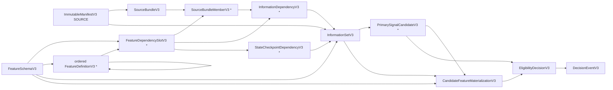

# V3.1 source, feature, candidate, and materialization contract design

Date: 2026-07-14  
Status: implemented V3.1 logical-contract sub-gate; focused adversarial and
compatibility verification complete; later Stage 1 adapters and physical gates
remain  
Scope: logical identity, source membership, feature dependency cardinality,
candidate grain, and exact feature-vector materialization  
Non-claim: this design does not demonstrate predictive edge, profitability, or
deployment readiness

## 1. Decision in one paragraph

This Stage 1 sub-gate replaces the prior opaque source/feature references with
a finite, content-addressed dependency graph and separates a candidate-neutral
information set from candidate-specific economics and feature values. The
implemented design is a typed DAG:

```text
SOURCE manifest
  -> SourceBundleV3
     -> SourceBundleMemberV3*

FeatureSchemaV3
  -> FeatureDependencySlotV3*
  -> ordered FeatureDefinitionV3*

source observations + state checkpoints + protocol constants
  -> InformationSetV3
  -> PrimarySignalCandidateV3*
  -> CandidateFeatureMaterializationV3*
  -> EligibilityDecisionV3
  -> DecisionEventV3
```

The generic manifest envelope remains responsible for experiment-governance
lineage. The new typed records carry inspectable source, slot, feature, and
candidate semantics. Logical IDs are hashes of canonical JSON descriptors and
record payloads; later Arrow/Parquet files receive separate artifact hashes.
Neither Parquet bytes nor Arrow IPC schema bytes define logical identity.

## 2. Evidence labels

This document uses four explicit evidence classes:

- **Confirmed repository fact**: observed directly in the current repository.
- **Research-supported design**: an engineering conclusion informed by primary
  official documentation, but not prescribed by that documentation.
- **Implementation experiment**: a result reproduced in the local environment;
  it is not a universal guarantee about the libraries.
- **Hypothesis or limitation**: a claim that still needs an implementation test
  or later out-of-sample trading evidence.

## 3. Why this is the next roadmap gate

### 3.1 Confirmed repository facts

1. `docs/architecture/trading_event_v3_contract.md` lists the remaining gates
   in dependency order. The first listed gate is source-bundle membership and
   feature-schema dependency slot/cardinality validation, including
   multi-source features. Calendar/action resolution, independent label
   verification, physical Arrow/Parquet schemas, split certification, and
   pipeline adapters follow it.
2. `docs/research/trading_prediction_system_diagnosis_and_redesign_2026-07-14.md`
   defines the Stage 1 acceptance boundary as zero known clock/eligibility
   violations and explicit availability metadata for every feature dependency.
3. The V3 foundation in `riskyieldmm/trading/contracts.py` already records raw
   observation clocks, but the pre-V3.1 design has one opaque
   `source_manifest_id`, one opaque `feature_schema_id`, and no inspectable
   declaration of which source, field, observation count, or state checkpoint
   is permitted to satisfy a feature.
4. The pre-V3.1 `InformationSetV3` requires every raw dependency to refer to its
   one source manifest. That rule cannot represent a feature using, for example,
   the decision asset, a completed higher-timeframe series, and a market index
   from distinct source members.
5. The implemented governance ledger treats an `InformationSetV3` ID as a
   semantic head. That gives useful determinism protection, but it also exposes
   the candidate-grain collision described below.

### 3.2 Dependency-order conclusion

**Research-supported design:** calendar resolution and label verification
cannot repair an under-specified feature information set. Physical persistence
also cannot safely be frozen before the logical records and their cardinalities
are known. Therefore this gate should establish the logical DAG first, while
choosing shapes that map cleanly to the later physical schema.

**Limitation:** passing this gate proves only that declared evidence can be
resolved and checked causally. It does not prove that the declared transforms
are correct, useful, or profitable. Prefix-invariance and replay/live parity
tests remain necessary.

## 4. The discovered candidate-grain collision

### 4.1 Confirmed repository facts

`InformationSetV3.information_set_id` in
`riskyieldmm/trading/contracts.py` is intentionally derived from semantic raw
inputs and excludes the old `feature_materialization_hash`. The ledger permits
one authoritative information-set object for that semantic ID. The old
`EligibilityDecisionV3` then requires `input_state_hash` to equal the single
feature-materialization hash attached to that information set.

That grain is incompatible with the existing Analyst feature contract:

- `Risk_Yield_Meta_Model_Analyst_0_0_1/trade_ml/features.py::FeatureSnapshot`
  binds `setup_id` and `side` to an ordered feature vector.
- `build_feature_snapshot()` multiplies direction-sensitive inputs by the LONG
  or SHORT sign and selects same-side/opposite-side CUSUM fields.
- The same vector also contains decision-time `risk_unit / entry_reference`,
  stop and target multiples, timeout, and estimated round-trip cost.

Consequently, a LONG and a SHORT candidate observed at the same raw asset,
timeframe, and cutoff can legitimately share one information set but require
different feature vectors. Storing either vector as the one information-set
materialization causes the other to collide with the ledger's determinism rule.
Making the entire information set side-specific would avoid the immediate
collision but would duplicate raw evidence and confuse observation identity
with a trading alternative.

### 4.2 Selected correction

Keep `InformationSetV3` candidate-neutral. Introduce two later graph nodes:

1. `PrimarySignalCandidateV3` binds the side, signal identity, signal clock,
   entry reference, executable-entry window, action/label/barrier/cost policies,
   risk unit, stop and target multiples, holding horizon, and estimated cost.
2. `CandidateFeatureMaterializationV3` binds one exact ordered feature vector to
   the information-set record, candidate record, and feature schema.

This yields the required one-to-many relationships:

```text
one InformationSetV3
  -> zero, one, or many PrimarySignalCandidateV3 records
     -> exactly one accepted materialization per
        (information-set record, candidate record, feature schema, encoding)
```

LONG and SHORT now have different candidate IDs and materialization keys while
sharing the same raw evidence. A second different vector for the *same*
information-set/candidate/schema/encoding key remains a determinism incident.

## 5. Designs compared

| Design | Advantages | Failure modes | Decision |
|---|---|---|---|
| Embed complete source and feature manifests inside every `InformationSetV3` | One self-contained blob; simple local parsing | Repeats thousands of definitions per row, makes IDs and receipts large, couples evidence reuse to candidate frequency, and makes graph-level substitution harder to diagnose | Rejected |
| Add `SOURCE_BUNDLE` and `FEATURE_SCHEMA` to the generic `ManifestType` switch | Reuses the existing envelope and registry | Expands one manifest parser into a heterogeneous schema monolith; typed cross-links, bounded collections, and feature-order semantics become large conditional branches; manifest lifecycle and evidence semantics remain unnecessarily coupled | Rejected for these objects |
| Store source, feature, candidate, vector, eligibility, and outcome in one row | Easy export to one table | Lets facts mature at different clocks overwrite one identity, repeats shared evidence, recreates the candidate-grain collision, and risks future outcome contamination of pre-decision data | Rejected |
| Separate frozen, slotted, content-addressed typed records linked as a DAG | Exact schemas; reusable nodes; finite graph validation; explicit causal clocks; candidate-neutral evidence; clean normalized persistence later | More record types and validators; adapters must resolve registries; requires careful migration | Selected |

The selected approach is consistent with the existing V3 choice in
`docs/architecture/trading_event_v3_contract.md`: identity-bearing protocol
records use strict frozen dataclasses, while dictionaries are boundary values.
It also preserves the current generic SOURCE manifest: its
`source_content_root` anchors a `SourceBundleV3`, and the protocol's
`feature_schema_id` anchors a `FeatureSchemaV3`. No new generic manifest type is
needed.

## 6. Selected scalable logical graph



The implementation is intentionally split by responsibility:

- `riskyieldmm/trading/evidence.py`: source members/bundles, dependency slots,
  feature definitions/schemas, and their typed graph validators;
- `riskyieldmm/trading/contracts.py`: realized observation/state evidence,
  candidate-neutral information sets, candidates, exact materializations, and
  downstream event records;
- `riskyieldmm/trading/manifests.py`: SOURCE/PROTOCOL anchoring and complete
  cross-registry validation;
- `riskyieldmm/trading/ledger.py`: append chronology, semantic heads,
  idempotence, conflict detection, and full-graph verification.

The V3.1 design bounds the graph rather than accepting arbitrary collections:
up to 4,096 source fields, 4,096 source members, 4,096 dependency slots, 8,192
ordered feature definitions, and 1,000,000 realized inputs in one slot. These
are safety ceilings, not recommended operating targets. Performance tests must
still cover the actual largest schema before the limits are treated as
production-ready.

### 6.1 `SourceBundleMemberV3`

One member describes one exact source slice, not a mutable path. Its logical
identity includes:

- source identifier and role;
- optional asset, venue, contract, and timeframe scope;
- source schema and ordered available field IDs;
- availability, revision, and calendar policies;
- semantic content root and separate physical artifact hash;
- row count, event coverage, and knowledge cutoff;
- optional parent member ID for append-only lineage.

The roles include `DECISION_INPUT`, `CALENDAR`, `UNIVERSE`, `PATH_EVIDENCE`,
`LABEL`, and `OUTCOME`. Pre-decision feature slots may use only
`DECISION_INPUT`. This makes an attempted outcome/path dependency a type error,
not merely a naming convention.

### 6.2 `SourceBundleV3`

A bundle is a sorted, finite set of source-member IDs plus the common source
contract, source schema, calendar, universe, first-seen policy, revision policy,
vintage, and knowledge cutoff. Parent linkage supports append-only source
evolution while validators prevent member-key removal, clock regression,
coverage or row-count regression, and unexplained replacement. A direct member
successor must preserve its stable key and, once non-empty, event start,
reference the exact predecessor, and strictly advance its knowledge cutoff. An
empty member may acquire its first event with its first row. Row/coverage
changes require a new semantic root; semantic changes require a new artifact
hash. New or changed members must postdate the parent bundle cutoff. Vintage is
immutable within a lineage; prospective live evidence starts a separate
`LIVE_FIRST_SEEN_CERTIFIED` root.

The member is the unit that can vary by asset/timeframe/source. The bundle is
the exact closed world available to one source-manifest snapshot. This scales
to multi-timeframe and cross-asset context without relaxing membership to
"anything found in this directory."

### 6.3 `FeatureDependencySlotV3`

A slot declares a finite input contract shared by one or more feature
definitions:

- evidence kind: `OBSERVATION`, `STATE_CHECKPOINT`, or `PROTOCOL_CONSTANT`;
- selection mode: exact event, latest available as-of, trailing completed
  observations, prior state checkpoint, or protocol constant;
- missing-input policy: fail, abstain, or null with a declared indicator;
- minimum and maximum cardinality, explicitly scoped as `TOTAL` or
  `PER_SOURCE_MEMBER`;
- finite maximum age for observation/state inputs;
- allowed source-member keys and exact source fields for observations;
- availability/revision policies, state schema, or protocol field names as
  required by the evidence variant.

Observation slots may apply their bounds to the aggregate or independently to
every declared source-member key. State and protocol slots are total-only, and
per-member aggregate capacity is bounded by the same safety ceiling. Slots are
content-addressed. Features reference slot IDs rather than copying source
declarations, so even a large compatibility schema can reuse a small input-slot
graph without quadratic payload growth. This capacity property is not approval
to retain the legacy 2,530-feature RPF model panel.

The selection enum is a declared adapter obligation, not a physical inclusion
proof. At this logical gate, `LATEST_AVAILABLE_ASOF` and
`PRIOR_STATE_CHECKPOINT` are singular and all modes enforce clocks, age, and
cardinality. Proving globally latest selection, a contiguous and complete
trailing window, or correspondence to an external exact event requires the
later physical-row, calendar, and adapter gate.

### 6.4 `FeatureDefinitionV3`

Each definition binds feature name/family/role, nullability, transform hash,
transform-parameter hash, normalization hash, referenced slot IDs, referenced
earlier derived-feature IDs, and whether the transform is candidate
conditioned. Derived references may point only backward in the schema's order;
this makes the transform DAG acyclic and fixes evaluation order.

The contract describes provenance and transform identity. It does not embed
Python source or claim that a hash proves correctness. The code artifact and
tests behind each transform hash remain part of the frozen protocol.

### 6.5 `FeatureSchemaV3`

The feature schema contains:

- a semantic name and version;
- source contract/schema IDs;
- the finite set of dependency-slot IDs;
- an **ordered** tuple of feature-definition IDs;
- a freeze timestamp.

Slot order is semantically irrelevant and canonicalized; feature-definition
order is semantically material because it defines vector position. Duplicate
feature names, missing definitions, unused slots, foreign slot references, and
forward derived-feature references fail closed.

### 6.6 Realized evidence in `InformationSetV3`

`InformationDependencyV3` gains explicit `dependency_slot_id`,
`source_member_id`, and exact `source_field_ids`. A separate
`StateCheckpointDependencyV3` records state schema, state cutoff, availability,
value digest, and optional parent checkpoint. Its checkpoint ID is derived from
those exact fields and verified on parse. Protocol constants are resolved from
the frozen protocol rather than copied into each information set.

`InformationSetV3` contains the realized raw/state dependency identities and
the observation cutoff, but no candidate-specific float vector. It remains the
semantic answer to: "what exact evidence was available for this asset scope at
this cutoff?" A state-only or protocol-only schema may legitimately produce an
information set with no raw observations; strict schema/cardinality validation
still fails closed when a required observation slot is not realized.

### 6.7 `PrimarySignalCandidateV3`

The candidate is sealed before scoring and makes the economic alternative
explicit. Its semantic key distinguishes signal identity/version/policy,
signal timestamp, side, and the exact information-set record. Its content ID
also binds the executable entry window and all decision-time economic inputs.

This prevents a model score produced for `LONG, +2R target, 20-bar timeout,
cost scenario A` from being reused for `SHORT, +3R target, 50-bar timeout,
cost scenario B` under the same raw cutoff.

### 6.8 `CandidateFeatureMaterializationV3`

The materialization binds:

- information-set ID and record hash;
- candidate ID and record hash;
- feature-schema ID;
- vector encoding ID;
- exact ordered encoded values, feature count, missing count, and vector digest;
- feature availability clock and inherited vintage/certification.

The materialization clock must not precede candidate availability and must not
follow the earliest order-submission time. Eligibility must bind this exact
candidate/materialization graph. The migration must remove the old assumption
that one information set owns one feature-materialization hash.

## 7. V3.1 binary64 vector encoding

Candidate model features are binary64 computations, while the canonical V3
identity protocol intentionally rejects JSON floats. V3.1 therefore uses
`riskyieldmm_float64_be_hex_null_v1`:

```text
finite float -> IEEE-754 binary64, big-endian 8 bytes -> 16 lowercase hex chars
missing value -> JSON null
```

Examples of the representation shape, not golden vectors:

```json
{
  "feature_vector_encoding": "riskyieldmm_float64_be_hex_null_v1",
  "feature_values": ["3ff0000000000000", null, "bfe0000000000000"]
}
```

The contract:

- accepts only actual binary64 values at the encoding boundary;
- rejects booleans, NaN, positive/negative infinity, malformed or uppercase
  hex, and negative zero;
- uses `null`, never NaN, for missingness;
- preserves the exact bits of every accepted finite feature;
- hashes the schema ID, encoding ID, and ordered encoded values together;
- requires vector length to equal the schema feature count and recomputes the
  missing count.

This encoding is for model feature materializations. Prices, barriers, costs,
and risk units retain the existing canonical decimal-string representation; a
binary float must not silently replace exact economic contract values.

**Hypothesis/limitation:** exact bits provide deterministic identity, not
cross-library numerical equivalence. Replay/live parity tests must still prove
that the same transform implementation produces those bits in both paths.

## 8. Precise graph, causality, and cardinality invariants

### 8.1 Closed-world membership

For every information set:

1. Its SOURCE manifest resolves to exactly one `SourceBundleV3` by
   `source_content_root`.
2. Every member ID resolves and its content-derived ID matches the registry key.
3. Every observation dependency references a member in that bundle.
4. The dependency's source ID, field IDs, availability policy, and revision
   policy match the member and slot declarations.
5. Only a `DECISION_INPUT` member may satisfy a pre-decision observation slot.
6. `PATH_EVIDENCE`, `LABEL`, and `OUTCOME` members are impossible inputs to a
   model feature schema even if their timestamps appear old enough.
7. A dependency outside the bundle, outside the slot's permitted member keys,
   or outside the member's field set fails closed.
8. One member/revision ID has one set of source coordinates, and one
   member/revision/ordered-field set has one value digest across every slot.

These are logical consistency rules. Until the physical adapter verifies
membership, the contract does not prove that the declared row, revision, or
value digest is actually included in the member's `semantic_content_root` or
artifact.

The ledger additionally makes `(stable source-member key, observation revision
ID)` globally immutable for its coordinates and makes the corresponding
ordered-field-set value digest immutable across InformationSets. Identical
reuse is allowed. The current implementation scans prior InformationSets; a
later normalized claim index may improve scale but must not relax semantics.

### 8.2 Slot cardinality

For every declared slot, count only unique realized evidence records of the
matching kind. Under `TOTAL`, apply the bounds once to the aggregate:

```text
realized_count <= maximum_count
```

Under `PER_SOURCE_MEMBER`, apply the same bounds independently to every
declared source-member key. State checkpoints and protocol constants use
`TOTAL` only. `LATEST_AVAILABLE_ASOF` and `PRIOR_STATE_CHECKPOINT` have maximum
cardinality one; per-member latest therefore means at most one row per member.

- `EXACT_EVENT` is exactly `1..1`.
- Observation and state slots retain a positive `minimum_count` as their
  sufficiency threshold; a trailing window also has a finite maximum.
- `realized_count < minimum_count` dispatches the explicit missing-input
  policy: `FAIL` rejects, while `ABSTAIN` and `NULL_WITH_INDICATOR` preserve an
  inspectable insufficient-input state for their later executable rules.
- `PROTOCOL_CONSTANT` count equals the number of declared protocol fields.
- Observation and state evidence cannot satisfy one another's slots.
- The tuple `(slot, member, observation_revision)` cannot occur twice.
- Two revisions of the same `(slot, member, event, bar-open, bar-close)` cannot
  coexist in one information set.
- A realized observation cannot reference a member whose frozen row count is
  zero, and member-wide unique realized rows cannot exceed that row count.
- The tuple `(slot, state_checkpoint)` cannot occur twice.
- Every schema slot must be used by at least one feature definition.

Cardinality is validated against the full information set, not independently
inside each feature. Shared slots therefore do not require duplicate evidence
rows merely because multiple features consume them. The same logical member
row reused by multiple slots counts once toward the member row-count bound;
conflicting revisions of that row fail closed. Field order is semantic: the
dependency must match the slot's exact ordered field tuple.

### 8.3 Time and age

For an observation dependency at decision cutoff `t`:

```text
bar_open_ts < bar_close_ts
bar_open_ts <= source_event_ts <= bar_close_ts
source_event_ts <= ingested_first_seen_ts
source_event_ts <= source_publish_ts            (when publication is known)
source_publish_ts <= ingested_first_seen_ts   (when publication is known)
ingested_first_seen_ts <= revision_received_ts
bar_close_ts <= feature_available_ts <= t
revision_received_ts <= feature_available_ts <= t
t - bar_close_ts <= slot.maximum_age
```

The source event must also fall inside the member's frozen event coverage, and
its feature availability cannot exceed the member's knowledge cutoff. A
higher-timeframe bar therefore cannot enter a lower-timeframe decision before
the higher-timeframe bar is complete and available.

For a state checkpoint:

```text
state_cutoff_ts <= state_available_ts <= t
t - state_cutoff_ts <= slot.maximum_age
state_schema_id == slot.state_schema_id
```

The checkpoint ID is derived from its schema, cutoff, availability, value
digest, and optional parent. The later adapter must still prove prefix
invariance of state construction; a derived ID, digest, and clock do not prove
that the state was computed causally.

### 8.4 Feature and candidate graph

1. All feature-definition slot IDs belong to the schema.
2. All derived-feature references point to earlier definitions in the same
   ordered schema.
3. The materialized vector has exactly one entry per ordered definition.
4. A non-nullable definition cannot materialize `null`. Every ordinary feature
   with an `ABSTAIN` or `NULL_WITH_INDICATOR` slot in its direct or derived
   ancestry is therefore required to be nullable.
5. Counts below a slot's `minimum_count` execute its policy: `FAIL` rejects;
   `ABSTAIN` requires `ABSTAIN_DATA`; `NULL_WITH_INDICATOR` requires affected
   feature values to be null and its directly bound, non-nullable indicator to
   equal binary64 `1.0` (`0.0` when sufficient).
6. Candidate-conditioned roots content-address an explicit allowlisted set of
   immutable candidate economic fields. Candidate-only schemas may have no
   dependency slots. Conditioned descendants inherit taint; missingness
   indicators remain neutral. No feature may declare later eligibility, fill,
   barrier, outcome, identity, or certification fields.
7. Transform hashes are opaque in this logical gate. The physical feature
   adapter must attest that executable code reads only the declared raw,
   derived, and candidate inputs.
8. Candidate `signal_ts <= information cutoff`, and candidate availability is
   not earlier than information-set assembly.
9. Materialization availability is at or after candidate availability and at
   or before earliest order submission.
10. Eligibility binds the information-set record, candidate record,
   materialization record, vector digest, and eligibility policy.
11. A DecisionEvent may be created only from the identical eligible candidate
   and must repeat its economic fields exactly.
12. `decision_event_key` binds the exact eligibility ID and record hash. Ledger
    compare-and-swap admits at most one decision for that eligibility even if a
    competing record changes its decision timestamp.
13. `FORWARD_MARKET_ORDER` and `LIVE_MARKET_ORDER` require the protocol freeze
    not to follow the observation cutoff, require certified live first-seen
    evidence, and require effective source/bundle/non-anchor-member receipts
    after the protocol receipt. Point-in-time data certification alone is not
    policy precommitment.
14. Candidate-neutral vector positions are bit-identical across candidates that
    share the exact InformationSet record and schema. Only definitions marked
    `candidate_conditioned` may vary, and that marker propagates through derived
    feature ancestry.

### 8.5 Source and schema evolution

- Source-bundle parent links are acyclic and knowledge cutoffs increase.
- Existing member keys cannot disappear from a child bundle.
- A replaced member points to the corresponding previous member, does not
  reduce row count/coverage, preserves event start once non-empty, and advances
  knowledge time; an empty member may acquire its first event when its first row
  arrives.
- Row/coverage changes require a changed semantic root, and a changed semantic
  root requires a changed artifact hash.
- New and changed members postdate the parent-bundle cutoff.
- Vintage class cannot change within a source lineage. Prospective live evidence
  starts a separate `LIVE_FIRST_SEEN_CERTIFIED` root; content hashes cannot
  upgrade nominal history into proof of first-seen time.
- Feature schema IDs change when order, transform, normalization, nullability,
  dependency slots, or freeze time changes.
- A schema change never silently reinterprets an old vector.
- Registry keys are verified against content IDs; unresolvable or foreign
  graph nodes fail closed.
- In the ledger, a member successor must extend a parent currently contained in
  an active bundle and postdate every applicable active bundle cutoff. Member
  objects are immutable staged values rather than lineage CAS heads; the bundle
  transition selects the authoritative complete member set. Multiple staged
  alternatives may coexist, but only a parent in the active bundle may be
  extended and only one valid bundle transition commits a selection. This lets
  a premature new-key candidate be corrected before bundle commit and prevents
  a rejected or interrupted update from poisoning the lineage irrecoverably.

## 9. Research support and its limits

| Primary source | What it establishes | Application here | What it does not establish |
|---|---|---|---|
| Apache Arrow, [Columnar Format](https://arrow.apache.org/docs/format/Columnar.html) | Defines Arrow logical types, physical memory layouts, null bitmaps, schemas, IPC messages, metadata, and dictionary messages | Supports an exact later columnar mapping and explicit nullability/types | Does not define trading causality, source membership, canonical content IDs, or profitable features |
| Apache Arrow, [Reading and Writing Parquet](https://arrow.apache.org/docs/python/parquet.html) | Documents Arrow/Parquet conversion and file metadata behavior | Supports a PyArrow-controlled persistence adapter and round-trip inspection | Does not guarantee that every engine preserves Arrow-specific metadata or produces identical bytes |
| Apache Arrow, [`pyarrow.Schema`](https://arrow.apache.org/docs/python/generated/pyarrow.Schema.html) | Exposes ordered fields, field/schema metadata, semantic equality, and IPC serialization | Supports explicit schema comparison and round-trip tests | `Schema.serialize()` is an IPC encoding API, not a canonical identity standard |
| Apache Arrow, [`pyarrow.parquet.write_table`](https://arrow.apache.org/docs/python/generated/pyarrow.parquet.write_table.html) | Exposes format version, row-group size, dictionary, compression, timestamp, page, statistics, and schema-storage choices | Shows that writer policy must be pinned and recorded for reproducible artifacts | Does not promise byte-identical output across versions or different option sets |
| Apache Parquet, [Logical Types](https://github.com/apache/parquet-format/blob/master/LogicalTypes.md) | Defines how primitive Parquet types carry string, integer, decimal, date/time, timestamp, and other logical semantics | Supports explicit timestamp and exact-decimal mappings instead of inferred types | Does not carry this project's content-addressed causal identity by itself |
| Feast, [Point-in-time joins](https://docs.feast.dev/getting-started/concepts/point-in-time-joins) | Demonstrates reconstructing feature state at each entity-row timestamp by looking backward within a TTL | Supports the as-of/maximum-age semantics of dependency slots | Does not prove publication/first-seen time, revision history, completed-bar rules, or this project's multi-clock contract |
| Apache Iceberg, [Specification: schema evolution](https://iceberg.apache.org/spec/#schema-evolution) | Uses stable field IDs so add/drop/reorder/rename can be distinguished safely across table versions | Supports stable field IDs and explicit schema versions in the future physical layer | Does not require adopting Iceberg, and Iceberg identifier fields do not replace ledger uniqueness or semantic validation |

The typed DAG is therefore a **research-supported repository design**, not a
standard copied from Arrow, Feast, or Iceberg. Its fitness must be established
by the acceptance tests below and later replay/live evidence.

## 10. Local physical implementation experiment

**Implementation experiment, 2026-07-14; not an external fact:** a local probe
with PyArrow 22 and Polars 1.40 produced these observations:

1. A PyArrow-written/read schema preserved `timestamp[us, tz=UTC]`,
   `fixed_size_binary[32]`, declared nullability, and field/schema metadata,
   including `PARQUET:field_id`.
2. Reading and rewriting the same logical data through Polars changed
   fixed-size binary to large binary, changed string/list widths and dictionary
   index representation, made fields nullable, and dropped metadata.
3. Two PyArrow schemas with the same metadata mappings compared equal with
   `Schema.equals(check_metadata=True)`, but `Schema.serialize()` produced
   different bytes when metadata had been inserted in a different order.

These observations are deliberately not generalized to all PyArrow/Polars
versions or every schema. They are implementation evidence for three design
rules:

- the logical schema ID is the hash of a canonical JSON schema descriptor, not
  Arrow IPC schema bytes;
- the semantic content root is computed over canonical record identities, not
  over a Parquet file's bytes;
- every physical file has a separate SHA-256 artifact hash, and an exact
  writer/version policy is stored when byte reproducibility is required.

This is already reflected conceptually in `SourceBundleMemberV3`, which keeps
`semantic_content_root` separate from `artifact_hash`.

## 11. Later normalized Arrow/Parquet mapping

Physical implementation is a later gate, but the logical graph should map to
normalized tables rather than a single deeply nested row:

| Logical record/edge | Proposed normalized physical table | Important physical types |
|---|---|---|
| `SourceBundleV3` | `source_bundles` | IDs as `fixed_size_binary[32]`; cutoff as `timestamp[us, UTC]` |
| Bundle membership | `source_bundle_membership` | bundle/member IDs plus deterministic ordinal where required |
| `SourceBundleMemberV3` | `source_bundle_members` | content/artifact hashes as `fixed_size_binary[32]`; counts as `int64`; clocks as `timestamp[us, UTC]` |
| `FeatureDependencySlotV3` | `feature_dependency_slots` | enum values as strings or dictionary-encoded values decoded before identity checks; counts/age as bounded integers |
| Slot-to-member and slot-to-field edges | `feature_slot_members`, `feature_slot_fields` | normalized many-to-many edges with stable field IDs |
| `FeatureDefinitionV3` | `feature_definitions` | hashes as fixed binary; booleans non-nullable |
| Ordered feature schema | `feature_schemas`, `feature_schema_features` | explicit zero-based feature ordinal; schema/definition IDs |
| `InformationSetV3` | `information_sets` | scope strings, exact clocks, IDs, vintage/certification |
| Raw/state dependencies | `information_dependencies`, `state_checkpoint_dependencies` | one row per realized evidence object; slot/member foreign keys |
| `PrimarySignalCandidateV3` | `primary_signal_candidates` | exact economic values as `decimal128(38, 18)` only if conversion is lossless for the canonical domain; otherwise canonical UTF-8 decimal strings |
| `CandidateFeatureMaterializationV3` | `candidate_feature_materializations`, optionally `candidate_feature_values` | nullable `float64` with exact bit-verification against canonical hex; explicit ordinal; vector/content hashes |

Normalized child tables make membership and cardinality auditable with ordinary
grouping and joins and avoid depending on one engine's nested list/struct
round-trip behavior. A nested Arrow view may be generated for transport, but it
is not the authoritative logical identity.

Every table requires a canonical JSON physical-schema descriptor that fixes:

- stable table and field IDs;
- field order, Arrow type, nullability, timestamp unit/timezone, and decimal
  precision/scale;
- required field and schema metadata;
- primary/foreign semantic keys;
- sort order and partition policy;
- writer library/version and all relevant `write_table` options.

The future round-trip verifier must reconstruct typed V3.1 objects and recompute
their canonical IDs. It should compare logical schema descriptors and semantic
roots across supported readers. Exact Parquet file hashes are integrity checks
for a particular artifact, not cross-engine semantic equality.

## 12. Migration plan

1. **Declare V3.1 explicitly.** Increment the event/evidence contract versions.
   Do not parse a V3 payload as V3.1 through defaulted fields.
2. **Preserve old evidence.** Existing V3 objects and ledgers remain immutable
   audit artifacts. Because the ledger verifies an exact application-schema
   fingerprint, use an explicit schema migration/new ledger lineage rather than
   mutating historical tables in place.
3. **Build typed registries.** Register source members, bundles, dependency
   slots, feature definitions, and schemas by verified content ID.
4. **Anchor existing manifests.** A SOURCE manifest's `source_content_root`
   resolves to the exact bundle; a PROTOCOL manifest's `feature_schema_id`
   resolves to the typed feature schema. Validate both graphs before accepting
   an information set.
5. **Migrate `InformationSetV3`.** Replace the singular-source restriction with
   member/slot resolution, add state dependencies, and remove candidate feature
   values/materialization from information-set identity.
6. **Insert candidate/materialization nodes.** Produce a candidate before
   scoring, then the schema-bound exact vector, then eligibility. Bind the
   downstream event to that candidate without changing economics.
7. **Start prospective evidence from the right root.** Vintage never changes
   within a source lineage. Freeze forward/live and final-holdout protocols on
   a prospectively registered live root, then admit only same-vintage source,
   bundle, and new-member receipts that follow the protocol receipt.
8. **Provide a legacy Analyst adapter in shadow mode.** Map each
   `FeatureSnapshot.setup_id/side` to a candidate and materialization. Map its
   `online` and `cusum` sources to declared slots. Do not claim historical
   first-seen certification for backfilled records.
9. **Dual-compare, do not auto-promote.** Compare legacy and V3.1 candidate
   counts, vectors, clocks, decisions, and reason codes on identical replay and
   live shadow inputs. Any mismatch is an incident until explained.
10. **Freeze the physical schema later.** Only after logical acceptance tests
   pass should normalized Arrow/Parquet descriptors and round-trip adapters be
   implemented.

## 13. Explicitly out of scope for this gate

- authoritative calendar/action resolution and next executable bar;
- revision-clocked future path evidence and independent label verification;
- production Arrow/Parquet schemas, partitioning, compaction, or data-lake
  adoption;
- actual funding, rebate, borrow, fill, or market-impact accounting;
- interval-aware split construction and final-holdout certification;
- the cross-lineage promotion record that binds a historically developed model
  artifact and training evidence into a separately rooted prospective-live
  protocol;
- legacy replay/live/RPF production adapters beyond a later shadow migration;
- model training, feature selection, calibration, ranking, portfolio sizing,
  order execution, UI changes, or live deployment;
- any claim of state-of-the-art predictive performance or profitability.

These remain separate gates in
`docs/architecture/trading_event_v3_contract.md`. Combining them here would
make it impossible to isolate whether a failure belongs to evidence identity,
calendar semantics, labeling, persistence, or trading logic.

## 14. Acceptance tests

### 14.1 Exact-schema and identity tests

- All record parsers reject missing and unknown keys, bool-as-int, malformed
  hashes, noncanonical identifiers, invalid enums, and unsupported versions.
- Golden canonical JSON bytes and IDs cover each new record and every enum
  variant.
- Input-order permutations leave set-like IDs unchanged; changing feature order
  changes `FeatureSchemaV3.feature_schema_id` and vector digest.
- Registry key/content mismatches and unresolved graph nodes fail closed.
- Mutation attempts cannot alter frozen nested tuples or returned payloads.

### 14.2 Source-bundle tests

- Valid single-source, multi-timeframe, multi-asset, and market-context bundles
  resolve successfully.
- Foreign member, duplicate member key, wrong calendar/policy, coverage
  regression, row-count regression, non-monotone cutoff, wrong parent, removed
  member key, and lineage cycle are rejected.
- A decision-input feature cannot reference a path, label, or outcome source
  role.
- Semantic root and artifact hash can differ without ambiguity; changing either
  changes the member ID.

### 14.3 Feature schema and cardinality tests

- Cover all evidence kinds, selection modes, and missing-input policies.
- Reject zero/negative/inverted/unbounded cardinalities where the variant
  requires finite bounds.
- Reject an exact-event slot not equal to `1..1`.
- Reject missing required input, too many trailing rows, wrong slot type,
  foreign member, wrong fields, wrong policy, unknown protocol constant, stale
  observation, stale state, duplicate revision/checkpoint, cross-slot revision
  aliases, and member row-count overclaims.
- Reject duplicate feature names, duplicate slots, unused slots, foreign slots,
  unknown derived features, forward references, and derived-feature cycles.
- Prove shared slots count evidence once even when many features consume them.
- Reject a neutral feature derived from a candidate-conditioned ancestor.
- Reject undeclared or forbidden candidate fields and accept a candidate-only
  schema without dummy source slots.
- Prove insufficient `ABSTAIN` evidence forces `ABSTAIN_DATA`, while
  `NULL_WITH_INDICATOR` materializes null plus exact indicator `1.0`; reject
  fabricated values and false `0.0` indicators end to end in the ledger.
- Exercise the declared upper bounds and a representative 2,530-feature schema
  without recursion failure or quadratic payload growth. This is a capacity
  and legacy-compatibility test only, not an endorsement of that RPF panel as a
  production model input.

### 14.4 Temporal leakage tests

- Future-poison every clock independently and require rejection.
- Prove `source_event_ts <= ingested_first_seen_ts` even when publication time
  is unavailable, at constructor, graph, and ledger boundaries.
- Perturb observations strictly after cutoff and prove unchanged information,
  candidate, and materialization IDs.
- Test the exact completed higher-timeframe boundary and one microsecond before
  it.
- Test first-seen/revision arrival after cutoff, stale-as-of inputs, state
  checkpoints built past cutoff, and source coverage outside the bundle.
- Prove a path/label/outcome member is rejected even when its timestamp is
  forged to precede cutoff.
- Reject forward/live candidates whose protocol or effective source receipts do
  not predate/accrue before and after the correct boundary, respectively, or
  whose source is not certified live first-seen evidence.

### 14.5 Candidate/materialization collision tests

- Build LONG and SHORT candidates from the same information-set record and show
  that both coexist with distinct candidate/materialization IDs.
- Show side-normalized values differ where expected while raw evidence IDs stay
  identical.
- Change target, stop, timeout, entry window, cost scenario, or estimated cost
  and require a different candidate ID.
- Submit different vectors under the same materialization key and require a
  ledger determinism conflict.
- Reject a vector with the wrong candidate, information-set record, schema,
  length, feature count, missing count, digest, availability clock, or vintage.
- Reject eligibility/event substitution across either candidate side.
- Keep neutral vector positions identical across candidates while permitting
  conditioned positions to differ.

### 14.6 Binary64 encoding tests

- Golden encodings cover positive/negative normal values, subnormals, maximum
  finite values, positive zero, and `null`.
- Round-trip every accepted bit pattern exactly.
- Reject negative zero, NaN payload variants, infinities, bool, integer,
  decimal, uppercase/short/long/non-hex strings, and unsupported encoding IDs.
- Prove schema ID, vector order, null position, and one-bit value changes alter
  the digest.

### 14.7 Ledger and protocol tests

- Register the typed evidence graph before its information set; reject missing
  or later-registered references where chronology requires prior registration.
- Validate protocol/source/bundle/schema/information/candidate/materialization/
  eligibility/event substitution attacks independently.
- Preserve idempotence for byte-identical repeats and reject conflicting heads.
- Stage member objects without committing their stable key; require member
  successors to extend an active bundle and let bundle CAS select the complete
  authoritative member set.
- Reject global reuse of one stable-member revision with changed coordinates or
  field-value digest.
- Reject final-holdout evidence registered before its protocol receipt.
- Recompute every content ID and semantic head in full-ledger verification.
- Crash/concurrency tests cover the new record kinds without weakening the
  existing single-writer durability profile.

### 14.8 Future physical-gate tests

These tests are specified now but do not complete this logical gate:

- exact PyArrow schema comparison including metadata, nullability, field IDs,
  timestamp unit/timezone, decimal scale, and list/binary widths;
- PyArrow write/read reconstruction of every V3.1 typed record;
- supported-engine read tests that detect rather than silently accept changed
  metadata/types;
- equal logical roots across permitted row-group/compression encodings while
  file artifact hashes remain distinct;
- pinned-writer deterministic-repeat test, with no claim that a different
  library/version must emit identical bytes;
- semantic-root corruption, file-hash corruption, row reordering, duplicate
  primary key, orphan child, and truncated file rejection.
- prove `LATEST_AVAILABLE_ASOF` is globally latest, trailing selections are
  contiguous and complete, and `EXACT_EVENT` resolves the declared external
  event under the authoritative calendar.

## 15. Gate exit criteria

This design gate is complete only when:

1. every supported feature definition resolves to finite typed slots;
2. every realized pre-decision dependency belongs to the frozen bundle and
   passes type, field, policy, cardinality, age, and clock checks;
3. LONG/SHORT and other simultaneous alternatives share candidate-neutral
   information without materialization collisions;
4. feature vectors have exact schema-bound binary64/null identities;
5. protocol and ledger validation cover the entire typed graph and adversarial
   substitution tests;
6. the full existing test suite remains green;
7. documentation continues to state the unimplemented calendar, label,
   physical storage, split, and adapter boundaries.

Passing these criteria establishes a defensible causal evidence contract. It
does not establish that the available features contain stable economic signal.
That question begins only after the remaining Stage 1 gates and leakage-free
out-of-sample baselines are complete.

Verification on 2026-07-14: the focused V3.1 suite passed `218` tests; the
complete repository suite passed `1151` tests with `32` skipped; Ruff,
`py_compile`, `git diff --check`, and Markdown-fence checks passed. Independent
adversarial review found no unresolved high- or medium-severity correctness gap
inside this logical gate.
