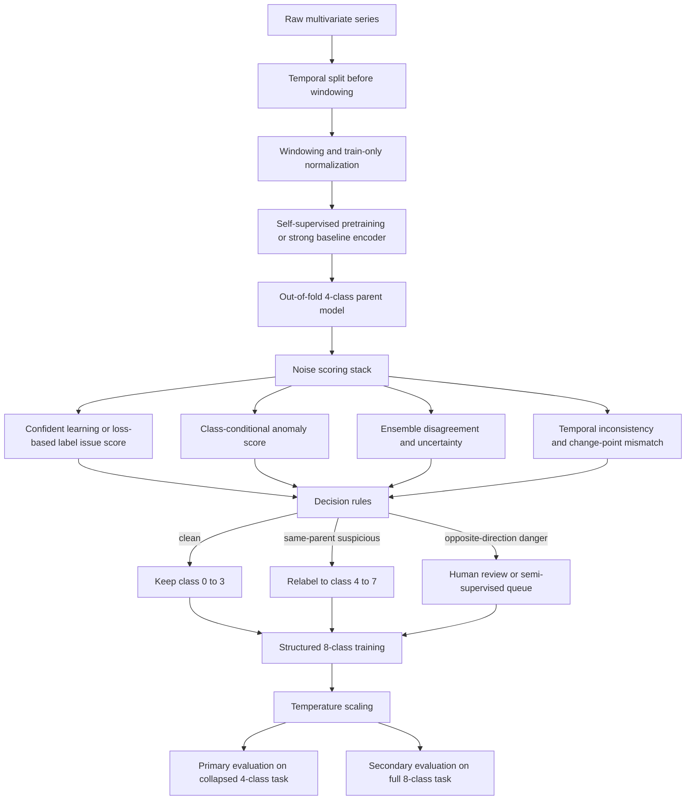

# Reducing Label Noise in Multivariate Time Series Classification with Parent Conditioned Anomaly Classes

## Executive summary

The most defensible way to use your proposed label scheme is to treat the eight classes not as a flat taxonomy, but as a **structured factorization of three attributes**: direction `{DOWN, UP}`, regime `{BALANCED, EXPANSION}`, and cleanliness `{clean, anomaly}`. Under that view, classes `0–3` are clean leaves and classes `4–7` are the corresponding anomaly leaves for the same parent state. This turns your idea into a principled hierarchical problem rather than an ad hoc relabeling trick, and it matches modern multi-task learning practice. It also makes it much easier to train for the business objective you care about most: preserving **directional correctness** among the original four states while letting suspicious samples migrate into same-parent anomaly leaves instead of contaminating the clean class boundaries. citeturn8search1turn36view0turn36view2

The strongest overall recipe, given the literature and your objective, is a **two-stage data-centric pipeline**. First, detect suspicious labels using **out-of-fold label issue scores**, **class-conditional anomaly scores**, **ensemble disagreement**, and **temporal inconsistency / change-point mismatch**. Second, conservatively relabel only the higher-confidence suspicious points from class `k` to anomaly class `k+4`, while routing the most dangerous cases—samples that look confidently opposite-direction—to human review or a semi-supervised relabeling queue instead of automatically flipping them. This design is strongly supported by confident learning for label issue detection, by loss-based noisy-label methods such as Co-teaching and DivideMix, and by recent time-series-specific noisy-label methods such as CTW, Scale-teaching, and temporal label-noise correction. citeturn35view2turn35view0turn35view4turn33view1turn38view2turn38view3turn34view0turn34view1

For model training, the best fit is not a plain eight-way softmax alone. A better design is a **shared temporal backbone** with both a leaf-level `8-class` head and auxiliary heads for **direction**, **regime**, and **anomaly flag**, trained with a **cost-sensitive objective** that penalizes `DOWN ↔ UP` confusions more than within-direction confusions. Add light label smoothing, focal or class-balanced focal weighting for rare anomaly classes, and—if you have enough unlabeled data—self-supervised pretraining such as TS2Vec, TS-TCC, SimMTM, or SLOTS-style supervised/unsupervised contrastive fine-tuning. This combination gives the model a way to learn robust temporal representations without allowing noisy leaf labels to dominate the geometry of the representation space. citeturn37view0turn9search0turn34view10turn37view2turn37view3turn33view3turn33view4turn24search19turn6search2turn7search10

Your **primary model-selection criterion should not be raw 8-class accuracy**. It should be a validation objective defined on the original four parent classes after collapsing anomalies back to their parents, with an explicit penalty for cross-direction mistakes. In practice, use collapsed-4 accuracy, cross-direction error rate, cost-weighted confusion-matrix score, per-parent precision/recall, and post-hoc calibration. For the directional layer, precision-recall analysis is especially useful when the direction distribution is imbalanced, and temperature scaling is usually the simplest and fastest calibration method. citeturn31search0turn36view5turn36view6

The most important caveat is that this approach only works well if anomaly classes truly mean **“same parent, suspicious/noisy instance”** rather than **“unknown true class.”** If many suspicious samples actually belong to the opposite direction, then blindly relabeling them to `k+4` will hide genuine label errors instead of fixing them. For that reason, opposite-direction evidence should trigger review or higher scrutiny, not routine anomaly-label assignment. This is an inference from the structure of your objective rather than a claim directly proven by one paper, but it is strongly aligned with the label-issue and active label correction literature. citeturn35view2turn20search1turn20search0turn12search7

## Problem framing and assumptions

I will assume the dataset is a **window-level multivariate time-series classification** problem in which each window has one original label among four parent classes:

- `0 DOWN_BALANCED`
- `1 DOWN_EXPANSION`
- `2 UP_BALANCED`
- `3 UP_EXPANSION`

and the proposed anomaly labels are **parent-conditioned noisy variants**:

- `4 ANOMALY_OF_DOWN_BALANCED`
- `5 ANOMALY_OF_DOWN_EXPANSION`
- `6 ANOMALY_OF_UP_BALANCED`
- `7 ANOMALY_OF_UP_EXPANSION`

I also assume the train/validation/test protocol must respect time order, because random shuffling or windowing before splitting can leak future information and inflate performance in time-series problems. Time-series-aware validation is therefore required, ideally blocked or walk-forward, with window creation performed **after** the temporal split or with an embargo that prevents overlap leakage. citeturn11search9turn11search16

A crucial assumption is that the anomaly classes are **not new semantic states**. They are instead a mechanism for **absorbing suspicious observations that should not exert full force on the clean parent class boundary**. That is consistent with confident-learning style data cleaning, small-loss noisy-label learning, and semi-supervised anomaly detection, where suspicious samples are separated, down-weighted, or handled with specialized objectives rather than trusted as ordinary class members. citeturn35view2turn35view4turn36view0

Under this interpretation, the clean/anomaly split is best modeled as a third factor on top of direction and regime. That gives the exact factorization

\[
\text{leaf class} = \text{direction} \times \text{regime} \times \text{cleanliness}
\]

with `2 × 2 × 2 = 8` leaves. This means your label design already implies a natural **hierarchical / conditional classifier**, and that is the structure I recommend optimizing. This is a modeling recommendation inferred from your label semantics and supported by multi-task optimization literature and class-conditional anomaly modeling ideas such as Deep SAD and Multi-Class Deep SVDD. citeturn8search1turn36view1turn36view2

The last assumption is operational: if your validation labels are themselves noisy, then optimizing for “low cross-direction error” can become circular. The cleanest setup is to keep a **small audited validation slice**—even if only a few thousand windows or fewer—because active label correction methods repeatedly show that a small review budget focused on the most impactful suspicious points can materially improve downstream performance. If no audited slice exists, use a “consensus-clean” subset for validation, but treat conclusions more cautiously. citeturn20search1turn20search0turn12search7



## Detecting noisy labels in multivariate time series

No single detector is reliable enough on its own. The literature points much more strongly toward **detector ensembles** than toward any universal one-shot rule. In your case, the right question is not “is this point noisy?” but “how much evidence is there that this sample should not remain in the clean parent class?” The best evidence sources are complementary rather than redundant. citeturn35view2turn33view1turn32search0turn36view6

A strong first detector is **out-of-fold label issue scoring**. Confident Learning uses out-of-sample predicted probabilities and noisy labels to estimate the joint distribution of noisy and latent true labels, and it gives both a theoretical basis and practical algorithms for finding label errors; the paper proves sufficient conditions under which it exactly identifies label errors and consistently estimates the noisy/true joint distribution. For your setting, run a temporally valid K-fold or walk-forward out-of-fold parent-class model, compute per-sample predicted probabilities, and rank samples by label-issue score relative to their observed parent label. This is especially useful because it is model-agnostic and imposes no architecture commitment. citeturn35view2turn35view0

A second family of detectors exploits the **memorization dynamics of deep nets**. Co-teaching and DivideMix build on the empirical observation that deep nets tend to fit clean patterns before noisy labels, so per-sample losses in the early or middle stage of training contain information about label corruption. DivideMix goes further by fitting a mixture model to per-sample losses and treating the problem as semi-supervised learning on clean versus noisy subsets. More recently, early-stopped models have also been shown to be useful directly for noisy-label detection, which is relevant for time series when you want a lightweight detector before building a full cleaning stack. citeturn35view4turn33view1turn32search0

For time series specifically, **time-series-aware noisy-label methods** matter because ordinary image-style small-loss criteria can break when temporal distortions change discriminative patterns. CTW addresses this by building a confident set and applying time warping only there, while normalizing loss distribution by class; Scale-teaching addresses the fact that time-series distortions can invalidate simple loss-based filtering by using complementary information across scales. A temporal-label-noise formulation from ICLR 2025 further shows that when noise varies over time, temporal loss correction can materially improve learning. These papers are especially important for your use case because they are much closer to the failure mode you care about than generic image-noise methods. citeturn38view2turn38view3turn34view0turn34view1

A third detector family is **prediction residuals**. Forecast a short horizon from the recent past with a strong temporal model—LSTM, TCN, or transformer encoder-decoder—and use large residuals or likelihood failures as anomaly evidence. In industrial multivariate time series, LSTM residuals with dynamic thresholding have worked well enough to detect anomalies in spacecraft telemetry, and transformer-based detectors such as TranAD remain attractive because they explicitly model broader temporal trends and can be computationally efficient on their own benchmarks. Residual detectors are particularly valuable when label noise originates from windows that are locally inconsistent with the surrounding process regime. citeturn33view15turn36view7turn38view7

A fourth family is **reconstruction and latent-likelihood error**, especially if learned conditionally on each parent class. OmniAnomaly models multivariate sequences with a stochastic recurrent network and uses reconstruction probabilities; USAD uses adversarially trained autoencoders and emphasizes stability and speed; Anomaly Transformer augments reconstruction with association discrepancy; and TranAD uses a transformer-based encoder-decoder with self-conditioning. In practice, these methods are most valuable when you train them **per parent class** or with parent-conditioned embeddings, because your anomaly class definition is same-parent suspiciousness rather than global outlierness. Deep SAD and Multi-Class Deep SVDD are especially relevant when you want class-conditional anomaly geometry: Deep SAD explicitly uses labeled anomalies in semi-supervised anomaly detection, and Multi-Class Deep SVDD maps distinct inlier categories to separate hyperspheres. citeturn34view2turn36view9turn34view3turn36view10turn38view8turn36view8turn36view0turn36view2

A fifth evidence source is **ensemble disagreement and uncertainty**. Deep ensembles are one of the most reliable practical methods for obtaining predictive uncertainty; they also tend to express higher uncertainty on distribution-shifted examples. For your problem, disagreement is valuable precisely because suspicious windows often sit near regime boundaries or contain conflicting motifs: one model sees them as parent clean, another sees them as neighboring regime, and a third abstains. That divergence is a useful signal even before you decide what to do with the point. citeturn36view6

A sixth evidence source is **temporal consistency and change-point mismatch**. Windows in the middle of a stable segment should usually not jump sharply across direction unless the underlying process truly changed. Change-point methods such as PELT or kernel-based CPD can detect regime breaks, while sequence-level temporal loss correction methods formalize the fact that label noise can vary with time. In practice, this gives a very useful rule: a label that implies a direction flip inside a segment where both neighboring windows and changepoint statistics disagree should be regarded as highly suspicious. Conversely, the same label right after a detected breakpoint may be genuinely correct. citeturn26search0turn26search10turn34view0

A seventh option, especially when labels are scarce but unlabeled data are abundant, is **representation-space clustering or density estimation**. TS2Vec learns strong universal time-series representations that transfer to classification and anomaly detection; once you have a good embedding, simple cluster-density tools such as class-wise kNN density, HDBSCAN, or per-class Gaussian mixtures become far more informative than they are in raw space. DECL also shows that denoising-aware self-supervised representation learning can materially improve representation quality on noisy time series, which supports the idea of embedding-space detectors before supervised relabeling. citeturn37view0turn34view9turn38view4

The most practical synthesis is a **hybrid score**. Standardize each detector within the observed parent class and combine them:

\[
S_i = 0.35\,q_i^{\text{CL}} + 0.20\,q_i^{\text{loss}} + 0.20\,q_i^{\text{anom}} + 0.15\,q_i^{\text{ens}} + 0.10\,q_i^{\text{temp}}
\]

where `CL` is the confident-learning style label-issue score, `loss` is an early-loss / DivideMix-style contamination score, `anom` is a class-conditional anomaly score, `ens` is ensemble disagreement, and `temp` is temporal inconsistency. The weights are a recommended starting point rather than literature-defined constants. Tune them on a small audited set, or default to equal weighting if no audited slice exists. The key is **multisignal agreement**, not a single threshold. This is a synthesis of the cited methods rather than a direct result from one paper. citeturn35view2turn33view1turn36view6turn34view0turn36view0

The table below summarizes the most useful candidates. The “recommended hyperparameters” are **good starting values**, not universal optima.

| Method | Pros | Cons | Complexity | Recommended hyperparameters | When to use |
|---|---|---|---|---|---|
| Confident Learning on out-of-fold parent probabilities | Model-agnostic; directly targets label issues; strong theoretical foundation | Needs decent out-of-fold probabilities; weaker when all models are badly misspecified | Medium | 5 folds or walk-forward splits; class-wise ranking; inspect top 2%–10% suspicious per class | Default first-pass label issue detector |
| Early-stopped small-loss detector | Cheap; easy to add to any classifier | Sensitive to training dynamics; can fail under severe temporal distortion | Low | Save checkpoints in first 20%–40% of training; use median loss over 3 checkpoints | Quick baseline detector |
| DivideMix-style loss mixture | Strong empirical noisy-label baseline; semi-supervised view is useful | Heavier training; assumes separable clean/noisy loss distributions | High | 2-component GMM/BMM on normalized loss; warm-up 5–10 epochs | When label noise is moderate to high |
| Residual forecasting with dynamic thresholding | Captures locally inconsistent behavior; useful for online settings | Forecasting quality can dominate results | Medium | Horizon 1–5 steps; per-class residual z-score; threshold at 95th–99th percentile | When process dynamics are smooth and local |
| Reconstruction error from parent-conditioned AEs / VAEs / transformers | Good for atypical shapes and latent anomalies | Reconstruction may ignore discriminative label corruption | Medium to High | Latent 16–128; threshold by class quantile 97.5th–99.5th | Strong second detector after parent split |
| Deep SAD / class-conditional hypersphere models | Naturally fits “same parent but anomalous” idea | Requires careful negative selection and good representation | Medium | 1 model per parent or shared encoder + class centers | Best when anomaly labels are scarce but valuable |
| Deep ensemble disagreement | Reliable uncertainty signal; catches border cases | Compute-heavy | High | 3–5 members; entropy + variance + max-softmax disagreement | High-stakes model selection and review queue |
| Temporal consistency + change-point mismatch | Directly attacks implausible state jumps | Requires sequential context; can over-smooth true rapid changes | Low to Medium | Neighbor window length 3–11; breakpoint penalty tuned on validation | Essential when labels should evolve smoothly |
| TS2Vec embedding + density / clustering | Strong unlabeled representation; flexible downstream detector | Needs enough unlabeled data; latent density still needs tuning | Medium | Embedding dim 128–320; kNN/HDBSCAN in latent space | When unlabeled history is plentiful |
| CTW / Scale-teaching style robust time-series training | Time-series-specific robustness to noisy labels | More specialized and heavier than generic cleaning | High | Use as comparison baselines; same augmentations across splits | Best ablation baselines for TSC with noisy labels |

This synthesis is grounded in Confident Learning, Co-teaching, DivideMix, Deep SAD, MCDSVDD, TS2Vec, CTW, Scale-teaching, DECL, forecasting residual anomaly detection, and reconstruction-based multivariate anomaly detection papers. citeturn35view2turn35view4turn33view1turn36view0turn36view2turn37view0turn38view2turn38view3turn38view4turn33view15turn34view2turn34view3turn38view7turn38view8

### Concrete detection recipe

The following recipe is conservative and intentionally biased toward **protecting direction**.

```python
# Pseudocode for hybrid noisy-label detection.
# Assumes temporally valid out-of-fold probabilities already exist.

def detect_suspicious_samples(
    observed_parent,          # 0..3
    oof_parent_probs,         # shape: [n, 4]
    loss_score,               # normalized early-loss or DivideMix score
    anomaly_score,            # class-conditional anomaly score
    ensemble_disagreement,    # entropy / variance / KL disagreement
    temporal_inconsistency,   # neighbor mismatch / change-point mismatch
    class_thresholds          # per-parent thresholds learned on validation
):
    suspicious = []
    for i in range(len(observed_parent)):
        y = observed_parent[i]

        # Label issue evidence: low probability on the observed parent label.
        cl_like = 1.0 - oof_parent_probs[i, y]

        # Hybrid suspiciousness score.
        score = (
            0.35 * cl_like
            + 0.20 * loss_score[i]
            + 0.20 * anomaly_score[i]
            + 0.15 * ensemble_disagreement[i]
            + 0.10 * temporal_inconsistency[i]
        )

        # Parent predicted by the out-of-fold classifier.
        pred_parent = argmax(oof_parent_probs[i])

        suspicious.append({
            "index": i,
            "observed_parent": y,
            "pred_parent": pred_parent,
            "score": score,
            "opposite_direction_risk": direction(pred_parent) != direction(y)
        })

    # Per-class thresholds are strongly preferred because score scales differ by class.
    return [
        s for s in suspicious
        if s["score"] >= class_thresholds[s["observed_parent"]]
    ]
```

This recipe is supported by the literature on confident learning, loss-based noisy-label separation, uncertainty estimation, temporal label noise, and class-conditional anomaly detection, while the exact weighting is a recommended engineering synthesis. citeturn35view2turn33view1turn36view6turn34view0turn36view0

## Relabeling noisy points into anomaly classes

The key principle is **do not relabel everything suspicious**. Relabeling is not just cleaning; it changes the target distribution. If you over-assign anomaly labels, you can make the eight-class problem harder without meaningfully improving the clean parent boundaries. The safest strategy is therefore **high precision, moderate recall** for automatic anomaly reassignment. Active label correction methods support this conservative philosophy: the highest-value corrections are often a small subset of strategically chosen points. citeturn20search1turn20search0turn12search7

For your particular taxonomy, a suspicious sample from parent class `k` should be reassigned to anomaly class `k+4` only when the evidence says **“do not trust this as clean parent `k`, but it is still more likely to belong to the same direction/regime family than to a different family.”** That is why opposite-direction cases are special: they carry the exact error type you care most about, so they should usually be handled more cautiously than same-parent suspicious cases. That logic is a direct consequence of your evaluation objective and consistent with the literature on cost-sensitive noisy-label handling. citeturn35view2turn20search1turn25search0

A practical decision rule is:

- **Keep clean label `k`** if the sample is below threshold or only one weak detector fires.
- **Relabel to anomaly `k+4`** if the hybrid score exceeds a class-specific threshold *and* either the alternative predictions stay within the same direction or the model uncertainty is high enough that the point looks unreliable rather than confidently opposite.
- **Send to review / semi-supervised queue** if the model suggests an opposite-direction parent with high confidence, or if multiple neighboring windows support that opposite direction.
- **Optionally relabel to a different clean parent** only after manual review or after a very high-precision semi-supervised verification step.

This gives you anomaly labels as a **buffer class** around each clean parent, which is exactly what you want if the main objective is to reduce contamination of the clean boundaries. citeturn36view0turn36view1turn27search17turn37view2

### Concrete relabeling rule

```python
# Pseudocode for assigning parent-conditioned anomaly labels.

def assign_anomaly_labels(suspicious_rows, oof_parent_probs, high_conf=0.90):
    relabel = {}
    review = []

    for s in suspicious_rows:
        i = s["index"]
        y = s["observed_parent"]
        pred = s["pred_parent"]
        pred_conf = max(oof_parent_probs[i])

        if direction(pred) != direction(y) and pred_conf >= high_conf:
            # Dangerous case: likely real opposite-direction label error.
            # Do not auto-map into same-parent anomaly class.
            review.append(i)
            continue

        # Otherwise, protect the clean parent boundary by moving to same-parent anomaly.
        relabel[i] = y + 4

    return relabel, review
```

This rule deliberately makes it hard to auto-assign opposite-direction cases, because those are the highest-cost mistakes in your downstream evaluation. That asymmetry is not arbitrary; it operationalizes your stated loss preference. citeturn25search0turn20search1

A more advanced variant uses **semi-supervised pseudo-labeling**. If you have lots of unlabeled or weakly labeled windows, you can maintain three sets: clean-labeled, anomaly-labeled, and review / unlabeled. End-to-end semi-supervised time-series methods such as SLOTS show that combining unsupervised contrastive loss, supervised contrastive loss, and classification loss can improve performance compared with standard two-stage approaches, while curriculum pseudo-labeling work more broadly supports careful confidence-based pseudo-label expansion. In your case, pseudo-label only into the **same direction** unless the opposite-direction evidence is extremely strong and independently confirmed. citeturn37view2turn27search17

A good operational thresholding strategy is **class-wise quantile calibration** rather than a global threshold. CTW already highlights that class-normalized selection matters because sample-selection bias can itself create class imbalance. In practice, start by relabeling only the top `2%–8%` most suspicious points *within each parent class* and expand only if the validation objective improves. This percentile range is a recommended starting point, not a result guaranteed by the literature. citeturn35view5turn38view2

## Modeling and optimization for structured 8-class training

The central modeling recommendation is to train an **8-leaf structured classifier** rather than a flat 8-way model alone. The backbone can be a robust temporal encoder—lightweight CNN/TCN for speed, or a stronger general model such as TimesNet when you need richer temporal variation modeling. Attention-based multivariate models such as LAXCAT are also useful when interpretability matters because they identify important variables and time intervals. If unlabeled data are abundant, TS2Vec, TS-TCC, SimMTM, or SLOTS-style hybrid contrastive training are good representation-learning layers to place before or alongside supervised optimization. citeturn37view3turn37view4turn37view5turn37view0turn9search0turn34view10turn37view2

A practical architecture is:

- shared encoder `f(x)`
- head `h_dir` for direction `{DOWN, UP}`
- head `h_reg` for regime `{BALANCED, EXPANSION}`
- head `h_anom` for cleanliness `{clean, anomaly}`
- optional leaf head `h_leaf` for all 8 classes

You can train either by explicit factorization,
\[
P(\text{leaf}) = P(\text{dir})\,P(\text{regime}\mid \text{dir})\,P(\text{anom}\mid \text{parent}),
\]
or by a shared encoder with auxiliary losses plus a leaf-level head. The second option is usually easier to implement and more stable. Multi-task uncertainty weighting is a sensible way to learn the loss weights rather than hand-tuning them forever. citeturn8search1

The most important loss is a **cost-sensitive leaf loss** that explicitly penalizes opposite-direction mass. A simple and effective form is

\[
L_{\text{cost}}(y,p)= -\log p_y + \alpha \sum_{j=0}^{7} C_{y,j}p_j,
\]

where `C` is an `8 × 8` cost matrix. A good starting cost structure is:

- `0` for exact match
- `0.25–0.5` for same parent but clean/anomaly mismatch
- `1` for same direction but wrong regime
- `3` for opposite direction, same regime
- `4` for opposite direction and wrong regime

This directly reflects your asymmetry: `DOWN ↔ UP` errors are much worse than within-direction confusion. Cost-sensitive neural training and cost-sensitive time-series classification papers support the use of asymmetric misclassification penalties in this way, although the exact matrix should still be tuned to your domain. citeturn25search0turn25search13

On top of that, use **auxiliary direction loss** because it targets your primary business constraint more directly than the leaf task does:

\[
L = \lambda_{\text{leaf}}L_{\text{cost}}
+ \lambda_{\text{dir}}L_{\text{CE}}^{(2)}
+ \lambda_{\text{reg}}L_{\text{CE}}^{(2)}
+ \lambda_{\text{anom}}L_{\text{BCE}}
\]

and, if useful, add a contrastive term on high-confidence clean samples:

\[
+ \lambda_{\text{supcon}}L_{\text{SupCon}}.
\]

This is the part that usually matters most in practice: even if the leaf labels are noisy, the directional signal is often much more stable, so keeping a dedicated direction head prevents the model from sacrificing direction to optimize marginal leaf likelihood. This is an inference from your problem structure, supported by supervised contrastive learning, semi-supervised time-series contrastive learning, and multi-task learning. citeturn30search0turn37view2turn8search1

For **robustness to remaining noise**, three baselines are worth comparing:

- **Generalized Cross Entropy**, which interpolates between cross-entropy and MAE and is explicitly designed for noisy labels. citeturn33view3
- **Symmetric Cross Entropy**, which addresses both overfitting to noisy labels and under-learning of harder classes. citeturn33view4
- **Focal / class-balanced focal** for rare anomaly leaves, especially when anomaly classes are small and hard. citeturn7search10turn6search2

Use **light label smoothing**, not aggressive smoothing. Label smoothing can improve calibration and generalization, and there is evidence that it can help under label noise, but too much smoothing can erase useful class-structure information. For this problem, I would start in the `0.02–0.05` range rather than `0.1`, especially when anomaly leaves are rare. That range is a recommendation informed by the literature, not a fixed theorem. citeturn24search19turn24search1

If you have enough unlabeled history, self-supervised or semi-supervised representation learning is one of the highest-leverage additions. TS2Vec shows large gains in unsupervised time-series representation across many UCR/UEA datasets and also transfers to anomaly detection; SimMTM and masked autoencoding approaches improve downstream classification after pretraining; and SLOTS shows that jointly optimizing unsupervised contrastive, supervised contrastive, and classification losses can beat standard two-stage training on semi-labeled time series. For a noisy-label pipeline, the cleanest variant is to pretrain on **all windows**, then fine-tune direction/regime heads on the confidently clean subset, then introduce anomaly leaves. citeturn37view0turn34view10turn37view2

### Example loss setup

```python
# PyTorch-like pseudocode for structured 8-class training.

def structured_loss(
    logits_leaf, logits_dir, logits_reg, logits_anom,
    y_leaf, y_parent, y_dir, y_reg, y_anom,
    cost_matrix, class_weights, gamma=1.5, alpha_cost=1.0,
    eps=0.03
):
    # Softmax probabilities over 8 leaves.
    p_leaf = softmax(logits_leaf, dim=-1)

    # Light label smoothing on the 8-leaf target.
    y_onehot = one_hot(y_leaf, num_classes=8).float()
    y_smooth = (1 - eps) * y_onehot + eps / 8.0

    # Cost-sensitive term: punish probability mass on expensive mistakes.
    expected_cost = (cost_matrix[y_leaf] * p_leaf).sum(dim=-1)

    # Focal-style modulation for hard/rare cases.
    p_true = (p_leaf * y_onehot).sum(dim=-1).clamp_min(1e-8)
    focal = (1.0 - p_true) ** gamma

    # Smoothed cross-entropy.
    ce_leaf = -(y_smooth * log_softmax(logits_leaf, dim=-1)).sum(dim=-1)

    leaf_loss = class_weights[y_leaf] * focal * (ce_leaf + alpha_cost * expected_cost)

    # Auxiliary heads.
    dir_loss  = cross_entropy(logits_dir,  y_dir)
    reg_loss  = cross_entropy(logits_reg,  y_reg)
    anom_loss = binary_cross_entropy_with_logits(logits_anom, y_anom.float())

    # Fixed weights are a reasonable start; uncertainty weighting is a good upgrade.
    return (
        1.0 * leaf_loss.mean()
        + 0.8 * dir_loss
        + 0.4 * reg_loss
        + 0.3 * anom_loss
    )
```

This loss is a practical synthesis: cost-sensitive leaf supervision to protect direction, plus auxiliary tasks aligned to the factorized label structure. It is not copied from a single paper, but it is built from cost-sensitive learning, focal modulation, light label smoothing, and multi-task optimization principles supported by the cited literature. citeturn25search0turn7search10turn24search19turn8search1

## Managing class imbalance and rare anomaly classes

Rare anomaly leaves are inevitable in your design, and mishandling them is one of the easiest ways to ruin the whole approach. The first rule is simple: **do not aggressively oversample anomaly classes until after relabeling quality is reasonably trustworthy**. Otherwise, you can amplify labeling mistakes rather than reduce them. This risk is implicit in noisy-label learning and is especially acute in time series because augmentations can alter temporal semantics if applied carelessly. citeturn38view2turn38view3turn10search2

The safest imbalance strategy is to combine **class-weighting** with **moderate sampling control**. Class-weighted or class-balanced focal losses are usually the least invasive way to help rare anomaly leaves. For time-series classification under imbalance, cost-sensitive CNN approaches and focal-style modulation are strong baseline tools because they change the objective without distorting the chronology of the data. citeturn25search13turn7search10turn6search2

For synthetic oversampling, the best time-series-specific classic baseline is **T-SMOTE**, which explicitly leverages temporal structure and generates samples near class borders. That makes it a better fit than naïve tabular SMOTE when anomaly leaves are small but still coherent. However, because your anomaly leaves are “same parent but suspicious,” use T-SMOTE only on **high-confidence anomaly subsets**, not on all automatically relabeled anomalies. citeturn33view5

Generative augmentation can help, but only if you audit it. **TimeGAN** is still one of the most established primary-source time-series generators and combines adversarial and supervised stepwise objectives to preserve sequence dynamics. Newer augmentation work in time series also supports mix-based and counterfactual generation approaches, but the consistent practical lesson is that synthetic data should be accepted only if it improves a downstream validation metric and preserves direction/regime semantics. Otherwise, it easily injects more confusion than signal. citeturn33view6turn29search20turn28search1

For simpler augmentation, **latent-space mixup** is often more defensible than raw-space interpolation. Time-series-specific mixup variants such as MixUp++ / LatentMixUp++ show that interpolation in raw or latent sequence space can improve classification, but in your problem it should be restricted to **same-direction, ideally same-parent** neighborhoods. Mixing a DOWN window with an UP window is almost guaranteed to blur the very directional boundary you care about. citeturn29search20

A practical imbalance plan is therefore:

- use class-weighted or class-balanced focal loss from the start;
- cap oversampling at roughly `2×–4×` for the smallest anomaly leaves;
- prefer same-parent latent mixup before high-capacity generative synthesis;
- use T-SMOTE only on high-confidence subsets;
- use TimeGAN or more advanced generators only after a fidelity audit against downstream validation.

That ordering reflects a general principle from the imbalance and augmentation literature: **increase objective sensitivity before increasing data distortion**. citeturn25search13turn33view5turn33view6turn29search20

## Evaluation, ablations, and practical implementation

Your evaluation should be **two-view**:

- **Primary view:** collapse anomaly leaves back to their parents, `4→0`, `5→1`, `6→2`, `7→3`, and evaluate the original 4-class problem.
- **Secondary view:** evaluate the full 8-class problem to verify that anomaly leaves are meaningful rather than random sinks.

This dual evaluation is essential because a model can improve leaf-8 accuracy merely by routing many hard points into anomaly classes, while still harming the real objective of parent-level directional correctness. citeturn36view0turn35view2

The single most important metric is the **cross-direction error rate** on the collapsed parent task:

\[
\text{DER}=\frac{1}{N}\sum_i \mathbf{1}\{\text{dir}(\hat y_i^{\text{collapsed}})\neq \text{dir}(y_i)\}.
\]

That should sit next to collapsed-4 accuracy in every report. A cost-weighted score is also useful:

\[
\text{CWScore}=1-\frac{1}{N}\sum_i C_{y_i,\hat y_i^{\text{collapsed}}}/C_{\max}.
\]

Then add per-parent precision/recall/F1, because within-direction regime confusions and cross-direction confusions should not be conflated. These are straightforward task-defined metrics, so they do not need external sourcing, but their use is aligned with cost-sensitive evaluation practice. citeturn25search0

Calibration matters more than it often gets credit for. If you are going to use probability thresholds for relabeling, review queues, or live deployment, compute **ECE**, classwise reliability, and the **Brier score** on the collapsed-4 and direction tasks. Temperature scaling is usually the easiest and fastest method to add post hoc, and deep ensembles are a strong uncertainty reference when you can afford them. citeturn36view5turn36view6

For directional analysis, collapse probabilities to

\[
P(\text{UP}) = p_2+p_3+p_6+p_7,\quad P(\text{DOWN}) = p_0+p_1+p_4+p_5,
\]

and report ROC and PR curves. When the directional distribution is imbalanced, PR curves are often more informative than ROC curves. citeturn31search0

### Schematic confusion-matrix example

The point of anomaly leaves is that they should absorb suspicious samples that would otherwise spill into the wrong **direction**.

**Before anomaly relabeling and cost-sensitive training**

Collapsed to the original four parent classes. Values below are illustrative only.

| True \ Pred | DB | DE | UB | UE |
|---|---:|---:|---:|---:|
| DB | 410 | 72 | 41 | 18 |
| DE | 65 | 398 | 27 | 33 |
| UB | 29 | 21 | 432 | 74 |
| UE | 14 | 26 | 81 | 405 |

Cross-direction errors are the `(DB,UB/UE)`, `(DE,UB/UE)`, `(UB,DB/DE)`, and `(UE,DB/DE)` cells.

**After parent-conditioned anomaly relabeling and structured 8-class training**

Collapsed back to the original four parent classes.

| True \ Pred | DB | DE | UB | UE |
|---|---:|---:|---:|---:|
| DB | 452 | 58 | 22 | 9 |
| DE | 52 | 426 | 16 | 29 |
| UB | 13 | 14 | 468 | 61 |
| UE | 7 | 19 | 49 | 451 |

The desired pattern is not just higher diagonal mass; it is specifically **lower mass in the opposite-direction blocks**. That is the signature you should optimize for.

### Schematic trade-off chart

The chart below is illustrative, not empirical. It shows the kind of model-selection frontier you want to see.

```text
Collapsed-4 accuracy (%)
81 |                                   ● Hierarchical 8c + SSL + conservative anomaly relabel
80 |
79 |                           ● 8c + cost matrix + anomaly relabel
78 |
77 |                  ● 8c + cost matrix
76 |
75 |           ● flat 8c softmax
74 |
73 |     ● plain 4c baseline
   +--------------------------------------------------------------------> Cross-direction error rate (%)
      2.8                2.2                1.6                1.0
```

### Recommended experiments and ablations

The cleanest experimental ladder is:

- **Baseline parent model:** ordinary 4-class training with no anomaly classes.
- **Flat 8-class baseline:** train on the 8 labels without structured heads or cost sensitivity.
- **Relabeling ablation:** structured 8-class model with and without anomaly relabeling.
- **Detector ablation:** add one detector source at a time, then the full hybrid score.
- **Loss ablation:** cross-entropy vs cost-sensitive CE vs generalized cross-entropy vs symmetric CE vs focal/class-balanced focal.
- **Representation ablation:** no pretraining vs TS2Vec / SimMTM / SLOTS-style hybrid contrastive training.
- **Imbalance ablation:** weighting only vs weighting + T-SMOTE vs weighting + latent mixup vs weighting + generative augmentation.

This ladder isolates whether gains come from the label-space redesign, the data cleaning step, the loss, the representation, or the imbalance remedy. citeturn33view3turn33view4turn37view0turn34view10turn37view2turn33view5turn29search20

### Practical implementation checklist

A good implementation order is:

- **Split temporally first**, then generate windows, then fit scalers on train only. Use an overlap embargo when windows share timestamps across splits. citeturn11search9turn11search16
- **Start with one strong parent-only model** to obtain out-of-fold probabilities and a clean collapsed-4 baseline.
- **Build the hybrid suspiciousness score** and review a small sample of the top-ranked points before auto-relabeling.
- **Introduce anomaly leaves conservatively**, with class-wise thresholds and a review rule for opposite-direction cases.
- **Train the structured 8-class model with an auxiliary direction head** and cost-sensitive leaf loss.
- **Calibrate and evaluate primarily on collapsed-4 metrics**, then secondarily on leaf-8 metrics.
- **Only then** add oversampling or synthetic generation if anomaly leaves remain too small.

On feature engineering, explicit features still help when data are limited or models are lightweight. Useful additions include first differences, rolling moments, spectral band power, cross-channel correlations, and regime-stability features. When data are plentiful and the encoder is strong, let the network learn more from raw windows, but keep at least derivative-like channels if direction depends on slope or momentum. This is an engineering recommendation consistent with explainable multivariate classification work such as LAXCAT and general time-series foundation modeling such as TimesNet. citeturn37view5turn37view3

For **online deployment**, do not reuse offline detectors that depend on future context. Use one-step residuals, running reconstruction errors, streaming subsequence detectors such as SAND, and rolling uncertainty thresholds. For **offline relabeling**, you can use the full battery: out-of-fold scores, class-conditional reconstruction/density, global clustering, and change-point analysis. Streaming and offline regimes should therefore be designed separately even if they share the same encoder. citeturn33view15turn33view26

A practical validation objective for model selection is:

\[
\text{PrimaryScore}
= \text{Acc}_{4,\text{collapsed}}
- 3\,\text{DER}
- 0.25\,\text{ECE}_{4}
+ 0.10\,\text{MacroF1}_{8}.
\]

The coefficients are not universal; they simply encode the preference “direction first, then calibration, then anomaly-leaf utility.” In domains where opposite-direction mistakes are especially harmful, increase the `DER` penalty further. That weighted objective is a recommendation based on your explicit cost preference.

### Key references

The highest-value papers for this problem are: **Confident Learning** for label issue detection; **Co-teaching** and **DivideMix** for loss-based noisy-label handling; **CTW**, **Scale-teaching**, and **Learning under Temporal Label Noise** for time-series-specific noisy-label robustness; **OmniAnomaly**, **USAD**, **TranAD**, **Anomaly Transformer**, **Deep SAD**, and **Multi-Class Deep SVDD** for anomaly scoring; **TS2Vec**, **TS-TCC**, **SimMTM**, and **SLOTS** for self-supervised or semi-supervised representation learning; **T-SMOTE** and **TimeGAN** for imbalance and augmentation; **temperature scaling** and **deep ensembles** for calibration and uncertainty. citeturn33view0turn33view2turn33view1turn38view2turn38view3turn34view0turn38view5turn38view6turn38view7turn38view8turn38view9turn36view2turn37view0turn9search0turn34view10turn37view2turn33view5turn33view6turn36view5turn36view6

## Open questions and limitations

The largest unresolved issue is **semantic ambiguity in the anomaly leaves**. If many samples currently flagged as “same-parent suspicious” are actually mislabeled into the wrong direction, then `k→k+4` will improve training stability but may hide true relabel opportunities. A small audited validation slice is the best way to resolve that ambiguity. citeturn20search1turn20search0

The second limitation is **dataset dependence**. Sequence length, sampling rate, overlap, number of channels, and class-transition dynamics all strongly affect which detectors work best. For example, reconstruction models often shine when anomalies are shape-based, whereas confident-learning scores are strongest when the supervised parent classifier is already moderately competent. Without dataset specifics, the report cannot name one universally optimal detector or one universally optimal threshold. citeturn35view2turn38view5turn38view6turn38view7turn38view8

The third limitation is **review cost**. Human-in-the-loop strategies are highly effective, but only if experts can review enough windows to calibrate thresholds and catch the dangerous opposite-direction cases. If no review budget exists, the recommended policy becomes more conservative: use anomaly relabeling only when multiple detectors agree, and accept lower recall in exchange for lower directional risk. citeturn20search1turn12search7

The final limitation is **evaluation integrity**. If validation is not temporally valid, or if overlap leakage exists between windows across splits, the measured reduction in cross-direction error may be illusory. In time-series classification, the split strategy is part of the method, not a minor implementation detail. citeturn11search9turn11search16
