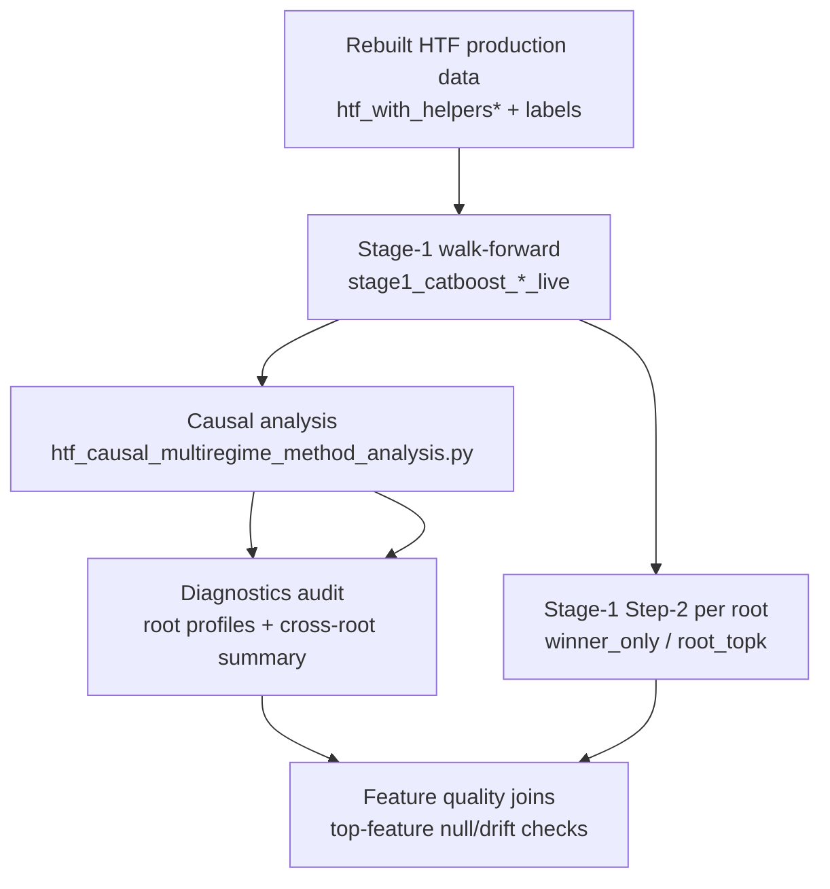

# HTF Feature-Importance Collection - Before vs After Runtime Update

Date: 2026-04-19

## Purpose

This note explains:
- how feature importance and related diagnostics data are collected **currently**
- what exact data products are created
- how the proposed **runtime-only Stage-1 update** affects that collection
- a clear **before vs after** comparison table

This note assumes the safe update path only:
- faster Stage-1 execution
- no intended change to predictive semantics
- no intended change to diagnostics semantics

Primary code paths:
- [htf_stage1_regime_family_walkforward.py](/media/przem/linux_data/RiskYieldMM%20%28Copy%29/scripts/analysis/htf_stage1_regime_family_walkforward.py)
- [stage1_runner.py](/media/przem/linux_data/RiskYieldMM%20%28Copy%29/scripts/htf_backtest/catboost/stage1_runner.py)
- [htf_causal_multiregime_method_analysis.py](/media/przem/linux_data/RiskYieldMM%20%28Copy%29/scripts/analysis/htf_causal_multiregime_method_analysis.py)
- [htf_walkforward_diagnostics.py](/media/przem/linux_data/RiskYieldMM%20%28Copy%29/scripts/analysis/htf_walkforward_diagnostics.py)
- [stage1_step2.py](/media/przem/linux_data/RiskYieldMM%20%28Copy%29/scripts/htf_backtest/catboost/stage1_step2.py)

Related notes:
- [htf_stage1_current_behavior_and_improvement_plan_2026-04-19.md](/media/przem/linux_data/RiskYieldMM%20%28Copy%29/notebooks/notes/htf_stage1_current_behavior_and_improvement_plan_2026-04-19.md)
- [htf_stage1_runtime_update_design_2026-04-19.md](/media/przem/linux_data/RiskYieldMM%20%28Copy%29/notebooks/notes/htf_stage1_runtime_update_design_2026-04-19.md)
- [htf_walkforward_workflow_audit_2026-04-19.md](/media/przem/linux_data/RiskYieldMM%20%28Copy%29/notebooks/notes/htf_walkforward_workflow_audit_2026-04-19.md)

## End-To-End Collection Flow

## What Gets Collected Today

Collection happens in three layers.

### 1. Stage-1 walk-forward data

Produced under:
- `data/htf_backtest_results/stage1_catboost_*_live`

Per step, Stage-1 writes:
- `stage1_step_summary.json`
- `stage1_combo_index.parquet`
- `stage1_fold_windows.parquet`
- `stage1_val_predictions.parquet`
- `stage1_pred_batch_predictions.parquet`
- `stage1_probe_log.parquet`
- `stage1_predecision_context.json`
- `stage1_predecision_context.parquet`
- `stage1_runtime_profile.json`

This is the raw source for:
- per-step winner selection
- per-combo pred-batch predictions
- fold plans and combo metadata
- later Step-2 feature-importance analysis

### 2. Causal multiregime analysis data

Produced by:
- [htf_causal_multiregime_method_analysis.py](/media/przem/linux_data/RiskYieldMM%20%28Copy%29/scripts/analysis/htf_causal_multiregime_method_analysis.py)

It rebuilds:
- winner/combo-match payloads
- safe ensemble method scores
- per-root method rankings

Used by diagnostics to compute:
- best full-coverage method
- best reduced-coverage method
- gain vs direct baseline
- causal root summaries

### 3. Diagnostics + Step-2 feature-importance data

Produced by:
- [htf_walkforward_diagnostics.py](/media/przem/linux_data/RiskYieldMM%20%28Copy%29/scripts/analysis/htf_walkforward_diagnostics.py)

Top-level diagnostics outputs:
- `workflow_manifest.json`
- `root_profiles.csv/json/parquet`
- `cross_root_summary.csv/parquet`
- `causal_method_refresh.csv/parquet`
- `base_model_diagnostics.csv/parquet`

Then for each selected phase:
- `winner_only`
- `root_topk`

and for each selected feature-importance type:
- `PredictionValuesChange`
- `LossFunctionChange`

the script calls:
- `run_stage1_step2_feature_pruning(...)`

in [stage1_step2.py](/media/przem/linux_data/RiskYieldMM%20%28Copy%29/scripts/htf_backtest/catboost/stage1_step2.py).

## How Feature Importance Is Collected Today

### Step 1. Select the scope

Diagnostics chooses one of:
- `winner_only`
- `root_topk`

Meaning:
- `winner_only`: only the current step winner combo is analyzed
- `root_topk`: a root-level shortlist of action keys is analyzed

### Step 2. Synchronize prediction batches

`stage1_step2.py` synchronizes over the common Stage-1 step set:
- it scans Stage-1 unit directories
- finds the common prediction batches across units
- iterates those in causal walk-forward order

This is important because the feature-importance pass is aligned to the same Stage-1 step coverage.

### Step 3. Process each selected step and combo

For each selected step:
- load Stage-1 combo metadata
- load pred-batch payloads
- keep only the selected combo scope
- reconstruct the fold plan
- run recursive SHAP-based feature selection / pruning logic

The current Step-2 selector path is:
- `feature_selector_method = recursive_shap`

### Step 4. Record per-step importance rows

Step-2 records:
- per-feature importance values
- whether the feature was selected on the step
- per-fold selector outputs
- baseline vs filtered performance for the combo

### Step 5. Aggregate across steps

For each combo and unit, Step-2 aggregates into:
- feature stability summaries
- noisy-feature summaries
- top features by combo
- baseline vs filtered root comparison
- action key ranking

## Step-2 Artifacts Collected Today

Per unit, the key outputs are:
- `step2_summary.json`
- `step2_step_winners.parquet`
- `step2_step_debug.parquet`
- `step2_combo_debug.parquet`
- `step2_action_key_ranking.parquet`
- `step2_baseline_vs_filtered_root.parquet`
- `step2_feature_importance_stability.parquet`
- `step2_feature_noise_summary.parquet`
- `step2_top_features_by_combo.parquet`

Per combo, additional artifacts include:
- baseline step metrics
- feature importance steps
- selector fold outputs
- selected features per step
- feature selection summary
- filtered steps
- baseline vs filtered comparison
- feature mask JSON

Then diagnostics adds a second join layer:
- `_feature_quality_rows(...)` in [htf_walkforward_diagnostics.py](/media/przem/linux_data/RiskYieldMM%20%28Copy%29/scripts/analysis/htf_walkforward_diagnostics.py)

That enriches top features with:
- null information
- drift flags
- feature quality metadata from production feature roots

## What “All Data” Means In This Context

When we say “all feature-importance and diagnostics data”, that means:

### Core predictive context
- Stage-1 winners
- Stage-1 combo predictions
- Stage-1 fold plans
- common evaluation batch set

### Causal method context
- per-root causal method scores
- direct baseline comparisons
- full-coverage vs reduced-coverage method rankings

### Step-2 feature-importance context
- per-feature importance values
- per-step selected/not-selected state
- per-combo feature rankings
- baseline-vs-filtered deltas
- feature stability and noise summaries

### Production feature quality context
- feature null rates
- drift risk
- root-level feature quality joins

## Before vs After Table

The proposed update is the safe runtime-only Stage-1 update described in:
- [htf_stage1_runtime_update_design_2026-04-19.md](/media/przem/linux_data/RiskYieldMM%20%28Copy%29/notebooks/notes/htf_stage1_runtime_update_design_2026-04-19.md)

### Comparison

| Area | Before update | After safe runtime-only update |
| --- | --- | --- |
| Stage-1 roots | Same 6 roots | Same 6 roots |
| Stage-1 `n_steps` | Unchanged | Unchanged |
| Stage-1 candidate grid | Same effective base 8-combo grid | Same intended grid |
| Stage-1 winner logic | Same | Same |
| Stage-1 artifact schema | Current schema | Must remain unchanged |
| Causal analysis inputs | Stage-1 outputs | Same Stage-1 outputs, regenerated faster |
| Diagnostics top-level outputs | `workflow_manifest`, `root_profiles`, `cross_root_summary`, `causal_method_refresh`, `base_model_diagnostics` | Same |
| Step-2 phases | `winner_only`, `root_topk` | Same |
| FI types | `PredictionValuesChange`, `LossFunctionChange` | Same |
| Per-unit Step-2 artifacts | Same set of parquet/json outputs | Same set |
| Feature quality join | Same logic | Same logic |
| Data collected for FI | Same steps, same combos, same per-feature importance rows, same aggregation logic | Intended to be identical |
| Runtime | Current slower path | Faster Stage-1 runtime |
| Semantic expectation | Current behavior | Same results if update is correct |

## What Is Supposed To Change

Only runtime-related internals:
- higher exact cache reuse inside Stage-1
- less redundant repeated fold training
- optional reduction of dead overhead around inactive probe logic

Operational consequence:
- Stage-1 finishes sooner
- causal rerun can start sooner
- diagnostics start sooner

## What Is Not Supposed To Change

These must remain stable under the safe update:
- Stage-1 winners
- Stage-1 pred-batch predictions
- causal method rankings
- Step-2 selected step set
- Step-2 feature-importance values
- Step-2 aggregated artifact semantics
- downstream diagnostic conclusions

If any of those change materially, then the update is no longer runtime-only and must be treated as a behavior change.

## How We Will Verify Before vs After

### Runtime comparison

We compare:
- total Stage-1 runtime per root
- average step runtime
- median step runtime
- cache hits / misses

### Semantic parity comparison

We compare before vs after:
- `stage1_step_summary.json` winners
- `stage1_pred_batch_predictions.parquet`
- causal method summaries
- diagnostics top-level summaries
- Step-2 outputs for a controlled test root:
  - `step2_feature_importance_stability.parquet`
  - `step2_feature_noise_summary.parquet`
  - `step2_top_features_by_combo.parquet`
  - `step2_baseline_vs_filtered_root.parquet`

Acceptance standard for the safe update:
- runtime improves
- outputs are identical or numerically equivalent

## Practical Bottom Line

Feature importance and all related diagnostics data are currently collected **after**:
1. rebuilt production HTF artifacts,
2. Stage-1 walk-forward,
3. causal method analysis,
4. Step-2 feature pruning/importance passes.

The proposed first update does **not** change what we collect.

It changes only:
- how efficiently Stage-1 gets us to the same downstream collection point

So the intended before/after story is:
- **same data collected**
- **same feature-importance semantics**
- **less runtime to collect it**
