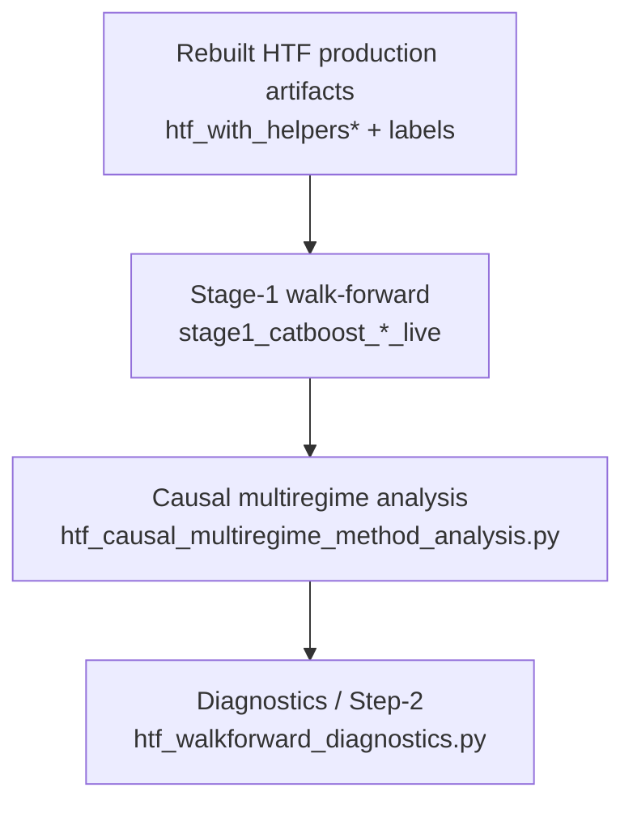
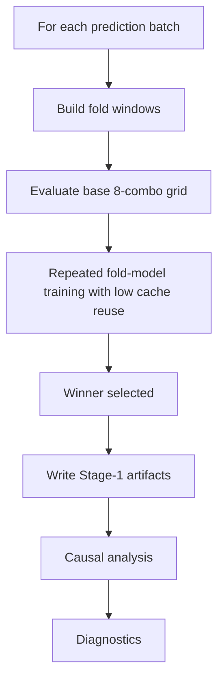
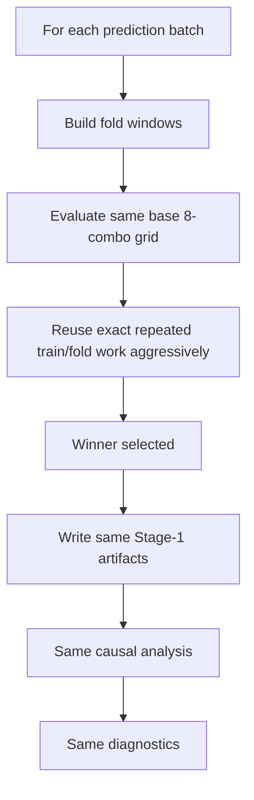

# HTF Stage-1 Runtime Update Design

Date: 2026-04-19

## Purpose

This document describes the proposed **runtime-only Stage-1 update** for the HTF CatBoost walk-forward workflow.

It covers:
- how the workflow works now
- what exactly is expensive today
- what will change after the update
- what will **not** change
- how this affects downstream causal analysis and `htf_walkforward_diagnostics.py`
- how we will verify that the update improves speed without weakening the evaluation

This note is intentionally about the **safe update path first**:
- improve runtime
- preserve semantics
- preserve generalization estimate

It does **not** propose changing `n_steps`, reducing roots, or changing the search policy yet.

Related notes:
- [htf_stage1_current_behavior_and_improvement_plan_2026-04-19.md](/media/przem/linux_data/RiskYieldMM%20%28Copy%29/notebooks/notes/htf_stage1_current_behavior_and_improvement_plan_2026-04-19.md)
- [htf_walkforward_workflow_audit_2026-04-19.md](/media/przem/linux_data/RiskYieldMM%20%28Copy%29/notebooks/notes/htf_walkforward_workflow_audit_2026-04-19.md)
- [htf_workflow_readme_diagram_2026-04-14.md](/media/przem/linux_data/RiskYieldMM%20%28Copy%29/notebooks/notes/htf_workflow_readme_diagram_2026-04-14.md)

Primary code paths:
- [htf_stage1_regime_family_walkforward.py](/media/przem/linux_data/RiskYieldMM%20%28Copy%29/scripts/analysis/htf_stage1_regime_family_walkforward.py)
- [stage1_runner.py](/media/przem/linux_data/RiskYieldMM%20%28Copy%29/scripts/htf_backtest/catboost/stage1_runner.py)
- [htf_causal_multiregime_method_analysis.py](/media/przem/linux_data/RiskYieldMM%20%28Copy%29/scripts/analysis/htf_causal_multiregime_method_analysis.py)
- [htf_walkforward_diagnostics.py](/media/przem/linux_data/RiskYieldMM%20%28Copy%29/scripts/analysis/htf_walkforward_diagnostics.py)

## Current End-To-End Shape

The current analysis stack is:



### Meaning of each layer

#### 1. Stage-1 walk-forward

This is the main predictive evaluation.

It answers:
- how well the root performs in causal walk-forward conditions
- which combo wins each step
- what raw per-step predictions exist for later analysis

This is the **generalization anchor**.

#### 2. Causal multiregime analysis

This rebuilds safe no-lookahead ensemble-method comparisons on top of the Stage-1 outputs.

It answers:
- which causal method works best per root
- how much lift exists over direct baselines
- which method is best at full coverage vs reduced coverage

#### 3. Diagnostics / Step-2

This runs interpretability and pruning work on top of Stage-1 and causal outputs.

It answers:
- winner-only feature importance
- root-topk feature importance
- feature stability
- top feature quality
- winner-vs-near-winner overlap

This layer is expensive, but it is **not** the core generalization estimate.

## What Stage-1 Does Now

Current behavior from live runs:
- 6 roots:
  - `8h/B`
  - `8h/C`
  - `24h/B`
  - `24h/C`
  - `7d/B`
  - `7d/C`
- timeframe: `1m`
- target: `target_4class`
- GPU CatBoost
- current effective combo count per step: `8`
- current probe candidates evaluated: `0.0` average on all roots
- current dynamic combo registry: empty

So although the code supports adaptive probing and dynamic promotion, the live runs are effectively evaluating a **fixed 8-combo base grid** at each step.

## What Is Expensive Today

The dominant cost is repeated fold-CV combo training inside Stage-1.

Observed sample step:
- combos: `8`
- fold windows: `21`
- cache hits: `2`
- cache misses: `19`
- runtime: about `15.5s`

Observed live average step runtimes:
- `8h`: about `15.6s` to `16.2s`
- `24h`: about `21.6s` to `21.9s`
- `7d`: about `63.4s` to `65.1s`

So the current runtime is driven by:

```text
steps
  x active combos
  x fold windows
  x CatBoost train/eval
```

The current bottleneck is **not** a large search universe.

## Current Problems

### 1. Cache reuse is weak

The sample step shows only:
- `2` hits
- `19` misses

That means overlapping training/fold structure is not being exploited enough.

### 2. Probe system is effectively inactive

The current live runs show:
- `probe_candidates_evaluated = 0`
- `probe_tiers_run = 0`
- empty dynamic registry

So the code supports a more adaptive process than the live workflow is actually using.

### 3. High unresolved-rate reporting with no effective adaptive follow-through

Many steps are `quality_unresolved`, especially on `24h`, but the probe path is not actually evaluating extra candidates in current live runs.

So complexity exists without practical benefit.

## Update Goal

The first update should:
- reduce runtime
- preserve Stage-1 semantics
- preserve current artifact contract
- preserve downstream compatibility

The update should **not**:
- reduce `n_steps`
- remove roots from evaluation
- change the base combo grid
- change the quality threshold
- change the current winner selection rule
- change output schemas used by downstream scripts

## Proposed Update Scope

### Update Type

This is a **runtime-only safe update**.

That means:
- same inputs
- same walk-forward batch sequence
- same combo universe
- same model settings
- same winner selection
- same output files and downstream consumers

The only intended difference is:
- lower wall time
- lower redundant compute

## How It Works Now vs After

### Current behavior



### Proposed behavior



The key point:
- **current evaluation logic stays the same**
- **internal compute reuse improves**

## Exact Proposed Changes

### A. Improve exact-key model cache reuse inside Stage-1

Target:
- [stage1_runner.py](/media/przem/linux_data/RiskYieldMM%20%28Copy%29/scripts/htf_backtest/catboost/stage1_runner.py)

Goal:
- reuse model training outputs whenever the training slice, fold definition, features, target, and CatBoost parameters are identical

What should be cached with exact keys:
- timeframe
- target
- pred batch
- train window boundaries
- fold definition
- feature target / source
- CatBoost params
- combo definition when it changes the trained slice

What must remain exact:
- same rows
- same labels
- same features
- same parameter set

If the key is exact, cache reuse is a runtime optimization only.

### B. Make the inactive probe path optional for routine runs

Current live evidence says the probe path is not contributing.

So the update should support an explicit operational distinction:

1. **Full adaptive mode**
- keep current probe hooks enabled for experiments

2. **Routine evaluation mode**
- skip inactive probe/promotion path when it is not contributing

Important:
- if probe stays effectively inactive, disabling it for routine runs should not change results
- this should be validated empirically before making it the default

### C. Keep artifact schema stable

Downstream tools currently rely on:
- Stage-1 batch directories
- `stage1_step_summary.json`
- `stage1_combo_index.parquet`
- `stage1_pred_batch_predictions.parquet`
- run-level `run_summary.json`
- `stage1_run_state.json`

This update should not change those file names or required fields.

## What Will Not Change

After the safe update:

### Stage-1 should still produce
- the same root run directories
- the same step-level artifacts
- the same winner selection behavior
- the same walk-forward coverage

### Causal analysis should still read
- the same Stage-1 run IDs
- the same winner/combo-match payload structure

### `htf_walkforward_diagnostics.py` should still read
- the same Stage-1 outputs
- the same causal run outputs
- and produce the same diagnostics semantics

So if the update is implemented correctly:
- `htf_causal_multiregime_method_analysis.py` does not need semantic changes
- `htf_walkforward_diagnostics.py` does not need semantic changes

## What Will Change

Only these things should change:
- lower Stage-1 wall time
- higher cache hit rate
- lower redundant fold training
- potentially less dead overhead around inactive probing

Possible visible artifact differences:
- runtime values in step summaries
- cache hit/miss counts
- maybe probe log content if routine mode disables dead probing

But these should **not** change:
- winner combo
- prediction rows
- direct performance metrics
- causal method ranking
- diagnostics conclusions

## Effect On `htf_walkforward_diagnostics.py`

### Before update

`htf_walkforward_diagnostics.py` spends time on:
- `audit`
- `winner_only`
- `root_topk`
- both FI types:
  - `PredictionValuesChange`
  - `LossFunctionChange`

It reads:
- Stage-1 outputs
- causal run summary
- then runs Step-2 feature pruning/importance loops

### After the safe update

The script should work the same way.

What changes operationally:
- Stage-1 finishes sooner
- causal rerun can start sooner
- diagnostics can start sooner

What does **not** change:
- CLI contract
- output shape
- interpretation logic
- root-level semantics

## Effect On `htf_causal_multiregime_method_analysis.py`

The causal analysis should not need semantic changes.

It should continue to:
- rebuild winner/combo-match artifacts
- compare safe no-lookahead ensemble methods
- write the same summary structure

If Stage-1 predictions are unchanged, the causal analysis outputs should also remain unchanged apart from timestamps and regenerated files.

## Validation Plan

The update must be validated in two layers.

### 1. Runtime validation

Measure before vs after:
- total runtime per root
- average step runtime
- median step runtime
- cache hits / misses
- GPU utilization if available

Acceptance:
- meaningful wall-time reduction
- no stability regressions

### 2. Semantic parity validation

Compare before vs after on a controlled rerun:
- winner combo per step
- winner accuracy per step
- pred-batch predictions
- run-level summary metrics
- causal method rankings

Acceptance:
- identical or numerically equivalent outputs for the safe runtime-only update

If parity breaks, then the change is not runtime-only and must be treated as a behavior change.

## Risks

### Risk 1. Cache key too coarse

If cache keys omit any material training distinction, the update can silently change results.

Mitigation:
- use exact keys
- add parity tests

### Risk 2. Probe disablement hides a real edge case

If probing is inactive on recent runs but still matters in rare cases, disabling it globally could change results later.

Mitigation:
- make it configurable first
- compare a small A/B run before defaulting it off

### Risk 3. Downstream artifact coupling

Any artifact schema drift will break causal analysis or diagnostics.

Mitigation:
- preserve file names and required fields
- add schema checks

## Out Of Scope For This Update

These are **not** part of the first safe runtime update:
- reducing `n_steps`
- changing the quality threshold
- changing candidate triplet selection
- making adaptive probing more aggressive
- changing the winner ranking metric
- changing Step-2 feature importance behavior

Those are behavior-changing experiments and should be treated separately.

## Recommended Implementation Order

1. Add exact runtime instrumentation summary for Stage-1 cache behavior.
2. Improve exact-key cache reuse in [stage1_runner.py](/media/przem/linux_data/RiskYieldMM%20%28Copy%29/scripts/htf_backtest/catboost/stage1_runner.py).
3. Add a configurable routine mode for the inactive probe path.
4. Run a parity rerun on one root.
5. If parity holds, roll out to all 6 roots.
6. Re-run causal analysis and diagnostics only as confirmation, not because semantics should change.

## Bottom Line

The proposed first update is:
- **a runtime optimization**
- **not a modeling change**
- **not a generalization-reducing shortcut**

After it:
- Stage-1 should finish faster
- causal analysis should work the same way
- `htf_walkforward_diagnostics.py` should work the same way
- the meaning of the results should stay the same

If we want larger speedups later, those will likely require behavior-changing decisions. That should be a separate design step, not hidden inside this runtime update.
