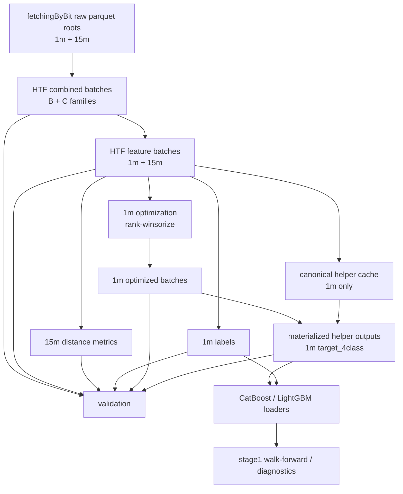
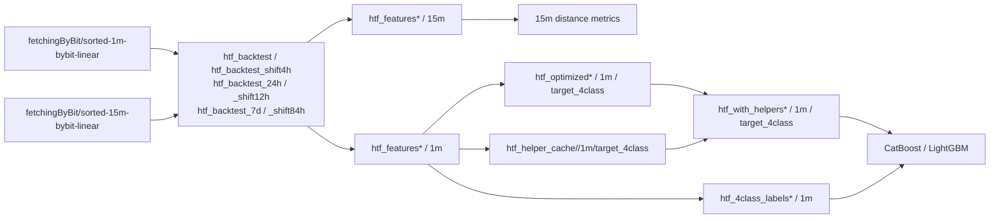

# HTF Workflow README + Diagram — 2026-04-14

## Purpose

This document describes the current production HTF workflow launched from:

- `notebooks/htf_pythonscript.py`

It explains:

- what the workflow builds
- in what order stages run
- where artifacts are written
- which modules compute each stage
- how `8h`, `24h`, `7d`, and `B` / `C` families map to directories
- how helpers and validation fit into the pipeline

This is the current operational view of the pipeline used before downstream CatBoost fitting and walk-forward analysis.

---

## Top-Level Shape



---

## Production Entrypoint

### Main launcher

- `notebooks/htf_pythonscript.py`

What it does:

- resolves repo root
- configures run logging and heartbeat files
- reloads the shared HTF pipeline module
- builds a `MultiRegimeHTFConfig`
- calls `run_multi_regime_htf_pipeline(config)`

Important boundary:

- `htf_pythonscript.py` is only the orchestrator
- actual stage logic lives in `scripts/feature_engineering/htf_multiregime_pipeline.py`

---

## Regimes And Families

### Regimes

- `8h`
- `24h`
- `7d`

### Families

- `B` = unshifted anchor
- `C` = shifted anchor by half-regime

Current anchor contract:

- `8h/B` anchor: `00:00 UTC`
- `8h/C` anchor: `04:00 UTC`
- `24h/B` anchor: `00:00 UTC`
- `24h/C` anchor: `12:00 UTC`
- `7d/B` anchor: `Monday 00:00 UTC`
- `7d/C` anchor: `Thursday 12:00 UTC`

Entry window contract:

- `8h`: first `4h`
- `24h`: first `12h`
- `7d`: first `84h`

---

## Directory Mapping

### Family B paths

`8h/B`

- combined: `data/htf_backtest`
- features: `data/htf_features`
- labels: `data/htf_4class_labels`
- optimized: `data/htf_optimized`
- helpers: `data/htf_with_helpers`

`24h/B`

- combined: `data/htf_backtest_24h`
- features: `data/htf_features_24h`
- labels: `data/htf_4class_labels_24h`
- optimized: `data/htf_optimized_24h`
- helpers: `data/htf_with_helpers_24h`

`7d/B`

- combined: `data/htf_backtest_7d`
- features: `data/htf_features_7d`
- labels: `data/htf_4class_labels_7d`
- optimized: `data/htf_optimized_7d`
- helpers: `data/htf_with_helpers_7d`

### Family C paths

`8h/C`

- combined: `data/htf_backtest_shift4h`
- features: `data/htf_features_shift4h`
- labels: `data/htf_4class_labels_shift4h`
- optimized: `data/htf_optimized_shift4h`
- helpers: `data/htf_with_helpers_shift4h`

`24h/C`

- combined: `data/htf_backtest_24h_shift12h`
- features: `data/htf_features_24h_shift12h`
- labels: `data/htf_4class_labels_24h_shift12h`
- optimized: `data/htf_optimized_24h_shift12h`
- helpers: `data/htf_with_helpers_24h_shift12h`

`7d/C`

- combined: `data/htf_backtest_7d_shift84h`
- features: `data/htf_features_7d_shift84h`
- labels: `data/htf_4class_labels_7d_shift84h`
- optimized: `data/htf_optimized_7d_shift84h`
- helpers: `data/htf_with_helpers_7d_shift84h`

---

## Canonical Execution Order

The shared pipeline runs in this order for every regime:

```text
for regime in (8h, 24h, 7d):
  build combined for B and C on 1m and 15m
  for family in (B, C):
    build features on 1m and 15m
    build 15m distance metrics
    build 1m labels
    run 1m optimization
    build 1m helpers
after all build regimes:
  run validation
```

Stage source:

- `scripts/feature_engineering/htf_multiregime_pipeline.py`
- function: `run_multi_regime_htf_pipeline`

---

## Stage-By-Stage Map

## 1. Raw Input

Source roots:

- `fetchingByBit/sorted-1m-bybit-linear`
- `fetchingByBit/sorted-15m-bybit-linear`

These are the raw parquet inputs consumed by the HTF pipeline.

Main module:

- `scripts/feature_engineering/htf_multiregime_pipeline.py`

Functions:

- `_raw_dir_for_tf`
- `_apply_raw_time_filters`

---

## 2. Combined Stage

Outputs:

- `data/htf_backtest*/*_HTF_combined.parquet`

What it computes:

- batch grouping by regime/family anchor
- canonical batch ids
- family metadata columns
- normalized batch position metadata

Important metadata columns added here:

- `period_8h_start`
- `batch_id`
- `batch_family`
- `family_batch_id`
- `family_period_start`
- `family_period_end`
- `family_bar_pos`
- `source_base_batch_id`
- `source_half_in_base`
- `bar_in_batch_norm`
- `batch_regime`
- `batch_duration_hours`
- `family_shift_hours`
- `anchor_utc`
- `entry_window_hours`

Main code:

- `_build_base_combined`
- `_build_shifted_combined`
- `_add_family_metadata`

Module:

- `scripts/feature_engineering/htf_multiregime_pipeline.py`

---

## 3. Feature Stage

Outputs:

- `data/htf_features*/1m/batch_XXXX.parquet`
- `data/htf_features*/15m/batch_XXXX.parquet`

What it computes:

- full engineered HTF feature set
- source augmentation
- rolling and transformed market-state features
- long/short, funding, basis, volatility, candlestick, trend, distance-prep features

Main modules:

- `scripts/feature_engineering/compute_htf_features.py`
- `scripts/feature_engineering/compute_features.py`

Main pipeline wrapper:

- `_build_feature_batches`

Module:

- `scripts/feature_engineering/htf_multiregime_pipeline.py`

Notes:

- `1m` and `15m` feature batches are built before labels and helpers
- current artifact versioning is controlled by `scripts/feature_engineering/htf_shared_config.py`

---

## 4. 15m Distance Metrics Stage

Outputs:

- written back into the 15m feature-stage artifacts used later by labels and downstream checks

What it computes:

- distance-to-structure metrics
- hybrid/past distance windows

Main module:

- `scripts/feature_engineering/htf_kernels.py`

Pipeline wrapper:

- `_build_15m_metrics`

Important note:

- `D_dist_bot5_low_w120` was recently fixed to use continuous causal family history rather than resetting by batch

---

## 5. 1m Labels Stage

Outputs:

- `data/htf_4class_labels*/1m/batch_XXXX.parquet`

What it computes:

- `target_4class`
- breakfree / breakout-based label fields
- valid-label gating based on entry window and future availability

Main module:

- `scripts/feature_engineering/htf_kernels.py`

Pipeline wrapper:

- `_build_1m_labels`

Important contract:

- labels are computed only for trainable / eligible rows
- early or ineligible rows remain filtered by downstream target gating

---

## 6. Optimization Stage

Outputs:

- `data/htf_optimized*/1m/target_4class/batch_XXXX.parquet`

What it computes:

- rank-winsorize optimization on early history
- selected transformation config for the feature space
- transformed model-facing feature batches

Main module:

- `scripts/feature_engineering/optimize_htf_features.py`

Pipeline wrapper:

- `_run_optimization`

Important contract:

- this stage is only for `1m / target_4class`
- it uses the feature and label roots for the same regime/family

---

## 7. Helper Cache Stage

Outputs:

- canonical cache under `data/htf_helper_cache/...`

Namespaces:

- `base_0h` for all `B` families
- `shift4h` for `8h/C`
- `shift12h` for `24h/C`
- `shift84h` for `7d/C`

What it computes:

- helper features in canonical walk-forward form
- helper state contracts for OU, Kalman, EGARCH, GARCH, CUSUM, change-point helpers
- exact helper cache batches before materialization into final model-facing outputs

Main module:

- `scripts/feature_engineering/htf_helper_cache.py`

Core functions:

- `build_helper_cache_exact`
- `get_helper_contract_metadata`

Important current contract:

- helper cache is now streaming and RAM-safe
- Kalman uses true streaming-state handoff
- EGARCH uses true streaming-state handoff
- OU was cleaned to remove early future-fill
- blocked helper columns are tracked by helper contract metadata

---

## 8. Helper Materialization Stage

Outputs:

- `data/htf_with_helpers*/1m/target_4class/batch_XXXX.parquet`

What it does:

- joins optimized model-facing features with helper outputs from cache
- applies final-output exclusion policy
- writes final CatBoost / LightGBM input artifacts
- saves helper metadata:
  - helper contract version
  - runtime contracts
  - implementation fingerprint
  - helper policy version

Main module:

- `scripts/feature_engineering/htf_helper_cache.py`

Core function:

- `materialize_helpers_from_cache`

Important contract:

- model-facing helper outputs are `1m / target_4class` only
- policy-blocked helper columns are removed here
- loader code excludes unsafe metadata again as a second safeguard

---

## 9. Validation Stage

Outputs:

- runtime validation dataframe returned by the pipeline
- run log summaries in the `htf_pythonscript` run log

What it checks:

- required columns
- batch id coverage
- row-count alignment across stages
- duplicate timestamps within batch
- nulls in key fields
- policy-excluded columns absent
- helper metadata present and current
- helper policy / helper contract version match
- helper runtime contracts match current code
- all-null / high-null / constant usability checks

Main module:

- `scripts/feature_engineering/htf_multiregime_pipeline.py`

Core function:

- `_validate_regime`

Important note:

- validation is the last stage before downstream model fitting should start

---

## Helper Internals

The helper orchestration lives in:

- `scripts/feature_engineering/htf_helper_cache.py`

The helper implementations themselves live in:

- Python fallback:
  - `scripts/target_models/helpers/*.py`
- Rust runtime:
  - `riskyield_rust/src/*.rs`

Current important helpers:

- `ou`
- `kalman`
- `egarch`
- `garch`
- `cusum`
- change-point helpers

Current implementation status:

- OU: cleaned for causal behavior
- Kalman: streaming-state helper
- EGARCH: streaming-state helper
- degenerate EGARCH parameter traces stay blocked from model-facing outputs

---

## What CatBoost Actually Reads

Downstream training does **not** read the raw feature-stage artifacts directly.

The intended CatBoost input is:

- `data/htf_with_helpers*/1m/target_4class/batch_XXXX.parquet`

with labels from:

- `data/htf_4class_labels*/1m/batch_XXXX.parquet`

Loader code:

- `scripts/htf_backtest/catboost/utils.py`

What the loader excludes:

- bookkeeping metadata such as:
  - `family_batch_id`
  - `family_bar_pos`
  - `source_base_batch_id`
- policy-blocked helper columns
- target columns not meant as features

So the final training contract is:

- optimized + helper-enriched `1m` features
- plus aligned `1m` labels
- after explicit metadata/policy exclusions

---

## End-To-End Diagram With Real Roots



---

## Rebuild / Invalidation Logic

The workflow can reuse artifacts, but rebuild behavior is controlled by:

- pipeline artifact version
- source fingerprints
- helper policy version
- helper contract version
- helper implementation fingerprint

Key config surface:

- `scripts/feature_engineering/htf_shared_config.py`
- `notebooks/htf_pythonscript.py`
- `scripts/feature_engineering/htf_helper_cache.py`

If helper or feature semantics change, the correct operational move is:

1. bump the relevant artifact version
2. force full rebuild
3. rerun validation
4. only then proceed to CatBoost fitting

---

## Practical Reading Order

If you need to understand the current production path quickly, read in this order:

1. `notebooks/htf_pythonscript.py`
2. `scripts/feature_engineering/htf_multiregime_pipeline.py`
3. `scripts/feature_engineering/compute_htf_features.py`
4. `scripts/feature_engineering/htf_kernels.py`
5. `scripts/feature_engineering/optimize_htf_features.py`
6. `scripts/feature_engineering/htf_helper_cache.py`
7. `scripts/htf_backtest/catboost/utils.py`

---

## Current Operational Summary

The HTF workflow is:

- a multi-regime batch materialization pipeline
- producing `1m` and `15m` combined + feature artifacts
- producing `1m` labels
- producing `1m` optimized model-facing features
- producing `1m` helper-enriched model-facing features
- validating all of the above before downstream model fitting

The key production handoff into CatBoost is:

- features: `data/htf_with_helpers* / 1m / target_4class`
- labels: `data/htf_4class_labels* / 1m`

That is the contract that downstream walk-forward fitting and diagnostics should treat as authoritative.
