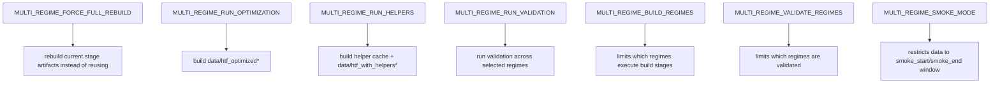

# HTF Workflow Run + Config Guide — 2026-04-14

## Purpose

This document explains how to run the HTF production workflow and how to configure it safely.

Primary launcher:

- `notebooks/htf_pythonscript.py`

Shared pipeline:

- `scripts/feature_engineering/htf_multiregime_pipeline.py`

This guide is about:

- how to start runs
- how to override build scope
- when to use incremental vs full rebuild
- how to run in background
- where logs and status files are written
- which config knobs are exposed at launcher level vs pipeline level

---

## Core Rule

There is no dedicated CLI wrapper yet.

So there are **2 valid ways** to run the workflow:

1. run `notebooks/htf_pythonscript.py` directly with its current in-file constants
2. use a small Python wrapper that imports the module, overrides the `MULTI_REGIME_*` constants, and then calls `main()`

For custom runs, the wrapper approach is the correct one.

Do **not** use `runpy` for this file. A previous attempt caused an import/runtime issue with `numba`. Use `importlib.util.spec_from_file_location(...)` instead.

---

## Default Run

This uses the current constants already defined in:

- `notebooks/htf_pythonscript.py`

Command:

```bash
cd "/media/przem/linux_data/RiskYieldMM (Copy)"
/media/przem/linux_data/conda/envs/ml_env/bin/python notebooks/htf_pythonscript.py
```

What it does by default right now:

- build regimes: `("8h", "24h", "7d")`
- validate regimes: `("8h", "24h", "7d")`
- `run_optimization = True`
- `run_helpers = True`
- `run_validation = True`
- `rebuild_existing = False`

That means:

- it will try to reuse current artifacts when fingerprints/version checks say they are current
- it will only recompute what is stale or missing

---

## Safe Override Pattern

Use this pattern whenever you need a non-default run.

```bash
cd "/media/przem/linux_data/RiskYieldMM (Copy)"

PYTHONUNBUFFERED=1 /media/przem/linux_data/conda/envs/ml_env/bin/python - <<'PY'
import importlib.util
import sys
from pathlib import Path

path = Path("notebooks/htf_pythonscript.py").resolve()
spec = importlib.util.spec_from_file_location("htf_pythonscript_runtime", path)
module = importlib.util.module_from_spec(spec)
sys.modules[spec.name] = module
spec.loader.exec_module(module)

# override here
module.MULTI_REGIME_BUILD_REGIMES = ("7d",)
module.MULTI_REGIME_VALIDATE_REGIMES = ("7d",)
module.MULTI_REGIME_FORCE_FULL_REBUILD = True
module.MULTI_REGIME_RUN_OPTIMIZATION = True
module.MULTI_REGIME_RUN_HELPERS = True
module.MULTI_REGIME_RUN_VALIDATION = True

raise SystemExit(module.main())
PY
```

This is the recommended pattern because it:

- loads the real production file
- keeps the production logging behavior
- avoids a separate shadow launcher
- lets you override only the parts you actually need

---

## Most Useful Run Modes

## 1. Full all-regime rebuild

Use this when:

- feature formulas changed
- helper implementation changed
- helper contract changed
- artifact version was bumped

Command:

```bash
cd "/media/przem/linux_data/RiskYieldMM (Copy)"

PYTHONUNBUFFERED=1 /media/przem/linux_data/conda/envs/ml_env/bin/python - <<'PY'
import importlib.util
import sys
from pathlib import Path

path = Path("notebooks/htf_pythonscript.py").resolve()
spec = importlib.util.spec_from_file_location("htf_pythonscript_runtime", path)
module = importlib.util.module_from_spec(spec)
sys.modules[spec.name] = module
spec.loader.exec_module(module)

module.MULTI_REGIME_BUILD_REGIMES = ("8h", "24h", "7d")
module.MULTI_REGIME_VALIDATE_REGIMES = ("8h", "24h", "7d")
module.MULTI_REGIME_FORCE_FULL_REBUILD = True
module.MULTI_REGIME_RUN_OPTIMIZATION = True
module.MULTI_REGIME_RUN_HELPERS = True
module.MULTI_REGIME_RUN_VALIDATION = True

raise SystemExit(module.main())
PY
```

---

## 2. Single-regime rebuild

Useful for:

- fixing only one regime after interruption
- validating one regime before full downstream retrain

Example: `7d` only

```bash
cd "/media/przem/linux_data/RiskYieldMM (Copy)"

PYTHONUNBUFFERED=1 /media/przem/linux_data/conda/envs/ml_env/bin/python - <<'PY'
import importlib.util
import sys
from pathlib import Path

path = Path("notebooks/htf_pythonscript.py").resolve()
spec = importlib.util.spec_from_file_location("htf_pythonscript_runtime", path)
module = importlib.util.module_from_spec(spec)
sys.modules[spec.name] = module
spec.loader.exec_module(module)

module.MULTI_REGIME_BUILD_REGIMES = ("7d",)
module.MULTI_REGIME_VALIDATE_REGIMES = ("7d",)
module.MULTI_REGIME_FORCE_FULL_REBUILD = True
module.MULTI_REGIME_RUN_OPTIMIZATION = True
module.MULTI_REGIME_RUN_HELPERS = True
module.MULTI_REGIME_RUN_VALIDATION = True

raise SystemExit(module.main())
PY
```

---

## 3. Validation-only pass

Use this when:

- artifacts already exist
- you want to verify readiness without rebuilding

Command:

```bash
cd "/media/przem/linux_data/RiskYieldMM (Copy)"

PYTHONUNBUFFERED=1 /media/przem/linux_data/conda/envs/ml_env/bin/python - <<'PY'
import importlib.util
import sys
from pathlib import Path

path = Path("notebooks/htf_pythonscript.py").resolve()
spec = importlib.util.spec_from_file_location("htf_pythonscript_runtime", path)
module = importlib.util.module_from_spec(spec)
sys.modules[spec.name] = module
spec.loader.exec_module(module)

module.MULTI_REGIME_BUILD_REGIMES = ()
module.MULTI_REGIME_VALIDATE_REGIMES = ("8h", "24h", "7d")
module.MULTI_REGIME_FORCE_FULL_REBUILD = False
module.MULTI_REGIME_RUN_OPTIMIZATION = False
module.MULTI_REGIME_RUN_HELPERS = False
module.MULTI_REGIME_RUN_VALIDATION = True

raise SystemExit(module.main())
PY
```

Important note:

- setting `build_regimes = ()` skips build stages
- validation still runs on `validate_regimes`

---

## 4. Build without helpers

Useful for debugging feature/label stages in isolation.

```bash
cd "/media/przem/linux_data/RiskYieldMM (Copy)"

PYTHONUNBUFFERED=1 /media/przem/linux_data/conda/envs/ml_env/bin/python - <<'PY'
import importlib.util
import sys
from pathlib import Path

path = Path("notebooks/htf_pythonscript.py").resolve()
spec = importlib.util.spec_from_file_location("htf_pythonscript_runtime", path)
module = importlib.util.module_from_spec(spec)
sys.modules[spec.name] = module
spec.loader.exec_module(module)

module.MULTI_REGIME_BUILD_REGIMES = ("8h",)
module.MULTI_REGIME_VALIDATE_REGIMES = ("8h",)
module.MULTI_REGIME_FORCE_FULL_REBUILD = True
module.MULTI_REGIME_RUN_OPTIMIZATION = True
module.MULTI_REGIME_RUN_HELPERS = False
module.MULTI_REGIME_RUN_VALIDATION = True

raise SystemExit(module.main())
PY
```

---

## 5. Smoke run on restricted date range

Use this for:

- code smoke checks
- short runtime verification
- helper/feature pipeline testing

```bash
cd "/media/przem/linux_data/RiskYieldMM (Copy)"

PYTHONUNBUFFERED=1 /media/przem/linux_data/conda/envs/ml_env/bin/python - <<'PY'
import importlib.util
import sys
from datetime import datetime
from pathlib import Path

path = Path("notebooks/htf_pythonscript.py").resolve()
spec = importlib.util.spec_from_file_location("htf_pythonscript_runtime", path)
module = importlib.util.module_from_spec(spec)
sys.modules[spec.name] = module
spec.loader.exec_module(module)

module.MULTI_REGIME_BUILD_REGIMES = ("8h",)
module.MULTI_REGIME_VALIDATE_REGIMES = ("8h",)
module.MULTI_REGIME_FORCE_FULL_REBUILD = True
module.MULTI_REGIME_SMOKE_MODE = True
module.MULTI_REGIME_SMOKE_START = datetime(2026, 1, 1)
module.MULTI_REGIME_SMOKE_END = datetime(2026, 2, 1)

raise SystemExit(module.main())
PY
```

---

## Run In Background With `systemd-run`

This is the safest way to launch long runs outside the editor session.

Example:

```bash
systemd-run --user \
  --unit codex-htf-full-rebuild-$(date +%Y%m%d_%H%M%S) \
  --same-dir \
  --property=WorkingDirectory="/media/przem/linux_data/RiskYieldMM (Copy)" \
  /bin/bash -lc '
    cd "/media/przem/linux_data/RiskYieldMM (Copy)" &&
    export PYTHONUNBUFFERED=1 &&
    /media/przem/linux_data/conda/envs/ml_env/bin/python notebooks/htf_pythonscript.py
  '
```

Then monitor with:

```bash
systemctl --user --no-pager --full status <unit-name>.service
```

---

## Monitoring

Every run writes:

- a log file
- a status JSON file

Location:

- `test_output/htf_run_logs/`

Pattern:

- log: `htf_pythonscript_<timestamp>_pid<PID>.log`
- status: `htf_pythonscript_<timestamp>_pid<PID>_status.json`

Useful commands:

```bash
tail -f test_output/htf_run_logs/htf_pythonscript_<RUN>.log
```

```bash
watch -n 5 'cat test_output/htf_run_logs/htf_pythonscript_<RUN>_status.json'
```

What the status file tells you:

- current stage
- stage detail
- run elapsed time
- stage elapsed time
- silence time
- log/status paths

---

## Launcher-Level Config

These are the main knobs in:

- `notebooks/htf_pythonscript.py`

### `RUN_MULTI_REGIME_EXTENSION`

Source:

- env var `HTF_RUN_MULTI_REGIME_EXTENSION`

Meaning:

- `True`: run the shared pipeline
- `False`: disable execution

### `MULTI_REGIME_BUILD_REGIMES`

Examples:

- `("8h", "24h", "7d")`
- `("7d",)`
- `()`

Meaning:

- which regimes should execute build stages

### `MULTI_REGIME_VALIDATE_REGIMES`

Meaning:

- which regimes should be validated at the end
- if `None`, validation falls back to `build_regimes`

### `MULTI_REGIME_FORCE_FULL_REBUILD`

Meaning:

- `True`: do not trust existing stage artifacts; rebuild
- `False`: allow incremental/current reuse when fingerprints permit

Use `True` when:

- feature formulas changed
- helper implementation changed
- policy/contract changed
- artifact version changed

### `MULTI_REGIME_SMOKE_MODE`

Meaning:

- enable restricted time-window processing using `MULTI_REGIME_SMOKE_START` and `MULTI_REGIME_SMOKE_END`

### `MULTI_REGIME_RUN_OPTIMIZATION`

Meaning:

- whether to build `data/htf_optimized*`

### `MULTI_REGIME_RUN_HELPERS`

Meaning:

- whether to build helper cache and final `data/htf_with_helpers*`

### `MULTI_REGIME_RUN_VALIDATION`

Meaning:

- whether to run `_validate_regime(...)` after build stages

### Shared constants imported from `htf_shared_config.py`

- `MULTI_REGIME_PIPELINE_ARTIFACT_VERSION`
- `MULTI_REGIME_THRESHOLDS_BY_TF`
- `MULTI_REGIME_DISTANCE_WINDOWS_BY_TF`
- `MULTI_REGIME_BREAKOUT_THRESHOLD`
- `MULTI_REGIME_RISK_RATIO`
- `MULTI_REGIME_BREAKFREE_THRESHOLD_1M`

These are the high-level artifact / labeling / distance defaults used by the production launcher.

---

## Lower-Level Pipeline Config

These live in:

- `scripts/feature_engineering/htf_multiregime_pipeline.py`
- dataclass: `MultiRegimeHTFConfig`

These are not all exposed directly by top-level constants, but they are available if you instantiate the pipeline manually or extend the launcher.

Most important fields:

### Artifact / rebuild behavior

- `pipeline_artifact_version`
- `rebuild_existing`
- `force_recreate_combined`
- `min_raw_lead_hours_for_update`

### Incremental behavior

- `feature_incremental_update`
- `feature_incremental_overlap_batches_by_tf`
- `feature_context_batches_by_tf`
- `incremental_distance_metrics`
- `incremental_distance_tail_batches_by_tf`
- `incremental_label_update`
- `incremental_label_tail_batches_by_tf`
- `incremental_helpers_skip_unchanged`
- `incremental_helper_cache_update`
- `helper_overlap_batches_by_tf`
- `helper_cache_overlap_batches_by_tf`

### Helper behavior

- `use_canonical_helper_cache`
- `helper_cache_dir`
- `helper_warmup_by_tf`
- `helper_refit_every_by_tf`
- `write_helpers_combined`

### Audit / validation behavior

- `usability_audit_enabled`
- `usability_audit_null_rate_threshold`
- `usability_audit_report_top_n`
- `usability_audit_helper_prefix_batches`
- `usability_audit_fail_on_all_null`
- `usability_audit_fail_on_high_null`
- `usability_audit_fail_on_constant`

### Time filtering

- `date_start`
- `date_end`
- `smoke_mode`
- `smoke_start`
- `smoke_end`

---

## What Each Main Switch Changes



---

## When To Use Full Rebuild

Use full rebuild when any of these changed:

- feature formulas
- helper implementation
- helper contract
- output policy
- labeling semantics
- distance metric semantics
- artifact version

Examples from recent work:

- helper contract changes
- Kalman / EGARCH redesign
- pre-fit null fixes
- artifact invalidation bump

If any of those changed, incremental mode is not enough.

---

## When Incremental Mode Is Appropriate

Incremental mode is fine when:

- only new raw data arrived
- existing feature/helper semantics are unchanged
- artifact version is unchanged
- validation on prior artifacts already passed

In that case:

- keep `MULTI_REGIME_FORCE_FULL_REBUILD = False`
- allow the pipeline fingerprints to decide what to update

---

## Typical Operator Playbooks

## A. Normal production refresh

- run default launcher
- keep incremental mode
- keep optimization/helpers/validation enabled

## B. After feature/helper code changes

- bump relevant artifact version if needed
- run forced full rebuild
- run validation
- only then proceed to model fitting

## C. After interrupted regime-specific run

- rerun only the affected regime with `MULTI_REGIME_BUILD_REGIMES = ("<regime>",)`
- keep validation on for that regime

## D. Pre-fit gate check

- run validation-only if artifacts are already built
- or run the external readiness audit script after rebuild

---

## Recommended Commands

### Default

```bash
cd "/media/przem/linux_data/RiskYieldMM (Copy)"
/media/przem/linux_data/conda/envs/ml_env/bin/python notebooks/htf_pythonscript.py
```

### Full rebuild all regimes

Use the wrapper pattern above with:

- `MULTI_REGIME_FORCE_FULL_REBUILD = True`
- `MULTI_REGIME_BUILD_REGIMES = ("8h", "24h", "7d")`

### Validation only

Use the wrapper pattern above with:

- `MULTI_REGIME_BUILD_REGIMES = ()`
- `MULTI_REGIME_VALIDATE_REGIMES = ("8h", "24h", "7d")`
- `MULTI_REGIME_RUN_OPTIMIZATION = False`
- `MULTI_REGIME_RUN_HELPERS = False`
- `MULTI_REGIME_RUN_VALIDATION = True`

---

## What This Launcher Does Not Yet Provide

Current limitations:

- no argparse/CLI flags
- no dedicated YAML/TOML config file
- no single command-line switch for selective stage execution

So the practical configuration mechanism today is:

- edit the top-level constants in `htf_pythonscript.py`
- or use the import wrapper override pattern

If this becomes a frequent operational path, the correct next improvement would be:

- add a proper CLI wrapper around `MultiRegimeHTFConfig`

---

## Bottom Line

Use:

- `notebooks/htf_pythonscript.py` for normal production execution
- the `importlib` wrapper pattern for any non-default run
- `systemd-run --user` for long background jobs

And choose:

- incremental mode for raw-data refreshes
- full rebuild mode whenever feature/helper semantics changed

That is the current safe operational contract for running and configuring the HTF workflow.
