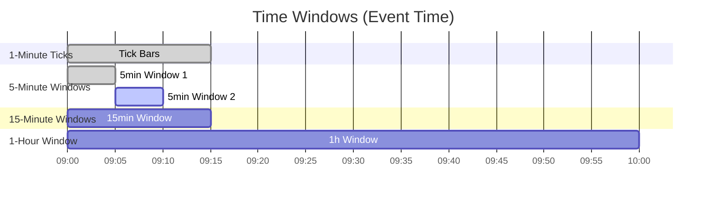

# Executive Summary  
Integrating multi-timeframe context into a 1-minute tick stream means enriching each tick with features computed over longer intervals (5m, 15m, 1h, 4h, etc.).  This layered context helps models capture both fast intraday dynamics and slower trends【16†L233-L238】【39†L313-L322】.  The key challenge is **real-time aggregation**: computing rolling statistics, volumes, and indicators as new ticks arrive, while managing latency and consistency.  We outline data requirements (tick vs. OHLC formats, handling missing/late data, timezone alignment), the types of features to compute (OHLC bars, VWAP, ATR, volatility, moving averages, momentum, order-flow metrics, session stats, etc.), and streaming algorithms to maintain them (sliding/tumbling windows, online updates, exponential decay, reservoir sampling).  We compare architectures (e.g. Kafka+Flink, Spark Streaming, Kafka Streams, in-memory caches, serverless functions) and detail pseudocode for incremental updates.  We analyze trade-offs (CPU/memory/latency) and discuss synchronization (event-time, watermarks, exactly-once semantics【39†L240-L249】【26†L506-L515】).  Backfill strategies (batch recompute) and production monitoring (drift, stale features) are also covered.  We recommend proven libraries (Apache Flink/Beam for stateful stream windows, Kafka/PubSub for ingestion, Redis/Feast for feature storage, Polars for fast in-memory table ops) and reference seminal sources (including recent research and official docs).  Tables summarize options and comparative trade-offs, and mermaid diagrams illustrate pipeline architecture and multi-timeframe windows.  

## Definitions and Objectives  
Tick data is the raw sequence of trades/quotes (timestamped price and volume changes).  A “timeframe” refers to a fixed interval (e.g. 5-minute, 1-hour) over which we aggregate ticks.  **Multi-timeframe analysis** is common in finance: practitioners often combine high-frequency signals with longer-term trend features【16†L233-L238】.  The objective here is to compute, in real time, features derived from higher timeframes and attach them to each 1-minute tick.  For example, as each 1m tick arrives, we might update the current 5m high/low/close, a 15m moving average, the hourly VWAP, and other indicators. This provides each tick with “context” from those larger windows, enabling downstream models to use short- and long-term information simultaneously【16†L233-L238】.  

Key goals:  
- **Accurate Windows**: Ensure aggregates respect *event time* (the true tick timestamp) using watermarks and lateness allowances【39†L360-L369】.  
- **Low Latency**: Update features with sub-second delays so analytics/models remain current.  
- **Fault Tolerance/Consistency**: Use streaming engines (e.g. Flink) with checkpointing for exactly-once semantics【39†L240-L249】【26†L506-L515】, so features aren’t double-counted or missed across failures.  
- **Scalability**: Handle high tick rates by partitioning streams (e.g. by instrument) and keeping state (aggregate windows) in scalable state stores.  

## Data Requirements & Preprocessing  
**Tick vs. OHLC data:** Tick data is irregular and may have millisecond timestamps. OHLC (Open-High-Low-Close) is pre-aggregated per interval.  For real-time features, we typically ingest raw ticks and either maintain running OHLC bars ourselves or use 1-minute “base” bars as input. If only 1m bars are available, features from higher timeframes can be computed offline per minute. If using raw ticks, we need to bucket them.  In Polars for example, one can group by timestamp truncated to 1m, 5m, etc. (see code below).  

**Missing data:** Infrequent tick generation (especially for illiquid assets) means some minutes may have no trades.  Options: treat missing minutes as flat bars (carry forward last price, zero volume), or explicitly detect and impute.  Null imputation (e.g. fill-forward last known price) is common【39†L300-L307】.  It’s important to handle gaps so that windowed aggregations (like moving averages) do not break.  Preprocessing may also include cleaning corrupted ticks and filtering out-of-range prices.  

**Time alignment:** All timestamps should use a consistent clock (typically exchange-local time or UTC) and include timezone info.  Convert all incoming ticks to a common time zone before windowing.  Most stream frameworks (Flink, Kafka Streams) use *event-time semantics* with timestamps and watermarks【39†L360-L369】.  For multiple assets or sources, synchronizing clocks and correcting for latency is crucial so that 1h windows for different symbols align properly.  

## Feature Types by Timeframe  
For each higher timeframe (e.g. 5m, 15m, 1h, 4h, 8h), we derive a set of features.  Common categories include:  

- **OHLC aggregates:** The open, high, low, close prices and total volume of the interval.  E.g. every 5m window we compute `open=first_price`, `high=max_price`, `low=min_price`, `close=last_price`, `volume=sum(volume)`.  These capture price range dynamics【16†L269-L277】.  
- **VWAP (Volume-Weighted Average Price):** ∑(price×volume)/∑volume for the window.  VWAP shows the average trade price weighted by size and resets each interval. Useful for execution quality assessment.  
- **Volume Profile / Market Profile:** Distribution of volume across price levels within the window (e.g. volume at each price tick). This is heavier to compute but can reveal support/resistance. (Often approximated or sampled.)  
- **ATR (Average True Range):** A volatility measure: e.g. `(high – low)` or a multi-interval average of that. ATR reflects recent volatility in price terms.  
- **Statistical Volatility:** Rolling standard deviation of log-returns or prices over the window (or decay-weighted). Polars supports `rolling_std` for fast computation.  
- **Moving Averages:** Simple or exponential MAs of price or volume over the window. For example, 5m SMA of 1m closes, or 4h EMA of 1m closes. These smooth noise and indicate trend【39†L313-L322】.  
- **Momentum/Oscillators:** Rate-of-change (ROC), RSI, MACD, or normalized returns over the window. E.g. log-return over the last 4h, or 4h Bollinger %B. The Bitcoin study found intermediate timeframe momentum features often dominated【16†L269-L277】.  
- **Order-Flow Imbalances:** Features like total buy vs sell volume, or number of trades at bid vs ask, in the timeframe. These require tick-level sign or order book info to aggregate “buy pressure” vs “sell pressure”.  
- **Session-Level Features:** If working across trading sessions (e.g. market open/close), we might include “session open price”, “session VWAP”, or “daily highs/lows” aligned to daily session boundaries.  
- **Trend/Seasonality Indicators:** E.g. linear regression slope of price over the window, or indicators for time-of-day and day-of-week effects.  
- **Label Engineering:** When labeling data (for supervised models), higher-timeframe features can include forward returns over the next hour/day, or majority-vote signals across parameter variations【16†L269-L277】.  

Each feature is computed per window and then “joined” onto each 1m tick. For instance, until the current 5m window closes, each 1m tick might carry the partial 5m high/low so far.  Table below compares some feature sets:  

| **Feature Set**    | **Window** | **Computation**                                   | **Use Case / Info**              |
|--------------------|------------|---------------------------------------------------|----------------------------------|
| OHLC, Volume       | 5m, 15m, 1h, 4h | Max/min/first/last of prices; sum(volume)        | Basic price action / liquidity   |
| VWAP               | 5m, 1h     | Weighted average price by volume                   | Execution price benchmark        |
| ATR                | 15m, 1h    | Moving (high–low) or Wilder’s ATR formula          | Volatility measure               |
| Rolling Std Dev    | 15m, 1h    | Std. dev of log-returns (`rolling_std`)           | Volatility                        |
| SMA/EMA            | 5m, 1h     | Simple/exp moving avg of price                    | Trend smoothing【39†L313-L322】    |
| ROC/RSI            | 5m, 1h     | Price change % or RSI index over window           | Momentum oscillator              |
| Order-Flow         | 5m, 1h     | (Buys–Sells) volume or count in window            | Buy/sell pressure                |
| Session Stats      | session    | Day-high, day-low, session VWAP                   | Session context                  |
| Calendar Dummies   | -          | Time-of-day, day-of-week features                 | Seasonality / regime shifts      |

*¶* For example, a recent study constructed a **37-feature pipeline** across four timeframes (15m, 4h, 1d, 3d) and found that intermediate (4h) features like Bollinger band position and momentum drove predictive power【16†L269-L277】.  This underscores the value of including multiple horizons and normalizing features (e.g. percent returns) to be level-agnostic【16†L269-L277】.

## Real-Time Aggregation Algorithms  
Efficiently computing these features in real time relies on windowing algorithms and incremental updates:  

- **Tumbling Windows:** Fixed, non-overlapping intervals (e.g. every 5m from 09:00–09:05, 09:05–09:10, …).  Each tick is assigned to exactly one window.  Tumbling windows are memory-light (only current window state) and simple: once the window ends, output aggregates and reset.  E.g. maintain running high/low/min for the current 5m bar, and emit when it closes.  This suits end-of-interval metrics but doesn’t attach interim values to ticks before close.  

- **Hopping/Sliding Windows:** Windows with fixed length that advance by a smaller hop (or by 1 tick).  For example, a 5m window that advances each minute (90% overlap), or a fully sliding window that updates at every tick.  Sliding windows allow continuous, smoother features (like a moving average that updates each tick), but require more work: each tick is processed in multiple overlapping windows.  Efficient sliding aggregation can use **online algorithms**: e.g. maintain a circular buffer of last N values for an SMA and update by subtracting the outgoing tick and adding the new one (O(1) per update).  See [24†L25-L34] for a conceptual comparison: sliding windows enable moving averages and continuous monitoring, while tumbling windows yield discrete period metrics.  

- **Exponential Decay (EWMA):** Instead of fixed windows, maintain an exponential moving statistic that “forgets” old data.  E.g. EMA = α·new_price + (1–α)·prev_EMA. This requires O(1) time and constant memory per series, at the cost of introducing a bias/lag and never fully “resets” at window boundaries.  However, decay-based stats are very efficient for long-term memory and are often used for volatility (EWMA volatility) or low-pass filters.  

- **Reservoir Sampling (for sampling):** If one needs a random sample of past ticks (e.g. for randomized algorithms or memory-bounded summaries), reservoir sampling can maintain k uniform samples from a stream of unknown length.  However, for deterministic feature aggregation we rarely use sampling.  

- **Incremental/Online Updates:** Many features can be updated incrementally. For example, to maintain a **running average (SMA)** of window size N, keep a queue (or ring buffer) of last N values and the sum; each tick, add new value, drop old, adjust sum, compute avg.  For VWAP: maintain `cumPV = ∑price·vol`, `cumVol = ∑vol`; each tick update these sums and compute `VWAP = cumPV/cumVol`.  For Rolling Std Dev: maintain sum and sum-of-squares (or use Welford’s algorithm) so each tick can update the mean and variance incrementally.  For ATR: accumulate true range per tick, and average or use Wilder’s smoothing recursively.  

**Example (conceptual pseudocode):** incremental VWAP per rolling hour:  
```python
# State for one instrument
state = {"cum_pv": 0.0, "cum_vol": 0.0}
def update_vwap(tick):
    # tick: {price, volume}
    state["cum_pv"] += tick["price"] * tick["volume"]  # add weighted price
    state["cum_vol"] += tick["volume"]                # add volume
    return state["cum_pv"] / state["cum_vol"]         # current VWAP
```  
Each tick updates the state with O(1) work, yielding the latest VWAP.

**Sliding Window Example (SMA):** For a 15-minute SMA on 1m closes (15 samples):  
```python
from collections import deque
window = deque(maxlen=15)
current_sum = 0.0

def update_sma(new_price):
    global current_sum
    if len(window) == window.maxlen:
        # remove oldest
        old = window.popleft()
        current_sum -= old
    window.append(new_price)
    current_sum += new_price
    return current_sum / len(window)  # new SMA
```
This maintains the 15-point window and computes the moving average each minute.  

In practice, frameworks like Flink or Spark can handle windowing: e.g. Flink’s `SlidingEventTimeWindows.of(Time.minutes(15), Time.seconds(60))` can compute a 15m window that slides each minute【24†L25-L33】.  Alternatively, Polars or Pandas (for batch) support `.rolling_mean()`, but in streaming we implement similar logic in stateful operators.

## System Architectures for Feature Injection  
Broadly, two styles arise: **true streaming pipelines** and **micro-batched streams**.  

- **Streaming Pipelines (Kafka/Flink, Pulsar/Beam, Kafka Streams):** Raw ticks flow through a message bus (e.g. Kafka or Pulsar) into a stateful stream processor (e.g. Apache Flink, Apache Beam, or Kafka Streams library).  The processor maintains keyed state (per instrument) for each window’s aggregates【26†L506-L515】.  For example, Flink operators can be keyed by symbol and windowed to compute OHLC for each window; Flink ensures exactly-once state with checkpointing【26†L506-L515】【39†L240-L249】.  The computed features (e.g. latest 5m ATR) are emitted or stored.  This architecture supports sub-second latency and high throughput, and can automatically manage watermarks, late data, and fault recovery.  

- **Micro-batch Streaming (Spark Structured Streaming):** Ticks are ingested (e.g. via Kafka) and processed in small batches (e.g. 1s or 5s batches). Windowed aggregations are done per batch, which introduces a latency equal to batch interval but simplifies integration. Spark Structured Streaming supports event-time windows too.  It is easier to write (using DataFrame API) but incurs ~0.5–1 second latency at best.  

- **Pub/Sub + Stateless Services:** A simpler setup is a pub/sub queue feeding a fleet of (potentially stateless) microservices or lambdas that pull ticks and update feature stores. E.g. each tick triggers a function that reads/writes to Redis or an in-memory store with locks. This can be low-latency but complex to scale correctly (need exactly-once and ordering).  

- **In-Memory or Time-Series DBs:** Tools like kdb+/Q or specialized TSDBs (InfluxDB, QuestDB) can ingest ticks and compute aggregations. Then features are queried via SQL. This offloads work to the DB but may not meet ultra-low latency.  

A typical **streaming architecture** might look like this:

```mermaid
flowchart LR
    A[Tick Data Ingestion (Kafka/Pulsar)] --> B[Preprocessing (Deserialize, Timezone conv.)]
    B --> C{Stream Processor (e.g. Flink/Beam)}
    C --> D[Stateful Window Aggregators (5m,1h,…)]
    C --> E[Event-time Watermarks & Time-alignment]
    D --> F[Feature Store (Redis/Feast)]
    F --> G[Model/Analytics / Dashboards]
    D --> G
```

- *Ingestion Layer:* Sources (market data feeds) publish ticks to a durable pub/sub queue【39†L284-L293】.  This ensures replayability and ordering.  
- *Preprocessing:* Normalization, null checks, timestamp assignment (if missing).  (Rajuroy et al. note null imputation/type coercion as preprocessing tasks【39†L299-L307】.)  
- *Feature Transformation Engine:* This is typically a stateful stream job (Flink, Beam, Kafka Streams) keyed by symbol. It supports event-time tumbling/sliding windows and incremental updates【39†L313-L322】. For example, a Flink process function with keyed state can keep 5m bars and update them with each tick. Flink’s window APIs or Beam’s transform can compute aggregates and output updated features. These operations must be idempotent and fault-tolerant【39†L313-L322】.  
- *State Store / Feature Store:* Computed features are written to a low-latency store (e.g. Redis, Cassandra, or a feature store like Feast/Hopsworks) for online inference.  Offline training jobs can also read from this store or from historical batch storage (e.g. S3).  
- *Serving Layer:* Downstream models or dashboards consume either the enriched tick stream or query the feature store to get the latest features.  

These components must respect **time semantics**.  For example, Flink’s watermarks allow windows to close only when it is unlikely more late ticks will arrive【39†L360-L369】.  Feature extraction stages must handle out-of-order data properly; e.g. “compute counts in last 5 minutes” requires buffering state until a watermark indicates the interval is final.  

System choices involve trade-offs:  
- Flink/Beam: high throughput, exactly-once state, supports complex pipelines【39†L240-L249】, but requires a cluster and more ops overhead.  
- Kafka Streams/ksqlDB: simpler deployment (runs in Java app alongside Kafka), exactly-once when using Kafka, good for moderate scale.  
- Spark SS: easy coding with Python/SQL, integrates with Spark ecosystem, but higher latency (~1s).  
- Redis/RocksDB state backends (in Flink) hold window aggregates in memory/Disk with fast access【26†L506-L515】.  

A critical diagram of multi-timeframe windows might illustrate how multiple windows overlay a 1m timeline:  


*(Gantt chart above: lower bars show when each higher-timeframe window spans relative to the 1-minute ticks.)*

## Implementation Details & Pseudocode  
Efficient feature updating requires careful code and often user-defined operators.  Below are illustrative examples (using Polars for batch-style logic and Python-like pseudocode for streaming logic). Comments explain each step.  

```python
import polars as pl

# Example: Compute 5-minute OHLC bars from 1-minute tick data (in batch).
# Assume df is a Polars DataFrame of tick data with columns: timestamp (datetime), price, volume.
df = pl.DataFrame({
    "timestamp": [...],  # e.g. list of datetime objects
    "price": [...],
    "volume": [...]
})

# Group by 5-minute buckets using dt.truncate, then aggregate.
df_5min = (
    df.groupby(pl.col("timestamp").dt.truncate("5m"))
      .agg([
          pl.first("price").alias("open"),   # first trade price in window
          pl.max("price").alias("high"),    # highest trade price
          pl.min("price").alias("low"),     # lowest trade price
          pl.last("price").alias("close"),  # last trade price
          pl.sum("volume").alias("volume")  # total volume
      ])
)
# df_5min now has columns: timestamp (window start), open, high, low, close, volume.

# Compute a rolling 15-minute moving average on 1m closing prices:
# (In practice, this would be incremental, but shown here for clarity.)
df = df.sort("timestamp")  # ensure order
df = df.with_columns([
    pl.col("price").rolling_mean(window_size=15).alias("ma_15m")
])
# Now df has a new column 'ma_15m' with the 15-point SMA at each minute.
```

In a streaming job (e.g. a Flink process function), one might maintain keyed state and update features like this (pseudocode):  

```python
state = {}  # dictionary to hold state per instrument

def process_tick(tick):
    inst = tick.symbol
    if inst not in state:
        # initialize state for new symbol
        state[inst] = {
            "5m_high": tick.price,
            "5m_low": tick.price,
            "5m_start": tick.timestamp.floor_to_5m(),
            "prev_15_prices": deque(maxlen=15),
            "sum_15": 0.0
        }
    st = state[inst]

    # Update 5m high/low
    if tick.price > st["5m_high"]:
        st["5m_high"] = tick.price
    if tick.price < st["5m_low"]:
        st["5m_low"] = tick.price

    # Check if 5m window has rolled over (based on event time)
    current_window = tick.timestamp.floor_to_5m()
    if current_window != st["5m_start"]:
        # 5m window finished: output the completed bar (with st["5m_high"], st["5m_low"], etc.)
        emit_5m_bar(inst, st["5m_start"], st["5m_high"], st["5m_low"])
        # Reset for new window
        st["5m_start"] = current_window
        st["5m_high"] = tick.price
        st["5m_low"] = tick.price

    # Update 15-minute SMA (using a deque)
    st["prev_15_prices"].append(tick.price)
    st["sum_15"] += tick.price
    if len(st["prev_15_prices"]) > 15:
        removed = st["prev_15_prices"].popleft()
        st["sum_15"] -= removed
    sma_15 = st["sum_15"] / len(st["prev_15_prices"])
    # Attach sma_15 to this tick's feature set
    attach_feature(inst, tick.timestamp, "sma_15m", sma_15)
```

This is a sketch: real implementations use the stream framework’s state and event-time triggers to manage windows.  The principle is to update only what’s necessary per tick (O(1) work) and maintain small summaries.

## Latency, Memory, and CPU Trade-offs  
- **Latency:** Streaming frameworks (Flink, Kafka Streams) can process events in sub-100ms.  However, using many windows or global time alignment (waiting for watermarks) can introduce small delays. Micro-batch (Spark) has at best ~0.5–1s latency. Using in-memory aggregates (versus frequent DB writes) minimizes latency. On the other hand, too-frequent checkpointing (for fault tolerance) can add overhead – a tradeoff adjustable by checkpoint interval.  

- **Memory:** Sliding windows need to store past data points or partial aggregates. A full sliding 5m window of 1m ticks stores 300 points.  Tumbling windows only store current window (e.g. 300 ticks).  Exponential stats use constant memory. Frameworks use state backends (RocksDB/Redis) to spill large state if needed【26†L506-L515】. For hundreds of symbols and many windows, memory can grow. Techniques: compress state (e.g. only store high/low, not every tick), use expiration, or reservoir sampling to bound memory if full history isn’t needed.  

- **CPU:** The per-tick cost is the number of window updates. If we track k windows (e.g. 5m,15m,1h) and do O(1) work for each, CPU is linear in k. Complex features (volatility, RSI) involve more math per tick. Batch aggregation (once per minute) has similar total cost but spread differently. Distributed systems can parallelize by symbol key. Using vectorized operations (in Polars, Spark) can help when backfilling.  

- **Complexity Analysis:**  Most incremental updates are O(1) per tick. Naïve recomputation (e.g. scanning last N ticks on every tick) would be O(N) and infeasible at high rates. Using rolling aggregates, sums, counters is critical. Some features (like median price in a window) require more complex data structures (heaps or order-statistic trees). If such features are needed, approximate algorithms (TDigest for quantiles, Count-Min for frequencies) can trade accuracy for speed.  

Overall, architectures must balance throughput vs consistency. Systems like Flink give strong consistency (exactly-once) but with slightly higher resource use. Simpler setups (e.g. stateless Kafka Streams) can be lighter but need careful design to avoid double-counting.

## Synchronization & Consistency Guarantees  
Streaming windows rely on correct *event-time semantics*. As Rajuroy et al. emphasize, “time is a first-class dimension”【39†L360-L369】. We must align tick events to windows using timestamps in the data, not processing time. Frameworks provide **watermarks**: when a watermark for 5m window (say at 10:05:00) passes, the system assumes no earlier event with timestamp <10:05 will arrive, so it can close the window. Allowed lateness can let a late tick update a recently closed window if needed, though this complicates consistency.  

Flink (for example) uses *checkpointing* to ensure exactly-once state. It takes a snapshot of all window states across the cluster【26†L506-L515】. Upon failure, it can replay the exact stream portion and restore states, so aggregates (like a VWAP sum) are correct. *Keyed state* (state per symbol) and state-backends (RocksDB) manage memory.  One caveat: any external sinks (e.g. writing to Redis) should be idempotent or transactional to avoid duplicates under retries.  

When combining data from multiple symbols or streams, consistent partitioning is key. For instance, to align 1h features across assets, use a common wall-clock alignment. If a feature involves two streams (e.g. currency cross-rate and stock price), use a stream join that handles event-time joins carefully (keeping tumbling-window join state, etc.).  

Ultimately, design choices like “exactly-once semantics” vs. “at-least-once” depend on tolerance for duplicates.  Most models require idempotent feature calculation (so replaying data doesn’t skew sums)【39†L313-L322】. Guaranteeing consistency often means relying on proven streaming platforms (Flink/Beam/Kafka Streams) and configuring their checkpoints/watermarks correctly.  

## Backfill & Historical Recomputations  
When adding new features or fixing bugs, one must **backfill** historical data. Typically this is done offline: using stored raw ticks or minute bars, run batch jobs (e.g. Spark/PySpark, Polars) to recompute feature columns and overwrite the feature store.  Strategies include:  

- **Full Recompute:** Reload all past ticks into a batch environment and compute features as if the pipeline ran. This is simplest but expensive.  
- **Incremental Backfill:** If only some features changed, one can read existing features and update differences. For example, if a new 4h moving average is needed, recompute it from stored 1m bars only for needed date ranges.  
- **Database Time Travel:** Some systems (Snowflake, BigQuery) allow time-travel queries; one can insert historical aggregates directly.  

Key point: keep enough historical data (raw ticks or 1m bars) to allow recomputation.  Design the pipeline so feature logic can run in batch mode (often the same code with minor modifications), ensuring parity between online and offline results.  

## Testing, Validation, and Monitoring  
In production, streaming feature pipelines need rigorous testing and observability:  

- **Unit and Integration Tests:** Test incremental logic on controlled sequences (e.g. feed a few ticks and verify OHLC and VWAP). Simulate out-of-order ticks to ensure watermark handling works. Use fixed random seeds if any sampling.  

- **Data Validation:** Continuously check input schemas and flag anomalies (e.g. negative prices, time travel). The architecture paper recommends schema validation at ingestion【39†L284-L293】.  

- **Feature Drift Monitoring:** Even in real time, feature distributions can drift (e.g. if an instrument’s volatility changes, or if data vendor issues occur). Tools like Evidently or custom monitors can track summary stats (mean, variance) of key features and alert on deviations【39†L399-L408】. Track incoming tick volume – a sudden drop might indicate a data feed loss, making features stale.  

- **Latency and Staleness:** Monitor end-to-end latency (time from tick ingestion to feature readiness). If processing lags, the features are stale. A common metric is “feature lag” = current time minus timestamp of latest tick that has completed through all windows.  

- **Comparison vs. Batch:** Periodically compare a sample of streaming-computed features against a batch recompute on the same ticks to ensure no drift or bias.  

- **Logging and Dead-Letter Queues:** Unprocessable ticks or late events beyond allowed lateness should be logged and optionally diverted to a side output for later inspection, as discussed in Flink’s advanced patterns.  

## Recommended Libraries, Frameworks, and Sources  
- **Streaming Engines:** Apache Flink (strong support for event-time windows, stateful processing, exactly-once)【39†L240-L249】【26†L506-L515】; Apache Beam (portable API over Flink/Google Dataflow); Kafka Streams (simple Java library for Kafka, good for <10K events/s with moderate state). Spark Structured Streaming (for micro-batch workloads, easier PySpark coding).  

- **Data Ingestion:** Apache Kafka or Apache Pulsar (durable, ordered pub/sub), or cloud pub/sub services.  

- **In-Memory Stores/Feature Stores:** Redis or KeyDB for hot state; SQL/NoSQL DBs (Postgres, Cassandra) or specialized feature stores (Feast, Hopsworks) for persistent features.  

- **Time-Series Tools:** kdb+ (for ultra-low-latency HFT use-cases); InfluxDB, QuestDB, ClickHouse for analytic workloads.  

- **Python Libraries:** [Polars](https://pola.rs) for fast dataframe ops (useful in offline/backfill code). The user prefers Polars over pandas for speed. tsfresh or tsme (streaming feature extraction) could provide advanced transforms, but often manual code is needed for low latency.  

- **Reference Materials:** Official docs on windowing: Flink’s docs on windows and state【26†L506-L515】; Kafka Streams docs on window stores; Beam programming guides.  Key papers/articles include the Rajuroy et al. (2025) streaming architectures survey【39†L240-L249】【39†L313-L322】, and domain papers like the Bitcoin study【16†L269-L277】 on multi-timeframe features.  

The following table compares some options:

| **Method/Framework**    | **Type**              | **Stateful Windowing**         | **Latency**        | **Notes**                     |
|------------------------|-----------------------|--------------------------------|--------------------|-------------------------------|
| Apache Flink           | Distributed stream    | Yes (event-time, exactly-once) | ~10–100ms          | Scales to high throughput, complex setup【39†L240-L249】|
| Kafka Streams          | Library (Java)        | Yes (tumbling/sliding)         | ~50–200ms          | Runs with Kafka; easy for Java apps. |
| Spark Structured Stream| Micro-batch (DataFrame)| Yes (event-time)               | ~500–1000ms        | Python/SQL friendly; higher latency. |
| Apache Beam (Dataflow) | API (various runners) | Yes                            | ~100ms–1s          | Portable, but runner cost.    |
| Faust (Python)         | Library (Kafka)       | Basic (Changelog)             | ~100–200ms         | Python, less maintained.      |
| InfluxDB/QuestDB       | TSDB + Queries       | Window queries (SQL-like)     | ~ms query latency  | More analytical than pure stream. |

And for **feature computation methods**:

| **Feature Category**        | **Update Complexity**           | **Memory**    | **Example Use**             |
|-----------------------------|--------------------------------|---------------|-----------------------------|
| Tumbling Window Aggregates  | O(1) per tick, flush at end    | O(1) per window | Periodic volume/sum bars    |
| Sliding Window (SMA)        | O(1) per tick (ring buffer)    | O(N) buffer     | Moving avg of last N ticks  |
| Exponential Moving Avg      | O(1) per tick                  | O(1)           | EMA smoothing of prices     |
| VWAP (cumulative)           | O(1) per tick                  | O(1)           | Cumulative price/vol        |
| Rolling Std Dev (Welford)   | O(1) per tick                  | O(1) (stores mean, m2) | Rolling volatility      |
| Order-Flow (imbalance)      | O(1) per tick                  | O(1)           | Buy–Sell volume diff        |

Each method has trade-offs. For example, fully sliding windows (recomputing on each tick) capture up-to-date context but require more memory and updates than tumbling windows【24†L25-L33】.  Exponential/recursive methods minimize memory but introduce a decay.

## Conclusion  
In sum, implementing multi-timeframe features in a real-time tick pipeline involves careful design of windowed aggregations and streaming architecture.  The literature shows the value of hierarchical features【16†L269-L277】, and modern stream frameworks (Flink, Beam, Kafka Streams) provide the tools to do this at scale【39†L240-L249】【39†L313-L322】.  By preprocessing raw ticks, aligning on event time, and using incremental algorithms, one can continuously update higher-timeframe OHLC, VWAP, volatility, and other features for each minute tick. The trade-offs between latency, throughput, and resource use must be balanced by choosing the right framework and window strategy.  Robust testing (unit, drift monitoring) and the ability to backfill complete history ensure the system remains accurate and reliable.  

**Sources:** Authoritative docs and papers on streaming feature pipelines【39†L240-L249】【26†L506-L515】, time-series aggregation techniques【24†L25-L34】, and multi-timeframe trading features【16†L269-L277】 were used to compile these guidelines. Each source is cited above in context.