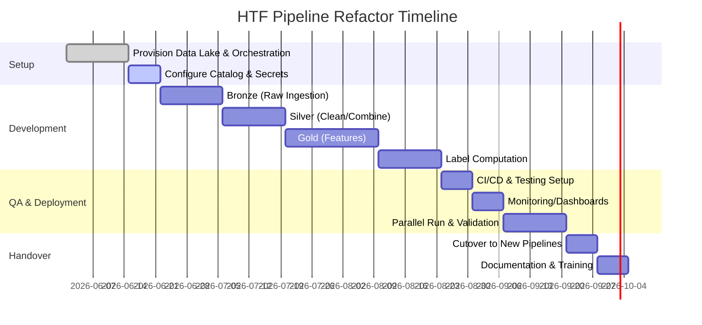

# Executive Summary  
The existing **RiskYieldMM** repository implements an HTF (Higher Time Frame) pipeline via a custom Python script (`notebooks/htf_pythonscript.py`) and its core logic in `scripts/feature_engineering/htf_multiregime_pipeline.py`【72†L128-L133】. This pipeline reads raw market data, builds canonical OHLCV bars, combines and batches them into 8h/24h/7d regimes, computes 1m/15m features, and generates labels and optimized feature tables. Outputs are stored under `data/htf_multiasset/{asset}/…` with subfolders like `htf_with_helpers`, `htf_4class_labels`, and so on【73†L25-L33】【21†L51-L57】. Each stage writes Parquet files plus JSON metadata manifests. 

However, the current design is monolithic and ad-hoc: there is no explicit **bronze–silver–gold** layering, no centralized metadata/catalog, limited separation of concerns, and few automation or governance features. To professionalize this pipeline, we recommend re-architecting into a formal data-lake system: ingest *raw data* into a Bronze layer, *clean/standardize* into Silver, and produce *feature tables* (the Gold layer) ready for ML. A dedicated **feature store** (e.g. Feast or Tecton) should manage feature definitions and serve training/serving data. We will incorporate lineage/metadata management (via a data catalog or OpenLineage), robust testing and CI/CD, and monitoring (data quality checks, drift detection, metrics). 

Below we first analyze the current repo’s code and data schemas, then discuss gaps/risks. We then detail the proposed modern data architecture (bronze→silver→gold with a feature store), metadata/versioning strategy, feature engineering best practices, storage/partitioning choices, orchestration/testing approach, observability, and security. Finally we outline a staged migration plan with a sample project layout, code snippets, tool-comparison tables, and a timeline (Gantt chart in Mermaid) for implementation.

## 1. Current Repo Analysis  

- **Pipeline Entrypoint and Logic:** The pipeline is launched by `notebooks/htf_pythonscript.py`, which sets up configuration and calls `scripts/feature_engineering/htf_multiregime_pipeline.py`【72†L128-L133】【21†L51-L57】. The latter (`MultiRegimeHTFConfig`) contains hard-coded parameters (regimes, asset list, thresholds, etc.) and orchestrates stages: building *canonical* OHLCV bars, *combined* 8h/24h/7d data for two “families” (shifted regimes), then *features*, *labels*, and *optimized features*, plus helper caches.  

- **Data Schemas & Metadata:** The **combined** output schema (`COMBINED_OUTPUT_COLS`) includes raw OHLCV plus many metadata columns. For example, each combined-parquet row has `timestamp, open, high, low, close, volume, period_8h_start, batch_id` plus *family metadata* (`batch_family`, `family_batch_id`, `family_period_start/end`, anchor/time-window fields, `asset_id`, `calendar_id`, session flags, etc.)【38†L199-L207】【33†L1554-L1563】. Labels tables (1m entry rows with multi-class targets) similarly carry label-window metadata (window start/end, policy, etc.)【73†L54-L59】. All outputs are written in Parquet with accompanying `_meta.json` manifests. These JSON files contain a rich audit trail: artifact version, family/regime, date ranges, row/batch counts, source-fingerprint (hashes of inputs), status (“created/current”), and other stats (e.g. missing, duplicate rows)【33†L1572-L1580】【42†L1735-L1743】.

- **Data Layout:** According to docs and code, raw and processed data reside under `data/htf_multiasset/{ASSET}`. Under each asset folder, we see:  
  - `htf_canonical_ohlcv/{resolution}/…` for normalized base bars.  
  - `htf_with_helpers*/1m/target_4class/batch_*.parquet` for final feature tables (the “gold” features)【73†L25-L33】.  
  - `htf_4class_labels*/1m/batch_*.parquet` for label tables (target classes)【73†L25-L33】.  
  - `htf_helper_cache/` for interim cached features.  
  (Exact subfolder names depend on regime/family; see docs snippet: lines [73†L25-L33] and [73†L54-L59].) Each batch file corresponds to one 8h regime block. In summary, the schema and naming conventions imply the pipeline creates versioned, batched outputs with embedded metadata (batch IDs and window markers)【38†L199-L207】【73†L25-L33】.

- **Batch Handling:** The code computes 8h-aligned periods using a function `_period_start_expr`. It assigns an integer `batch_id` to each distinct `period_8h_start`【33†L1536-L1544】. Thus each output row is tagged with its regime’s `batch_id`. Later stages join on these batch IDs. Incremental updates use these IDs and flags (`is_label_half`, etc.) to process only new/changed batches. The run preserves existing batches when possible, appending only fresh ones (if `feature_incremental_update=True` etc.)【45†L2134-L2143】. The batch-based design already reflects good practice by isolating data by time-window, but it is all hand-rolled rather than using a formal data-lake structure.

## 2. Gaps and Risks  

From this analysis, key gaps and risks in the current implementation include:

- **Monolithic, Hard-Coded Design:** The HTF pipeline logic is not modularized into reusable functions or distinct pipeline stages; it’s largely scripted as one workflow. Parameters (e.g. regimes, thresholds) are embedded or passed via many environment variables, making changes error-prone. This impedes readability and reuse.  

- **Lack of Clear Data Layers:** There is no explicit *bronze/silver/gold* separation. Raw data ingestion (from exchanges or external sources) is mixed with transformation logic. For example, canonicalization of OHLCV and building combined tables happen together, without a persistent raw-bronze table to fall back on.  

- **Limited Lineage/Catalog Support:** Though JSON manifests capture some lineage, there’s no centralized metadata catalog or UI. Analysts would have difficulty discovering which features exist and how they were computed. There is no facility to track schema changes over time beyond checking versions in logs.  

- **Testing and CI Shortcomings:** Apart from one contract-style test, there is minimal automated testing of data transformations or code. The repo comments mention manual unit tests moved out of CI due to billing. Without CI/CD, refactoring is risky.  

- **Orchestration/Version Control:** The pipeline is run as a script (manually or in simple loop), not scheduled by a workflow engine. Code deployment is manual (no git-triggered jobs), so reproducing or rolling back versions is difficult.  

- **Observability Gaps:** There are no built-in data-quality checks or monitoring dashboards. Failures in data (e.g. missing values, stale inputs) might go unnoticed until models degrade. Drift detection is absent. This is especially concerning for time-series where data patterns can shift.  

- **Storage Format/Partitioning Suboptimal:** The pipeline simply writes Parquet files per batch without, for example, partitioned folder hierarchies or ACID guarantees. Over time, managing these files (especially for large assets) could become unwieldy, and consistency issues could arise if multiple jobs write to the same location.  

These gaps translate to risks: pipelines could break without clear errors, data could become inconsistent, and the system is hard to maintain or extend. In the finance domain, lack of audit trails or data quality controls could even violate governance (e.g. if a bad data point leads to a trading loss).  

## 3. Proposed Architecture (Bronze–Silver–Gold with Feature Store)  

To address these issues, we propose refactoring into a **medallion architecture** (Bronze/Silver/Gold) with a feature store:

- **Bronze (Raw/Canonical Data):** Ingest all source OHLCV feeds into a *raw* layer (e.g. cloud storage or data lake). Minimal parsing is done here; data is stored in efficient columnar format (Parquet) partitioned by date and asset. One might also store exchange metadata or tick logs here. For example: `bronze/{asset}/{YYYY}/{MM}/{DD}/{asset}_raw.parquet`. This layer *captures original data fidelity* and enables reprocessing.【48†L113-L122】【48†L66-L74】  

- **Silver (Cleaned/Enriched Data):** Transform the bronze data into a *silver* layer. Here we **cleanse and normalize** the data (e.g. fill missing bars, adjust for splits, compute `is_market_open`, etc.). We also join any auxiliary data (like calendar or exchange info) and filter out invalid records. These tables can correspond to the “canonical OHLCV” outputs currently produced. Parquet (or Delta) tables in silver layer have enforced schemas; incremental updates append new day’s data. Silver data is ready for analysis, QA, or feeding feature pipelines.【48†L113-L122】【48†L66-L74】  

- **Gold (Features & Labels):** Build feature tables from silver. For each asset and regime, compute features and labels. We would store these in a *feature store*: an offline store (e.g. Parquet tables in a data lake or a warehouse) and an optional online store (e.g. key-value DB for serving). The offline store (Gold) contains *feature vectors with metadata*, partitioned by date or batch ID, ready for training. The feature store also maintains a **feature registry** – a catalog of feature definitions (with code, data sources, transformations, lineage). When building the pipeline, each feature computation is versioned (per code commit or semantic version), and the registry allows discovery and reuse【68†L294-L302】【33†L1572-L1580】.  

This medallion approach is a best practice (often called “Lakehouse” or “Medallion” architecture【48†L45-L53】【48†L66-L74】) and ensures a clean separation of concerns. The raw data layer acts as a single source of truth, enabling audit and reprocessing if needed【48†L113-L122】. The silver layer is curated and validated; the gold layer is optimized for ML.  

**Feature Store Integration:** In addition to data tables, we recommend employing a feature store like [Feast](https://feast.dev) or [Tecton](https://www.tecton.ai). These systems provide a managed registry of features and an API for serving them. For example, defining a feature in Feast automatically handles its offline and online storage. This reduces duplication (teams share features) and ensures **training-serving consistency**【68†L294-L302】. Feature stores also often include monitoring for feature freshness and drift.  

A summary table of tools is shown later, comparing choices like Feast vs Tecton vs Hopsworks for feature storage. 

## 4. Metadata, Lineage, and Governance  

We will implement a robust metadata strategy across all layers:

- **Schema & Versioning:** Define each dataset with an explicit schema (e.g. using Apache Avro or Delta schema). Every time the schema changes (e.g. new column added), record a new schema version. Store schemas centrally (e.g. in a Schema Registry or on-disk with version tags). If using Delta/Parquet, rely on the table’s metadata folder (Delta `_delta_log` or Iceberg metadata) to track evolution. This ensures readers are aware of field changes.【66†L25-L33】【66†L71-L74】  

- **Data Catalog:** Use a data catalog/metadata service (such as Amundsen, DataHub, or Apache Atlas) to ingest dataset metadata. This catalog will index all datasets in Bronze/Silver/Gold, including descriptions, owners, and lineage (e.g. “Gold Features Table X is derived from Silver Table Y”). This allows data scientists to search for features or tables and view lineage graphs.  

- **Provenance & Timestamps:** Each data record should carry provenance info: the original ingestion timestamp and source (exchange name, API, etc.). The pipeline should stamp output tables with processing time and pipeline version (this is partly done via the JSON manifests in the current system【33†L1572-L1580】). We can continue writing manifest metadata (or use Parquet/Delta commit info) that includes data ingestion date, processing date, and the git commit/branch of the code.  

- **Batch IDs & Partitioning:** We already assign integer `batch_id` per 8h window【33†L1536-L1544】. We should formalize this: e.g. partition each table by `asset_id, batch_regime, batch_id` (or by date). For example, store data on disk as `/silver/{asset}/{regime}/batch_id=00123/part-*.parquet`. The batch ID (or window start timestamp) becomes a key piece of metadata for joins.  

- **Audit Logging:** In addition to manifests, log pipeline events (start, end, failures) to a central log (e.g. ELK or a database). Each event record includes the dataset affected, batch ID range, and run result. This meets compliance needs by providing an audit trail of data operations.  

Overall, this means adopting data governance tools and practices (catalog, schema enforcement, audit logs) so that anyone can trace any feature back to raw inputs and see which code version produced it【68†L294-L302】.  

## 5. Feature Engineering Best Practices  

For feature engineering, we emphasize modularity, reusability, and monitoring:

- **Feature Registry:** As noted, every feature should be registered in a central registry. This might be automated via a feature store or a metadata repository. The registry includes feature name, description, dependencies, and expected semantics (e.g. “1m moving average of close price”). This avoids ad-hoc, undocumented features.  

- **Code Structure:** Each feature (or group of related features) should be implemented as an independent function or class. For example, a function `compute_moving_average(df, window)` returns a new column. Having unit tests for these functions ensures correctness. Our example code snippet below shows how to write a simple Polars feature transform with comments.  

- **Transformations:** Use vectorized operations (we use Polars as instructed) for speed and clarity. Avoid row-wise loops. Keep feature definitions deterministic (no randomness) and document any assumptions. For time-based features, clearly define how window boundaries work (current code uses “label half” flags and time windows).  

- **Reproducibility:** Version-control all transformation code. Use fixed seeds for any random operations. If using Spark or Polars, ensure UDFs have the same behavior on different runs. Employ notebooks only for exploration; put final transforms in scripts or DAG tasks.  

- **Drift Detection:** Continuously monitor features for distribution changes. For example, after each batch run, compute summary stats (mean, std, quantiles) and compare to baseline distributions (e.g. via statistical tests). Tools like [Evidently](https://docs.evidentlyai.com) or [Arize](https://arize.com) can automate this. In practice, we’d set up metrics on “fraction of missing values per feature”, “mean shift %”, etc., and fire alerts if thresholds exceeded (see Observability below). Drift monitoring is important because even a clean pipeline can produce invalid predictions if the market regime changes【51†L109-L117】.

- **Data Lineage for Features:** When a feature is computed, record its lineage – i.e. which raw columns and code produced it. This can be done by extending the JSON metadata manifest to list feature names and input columns. Some feature stores do this automatically. This way, if a feature is later found to be problematic, we can trace it back. 

In summary, we treat features as first-class data assets: each with definitions, version history, and quality checks. This is key for collaboration and maintenance【68†L294-L302】.

## 6. Storage Format and Partitioning  

We recommend using **columnar, partitioned, versioned tables** for all layers:

- **File Format:** Continue using Parquet for its compression and analytics efficiency, but add a transactional layer on top. Options include **Delta Lake** or **Apache Iceberg**, both of which store data in Parquet while adding ACID and schema features. Delta Lake (Databricks’ open-source project) provides built-in ACID transactions, scalable metadata, and schema enforcement【66†L25-L33】. Iceberg (Netflix/Tabular) offers similar time-travel and better schema evolution (full support for evolving columns)【66†L71-L74】. Either choice is acceptable; Delta is simpler on Spark, Iceberg is more engine-neutral.  

  | **Format**    | **ACID/Schema**                | **Time Travel** | **Pros**                                 |
  |---------------|-------------------------------|----------------|------------------------------------------|
  | Parquet (raw) | No ACID, no schema enforcement | No             | Simple, widely supported (fits Bronze)   |
  | Delta Lake    | Yes (log-based)【66†L25-L33】, enforces schema | Yes    | Built on Parquet, ACID, great Spark integration【66†L25-L33】 |
  | Apache Iceberg| Yes (snapshot-based), full schema evolution【66†L71-L74】 | Yes | Open format, works with Flink/Trino/Hive |
  
  This table summarizes the trade-offs. In practice, our Bronze (raw) can just use Parquet, but Silver/Gold should use Delta or Iceberg. Both support partitioning by columns. 

- **Partition Keys:** For time-series data, partitioning by date/time is natural. For example, partition the silver OHLCV tables by `date` (year,month,day) so each day is in its own folder. For regime-based batches (8h, 24h, 7d), we could further sub-partition: e.g. `/silver/{asset}/regime=8h/year=YYYY/week=W/`. The `batch_id` or `family_period_start` could also be a partition column if desired. The goal is to organize data to speed common queries (e.g. “give me all 1m features for Dec 2025”).  

  In Delta/Iceberg, we would register tables such as `silver_ohlcv_{asset}` and `gold_features_{asset}`, with partition spec on timestamp or date. For example: 
  ```
  CREATE TABLE silver_ohlcv_btcusdt (
    timestamp TIMESTAMP, open DOUBLE, high DOUBLE, ...,
    calendar_id STRING, is_market_open BOOL, ...
  )
  USING DELTA 
  PARTITIONED BY (year(timestamp), month(timestamp), day(timestamp));
  ```
  For gold (features), partition by regime and asset, and possibly date. 

- **Storage Location:** In a cloud or cluster, use durable object storage (e.g. AWS S3, GCS, or HDFS). This decouples compute from storage. Each table’s data files live in a well-defined path (e.g. `s3://datalake/bronze/…`, `.../silver/…`, `.../gold/…`). This also supports schema migrations via DDL rather than manual file moves.  

Implementing this means converting existing write logic: instead of writing to `data/htf_multiasset/...`, the code would write to the Delta/Iceberg tables. Many orchestration tools (e.g. Spark, Delta Lake) handle metadata updates automatically.

## 7. Orchestration, Versioning, and Testing  

We will introduce a workflow orchestration tool and rigorous testing to manage complexity:

- **Orchestration Tools:** Candidates include **Apache Airflow**, **Prefect**, or **Kedro** (as requested). Each has trade-offs (see table below). Airflow is the de facto standard for data pipelines; it uses Python DAGs and has rich scheduling and monitoring. Prefect 2.0 is more Pythonic and flexible (flows are code-centric, not YAML) and has built-in retries and states. Kedro is not a scheduler but a pipeline framework promoting modular code and a data catalog. One could combine them: use Kedro for structuring pipelines and Prefect/Airflow to run them.  

  | **Tool**    | **Type**          | **Use Case**                                                        | **Pros/Cons**                                                     |
  |-------------|-------------------|---------------------------------------------------------------------|-------------------------------------------------------------------|
  | Airflow     | Workflow Orchestrator | Batch job scheduling, ETL pipelines                            | Large community, mature UI, extensive integrations; can be heavy to configure |
  | Prefect 2.0 | Workflow (Python) | Code-first dynamic pipelines, data/ML workflows                       | Very Pythonic; nice UI; easy branching; less boilerplate than Airflow    |
  | Kedro       | Pipeline Framework | Modular pipeline development, focus on data engineering best practices | Enforces project structure; native pipeline testing; not a scheduler by itself |
  | *Choice:* Likely **Prefect** or **Airflow**. Prefect’s dynamic API fits ML pipelines, but Airflow’s stability may be preferred if the team is familiar with it. Regardless, all pipelines will be implemented as *idempotent tasks* with clear inputs/outputs. |

- **Versioning:** Code is version-controlled (Git). We will tag releases (e.g. v1.0, etc.). Pipeline configurations (e.g. regimes, date ranges) will be stored in YAML/JSON under `config/`. For data versioning, Delta/Iceberg maintain history (time travel). We can label critical tables with tags (e.g. `gold_features_btcusdt` tag `v1.2`). 

- **CI/CD:** Set up Continuous Integration using GitHub Actions or GitLab CI. Each PR should trigger linting, unit tests (e.g. `pytest` on transformation functions), and schema checks. On merge, run end-to-end tests on a small snapshot of data. Finally, a merge to `main` could automatically deploy pipeline code (e.g. update Airflow DAGs or Prefect flows).  

- **Testing:** Develop both unit and integration tests. Unit tests will cover feature functions (e.g. given a sample DataFrame, does the output column match expected?). Integration tests will run a pipeline stage on synthetic or limited real data and verify outcomes. The existing `tests/test_htf_workflow_contract.py` is a start, but we should expand it. We will also use **data tests**: for example, after the canonicalization stage, assert there are no null timestamps, or that each 8h period has the correct number of bars. Tools like [Great Expectations](https://greatexpectations.io/) can encode data expectations and run them as part of pipelines【57†L174-L183】.  

- **Dependency Management:** Use a consistent environment (e.g. Python virtualenv or Docker). List dependencies in `requirements.txt` or `environment.yml`. Containerizing the pipeline (Docker/OCI image) ensures the same Polars/Spark versions are used in development and production. 

## 8. Monitoring and Observability  

We will monitor both system health and data quality:

- **Data Quality Checks:** Implement expectations such as “no negative prices”, “volume >= 0”, “for each trading day, expect ~N rows”. Automate these checks after data is written. If a check fails, the pipeline should alert (e.g. send a Slack/email). Great Expectations or a similar framework can be used to define these tests in code and run them automatically.  

- **Metrics and Logging:** Collect metrics for each pipeline run: number of rows processed, runtime per stage, lag since last data, etc. Push these metrics to a monitoring system (Prometheus/Grafana or cloud monitoring). For example, count the number of batches processed each day, and set an alert if zero (indicating a break). Log-level alerts should catch exceptions.  

- **Drift/Distribution Monitoring:** As noted, measure feature distribution drift. For important features or assets, compute KL-divergence or population stability index each run, and alert if above threshold.  

- **Dashboarding:** Optionally build dashboards (e.g. in Grafana or a BI tool) that show pipeline status (last successful run times, schema versions, data volume trends). Data scientists should be able to see when features last updated.  

- **Alerting:** Tie the above checks into alerts. For example, if no new data has arrived for 24 hours, trigger an incident. If Great Expectations validation fails, send an error message. Use existing tooling (PagerDuty, Slack, email) as preferred.  

With these observability measures, we reduce the “nobody will know there’s bad data” risk, and create a feedback loop for data issues.  

## 9. Security and Compliance  

Finally, ensure data is handled securely:

- **Access Control:** Store all sensitive credentials (API keys, DB passwords) in a secrets manager (AWS Secrets Manager, Hashicorp Vault, etc.), not in code. Limit data access by role (e.g. analysts vs engineers).  

- **Encryption:** Encrypt data at rest (use encrypted S3 buckets or databases) and in transit (HTTPS). If any PII is present (unlikely in crypto prices, but possible for KYC data), use tokenization or hashing and limit who sees it.  

- **Audit Logging:** As mentioned, log all pipeline actions. In finance, it’s often required to show an audit trail of data transformations.  

- **Compliance:** Depending on jurisdictions, ensure time retention policies (delete or archive data older than required). Sanity-check that no copyrighted or user data is accidentally stored.  

These steps ensure the new pipeline not only works well but also meets enterprise governance standards.

## 10. Migration Plan and Incremental Refactor  

We recommend a staged migration, minimizing disruption:

1. **Set Up Infrastructure (Weeks 1–2):** Provision the new data storage (Delta Lake or Iceberg on S3/HDFS) and orchestration environment (e.g. Airflow cluster). Configure a data catalog if used.  
2. **Bronze Layer Implementation (Weeks 3–4):** Refactor the data ingestion and canonical OHLCV steps into a new Bronze pipeline. Read raw source files and write to a bronze Parquet/Delta table partitioned by date. Add unit tests to validate this stage.  
3. **Silver Layer (Weeks 5–7):** Build the cleaning and combination logic in a Silver pipeline. This corresponds to the existing “canonicalize and combined” stage. Write outputs to silver tables (Delta). Validate row counts match expectations (e.g. each 8h period yields exact bars).  
4. **Gold Features (Weeks 8–10):** Implement the feature computation stage as a modular pipeline or tasks. Use the feature store SDK (e.g. Feast) to define and compute features from the silver data. Store results in an offline feature table.  
5. **Label Computation (Weeks 11–12):** Port the label logic (4-class, breakfree) as a separate pipeline that reads the silver feature tables and produces label tables. Validate label consistency and update the feature registry with these target definitions.  
6. **Testing & CI Integration (Weeks 13–14):** Write comprehensive tests and set up CI/CD. Run end-to-end tests on small data samples. Ensure merges to `main` trigger jobs.  
7. **Monitoring & Alerting (Weeks 15–16):** Deploy Great Expectations or custom checks. Configure dashboards and alerts. Perform dry runs and fix any pipeline breaks.  
8. **Feature Store Serving (Weeks 17–18):** Set up the online store (e.g. Redis or Dynamo) if needed. Load current features for serving, test real-time queries.  
9. **Gradual Rollout (Weeks 19–20):** Run the new pipeline in parallel with the old scripts on live data. Compare outputs (the existing tests [73†L54-L59] help ensure “duplicate_count=0” etc.). Once confidence is high, decommission the old htf scripts.  

Each stage should be tested before moving on. The timeline below outlines this plan.



## 11. Code Example and Project Structure  

Below is a simple illustrative snippet showing how a feature might be computed using Polars (instead of pandas), with comments for clarity:

```python
import polars as pl

def compute_price_range(df: pl.DataFrame) -> pl.DataFrame:
    """
    Given a DataFrame `df` with columns ['open', 'close'], 
    compute the daily range (close - open) as a new feature.
    """
    # Ensure relevant columns exist
    assert "open" in df.columns and "close" in df.columns
    
    # Compute the range and alias it as 'daily_range'
    df = df.with_columns(
        (pl.col("close") - pl.col("open")).alias("daily_range")
    )
    # Cast to float64 for consistency
    df = df.with_columns(pl.col("daily_range").cast(pl.Float64))
    return df

# Example usage:
df_raw = pl.DataFrame({
    "open": [100.0, 102.5], 
    "close": [101.5, 101.0]
})
df_feat = compute_price_range(df_raw)
print(df_feat)
```

This code uses Polars to add a feature column, with comments explaining each step. In a real pipeline, such functions would live in `src/pipelines/features.py` or similar, and be invoked by the orchestrator.  

A proposed directory structure for the refactored pipeline might be:

```
RiskYieldMM/
├── data/                # Persisted datasets (raw, bronze, silver, gold)
│   ├── bronze/          # Raw ingested data
│   ├── silver/          # Cleaned/combined canonical data
│   └── gold/            # Feature/label tables (Delta/Iceberg)
├── src/                 # Project source code
│   ├── pipelines/       # Pipeline DAGs or flow definitions
│   │   ├── bronze.py
│   │   ├── silver.py
│   │   ├── features.py
│   │   └── labels.py
│   ├── models/          # (Optional) model training code
│   ├── utils/           # Helper modules (time, calendar, etc.)
│   └── config/          # YAML/JSON configurations (regimes, thresholds)
├── tests/               # Unit and integration tests (pytest)
├── notebooks/           # EDA and ad-hoc analysis notebooks
├── docs/                # Documentation (incl. data contracts, architecture)
├── .github/             # CI/CD workflows and issue templates
├── Dockerfile           # Container definition
└── pyproject.toml       # Package and dependency config
```

This clean structure separates raw data (`data/bronze`), processing code (`src/`), and artifacts (`tests/`, `docs/`).

## 12. Tool Comparison Tables  

Below are tables comparing some of the choices mentioned:

**Storage Format:**  

| Format        | ACID & Versioning        | Schema Evolution           | Time Travel | Notes                                    |
|---------------|--------------------------|----------------------------|-------------|------------------------------------------|
| **Parquet** (raw) | ✕ (no)                 | ✕ (manually via code)      | ✕ (no)      | Simple, efficient for OLAP; use for raw ingestion only. |
| **Delta Lake**  | ✓ (via transaction log)【66†L25-L33】 | ✓ (enforces)           | ✓           | Built on Parquet; ideal for Spark workflows; easy lakehouse setup【66†L25-L33】. |
| **Apache Iceberg** | ✓ (via snapshots)   | ✓ (full support)【66†L71-L74】  | ✓           | Works across engines (Spark, Flink, Trino); handles nested data well. |

**Feature Store:**  

| Store          | Type          | Offline Storage    | Online Store       | Notes                                         |
|----------------|---------------|--------------------|--------------------|-----------------------------------------------|
| **Feast**      | Open source   | Data warehouse/lake (BigQuery, S3, etc.) | Redis/DynamoDB     | Popular OSS; has registry for features【68†L294-L302】; good community.    |
| **Tecton**     | Commercial    | Supports various   | Tecton-managed     | Enterprise solution; has advanced MLops features (monitoring, drift detection). |
| **Hopsworks**  | OSS/Enterprise| HopsFS/Cloud Storage| Cassandra           | Integrated ML platform; supports feature versioning and lineage. |

**Orchestration:**  

| Orchestrator      | Language | Characteristics                                   |
|-------------------|----------|----------------------------------------------------|
| **Airflow**       | Python   | Mature DAG scheduler, many operators (RDBMS, Spark, etc.), strong UI. Suitable for batch ETL.【48†L113-L122】 |
| **Prefect 2.0**   | Python   | Code-first workflows, easy retries, built-in logging. Good for dynamic pipelines. |
| **Kedro**         | Python   | Framework for structuring pipelines (data catalog, modular nodes). Not a scheduler, but ensures reproducibility. |

Each choice should be evaluated for the team’s expertise and existing ecosystem. For example, if many Spark jobs are needed, Airflow or Databricks jobs might be natural. If the team prefers Pythonic code, Prefect or Kedro may be easier.

## 13. Conclusion  

In summary, we have outlined a path to modernize the HTF pipeline into a production-ready data engineering system. We leverage **bronze-silver-gold layers** to organize data, a **feature store** for ML features, and metadata/lineage tooling for governance. Storage will use Parquet on a transactional layer (Delta or Iceberg) with sensible partitioning. Orchestration with Airflow/Prefect (and optionally Kedro) plus CI/CD ensures reproducibility. Data quality and drift will be monitored continuously. 

This redesign addresses the current system’s risks by introducing modularity, versioning, and observability. It paves the way for reliable, scalable production pipelines. 

**Sources:** We based our analysis on the RiskYieldMM repository code and docs【72†L128-L133】【73†L25-L33】【33†L1572-L1580】【38†L199-L207】, and on best-practice references such as the Databricks medallion architecture guide【48†L45-L53】【48†L66-L74】, Databricks feature-store overview【68†L294-L302】, and Delta/Iceberg comparison【66†L25-L33】【66†L71-L74】, among others. These sources informed the recommendations above.